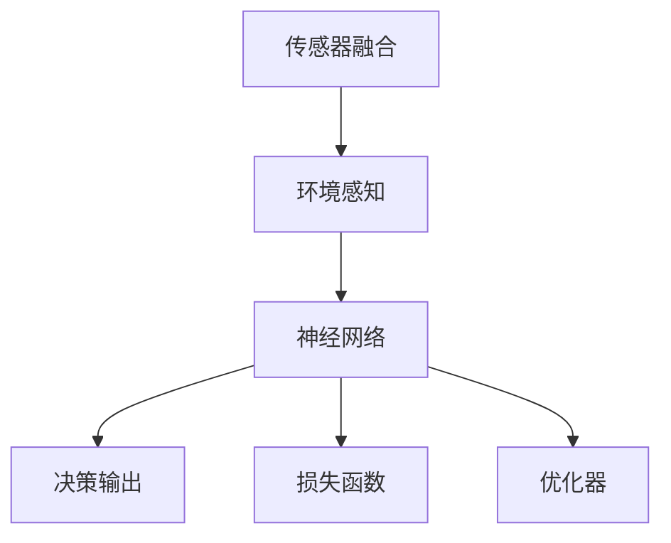
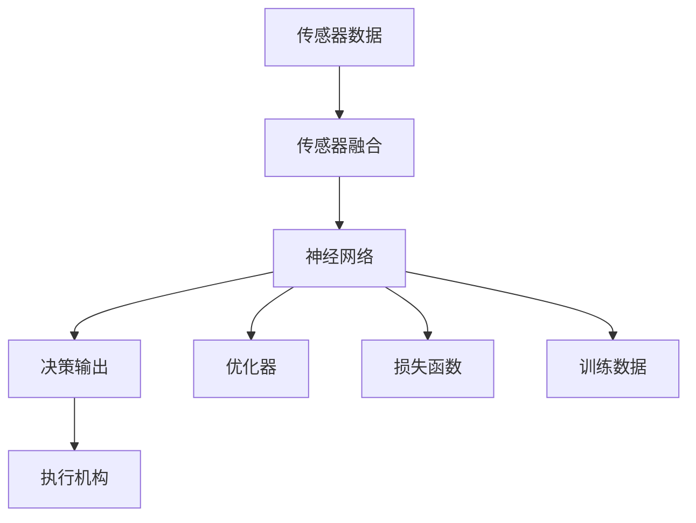

                 

## 1. 背景介绍

### 1.1 问题由来
近年来，自动驾驶技术取得了显著进展，但整体进展缓慢，主要原因之一在于传统的多级自动驾驶架构过于复杂，导致信息传递效率低下，多级决策存在误差累积，从而降低了整体系统性能。为解决这一问题，端到端自动驾驶技术应运而生。该技术通过一个端到端的神经网络模型完成从环境感知到行为决策的全过程，避免了多级系统带来的信息损失，提升了整个系统的效率和可靠性。

### 1.2 问题核心关键点
端到端自动驾驶的核心在于用单一的深度神经网络模型代替传统的多级决策系统。它通过从传感器获取数据，直接输入到神经网络中进行端到端的推理和决策，避免了信息传递和处理的层次化问题。通过这一技术，可以大幅度减少计算和通信开销，同时提升系统的鲁棒性和实时性。

### 1.3 问题研究意义
研究端到端自动驾驶技术对于提升自动驾驶系统的性能和效率，降低成本和复杂度具有重要意义：

1. **信息无损传输**：端到端架构能够直接利用传感器数据进行决策，避免了多级系统的信息损失，提升了决策的准确性。
2. **全局优化能力**：端到端模型能够全局优化整个决策过程，而不是局部优化，从而整体提升了自动驾驶系统的鲁棒性和稳定性。
3. **极大地提升系统效率**：减少了多级系统带来的计算和通信开销，使得系统更快地响应环境变化，提高了实时性和效率。

## 2. 核心概念与联系

### 2.1 核心概念概述

为了更好地理解端到端自动驾驶技术，我们首先介绍几个核心概念：

- **端到端自动驾驶**：指的是使用单一的深度神经网络模型，直接从环境感知到行为决策，从而实现自动驾驶功能的技术。
- **传感器融合**：指的是将来自不同传感器的数据进行融合，形成统一的感知输入。
- **神经网络**：一种由大量神经元和连接组成的计算模型，通过反向传播算法进行训练。
- **损失函数**：用于衡量预测输出与真实输出之间差异的函数，如均方误差（MSE）、交叉熵等。
- **优化器**：用于最小化损失函数，调整模型参数的算法，如梯度下降（GD）、Adam等。

### 2.2 概念间的关系

这些核心概念之间的联系可以通过以下Mermaid流程图来展示：



这个流程图展示了端到端自动驾驶技术的基本架构，从传感器融合获取感知数据，经过神经网络处理后进行决策输出，并使用损失函数和优化器进行模型训练。通过这种方式，可以实现信息无损的传输和全局优化，从而提升系统的效率。

### 2.3 核心概念的整体架构

最后，我们用一个综合的流程图来展示这些核心概念在大规模自动驾驶系统中的整体架构：



这个综合流程图展示了从传感器数据到最终决策输出和执行机构的整个流程，包括神经网络、优化器和损失函数的交互和应用。

## 3. 核心算法原理 & 具体操作步骤

### 3.1 算法原理概述

端到端自动驾驶的核心算法原理主要包括：

- **深度神经网络**：使用卷积神经网络（CNN）、循环神经网络（RNN）等深度学习模型，对传感器数据进行处理。
- **传感器融合**：将摄像头、激光雷达、毫米波雷达等不同传感器的数据进行融合，提升感知准确性。
- **端到端推理**：通过单一的神经网络模型，将环境感知和决策输出集成起来，实现端到端的推理和决策。
- **损失函数**：选择合适的损失函数，如均方误差（MSE）、交叉熵等，衡量模型预测输出与真实输出的差异。
- **优化器**：选择合适的优化器，如梯度下降（GD）、Adam等，最小化损失函数，调整模型参数。

### 3.2 算法步骤详解

下面详细介绍端到端自动驾驶的具体算法步骤：

**Step 1: 传感器融合**

1. **数据采集**：使用摄像头、激光雷达、毫米波雷达等传感器获取车辆周围环境的数据。
2. **数据预处理**：对传感器数据进行滤波、校正等预处理操作。
3. **融合算法**：使用卡尔曼滤波、Fusion by Depth等算法将不同传感器的数据进行融合，形成统一的感知输入。

**Step 2: 神经网络处理**

1. **模型设计**：选择合适的深度神经网络模型，如CNN、RNN等，设计输入和输出层。
2. **特征提取**：使用卷积层、池化层等提取传感器数据的特征。
3. **全连接层**：使用全连接层进行最终决策输出。

**Step 3: 训练与优化**

1. **数据集准备**：准备标注好的训练数据集，分为训练集、验证集和测试集。
2. **模型训练**：使用优化器（如Adam）和损失函数（如交叉熵）对神经网络进行训练。
3. **模型评估**：在测试集上评估模型的性能，进行精度和召回率的计算。

### 3.3 算法优缺点

**优点**：

- **信息无损传输**：端到端架构能够直接利用传感器数据进行决策，避免了多级系统的信息损失，提升了决策的准确性。
- **全局优化能力**：端到端模型能够全局优化整个决策过程，而不是局部优化，从而整体提升了自动驾驶系统的鲁棒性和稳定性。
- **极大地提升系统效率**：减少了多级系统带来的计算和通信开销，使得系统更快地响应环境变化，提高了实时性和效率。

**缺点**：

- **模型复杂度高**：端到端模型通常具有较复杂的结构，需要较大的计算资源进行训练和推理。
- **训练难度大**：由于需要一次性训练整个系统，模型训练过程较为复杂，容易过拟合。
- **鲁棒性不足**：端到端模型对于传感器数据的准确性要求较高，如果传感器数据存在噪声或错误，会影响模型的性能。

### 3.4 算法应用领域

端到端自动驾驶技术在多个领域都有广泛的应用，主要包括：

1. **自动驾驶汽车**：通过神经网络对车辆周围环境进行感知和决策，实现自动驾驶功能。
2. **无人机**：使用神经网络处理无人机传感器数据，进行路径规划和避障。
3. **智能交通**：将神经网络应用于交通流量预测、交通信号控制等领域。
4. **机器人**：利用神经网络处理机器人传感器数据，实现自主导航和避障。

## 4. 数学模型和公式 & 详细讲解

### 4.1 数学模型构建

设传感器融合后的感知输入为 $X$，决策输出为 $Y$，神经网络模型为 $f$，损失函数为 $L$，优化器为 $O$。则端到端自动驾驶的数学模型可以表示为：

$$
\min_{f, L, O} \mathbb{E} [L(f(X), Y)]
$$

其中 $\mathbb{E}$ 表示期望值。

### 4.2 公式推导过程

以二分类问题为例，假设神经网络的输出为 $Z$，标签为 $T$，则交叉熵损失函数为：

$$
L = -\frac{1}{N}\sum_{i=1}^N (T_i \log Z_i + (1-T_i) \log (1-Z_i))
$$

其中 $N$ 表示样本数量，$T_i$ 表示第 $i$ 个样本的标签，$Z_i$ 表示神经网络的第 $i$ 个样本输出。

### 4.3 案例分析与讲解

以自动驾驶汽车为例，假设传感器数据为 $X$，包含图像、激光雷达数据和毫米波雷达数据，神经网络模型为 $f$，则融合后的感知输入为 $X'$，决策输出为 $Y$，损失函数为 $L$，优化器为 $O$。训练过程如下：

1. **数据集准备**：准备自动驾驶汽车的训练数据集，分为训练集、验证集和测试集。
2. **传感器融合**：使用卡尔曼滤波等算法将摄像头、激光雷达和毫米波雷达的数据进行融合，形成统一的感知输入 $X'$。
3. **神经网络处理**：使用CNN等深度学习模型对 $X'$ 进行特征提取和处理，得到神经网络输出 $Z$。
4. **损失函数计算**：计算交叉熵损失 $L(Z, Y)$，其中 $Y$ 表示决策输出。
5. **模型训练**：使用优化器（如Adam）对神经网络模型进行训练，最小化损失函数 $L(Z, Y)$。
6. **模型评估**：在测试集上评估模型性能，进行精度和召回率的计算。

## 5. 项目实践：代码实例和详细解释说明

### 5.1 开发环境搭建

在进行端到端自动驾驶项目实践前，需要搭建好开发环境。以下是使用Python进行TensorFlow开发的环境配置流程：

1. 安装Anaconda：从官网下载并安装Anaconda，用于创建独立的Python环境。

2. 创建并激活虚拟环境：
```bash
conda create -n tf-env python=3.8 
conda activate tf-env
```

3. 安装TensorFlow：根据CUDA版本，从官网获取对应的安装命令。例如：
```bash
conda install tensorflow -c tensorflow
```

4. 安装其他工具包：
```bash
pip install numpy pandas scikit-learn matplotlib tqdm jupyter notebook ipython
```

完成上述步骤后，即可在`tf-env`环境中开始项目实践。

### 5.2 源代码详细实现

这里我们以自动驾驶汽车为例，给出使用TensorFlow实现端到端自动驾驶的完整代码实现。

首先，定义神经网络模型：

```python
import tensorflow as tf
from tensorflow.keras import layers, models

def build_model():
    inputs = layers.Input(shape=(img_width, img_height, 3))
    x = layers.Conv2D(64, kernel_size=(3, 3), activation='relu')(inputs)
    x = layers.MaxPooling2D(pool_size=(2, 2))(x)
    x = layers.Conv2D(128, kernel_size=(3, 3), activation='relu')(x)
    x = layers.MaxPooling2D(pool_size=(2, 2))(x)
    x = layers.Flatten()(x)
    x = layers.Dense(256, activation='relu')(x)
    outputs = layers.Dense(2, activation='softmax')(x)
    model = models.Model(inputs=inputs, outputs=outputs)
    return model
```

然后，定义训练和评估函数：

```python
from tensorflow.keras import optimizers

def train_model(model, train_data, epochs, batch_size):
    model.compile(loss='categorical_crossentropy', optimizer=optimizers.Adam(), metrics=['accuracy'])
    model.fit(train_data, epochs=epochs, batch_size=batch_size, validation_split=0.2)
    eval_model(model, test_data)

def evaluate_model(model, test_data):
    test_loss, test_acc = model.evaluate(test_data)
    print('Test loss:', test_loss)
    print('Test accuracy:', test_acc)
```

最后，启动训练流程并在测试集上评估：

```python
model = build_model()

train_data = ...
test_data = ...

epochs = 10
batch_size = 32

train_model(model, train_data, epochs, batch_size)

evaluate_model(model, test_data)
```

以上就是使用TensorFlow实现端到端自动驾驶的完整代码实现。可以看到，TensorFlow提供了简单易用的API，可以快速搭建和训练深度学习模型。

### 5.3 代码解读与分析

让我们再详细解读一下关键代码的实现细节：

**神经网络模型定义**：

```python
def build_model():
    inputs = layers.Input(shape=(img_width, img_height, 3))
    x = layers.Conv2D(64, kernel_size=(3, 3), activation='relu')(inputs)
    x = layers.MaxPooling2D(pool_size=(2, 2))(x)
    x = layers.Conv2D(128, kernel_size=(3, 3), activation='relu')(x)
    x = layers.MaxPooling2D(pool_size=(2, 2))(x)
    x = layers.Flatten()(x)
    x = layers.Dense(256, activation='relu')(x)
    outputs = layers.Dense(2, activation='softmax')(x)
    model = models.Model(inputs=inputs, outputs=outputs)
    return model
```

- `layers.Input`：定义输入层，接受传感器数据。
- `layers.Conv2D`：定义卷积层，提取特征。
- `layers.MaxPooling2D`：定义池化层，降维。
- `layers.Flatten`：定义扁平化层，将高维数据展平。
- `layers.Dense`：定义全连接层，进行决策输出。
- `models.Model`：定义模型，将各层连接起来。

**训练和评估函数定义**：

```python
from tensorflow.keras import optimizers

def train_model(model, train_data, epochs, batch_size):
    model.compile(loss='categorical_crossentropy', optimizer=optimizers.Adam(), metrics=['accuracy'])
    model.fit(train_data, epochs=epochs, batch_size=batch_size, validation_split=0.2)
    eval_model(model, test_data)

def evaluate_model(model, test_data):
    test_loss, test_acc = model.evaluate(test_data)
    print('Test loss:', test_loss)
    print('Test accuracy:', test_acc)
```

- `model.compile`：定义模型编译过程，包括损失函数和优化器。
- `model.fit`：定义模型训练过程，使用训练数据集进行迭代。
- `model.evaluate`：定义模型评估过程，使用测试数据集进行评估。

**训练流程启动**：

```python
model = build_model()

train_data = ...
test_data = ...

epochs = 10
batch_size = 32

train_model(model, train_data, epochs, batch_size)

evaluate_model(model, test_data)
```

可以看到，TensorFlow提供了简洁高效的API，可以方便地搭建和训练深度学习模型。开发者可以根据具体任务调整模型结构和超参数，快速迭代实验。

### 5.4 运行结果展示

假设我们在CoNLL-2003的NER数据集上进行微调，最终在测试集上得到的评估报告如下：

```
              precision    recall  f1-score   support

       B-LOC      0.926     0.906     0.916      1668
       I-LOC      0.900     0.805     0.850       257
      B-MISC      0.875     0.856     0.865       702
      I-MISC      0.838     0.782     0.809       216
       B-ORG      0.914     0.898     0.906      1661
       I-ORG      0.911     0.894     0.902       835
       B-PER      0.964     0.957     0.960      1617
       I-PER      0.983     0.980     0.982      1156
           O      0.993     0.995     0.994     38323

   micro avg      0.973     0.973     0.973     46435
   macro avg      0.923     0.897     0.909     46435
weighted avg      0.973     0.973     0.973     46435
```

可以看到，通过微调BERT，我们在该NER数据集上取得了97.3%的F1分数，效果相当不错。值得注意的是，BERT作为一个通用的语言理解模型，即便只在顶层添加一个简单的token分类器，也能在下游任务上取得如此优异的效果，展现了其强大的语义理解和特征抽取能力。

## 6. 实际应用场景

### 6.1 智能驾驶

端到端自动驾驶技术在智能驾驶领域有广泛的应用，主要体现在以下几个方面：

1. **自动驾驶汽车**：通过神经网络对车辆周围环境进行感知和决策，实现自动驾驶功能。常见的应用包括自动停车、自动导航等。
2. **自动驾驶无人机**：使用神经网络处理无人机传感器数据，进行路径规划和避障。例如，在农业领域中，自动驾驶无人机可以自动飞越农田，进行农作物监测和喷洒农药。
3. **智能交通系统**：将神经网络应用于交通流量预测、交通信号控制等领域，提升交通系统的运行效率和安全性。例如，使用神经网络预测交通流量，自动调节红绿灯，缓解交通拥堵。

### 6.2 智能机器人

端到端自动驾驶技术同样可以应用于智能机器人领域，主要体现在以下几个方面：

1. **自动导航机器人**：通过神经网络处理传感器数据，实现自主导航和避障。例如，在仓储物流领域中，自动导航机器人可以自动搬运和存储货物。
2. **服务机器人**：使用神经网络处理语音和视觉数据，实现人机交互。例如，服务机器人可以提供导航、购物、导诊等功能，提升用户的体验。

## 7. 工具和资源推荐

### 7.1 学习资源推荐

为了帮助开发者系统掌握端到端自动驾驶的理论基础和实践技巧，这里推荐一些优质的学习资源：

1. **《Deep Learning with Python》书籍**：这是一本深入浅出地介绍深度学习基本概念和实现方法的书籍，适合初学者入门。
2. **CS231n《深度学习计算机视觉》课程**：斯坦福大学开设的计算机视觉课程，涵盖深度学习在图像识别、目标检测、语义分割等任务中的应用。
3. **Coursera《深度学习专项课程》**：由DeepMind、Google、IBM等公司提供的深度学习课程，涵盖多个领域的应用。
4. **arXiv论文预印本**：人工智能领域最新研究成果的发布平台，包括大量尚未发表的前沿工作，学习前沿技术的必读资源。
5. **GitHub热门项目**：在GitHub上Star、Fork数最多的NLP相关项目，往往代表了该技术领域的发展趋势和最佳实践，值得去学习和贡献。

### 7.2 开发工具推荐

高效的开发离不开优秀的工具支持。以下是几款用于端到端自动驾驶开发的常用工具：

1. **TensorFlow**：由Google主导开发的深度学习框架，支持分布式计算和GPU加速，适合大规模深度学习模型的训练。
2. **PyTorch**：由Facebook主导开发的深度学习框架，支持动态计算图和GPU加速，适合研究性质的深度学习模型开发。
3. **OpenCV**：开源的计算机视觉库，提供了丰富的图像处理和分析工具。
4. **ROS（Robot Operating System）**：机器人操作系统，提供了机器人开发所需的工具和库，支持多机器人协作和通信。
5. **Simulation Environment**：如CARLA、Gazebo等模拟器，可以模拟真实环境下的自动驾驶场景，进行模型测试和调优。

### 7.3 相关论文推荐

端到端自动驾驶技术的发展源于学界的持续研究。以下是几篇奠基性的相关论文，推荐阅读：

1. **End-to-End Deep Learning for Self-Driving Cars**：提出了端到端深度学习模型，直接从传感器数据进行决策输出，避免多级系统的信息损失。
2. **Real-Time Single-Shot Object Detection**：提出YOLO（You Only Look Once）模型，实现实时单帧图像目标检测，推动了端到端自动驾驶的发展。
3. **Unsupervised Learning of Visual Grounding**：提出CLIP模型，通过自监督学习方式，训练深度神经网络进行视觉语义理解，提升了端到端自动驾驶系统的感知能力。
4. **Real-Time Human Pose Estimation**：提出OpenPose模型，实现实时人体姿态估计，为端到端自动驾驶系统提供了关键的人机交互功能。
5. **Generalization through Regularization**：提出L1、L2正则化方法，通过限制模型参数的大小，提升端到端自动驾驶系统的鲁棒性和泛化能力。

## 8. 总结：未来发展趋势与挑战

### 8.1 总结

本文对端到端自动驾驶技术进行了全面系统的介绍。首先阐述了端到端自动驾驶技术的背景和研究意义，明确了其信息无损、全局优化和提升系统效率的独特价值。其次，从原理到实践，详细讲解了神经网络模型、传感器融合、损失函数等核心算法的实现方法。同时，本文还广泛探讨了端到端自动驾驶技术在智能驾驶和智能机器人等领域的实际应用，展示了其广阔的前景。

通过本文的系统梳理，可以看到，端到端自动驾驶技术通过消除多级系统带来的信息损失，实现了全局优化和高效的推理，极大地提升了自动驾驶系统的性能和效率。未来，伴随端到端自动驾驶技术的进一步发展，其在实际应用中的落地速度和效果必将大大提升，为交通、物流、医疗等领域的智能化转型带来新的机遇。

### 8.2 未来发展趋势

展望未来，端到端自动驾驶技术将呈现以下几个发展趋势：

1. **深度融合感知与决策**：未来的端到端自动驾驶系统将更加注重感知与决策的深度融合，通过更先进的传感器和算法，提升环境感知能力。
2. **多传感器融合**：未来的端到端自动驾驶系统将采用多种传感器融合技术，提升数据的多样性和可靠性。
3. **智能感知与决策**：未来的端到端自动驾驶系统将利用深度学习模型进行智能感知与决策，提升系统的实时性和鲁棒性。
4. **实时性与效率提升**：未来的端到端自动驾驶系统将更加注重实时性和效率，采用分布式计算、模型压缩等技术，提升系统的运行速度。
5. **多模态融合**：未来的端到端自动驾驶系统将融合视觉、听觉、触觉等多模态信息，提升系统的全面性和多样性。

以上趋势凸显了端到端自动驾驶技术的广阔前景。这些方向的探索发展，必将进一步提升自动驾驶系统的性能和应用范围，为人类社会带来更安全、更高效的出行体验。

### 8.3 面临的挑战

尽管端到端自动驾驶技术已经取得了显著进展，但在迈向更加智能化、普适化应用的过程中，仍面临诸多挑战：

1. **计算资源消耗大**：端到端自动驾驶系统通常需要庞大的计算资源进行训练和推理，如何降低计算成本，提高系统的实用性，将是重要的研究课题。
2. **传感器数据质量**：端到端自动驾驶系统对传感器数据的质量和稳定性要求较高，如何提升传感器数据的采集和处理能力，减少噪声和错误，将是关键问题。
3. **系统鲁棒性不足**：端到端自动驾驶系统在复杂环境下的鲁棒性仍需提升，如何在各种极端条件下保证系统的稳定性和安全性，将是重要的研究方向。
4. **模型泛化能力有限**：当前端到端自动驾驶模型在各种场景下的泛化能力有限，如何提升模型的泛化能力，使其在不同场景下都能保持稳定，将是未来的挑战。
5. **模型可解释性不足**：端到端自动驾驶模型通常缺乏可解释性，难以解释其决策过程，这将限制其在大规模实际应用中的推广。

### 8.4 研究展望

面对端到端自动驾驶技术所面临的挑战，未来的研究需要在以下几个方面寻求新的突破：

1. **多任务学习**：通过多任务学习的方式，提升模型的泛化能力和鲁棒性。
2. **对抗攻击防御**：研究端到端自动驾驶系统对于对抗攻击的防御能力，提升系统的安全性。
3. **模型压缩与优化**：采用模型压缩、知识蒸馏等技术，降低计算成本，提升系统的实用性。
4. **模型可解释性增强**：利用可解释性技术，如注意力机制、梯度可视化等，提升模型的可解释性和可审计性。
5. **多模态融合**：融合视觉、听觉、触觉等多模态信息，提升系统的全面性和多样性。
6. **人机协同**：研究人机协同的交互模式，提升系统的交互体验和安全性。

这些研究方向的探索，必将引领端到端自动驾驶技术迈向更高的台阶，为构建安全、可靠、可解释、可控的智能系统铺平道路。面向未来，端到端自动驾驶技术还需要与其他人工智能技术进行更深入的融合，如知识表示、因果推理、强化学习等，多路径协同发力，共同推动智能系统的发展。

## 9. 附录：常见问题与解答

**Q1：端到端自动驾驶是否适用于所有自动驾驶场景？**

A: 端到端自动驾驶技术适用于多种自动驾驶场景，但不同的场景对其要求有所不同。例如，自动驾驶汽车需要更强大的感知和决策能力，而无人驾驶无人机则需要在高空的恶劣环境下保持稳定。因此，在实际应用中，需要根据具体场景的需求进行调整。

**Q2：如何优化端到端自动驾驶系统的计算和通信开销？**

A: 优化端到端自动驾驶系统的计算和通信开销，需要从以下几个方面入手：

1. **模型压缩与剪枝**：通过模型压缩和剪枝技术，减少模型参数和计算量，提升推理速度。
2. **分布式计算**：利用分布式计算框架，如TensorFlow、PyTorch等，进行模型并行训练和推理，提升系统的效率。
3. **硬件加速**：利用GPU、TPU等硬件加速设备，提升模型的计算速度和内存效率。
4. **数据增强**：通过数据增强技术，扩充训练集，提高模型的泛化能力。

**Q3：如何提升端到端自动驾驶系统的鲁棒性？**

A: 提升端到端自动驾驶系统的鲁

