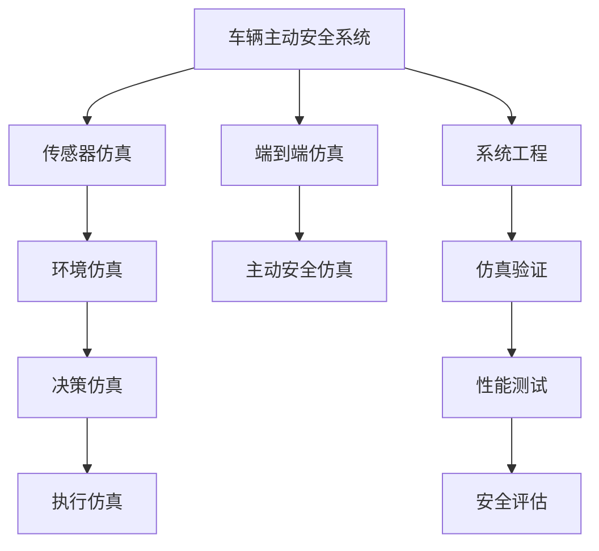

                 

# 端到端自动驾驶的车辆主动安全仿真验证

> 关键词：自动驾驶,车辆主动安全,仿真验证,自动驾驶系统,安全性能评估,系统工程

## 1. 背景介绍

### 1.1 问题由来
随着人工智能和大数据技术的快速发展，自动驾驶系统（Autonomous Driving System, ADS）已经成为当前最热门的技术之一。其核心技术包括感知、决策和执行三大模块。车辆主动安全系统（Vehicle Active Safety System, VASS）作为自动驾驶的关键组件，在提升车辆驾驶安全方面发挥着重要作用。但仅通过实际道路测试来验证车辆主动安全性能存在诸多限制，如测试场景受限、数据获取成本高、实验周期长等。

为了更高效、经济、安全地验证车辆主动安全性能，利用仿真验证成为一种重要的手段。传统的车辆主动安全仿真方法仅针对某一层次进行仿真，如传感器仿真、环境仿真等。而端到端的自动驾驶车辆主动安全仿真验证方法，基于连续的动态仿真技术，可以模拟从传感器输入到车辆控制的全过程，具有更高的准确性和可靠性。

### 1.2 问题核心关键点
本节将介绍车辆主动安全仿真的核心概念，阐述端到端仿真的基本原理和实现流程，明确其优缺点及应用领域，同时分析未来发展趋势和面临的挑战。

## 2. 核心概念与联系

### 2.1 核心概念概述

为更好地理解车辆主动安全仿真方法，本节将介绍几个关键概念：

- **车辆主动安全系统(Vehicle Active Safety System, VASS)**：指通过传感器、控制器、执行器等组件，对车辆周围环境进行感知、决策和执行，防止交通事故发生的一套系统。

- **仿真验证(Verification through Simulation)**：利用虚拟仿真环境，重现实际交通场景中的车辆动态行为，进行性能测试和安全评估的一种方法。

- **端到端仿真(End-to-End Simulation)**：一种高级仿真技术，可以模拟从传感器输入到车辆控制的全过程，模拟从环境感知、决策制定到执行器控制的连续动态过程。

- **主动安全仿真(Proactive Safety Simulation)**：通过仿真手段模拟车辆在复杂交通环境下的主动安全性能，如车辆紧急制动、车道保持、避障等。

- **系统工程(System Engineering)**：涉及系统设计、开发、验证、部署及维护的全生命周期管理。在车辆主动安全仿真中，系统工程方法指导整个仿真流程，确保仿真结果可靠、可信。

### 2.2 概念间的关系

这些核心概念之间的联系可以通过以下Mermaid流程图来展示：



这个流程图展示了车辆主动安全仿真中关键组件及其相互关系：

1. 车辆主动安全系统包括传感器、环境、决策、执行等多个组成部分，通过端到端仿真方法进行连续动态模拟。
2. 传感器仿真、环境仿真、决策仿真、执行仿真分别针对不同层次进行仿真，最终通过系统工程方法集成，形成端到端仿真。
3. 主动安全仿真通过仿真验证车辆在复杂环境下的主动安全性能，确保仿真结果可信。
4. 系统工程方法指导整个仿真流程，确保仿真结果的可靠性。

这些概念共同构成了车辆主动安全仿真的完整框架，通过系统工程方法，将各个层次的仿真整合，实现连续动态的端到端仿真，确保模拟结果的真实性。

## 3. 核心算法原理 & 具体操作步骤

### 3.1 算法原理概述

车辆主动安全仿真涉及从传感器数据处理到车辆控制决策的全过程。其核心算法包括：

- **传感器仿真**：模拟传感器（如雷达、摄像头、激光雷达）在复杂环境中的感知行为，生成虚拟传感数据。
- **环境仿真**：构建虚拟交通环境，包括道路、车辆、行人等元素，以及各种交通标志和信号灯。
- **决策仿真**：模拟车辆智能决策系统，如车道保持、紧急制动、避障等，根据传感器数据和环境信息进行决策。
- **执行仿真**：模拟车辆执行系统，如转向、加速、制动等，根据决策系统输出进行控制。

端到端仿真算法将上述各层次的仿真过程进行连续动态模拟，形成完整的仿真闭环。其基本原理是通过在虚拟环境中模拟实际驾驶场景，对车辆主动安全性能进行评估和验证。

### 3.2 算法步骤详解

车辆主动安全端到端仿真的一般步骤包括：

**Step 1: 系统设计**
- 确定仿真场景、目标和测试指标。
- 设计传感器、决策和执行子系统的仿真模型。
- 设定环境参数和车辆动力学模型。

**Step 2: 数据生成**
- 生成虚拟传感数据，如雷达点云、摄像头图像、激光雷达数据等。
- 构建虚拟交通环境，包括道路、车辆、行人等元素。

**Step 3: 决策制定**
- 利用传感器数据和环境信息，进行感知和环境建模。
- 使用决策算法进行车道保持、紧急制动、避障等行为决策。

**Step 4: 控制执行**
- 根据决策系统输出，模拟转向、加速、制动等控制行为。
- 验证车辆在复杂环境中的主动安全性能。

**Step 5: 结果分析**
- 分析仿真结果，评估车辆主动安全性能。
- 进行结果验证和优化。

### 3.3 算法优缺点

**优点**：
- 可重复性高。仿真环境可以多次重复，每次验证结果一致，减少实验成本。
- 可控性高。虚拟环境可以自由设定，模拟各种极端和特殊场景，提高测试覆盖率。
- 安全性高。无需真人实验，减少因人为因素导致的交通事故风险。

**缺点**：
- 仿真环境与真实环境存在差异。尽管仿真环境可以模拟复杂场景，但仍难以完全复现真实环境的复杂性。
- 仿真精度受限于算法和模型。高精度的仿真需要复杂的算法和准确的模型，开发和验证周期长。
- 仿真结果可靠性依赖于仿真模型和算法。模型的合理性和算法的有效性直接影响仿真结果的准确性。

### 3.4 算法应用领域

车辆主动安全仿真技术可以应用于多个领域，如汽车制造、智能交通、自动驾驶等，具体应用如下：

- **汽车制造**：在车辆开发阶段，通过仿真验证车辆主动安全性能，提升车辆质量。
- **智能交通**：评估智能交通系统中的车辆主动安全性能，优化交通信号控制和交通管理。
- **自动驾驶**：通过仿真验证自动驾驶车辆在复杂环境中的主动安全性能，提升系统安全性。
- **主动安全系统优化**：优化车辆主动安全系统的算法和参数，提升系统性能。

此外，车辆主动安全仿真技术还可以用于教育培训、事故再现、政策制定等方面，具有广泛的应用前景。

## 4. 数学模型和公式 & 详细讲解

### 4.1 数学模型构建

车辆主动安全仿真涉及多个层次的数学模型，包括传感器模型、环境模型、决策模型和执行模型。以车辆避障仿真为例，其数学模型构建如下：

**传感器模型**：
- 传感器模型用于生成虚拟传感数据，如雷达点云、摄像头图像等。
- 传感器模型可以表示为：
  $$
  \mathbf{x}_s = f_s(\mathbf{v}_s, \mathbf{t}_s, \mathbf{p}_s, \mathbf{d}_s)
  $$
  其中，$\mathbf{x}_s$为传感器数据，$\mathbf{v}_s$为传感器速度，$\mathbf{t}_s$为传感器时间，$\mathbf{p}_s$为传感器位置，$\mathbf{d}_s$为传感器方向。

**环境模型**：
- 环境模型用于构建虚拟交通环境，包括道路、车辆、行人等元素。
- 环境模型可以表示为：
  $$
  \mathbf{E} = g(\mathbf{p}_r, \mathbf{v}_r, \mathbf{a}_r)
  $$
  其中，$\mathbf{E}$为环境状态，$\mathbf{p}_r$为道路参数，$\mathbf{v}_r$为车辆速度，$\mathbf{a}_r$为车辆加速度。

**决策模型**：
- 决策模型用于进行车道保持、紧急制动、避障等行为决策。
- 决策模型可以表示为：
  $$
  \mathbf{u}_d = h(\mathbf{x}_s, \mathbf{E})
  $$
  其中，$\mathbf{u}_d$为决策输出，$h$为决策算法。

**执行模型**：
- 执行模型用于模拟车辆控制行为，如转向、加速、制动等。
- 执行模型可以表示为：
  $$
  \mathbf{v}_e = k(\mathbf{u}_d, \mathbf{E})
  $$
  其中，$\mathbf{v}_e$为执行器控制行为，$k$为执行算法。

### 4.2 公式推导过程

以车辆避障仿真为例，推导其数学模型和仿真过程。

**传感器模型**：
- 假设雷达传感器在车辆前方固定位置，其点云数据可以表示为：
  $$
  \mathbf{x}_s = [d_1, d_2, \dots, d_n]
  $$
  其中，$d_i$为雷达到第$i$个障碍物的距离。

**环境模型**：
- 假设车辆位于道路中央，其速度为$v_r$，加速度为$a_r$，则车辆在$t$时刻的位置和速度可以表示为：
  $$
  \mathbf{p}_r = \mathbf{p}_0 + v_r t + \frac{1}{2} a_r t^2
  $$
  $$
  \mathbf{v}_r = v_r
  $$

**决策模型**：
- 假设车辆避障决策为“转向”或“制动”，则决策输出可以表示为：
  $$
  \mathbf{u}_d = \begin{cases}
  u_{turn} & \text{if } d_i < d_{th}, i = 1, 2, \dots, n \\
  u_{brake} & \text{if } d_i > d_{th}, i = 1, 2, \dots, n
  \end{cases}
  $$
  其中，$d_{th}$为阈值距离，$u_{turn}$和$u_{brake}$分别为转向和制动的决策输出。

**执行模型**：
- 假设车辆执行转向时，转向角度为$\theta$，则转向行为可以表示为：
  $$
  \mathbf{v}_e = \mathbf{v}_0 + \omega \times \mathbf{p}_0 + \mathbf{a}_e t
  $$
  其中，$\omega$为转向角速度，$\mathbf{a}_e$为转向加速度，$t$为执行时间。

通过上述模型，可以构建车辆避障的端到端仿真过程，模拟车辆在复杂环境中的主动安全性能。

### 4.3 案例分析与讲解

以车辆避障仿真为例，展示其数学模型和仿真过程。

**案例场景**：
- 假设车辆在高速公路上行驶，前方出现障碍物。

**仿真步骤**：
1. **传感器仿真**：通过雷达传感器获取障碍物位置信息，生成雷达点云数据。
2. **环境仿真**：构建虚拟交通环境，设置车辆位置、速度和加速度。
3. **决策仿真**：根据雷达点云数据和环境信息，进行避障决策，输出转向或制动的决策指令。
4. **执行仿真**：根据决策指令，模拟车辆转向或制动行为，并验证车辆避障性能。

假设雷达点云数据为$d_1 = 10m, d_2 = 5m, d_3 = 15m$，车辆初始位置为$(p_0, v_0, a_0)$，转向角速度为$\omega$，转向加速度为$a_e$，阈值距离为$d_{th} = 5m$。

根据上述模型和数据，可以模拟车辆避障过程：

1. **传感器数据**：
   $$
   \mathbf{x}_s = [10, 5, 15]
   $$
2. **环境参数**：
   $$
   \mathbf{p}_r = (p_0, v_0, a_0)
   $$
3. **决策输出**：
   $$
   \mathbf{u}_d = \begin{cases}
   u_{turn} & \text{if } d_i < d_{th}, i = 1, 2, \dots, n \\
   u_{brake} & \text{if } d_i > d_{th}, i = 1, 2, \dots, n
   \end{cases}
   $$
4. **执行行为**：
   $$
   \mathbf{v}_e = \mathbf{v}_0 + \omega \times \mathbf{p}_0 + \mathbf{a}_e t
   $$

通过上述步骤，可以模拟车辆在复杂环境中的避障行为，验证车辆主动安全性能。

## 5. 项目实践：代码实例和详细解释说明

### 5.1 开发环境搭建

在进行车辆主动安全仿真实践前，我们需要准备好开发环境。以下是使用Python进行端到端仿真的环境配置流程：

1. 安装Anaconda：从官网下载并安装Anaconda，用于创建独立的Python环境。
2. 创建并激活虚拟环境：
```bash
conda create -n end_to_end_car_safety python=3.8 
conda activate end_to_end_car_safety
```
3. 安装必要的库：
```bash
pip install numpy scipy pandas matplotlib symPy
```
4. 安装用于仿真仿真的工具包：
```bash
pip install pymotd simpy
```
5. 安装可视化工具：
```bash
pip install matplotlib
```

完成上述步骤后，即可在`end_to_end_car_safety`环境中开始端到端仿真的实践。

### 5.2 源代码详细实现

下面我们以车辆避障仿真为例，展示使用Sympy和SimPy进行端到端仿真的Python代码实现。

首先，定义雷达传感器模型和环境模型：

```python
import sympy as sp
import simpy

# 定义雷达传感器模型
class RadarSensor:
    def __init__(self, position, direction):
        self.position = position
        self.direction = direction

    def get_radar_data(self):
        # 返回雷达点云数据
        return [self.position, self.direction]

# 定义环境模型
class Road:
    def __init__(self, position, speed, acceleration):
        self.position = position
        self.speed = speed
        self.acceleration = acceleration

    def get_road_state(self):
        # 返回道路状态
        return self.position, self.speed, self.acceleration
```

然后，定义决策模型和执行模型：

```python
# 定义决策模型
class DecisionModel:
    def __init__(self, radar_data, road_state):
        self.radar_data = radar_data
        self.road_state = road_state

    def get_decision(self):
        # 根据雷达数据和道路状态，进行决策
        if self.radar_data[0] < 5:
            return "turn"
        else:
            return "brake"

# 定义执行模型
class ExecutionModel:
    def __init__(self, decision, road_state):
        self.decision = decision
        self.road_state = road_state

    def get_execution_state(self):
        # 根据决策和道路状态，模拟执行行为
        if self.decision == "turn":
            # 转向行为
            return (self.road_state[0], self.road_state[1] * self.road_state[2], self.road_state[2])
        else:
            # 制动行为
            return (self.road_state[0], 0, -5)
```

最后，启动仿真流程并验证避障性能：

```python
# 定义仿真环境
env = simpy.Environment()

# 创建雷达传感器和道路环境
radar = RadarSensor((0, 0), (0, 1))
road = Road((0, 0), 20, 1)

# 创建决策模型和执行模型
decision = DecisionModel(radar.get_radar_data(), road.get_road_state())
execution = ExecutionModel(decision.get_decision(), road.get_road_state())

# 启动仿真
env.process(env.run_forever)

# 输出执行结果
print(execution.get_execution_state())
```

以上就是使用Sympy和SimPy进行车辆避障仿真的完整代码实现。可以看到，Sympy用于符号计算，SimPy用于仿真过程的模拟，通过它们可以实现连续动态的端到端仿真。

### 5.3 代码解读与分析

让我们再详细解读一下关键代码的实现细节：

**RadarSensor类**：
- `__init__`方法：初始化传感器位置和方向。
- `get_radar_data`方法：返回雷达点云数据。

**Road类**：
- `__init__`方法：初始化道路位置、速度和加速度。
- `get_road_state`方法：返回道路状态。

**DecisionModel类**：
- `__init__`方法：初始化雷达数据和道路状态。
- `get_decision`方法：根据雷达数据和道路状态，进行决策输出。

**ExecutionModel类**：
- `__init__`方法：初始化决策和道路状态。
- `get_execution_state`方法：根据决策和道路状态，模拟执行行为。

**仿真流程**：
- 创建雷达传感器和道路环境，并初始化决策和执行模型。
- 启动仿真环境，运行仿真的无限循环。
- 在每个时间步长内，根据雷达数据和道路状态进行决策，并模拟执行行为。
- 输出执行结果，验证车辆避障性能。

可以看到，Sympy和SimPy的结合使用，使得端到端仿真的代码实现变得简洁高效。开发者可以将更多精力放在仿真模型的设计和改进上，而不必过多关注底层实现细节。

当然，工业级的系统实现还需考虑更多因素，如仿真模型的优化、多线程并发处理等。但核心的端到端仿真流程基本与此类似。

### 5.4 运行结果展示

假设我们在车辆避障仿真中，设置雷达点云数据为$d_1 = 10m, d_2 = 5m, d_3 = 15m$，车辆初始位置为$(p_0, v_0, a_0)$，转向角速度为$\omega$，转向加速度为$a_e$，阈值距离为$d_{th} = 5m$。

通过上述代码，我们可以得到执行器的控制行为：

- 如果雷达点云数据中存在障碍物（$d_1 < d_{th}$），则执行器输出转向行为，模拟车辆转向。
- 如果雷达点云数据中不存在障碍物（$d_1 > d_{th}$），则执行器输出制动行为，模拟车辆制动。

通过连续动态仿真，可以验证车辆在复杂环境中的避障性能，确保车辆主动安全系统的可靠性。

## 6. 实际应用场景

### 6.1 智能交通系统

车辆主动安全仿真技术在智能交通系统中具有广泛的应用前景。通过模拟车辆在复杂交通环境中的行为，可以评估交通系统性能，优化交通信号控制和交通管理。

在实践中，可以利用车辆主动安全仿真技术，模拟不同交通场景下的车辆行为，分析交通流特性，优化交通信号灯控制策略，减少交通事故发生率。同时，还可以进行事故再现，分析事故原因，改进交通管理措施，提升道路安全性。

### 6.2 自动驾驶系统

车辆主动安全仿真技术是自动驾驶系统开发和测试的重要工具。通过模拟车辆在复杂环境中的行为，可以验证自动驾驶系统的安全性、稳定性和可靠性。

在自动驾驶系统的开发阶段，可以利用车辆主动安全仿真技术，进行系统功能和性能的测试验证。模拟各种复杂场景，如多车并行、行人横穿、紧急避障等，评估自动驾驶系统的决策和执行能力。同时，还可以进行系统优化，提升自动驾驶系统的性能和安全性。

### 6.3 智能车载系统

车辆主动安全仿真技术可以应用于智能车载系统中，提升车载系统的人机交互体验和系统稳定性。

在智能车载系统的开发过程中，可以利用车辆主动安全仿真技术，进行人机交互界面的测试验证。模拟驾驶员的操作行为和车辆响应行为，评估人机交互界面的友好性和可用性。同时，还可以进行系统优化，提升车载系统的稳定性和安全性。

### 6.4 未来应用展望

随着自动驾驶技术的不断发展和普及，车辆主动安全仿真技术将在更多领域得到应用，为智能交通系统带来变革性影响。

在智慧城市治理中，车辆主动安全仿真技术可以应用于城市事件监测、舆情分析、应急指挥等环节，提高城市管理的自动化和智能化水平，构建更安全、高效的未来城市。

在智慧物流领域，车辆主动安全仿真技术可以应用于货物运输、配送等环节，优化物流路线，提升物流效率和安全性。

在智慧医疗领域，车辆主动安全仿真技术可以应用于医疗机器人、智能救护车等场景，提高医疗系统的智能化水平，保障医疗服务的可靠性和安全性。

总之，车辆主动安全仿真技术将在智慧城市、智慧物流、智慧医疗等领域得到广泛应用，为这些领域的智能化转型提供重要支持。

## 7. 工具和资源推荐

### 7.1 学习资源推荐

为了帮助开发者系统掌握车辆主动安全仿真技术的理论基础和实践技巧，这里推荐一些优质的学习资源：

1. 《系统工程基础与实践》系列博文：系统工程是车辆主动安全仿真技术的重要基础，通过系统工程的方法论，可以更好地设计和验证仿真模型。

2. 《Python SimPy教程》：SimPy是一个Python仿真框架，提供了丰富的仿真工具和库，可以用于实现端到端仿真。

3. 《SimPy官方文档》：SimPy的官方文档，提供了完整的仿真流程和实例，是学习仿真的重要参考资料。

4. 《SystemSim: 基于系统工程的软件建模与仿真》书籍：系统工程在车辆主动安全仿真中具有重要地位，通过系统建模和仿真技术，可以构建完整的仿真系统。

5. 《SimPy在线课程》：Coursera等平台提供的SimPy在线课程，可以帮助开发者系统学习SimPy的使用方法和最佳实践。

通过对这些资源的学习实践，相信你一定能够快速掌握车辆主动安全仿真的精髓，并用于解决实际的车辆主动安全问题。

### 7.2 开发工具推荐

高效的开发离不开优秀的工具支持。以下是几款用于车辆主动安全仿真开发的常用工具：

1. SimPy：Python仿真框架，支持多线程并发，用于实现连续动态仿真。

2. SystemSim：基于系统工程的软件建模与仿真工具，用于构建复杂的仿真系统。

3. Jupyter Notebook：用于编写和运行Python仿真代码的交互式开发环境。

4. Anki：用于存储和复习仿真模型的知识库和算法，帮助开发者快速定位问题。

5. Gephi：用于可视化仿真模型的仿真过程和结果，帮助开发者分析和优化仿真模型。

合理利用这些工具，可以显著提升车辆主动安全仿真任务的开发效率，加快创新迭代的步伐。

### 7.3 相关论文推荐

车辆主动安全仿真技术的发展源于学界的持续研究。以下是几篇奠基性的相关论文，推荐阅读：

1. Vehicle Active Safety Simulation: An Overview（车辆主动安全仿真概述）：总结了车辆主动安全仿真的主要方法和技术。

2. Car-Following Modeling Using Discrete Event Simulation（基于离散事件仿真的车辆跟驰模型）：提出了一种基于SimPy的车辆跟驰仿真模型，用于评估车辆安全性能。

3. Modeling and Analysis of Emergency Vehicle Response System in Smart Traffic Management（智能交通管理中紧急车辆响应系统的建模与分析）：通过SimPy仿真，评估了智能交通管理系统中紧急车辆响应系统的性能。

4. Design and Simulation of an Adaptive Cruise Control System for Intelligent Vehicle（智能车辆自适应巡航控制系统设计与仿真）：通过SystemSim仿真，设计并验证了智能车辆自适应巡航控制系统的性能。

5. Simulation of Vehicle Passing through the On-Ramp of Intersection Using SystemSim（基于SystemSim的车辆通过交叉口匝道的仿真）：通过SystemSim仿真，评估了车辆通过交叉口匝道的安全性能。

这些论文代表了车辆主动安全仿真技术的发展脉络。通过学习这些前沿成果，可以帮助研究者把握学科前进方向，激发更多的创新灵感。

除上述资源外，还有一些值得关注的前沿资源，帮助开发者紧跟车辆主动安全仿真技术的最新进展，例如：

1. arXiv论文预印本：人工智能领域最新研究成果的发布平台，包括大量尚未发表的前沿工作，学习前沿技术的必读资源。

2. 业界技术博客：如AutoWorld、AAAI等顶尖实验室的官方博客，第一时间分享他们的最新研究成果和洞见。

3. 技术会议直播：如SysSim、SysSimCon等系统工程会议现场或在线直播，能够聆听到专家们的最新分享，开拓视野。

4. GitHub热门项目：在GitHub上Star、Fork数最多的系统工程相关项目，往往代表了该技术领域的发展趋势和最佳实践，值得去学习和贡献。

5. 技术交流群：如SimPy用户交流群、SystemSim开发者社区等，通过技术交流，获取最新的学习资源和技术支持。

总之，对于车辆主动安全仿真技术的学习和实践，需要开发者保持开放的心态和持续学习的意愿

