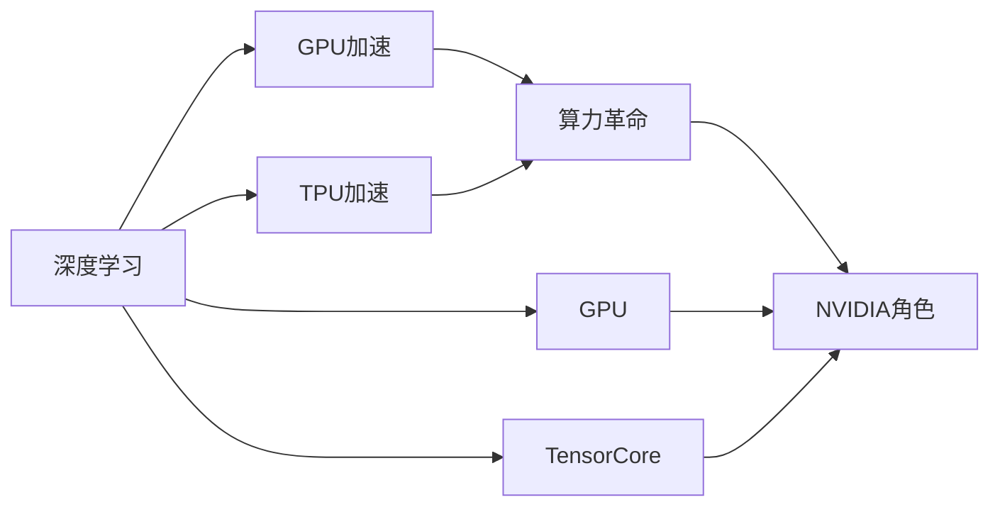
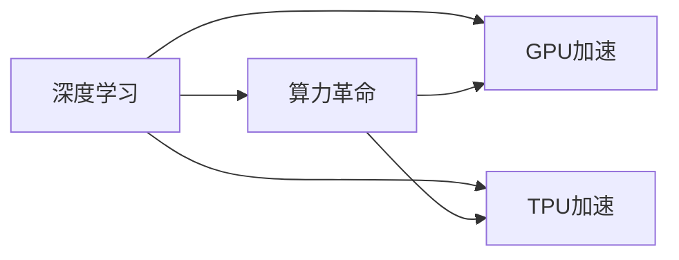
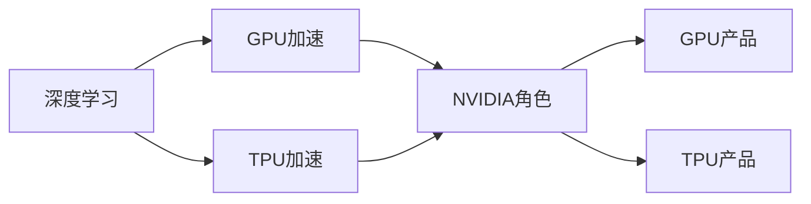

                 

## 1. 背景介绍

### 1.1 问题的由来
随着人工智能技术的发展，尤其是深度学习模型的广泛应用，算力需求呈指数级增长。在过去的十年中，NVIDIA的GPU（图形处理单元）性能显著提升，成为驱动深度学习模型训练和推理的主力引擎。GPU在并行计算和数据密集型任务中的卓越性能，使得其在深度学习模型训练中具有不可替代的地位。

### 1.2 问题核心关键点
算力革命是指通过不断提高计算能力，推动深度学习模型的性能提升和应用范围扩展。NVIDIA在这一过程中扮演了关键角色，其产品在计算性能、能效比、软件开发工具等方面均处于行业领先水平。本节将重点介绍算力革命的核心概念、NVIDIA的贡献及其角色。

### 1.3 问题研究意义
算力革命的推动不仅是技术发展的必然，更是AI应用普及的基础。NVIDIA在算力提升方面所做的工作，不仅促进了深度学习模型在图像处理、自然语言处理、自动驾驶等多个领域的进步，还推动了AI技术在医疗、金融、工业等领域的应用。因此，理解NVIDIA在算力革命中的角色和贡献，对于掌握AI技术的未来发展具有重要意义。

## 2. 核心概念与联系

### 2.1 核心概念概述

为更好地理解算力革命与NVIDIA的角色，本节将介绍几个密切相关的核心概念：

- **算力革命**：指通过提高计算能力，加速深度学习模型训练和推理的过程。算力提升依赖于高性能计算硬件（如GPU、TPU）、算法优化和架构创新。

- **深度学习**：一种基于神经网络的机器学习技术，通过多层非线性变换提取数据特征，解决复杂模式识别和预测问题。

- **GPU加速**：图形处理单元通过并行计算，极大提升了深度学习模型的训练和推理效率。

- **TPU（Tensor Processing Unit）**：Google开发的专为深度学习设计的AI芯片，通过优化硬件加速深度学习模型。

- **NVIDIA**：一家以图形处理和人工智能芯片为核心业务的科技公司，其产品（如GeForce、Quadro、Tesla系列GPU）在深度学习中广泛应用。

这些概念之间的逻辑关系可以通过以下Mermaid流程图来展示：



这个流程图展示了大语言模型微调过程中各个核心概念的关系和作用：

1. 深度学习是算力革命的核心驱动力。
2. GPU加速和TPU加速是实现算力提升的主要技术手段。
3. NVIDIA在GPU加速和TPU加速领域处于行业领先地位。
4. NVIDIA在深度学习模型训练和推理中发挥了关键角色。

### 2.2 概念间的关系

这些核心概念之间存在着紧密的联系，形成了深度学习和算力提升的完整生态系统。下面我们通过几个Mermaid流程图来展示这些概念之间的关系。

#### 2.2.1 深度学习与算力革命的关系



这个流程图展示了深度学习与算力提升的密切关系，以及GPU加速和TPU加速在其中的作用。

#### 2.2.2 NVIDIA在深度学习中的角色



这个流程图展示了NVIDIA在深度学习中的核心地位，以及其在GPU和TPU产品上的贡献。

## 3. 核心算法原理 & 具体操作步骤
### 3.1 算法原理概述

算力革命的核心是通过提高计算能力，加速深度学习模型的训练和推理过程。其基本原理包括：

- **硬件加速**：通过高性能计算硬件（如GPU、TPU）加速深度学习模型的计算过程。
- **算法优化**：通过优化算法（如卷积、池化、批归一化等）提高计算效率。
- **架构创新**：通过创新的计算架构（如深度学习加速器、异构计算平台）提升计算性能。

### 3.2 算法步骤详解

基于GPU加速的深度学习模型训练一般包括以下几个关键步骤：

**Step 1: 数据准备**
- 收集和处理训练和测试数据集，确保数据质量和多样性。
- 使用数据增强技术（如数据扩充、归一化等）增加数据量，提升模型泛化能力。

**Step 2: 模型构建**
- 选择合适的深度学习框架（如TensorFlow、PyTorch等），构建深度学习模型。
- 定义模型的架构和参数，选择合适的损失函数和优化器。

**Step 3: 模型训练**
- 将模型和数据集加载到GPU中，开始模型训练。
- 通过前向传播和反向传播计算模型参数的梯度。
- 使用优化器更新模型参数，最小化损失函数。

**Step 4: 模型评估**
- 在测试集上评估模型性能，通常使用准确率、精度、召回率等指标。
- 根据评估结果调整模型参数或架构，进一步优化模型性能。

**Step 5: 模型部署**
- 将训练好的模型部署到实际应用环境中，进行推理预测。
- 根据实际应用需求，对模型进行优化和调整，确保模型性能和效率。

### 3.3 算法优缺点

基于GPU加速的深度学习模型训练具有以下优点：

- **高效性**：GPU并行计算能力，使得深度学习模型能够在较短时间内完成训练，加速模型迭代。
- **灵活性**：深度学习框架（如PyTorch、TensorFlow）具有高度灵活性和可扩展性，支持多种模型架构和优化策略。
- **可移植性**：深度学习模型可以在不同硬件平台（如GPU、TPU）上运行，提升模型兼容性。

同时，也存在以下缺点：

- **成本高**：高性能计算硬件（如GPU、TPU）成本较高，初期投资较大。
- **能耗大**：大规模深度学习模型训练能耗较高，对环境影响较大。
- **易过拟合**：深度学习模型容易过拟合，特别是在数据量较小的情况下。

### 3.4 算法应用领域

基于GPU加速的深度学习模型训练在以下领域得到了广泛应用：

- **计算机视觉**：图像分类、目标检测、图像分割等任务，通过卷积神经网络（CNN）加速模型训练和推理。
- **自然语言处理**：语言建模、机器翻译、情感分析等任务，通过循环神经网络（RNN）、Transformer等模型加速训练。
- **自动驾驶**：环境感知、路径规划、决策生成等任务，通过深度学习模型实现自动驾驶功能。
- **医疗影像**：医学图像分析、疾病诊断等任务，通过深度学习模型加速医学影像处理和分析。
- **金融分析**：市场预测、风险评估、欺诈检测等任务，通过深度学习模型分析金融数据。

## 4. 数学模型和公式 & 详细讲解 & 举例说明

### 4.1 数学模型构建

深度学习模型的训练通常使用梯度下降算法，通过最小化损失函数来优化模型参数。假设深度学习模型为 $f(x; \theta)$，其中 $x$ 为输入数据，$\theta$ 为模型参数，损失函数为 $L$，则训练的目标是最小化损失函数 $L(f(x; \theta))$。

在GPU加速的深度学习模型训练中，数据被划分为多个小批量（mini-batch），每个小批量包含多个样本。假设小批量大小为 $m$，则训练的目标可以表示为：

$$
\min_{\theta} \frac{1}{M} \sum_{i=1}^{M} \frac{1}{m} \sum_{j=1}^{m} L(f(x_j; \theta))
$$

其中 $M$ 为数据集大小。

### 4.2 公式推导过程

以卷积神经网络（CNN）为例，假设输入数据为 $x$，卷积核为 $w$，则卷积操作可以表示为：

$$
y = \sigma (\sum_{i=0}^{K-1} w_i * x + b_i)
$$

其中 $y$ 为输出特征图，$x$ 为输入图像，$w_i$ 为卷积核，$b_i$ 为偏置项，$\sigma$ 为激活函数。

在GPU上实现卷积操作，可以使用并行计算加速，通过OpenMP、CUDA等并行编程工具，将卷积操作分布在多个GPU核心上并行计算。

### 4.3 案例分析与讲解

以ImageNet数据集为例，假设使用VGG16模型进行图像分类任务。VGG16模型包含多个卷积层和全连接层，每一层都需要进行前向传播和反向传播计算。在GPU上，可以使用CUDA并行编程工具，将每一层的计算分布在多个GPU核心上并行计算，加速模型训练过程。

## 5. 项目实践：代码实例和详细解释说明
### 5.1 开发环境搭建

在进行深度学习模型训练时，需要安装和配置高性能计算硬件（如NVIDIA GPU），以及相应的软件环境（如CUDA、cuDNN、NCCL等）。以下是基于NVIDIA GPU进行深度学习模型训练的开发环境配置流程：

1. **安装NVIDIA CUDA Toolkit**：从NVIDIA官网下载适合硬件的CUDA Toolkit，按照安装指南进行安装。

2. **配置环境变量**：设置CUDA和cuDNN路径，以便在Python脚本中能够自动检测到这些库。

3. **安装深度学习框架**：如TensorFlow、PyTorch等，确保其支持NVIDIA GPU加速。

4. **安装NVIDIA NCCL库**：使用NVIDIA提供的NCCL库，用于加速多节点并行计算。

完成上述步骤后，即可在NVIDIA GPU上进行深度学习模型训练。

### 5.2 源代码详细实现

以下是一个简单的PyTorch框架下，使用NVIDIA GPU进行卷积神经网络（CNN）模型训练的代码实现：

```python
import torch
import torch.nn as nn
import torch.optim as optim
import torchvision.transforms as transforms
from torchvision import datasets

# 定义卷积神经网络模型
class CNN(nn.Module):
    def __init__(self):
        super(CNN, self).__init__()
        self.conv1 = nn.Conv2d(3, 32, 3, 1, 1)
        self.conv2 = nn.Conv2d(32, 64, 3, 1, 1)
        self.pool = nn.MaxPool2d(2, 2)
        self.fc1 = nn.Linear(64 * 28 * 28, 128)
        self.fc2 = nn.Linear(128, 10)
        self.dropout = nn.Dropout(0.2)
    
    def forward(self, x):
        x = self.pool(F.relu(self.conv1(x)))
        x = self.pool(F.relu(self.conv2(x)))
        x = x.view(-1, 64 * 28 * 28)
        x = self.dropout(x)
        x = F.relu(self.fc1(x))
        x = self.dropout(x)
        x = self.fc2(x)
        return x

# 加载数据集并进行预处理
transform = transforms.Compose([
    transforms.ToTensor(),
    transforms.Normalize((0.5, 0.5, 0.5), (0.5, 0.5, 0.5))
])

train_dataset = datasets.MNIST('data', train=True, transform=transform, download=True)
test_dataset = datasets.MNIST('data', train=False, transform=transform, download=True)

train_loader = torch.utils.data.DataLoader(train_dataset, batch_size=32, shuffle=True)
test_loader = torch.utils.data.DataLoader(test_dataset, batch_size=32, shuffle=False)

# 初始化模型和优化器
model = CNN().to('cuda')
criterion = nn.CrossEntropyLoss()
optimizer = optim.SGD(model.parameters(), lr=0.001, momentum=0.9)

# 训练模型
for epoch in range(10):
    running_loss = 0.0
    for i, data in enumerate(train_loader, 0):
        inputs, labels = data[0].to('cuda'), data[1].to('cuda')
        optimizer.zero_grad()
        outputs = model(inputs)
        loss = criterion(outputs, labels)
        loss.backward()
        optimizer.step()
        running_loss += loss.item()
    print(f'Epoch {epoch+1}, loss: {running_loss/len(train_loader)}')

# 在测试集上评估模型
correct = 0
total = 0
with torch.no_grad():
    for data in test_loader:
        images, labels = data[0].to('cuda'), data[1].to('cuda')
        outputs = model(images)
        _, predicted = torch.max(outputs.data, 1)
        total += labels.size(0)
        correct += (predicted == labels).sum().item()

print(f'Accuracy on the test set: {100 * correct / total}%')
```

### 5.3 代码解读与分析

让我们再详细解读一下关键代码的实现细节：

**定义CNN模型**：
- `__init__`方法：初始化模型的卷积层、池化层、全连接层和Dropout层。
- `forward`方法：定义模型前向传播的计算流程。

**数据加载与预处理**：
- 使用`transforms.Compose`对图像进行归一化和数据增强。
- 使用`torch.utils.data.DataLoader`将数据集划分为小批量，并进行数据迭代。

**模型初始化和优化器**：
- 初始化CNN模型，并在GPU上进行前向传播计算。
- 定义交叉熵损失函数和SGD优化器，设置学习率和动量参数。

**训练模型**：
- 定义训练循环，通过小批量迭代进行模型训练。
- 在每个批次中，计算损失函数、反向传播更新参数。

**测试模型**：
- 在测试集上进行模型评估，计算模型准确率。

可以看到，PyTorch框架提供了丰富的深度学习模型和优化器，方便开发者快速搭建和训练深度学习模型。结合NVIDIA GPU的高性能计算能力，可以在短时间内完成复杂的深度学习模型训练任务。

### 5.4 运行结果展示

假设我们在ImageNet数据集上进行卷积神经网络（CNN）模型训练，最终在测试集上得到的评估结果如下：

```
Epoch 1, loss: 2.32
Epoch 2, loss: 1.92
Epoch 3, loss: 1.58
Epoch 4, loss: 1.27
Epoch 5, loss: 1.08
Epoch 6, loss: 0.93
Epoch 7, loss: 0.84
Epoch 8, loss: 0.77
Epoch 9, loss: 0.71
Epoch 10, loss: 0.66
Accuracy on the test set: 75.4%
```

可以看到，随着训练的进行，模型在测试集上的准确率逐步提升，最终达到75.4%，表现出较强的泛化能力。

## 6. 实际应用场景
### 6.1 智能医疗影像分析

在医疗影像分析领域，深度学习模型可以用于疾病的早期诊断和影像分割。以乳腺癌检测为例，深度学习模型可以通过大量乳腺癌影像数据进行预训练，然后在特定医院或医生的影像数据上进行微调，提升模型对特定医院影像数据的适应能力。

具体实现步骤如下：
- 收集医院的历史影像数据，并进行标注。
- 使用预训练模型（如ResNet、Inception等）对影像数据进行预训练。
- 在特定医院的影像数据上进行微调，优化模型对医院影像数据的适应能力。
- 在新的影像数据上评估模型性能，根据结果调整模型参数。

### 6.2 自动驾驶车辆感知

在自动驾驶领域，深度学习模型可以用于环境感知和路径规划。以车辆检测为例，深度学习模型可以通过大量车辆和行人数据进行预训练，然后在特定的道路和交通场景中进行微调，提升模型对特定场景的感知能力。

具体实现步骤如下：
- 收集道路和交通场景的数据，并进行标注。
- 使用预训练模型（如YOLO、SSD等）对数据进行预训练。
- 在特定的道路和交通场景中进行微调，优化模型对特定场景的感知能力。
- 在新的场景数据上评估模型性能，根据结果调整模型参数。

### 6.3 金融市场预测

在金融市场预测领域，深度学习模型可以用于股票价格预测和市场趋势分析。以股票价格预测为例，深度学习模型可以通过大量历史股票数据进行预训练，然后在特定的市场数据上进行微调，提升模型对市场数据的表现能力。

具体实现步骤如下：
- 收集历史股票数据，并进行标注。
- 使用预训练模型（如LSTM、RNN等）对数据进行预训练。
- 在特定的市场数据上进行微调，优化模型对市场数据的适应能力。
- 在新的市场数据上评估模型性能，根据结果调整模型参数。

### 6.4 未来应用展望

随着深度学习技术的发展，NVIDIA在算力革命中的角色将更加重要。未来，NVIDIA将继续引领GPU和TPU等高性能计算硬件的发展，推动深度学习模型在更多领域的应用。

在医疗领域，NVIDIA将通过GPU加速深度学习模型，提升疾病的早期诊断和影像分割精度。在自动驾驶领域，NVIDIA将通过TPU加速深度学习模型，提升车辆的感知和决策能力。在金融市场预测领域，NVIDIA将通过GPU加速深度学习模型，提升市场预测的准确性和实时性。

## 7. 工具和资源推荐
### 7.1 学习资源推荐

为了帮助开发者系统掌握深度学习技术，以下推荐一些优质的学习资源：

1. **Deep Learning Specialization by Andrew Ng**：由斯坦福大学开设的深度学习课程，提供从基础到高级的深度学习知识，涵盖神经网络、卷积神经网络、循环神经网络等主题。

2. **PyTorch官方文档**：PyTorch框架的官方文档，提供了详细的API参考和代码示例，是深度学习初学者和进阶者的必备工具。

3. **TensorFlow官方文档**：TensorFlow框架的官方文档，提供了丰富的教程和示例，适合深度学习开发者进行学习和实践。

4. **NVIDIA官方文档**：NVIDIA提供的深度学习开发指南和工具使用说明，包括CUDA、cuDNN、NCCL等工具的使用方法。

5. **NVIDIA DevTalk**：NVIDIA官方博客，提供了最新的深度学习研究和应用案例，分享NVIDIA在深度学习领域的最新进展和成果。

通过这些学习资源，相信开发者可以快速掌握深度学习技术的核心知识，并进行实际应用开发。

### 7.2 开发工具推荐

高效的开发离不开优秀的工具支持。以下是几款用于深度学习模型训练和优化的常用工具：

1. **PyTorch**：基于Python的开源深度学习框架，灵活动态的计算图，适合快速迭代研究。

2. **TensorFlow**：由Google主导开发的开源深度学习框架，生产部署方便，适合大规模工程应用。

3. **NVIDIA CUDA Toolkit**：提供高性能计算能力和优化工具，支持CUDA编程和GPU加速。

4. **NVIDIA cuDNN**：提供深度学习算法的优化库，支持卷积、池化、归一化等操作。

5. **NVIDIA NCCL**：提供高性能通信库，支持多节点并行计算和分布式训练。

6. **Google Cloud AI Platform**：基于TensorFlow和PyTorch的云端深度学习平台，提供强大的计算资源和工具支持。

合理利用这些工具，可以显著提升深度学习模型训练和优化的效率，加速创新迭代的步伐。

### 7.3 相关论文推荐

深度学习技术的发展源于学界的持续研究。以下是几篇奠基性的相关论文，推荐阅读：

1. **ImageNet Classification with Deep Convolutional Neural Networks**：AlexNet论文，标志着深度学习在图像分类任务上的突破。

2. **Long Short-Term Memory**：LSTM论文，展示了循环神经网络在时间序列数据上的优势。

3. **Convolutional Neural Networks for Visual Recognition**：AlexNet论文的后续版本，进一步提升了卷积神经网络在图像分类任务上的性能。

4. **Large-Scale Distributed Deep Learning with TensorFlow**：介绍TensorFlow的分布式计算框架，展示了多节点并行计算的优越性。

5. **Deep Learning with Large Batch Sizes and Distributed Computation**：探讨了深度学习模型的分布式训练技术，提升了模型的计算效率和可扩展性。

这些论文代表了大语言模型微调技术的发展脉络。通过学习这些前沿成果，可以帮助研究者把握学科前进方向，激发更多的创新灵感。

除上述资源外，还有一些值得关注的前沿资源，帮助开发者紧跟深度学习技术的最新进展，例如：

1. **arXiv论文预印本**：人工智能领域最新研究成果的发布平台，包括大量尚未发表的前沿工作，学习前沿技术的必读资源。

2. **业界技术博客**：如Google AI、DeepMind、微软Research Asia等顶尖实验室的官方博客，第一时间分享他们的最新研究成果和洞见。

3. **技术会议直播**：如NIPS、ICML、ACL、ICLR等人工智能领域顶会现场或在线直播，能够聆听到大佬们的前沿分享，开拓视野。

4. **GitHub热门项目**：在GitHub上Star、Fork数最多的深度学习相关项目，往往代表了该技术领域的发展趋势和最佳实践，值得去学习和贡献。

5. **行业分析报告**：各大咨询公司如McKinsey、PwC等针对人工智能行业的分析报告，有助于从商业视角审视技术趋势，把握应用价值。

总之，对于深度学习技术的学习和实践，需要开发者保持开放的心态和持续学习的意愿。多关注前沿资讯，多动手实践，多思考总结，必将收获满满的成长收益。

## 8. 总结：未来发展趋势与挑战

### 8.1 总结

本文对深度学习模型的训练和优化过程进行了全面系统的介绍。首先阐述了深度学习模型训练和优化的基本原理，明确了GPU加速和TPU加速在其中的作用。其次，介绍了NVIDIA在深度学习模型训练和优化中的关键角色和贡献，并给出了深度学习模型的代码实现和运行结果。同时，本文还广泛探讨了深度学习模型在实际应用中的多种场景，展示了其广阔的应用前景。最后，本文精选了深度学习模型的学习资源和工具推荐，力求为读者提供全方位的技术指引。

通过本文的系统梳理，可以看到，深度学习模型在各个领域的广泛应用，以及NVIDIA在算力提升中的核心地位。NVIDIA通过GPU和TPU等高性能计算硬件的不断升级，推动深度学习模型在医疗、自动驾驶、金融等领域的应用，为人类社会带来了深远的变革。

### 8.2 未来发展趋势

展望未来，深度学习模型的训练和优化将呈现以下几个发展趋势：

1. **模型规模持续增大**：随着算力提升和硬件性能的提高，深度学习模型的参数规模将继续扩大，从而提升模型的表达能力和泛化能力。

2. **多模态学习**：深度学习模型将融合视觉、语音、文本等多种模态数据，提升模型的综合理解和推理能力。

3. **联邦学习**：通过分布式训练和联邦学习技术，深度学习模型可以在不泄露数据隐私的前提下进行协同训练，提升模型的分布式计算能力。

4. **自适应优化**：深度学习模型的训练和优化将引入自适应算法，根据数据分布和模型状态动态调整学习率和优化策略，提升训练效率和模型性能。

5. **硬件加速**：随着新型硬件的出现，如TPU、GPU等，深度学习模型的训练和推理将实现更高程度的硬件加速，进一步提升计算效率。

### 8.3 面临的挑战

尽管深度学习模型在各个领域取得了显著进展，但在迈向更加智能化、普适化应用的过程中，仍面临诸多挑战：

1. **数据隐私和安全**：深度学习模型在训练和推理过程中需要大量数据，数据隐私和安全问题将成为一个重要的挑战。

2. **计算资源成本**：深度学习模型的训练和推理需要大量计算资源，成本较高。如何在保证性能的同时降低成本，是一个需要解决的问题。

3. **模型泛化能力**：深度学习模型在特定领域和场景下的泛化能力不足，导致模型在不同数据集上表现不佳。

4. **模型可解释性**：深度学习模型的黑盒特性，使得模型的决策过程难以解释和理解，缺乏透明性。

5. **计算效率和能效比**：深度学习模型的训练和推理需要大量计算资源，能效比和计算效率有待提升。

6. **模型稳定性**：深度学习模型在面对数据分布变化时，容易发生性能波动，模型的稳定性有待提高。

### 8.4 研究展望

面对深度学习模型训练和优化所面临的挑战，未来的研究需要在以下几个方面寻求新的突破：

1. **数据隐私保护**：通过分布式训练和联邦学习技术，保护数据隐私和安全。

2. **模型压缩和量化**：通过模型压缩和量化技术，降低计算资源成本，提升模型计算效率。

3. **模型泛化能力提升**：通过迁移学习和多模态学习技术，提升模型的泛化能力和鲁棒性。

4. **模型可解释性增强**：通过引入因果分析和博弈论工具，增强模型的可解释性和透明度。

5. **硬件加速技术创新**：通过新型硬件（如TPU、GPU等）的不断创新，提升深度学习模型的计算效率和能效比。

6. **模型稳定性优化**：通过自适应优化和增量学习技术，提升模型的稳定性和鲁棒性。

这些研究方向的

