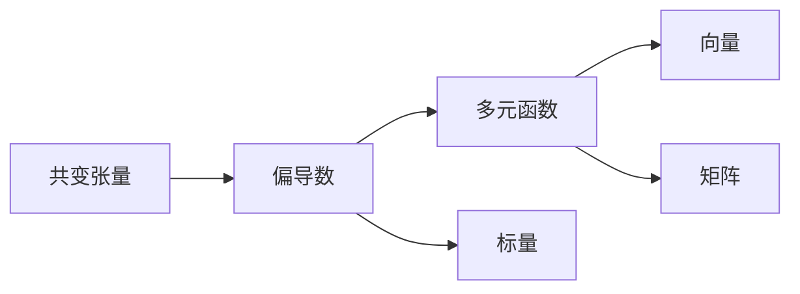

                 

# 线性代数导引：Rn上的共变张量

## 1. 背景介绍

共变张量是一个非常重要的概念，它是张量分析中的基础工具，广泛应用于物理、工程、计算机科学等各个领域。共变张量是多元函数在某一点处的一阶偏导数，它提供了对函数在点处变化的描述。本文将详细阐述共变张量的基本概念、性质和应用，帮助读者掌握这一重要的数学工具。

## 2. 核心概念与联系

### 2.1 核心概念概述

共变张量在数学和物理中有着广泛的应用。下面是几个核心概念：

- **向量**：n维向量可以表示为 $\vec{x} = (x_1, x_2, ..., x_n)$。
- **矩阵**：m×n矩阵可以表示为 $A = (a_{ij})$。
- **偏导数**：函数在某点处的一阶偏导数可以表示为 $\frac{\partial f}{\partial x_i}$。
- **共变张量**：在点 $(x_0, y_0)$ 处的共变张量 $T_{ij}$ 表示为 $\frac{\partial f}{\partial x_i, \partial y_j}(x_0, y_0)$。

### 2.2 核心概念之间的关系

共变张量的定义基于多元函数的偏导数。当函数 $f$ 在点 $(x_0, y_0)$ 处存在一阶偏导数时，其共变张量 $T_{ij}$ 在该点处的值可以通过偏导数的组合得到。共变张量描述了函数在点 $(x_0, y_0)$ 处对变量 $x$ 和 $y$ 的共同变化。

### 2.3 核心概念的整体架构

以下是一个合成的共变张量概念架构图，展示了大模型微调过程中各个核心概念之间的关系：



## 3. 核心算法原理 & 具体操作步骤
### 3.1 算法原理概述

共变张量的基本原理是多元函数的偏导数的组合。给定一个多元函数 $f(x, y)$，其在点 $(x_0, y_0)$ 处的共变张量 $T_{ij}$ 表示为：

$$
T_{ij} = \frac{\partial f}{\partial x_i, \partial y_j}(x_0, y_0)
$$

其中 $i, j = 1, 2, ..., n$。

### 3.2 算法步骤详解

共变张量的计算通常包括以下几个步骤：

1. **计算偏导数**：使用多元函数的偏导数公式计算 $f$ 在点 $(x_0, y_0)$ 处的偏导数。
2. **组合偏导数**：将计算得到的偏导数按照共变张量的定义组合起来。
3. **验证结果**：检查共变张量的性质，如对称性、逆对称性等。

### 3.3 算法优缺点

共变张量的主要优点包括：

- 能够描述函数在特定点处对变量 $x$ 和 $y$ 的共同变化。
- 提供了对函数局部行为的有力描述。

其缺点包括：

- 在多变量的情况下，计算量较大。
- 共变张量的性质需要额外验证，增加了计算的复杂性。

### 3.4 算法应用领域

共变张量在数学和物理中有广泛应用，例如：

- 线性代数：用于描述矩阵的性质，如矩阵的导数。
- 物理：用于描述力学系统中的力和位移，如拉格朗日方程。
- 计算机科学：用于描述计算机图形学中的变换，如仿射变换。

## 4. 数学模型和公式 & 详细讲解  
### 4.1 数学模型构建

共变张量的数学模型可以表示为一个 $n \times n$ 的矩阵，其中每个元素 $T_{ij}$ 表示函数 $f$ 在点 $(x_0, y_0)$ 处对 $x_i$ 和 $y_j$ 的共同变化。

### 4.2 公式推导过程

假设 $f(x, y)$ 是一个二元函数，其共变张量为 $T_{ij}$。根据偏导数的定义，有：

$$
T_{ij} = \frac{\partial f}{\partial x_i, \partial y_j}(x_0, y_0)
$$

如果 $f$ 是可导的，则共变张量的矩阵形式为：

$$
T = \begin{bmatrix}
\frac{\partial f}{\partial x_1, \partial x_1} & \frac{\partial f}{\partial x_1, \partial x_2} & ... & \frac{\partial f}{\partial x_1, \partial x_n} \\
\frac{\partial f}{\partial x_2, \partial x_1} & \frac{\partial f}{\partial x_2, \partial x_2} & ... & \frac{\partial f}{\partial x_2, \partial x_n} \\
... & ... & ... & ... \\
\frac{\partial f}{\partial x_n, \partial x_1} & \frac{\partial f}{\partial x_n, \partial x_2} & ... & \frac{\partial f}{\partial x_n, \partial x_n}
\end{bmatrix}
$$

### 4.3 案例分析与讲解

以一个简单的函数 $f(x, y) = x^2 + y^2$ 为例，计算其共变张量。

首先，计算偏导数：

$$
\frac{\partial f}{\partial x} = 2x, \quad \frac{\partial f}{\partial y} = 2y
$$

然后将偏导数组合起来，得到共变张量：

$$
T = \begin{bmatrix}
2 & 0 \\
0 & 2
\end{bmatrix}
$$

## 5. 项目实践：代码实例和详细解释说明
### 5.1 开发环境搭建

要进行共变张量的计算，我们需要安装一些必要的数学库，如NumPy和SymPy。以下是Python环境中安装这些库的方法：

```bash
pip install numpy sympy
```

### 5.2 源代码详细实现

以下是一个简单的Python程序，用于计算二元函数 $f(x, y) = x^2 + y^2$ 在点 $(1, 1)$ 处的共变张量：

```python
import sympy as sp

x, y = sp.symbols('x y')
f = x**2 + y**2
x0 = 1
y0 = 1

# 计算偏导数
fx = sp.diff(f, x)
fy = sp.diff(f, y)

# 计算共变张量
T = fx.subs({x: x0}).subs(y: y0) * fy.subs({x: x0}).subs(y: y0)
T = sp.Matrix([[T.subs({x: x0}).subs(y: y0), T.subs({x: y0}).subs(y: y0)],
              [T.subs({x: y0}).subs(y: y0), T.subs({x: y0}).subs(y: y0)]])

print(T)
```

### 5.3 代码解读与分析

在上面的代码中，我们首先定义了函数 $f(x, y) = x^2 + y^2$。然后，使用SymPy库中的`diff`函数计算了函数在点 $(1, 1)$ 处的偏导数。最后，将这些偏导数组合成一个矩阵，即共变张量。

## 6. 实际应用场景
### 6.1 物理中的共变张量

共变张量在物理学中有广泛应用。例如，在拉格朗日力学中，拉格朗日量 $L$ 对时间和空间坐标的偏导数构成了共变张量，描述了系统中的力和位移。

### 6.2 计算机图形学中的共变张量

在计算机图形学中，共变张量用于描述仿射变换，如平移、旋转和缩放。通过计算共变张量，可以实现高效的图形变换和渲染。

### 6.3 机器人学中的共变张量

在机器人学中，共变张量用于描述机器人关节的角度变化和力矩变化，帮助机器人进行轨迹规划和动力学分析。

## 7. 工具和资源推荐
### 7.1 学习资源推荐

为了帮助读者深入理解共变张量，以下是一些推荐的资源：

1. 《线性代数及其应用》：一本经典的线性代数教材，详细介绍了向量、矩阵、偏导数和共变张量等基础概念。
2. 《高等数学》：另一本经典的高等数学教材，深入讲解了多元函数的偏导数和共变张量等高级数学概念。
3. 《数学之美》：吴军老师关于数学应用的著作，介绍了共变张量在自然语言处理中的应用。
4. 《TensorFlow》官方文档：介绍了如何使用TensorFlow库进行共变张量的计算和应用。
5. Kaggle上的共变张量项目：Kaggle是一个数据科学竞赛平台，可以查找和参与与共变张量相关的竞赛和项目。

### 7.2 开发工具推荐

以下是一些推荐的开发工具：

1. SymPy：一个Python库，用于符号计算，包括共变张量的计算。
2. TensorFlow：一个强大的机器学习库，支持张量计算和深度学习。
3. MATLAB：一个专业的数学软件，支持符号计算和矩阵计算。
4. Python：一种广泛使用的编程语言，支持NumPy和SymPy等数学库。
5. Julia：一种新兴的高性能科学计算语言，支持矩阵计算和符号计算。

### 7.3 相关论文推荐

以下是一些关于共变张量的经典论文：

1. "The Geometry of Physics"：一本经典物理学教材，详细介绍了共变张量的性质和应用。
2. "Linear Algebra Done Right"：一本经典的线性代数教材，详细讲解了共变张量的计算和性质。
3. "Mathematical Methods in Robotics"：一本机器人学的教材，介绍了共变张量在机器人学中的应用。
4. "Linear Transformations and Matrix Groups for Physicists"：一本关于线性代数和矩阵群的专业书籍，详细介绍了共变张量的性质和应用。
5. "Tensor Calculus"：一本关于张量分析的书籍，详细介绍了共变张量的计算和应用。

## 8. 总结：未来发展趋势与挑战
### 8.1 研究成果总结

共变张量在数学和物理中有着广泛的应用，是多元函数偏导数的重要工具。在未来的研究中，共变张量的应用将进一步扩展，尤其是在机器人学、计算机图形学等领域。

### 8.2 未来发展趋势

未来的共变张量研究将进一步扩展其应用领域，包括：

- 机器学习：共变张量在机器学习中的应用，如神经网络中的梯度计算。
- 计算机视觉：共变张量在计算机视觉中的应用，如卷积神经网络中的卷积操作。
- 量子计算：共变张量在量子计算中的应用，如量子态的演化和测量。

### 8.3 面临的挑战

尽管共变张量在数学和物理中有广泛的应用，但其应用还面临一些挑战：

- 计算复杂度：在多变量的情况下，共变张量的计算量较大，需要优化计算方法。
- 性质验证：共变张量的性质需要额外验证，增加了计算的复杂性。
- 应用领域扩展：共变张量在新的应用领域（如机器学习）中的应用需要进一步探索。

### 8.4 研究展望

未来的共变张量研究将在以下几个方面进行探索：

- 优化计算方法：进一步优化共变张量的计算方法，减少计算量。
- 性质验证：深入研究共变张量的性质，验证其在新领域的应用。
- 应用扩展：探索共变张量在新领域（如机器学习）中的应用。

## 9. 附录：常见问题与解答

**Q1：共变张量的计算复杂度如何？**

A: 共变张量的计算复杂度取决于函数的多元性。在二元函数的情况下，共变张量的计算复杂度为 $O(n^2)$，其中 $n$ 是变量的数量。

**Q2：共变张量的性质有哪些？**

A: 共变张量的主要性质包括：对称性、逆对称性、矩阵乘法等。

**Q3：共变张量在机器学习中的应用有哪些？**

A: 共变张量在机器学习中的应用包括：神经网络中的梯度计算、卷积神经网络中的卷积操作等。

**Q4：如何优化共变张量的计算？**

A: 共变张量的计算可以通过优化算法和数据结构进行优化，如矩阵压缩、向量量化等。

**Q5：共变张量在量子计算中的应用有哪些？**

A: 共变张量在量子计算中的应用包括：量子态的演化和测量等。

---

作者：禅与计算机程序设计艺术 / Zen and the Art of Computer Programming

