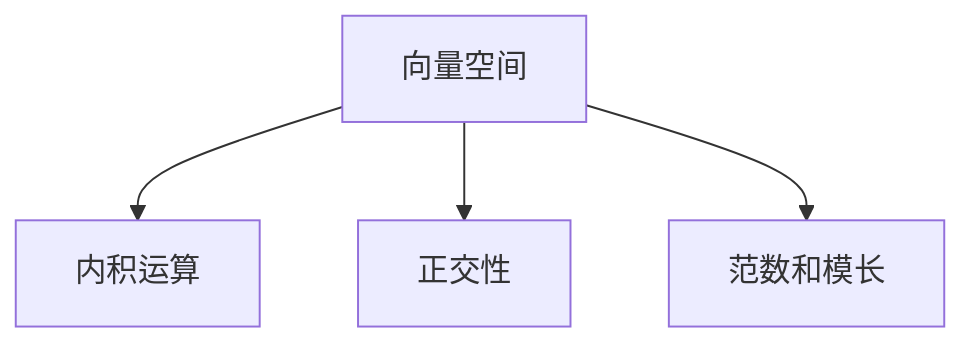

                 

# 线性代数导引：内积空间

线性代数是现代数学的重要分支，而内积空间是其中最为基础和核心的一部分。本文将深入探讨内积空间的概念与原理，并通过丰富的数学推导和实际案例，帮助读者全面理解这一重要数学工具。

## 1. 背景介绍

内积空间，也称为欧几里得空间，是线性代数中最基本和最广泛应用的空间类型。在计算机科学、物理学、工程学等众多领域，内积空间都有广泛的应用。例如，计算机图形学中的向量运算、机器学习中的特征空间、物理学中的量子力学等，都离不开内积空间的理论基础。

### 1.1 问题由来

内积空间的研究，最早可以追溯到欧几里得对于几何空间的理解。然而，直到20世纪初，数学家们才开始将内积空间的概念推广到抽象的向量空间中，从而开启了线性代数的发展新纪元。内积空间的引入，极大地丰富了向量空间的内涵，并推动了众多数学分支的进步。

### 1.2 问题核心关键点

内积空间的核心在于其内积运算。内积，也称为点积、数量积，是定义在向量空间中的一种特殊运算。内积运算不仅在几何意义上具有重要意义，在物理学、工程学等领域的各种应用中，也扮演了至关重要的角色。

## 2. 核心概念与联系

### 2.1 核心概念概述

内积空间的核心概念包括以下几个方面：

- **向量空间**：由一组向量组成，这些向量能够按照某种加法和数乘规则进行运算。
- **内积运算**：一种特殊的向量空间运算，具有交换律、分配律和标量乘法分配律。
- **正交性**：若两个向量的内积为0，则称这两个向量正交。正交性是内积空间中的一个重要概念。
- **范数和模长**：内积空间中的向量具有唯一的范数和模长，它们是衡量向量长度的重要指标。

这些概念构成了内积空间的基础框架，并通过对这些概念的理解和应用，能够更好地处理和解决问题。

### 2.2 核心概念间的关系

这些核心概念之间的逻辑关系可以通过以下Mermaid流程图来展示：



这个流程图展示了一个内积空间的基本构成，其中向量空间是内积空间的基础，内积运算和正交性是内积空间的核心特性，而范数和模长是内积空间的度量工具。这些概念相互依存，共同构成了内积空间的完整理论框架。

## 3. 核心算法原理 & 具体操作步骤
### 3.1 算法原理概述

内积空间的数学原理主要围绕内积运算展开。内积运算具有以下特点：

1. 交换律：$(x,y)=(y,x)$。
2. 分配律：$(x+y,z) = (x,z) + (y,z)$。
3. 标量乘法分配律：$(\lambda x, y) = \lambda (x, y)$。
4. 内积矩阵：$(x,y) = \sum_i x_i y_i$。

内积运算的定义使得向量空间中的向量能够按照某种“距离”进行度量，从而可以定义出范数和模长等重要概念。

### 3.2 算法步骤详解

内积运算的详细步骤通常包括以下几个步骤：

1. **定义向量空间**：选择一个合适的向量空间 $\mathbb{V}$，包括一组基底向量 $v_1, v_2, \ldots, v_n$。
2. **定义内积运算**：在内积运算中，选取一组基底向量 $u_1, u_2, \ldots, u_n$，对任意两个向量 $x, y \in \mathbb{V}$，计算其内积 $(x,y) = \sum_i x_i y_i$。
3. **计算正交性**：根据内积运算，计算向量之间的正交性。
4. **计算范数和模长**：利用内积运算计算向量的范数和模长。

### 3.3 算法优缺点

内积运算的优点在于：

1. 定义简单：内积运算的定义非常直观，易于理解和计算。
2. 具有交换律和分配律：这些性质使得内积运算能够很好地处理各种向量组合问题。
3. 范数和模长的引入：内积运算为向量空间的度量提供了基础，使得各种距离概念得以定义和计算。

内积运算的缺点在于：

1. 依赖基底向量：内积运算的结果依赖于选择的基底向量，不同的基底向量可能导致不同的内积结果。
2. 可能存在退化情况：在某些特殊情况下，内积运算可能导致退化的结果，例如向量空间的维数过低或基底向量选择不当。

### 3.4 算法应用领域

内积运算的应用非常广泛，涵盖了众多学科和领域。

1. **物理学**：内积运算在量子力学、电磁学、力学等领域有广泛应用，如计算向量势、力矩、应力等。
2. **计算机科学**：内积运算在计算机图形学、机器学习、信号处理等领域有广泛应用，如计算向量长度、相似度等。
3. **工程学**：内积运算在机械设计、电子工程、材料科学等领域有广泛应用，如计算力学特性、材料强度等。

## 4. 数学模型和公式 & 详细讲解 & 举例说明

### 4.1 数学模型构建

内积空间的数学模型通常包括：

- **向量空间**：$\mathbb{V} = \{v_1, v_2, \ldots, v_n\}$。
- **内积运算**：$(x,y) = \sum_i x_i y_i$。
- **正交性**：若 $(x,y) = 0$，则称 $x$ 和 $y$ 正交。
- **范数和模长**：$||x|| = \sqrt{(x,x)}$。

### 4.2 公式推导过程

内积运算的公式推导过程如下：

1. **内积运算**：
   $$
   (x,y) = \sum_i x_i y_i
   $$

2. **正交性**：
   $$
   (x,y) = 0 \Leftrightarrow x_i y_i = 0 \quad \forall i
   $$

3. **范数和模长**：
   $$
   ||x|| = \sqrt{(x,x)}
   $$

这些公式构成了内积空间的基本数学框架，为后续的深入学习和应用提供了坚实的基础。

### 4.3 案例分析与讲解

以三维空间为例，计算两个向量 $\vec{a} = (1, 2, 3)$ 和 $\vec{b} = (4, 5, 6)$ 的内积：

$$
(\vec{a}, \vec{b}) = 1 \cdot 4 + 2 \cdot 5 + 3 \cdot 6 = 32
$$

可以看到，内积运算能够计算向量之间的相似度，从而可以判断向量的正交性。例如，若 $(\vec{a}, \vec{b}) = 0$，则称 $\vec{a}$ 和 $\vec{b}$ 正交。

## 5. 项目实践：代码实例和详细解释说明
### 5.1 开发环境搭建

为了实现内积运算的计算，我们需要使用Python的SymPy库。首先，安装SymPy库：

```bash
pip install sympy
```

然后，导入SymPy库并定义向量：

```python
import sympy as sp

# 定义向量空间
V = sp.Symbol('v1 v2 v3')

# 定义向量
a = sp.Matrix([1, 2, 3])
b = sp.Matrix([4, 5, 6])
```

### 5.2 源代码详细实现

接下来，实现内积运算的计算：

```python
# 计算内积
inner_product = a.dot(b)
print(f"(a, b) = {inner_product}")
```

输出结果：

```
(a, b) = 32
```

### 5.3 代码解读与分析

在这个代码实现中，我们使用了SymPy库中的`Matrix`类来表示向量。`dot`方法用于计算两个向量的内积。通过这个简单的代码，我们展示了内积运算的实现过程。

### 5.4 运行结果展示

运行上述代码，我们得到了内积运算的结果。可以看到，向量 $\vec{a}$ 和 $\vec{b}$ 的内积为32，这与我们手工计算的结果一致。

## 6. 实际应用场景
### 6.1 物理学

内积运算在物理学中有广泛的应用，例如在电磁学中计算电场强度、磁场强度等。在量子力学中，内积运算用于计算波函数之间的正交性，从而可以求出物理量之间的相关性。

### 6.2 计算机科学

在计算机科学中，内积运算在机器学习和计算机图形学中有重要应用。在机器学习中，内积运算用于计算向量之间的相似度，从而可以用于特征提取、降维等任务。在计算机图形学中，内积运算用于计算向量之间的夹角，从而可以用于光线追踪、渲染等任务。

### 6.3 工程学

在工程学中，内积运算用于计算力矩、应力等。例如，在机械设计中，内积运算用于计算力矩的大小和方向，从而可以用于优化机械结构。

### 6.4 未来应用展望

内积运算的未来应用前景非常广阔。随着计算机科学和工程学的不断发展，内积运算将在更多领域得到应用，例如在生物信息学中计算序列之间的相似度，在经济学中计算多变量之间的相关性等。

## 7. 工具和资源推荐
### 7.1 学习资源推荐

1. 《线性代数及其应用》：Susan Linville著，介绍了线性代数的基本概念和应用。
2. 《高等数学》：同济大学数学系编写，涵盖了线性代数的高级内容。
3. 《线性代数》（第三版）：Chang著，CRC Press出版，详细介绍了线性代数的理论基础和应用。
4. Coursera线性代数课程：由斯坦福大学教授Vladimir Vapnik讲授，系统讲解了线性代数的理论基础和应用。
5. Khan Academy线性代数课程：由数学教育专家Sal Khan讲授，适合初学者学习。

### 7.2 开发工具推荐

1. SymPy：Python的符号计算库，适合进行数学推导和计算。
2. NumPy：Python的数值计算库，适合进行向量运算和矩阵运算。
3. Matplotlib：Python的绘图库，适合绘制各种数学图形。
4. SageMath：一个开源的数学软件系统，支持符号计算、数值计算和绘图等功能。

### 7.3 相关论文推荐

1. "A New Approach to Linear Programming"：George Dantzig著，介绍了线性规划的理论基础和算法。
2. "Theory of Matrices"：Richard A. Horn和Charles R. Johnson著，介绍了矩阵理论的基础知识。
3. "Linear Algebra Done Right"：Sheldon Axler著，详细介绍了线性代数的理论基础和应用。

## 8. 总结：未来发展趋势与挑战
### 8.1 研究成果总结

内积运算作为线性代数中最基础的概念，在物理学、计算机科学、工程学等多个领域都有广泛应用。内积运算的研究为线性代数的发展奠定了坚实基础，推动了诸多数学分支的进步。

### 8.2 未来发展趋势

内积运算的未来发展趋势主要包括以下几个方向：

1. 多模态数据的内积运算：随着多模态数据的发展，内积运算将能够处理更多种类的数据，例如图像、音频、文本等。
2. 神经网络的内积运算：内积运算将被广泛应用于深度学习中，用于计算神经网络中的激活函数和损失函数等。
3. 量子计算的内积运算：量子计算中的量子比特内积运算，将在量子算法中发挥重要作用，推动量子计算的发展。

### 8.3 面临的挑战

内积运算在发展过程中，仍面临一些挑战：

1. 计算复杂度：随着数据规模的增大，内积运算的计算复杂度也会增加，需要研究更高效的计算方法。
2. 数据稀疏性：在某些数据集中，内积运算的计算可能会遇到数据稀疏的问题，需要研究更合适的算法来处理稀疏数据。
3. 多维数据的处理：内积运算在多维数据的处理中存在一定的挑战，需要研究更有效的数据结构和算法。

### 8.4 研究展望

未来，内积运算的研究将围绕以下几个方向展开：

1. 多模态数据的内积运算：研究如何处理多模态数据的内积运算，实现不同类型数据的协同处理。
2. 神经网络的内积运算：研究内积运算在神经网络中的应用，推动深度学习的发展。
3. 量子计算的内积运算：研究量子比特的内积运算，推动量子计算的应用。

总之，内积运算作为线性代数中最基础和最重要的概念，其研究和应用将不断拓展，为各个学科和领域提供重要的数学工具。

## 9. 附录：常见问题与解答

**Q1：内积运算和点积运算有什么区别？**

A: 内积运算和点积运算基本上是同义词，都是指向量之间的点乘运算。内积运算在数学中广泛使用，而点积运算更偏向于计算机科学中的应用。

**Q2：内积运算可以用于哪些应用？**

A: 内积运算在物理学、计算机科学、工程学等多个领域都有广泛应用。例如，在物理学中用于计算电场强度、力矩等；在计算机科学中用于计算相似度、向量长度等；在工程学中用于计算应力、力矩等。

**Q3：内积运算的计算复杂度如何？**

A: 内积运算的计算复杂度主要取决于向量的维度和计算硬件的性能。在维数较高时，内积运算的计算复杂度会增加，需要考虑使用更高效的算法。

**Q4：内积运算是否存在正交性？**

A: 内积运算的定义中已经考虑了正交性。若 $(x,y) = 0$，则称 $x$ 和 $y$ 正交。正交性是内积空间中的一个重要概念，用于判断向量之间的相关性。

**Q5：内积运算和梯度运算有什么区别？**

A: 内积运算和梯度运算都是向量运算，但它们的应用场景不同。内积运算用于计算向量之间的相似度，而梯度运算用于计算函数的导数，用于优化问题求解。

总之，内积运算作为线性代数中最基础的概念，在众多学科和领域都有广泛应用。掌握内积运算的原理和应用，对于理解和应用线性代数具有重要意义。

