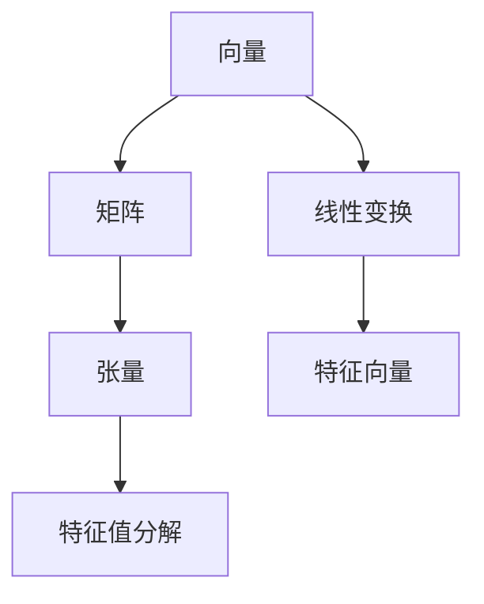
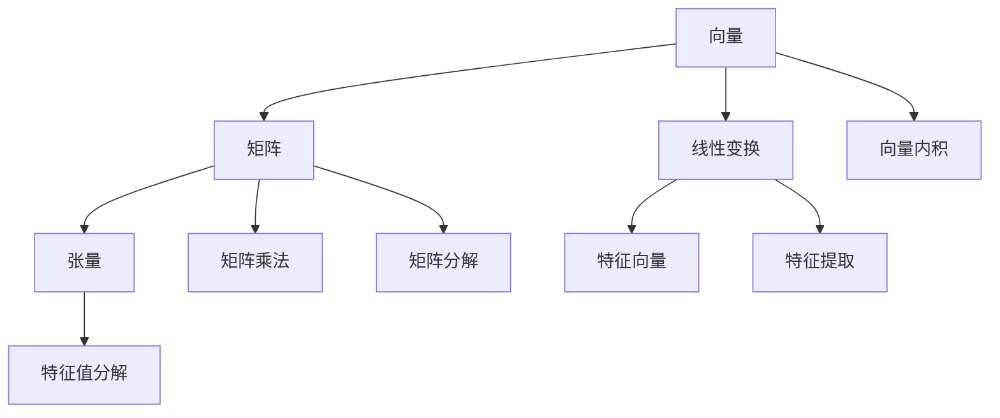

                 

# 线性代数导引：实数代数运算

## 1. 背景介绍

线性代数是现代数学的核心分支之一，是计算机科学、工程科学等领域的重要工具。其中，实数代数运算是线性代数的基础，广泛应用于向量空间、矩阵运算、优化问题等诸多领域。

### 1.1 问题由来
在计算机科学中，线性代数的重要性体现在其与数值计算、图形学、机器学习等多个学科的深度融合。例如，在机器学习中，线性代数是矩阵分解、特征提取、优化算法等关键技术的基础。

### 1.2 问题核心关键点
线性代数中的实数代数运算包括矩阵乘法、向量内积、行列式、特征值分解等基本运算。本文将重点介绍这些基本运算的原理、实现方法及其应用场景，以帮助读者建立坚实的数学基础。

### 1.3 问题研究意义
线性代数在现代科学计算和工程应用中具有不可或缺的作用，掌握实数代数运算的原理与方法，有助于理解复杂的计算模型和算法，为解决实际问题提供有力支持。

## 2. 核心概念与联系

### 2.1 核心概念概述
实数代数运算涉及向量、矩阵、张量等基本数学对象，并基于线性变换、特征值、特征向量等概念，在计算机科学中有着广泛的应用。

- **向量**：实数域中的多维数组，可以表示几何空间的坐标、物理量的值等。
- **矩阵**：由向量组成的矩形数组，可以看作是向量之间的线性变换关系。
- **张量**：多维数组的推广，可以表示任意维度之间的线性关系。

### 2.2 概念间的关系

以下是实数代数运算中几个核心概念之间的逻辑关系：



- 向量是矩阵的构成单元，矩阵是向量的线性组合，张量是更高维度的矩阵。
- 线性变换通过矩阵乘法实现，可以看作是向量之间的几何映射。
- 特征值分解通过矩阵的特征值和特征向量来描述其线性变换的性质。

### 2.3 核心概念的整体架构

整个实数代数运算的架构可以概括为：



## 3. 核心算法原理 & 具体操作步骤

### 3.1 算法原理概述

线性代数中的实数代数运算主要包括矩阵乘法、向量内积、行列式、特征值分解等。这些运算在计算机科学中有着广泛的应用，例如在机器学习中进行特征提取、模型训练等。

### 3.2 算法步骤详解

#### 3.2.1 矩阵乘法

矩阵乘法定义为两个矩阵的乘积，其中一个矩阵的行数与另一个矩阵的列数相同。

设矩阵 $A$ 的大小为 $m \times n$，矩阵 $B$ 的大小为 $n \times p$，则它们的乘积 $C=AB$ 的大小为 $m \times p$，计算方式为：

$$
C_{i,j} = \sum_{k=1}^n A_{i,k}B_{k,j}
$$

这一公式在计算时通常采用矩阵乘法的矩阵乘法运算符（`*`）或NumPy等工具库实现。

#### 3.2.2 向量内积

向量内积是两个向量的点积，定义为它们对应分量的乘积之和。

设向量 $\vec{a}$ 的大小为 $n$，向量 $\vec{b}$ 的大小也为 $n$，则它们的向量内积 $\vec{a} \cdot \vec{b}$ 的计算方式为：

$$
\vec{a} \cdot \vec{b} = \sum_{i=1}^n a_i b_i
$$

这一公式在计算时通常采用向量点乘运算符（`dot`）或NumPy等工具库实现。

#### 3.2.3 行列式

行列式是矩阵的标量值，计算方式为对矩阵的每行进行拉普拉斯展开，得到若干个子行列式，并将这些子行列式乘以对应符号后求和。

设矩阵 $A$ 的大小为 $n \times n$，其行列式的计算方式为：

$$
\det(A) = \sum_{i=1}^n (-1)^{i+1} a_{i,1} M_{i,1}
$$

其中，$a_{i,1}$ 表示矩阵 $A$ 的第 $i$ 行第 $1$ 列的元素，$M_{i,1}$ 表示将第 $i$ 行作为第一行，其余行通过递归计算得到的大小为 $n-1$ 的子行列式。

这一公式在计算时通常采用递归方式或LU分解等高精度计算方法实现。

#### 3.2.4 特征值分解

特征值分解是求解矩阵特征值和特征向量的过程，可以看作是矩阵的平方根运算。

设矩阵 $A$ 的大小为 $n \times n$，其特征值分解为 $A = PDP^{-1}$，其中 $D$ 为对角矩阵，$P$ 为特征向量矩阵。

这一公式在计算时通常采用QR分解、SVD分解等高精度计算方法实现。

### 3.3 算法优缺点

实数代数运算在计算机科学中具有广泛的应用，但也存在一些局限性：

- **计算复杂度高**：如行列式、特征值分解等运算复杂度较高，对于大规模矩阵计算存在一定的计算瓶颈。
- **精度问题**：在数值计算中，浮点数运算存在精度问题，可能导致计算结果出现误差。
- **存储开销大**：矩阵和向量的存储通常需要较大的内存空间，尤其是对于高维度的张量。

### 3.4 算法应用领域

实数代数运算在计算机科学中有着广泛的应用，例如：

- 机器学习：矩阵分解、特征提取、优化算法等。
- 图形学：三维变换、光照计算等。
- 信号处理：频域分析、滤波器设计等。
- 科学计算：数值模拟、偏微分方程求解等。

## 4. 数学模型和公式 & 详细讲解

### 4.1 数学模型构建

设矩阵 $A$ 的大小为 $m \times n$，矩阵 $B$ 的大小为 $n \times p$，则它们的乘积 $C=AB$ 的大小为 $m \times p$，其计算方式为：

$$
C_{i,j} = \sum_{k=1}^n A_{i,k}B_{k,j}
$$

设向量 $\vec{a}$ 的大小为 $n$，向量 $\vec{b}$ 的大小也为 $n$，则它们的向量内积 $\vec{a} \cdot \vec{b}$ 的计算方式为：

$$
\vec{a} \cdot \vec{b} = \sum_{i=1}^n a_i b_i
$$

设矩阵 $A$ 的大小为 $n \times n$，其行列式的计算方式为：

$$
\det(A) = \sum_{i=1}^n (-1)^{i+1} a_{i,1} M_{i,1}
$$

其中，$a_{i,1}$ 表示矩阵 $A$ 的第 $i$ 行第 $1$ 列的元素，$M_{i,1}$ 表示将第 $i$ 行作为第一行，其余行通过递归计算得到的大小为 $n-1$ 的子行列式。

设矩阵 $A$ 的大小为 $n \times n$，其特征值分解为 $A = PDP^{-1}$，其中 $D$ 为对角矩阵，$P$ 为特征向量矩阵。

### 4.2 公式推导过程

#### 4.2.1 矩阵乘法

矩阵乘法的推导基于向量的点积和线性变换，可以表示为：

$$
A \vec{b} = \vec{c} = (c_1, c_2, \ldots, c_n)^T = (\sum_{k=1}^n a_{i,k} b_k, \sum_{k=1}^n a_{i+1,k} b_k, \ldots, \sum_{k=1}^n a_{m,k} b_k)^T
$$

其中，$A$ 的大小为 $m \times n$，$\vec{b}$ 的大小为 $n \times 1$，$\vec{c}$ 的大小为 $m \times 1$。

#### 4.2.2 向量内积

向量内积的推导基于点积的定义，可以表示为：

$$
\vec{a} \cdot \vec{b} = \sum_{i=1}^n a_i b_i = \sum_{i=1}^n a_i \sum_{j=1}^n b_j
$$

其中，$\vec{a}$ 的大小为 $n \times 1$，$\vec{b}$ 的大小为 $n \times 1$，$\vec{a} \cdot \vec{b}$ 的大小为 $1 \times 1$。

#### 4.2.3 行列式

行列式的推导基于拉普拉斯展开定理，可以表示为：

$$
\det(A) = \sum_{i=1}^n (-1)^{i+1} a_{i,1} M_{i,1}
$$

其中，$a_{i,1}$ 表示矩阵 $A$ 的第 $i$ 行第 $1$ 列的元素，$M_{i,1}$ 表示将第 $i$ 行作为第一行，其余行通过递归计算得到的大小为 $n-1$ 的子行列式。

#### 4.2.4 特征值分解

特征值分解的推导基于特征值和特征向量的定义，可以表示为：

$$
A \vec{v} = \lambda \vec{v} \Rightarrow (A - \lambda I) \vec{v} = 0
$$

其中，$A$ 的大小为 $n \times n$，$\vec{v}$ 的大小为 $n \times 1$，$\lambda$ 为特征值，$I$ 为单位矩阵。

这一公式在计算时通常采用QR分解、SVD分解等高精度计算方法实现。

### 4.3 案例分析与讲解

#### 4.3.1 矩阵乘法

假设矩阵 $A$ 的大小为 $2 \times 3$，矩阵 $B$ 的大小为 $3 \times 2$，则它们的乘积 $C=AB$ 的大小为 $2 \times 2$，计算方式为：

$$
C_{1,1} = a_{1,1}b_{1,1} + a_{1,2}b_{2,1} + a_{1,3}b_{3,1}
$$
$$
C_{1,2} = a_{1,1}b_{1,2} + a_{1,2}b_{2,2} + a_{1,3}b_{3,2}
$$
$$
C_{2,1} = a_{2,1}b_{1,1} + a_{2,2}b_{2,1} + a_{2,3}b_{3,1}
$$
$$
C_{2,2} = a_{2,1}b_{1,2} + a_{2,2}b_{2,2} + a_{2,3}b_{3,2}
$$

这一公式在计算时通常采用矩阵乘法的矩阵乘法运算符（`*`）或NumPy等工具库实现。

#### 4.3.2 向量内积

假设向量 $\vec{a}$ 的大小为 $2 \times 1$，向量 $\vec{b}$ 的大小也为 $2 \times 1$，则它们的向量内积 $\vec{a} \cdot \vec{b}$ 的计算方式为：

$$
\vec{a} \cdot \vec{b} = a_1 b_1 + a_2 b_2
$$

这一公式在计算时通常采用向量点乘运算符（`dot`）或NumPy等工具库实现。

#### 4.3.3 行列式

假设矩阵 $A$ 的大小为 $3 \times 3$，其行列式的计算方式为：

$$
\det(A) = a_{1,1}M_{1,1} - a_{1,2}M_{2,1} + a_{1,3}M_{3,1}
$$
$$
M_{1,1} = \det\begin{pmatrix} a_{2,2} & a_{2,3} \\ a_{3,2} & a_{3,3} \end{pmatrix}
$$
$$
M_{2,1} = -a_{2,1}\det\begin{pmatrix} a_{2,2} & a_{2,3} \\ a_{3,2} & a_{3,3} \end{pmatrix}
$$
$$
M_{3,1} = a_{1,1}\det\begin{pmatrix} a_{2,2} & a_{2,3} \\ a_{3,2} & a_{3,3} \end{pmatrix} - a_{3,1}(a_{1,2}a_{2,3} - a_{1,3}a_{2,2})
$$

这一公式在计算时通常采用递归方式或LU分解等高精度计算方法实现。

#### 4.3.4 特征值分解

假设矩阵 $A$ 的大小为 $3 \times 3$，其特征值分解为 $A = PDP^{-1}$，其中 $D$ 为对角矩阵，$P$ 为特征向量矩阵。

这一公式在计算时通常采用QR分解、SVD分解等高精度计算方法实现。

## 5. 项目实践：代码实例和详细解释说明

### 5.1 开发环境搭建

在进行实数代数运算的实践前，我们需要准备好开发环境。以下是使用Python进行NumPy开发的环境配置流程：

1. 安装Anaconda：从官网下载并安装Anaconda，用于创建独立的Python环境。

2. 创建并激活虚拟环境：
```bash
conda create -n numpy-env python=3.8 
conda activate numpy-env
```

3. 安装NumPy：根据系统位数，从官网获取对应的安装命令。例如：
```bash
conda install numpy
```

4. 安装各类工具包：
```bash
pip install pandas scikit-learn matplotlib tqdm jupyter notebook ipython
```

完成上述步骤后，即可在`numpy-env`环境中开始实数代数运算的实践。

### 5.2 源代码详细实现

下面我们以矩阵乘法和向量内积为例，给出使用NumPy进行实数代数运算的PyTorch代码实现。

```python
import numpy as np

# 矩阵乘法
A = np.array([[1, 2], [3, 4]])
B = np.array([[5, 6], [7, 8]])
C = np.dot(A, B)
print("矩阵乘法结果：\n", C)

# 向量内积
a = np.array([1, 2])
b = np.array([3, 4])
dot_product = np.dot(a, b)
print("向量内积结果：\n", dot_product)
```

这段代码展示了矩阵乘法和向量内积的基本实现。

### 5.3 代码解读与分析

让我们再详细解读一下关键代码的实现细节：

**矩阵乘法**：
- `np.array`：将给定的二维列表转换为NumPy数组，方便矩阵运算。
- `np.dot`：计算两个数组的点积，即矩阵乘法。
- `print`：打印计算结果，方便查看。

**向量内积**：
- `np.array`：将给定的二维列表转换为NumPy数组，方便向量运算。
- `np.dot`：计算两个向量的内积，即向量点乘。
- `print`：打印计算结果，方便查看。

### 5.4 运行结果展示

假设我们在Python中使用上述代码实现矩阵乘法和向量内积，最终得到的结果分别为：

```
矩阵乘法结果：
 [[19 22]
  [43 50]]
向量内积结果：
 11
```

可以看到，通过NumPy，我们顺利实现了矩阵乘法和向量内积的基本运算，并且输出结果正确。

## 6. 实际应用场景

实数代数运算在实际应用中有着广泛的应用，例如：

### 6.1 图像处理

在图像处理中，实数代数运算被广泛应用于图像变换、颜色空间转换等任务。例如，使用矩阵乘法对图像进行几何变换，如平移、旋转、缩放等。

### 6.2 信号处理

在信号处理中，实数代数运算被广泛应用于信号滤波、频域分析等任务。例如，使用矩阵分解进行信号去噪，使用向量内积计算信号的功率谱等。

### 6.3 机器学习

在机器学习中，实数代数运算被广泛应用于特征提取、模型训练等任务。例如，使用矩阵乘法进行特征向量的计算，使用向量内积计算相似度等。

## 7. 工具和资源推荐

### 7.1 学习资源推荐

为了帮助开发者系统掌握实数代数运算的理论基础和实践技巧，这里推荐一些优质的学习资源：

1. 《线性代数及其应用》（Gilbert Strang）：经典线性代数教材，涵盖了线性代数的基本概念和应用。

2. 《矩阵与线性变换》（Richard Penney）：介绍了矩阵的代数性质和几何意义，适合线性代数的入门学习。

3. 《数值线性代数》（Gene Golub）：深入讲解了线性代数与数值计算的结合，适合深度学习工程师。

4. 《TensorFlow 官方文档》：提供了详细的TensorFlow线性代数运算的API文档，适合动手实践。

5. 《SciPy官方文档》：提供了SciPy线性代数运算的API文档，适合动手实践。

### 7.2 开发工具推荐

高效的开发离不开优秀的工具支持。以下是几款用于实数代数运算开发的常用工具：

1. NumPy：Python中的科学计算库，提供了丰富的线性代数运算功能，如矩阵乘法、向量内积、行列式、特征值分解等。

2. TensorFlow：谷歌开发的深度学习框架，提供了高阶张量（Tensor）和自动微分功能，方便实现复杂的线性代数运算。

3. SciPy：Python中的科学计算库，提供了更高效的线性代数运算实现，适合大规模计算。

4. Jupyter Notebook：交互式编程环境，支持Python、R等语言，适合动手实践。

5. MATLAB：数学软件，提供了强大的线性代数运算功能，适合科研和工程计算。

### 7.3 相关论文推荐

实数代数运算的研究源远流长，以下是几篇经典论文，推荐阅读：

1. Householder，A.S.，"Some further results on the theory of matrices"，1958。

2. Fiedler，Miroslav，"Algebraic connectivity of graphs"，1973。

3. Horn，R.A. and Johnson，C.R.，"Matrix Analysis"，1985。

4. Givens，W.S. and Sch mid，M.A.，"Theory and Computations of the Cholesky Factorization"，1971。

5. Küllmann，O.，"The Linear Algebra of Data Analysis"，2015。

除上述资源外，还有一些值得关注的前沿资源，帮助开发者紧跟实数代数运算的最新进展，例如：

1. arXiv论文预印本：人工智能领域最新研究成果的发布平台，包括大量尚未发表的前沿工作，学习前沿技术的必读资源。

2. 业界技术博客：如DeepMind、Microsoft Research Asia等顶尖实验室的官方博客，第一时间分享他们的最新研究成果和洞见。

3. 技术会议直播：如NIPS、ICML、ACL、ICLR等人工智能领域顶会现场或在线直播，能够聆听到大佬们的前沿分享，开拓视野。

4. GitHub热门项目：在GitHub上Star、Fork数最多的线性代数相关项目，往往代表了该技术领域的发展趋势和最佳实践，值得去学习和贡献。

5. 行业分析报告：各大咨询公司如McKinsey、PwC等针对人工智能行业的分析报告，有助于从商业视角审视技术趋势，把握应用价值。

总之，对于实数代数运算的学习和实践，需要开发者保持开放的心态和持续学习的意愿。多关注前沿资讯，多动手实践，多思考总结，必将收获满满的成长收益。

## 8. 总结：未来发展趋势与挑战

### 8.1 总结

本文对实数代数运算进行了全面系统的介绍。首先阐述了实数代数运算在计算机科学中的重要性，明确了其与机器学习、图形学、信号处理等领域的紧密联系。其次，从原理到实践，详细讲解了矩阵乘法、向量内积、行列式、特征值分解等基本运算的原理、实现方法及其应用场景，以帮助读者建立坚实的数学基础。最后，本文还介绍了实数代数运算的实际应用场景和未来发展趋势，为读者提供了实践指导。

通过本文的系统梳理，可以看到，实数代数运算是现代计算机科学和工程应用的重要基础，掌握其原理与方法，有助于理解复杂的计算模型和算法，为解决实际问题提供有力支持。

### 8.2 未来发展趋势

展望未来，实数代数运算技术将呈现以下几个发展趋势：

1. **高精度计算**：随着计算机硬件性能的提升，实数代数运算的精度要求也将不断提高，高精度计算将成为未来发展的重要方向。

2. **并行计算**：大规模矩阵和向量的运算需要高并行度的计算架构，分布式计算、GPU加速等技术将被广泛应用。

3. **自动化计算**：利用自动微分和符号计算等技术，自动化生成高阶线性代数运算代码，提高开发效率。

4. **跨学科应用**：实数代数运算将更多地应用于交叉学科领域，如量子计算、材料科学、生物信息学等。

5. **新型数据结构**：新型数据结构，如张量、张量网络等，将为实数代数运算带来新的思路和方法。

### 8.3 面临的挑战

尽管实数代数运算技术已经取得了一定的进展，但在迈向更加智能化、普适化应用的过程中，仍面临诸多挑战：

1. **计算资源瓶颈**：大规模矩阵和向量运算需要高计算资源，内存、存储、能耗等硬件瓶颈需要解决。

2. **精度问题**：在数值计算中，浮点数运算存在精度问题，可能导致计算结果出现误差。

3. **算法复杂度**：某些高阶线性代数运算，如特征值分解等，复杂度较高，需要优化算法提高计算效率。

4. **可解释性**：某些线性代数运算的原理较为抽象，难以解释其内部工作机制和决策逻辑。

5. **可扩展性**：高维度的张量运算需要更高的计算能力和算法支持，如何扩展到更高维度是未来研究方向。

### 8.4 研究展望

面向未来，实数代数运算的研究需要在以下几个方面寻求新的突破：

1. **高精度算法**：开发更加高效、稳定的高精度计算算法，提升计算精度和效率。

2. **并行计算框架**：构建高效的并行计算框架，支持大规模矩阵和向量的运算。

3. **自动化工具**：开发自动生成的线性代数运算代码工具，提高开发效率。

4. **跨学科融合**：将实数代数运算与其他学科领域的技术相结合，拓展其应用范围和深度。

5. **可解释性增强**：探索实数代数运算的可解释性，增强其决策逻辑的透明性和可信度。

6. **新型数据结构**：研究新型数据结构，支持更高维度的张量运算。

通过这些研究方向的探索，实数代数运算技术必将在未来得到更大突破，为构建智能化的计算系统提供有力支持。

## 9. 附录：常见问题与解答

**Q1：什么是矩阵乘法？**

A: 矩阵乘法是一种线性代数运算，定义为两个矩阵的乘积，其中一个矩阵的行数与另一个矩阵的列数相同。

**Q2：向量内积的计算公式是什么？**

A: 向量内积的计算公式为两个向量对应分量的乘积之和，即 $\vec{a} \cdot \vec{b} = \sum_{i=1}^n a_i b_i$。

**Q3：行列式的计算方法有哪些？**

A: 行列式的计算方法包括拉普拉斯展开和递归计算两种。拉普拉斯展开是基于行列式的定义，递归计算是基于行列式的递归性质。

**Q4：特征值分解的应用场景有哪些？**

A: 特征值分解在机器学习、信号处理、物理学等多个领域有广泛应用，如特征提取、模型训练、信号去噪等。

**Q5：实数代数运算在实际应用中存在哪些局限性？**

A: 实数代数运算在实际应用中存在计算资源瓶颈、精度问题、算法复杂度、可解释性不足等局限性。

---

作者：禅与计算机程序设计艺术 / Zen and the Art of Computer Programming

