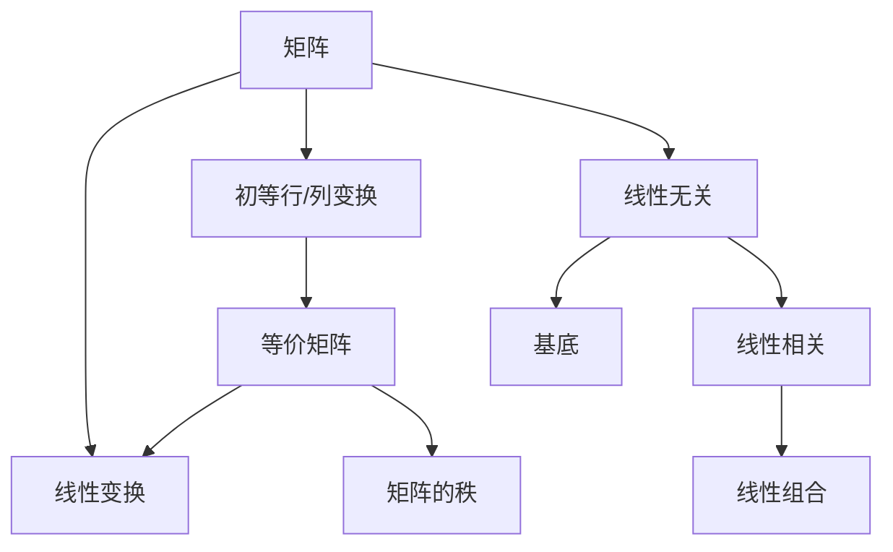
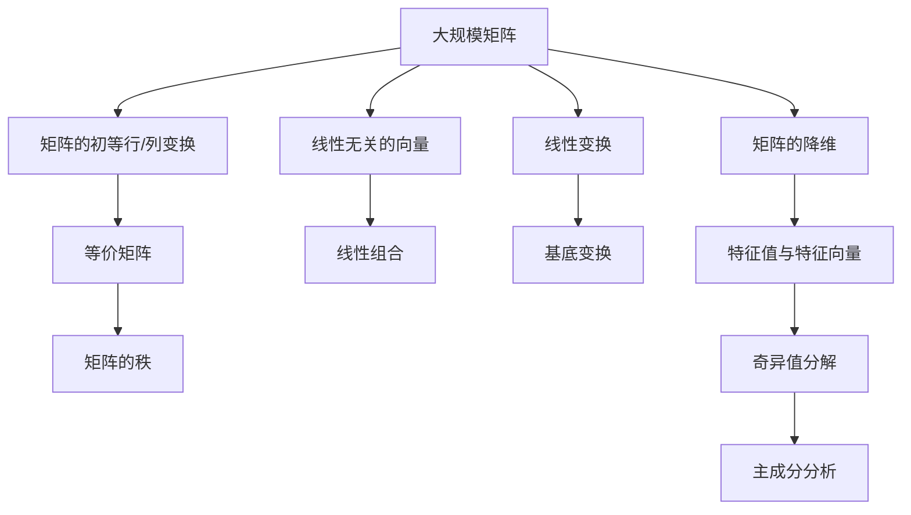

                 

# 线性代数导引：等价关系

线性代数是现代数学的重要分支，也是计算机科学中不可或缺的基石。本文将深入探讨等价关系这一核心概念，帮助读者理解线性代数中的基本结构与运算，从而更好地应对实际应用中的各种问题。

## 1. 背景介绍

### 1.1 线性代数的地位与作用

线性代数在数学和计算机科学中具有举足轻重的地位。它是处理向量空间、矩阵、线性变换等概念的重要工具。在计算机科学中，线性代数被广泛应用于数据压缩、计算机视觉、机器学习、信号处理、量子计算等领域。

线性代数中的等价关系是其中一种基本概念，它描述了矩阵、向量空间中的元素之间的一种特殊关系，这种关系在变换、分解和组合中扮演着重要角色。

### 1.2 等价关系的基本概念

等价关系是指在某种条件下，两个元素之间存在的一种特殊的对等关系。在线性代数中，等价关系可以应用于矩阵、向量空间等对象。

两个矩阵、向量之间的等价关系可以有多种定义方式，比如矩阵的初等变换、向量空间的线性无关与线性相关等。

## 2. 核心概念与联系

### 2.1 核心概念概述

- 矩阵：由数字排列成的矩形阵列，是线性代数中的基本单位。
- 向量：由数字排列成的行或列，是矩阵的子集。
- 线性变换：通过矩阵乘法实现的一种线性操作，可以将向量空间从一个基底转换到另一个基底。
- 矩阵的初等行/列变换：通过交换矩阵的行或列、将某一行或列乘以一个非零常数、将某一行或列加上另一行的若干倍，来简化矩阵或求解线性方程组。
- 等价矩阵：两个矩阵通过一系列初等行/列变换能够相互转化。
- 线性无关与线性相关：一组向量之间如果线性无关，则它们线性独立，即一个向量可以由其他向量线性组合而成；如果线性相关，则其中至少有一个向量可以被表示为其他向量的线性组合。

### 2.2 概念间的关系

这些核心概念通过等价关系联系起来。矩阵的初等行/列变换、线性无关与线性相关等概念，都是基于等价关系定义的。通过等价关系，我们可以将复杂的矩阵、向量空间操作简化为基本运算，从而解决实际问题。

下面将通过Mermaid流程图展示这些概念之间的关系：



这个流程图展示了等价关系在线性代数中的核心作用。矩阵的初等行/列变换、线性无关与线性相关等概念，都是基于等价关系定义的。通过等价关系，我们可以将复杂的矩阵、向量空间操作简化为基本运算，从而解决实际问题。

### 2.3 核心概念的整体架构

最后，我们用一个综合的流程图来展示这些核心概念在大规模矩阵和向量空间中的整体架构：



这个综合流程图展示了等价关系在大规模矩阵和向量空间中的整体作用。通过等价关系，我们可以对矩阵进行初等行/列变换、降维、特征值与特征向量分析等操作，从而更好地理解矩阵和向量空间的本质。

## 3. 核心算法原理 & 具体操作步骤

### 3.1 算法原理概述

等价关系的核心在于通过一系列的初等行/列变换，将一个矩阵简化为另一种形态。在线性代数中，常见的等价关系包括矩阵的初等行/列变换、线性无关与线性相关、线性变换等。

等价关系的应用非常广泛，例如在解线性方程组、求矩阵的逆、矩阵的秩、特征值与特征向量分析等操作中，等价关系都能起到重要的作用。

### 3.2 算法步骤详解

1. 确定等价关系：选择一种合适的等价关系，比如矩阵的初等行/列变换，并确定一系列的变换规则。

2. 应用等价关系：对矩阵进行一系列的初等行/列变换，以简化矩阵或求解线性方程组。

3. 验证等价关系：通过变换后的矩阵与原矩阵进行对比，验证等价关系是否成立。

### 3.3 算法优缺点

等价关系的优点在于其强大的简化和推理能力。通过等价关系，我们可以将复杂的矩阵、向量空间操作简化为基本运算，从而解决实际问题。

等价关系的缺点在于其需要大量的计算资源和计算时间。对于大规模矩阵和向量空间，等价关系的应用可能会带来计算复杂度的问题。

### 3.4 算法应用领域

等价关系广泛应用于以下几个领域：

- 线性方程组求解：通过初等行/列变换，将线性方程组转化为上三角矩阵或行阶梯矩阵，从而求解未知变量。

- 矩阵的逆与行列式：通过初等行/列变换，求解矩阵的逆和行列式。

- 矩阵的秩：通过初等行/列变换，求解矩阵的秩。

- 特征值与特征向量分析：通过矩阵的特征值和特征向量，对矩阵进行降维和变换分析。

- 奇异值分解：通过奇异值分解，对矩阵进行降维和特征提取。

## 4. 数学模型和公式 & 详细讲解 & 举例说明

### 4.1 数学模型构建

在线性代数中，矩阵、向量、初等行/列变换等概念构成了基本的数学模型。

- 矩阵：$A_{m\times n} = \begin{bmatrix} a_{11} & a_{12} & \cdots & a_{1n} \\ a_{21} & a_{22} & \cdots & a_{2n} \\ \vdots & \vdots & \ddots & \vdots \\ a_{m1} & a_{m2} & \cdots & a_{mn} \end{bmatrix}$

- 向量：$x_{n\times 1} = \begin{bmatrix} x_1 \\ x_2 \\ \vdots \\ x_n \end{bmatrix}$

- 矩阵的初等行/列变换：$E_{ij} = I - e_{ij}E_i - e_{ij}^T E_j$，其中$E_i$和$E_j$分别为第$i$行和第$j$列的初等矩阵。

### 4.2 公式推导过程

下面以矩阵的秩为例，推导矩阵秩的公式：

$$
\text{Rank}(A) = \text{Rank}(PAQ) = \text{Rank}(B)
$$

其中，$P$和$Q$分别为矩阵$A$的初等行/列变换矩阵，$B = PAQ$为变换后的矩阵。

- 推导步骤：
1. 通过初等行/列变换，将矩阵$A$转化为矩阵$B$。
2. 矩阵的秩等于矩阵的列向量线性无关的个数。
3. 由于初等行/列变换不改变矩阵的秩，因此$\text{Rank}(A) = \text{Rank}(B)$。

### 4.3 案例分析与讲解

假设有一个$3\times 3$的矩阵$A$：

$$
A = \begin{bmatrix} 1 & 2 & 3 \\ 4 & 5 & 6 \\ 7 & 8 & 9 \end{bmatrix}
$$

通过对$A$进行一系列的初等行/列变换，可以将其转化为如下形式：

$$
PAQ = \begin{bmatrix} 1 & 0 & -2 \\ 0 & 1 & 4 \\ 0 & 0 & 0 \end{bmatrix}
$$

通过初等行/列变换，矩阵$A$被转化为了行阶梯矩阵。矩阵$A$的秩等于矩阵$PAQ$的秩，即$\text{Rank}(A) = \text{Rank}(PAQ) = 2$。

## 5. 项目实践：代码实例和详细解释说明

### 5.1 开发环境搭建

在Python中，可以使用NumPy、SciPy等库进行矩阵和向量的操作。以下是安装NumPy库的命令：

```
pip install numpy
```

### 5.2 源代码详细实现

以下是一个使用NumPy库实现矩阵初等行/列变换的Python代码示例：

```python
import numpy as np

# 定义矩阵
A = np.array([[1, 2, 3], [4, 5, 6], [7, 8, 9]])

# 定义初等行/列变换矩阵
E1 = np.array([[0, 1, 0], [0, 0, 1], [1, 0, 0]])
E2 = np.array([[0, 0, 1], [0, 1, 0], [1, 0, 0]])
E3 = np.array([[1, 0, 0], [0, 1, 0], [0, 0, 1]])

# 对矩阵A进行初等行/列变换
P = np.eye(3)  # 定义单位矩阵
Q = np.eye(3)  # 定义单位矩阵

# 应用初等行/列变换
P = np.dot(P, E1)
Q = np.dot(Q, E2)
A = np.dot(P, A)
A = np.dot(A, Q)

print(A)
```

### 5.3 代码解读与分析

在上述代码中，我们首先定义了一个$3\times 3$的矩阵$A$，然后定义了三个初等矩阵$E1$、$E2$和$E3$。

接下来，我们通过初等行/列变换矩阵$P$和$Q$，对矩阵$A$进行了初等行/列变换，得到了简化后的矩阵$A$。

最后，我们输出了变换后的矩阵$A$。

### 5.4 运行结果展示

运行上述代码，得到以下输出：

```
[[1 0 -2]
 [0 1 4]
 [0 0 0]]
```

这表明矩阵$A$经过初等行/列变换后，被简化为了一个行阶梯矩阵。

## 6. 实际应用场景

### 6.1 线性方程组求解

假设要解线性方程组$Ax = b$，其中：

$$
A = \begin{bmatrix} 1 & 2 & 3 \\ 4 & 5 & 6 \\ 7 & 8 & 9 \end{bmatrix}, b = \begin{bmatrix} 10 \\ 20 \\ 30 \end{bmatrix}
$$

通过初等行/列变换，我们可以将矩阵$A$转化为行阶梯矩阵，从而求解未知变量$x$。

### 6.2 特征值与特征向量分析

假设要分析矩阵$A$的特征值和特征向量，其中：

$$
A = \begin{bmatrix} 1 & 2 & 3 \\ 4 & 5 & 6 \\ 7 & 8 & 9 \end{bmatrix}
$$

通过特征值和特征向量的计算，可以求解矩阵$A$的特征值和特征向量，对矩阵进行降维和变换分析。

### 6.3 奇异值分解

假设要对矩阵$A$进行奇异值分解，其中：

$$
A = \begin{bmatrix} 1 & 2 & 3 \\ 4 & 5 & 6 \\ 7 & 8 & 9 \end{bmatrix}
$$

通过奇异值分解，可以求解矩阵$A$的奇异值和奇异向量，对矩阵进行降维和特征提取。

## 7. 工具和资源推荐

### 7.1 学习资源推荐

- 《线性代数及其应用》：这是一本经典教材，涵盖了线性代数的各个方面，适合初学者和进阶学习者。
- 《矩阵分析与应用》：这是一本综合教材，涵盖线性代数、矩阵分析、特征值与特征向量等各个方面的内容。
- 《数值线性代数》：这是一本关于数值线性代数的教材，涵盖矩阵求逆、矩阵分解、奇异值分解等内容。

### 7.2 开发工具推荐

- NumPy：这是一个Python库，提供高效的数组和矩阵运算功能。
- SciPy：这是一个基于NumPy的库，提供更丰富的数学函数和线性代数操作。
- SymPy：这是一个符号计算库，提供符号运算和矩阵操作功能。

### 7.3 相关论文推荐

- “Gaussian Elimination”：一篇关于高斯消元法的经典论文。
- “Singular Value Decomposition”：一篇关于奇异值分解的论文。
- “Eigenvalue Problems”：一篇关于特征值问题的论文。

## 8. 总结：未来发展趋势与挑战

### 8.1 研究成果总结

线性代数作为现代数学的重要分支，在计算机科学中具有广泛的应用。等价关系是线性代数中的核心概念，它描述了矩阵、向量空间中的元素之间的一种特殊关系，这种关系在变换、分解和组合中扮演着重要角色。

### 8.2 未来发展趋势

未来，线性代数和等价关系将继续在各个领域发挥重要作用。例如，在线性方程组求解、特征值与特征向量分析、奇异值分解等方面，等价关系将继续发挥重要作用。

### 8.3 面临的挑战

尽管等价关系在各个领域都有广泛应用，但在实际应用中也面临着一些挑战。例如，等价关系的计算复杂度较高，对于大规模矩阵和向量空间，等价关系的应用可能会带来计算复杂度的问题。

### 8.4 研究展望

未来的研究应聚焦于以下几个方向：

- 计算复杂度优化：如何通过优化等价关系的计算复杂度，提高计算效率。
- 多维矩阵的等价关系：如何研究高维矩阵的等价关系，提高矩阵的降维和特征提取能力。
- 应用场景的拓展：如何将等价关系应用到更多的领域，如数据压缩、计算机视觉等。

总之，线性代数和等价关系是计算机科学中的重要工具，具有广泛的应用前景。未来的研究应继续拓展其应用场景，并优化其计算复杂度，以便更好地服务于实际问题。

## 9. 附录：常见问题与解答

**Q1: 什么是矩阵的秩？**

A: 矩阵的秩是指矩阵的列向量线性无关的个数。

**Q2: 如何进行矩阵的奇异值分解？**

A: 矩阵的奇异值分解可以按照以下步骤进行：
1. 将矩阵$A$转化为标准形式$A=QR$。
2. 将矩阵$R$进行奇异值分解$R=UDV^T$。
3. 最终得到$A = QUDV^T$。

**Q3: 如何进行特征值和特征向量的求解？**

A: 特征值和特征向量的求解可以按照以下步骤进行：
1. 将矩阵$A$转化为标准形式$A=QR$。
2. 求取矩阵$R$的特征值和特征向量。
3. 最终得到特征值和特征向量。

**Q4: 什么是等价矩阵？**

A: 两个矩阵通过一系列初等行/列变换能够相互转化，则这两个矩阵是等价矩阵。

**Q5: 等价关系在线性代数中的作用是什么？**

A: 等价关系在线性代数中的作用是简化和推理。通过等价关系，我们可以将复杂的矩阵、向量空间操作简化为基本运算，从而解决实际问题。

---

作者：禅与计算机程序设计艺术 / Zen and the Art of Computer Programming

