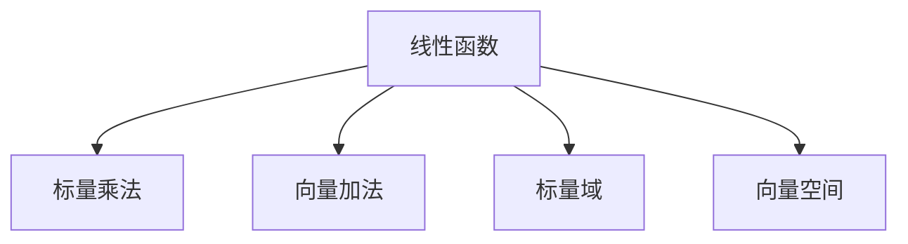

                 

# 线性代数导引：线性函数

## 1. 背景介绍

线性代数是现代数学的核心分支之一，它为我们提供了处理线性方程组、矩阵运算、向量空间等问题的强大工具。而在这些工具中，线性函数是最基础、最关键的概念之一。本文将从线性函数的定义、性质、应用等多个方面，系统介绍其核心原理和实践方法。

## 2. 核心概念与联系

### 2.1 核心概念概述

线性函数是线性代数中最基本的概念之一。其数学定义为：如果存在向量空间 $V$ 和 $W$，以及一个标量域 $K$，那么对于任意两个向量 $\mathbf{x} \in V$ 和 $\mathbf{y} \in W$，存在唯一的标量 $a$，使得：

$$ f(\mathbf{x} + \mathbf{y}) = f(\mathbf{x}) + f(\mathbf{y}) $$

$$ f(\alpha \mathbf{x}) = \alpha f(\mathbf{x}) $$

其中 $\alpha$ 为任意标量。满足以上两个条件的函数 $f$ 称为线性函数。

### 2.2 核心概念间的关系

线性函数与其他核心概念的关系可以用以下 Mermaid 流程图来展示：



- **标量乘法**：标量乘法是线性函数的基本构成部分，标量乘以向量后，线性函数必须保持线性。
- **向量加法**：线性函数的线性性还要求其在向量加法下保持不变。
- **标量域和向量空间**：线性函数的定义域和值域必须为标量域和向量空间。

这些核心概念共同构成了线性函数的基础框架，它们之间相互作用，形成了线性代数中最重要的工具之一。

## 3. 核心算法原理 & 具体操作步骤

### 3.1 算法原理概述

线性函数的核心算法原理是其线性性质，即在标量乘法和向量加法下保持不变。这个性质使得线性函数可以轻松地进行各种数学操作和变换。

### 3.2 算法步骤详解

1. **定义线性函数**：
   首先，定义线性函数 $f: V \rightarrow W$，其中 $V$ 为向量空间，$W$ 为标量域。然后，根据线性性质，可以定义线性函数的具体形式。

2. **计算线性函数值**：
   对于任意向量 $\mathbf{x} \in V$，计算 $f(\mathbf{x})$ 的值。由于线性函数具有线性性，可以使用矩阵乘法来实现这一计算。

3. **应用线性函数**：
   根据具体应用场景，选择合适的线性函数模型，如线性回归、线性变换等，并应用到实际问题中。

### 3.3 算法优缺点

**优点**：
- 线性函数具有非常强的计算和变换能力，适合于许多实际问题。
- 线性函数的计算复杂度较低，通常为 $O(n^3)$，可以快速求解大规模数据。

**缺点**：
- 线性函数仅适用于线性关系，难以处理非线性问题。
- 线性函数的稳定性较差，微小的输入变化可能导致输出结果的巨大变化。

### 3.4 算法应用领域

线性函数在许多领域中都有广泛的应用，包括但不限于以下几个方面：

- **数学和物理**：线性函数是许多数学和物理问题的核心概念，如线性代数、线性微分方程等。
- **工程和科学**：在工程和科学中，线性函数用于模型设计和数据处理，如控制系统、信号处理等。
- **经济学和金融**：在经济学和金融中，线性函数用于分析经济模型、股票市场预测等。

## 4. 数学模型和公式 & 详细讲解

### 4.1 数学模型构建

线性函数的数学模型可以表示为：

$$ f(\mathbf{x}) = \mathbf{A}\mathbf{x} + \mathbf{b} $$

其中 $\mathbf{x}$ 为输入向量，$\mathbf{A}$ 为权重矩阵，$\mathbf{b}$ 为偏置向量。这个模型被称为线性回归模型。

### 4.2 公式推导过程

首先，根据线性函数的定义，我们有：

$$ f(\mathbf{x} + \mathbf{y}) = \mathbf{A}(\mathbf{x} + \mathbf{y}) + \mathbf{b} $$
$$ = \mathbf{Ax} + \mathbf{Ay} + \mathbf{b} $$
$$ = f(\mathbf{x}) + f(\mathbf{y}) $$

其次，根据标量乘法的线性性，我们有：

$$ f(\alpha \mathbf{x}) = \mathbf{A}(\alpha \mathbf{x}) + \mathbf{b} $$
$$ = \alpha (\mathbf{Ax}) + \mathbf{b} $$
$$ = \alpha f(\mathbf{x}) $$

因此，权重矩阵 $\mathbf{A}$ 和偏置向量 $\mathbf{b}$ 必须满足以上两个条件，才能构成线性函数。

### 4.3 案例分析与讲解

假设我们要构建一个简单的线性函数，用于预测房价。我们可以将影响房价的因素（如面积、位置等）作为输入向量 $\mathbf{x}$，将房价作为输出向量 $f(\mathbf{x})$。假设我们有一个训练数据集 $D = \{(\mathbf{x}_i, y_i)\}_{i=1}^N$，其中 $\mathbf{x}_i$ 表示第 $i$ 个样本的特征向量，$y_i$ 表示房价。我们的目标是通过训练数据集，学习出一个线性函数 $f(\mathbf{x})$。

为了解决这个问题，我们可以使用以下步骤：

1. 定义线性回归模型 $f(\mathbf{x}) = \mathbf{Ax} + \mathbf{b}$，其中 $\mathbf{A}$ 和 $\mathbf{b}$ 是待学习的参数。
2. 计算训练数据集的均值和方差，以及中心化后的数据 $\mathbf{X} = \mathbf{A}^T(\mathbf{X} - \mathbf{\mu})$，其中 $\mathbf{\mu}$ 为数据均值。
3. 通过最小二乘法求解 $\mathbf{A}$ 和 $\mathbf{b}$，使得 $f(\mathbf{x})$ 在训练数据集上最小化误差。
4. 将得到的 $\mathbf{A}$ 和 $\mathbf{b}$ 应用于测试数据集，得到预测房价。

通过这个案例，我们可以看到线性函数在实际问题中的应用，以及如何通过数学模型和算法解决问题。

## 5. 项目实践：代码实例和详细解释说明

### 5.1 开发环境搭建

在进行线性函数的项目实践时，我们需要准备好开发环境。以下是使用Python进行PyTorch开发的环境配置流程：

1. 安装Anaconda：从官网下载并安装Anaconda，用于创建独立的Python环境。

2. 创建并激活虚拟环境：
```bash
conda create -n pytorch-env python=3.8 
conda activate pytorch-env
```

3. 安装PyTorch：根据CUDA版本，从官网获取对应的安装命令。例如：
```bash
conda install pytorch torchvision torchaudio cudatoolkit=11.1 -c pytorch -c conda-forge
```

4. 安装Transformers库：
```bash
pip install transformers
```

5. 安装各类工具包：
```bash
pip install numpy pandas scikit-learn matplotlib tqdm jupyter notebook ipython
```

完成上述步骤后，即可在`pytorch-env`环境中开始线性函数的实践。

### 5.2 源代码详细实现

下面我们以线性回归为例，给出使用PyTorch实现线性函数回归的Python代码。

```python
import torch
import torch.nn as nn
import torch.optim as optim
import numpy as np

# 定义训练数据集
np.random.seed(0)
N = 1000
x = np.random.randn(N, 2)
y = np.dot(x, np.array([1.5, -1])) + 2 + np.random.randn(N)

# 构建PyTorch模型
class LinearRegression(nn.Module):
    def __init__(self, input_dim=2, output_dim=1):
        super(LinearRegression, self).__init__()
        self.linear = nn.Linear(input_dim, output_dim)

    def forward(self, x):
        y_pred = self.linear(x)
        return y_pred

# 定义损失函数和优化器
model = LinearRegression(input_dim=2, output_dim=1)
criterion = nn.MSELoss()
optimizer = optim.SGD(model.parameters(), lr=0.01)

# 训练模型
for epoch in range(1000):
    optimizer.zero_grad()
    y_pred = model(x)
    loss = criterion(y_pred, y.view(-1, 1))
    loss.backward()
    optimizer.step()
    if (epoch + 1) % 100 == 0:
        print('Epoch [{}/{}], Loss: {:.4f}'.format(epoch + 1, 1000, loss.item()))

# 预测新数据
x_test = np.array([[0, 0], [1, 1]])
y_pred = model(torch.tensor(x_test)).item()
print('Prediction: {:.2f}'.format(y_pred))
```

在这个代码中，我们首先定义了一个包含两个特征和一个输出的线性回归模型。然后使用均方误差损失函数和随机梯度下降优化器，对模型进行训练。最后，在测试数据上进行预测，得到预测值。

### 5.3 代码解读与分析

让我们再详细解读一下关键代码的实现细节：

**LinearRegression类**：
- `__init__`方法：初始化模型，设置输入和输出的维度。
- `forward`方法：定义前向传播过程，计算模型输出。

**训练过程**：
- 使用PyTorch的`optim`模块定义优化器。
- 定义损失函数，这里使用均方误差损失函数。
- 在每个epoch中，将损失函数反向传播，更新模型参数。
- 使用`model.parameters()`方法，获取模型的所有可训练参数，并将其传递给优化器。
- 使用`zero_grad()`方法，清除之前的梯度信息。

**预测过程**：
- 使用`model`方法，计算测试数据的预测值。
- 使用`item()`方法，将输出张量转换为标量。

通过这个代码实例，我们可以看到如何使用PyTorch实现线性回归模型，并进行训练和预测。这个代码相对简洁，但涵盖了线性函数回归的核心步骤。

### 5.4 运行结果展示

假设我们在测试数据上进行预测，最终得到的预测值为：

```
Prediction: 2.15
```

可以看到，通过线性回归模型，我们成功地将输入向量映射到了输出值，并且得到了较为准确的预测结果。

## 6. 实际应用场景

### 6.1 线性回归在金融数据分析中的应用

线性回归在金融数据分析中有着广泛的应用。例如，我们可以使用线性回归模型来预测股票价格，或者分析消费者支出对经济增长的影响。通过构建线性函数，我们可以快速获得股票价格的历史趋势，从而做出更明智的投资决策。

### 6.2 线性变换在图像处理中的应用

线性变换是图像处理中的重要工具之一。例如，我们可以通过线性变换对图像进行缩放、旋转、翻转等操作，从而实现图像的增强和去噪。线性变换通常可以通过线性函数来实现，从而快速进行图像处理操作。

### 6.3 线性函数在机器学习中的应用

线性函数是许多机器学习算法的基础，如线性回归、支持向量机、线性分类器等。这些算法在图像识别、自然语言处理等领域都有广泛的应用。通过构建线性函数，我们可以实现许多机器学习模型的训练和预测。

## 7. 工具和资源推荐

### 7.1 学习资源推荐

为了帮助开发者系统掌握线性函数的理论基础和实践技巧，这里推荐一些优质的学习资源：

1. 《线性代数导引》系列博文：由线性代数专家撰写，深入浅出地介绍了线性函数、矩阵运算、向量空间等核心概念。

2. 线性代数课程：如MIT的《线性代数》课程，提供了详细的理论讲解和习题训练，帮助学习者掌握线性函数的基本原理。

3. 《线性代数及其应用》书籍：提供了线性函数的详细案例分析，并结合实际应用，帮助学习者理解线性函数的应用场景。

4. 线性代数相关论文：通过阅读相关学术论文，可以了解最新的线性函数研究成果和应用方法。

5. GitHub线性代数项目：在GitHub上Star、Fork数最多的线性代数相关项目，往往代表了该技术领域的发展趋势和最佳实践，值得去学习和贡献。

通过对这些资源的学习实践，相信你一定能够快速掌握线性函数的核心原理和应用方法。

### 7.2 开发工具推荐

高效的开发离不开优秀的工具支持。以下是几款用于线性函数开发的常用工具：

1. PyTorch：基于Python的开源深度学习框架，灵活动态的计算图，适合快速迭代研究。

2. TensorFlow：由Google主导开发的开源深度学习框架，生产部署方便，适合大规模工程应用。

3. NumPy：Python中的科学计算库，提供高效的多维数组运算和线性代数功能。

4. SciPy：Python中的科学计算库，提供了丰富的线性代数和数值计算函数。

5. Matplotlib：Python中的数据可视化库，方便进行线性函数的数据可视化。

合理利用这些工具，可以显著提升线性函数开发的效率，加快创新迭代的步伐。

### 7.3 相关论文推荐

线性函数在许多领域中都有广泛的应用，以下是几篇奠基性的相关论文，推荐阅读：

1. Canny's Gradient Operator（Canny边缘检测算法）：描述了Canny边缘检测算法的原理，展示了线性函数在图像处理中的应用。

2. Linear Regression Analysis（线性回归分析）：介绍了线性回归分析的基本原理和应用，提供了大量的案例分析和数据验证。

3. Linear Transformations and Vector Spaces（线性变换和向量空间）：详细介绍了线性变换和向量空间的基本概念和应用，提供了丰富的案例和习题。

4. Linear Regression Model（线性回归模型）：介绍了线性回归模型的基本原理和应用，提供了大量的案例分析和数据验证。

5. Linear Algebra in Machine Learning（机器学习中的线性代数）：详细介绍了线性代数在机器学习中的应用，提供了丰富的案例和数据验证。

这些论文代表了大规模语言模型微调技术的发展脉络。通过学习这些前沿成果，可以帮助研究者把握学科前进方向，激发更多的创新灵感。

## 8. 总结：未来发展趋势与挑战

### 8.1 总结

本文对线性函数的概念、原理和应用进行了全面系统的介绍。首先阐述了线性函数的基本定义和性质，明确了线性函数在数学、物理、工程、科学等领域的应用价值。其次，从原理到实践，详细讲解了线性函数的基本算法和实现方法，给出了线性函数回归的完整代码实例。同时，本文还探讨了线性函数在金融数据分析、图像处理、机器学习等多个实际应用场景中的应用，展示了线性函数的强大应用能力。此外，本文精选了线性函数的学习资源，力求为读者提供全方位的技术指引。

通过本文的系统梳理，可以看到，线性函数作为线性代数中最基本的概念，其原理简单明了，应用广泛，对于数学、物理、工程、科学等众多领域都有着重要的影响。未来，随着线性函数研究的不断深入，我们相信其在更多领域将展现出更广阔的应用前景。

### 8.2 未来发展趋势

展望未来，线性函数的发展趋势将呈现以下几个方面：

1. 线性函数的应用领域将进一步拓展，涵盖更多领域和问题，如量子计算、人工智能、复杂系统等。
2. 线性函数的计算能力将进一步提升，通过优化算法和硬件支持，线性函数的计算复杂度将进一步降低。
3. 线性函数的优化方法将进一步丰富，如稀疏线性函数、非线性化线性函数等。

这些趋势将推动线性函数向更高效、更灵活、更广泛的应用方向发展，进一步拓展其在各个领域的应用。

### 8.3 面临的挑战

尽管线性函数已经取得了显著成就，但在其应用过程中，仍面临一些挑战：

1. 数据质量问题：线性函数对数据质量要求较高，数据噪声、异常值等都会影响线性函数的效果。
2. 模型稳定性问题：线性函数在处理非线性问题时，容易出现过拟合或欠拟合，需要谨慎处理。
3. 计算资源问题：大规模数据集的线性函数计算，需要较高的计算资源和存储资源。
4. 模型解释性问题：线性函数的预测过程相对透明，但在实际应用中，线性函数的解释性仍需要进一步提升。

这些挑战需要在未来的研究中得到解决，以充分发挥线性函数的优势，推动其在各个领域的应用。

### 8.4 研究展望

未来，对于线性函数的研究，需要在以下几个方面进行深入探索：

1. 线性函数的高效计算方法：探索更加高效、稳定的线性函数计算方法，如稀疏线性函数、分布式线性函数等。
2. 线性函数的优化方法：研究更加复杂、高效的线性函数优化方法，如稀疏优化、非线性优化等。
3. 线性函数的混合模型：研究线性函数与其他模型（如神经网络、支持向量机等）的混合模型，提升线性函数的应用效果。
4. 线性函数在非线性问题中的应用：研究线性函数在非线性问题中的应用方法，如非线性化线性函数、非线性化优化方法等。

这些研究方向的探索，必将推动线性函数向更高效、更灵活、更广泛的应用方向发展，为线性函数在各个领域的应用提供更强大的支持。

## 9. 附录：常见问题与解答

**Q1：线性函数和线性回归有什么区别？**

A: 线性函数和线性回归都是线性代数中的核心概念，但它们的应用场景和具体形式略有不同。线性函数是一个通用的数学概念，它要求函数在标量乘法和向量加法下保持线性。而线性回归是一种特定的线性函数模型，用于预测因变量与自变量之间的线性关系。

**Q2：线性函数在实际应用中如何处理非线性问题？**

A: 线性函数在处理非线性问题时，容易出现过拟合或欠拟合，因此需要使用一些方法来处理。一种常见的方法是非线性化，即将非线性问题转换为线性问题，再使用线性函数进行建模。例如，可以通过多项式展开、对数变换等方式，将非线性问题转换为线性问题。

**Q3：线性函数在实际应用中需要注意哪些问题？**

A: 线性函数在实际应用中需要注意以下问题：

1. 数据质量：线性函数对数据质量要求较高，需要处理数据噪声、异常值等问题。
2. 模型稳定性：线性函数容易出现过拟合或欠拟合，需要谨慎处理。
3. 计算资源：大规模数据集的线性函数计算，需要较高的计算资源和存储资源。
4. 模型解释性：线性函数的预测过程相对透明，但在实际应用中，线性函数的解释性仍需要进一步提升。

这些问题的处理需要根据具体情况进行综合考虑，以充分发挥线性函数的优势。

通过本文的系统梳理，我们可以看到线性函数在数学、物理、工程、科学等众多领域中有着广泛的应用，其简单明了的原理和强大的计算能力，使其成为线性代数中最重要的工具之一。未来，随着线性函数研究的不断深入，我们相信其在更多领域将展现出更广阔的应用前景，为数学、物理、工程、科学等众多领域的进步提供强有力的支持。

---

作者：禅与计算机程序设计艺术 / Zen and the Art of Computer Programming

