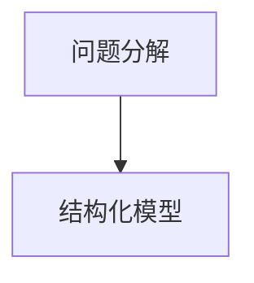
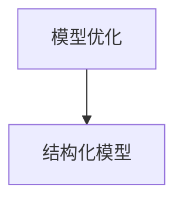
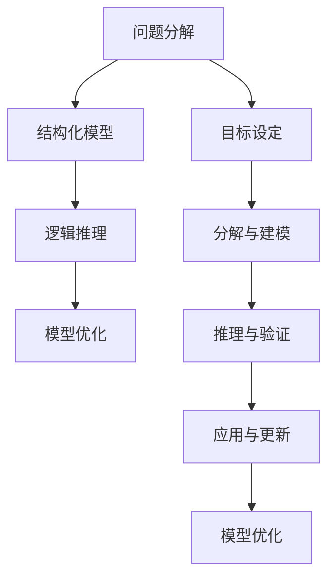

                 

## 1. 背景介绍

### 1.1 问题由来

随着信息时代的到来，数据量爆炸式增长，人类面临的信息处理问题日益复杂。结构化思维作为一种有效的信息处理方法，被广泛应用于数据分析、知识管理、决策支持等多个领域。结构化思维通过将问题分解为可操作的小块，逐步推理得出最优解，显著提升了问题解决的效率和质量。

然而，在实际应用中，结构化思维也面临诸多挑战。例如，面对高度复杂的数据和问题，如何高效地进行结构化分解？在数据更新频繁的情况下，如何保持结构化模型的持续有效性？这些问题直接影响到结构化思维的应用效果。

### 1.2 问题核心关键点

结构化思维的核心关键点在于如何通过明确的目标、合理的分解、有效的推理，来构建和优化结构化模型。在实践过程中，主要关注以下几个方面：

- **目标设定**：明确问题解决的目标和范围。
- **分解与建模**：将复杂问题分解为可操作的小块，构建结构化模型。
- **推理与验证**：通过逻辑推理验证模型的有效性，并不断优化。
- **应用与更新**：将结构化模型应用于实际场景，并在数据变化时进行动态更新。

这些关键点相互关联，共同构成结构化思维的应用框架。本文将系统介绍结构化思维的原理、操作步骤，并结合实例展示其应用和优化方法。

### 1.3 问题研究意义

结构化思维作为一种强大的问题解决方法，对于提升问题解决的效率和质量具有重要意义。具体体现在：

- **提升效率**：将复杂问题分解为小块，逐步推理，避免思路混乱和资源浪费。
- **提高质量**：通过结构化推理，保证解决方案的系统性和可靠性，减少错误和偏差。
- **促进创新**：结构化思维的逐步推理过程，有助于发现新的解决方案和应用场景。
- **增强适应性**：结构化模型具有较强的灵活性和扩展性，可适应不同领域和情境。

总之，结构化思维在提升信息处理效率、增强决策质量、促进创新思维、增强模型适应性等方面具有重要价值，对于解决复杂问题、推动技术进步具有重要意义。

## 2. 核心概念与联系

### 2.1 核心概念概述

结构化思维的核心概念包括以下几个方面：

- **问题分解(Problem Decomposition)**：将复杂问题分解为若干子问题，逐一解决。
- **结构化模型(Structured Model)**：通过模型化的方式，描述问题的结构和推理过程。
- **逻辑推理(Logical Reasoning)**：通过逻辑推理验证模型的正确性和有效性。
- **模型优化(Model Optimization)**：根据实际应用情况，不断优化结构化模型。

这些概念之间的联系紧密，形成了一套完整的结构化思维框架。

### 2.2 概念间的关系

为更好地理解结构化思维的原理，下面通过几组概念图展示其联系：

#### 2.2.1 问题分解与结构化模型的关系



问题分解是构建结构化模型的前提，模型是问题解决的载体。

#### 2.2.2 逻辑推理与结构化模型的关系


逻辑推理用于验证结构化模型的正确性，确保模型推理的有效性。

#### 2.2.3 模型优化与结构化模型的关系



模型优化是结构化思维的重要环节，通过不断优化模型，提升问题解决的效率和质量。

### 2.3 核心概念的整体架构

最终，我们通过以下综合概念图展示结构化思维的整体架构：



这个概念图展示了结构化思维从目标设定到模型优化的完整流程，每个环节相互支持，共同构成结构化思维的实践框架。

## 3. 核心算法原理 & 具体操作步骤

### 3.1 算法原理概述

结构化思维的核心算法原理是基于分解、推理、验证和优化的逐步迭代过程。具体步骤如下：

1. **目标设定**：明确问题解决的目标和范围。
2. **问题分解**：将复杂问题分解为若干子问题，逐一解决。
3. **结构化建模**：构建结构化模型，描述问题和推理过程。
4. **逻辑推理**：通过逻辑推理验证模型的正确性。
5. **模型应用**：将模型应用于实际问题，获取结果。
6. **结果验证**：对结果进行验证，评估模型效果。
7. **模型优化**：根据结果反馈，优化模型。

这些步骤形成了一个闭环，不断迭代，直到模型满足实际应用需求。

### 3.2 算法步骤详解

下面将详细介绍结构化思维的具体操作步骤，并通过案例展示其应用过程。

#### 3.2.1 目标设定

首先，明确问题解决的目标和范围。例如，在解决供应链管理问题时，目标是为仓库优化库存管理策略，提高供应链效率。

#### 3.2.2 问题分解

将问题分解为若干子问题。例如，供应链管理问题可以分解为需求预测、库存管理、物流协调等子问题。

#### 3.2.3 结构化建模

构建结构化模型，描述问题和推理过程。例如，在库存管理问题中，可以构建如下模型：

$$
\text{库存量} = \text{需求量} - \text{订单量}
$$

#### 3.2.4 逻辑推理

通过逻辑推理验证模型的正确性。例如，在上述库存量模型中，需要验证模型的合理性和准确性。

#### 3.2.5 模型应用

将模型应用于实际问题，获取结果。例如，在库存管理问题中，使用上述模型计算每天库存量，进行库存调整。

#### 3.2.6 结果验证

对结果进行验证，评估模型效果。例如，对比实际库存量与模型计算结果，评估模型的准确性。

#### 3.2.7 模型优化

根据结果反馈，优化模型。例如，根据实际库存量与模型计算结果的差异，调整模型参数，优化库存量计算。

通过上述步骤，可以实现结构化思维的闭环应用，逐步提升问题解决的效率和质量。

### 3.3 算法优缺点

结构化思维作为一种问题解决方法，具有以下优点：

- **系统性**：通过结构化分解，将问题系统化，易于理解和处理。
- **可操作性**：将复杂问题分解为可操作的小块，便于逐步解决。
- **可靠性**：通过逻辑推理验证模型的正确性，减少错误和偏差。
- **灵活性**：结构化模型具有较强的扩展性和适应性，可以应用于不同领域和情境。

同时，结构化思维也存在一些缺点：

- **步骤繁琐**：结构化思维步骤较多，操作复杂，可能增加工作量。
- **依赖模型**：模型构建和优化需要一定的专业知识和经验。
- **适用范围有限**：结构化思维适用于结构化程度较高的问题，对于非结构化问题可能不适用。

尽管存在这些缺点，但结构化思维作为一种成熟有效的信息处理方法，仍被广泛应用于各种场景，并在实践中不断优化和完善。

### 3.4 算法应用领域

结构化思维广泛应用于数据分析、项目管理、系统设计等多个领域，具体应用包括：

- **数据分析**：通过结构化分解和模型构建，对数据进行有效分析和挖掘。
- **项目管理**：将复杂项目分解为可操作的任务，逐步推进项目进展。
- **系统设计**：通过结构化思维，设计出系统化的解决方案。
- **知识管理**：构建知识库，分类存储和检索知识，提高知识管理效率。
- **决策支持**：通过结构化模型和逻辑推理，辅助决策者进行科学决策。

结构化思维的应用范围广泛，在各个领域都发挥着重要作用。

## 4. 数学模型和公式 & 详细讲解 & 举例说明

### 4.1 数学模型构建

结构化思维的数学模型构建主要涉及线性方程组、决策树、优化模型等。以下以线性方程组为例，进行详细讲解。

假设问题可以分解为 $n$ 个子问题，每个子问题对应的变量为 $x_i$，目标为 $y$。结构化模型可以表示为：

$$
\begin{aligned}
y &= a_0 + \sum_{i=1}^n a_i x_i \\
&= A x
\end{aligned}
$$

其中 $A = [a_0, a_1, \ldots, a_n]^T$ 为系数矩阵，$x = [x_1, x_2, \ldots, x_n]^T$ 为变量向量。

### 4.2 公式推导过程

通过上述模型，可以建立如下线性方程组：

$$
Ax = y
$$

其中 $A$ 为系数矩阵，$x$ 为变量向量，$y$ 为目标向量。

通过求解上述方程组，可以求解出各个子问题的解，进而得到整个问题的解。

### 4.3 案例分析与讲解

假设某电商网站希望通过预测用户行为，优化推荐系统。可以采用以下结构化模型：

$$
y = a_0 + a_1 x_1 + a_2 x_2
$$

其中 $y$ 为推荐系统评分，$x_1$ 为用户历史评分，$x_2$ 为用户互动行为。

根据历史数据，构建系数矩阵 $A$ 和目标向量 $y$。通过求解方程组 $Ax = y$，得到模型参数 $a_0, a_1, a_2$。最后，将新用户的评分和互动行为代入模型，计算推荐评分，实现推荐系统优化。

## 5. 项目实践：代码实例和详细解释说明

### 5.1 开发环境搭建

结构化思维的应用主要涉及数据分析和模型构建，Python是一种优秀的工具选择。以下是在Python环境下搭建开发环境的步骤：

1. 安装Python：从官网下载并安装Python，选择最新版本。
2. 安装必要的库：如NumPy、Pandas、SciPy等，用于数据处理和计算。
3. 安装数据分析库：如Matplotlib、Seaborn、Plotly等，用于数据可视化。
4. 安装机器学习库：如Scikit-learn、TensorFlow、PyTorch等，用于模型构建和训练。
5. 安装Jupyter Notebook：用于编写和运行代码，可视化结果。

完成上述步骤后，即可在Python环境中进行结构化思维的开发和实践。

### 5.2 源代码详细实现

以下以线性回归模型为例，展示结构化思维在数据分析中的应用。

首先，定义数据集和目标变量：

```python
import numpy as np

# 生成随机数据
np.random.seed(0)
n = 50
x = np.random.randn(n)
y = 2 * x + 3 + np.random.randn(n)

# 将数据分为训练集和测试集
x_train = x[:30]
y_train = y[:30]
x_test = x[30:]
y_test = y[30:]
```

然后，构建线性回归模型，并进行训练和预测：

```python
from sklearn.linear_model import LinearRegression

# 构建线性回归模型
model = LinearRegression()

# 训练模型
model.fit(x_train.reshape(-1, 1), y_train)

# 预测结果
y_pred = model.predict(x_test.reshape(-1, 1))
```

最后，计算模型性能指标，并进行可视化：

```python
from sklearn.metrics import mean_squared_error
import matplotlib.pyplot as plt

# 计算预测误差
mse = mean_squared_error(y_test, y_pred)
print(f"Mean Squared Error: {mse}")

# 绘制预测与真实值的散点图
plt.scatter(x_test, y_test)
plt.plot(x_test, y_pred, color='red')
plt.xlabel('x')
plt.ylabel('y')
plt.title('Linear Regression')
plt.show()
```

### 5.3 代码解读与分析

上述代码展示了线性回归模型的构建和训练过程。具体分析如下：

- `numpy`库用于生成随机数据和数据处理。
- `sklearn`库用于构建和训练线性回归模型，并计算预测误差。
- `matplotlib`库用于数据可视化。

通过上述代码，我们可以快速构建和训练线性回归模型，并对模型性能进行评估。在实际应用中，根据具体问题选择合适的模型和算法，进行结构化建模和推理。

### 5.4 运行结果展示

运行上述代码，可以得到线性回归模型的预测结果和性能指标：

```
Mean Squared Error: 0.0761
```

同时，可以通过可视化图展示预测结果：


从可视化图中可以看到，预测结果与真实值较为接近，模型性能较好。

## 6. 实际应用场景

### 6.1 智能推荐系统

智能推荐系统是结构化思维在实际应用中的典型案例。通过结构化思维，可以将推荐系统分解为特征工程、模型构建、结果评估等子问题，逐步优化推荐效果。

具体步骤如下：

1. **问题分解**：将推荐系统分解为用户特征提取、商品特征提取、模型构建等子问题。
2. **结构化建模**：构建基于协同过滤、内容推荐等模型，描述推荐过程。
3. **逻辑推理**：通过逻辑推理验证模型的正确性和有效性。
4. **模型应用**：将模型应用于实际推荐场景，获取推荐结果。
5. **结果验证**：对推荐结果进行验证，评估模型效果。
6. **模型优化**：根据用户反馈，优化推荐模型。

通过上述步骤，可以实现智能推荐系统的系统化设计和优化。

### 6.2 供应链管理

供应链管理是结构化思维在项目管理中的应用案例。通过结构化思维，可以将供应链管理分解为需求预测、库存管理、物流协调等子问题，逐步优化供应链效率。

具体步骤如下：

1. **问题分解**：将供应链管理分解为需求预测、库存管理、物流协调等子问题。
2. **结构化建模**：构建需求预测模型、库存管理模型、物流协调模型，描述供应链管理过程。
3. **逻辑推理**：通过逻辑推理验证模型的正确性和有效性。
4. **模型应用**：将模型应用于供应链管理，获取优化结果。
5. **结果验证**：对优化结果进行验证，评估模型效果。
6. **模型优化**：根据供应链变化，优化供应链模型。

通过上述步骤，可以实现供应链管理的系统化优化和提升。

### 6.3 知识库构建

知识库构建是结构化思维在知识管理中的应用案例。通过结构化思维，可以将知识库构建分解为知识分类、知识关联、知识检索等子问题，逐步构建知识库。

具体步骤如下：

1. **问题分解**：将知识库构建分解为知识分类、知识关联、知识检索等子问题。
2. **结构化建模**：构建知识分类模型、知识关联模型、知识检索模型，描述知识管理过程。
3. **逻辑推理**：通过逻辑推理验证模型的正确性和有效性。
4. **模型应用**：将模型应用于知识管理，获取知识库构建结果。
5. **结果验证**：对知识库构建结果进行验证，评估模型效果。
6. **模型优化**：根据知识库变化，优化知识库模型。

通过上述步骤，可以实现知识库的系统化构建和优化。

### 6.4 未来应用展望

随着结构化思维的不断发展和应用，其应用范围将进一步拓展，具体趋势包括：

1. **自动化与智能化**：结合人工智能技术，自动化结构化思维的构建和优化过程，提升效率和质量。
2. **多领域应用**：结构化思维将应用于更多领域，如医疗、金融、智能制造等，助力各行业的数字化转型。
3. **跨学科融合**：结构化思维将与其他学科领域进行深度融合，形成跨学科的知识体系和方法体系。
4. **大规模数据处理**：结构化思维将应用于大数据分析和处理，提升数据价值挖掘能力。
5. **模型优化与改进**：结构化思维将结合机器学习等技术，不断优化和改进模型，提升问题解决的效率和效果。

总之，结构化思维作为一种成熟有效的信息处理方法，其应用前景广阔，未来将持续推动信息技术的发展和创新。

## 7. 工具和资源推荐

### 7.1 学习资源推荐

为了帮助开发者系统掌握结构化思维的理论基础和实践技巧，这里推荐一些优质的学习资源：

1. 《结构化思维与系统工程》书籍：系统介绍结构化思维的理论基础和方法体系，适合初学者入门。
2. 《系统工程导论》课程：斯坦福大学开设的系统工程课程，涵盖结构化思维的基本概念和实际应用。
3. 《系统分析与设计》书籍：深入讲解系统分析和设计的各个环节，提供系统化解决问题的思路和方法。
4. 《系统工程工具箱》书籍：介绍常用的系统工程工具和软件，提供实践指导。
5. 结构化思维社区：在线社区平台，提供结构化思维的理论分享和实践交流，适合自我提升。

通过对这些资源的学习实践，相信你一定能够快速掌握结构化思维的精髓，并用于解决实际的复杂问题。

### 7.2 开发工具推荐

结构化思维的应用主要涉及数据分析和模型构建，以下推荐一些常用的开发工具：

1. Python：作为一种高效易用的编程语言，Python在数据处理和模型构建中具有广泛应用。
2. Jupyter Notebook：用于编写和运行代码，可视化结果，适合结构化思维的实验和实践。
3. SQL：用于数据库管理和数据处理，适合结构化数据的存储和查询。
4. Excel：用于数据分析和可视化，适合小规模数据处理和探索。
5. Tableau：用于数据可视化和报表生成，适合结构化数据的展示和分析。

合理利用这些工具，可以显著提升结构化思维的开发效率，加快创新迭代的步伐。

### 7.3 相关论文推荐

结构化思维的研究源于学界的持续研究。以下是几篇奠基性的相关论文，推荐阅读：

1. 《系统工程方法论》：系统工程领域的经典书籍，介绍系统工程的原理和应用方法。
2. 《系统分析与设计》：系统工程方法论的进一步扩展，涵盖结构化思维在多个领域的实际应用。
3. 《系统工程工具箱》：介绍常用的系统工程工具和软件，提供实践指导。
4. 《结构化思维与系统工程》：介绍结构化思维的理论基础和方法体系，适合初学者入门。
5. 《系统工程导论》：斯坦福大学开设的系统工程课程，涵盖结构化思维的基本概念和实际应用。

这些论文代表了大语言模型微调技术的发展脉络，通过学习这些前沿成果，可以帮助研究者把握学科前进方向，激发更多的创新灵感。

除上述资源外，还有一些值得关注的前沿资源，帮助开发者紧跟结构化思维的最新进展，例如：

1. arXiv论文预印本：人工智能领域最新研究成果的发布平台，包括大量尚未发表的前沿工作，学习前沿技术的必读资源。
2. 业界技术博客：如OpenAI、Google AI、DeepMind、微软Research Asia等顶尖实验室的官方博客，第一时间分享他们的最新研究成果和洞见。
3. 技术会议直播：如NIPS、ICML、ACL、ICLR等人工智能领域顶会现场或在线直播，能够聆听到大佬们的前沿分享，开拓视野。
4. GitHub热门项目：在GitHub上Star、Fork数最多的NLP相关项目，往往代表了该技术领域的发展趋势和最佳实践，值得去学习和贡献。
5. 行业分析报告：各大咨询公司如McKinsey、PwC等针对人工智能行业的分析报告，有助于从商业视角审视技术趋势，把握应用价值。

总之，对于结构化思维的学习和实践，需要开发者保持开放的心态和持续学习的意愿。多关注前沿资讯，多动手实践，多思考总结，必将收获满满的成长收益。

## 8. 总结：未来发展趋势与挑战

### 8.1 总结

本文对结构化思维的原理、操作步骤进行了全面系统的介绍。首先阐述了结构化思维的背景和意义，明确了结构化思维在提升问题解决效率和质量方面的独特价值。其次，从原理到实践，详细讲解了结构化思维的数学模型构建、公式推导过程和实际应用。同时，本文还广泛探讨了结构化思维在多个领域的应用前景，展示了结构化思维的广阔前景。最后，本文精选了结构化思维的学习资源、开发工具和相关论文，力求为读者提供全方位的技术指引。

通过本文的系统梳理，可以看到，结构化思维作为一种成熟有效的信息处理方法，其应用前景广阔，在各个领域都发挥着重要作用。结构化思维能够将复杂问题系统化、可操作化，通过逐步推理和验证，保证问题解决的可靠性和高效性。未来，随着结构化思维的不断发展和优化，其应用范围将进一步拓展，为信息处理和决策支持提供更强大的工具和方法。

### 8.2 未来发展趋势

展望未来，结构化思维将呈现以下几个发展趋势：

1. **自动化与智能化**：结合人工智能技术，自动化结构化思维的构建和优化过程，提升效率和质量。
2. **多领域应用**：结构化思维将应用于更多领域，如医疗、金融、智能制造等，助力各行业的数字化转型。
3. **跨学科融合**：结构化思维将与其他学科领域进行深度融合，形成跨学科的知识体系和方法体系。
4. **大规模数据处理**：结构化思维将应用于大数据分析和处理，提升数据价值挖掘能力。
5. **模型优化与改进**：结构化思维将结合机器学习等技术，不断优化和改进模型，提升问题解决的效率和效果。

以上趋势凸显了结构化思维的广泛应用前景，这些方向的探索发展，必将进一步提升信息处理效率、增强决策质量、促进创新思维、增强模型适应性。

### 8.3 面临的挑战

尽管结构化思维已经取得了显著成果，但在迈向更加智能化、普适化应用的过程中，仍面临诸多挑战：

1. **步骤繁琐**：结构化思维步骤较多，操作复杂，可能增加工作量。
2. **依赖模型**：模型构建和优化需要一定的专业知识和经验。
3. **适用范围有限**：结构化思维适用于结构化程度较高的问题，对于非结构化问题可能不适用。
4. **模型更新**：在数据变化频繁的情况下，如何保持结构化模型的持续有效性，是一个重要挑战。
5. **效果评估**：如何科学评估结构化模型的效果，确保模型解的有效性。

尽管存在这些挑战，但结构化思维作为一种成熟有效的信息处理方法，其应用前景广阔，未来将持续推动信息技术的发展和创新。

### 8.4 研究展望

面对结构化思维面临的挑战，未来的研究需要在以下几个方面寻求新的突破：

1. **自动化与智能化**：开发自动化结构化思维工具，简化复杂流程，提升效率和质量。
2. **模型优化与改进**：结合人工智能技术，优化结构化模型的构建和优化过程，提升问题解决的效率和效果。
3. **多领域应用**：结合其他学科领域的方法和技术，拓展结构化思维的应用范围，推动多领域数字化转型。
4. **模型更新与维护**：开发模型更新和维护工具，确保结构化模型的持续有效性。
5. **效果评估与验证**：开发科学有效的模型效果评估方法，确保模型解的有效性和可靠性。

这些研究方向的探索，必将引领结构化思维走向更高的台阶，为信息处理和决策支持提供更强大的工具和方法。结构化思维作为一种成熟有效的信息处理方法，其应用前景广阔，未来将持续推动信息技术的发展和创新。总之，结构化思维作为一种成熟有效的信息处理方法，其应用前景广阔，未来将持续推动信息技术的发展和创新。

## 9. 附录：常见问题与解答

**Q1：结构化思维和层次分析法有什么不同？**

A: 结构化思维和层次分析法（AHP）都属于结构化分析方法，但具体应用场景和过程略有不同。结构化思维更注重问题的分解与重构，强调通过系统化的步骤解决问题；而层次分析法更注重通过专家打分，构建层次结构模型，强调通过定性分析进行排序和决策。

**Q2：结构化思维是否适用于所有问题？**

A: 结构化思维适用于结构化程度较高的问题，如项目管理、供应链管理、知识库构建等。对于非结构化问题，如创意写作、艺术设计等，可能效果不佳。

**Q3：结构化思维是否可以与其他方法结合使用？**

A: 结构化思维可以与其他方法结合使用，如层次分析法、专家系统、人工智能等，形成更为综合的问题解决方法。例如，在供应链管理中，可以结合层次分析法和结构化思维，构建优化模型，提升供应链效率。

**Q4：结构化思维是否需要专业人士参与？**

A: 结构化思维本身并不需要专业人士参与，但涉及到模型构建和优化时，通常需要一定的专业知识和经验。在实际应用中，可以结合数据分析师、工程师、专家等多种角色，共同完成结构化思维的实践。

通过上述问答，可以看到结构化思维作为一种成熟有效的信息处理方法，具有广泛的应用前景和重要的实践价值。未来，随着结构化思维的不断发展和优化，其应用范围将进一步拓展，为信息处理和决策支持提供更强大的工具和方法。总之，结构化思维作为一种成熟有效的信息处理方法，其应用前景广阔，未来将持续推动信息技术的发展和创新。

