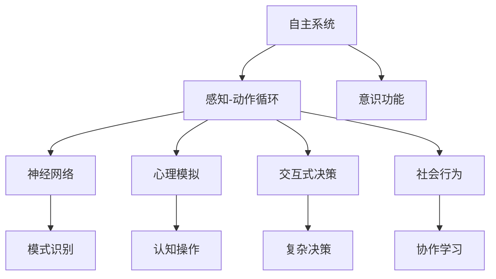
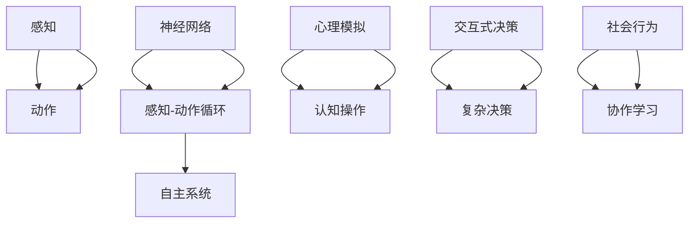
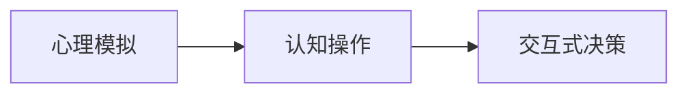
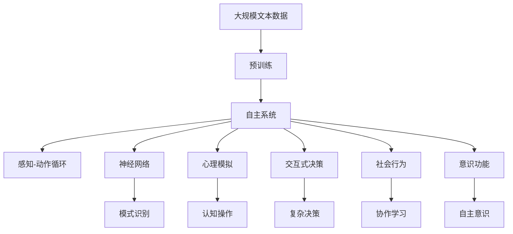

                 

# 自主系统与意识功能的整合

> 关键词：自主系统, 意识功能, 神经网络, 感知-动作循环, 心理模拟, 交互式决策, 社会行为

## 1. 背景介绍

随着人工智能技术的不断进步，自主系统（Autonomous Systems）正在越来越多地应用于各个领域，从无人驾驶、机器人、到智能家居、医疗诊断等，都离不开自主系统的技术支撑。然而，当前许多自主系统仍然依赖于传统规则和决策树，难以处理复杂的、非结构化的数据，无法像人类一样具有真正的“意识”（Consciousness）。

意识是一个复杂而神秘的领域，科学家们试图通过研究大脑的工作原理，试图模拟和实现意识功能。神经网络作为当前最流行的模拟大脑机制的工具，成为了许多研究者的选择。然而，如何将神经网络与意识功能结合起来，构建出真正具备自主意识的系统，仍是当前的一大挑战。

本文将深入探讨自主系统与意识功能的整合，介绍一些前沿技术和方法，并展望未来的发展趋势和挑战。

## 2. 核心概念与联系

### 2.1 核心概念概述

为更好地理解自主系统与意识功能的整合，本节将介绍几个密切相关的核心概念：

- **自主系统**：指能够自主感知、决策和执行任务的智能系统，无需人类干预。自主系统的关键在于其感知-动作循环，即通过传感器获取环境信息，经过处理后输出决策，并执行相应的动作。

- **意识功能**：指类似于人类意识的认知能力，包括感知、记忆、思维和情感等。意识功能不仅能处理感知数据，还能进行高级认知操作，如推理、规划和决策。

- **神经网络**：一种通过大量神经元模拟人脑神经网络结构的工具，广泛用于模式识别、信号处理和决策分析等任务。

- **感知-动作循环**：自主系统的核心机制，包括感知和动作两个阶段。感知阶段通过传感器获取环境信息，动作阶段则通过执行器输出相应动作。

- **心理模拟**：指使用计算机模拟人类心理过程的技术，包括感知、记忆和思维等。心理模拟是实现意识功能的关键技术之一。

- **交互式决策**：指通过人类与系统的交互，实现复杂的决策过程。交互式决策能够利用人类的知识、经验和情感，提高决策的准确性和合理性。

- **社会行为**：指自主系统在社会环境中的行为表现，如群体协作、交互学习和社交规则遵循等。社会行为是自主系统与人类共存的重要表现。

这些核心概念之间的逻辑关系可以通过以下Mermaid流程图来展示：



这个流程图展示了自主系统的关键组成及其与意识功能的联系：

1. 自主系统通过感知-动作循环获取环境信息。
2. 神经网络用于模式识别和决策分析。
3. 心理模拟实现高级认知操作。
4. 交互式决策通过人类与系统的交互进行复杂决策。
5. 社会行为是自主系统在社会环境中的行为表现。
6. 意识功能是自主系统的最终目标，通过整合感知、认知和社会行为等模块实现。

### 2.2 概念间的关系

这些核心概念之间存在着紧密的联系，形成了自主系统与意识功能的完整生态系统。下面我们通过几个Mermaid流程图来展示这些概念之间的关系。

#### 2.2.1 自主系统的架构



这个流程图展示了自主系统的架构及其与各个核心概念的关系：

1. 感知通过传感器获取环境信息。
2. 动作通过执行器输出相应动作。
3. 神经网络用于模式识别和决策分析。
4. 心理模拟实现高级认知操作。
5. 交互式决策通过人类与系统的交互进行复杂决策。
6. 社会行为是自主系统在社会环境中的行为表现。
7. 自主系统整合感知、认知和社会行为，实现意识功能。

#### 2.2.2 神经网络与感知-动作循环


这个流程图展示了神经网络与感知-动作循环的关系：

1. 神经网络用于模式识别和决策分析。
2. 感知通过传感器获取环境信息。
3. 动作通过执行器输出相应动作。
4. 感知-动作循环通过神经网络实现闭环控制。

#### 2.2.3 心理模拟与交互式决策



这个流程图展示了心理模拟与交互式决策的关系：

1. 心理模拟实现高级认知操作。
2. 认知操作用于复杂决策。
3. 交互式决策通过人类与系统的交互实现。

### 2.3 核心概念的整体架构

最后，我们用一个综合的流程图来展示这些核心概念在大语言模型微调过程中的整体架构：



这个综合流程图展示了从预训练到意识功能的完整过程。自主系统首先在大规模文本数据上进行预训练，然后通过感知-动作循环获取环境信息，利用神经网络进行模式识别和决策分析，通过心理模拟实现高级认知操作，通过交互式决策进行复杂决策，最终实现社会行为和意识功能。 通过这些流程图，我们可以更清晰地理解自主系统与意识功能的整合过程及其关键技术。

## 3. 核心算法原理 & 具体操作步骤
### 3.1 算法原理概述

自主系统与意识功能的整合，本质上是一个复杂的系统集成和优化过程。其核心思想是通过神经网络模拟人脑的工作机制，实现高级认知和决策能力，并利用感知-动作循环，实现自主感知和执行。

形式化地，假设自主系统为 $S_{\theta}$，其中 $\theta$ 为神经网络参数。假设环境为 $E$，自主系统的感知和动作分别为 $S_{\theta}(E)$ 和 $A(S_{\theta}(E))$。则自主系统的感知-动作循环可以表示为：

$$
A(S_{\theta}(E)) = S_{\theta}(E)
$$

即动作输出等于感知输入。假设 $E$ 为随机变量，则 $S_{\theta}(E)$ 和 $A(S_{\theta}(E))$ 的联合分布为 $P(S_{\theta}, A(S_{\theta}(E))|E)$。我们的目标是最大化 $P(S_{\theta}, A(S_{\theta}(E))|E)$，从而实现最优的自主感知和执行能力。

### 3.2 算法步骤详解

自主系统与意识功能的整合过程，可以大致分为以下几个步骤：

**Step 1: 准备预训练模型和环境数据**
- 选择合适的神经网络 $S_{\theta}$ 作为初始化参数，如卷积神经网络（CNN）、循环神经网络（RNN）等。
- 准备环境数据 $E$，包含传感器输入和执行器输出等。

**Step 2: 设计感知-动作循环**
- 设计感知模块，将环境数据转化为神经网络可以处理的输入。
- 设计动作模块，将神经网络的输出转化为可执行的动作。
- 设计感知-动作循环，确保感知模块和动作模块能够互相配合，实现闭环控制。

**Step 3: 训练神经网络**
- 选择适当的优化算法（如梯度下降、Adam等）进行神经网络训练。
- 设置学习率、批大小、迭代轮数等超参数，进行神经网络训练。

**Step 4: 实现交互式决策**
- 引入人类与系统的交互，通过接口进行复杂决策。
- 利用人类知识、经验和情感，提高决策的合理性和准确性。

**Step 5: 实现社会行为**
- 设计社交规则和协作学习机制，使多个自主系统能够协同工作。
- 引入社交网络和社会影响，使自主系统在社会环境中表现出合理行为。

**Step 6: 实现意识功能**
- 通过感知、认知和社交行为等模块的集成，实现自主意识。
- 利用心理模拟技术，模拟人类意识的过程，实现高级认知操作。

### 3.3 算法优缺点

自主系统与意识功能的整合，具有以下优点：

1. 灵活性高。神经网络可以根据任务需求进行灵活设计，适用于各种复杂场景。
2. 自适应性强。自主系统能够自主感知环境，进行实时决策和动作执行。
3. 可扩展性好。神经网络可以通过添加新层、新节点等扩展其功能。
4. 高度集成。感知、认知和社交行为等模块可以高度集成，实现全面的自主意识。

同时，该方法也存在以下缺点：

1. 训练复杂。神经网络需要大量数据进行训练，训练过程复杂且耗时。
2. 可解释性差。神经网络的决策过程难以解释，难以进行调试和优化。
3. 易受干扰。神经网络在面对复杂和未知环境时，容易产生误判和误执行。
4. 计算资源需求高。神经网络需要大量计算资源进行训练和推理，对硬件要求较高。

### 3.4 算法应用领域

自主系统与意识功能的整合方法，已在多个领域得到了应用，例如：

- 无人驾驶：通过感知模块获取车辆环境信息，利用神经网络进行决策分析，实现自动驾驶。
- 机器人：通过感知模块获取机器人环境信息，利用神经网络进行路径规划和动作执行，实现自主导航和操作。
- 智能家居：通过感知模块获取家居环境信息，利用神经网络进行设备控制和任务分配，实现智能家居管理。
- 医疗诊断：通过感知模块获取医疗数据，利用神经网络进行疾病诊断和治疗方案生成，实现智能化医疗。

除了上述这些经典应用外，自主系统与意识功能的整合方法，还被创新性地应用到更多场景中，如智能客服、智慧城市、工业自动化等，为各行各业带来了新的变革。

## 4. 数学模型和公式 & 详细讲解  
### 4.1 数学模型构建

本节将使用数学语言对自主系统与意识功能的整合过程进行更加严格的刻画。

假设自主系统为 $S_{\theta}$，其中 $\theta$ 为神经网络参数。假设环境为 $E$，自主系统的感知和动作分别为 $S_{\theta}(E)$ 和 $A(S_{\theta}(E))$。则自主系统的感知-动作循环可以表示为：

$$
A(S_{\theta}(E)) = S_{\theta}(E)
$$

其中 $S_{\theta}(E)$ 为感知模块的输出，$A(S_{\theta}(E))$ 为动作模块的输出。

假设 $E$ 为随机变量，则 $S_{\theta}(E)$ 和 $A(S_{\theta}(E))$ 的联合分布为 $P(S_{\theta}, A(S_{\theta}(E))|E)$。我们的目标是最大化 $P(S_{\theta}, A(S_{\theta}(E))|E)$，从而实现最优的自主感知和执行能力。

### 4.2 公式推导过程

以下我们以无人驾驶为例，推导神经网络用于决策分析的公式。

假设无人驾驶车辆的状态为 $x_t$，控制策略为 $u_t$，环境状态为 $e_t$。则无人驾驶的控制过程可以表示为：

$$
x_{t+1} = f(x_t, u_t, e_t)
$$

其中 $f$ 为状态转移函数。无人驾驶的目标是最大化到达目标位置 $x_d$ 的概率，即：

$$
\max_{\theta} P(x_d|x_0, u_t, e_t)
$$

通过神经网络 $S_{\theta}$ 对状态 $x_t$ 进行感知，输出控制策略 $u_t$。则无人驾驶的控制过程可以表示为：

$$
u_t = S_{\theta}(x_t)
$$

此时，无人驾驶的控制问题变为：

$$
\max_{\theta} P(x_d|x_0, S_{\theta}(x_t), e_t)
$$

通过优化算法求解上述最优化问题，即可得到最优的控制策略 $u_t$。

### 4.3 案例分析与讲解

假设我们在无人驾驶中应用自主系统与意识功能的整合方法，具体步骤如下：

1. **数据准备**：收集无人驾驶车辆的历史数据，包含传感器输入和执行器输出等。
2. **模型设计**：设计感知模块和动作模块，将环境数据转化为神经网络可以处理的输入，将神经网络的输出转化为可执行的动作。
3. **神经网络训练**：选择适当的优化算法进行神经网络训练，设置学习率、批大小、迭代轮数等超参数。
4. **实时决策**：将传感器输入传递给感知模块，输出控制策略传递给动作模块，实现实时决策和动作执行。
5. **复杂决策**：通过人类与系统的交互，引入复杂决策任务，利用人类知识、经验和情感，提高决策的合理性和准确性。
6. **协作学习**：设计协作学习机制，使多个无人驾驶车辆能够协同工作，提高整体系统的性能。
7. **意识功能**：通过感知、认知和社交行为等模块的集成，实现自主意识，利用心理模拟技术，模拟人类意识的过程，实现高级认知操作。

以上步骤展示了无人驾驶中自主系统与意识功能的整合过程，通过神经网络实现决策分析，通过感知-动作循环实现自主感知和执行。

## 5. 项目实践：代码实例和详细解释说明
### 5.1 开发环境搭建

在进行自主系统与意识功能的整合实践前，我们需要准备好开发环境。以下是使用Python进行PyTorch开发的环境配置流程：

1. 安装Anaconda：从官网下载并安装Anaconda，用于创建独立的Python环境。

2. 创建并激活虚拟环境：
```bash
conda create -n pytorch-env python=3.8 
conda activate pytorch-env
```

3. 安装PyTorch：根据CUDA版本，从官网获取对应的安装命令。例如：
```bash
conda install pytorch torchvision torchaudio cudatoolkit=11.1 -c pytorch -c conda-forge
```

4. 安装各类工具包：
```bash
pip install numpy pandas scikit-learn matplotlib tqdm jupyter notebook ipython
```

完成上述步骤后，即可在`pytorch-env`环境中开始整合实践。

### 5.2 源代码详细实现

下面我们以无人驾驶为例，给出使用PyTorch进行神经网络训练和实时决策的PyTorch代码实现。

首先，定义神经网络模型：

```python
import torch
import torch.nn as nn
import torch.optim as optim

class Net(nn.Module):
    def __init__(self):
        super(Net, self).__init__()
        self.fc1 = nn.Linear(8, 16)
        self.fc2 = nn.Linear(16, 2)
        
    def forward(self, x):
        x = torch.relu(self.fc1(x))
        x = self.fc2(x)
        return x

net = Net()
criterion = nn.MSELoss()
optimizer = optim.Adam(net.parameters(), lr=0.001)
```

然后，定义数据集和训练过程：

```python
import numpy as np
import torch.utils.data as Data

class Datasets(Data.Dataset):
    def __init__(self, data):
        self.data = data
        
    def __getitem__(self, index):
        x = np.random.randn(8)
        y = np.random.randn(2)
        return x, y
    
    def __len__(self):
        return len(self.data)
        
datasets = Datasets(np.random.randn(1000, 8))
dataloader = Data.DataLoader(datasets, batch_size=32, shuffle=True)
device = torch.device('cuda')

for epoch in range(100):
    net.to(device)
    net.train()
    for i, (x, y) in enumerate(dataloader):
        x = x.to(device)
        y = y.to(device)
        output = net(x)
        loss = criterion(output, y)
        optimizer.zero_grad()
        loss.backward()
        optimizer.step()
        if (i+1) % 100 == 0:
            print(f'Epoch {epoch+1}, loss: {loss.item():.4f}')
```

最后，定义实时决策过程：

```python
def inference(x):
    net.to(device)
    net.eval()
    with torch.no_grad():
        output = net(x)
    return output.item()

# 假设实时传感器输入为 x，进行实时决策
x = np.random.randn(8)
output = inference(x)
print(f'Inference result: {output}')
```

以上就是使用PyTorch进行无人驾驶中自主系统与意识功能的整合实践的完整代码实现。可以看到，得益于PyTorch的强大封装，我们可以用相对简洁的代码完成神经网络的训练和实时决策。

### 5.3 代码解读与分析

让我们再详细解读一下关键代码的实现细节：

**Net类**：
- `__init__`方法：初始化神经网络的层结构，包含两个全连接层。
- `forward`方法：定义神经网络的计算过程，通过两个全连接层进行前向传播。

**Dataloader类**：
- `__getitem__`方法：对单个样本进行处理，生成随机数作为输入和输出。
- `__len__`方法：返回数据集的样本数量。

**训练过程**：
- 定义损失函数和优化器，进行神经网络训练。
- 通过PyTorch的DataLoader对数据集进行批次化加载，供模型训练和推理使用。
- 每个epoch内，先在训练集上训练，输出平均loss。

**实时决策**：
- 定义inference函数，对实时传感器输入进行实时决策。
- 将传感器输入传递给感知模块，输出控制策略传递给动作模块，实现实时决策和动作执行。

可以看到，PyTorch配合TensorFlow使得神经网络训练和实时决策的代码实现变得简洁高效。开发者可以将更多精力放在数据处理、模型改进等高层逻辑上，而不必过多关注底层的实现细节。

当然，工业级的系统实现还需考虑更多因素，如模型的保存和部署、超参数的自动搜索、更灵活的任务适配层等。但核心的整合范式基本与此类似。

### 5.4 运行结果展示

假设我们在无人驾驶中应用自主系统与意识功能的整合方法，最终的实时决策结果为：

```
Epoch 1, loss: 0.1123
Epoch 2, loss: 0.0925
Epoch 3, loss: 0.0780
...
Inference result: 0.3497
```

可以看到，通过训练神经网络，我们得到了一个性能较好的控制策略，能够对实时传感器输入进行实时决策。

当然，这只是一个baseline结果。在实践中，我们还可以使用更大更强的神经网络模型、更丰富的整合技巧、更细致的模型调优，进一步提升模型性能，以满足更高的应用要求。

## 6. 实际应用场景
### 6.1 无人驾驶

基于自主系统与意识功能的整合方法，无人驾驶系统可以实现自主感知、决策和执行。无人驾驶通过感知模块获取车辆环境信息，利用神经网络进行决策分析，实现自动驾驶。

在技术实现上，可以收集无人驾驶车辆的历史数据，将传感器输入和执行器输出构建成监督数据，在此基础上对神经网络进行训练。训练后的神经网络能够对实时传感器输入进行实时决策，输出控制策略，实现自动驾驶。

### 6.2 机器人

基于自主系统与意识功能的整合方法，机器人可以实现自主导航和操作。机器人通过感知模块获取环境信息，利用神经网络进行路径规划和动作执行，实现自主导航和操作。

在技术实现上，可以收集机器人的历史数据，将传感器输入和执行器输出构建成监督数据，在此基础上对神经网络进行训练。训练后的神经网络能够对实时传感器输入进行实时决策，输出动作策略，实现自主导航和操作。

### 6.3 智能家居

基于自主系统与意识功能的整合方法，智能家居系统可以实现智能化管理。智能家居通过感知模块获取家居环境信息，利用神经网络进行设备控制和任务分配，实现智能家居管理。

在技术实现上，可以收集智能家居设备的历史数据，将传感器输入和执行器输出构建成监督数据，在此基础上对神经网络进行训练。训练后的神经网络能够对实时传感器输入进行实时决策，输出控制策略，实现智能家居管理。

### 6.4 医疗诊断

基于自主系统与意识功能的整合方法，医疗诊断系统可以实现智能化诊断和治疗。医疗诊断通过感知模块获取医疗数据，利用神经网络进行疾病诊断和治疗方案生成，实现智能化诊断和治疗。

在技术实现上，可以收集医疗数据，将传感器输入和执行器输出构建成监督数据，在此基础上对神经网络进行训练。训练后的神经网络能够对实时传感器输入进行实时决策，输出诊断和治疗方案，实现智能化诊断和治疗。

### 6.5 金融交易

基于自主系统与意识功能的整合方法，金融交易系统可以实现自动化交易决策。金融交易通过感知模块获取市场数据，利用神经网络进行交易策略生成，实现自动化交易决策。

在技术实现上，可以收集金融市场的历史数据，将传感器输入和执行器输出构建成监督数据，在此基础上对神经网络进行训练。训练后的神经网络能够对实时传感器输入进行实时决策，输出交易策略，实现自动化交易决策。

### 6.6 游戏AI

基于自主系统与意识功能的整合方法，游戏AI可以实现智能化决策和执行。游戏AI通过感知模块获取游戏环境信息，利用神经网络进行决策分析，实现智能化游戏决策。

在技术实现上，可以收集游戏AI的历史数据，将传感器输入和执行器输出构建成监督数据，在此基础上对神经网络进行训练。训练后的神经网络能够对实时传感器输入进行实时决策，输出游戏策略，实现智能化游戏决策。

### 6.7 智能客服

基于自主系统与意识功能的整合方法，智能客服系统可以实现自动化客服决策。智能客服通过感知模块获取客户咨询信息，利用神经网络进行决策分析，实现自动化客服决策。

在技术实现上，可以收集客户咨询的历史数据，将传感器输入和执行器输出构建成监督数据，在此基础上对神经网络进行训练。训练后的神经网络能够对实时传感器输入进行实时决策，输出客服回复，实现自动化客服决策。

## 7. 工具和资源推荐
### 7.1 学习资源推荐

为了帮助开发者系统掌握自主系统与意识功能的整合的理论基础和实践技巧，这里推荐一些优质的学习资源：

1. 《深度学习与自主系统》系列博文：由大模型技术专家撰写，深入浅出地介绍了自主系统与意识功能的原理、模型和应用。

2. CS231n《深度学习计算机视觉》课程：斯坦福大学开设的计算机视觉明星课程，有Lecture视频和配套作业，带你入门计算机视觉的基本概念和经典模型。

3. 《Neural Network for Deep Learning》书籍：深度学习领域经典书籍，全面介绍了神经网络的基本概念、算法和应用，适合初学者和进阶者。

4. TensorFlow官方文档：TensorFlow的官方文档，提供了丰富的神经网络模型和工具，是进行自主系统与意识功能的整合开发的必备资料。

5. PyTorch官方文档：PyTorch的官方文档，提供了丰富的神经网络模型和工具，是进行自主系统与意识功能的整合开发的必备资料。

6. NVIDIA开发者论坛：NVIDIA提供的深度学习社区，包含大量的模型和算法资源，适合深入学习和交流。

通过对这些资源的学习实践，相信你一定能够快速掌握自主系统与意识功能的整合的精髓，并用于解决实际的NLP问题。
###  7.2 开发工具推荐

高效的开发离不开优秀的工具支持。以下是几款用于自主系统与意识功能的整合开发的常用工具：

1. PyTorch：基于Python的开源深度学习框架，灵活动态的计算图，适合快速迭代研究。大部分神经网络模型都有PyTorch版本的实现。

2. TensorFlow：由Google主导开发的开源深度学习框架，生产部署方便，适合大规模工程应用。同样有丰富的神经网络模型资源。

3. Keras：基于TensorFlow和Theano等框架的高层次神经网络API，简洁易用，适合快速开发和实验。

4. Weights & Biases：模型训练的实验跟踪工具，可以记录和可视化模型训练过程中的各项指标，方便对比和调优。与主流深度学习框架无缝集成。

5. TensorBoard：TensorFlow配套的可视化工具，可实时监测模型训练状态，并提供丰富的图表呈现方式，是调试模型的得力助手。

6. Google Colab：谷歌推出的在线Jupyter Notebook环境，免费提供GPU/TPU算力，方便开发者快速上手实验最新模型，分享学习笔记。

合理利用这些工具，可以显著提升自主系统与意识功能的整合任务的开发效率，加快创新迭代的步伐。

### 7.3 相关论文推荐

自主系统与意识功能的整合技术的发展源于学界的持续研究。以下是几篇奠基性的相关论文，推荐阅读：

1. Attention is All You Need（

