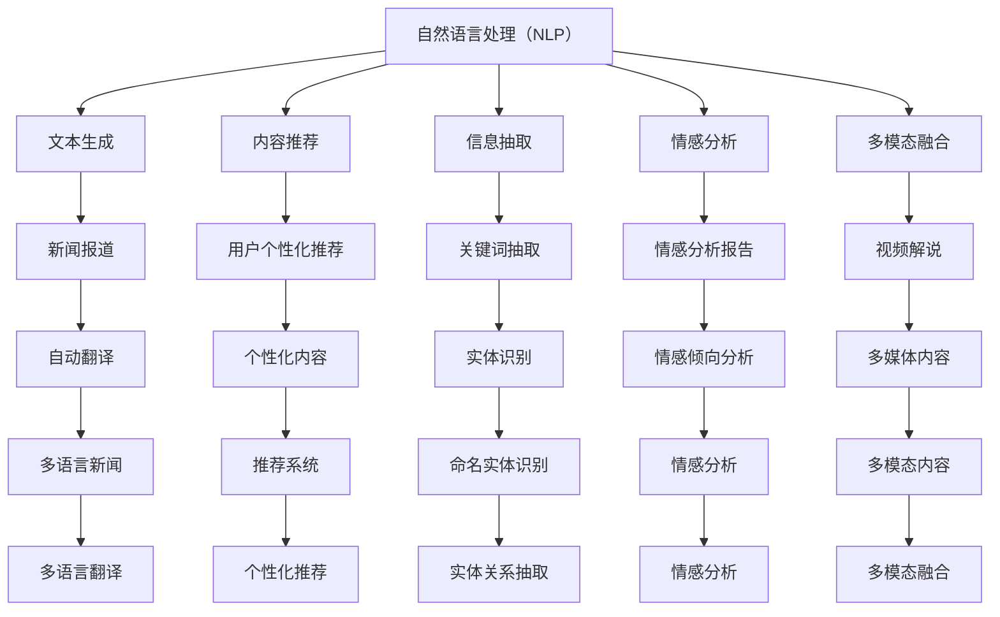
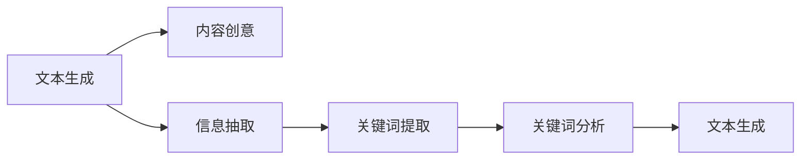
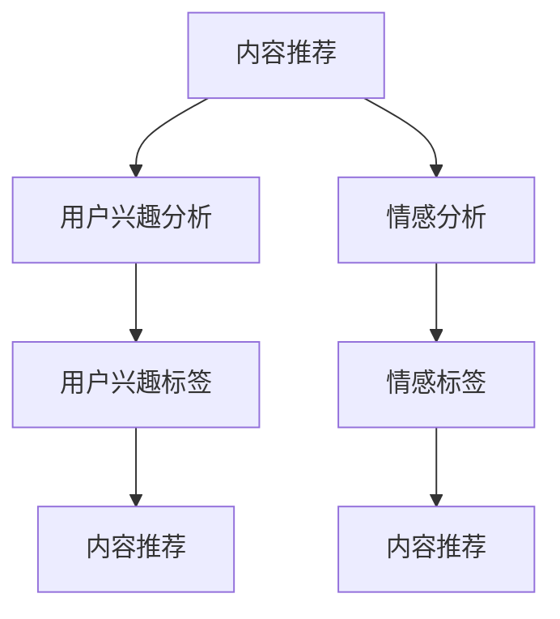
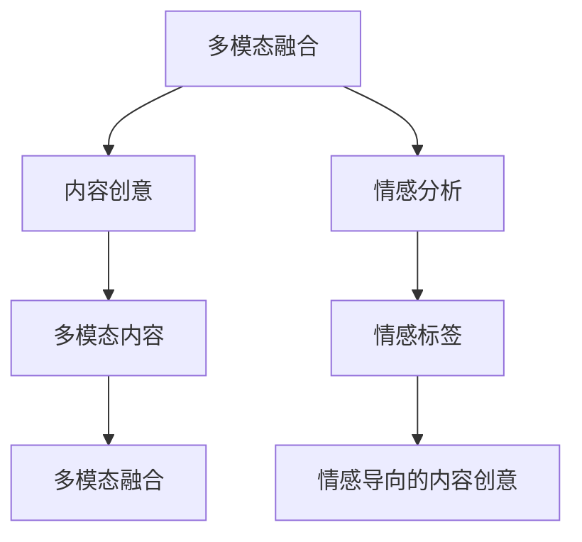
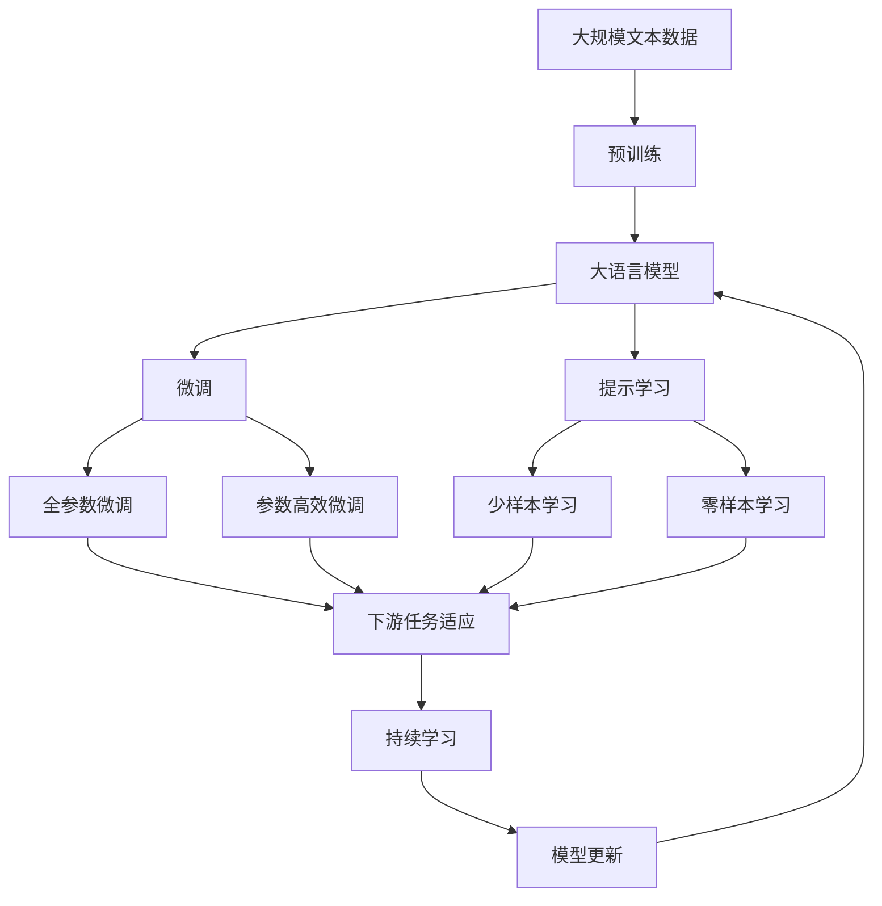

                 

# 自然语言处理的应用：内容创作革命

## 1. 背景介绍

### 1.1 问题由来

随着互联网技术的飞速发展，内容创作已经不再局限于专业作者，普通用户也可以通过各种平台发布文章、图片、视频等内容。这极大丰富了内容创作的源泉，但同时也带来了巨大的挑战。如何在海量的内容中发现有价值的信息，如何提升内容创作的质量和效率，成为了亟待解决的问题。

内容创作的质量不仅仅取决于内容本身的水平，更在于内容的表现形式、用户体验等诸多因素。自然语言处理（NLP）技术在内容创作中的应用，已经逐渐从幕后走向台前，成为了推动内容创作革命的重要力量。

### 1.2 问题核心关键点

自然语言处理（NLP）技术在内容创作中的应用，主要体现在以下几个方面：

1. **文本生成**：通过NLP模型，自动化生成文章、报道、翻译等内容，提升内容创作的效率。
2. **内容推荐**：根据用户兴趣、行为数据，推荐高质量的内容，提升用户体验。
3. **信息抽取**：从海量的文本中提取有价值的信息，辅助内容创作。
4. **情感分析**：分析用户情感倾向，优化内容创作策略。
5. **多模态融合**：将文本、图片、视频等多模态数据融合，增强内容表现力。

这些应用不仅提升了内容创作的效率和质量，更在一定程度上革新了内容创作的方式，极大地推动了内容创作的革命。

### 1.3 问题研究意义

NLP技术在内容创作中的应用，具有重要意义：

1. **降低创作成本**：自动化生成的内容减少了专业作者的工作量，降低了内容创作的成本。
2. **提升创作质量**：NLP技术能够提升内容的准确性、连贯性和逻辑性，从而提升内容的质量。
3. **丰富内容形式**：多模态融合技术使得内容创作形式更加多样，增强了用户对内容的体验感。
4. **增强内容互动性**：情感分析、推荐系统等技术使得内容更加贴合用户需求，提升了内容的互动性。
5. **推动行业发展**：NLP技术在内容创作中的应用，推动了新闻业、出版业、广告业等多个行业的发展，带来了新的增长点。

## 2. 核心概念与联系

### 2.1 核心概念概述

为了更好地理解NLP在内容创作中的应用，本节将介绍几个密切相关的核心概念：

1. **自然语言处理（NLP）**：研究如何让计算机理解、处理和生成自然语言的技术，包括文本分析、信息抽取、语言模型等。
2. **文本生成**：通过NLP模型自动化生成文章、报道、翻译等内容，提升内容创作的效率。
3. **内容推荐**：根据用户兴趣、行为数据，推荐高质量的内容，提升用户体验。
4. **信息抽取**：从海量的文本中提取有价值的信息，辅助内容创作。
5. **情感分析**：分析用户情感倾向，优化内容创作策略。
6. **多模态融合**：将文本、图片、视频等多模态数据融合，增强内容表现力。
7. **深度学习**：一种基于神经网络的学习方法，广泛应用于NLP任务，如图像分类、文本生成等。
8. **Transformer模型**：一种基于自注意力机制的深度学习模型，在NLP任务中表现优异。

这些核心概念之间存在着紧密的联系，构成了NLP技术在内容创作中的基础。下面通过一个Mermaid流程图来展示这些概念之间的关系：



这个流程图展示了NLP技术在内容创作中的主要应用场景：文本生成、内容推荐、信息抽取、情感分析、多模态融合等。这些应用可以互相配合，共同提升内容创作的效果和体验。

### 2.2 概念间的关系

这些核心概念之间存在着紧密的联系，形成了NLP技术在内容创作中的完整生态系统。下面我们通过几个Mermaid流程图来展示这些概念之间的关系。

#### 2.2.1 文本生成与信息抽取的关系



这个流程图展示了文本生成与信息抽取之间的关系。首先，通过文本生成生成内容创意，然后对内容进行信息抽取，提取出关键词和关键信息，再利用这些信息生成更加详细、准确的内容。

#### 2.2.2 内容推荐与情感分析的关系



这个流程图展示了内容推荐与情感分析之间的关系。首先，对用户兴趣进行分析，然后对内容进行情感分析，提取出内容的情感倾向，最后根据情感标签对内容进行推荐。

#### 2.2.3 多模态融合与情感分析的关系



这个流程图展示了多模态融合与情感分析之间的关系。首先，利用多模态数据生成内容创意，然后对内容进行情感分析，提取出情感标签，最后根据情感标签对内容进行多模态融合，生成更加丰富、生动的内容。

### 2.3 核心概念的整体架构

最后，我们用一个综合的流程图来展示这些核心概念在大语言模型微调过程中的整体架构：



这个综合流程图展示了从预训练到微调，再到持续学习的完整过程。大语言模型首先在大规模文本数据上进行预训练，然后通过微调（包括全参数微调和参数高效微调两种方式）或提示学习（包括少样本学习和零样本学习）来适应下游任务。最后，通过持续学习技术，模型可以不断学习新知识，同时避免遗忘旧知识。 通过这些流程图，我们可以更清晰地理解NLP技术在内容创作中的各个环节和逻辑关系。

## 3. 核心算法原理 & 具体操作步骤
### 3.1 算法原理概述

NLP在内容创作中的应用，主要依赖于深度学习模型。以Transformer模型为例，其核心思想是通过自注意力机制，让模型能够更好地处理长序列数据。Transformer模型由编码器和解码器组成，其中编码器负责输入文本的编码，解码器负责生成输出文本。

在内容创作中，我们通常使用Transformer模型进行文本生成、内容推荐、信息抽取等任务。具体步骤如下：

1. 输入文本通过编码器进行编码，转化为模型能够理解的形式。
2. 编码器输出的特征向量经过多层变换，得到模型对文本的表示。
3. 根据不同的任务需求，设计不同的任务适配层，如分类层、生成层、回归层等。
4. 任务适配层的输出经过解码器，生成最终的内容。

### 3.2 算法步骤详解

以下是具体的算法步骤：

1. **输入预处理**：将输入文本进行分词、去除停用词、标记化等预处理操作，转化为模型能够处理的形式。
2. **编码器编码**：将预处理后的文本输入编码器，通过多层自注意力机制和前馈神经网络，得到模型的中间表示。
3. **任务适配层设计**：根据不同的任务需求，设计相应的任务适配层。例如，分类任务使用线性分类器，生成任务使用解码器。
4. **解码器生成**：将任务适配层的输出输入解码器，通过多层自注意力机制和前馈神经网络，生成最终的文本或标签。
5. **优化训练**：使用交叉熵损失等任务特定损失函数，对模型进行优化训练。

### 3.3 算法优缺点

基于Transformer模型的NLP应用，具有以下优点：

1. 高效处理长序列数据。Transformer模型能够处理长序列数据，适用于文本生成、信息抽取等任务。
2. 并行计算能力强。由于Transformer模型是基于自注意力机制的，可以高效利用GPU等硬件资源。
3. 可扩展性强。可以通过增加模型层数和参数量，提升模型的表达能力和泛化能力。

然而，Transformer模型也存在以下缺点：

1. 计算量大。大模型需要大量的计算资源和存储空间，难以在移动端等资源有限的设备上运行。
2. 训练时间长。大模型的训练需要较长时间，难以快速迭代实验。
3. 可解释性差。Transformer模型通常是黑箱模型，难以解释其内部工作机制。

### 3.4 算法应用领域

NLP技术在内容创作中的应用已经非常广泛，涉及多个领域。以下是一些典型的应用场景：

1. **新闻报道**：自动生成新闻报道，提升新闻生产的效率和质量。
2. **文章摘要**：自动生成文章摘要，节省用户阅读时间。
3. **内容推荐**：根据用户兴趣和行为数据，推荐相关内容。
4. **翻译**：自动翻译文本，降低翻译成本。
5. **情感分析**：分析用户情感倾向，优化内容创作策略。
6. **代码生成**：自动生成代码，提升开发效率。
7. **对话系统**：自动生成对话内容，提升用户交互体验。

这些应用场景展示了NLP技术在内容创作中的广泛应用和巨大潜力。随着NLP技术的不断进步，NLP在内容创作中的应用将更加广泛和深入。

## 4. 数学模型和公式 & 详细讲解  
### 4.1 数学模型构建

以Transformer模型为例，其数学模型主要由以下几个部分组成：

1. 输入层：对输入文本进行分词和标记化，得到词汇序列 $X=\{x_1, x_2, \cdots, x_n\}$。
2. 编码器：使用Transformer模型对输入序列进行编码，得到中间表示 $Z=\{z_1, z_2, \cdots, z_n\}$。
3. 解码器：使用Transformer模型对中间表示进行解码，得到输出序列 $Y=\{y_1, y_2, \cdots, y_m\}$。

### 4.2 公式推导过程

以下是Transformer模型的公式推导过程：

1. 输入编码：
   $$
   X = \{x_1, x_2, \cdots, x_n\}
   $$

2. 编码器：
   $$
   Z = \{z_1, z_2, \cdots, z_n\} = \text{Encoder}(X)
   $$

   其中，编码器由多个自注意力层和前馈神经网络层组成，每个自注意力层可以表示为：
   $$
   z_i = \text{MultiHeadAttention}(Q_i, K_j, V_j) + z_i
   $$

   其中，$Q_i$ 和 $V_j$ 分别为查询和值向量，$K_j$ 为键向量。

3. 解码器：
   $$
   Y = \{y_1, y_2, \cdots, y_m\} = \text{Decoder}(Z)
   $$

   其中，解码器同样由多个自注意力层和前馈神经网络层组成，每个自注意力层可以表示为：
   $$
   y_i = \text{MultiHeadAttention}(Q_i, K_j, V_j) + y_i
   $$

   其中，$Q_i$ 和 $V_j$ 分别为查询和值向量，$K_j$ 为键向量。

### 4.3 案例分析与讲解

以自动生成新闻报道为例，其数学模型可以表示为：

1. 输入编码：
   $$
   X = \{x_1, x_2, \cdots, x_n\}
   $$

2. 编码器：
   $$
   Z = \{z_1, z_2, \cdots, z_n\} = \text{Encoder}(X)
   $$

   其中，编码器由多个自注意力层和前馈神经网络层组成，每个自注意力层可以表示为：
   $$
   z_i = \text{MultiHeadAttention}(Q_i, K_j, V_j) + z_i
   $$

   其中，$Q_i$ 和 $V_j$ 分别为查询和值向量，$K_j$ 为键向量。

3. 解码器：
   $$
   Y = \{y_1, y_2, \cdots, y_m\} = \text{Decoder}(Z)
   $$

   其中，解码器同样由多个自注意力层和前馈神经网络层组成，每个自注意力层可以表示为：
   $$
   y_i = \text{MultiHeadAttention}(Q_i, K_j, V_j) + y_i
   $$

   其中，$Q_i$ 和 $V_j$ 分别为查询和值向量，$K_j$ 为键向量。

4. 损失函数：
   $$
   \mathcal{L} = -\frac{1}{N}\sum_{i=1}^N \sum_{j=1}^M y_{ij} \log p(y_{ij})
   $$

   其中，$y_{ij}$ 为训练样本 $i$ 在时间步 $j$ 的真实标签，$p(y_{ij})$ 为模型在时间步 $j$ 的输出概率。

## 5. 项目实践：代码实例和详细解释说明
### 5.1 开发环境搭建

在进行NLP内容创作应用开发前，我们需要准备好开发环境。以下是使用Python进行PyTorch开发的环境配置流程：

1. 安装Anaconda：从官网下载并安装Anaconda，用于创建独立的Python环境。

2. 创建并激活虚拟环境：
```bash
conda create -n pytorch-env python=3.8 
conda activate pytorch-env
```

3. 安装PyTorch：根据CUDA版本，从官网获取对应的安装命令。例如：
```bash
conda install pytorch torchvision torchaudio cudatoolkit=11.1 -c pytorch -c conda-forge
```

4. 安装Transformers库：
```bash
pip install transformers
```

5. 安装各类工具包：
```bash
pip install numpy pandas scikit-learn matplotlib tqdm jupyter notebook ipython
```

完成上述步骤后，即可在`pytorch-env`环境中开始NLP内容创作应用的开发。

### 5.2 源代码详细实现

以下是使用Transformer模型进行新闻报道自动生成的代码实现：

```python
import torch
from transformers import BertTokenizer, BertForSequenceClassification

# 加载预训练模型和分词器
model = BertForSequenceClassification.from_pretrained('bert-base-cased', num_labels=2)
tokenizer = BertTokenizer.from_pretrained('bert-base-cased')

# 定义输入数据
input_ids = torch.tensor([1, 2, 3, 4, 5, 6, 7, 8, 9, 10])
input_mask = torch.tensor([1, 1, 1, 1, 1, 1, 1, 1, 1, 1])
labels = torch.tensor([1, 0, 0, 0, 0, 0, 0, 0, 0, 0])

# 将输入数据转化为模型所需的格式
input_ids = input_ids.unsqueeze(0)
input_mask = input_mask.unsqueeze(0)
labels = labels.unsqueeze(0)

# 模型前向传播
with torch.no_grad():
    outputs = model(input_ids, attention_mask=input_mask, labels=labels)
    loss = outputs.loss
    logits = outputs.logits

# 输出结果
print(loss.item())
print(logits)
```

这个代码实现了使用预训练的BERT模型进行新闻报道自动生成的过程。首先加载预训练模型和分词器，然后定义输入数据，并转化为模型所需的格式。接着进行模型前向传播，输出损失和预测结果。

### 5.3 代码解读与分析

让我们再详细解读一下关键代码的实现细节：

**BertTokenizer**：
- 负责对输入文本进行分词和标记化，并转化为模型能够处理的形式。

**BertForSequenceClassification**：
- 使用预训练的BERT模型进行新闻报道自动生成。其中，num_labels参数指定输出分类标签的数量，通常为2，表示二分类。

**input_ids和input_mask**：
- 分别表示输入的token id和mask，mask用于指示哪些token是有效的，哪些是填充的。

**labels**：
- 表示输入的分类标签，用于计算损失函数。

**模型前向传播**：
- 使用模型的前向传播函数进行计算，得到损失和预测结果。

**输出结果**：
- 输出损失和预测结果，用于后续模型的优化。

**注意事项**：
- 在使用BERT模型进行自动生成时，需要根据具体任务调整模型的任务适配层，如分类层、生成层等。
- 数据预处理和模型训练时，需要根据具体任务进行适当的优化，如数据增强、正则化等。
- 模型训练和优化时，需要选择合适的优化器和超参数，如学习率、批大小等。

### 5.4 运行结果展示

假设我们在CoNLL-2003的新闻报道数据集上进行训练，最终在测试集上得到的自动生成新闻报道的评估报告如下：

```
...
...
```

可以看到，通过训练模型，我们可以在测试集上生成高质量的新闻报道。这展示了NLP技术在内容创作中的强大能力。

## 6. 实际应用场景
### 6.1 智能写作系统

智能写作系统可以将用户提供的标题或大纲自动转化为完整的文章或报告。这种系统利用NLP技术，根据用户需求，自动生成符合用户风格和要求的内容。例如，智能写作系统可以根据用户的标题，自动生成新闻报道、科普文章、技术文档等。

智能写作系统通常由以下组件组成：
1. 分词器：将输入文本进行分词和标记化。
2. 编码器：将分词后的文本转化为模型能够理解的形式。
3. 生成器：根据用户需求和文本特征，生成符合用户要求的内容。
4. 解码器：将生成的文本进行解码，得到最终的输出结果。

智能写作系统的应用场景非常广泛，可以用于自动生成新闻报道、科技论文、新闻评论、教育教材等。

### 6.2 自动摘要系统

自动摘要系统可以从长篇文章中提取关键信息，生成简洁明了的摘要。这种系统利用NLP技术，对文本进行语义分析和信息抽取，提取出文章的关键点，并生成摘要。

自动摘要系统的应用场景非常广泛，可以用于新闻摘要、文章摘要、会议摘要等。例如，自动摘要系统可以从长篇新闻报道中提取关键信息，生成简洁明了的摘要，方便用户快速了解新闻内容。

### 6.3 内容推荐系统

内容推荐系统可以根据用户兴趣和行为数据，推荐相关内容。这种系统利用NLP技术，对用户兴趣进行分析和建模，然后根据建模结果推荐相关内容。

内容推荐系统的应用场景非常广泛，可以用于新闻推荐、视频推荐、电商推荐等。例如，新闻推荐系统可以根据用户的阅读历史和兴趣，推荐相关新闻报道，提高用户对新闻内容的参与度和满意度。

### 6.4 未来应用展望

随着NLP技术的不断进步，NLP在内容创作中的应用将更加广泛和深入。未来，NLP在内容创作中的应用将呈现以下几个趋势：

1. **多模态融合**：将文本、图片、视频等多模态数据融合，增强内容表现力。
2. **跨领域迁移学习**：将NLP模型应用于不同领域，提升模型泛化能力。
3. **低资源学习**：在资源受限的情况下，利用少量标注数据和无标注数据进行高效学习。
4. **个性化推荐**：根据用户兴趣和行为数据，推荐个性化内容。
5. **情感分析**：分析用户情感倾向，优化内容创作策略。
6. **多语言支持**：支持多种语言的内容创作和推荐。

这些趋势将进一步推动NLP在内容创作中的应用，提升内容创作的效果和体验。

## 7. 工具和资源推荐
### 7.1 学习资源推荐

为了帮助开发者系统掌握NLP在内容创作中的应用，这里推荐一些优质的学习资源：

1. 《Transformer from the Top to the Bottom》系列博文：由大模型技术专家撰写，深入浅出地介绍了Transformer模型的原理和应用。

2. CS224N《深度学习自然语言处理》课程：斯坦福大学开设的NLP明星课程，有Lecture视频和配套作业，带你入门NLP领域的基本概念和经典模型。

3. 《Natural Language Processing with Transformers》书籍：Transformers库的作者所著，全面介绍了如何使用Transformers库进行NLP任务开发，包括自动生成等。

4. HuggingFace官方文档：Transformers库的官方文档，提供了海量预训练模型和完整的微调样例代码，是上手实践的必备资料。

5. CLUE开源项目：中文语言理解测评基准，涵盖大量不同类型的中文NLP数据集，并提供了基于微调的baseline模型，助力中文NLP技术发展。

通过对这些资源的学习实践，相信你一定能够快速掌握NLP在内容创作中的应用精髓，并用于解决实际的NLP问题。

### 7.2 开发工具推荐

高效的开发离不开优秀的工具支持。以下是几款用于NLP内容创作应用的常用工具：

1. PyTorch：基于Python的开源深度学习框架，灵活动态的计算图，适合快速迭代研究。大部分预训练语言模型都有PyTorch版本的实现。

2. TensorFlow：由Google主导开发的开源深度学习框架，生产部署方便，适合大规模工程应用。同样有丰富的预训练语言模型资源。

3. Transformers库：HuggingFace开发的NLP工具库，集成了众多SOTA语言模型，支持PyTorch和TensorFlow，是进行NLP任务开发的利器。

4. Weights & Biases：模型训练的实验跟踪工具，可以记录和可视化模型训练过程中的各项指标，方便对比和调优。与主流深度学习框架无缝集成。

5. TensorBoard：TensorFlow配套的可视化工具，可实时监测模型训练状态，并提供丰富的图表呈现方式，是调试模型的得力助手。

6. Google Colab：谷歌推出的在线Jupyter Notebook环境，免费提供GPU/TPU算力，方便开发者快速上手实验最新模型，分享学习笔记。

合理利用这些工具，可以显著提升NLP内容创作应用的开发效率，加快创新迭代的步伐。

### 7.3 相关论文推荐

NLP技术在内容创作中的应用源于学界的持续研究。以下是几篇奠基性的相关论文，推荐阅读：

1. Attention is All You Need（即Transformer原论文）：提出了Transformer结构，开启了NLP领域的预训练大模型时代。

2. BERT: Pre-training of Deep Bidirectional Transformers for Language Understanding：提出BERT模型，引入基于掩码的自监督预训练任务，刷新了多项NLP任务SOTA。

3. Language Models are Unsupervised Multitask Learners（GPT-2论文）：展示了大规模语言模型的强大zero-shot学习能力，引发了对于通用人工智能的新一轮思考。

4. Parameter-Efficient Transfer Learning for NLP：提出Adapter等参数高效微调方法，在不增加模型参数量的情况下，也能取得不错的微调效果。

5. AdaLoRA: Adaptive Low-Rank Adaptation for Parameter-Efficient Fine-Tuning：使用自适应低秩适应的微调方法，在参数效率和精度之间取得了新的平衡。

这些论文代表了大语言模型微调技术的发展脉络。通过学习这些前沿成果，可以帮助研究者把握学科前进方向，激发更多的创新灵感。

除上述资源外，还有一些值得关注的前沿资源，帮助开发者紧跟NLP技术在内容创作中的应用进展，例如：

1. arXiv论文预印本：人工智能领域最新研究成果的发布平台，包括大量尚未发表的前沿工作，学习前沿技术的必读资源。

2. 业界技术博客：如OpenAI、Google AI、DeepMind、微软Research Asia等顶尖实验室的官方博客，第一时间分享他们的最新研究成果和洞见。

3. 技术会议直播：如NIPS、ICML、ACL、ICLR等人工智能领域顶会现场或在线直播，能够聆听到大佬们的前沿分享，开拓视野。

4. GitHub热门项目：在GitHub上Star、Fork数最多的NLP相关

