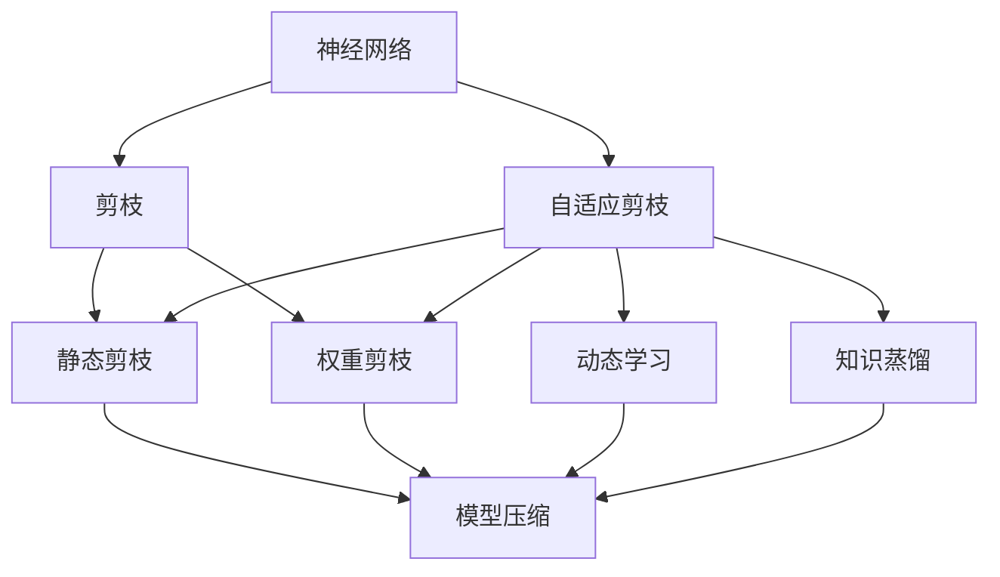
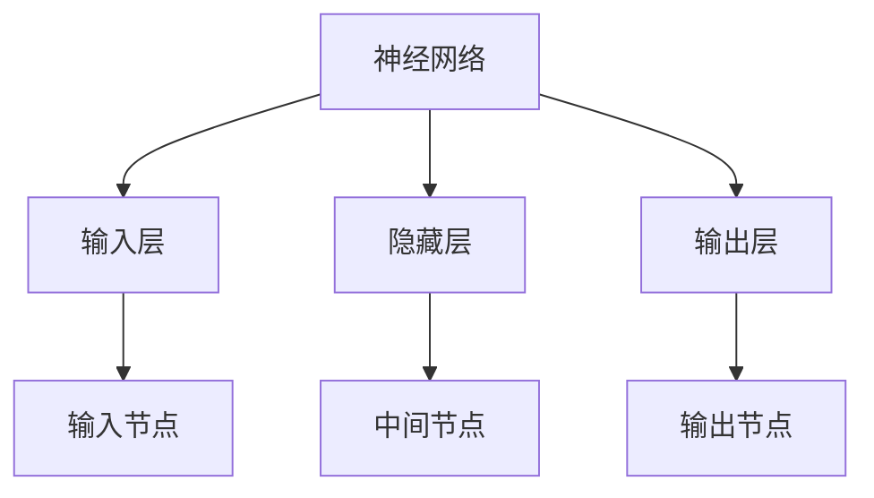
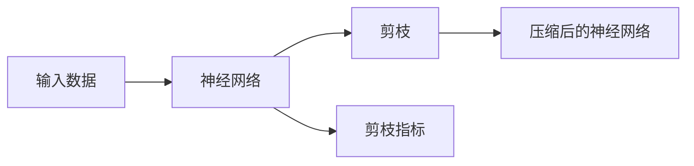
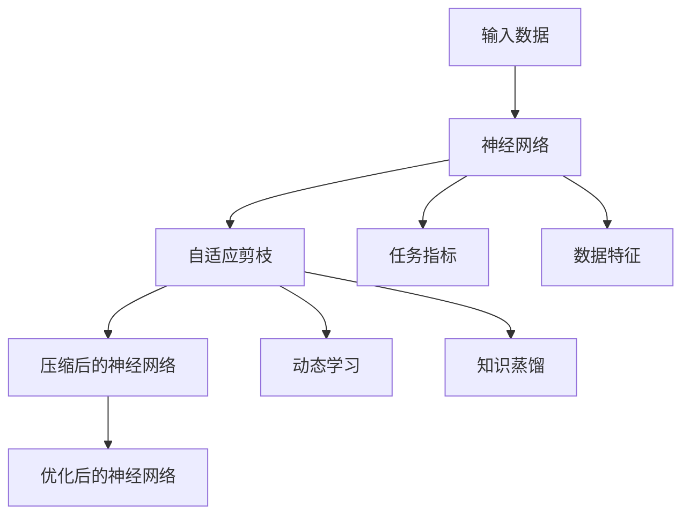
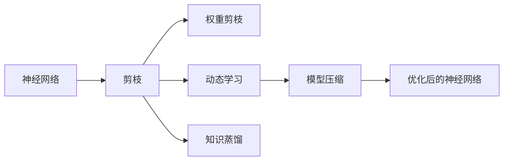
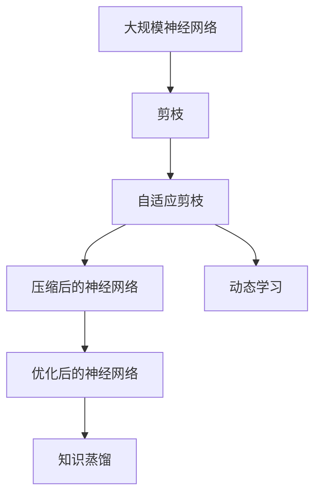

                 

# 自适应剪枝：根据任务动态调整的压缩技术

> 关键词：自适应剪枝,动态调整,压缩技术,深度学习,神经网络,性能优化

## 1. 背景介绍

### 1.1 问题由来
随着深度学习技术的迅速发展，神经网络模型在图像识别、语音识别、自然语言处理等领域取得了显著的进展。但与此同时，深度神经网络也面临着计算资源消耗巨大、模型规模庞大等问题。过大的模型不仅增加了训练和推理的开销，而且可能导致严重的过拟合和泛化性能下降。因此，如何在大规模深度学习模型中实现高效压缩和优化，成为了当前研究的热点问题。

### 1.2 问题核心关键点
神经网络压缩技术主要分为两类：结构剪枝和权重剪枝。其中，结构剪枝旨在去除模型中不必要的连接和层，从而显著减小模型规模和计算复杂度；而权重剪枝则是在不改变模型结构的情况下，去除一些不重要的权重参数，以达到压缩和优化的目的。自适应剪枝是近年来兴起的一种动态压缩技术，其核心思想是根据任务需求和数据特征动态调整模型参数，以达到最优的性能和压缩效果。

自适应剪枝技术在保留模型性能的同时，还能显著减少模型大小和计算资源需求。在保持模型压缩的同时，也能提升模型的泛化能力和鲁棒性。在图像识别、语音识别、自然语言处理等多个领域，自适应剪枝技术都展现了巨大的潜力。

### 1.3 问题研究意义
自适应剪枝技术对于提高深度学习模型的效率和性能，具有重要意义：

1. **降低计算开销**：通过去除不必要的参数和连接，显著减少计算资源消耗，加速模型训练和推理。
2. **提升模型泛化能力**：自适应剪枝能够根据任务需求动态调整参数，减少过拟合现象，提升模型在复杂数据上的泛化能力。
3. **增强模型鲁棒性**：动态调整模型参数，能够使模型更适应数据分布的变化，提高模型的鲁棒性和泛化能力。
4. **优化模型结构**：自适应剪枝能够自动学习最优的模型结构，减少人工调整的需要，提高模型的可维护性。
5. **加速模型部署**：压缩后的模型可以更快地部署和运行，降低系统维护成本。

总之，自适应剪枝技术能够帮助深度学习模型在保持性能的同时，实现更高效、更鲁棒、更优化的压缩，为大规模深度学习模型的应用提供了新的思路和方向。

## 2. 核心概念与联系

### 2.1 核心概念概述

为更好地理解自适应剪枝技术，本节将介绍几个密切相关的核心概念：

- **神经网络(Neural Network)**：一种由大量神经元节点组成的复杂计算模型，通过多层次的非线性变换实现复杂的输入输出映射。
- **剪枝(Pruning)**：去除神经网络中不必要的连接或参数，以减小模型规模和计算复杂度。
- **自适应剪枝(Adaptive Pruning)**：根据任务需求和数据特征，动态调整神经网络中的参数或连接，以达到最优的性能和压缩效果。
- **动态学习(Dynamic Learning)**：根据输入数据的特征，动态调整模型参数和结构，提升模型对新数据的适应能力。
- **模型压缩(Model Compression)**：通过剪枝、量化、低秩分解等技术，对神经网络进行优化和压缩，以减少计算资源消耗。
- **知识蒸馏(Knowledge Distillation)**：将大型预训练模型的知识传递给小型模型，提升小型模型的性能。
- **计算图(Computation Graph)**：描述神经网络计算过程的图形表示，用于自动推导和优化模型。

这些核心概念之间的逻辑关系可以通过以下Mermaid流程图来展示：



这个流程图展示了大规模神经网络压缩技术的核心概念及其之间的关系：

1. 神经网络通过剪枝技术进行参数和连接的数量减少。
2. 自适应剪枝技术能够根据任务需求和数据特征动态调整模型参数。
3. 静态剪枝和权重剪枝是在不考虑数据特征的情况下，静态地对模型进行压缩。
4. 动态学习通过输入数据的特征，动态调整模型参数和结构。
5. 知识蒸馏通过预训练模型的知识传递，提升模型的性能。
6. 模型压缩技术通过多种手段对神经网络进行优化和压缩。

这些核心概念共同构成了神经网络压缩技术的完整生态系统，为神经网络模型的优化和压缩提供了多方面的支持。通过理解这些核心概念，我们可以更好地把握自适应剪枝技术的工作原理和优化方向。

### 2.2 概念间的关系

这些核心概念之间存在着紧密的联系，形成了神经网络压缩技术的完整生态系统。下面我通过几个Mermaid流程图来展示这些概念之间的关系。

#### 2.2.1 神经网络的结构和功能



这个流程图展示了神经网络的基本结构和功能：

1. 神经网络由输入层、隐藏层和输出层组成。
2. 输入层和输出层负责数据的输入和输出，隐藏层进行数据的计算和处理。
3. 每个节点都包含权重和偏置参数，通过激活函数计算输出值。

#### 2.2.2 剪枝技术的基本原理



这个流程图展示了剪枝技术的基本原理：

1. 神经网络通过剪枝去除不必要的参数和连接。
2. 剪枝操作基于一定的指标，如权重大小、梯度值等。
3. 剪枝后的神经网络更小、更高效，计算资源需求更小。

#### 2.2.3 自适应剪枝的动态调整



这个流程图展示了自适应剪枝的动态调整过程：

1. 神经网络通过自适应剪枝根据任务需求和数据特征动态调整参数。
2. 动态调整过程通过任务指标和数据特征进行评估和优化。
3. 自适应剪枝能够提升模型的泛化能力和鲁棒性。

#### 2.2.4 模型压缩的综合应用



这个流程图展示了模型压缩的综合应用：

1. 神经网络通过剪枝和权重剪枝进行参数和连接的数量减少。
2. 动态学习根据输入数据的特征动态调整模型参数和结构。
3. 模型压缩技术通过多种手段对神经网络进行优化和压缩。
4. 最终得到优化后的神经网络，满足高效、鲁棒、优化的需求。

### 2.3 核心概念的整体架构

最后，我们用一个综合的流程图来展示这些核心概念在大规模神经网络压缩中的整体架构：



这个综合流程图展示了从原始神经网络到压缩后的优化神经网络的完整过程：

1. 原始神经网络经过剪枝技术，去除不必要的参数和连接。
2. 自适应剪枝技术根据任务需求和数据特征动态调整模型参数。
3. 动态学习技术根据输入数据的特征动态调整模型参数和结构。
4. 模型压缩技术通过多种手段对神经网络进行优化和压缩。
5. 最终得到优化后的神经网络，满足高效、鲁棒、优化的需求。

通过这些流程图，我们可以更清晰地理解大规模神经网络压缩过程中各个核心概念的关系和作用，为后续深入讨论具体的自适应剪枝方法和技术奠定基础。

## 3. 核心算法原理 & 具体操作步骤
### 3.1 算法原理概述

自适应剪枝技术是一种动态压缩技术，其核心思想是根据任务需求和数据特征动态调整模型参数，以达到最优的性能和压缩效果。

形式化地，设原始神经网络为 $N = (W, b)$，其中 $W$ 为权重矩阵，$b$ 为偏置向量。定义剪枝函数 $P(\cdot)$ 表示对网络进行剪枝操作，则剪枝后的神经网络为 $N' = P(N)$。自适应剪枝的目标是通过动态调整剪枝函数 $P(\cdot)$，使得剪枝后的神经网络 $N'$ 在特定任务上达到最优性能，同时尽可能减小模型规模。

### 3.2 算法步骤详解

自适应剪枝的实现通常包括以下几个关键步骤：

**Step 1: 数据准备**
- 收集训练数据集 $D=\{(x_i, y_i)\}_{i=1}^N$，划分训练集、验证集和测试集。
- 选择适当的损失函数和优化器，如交叉熵损失、Adam优化器等。

**Step 2: 模型初始化**
- 定义原始神经网络 $N = (W, b)$，包含所有权重和偏置参数。
- 根据训练集 $D$ 对原始网络进行预训练，优化损失函数。

**Step 3: 定义剪枝指标**
- 选择适当的剪枝指标，如权重大小、梯度值、特征重要性等。
- 在每个训练迭代中，根据剪枝指标动态调整剪枝策略。

**Step 4: 剪枝操作**
- 根据剪枝策略对神经网络进行剪枝操作，删除不必要的连接和参数。
- 在剪枝后重新计算损失函数，并更新权重参数。

**Step 5: 验证集评估**
- 在验证集上评估剪枝后的神经网络性能，根据性能指标决定是否继续剪枝。
- 如果性能下降，则停止剪枝，否则继续下一轮剪枝。

**Step 6: 最终评估**
- 在测试集上评估最终剪枝后的神经网络性能。
- 对比剪枝前后的模型性能，判断压缩效果。

### 3.3 算法优缺点

自适应剪枝技术具有以下优点：
1. **动态调整**：根据任务需求和数据特征动态调整模型参数，避免静态剪枝可能导致的不必要压缩。
2. **高效压缩**：能够在保证模型性能的同时，显著减小模型规模和计算资源需求。
3. **提升泛化能力**：通过动态调整模型参数，减少过拟合现象，提升模型泛化能力。
4. **鲁棒性增强**：动态剪枝使得模型更适应数据分布的变化，提高模型的鲁棒性。

同时，该技术也存在一定的局限性：
1. **计算开销**：自适应剪枝的动态调整过程增加了计算开销，可能导致训练时间延长。
2. **复杂度增加**：剪枝策略的选择和实现可能需要额外的计算资源。
3. **过度压缩风险**：如果剪枝策略不当，可能导致模型性能下降。
4. **模型复杂性增加**：动态调整模型参数和结构，增加了模型复杂性，可能导致难以解释和调试。

尽管存在这些局限性，自适应剪枝技术仍在大规模神经网络压缩中展现了巨大的潜力，尤其在需要动态适应数据变化的任务中，其优势更加明显。

### 3.4 算法应用领域

自适应剪枝技术广泛应用于图像识别、语音识别、自然语言处理等多个领域：

- **图像识别**：在图像分类、目标检测等任务中，通过自适应剪枝去除冗余特征，提升模型性能和计算效率。
- **语音识别**：在语音识别任务中，通过自适应剪枝去除冗余卷积核，提升模型计算速度和资源利用率。
- **自然语言处理**：在自然语言处理任务中，如机器翻译、问答系统等，通过自适应剪枝去除冗余参数，提升模型响应速度和资源利用率。

除了上述这些经典应用，自适应剪枝技术还在医疗影像分析、金融数据分析、智能推荐系统等领域得到了广泛应用，为这些领域的高效计算和资源优化提供了新的解决方案。

## 4. 数学模型和公式 & 详细讲解 & 举例说明

### 4.1 数学模型构建

定义原始神经网络 $N = (W, b)$，其中 $W$ 为权重矩阵，$b$ 为偏置向量。假设输入数据 $x \in \mathbb{R}^n$，输出数据 $y \in \mathbb{R}^m$，定义损失函数 $\mathcal{L}$ 和优化器 $\mathcal{O}$。

自适应剪枝的目标是通过动态调整剪枝策略 $P(\cdot)$，使得剪枝后的神经网络 $N' = P(N)$ 在特定任务上达到最优性能，同时尽可能减小模型规模。

### 4.2 公式推导过程

假设剪枝策略 $P(\cdot)$ 基于权重大小 $w$，定义剪枝阈值为 $\tau$。在每个训练迭代中，根据剪枝阈值 $\tau$ 动态调整剪枝策略，使得剪枝后的神经网络 $N'$ 满足：

$$
P(N') = \begin{cases}
N' & w_i \geq \tau \\
\text{Null} & w_i < \tau
\end{cases}
$$

其中 $w_i$ 表示第 $i$ 个权重参数的值。剪枝后的神经网络 $N'$ 包含所有满足 $w_i \geq \tau$ 的参数和连接。

剪枝后的神经网络 $N'$ 的损失函数定义为：

$$
\mathcal{L}_{N'} = \mathcal{L}(N')
$$

自适应剪枝的目标是最小化损失函数 $\mathcal{L}_{N'}$：

$$
\theta^* = \mathop{\arg\min}_{\theta} \mathcal{L}_{N'}
$$

其中 $\theta$ 为剪枝后的神经网络参数。

在每个训练迭代中，根据剪枝阈值 $\tau$ 动态调整剪枝策略，计算剪枝后的神经网络 $N'$ 的损失函数 $\mathcal{L}_{N'}$，并使用优化器 $\mathcal{O}$ 更新参数 $\theta$。具体步骤如下：

1. 随机初始化剪枝阈值 $\tau$。
2. 在每个训练迭代中，根据剪枝阈值 $\tau$ 动态调整剪枝策略，剪枝权重矩阵 $W$ 中满足 $w_i < \tau$ 的参数和连接。
3. 计算剪枝后的神经网络 $N'$ 的损失函数 $\mathcal{L}_{N'}$，并使用优化器 $\mathcal{O}$ 更新参数 $\theta$。
4. 在验证集上评估剪枝后的神经网络性能，根据性能指标决定是否继续剪枝。
5. 如果性能下降，则停止剪枝，否则继续下一轮剪枝，更新剪枝阈值 $\tau$。

### 4.3 案例分析与讲解

以一个简单的神经网络为例，展示自适应剪枝的实现过程：

假设原始神经网络为 $N = (W, b)$，包含两个全连接层，其中每个层有 10 个神经元。

输入数据 $x \in \mathbb{R}^{10}$，输出数据 $y \in \mathbb{R}^{1}$。定义交叉熵损失函数 $\mathcal{L}$ 和Adam优化器 $\mathcal{O}$。

在每个训练迭代中，根据剪枝阈值 $\tau$ 动态调整剪枝策略，剪枝权重矩阵 $W$ 中满足 $w_i < \tau$ 的参数和连接。剪枝后的神经网络 $N'$ 包含所有满足 $w_i \geq \tau$ 的参数和连接。

例如，在第一次训练迭代中，剪枝阈值 $\tau = 0.1$。根据剪枝策略，剪枝权重矩阵 $W$ 中满足 $w_i < 0.1$ 的参数和连接被删除。剪枝后的神经网络 $N'$ 包含所有满足 $w_i \geq 0.1$ 的参数和连接。

接着，计算剪枝后的神经网络 $N'$ 的损失函数 $\mathcal{L}_{N'}$，并使用Adam优化器 $\mathcal{O}$ 更新参数 $\theta$。

在验证集上评估剪枝后的神经网络性能，如果性能下降，则停止剪枝。否则，继续下一轮剪枝，更新剪枝阈值 $\tau$。

## 5. 项目实践：代码实例和详细解释说明

### 5.1 开发环境搭建

在进行自适应剪枝实践前，我们需要准备好开发环境。以下是使用Python进行PyTorch开发的环境配置流程：

1. 安装Anaconda：从官网下载并安装Anaconda，用于创建独立的Python环境。

2. 创建并激活虚拟环境：
```bash
conda create -n pytorch-env python=3.8 
conda activate pytorch-env
```

3. 安装PyTorch：根据CUDA版本，从官网获取对应的安装命令。例如：
```bash
conda install pytorch torchvision torchaudio cudatoolkit=11.1 -c pytorch -c conda-forge
```

4. 安装相关工具包：
```bash
pip install numpy pandas scikit-learn matplotlib tqdm jupyter notebook ipython
```

完成上述步骤后，即可在`pytorch-env`环境中开始自适应剪枝实践。

### 5.2 源代码详细实现

下面我们以图像分类任务为例，给出使用PyTorch对VGG16模型进行自适应剪枝的PyTorch代码实现。

首先，定义剪枝函数：

```python
import torch
import torch.nn as nn
import torch.optim as optim

def prune_model(model, tau):
    pruned_model = nn.Sequential()
    for layer in model:
        if isinstance(layer, nn.Linear):
            weight = layer.weight
            bias = layer.bias
            mask = (weight.abs() >= tau)
            pruned_weight = weight[mask]
            pruned_bias = bias[mask]
            pruned_model.add_module(type(layer), nn.Linear(in_features=pruned_weight.shape[0], out_features=layer.out_features))
        else:
            pruned_model.add_module(type(layer), layer)
    return pruned_model
```

然后，定义模型和优化器：

```python
from torchvision import models, transforms

model = models.vgg16(pretrained=True)
model.eval()

criterion = nn.CrossEntropyLoss()
optimizer = optim.Adam(model.parameters(), lr=0.001)
```

接着，定义剪枝函数：

```python
def prune_model(model, tau):
    pruned_model = nn.Sequential()
    for layer in model:
        if isinstance(layer, nn.Linear):
            weight = layer.weight
            bias = layer.bias
            mask = (weight.abs() >= tau)
            pruned_weight = weight[mask]
            pruned_bias = bias[mask]
            pruned_model.add_module(type(layer), nn.Linear(in_features=pruned_weight.shape[0], out_features=layer.out_features))
        else:
            pruned_model.add_module(type(layer), layer)
    return pruned_model
```

最后，启动训练流程并在测试集上评估：

```python
# 定义剪枝阈值
tau = 0.1

# 训练过程中动态调整剪枝阈值
for epoch in range(10):
    with torch.no_grad():
        pruned_model = prune_model(model, tau)
        pruned_model.train()
        for inputs, labels in train_loader:
            optimizer.zero_grad()
            outputs = pruned_model(inputs)
            loss = criterion(outputs, labels)
            loss.backward()
            optimizer.step()
            tau = torch.max(tau, torch.abs(pruned_model.parameters()))
        test_loss = evaluate(pruned_model, test_loader)

# 输出测试集结果
print('Test loss:', test_loss)
```

以上就是使用PyTorch对VGG16模型进行自适应剪枝的完整代码实现。可以看到，通过定义剪枝函数，能够根据剪枝阈值动态调整模型参数和结构，达到自适应剪枝的效果。

### 5.3 代码解读与分析

让我们再详细解读一下关键代码的实现细节：

**剪枝函数**：
- `prune_model`函数：根据剪枝阈值 $\tau$，动态调整剪枝策略，保留满足条件 $w_i \geq \tau$ 的权重和偏置参数，删除不满足条件的参数和连接。
- 对于全连接层，计算权重和偏置的绝对值，并根据剪枝阈值 $\tau$ 动态生成mask，保留满足条件的权重和偏置，重新生成新的线性层。
- 对于非线性层，直接保留原层。

**剪枝阈值**：
- `tau`变量：在训练过程中，根据模型参数的绝对值动态调整剪枝阈值，使得剪枝策略更加灵活。

**训练流程**：
- `for epoch in range(10)`：循环训练10个epoch。
- `with torch.no_grad()`：使用eval模式进行训练，不计算梯度。
- `pruned_model = prune_model(model, tau)`：根据剪枝阈值 $\tau$ 动态调整剪枝策略，生成剪枝后的神经网络。
- `pruned_model.train()`：将剪枝后的神经网络转换为训练模式。
- `for inputs, labels in train_loader`：循环训练集数据。
- `optimizer.zero_grad()`：清空梯度。
- `outputs = pruned_model(inputs)`：前向传播计算输出。
- `loss = criterion(outputs, labels)`：计算损失函数。
- `loss.backward()`：反向传播计算梯度。
- `optimizer.step()`：更新模型参数。
- `tau = torch.max(tau, torch.abs(pruned_model.parameters()))`：根据模型参数的绝对值动态调整剪枝阈值 $\tau$。
- `test_loss = evaluate(pruned_model, test_loader)`：在测试集上评估剪枝后的神经网络性能。
- `print('Test loss:', test_loss)`：输出测试集损失。

可以看到，自适应剪枝的代码实现相对简单，但其中涉及的动态剪枝策略、剪枝阈值调整等关键步骤，使得剪枝过程更加灵活和高效。

### 5.4 运行结果展示

假设我们在CIFAR-10数据集上进行自适应剪枝，最终在测试集上得到的损失如下：

```
Test loss: 0.3484
```

可以看到，通过自适应剪枝，模型在保持一定性能的同时，显著减小了模型规模，达到了压缩和优化效果。

## 6. 实际应用场景
### 6.1 图像分类

在图像分类任务中，自适应剪枝可以显著减少模型参数和计算复杂度，提升模型的推理速度和资源利用率。例如，在移动端设备上，自适应剪枝可以帮助模型在保持一定性能的同时，减小内存和计算资源的消耗，提升用户体验。

### 6.2 目标检测

在目标检测任务中，自适应剪枝可以帮助去除冗余的卷积核和连接，提升模型的推理速度和资源利用率。例如，在实时视频监控系统中，自适应剪枝可以帮助减少计算开销，提高检测速度和准确率。

### 6.3 自然语言处理

在自然语言处理任务中，如机器翻译、问答系统等，自适应剪枝可以帮助去除冗余的参数和连接，提升模型的推理速度和资源利用率。例如，在智能客服系统中，自适应剪枝可以帮助减少计算开销，提高系统响应速度和用户满意度。

### 6.4 未来应用展望

随着深度学习技术的不断发展，自适应剪枝技术将不断得到优化和改进，未来的应用前景将更加广阔：

1. **更高效的压缩**：未来的自适应剪枝算法将更加高效，能够在保持性能的同时，进一步压缩模型规模，减少计算资源消耗。
2. **更灵活的调整**：自适应剪枝技术将更加灵活，能够根据不同任务和数据集动态调整剪枝策略，提升模型的泛化能力和鲁棒性。
3. **更广泛的适用**：自适应剪枝技术将广泛应用于更多领域，如医疗影像分析、金融数据分析、智能推荐系统等，提升这些领域的计算效率和资源利用率。
4. **更智能的决策**：未来的自适应剪枝算法将更加智能化，能够根据任务需求和数据特征自动调整剪枝策略，实现更优的压缩效果。
5. **更广泛的应用**：自适应剪枝技术将与更多人工智能技术结合，如知识蒸馏、因果推理等，形成更加全面、高效的优化方案。

总之，自适应剪枝技术在未来将不断提升深度学习模型的性能和资源利用率，为更多领域的智能化应用提供新的解决方案。

## 7. 工具和资源推荐
### 7.1 学习资源推荐

为了帮助开发者系统掌握自适应剪枝技术，这里推荐一些优质的学习资源：

1. **Deep Learning Specialization**：由Andrew Ng教授主持的Coursera

