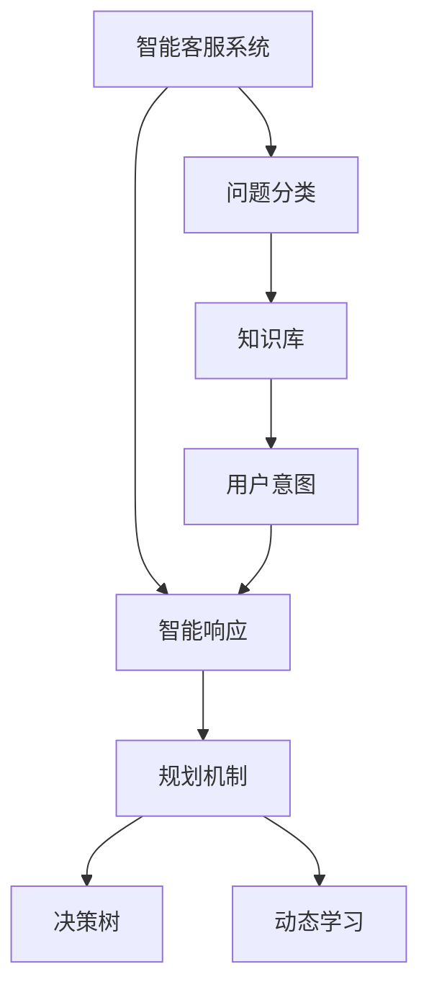
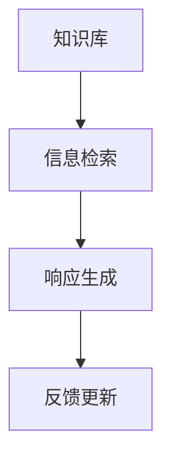
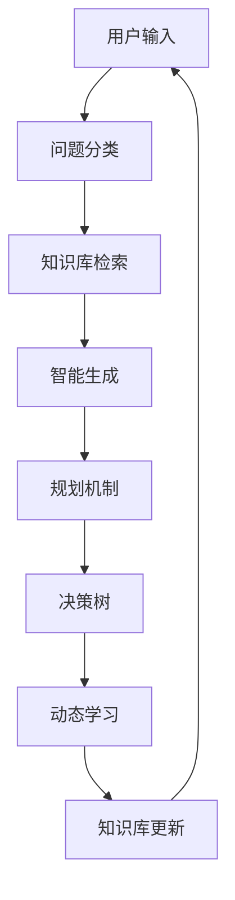

                 

# 规划机制在智能客服系统中的应用

> 关键词：智能客服系统,规划机制,问题分类,知识库,用户意图,智能响应,决策树,用户反馈

## 1. 背景介绍

### 1.1 问题由来
智能客服系统（Chatbot）作为人工智能技术的重要应用之一，广泛应用于电子商务、金融、医疗、旅游、政府服务等众多领域，通过自动化的方式解决用户咨询问题，提高服务效率和用户体验。然而，传统的客服系统往往依赖规则和模板编写，难以灵活应对用户咨询的复杂性和多样性，用户体验不佳。

近年来，随着深度学习和自然语言处理（NLP）技术的快速发展，基于大语言模型的智能客服系统成为新的热点。这种系统通过预训练语言模型和大规模标注数据，能够理解用户自然语言，自动生成符合语境的响应，极大地提升了客服系统的智能化水平。

然而，大语言模型在处理复杂多变的用户咨询时，依然面临诸多挑战。如何更准确地分类用户咨询，更快地检索和生成响应，更好地维护系统稳定性，成为当前智能客服系统需要解决的几个核心问题。

### 1.2 问题核心关键点
1. **用户意图识别**：准确识别用户咨询的意图，是智能客服系统提供精准服务的前提。
2. **知识库管理**：有效管理和查询知识库，帮助系统快速响应各类问题。
3. **智能生成响应**：根据用户意图和知识库信息，智能生成符合语境的回答。
4. **动态学习与优化**：系统需要具备动态学习的能力，根据用户反馈不断优化模型和响应策略。
5. **稳定性保障**：确保系统在处理高并发请求时依然稳定可靠。

## 2. 核心概念与联系

### 2.1 核心概念概述

为更好地理解规划机制在智能客服系统中的应用，本节将介绍几个密切相关的核心概念：

- **智能客服系统（Chatbot）**：基于深度学习和自然语言处理技术，能够自动理解用户输入并生成相应回复的智能对话系统。
- **问题分类（Intent Classification）**：将用户输入的自然语言进行意图识别，分类为不同的业务需求。
- **知识库（Knowledge Base）**：存储和组织与业务相关的信息，包括FAQ、政策、产品详情等，供系统检索和响应。
- **用户意图（User Intent）**：用户希望通过客服系统获取的信息或执行的操作，是智能客服系统响应的基础。
- **智能响应（Smart Response）**：基于用户意图和知识库信息，生成的符合语境的自然语言回答。
- **规划机制（Planning Mechanism）**：在知识库管理和智能响应过程中，利用规划算法优化决策路径，提升系统效率和响应准确性。
- **决策树（Decision Tree）**：一种基于规则的分类方法，用于快速决策和问题分类。
- **动态学习与优化（Dynamic Learning）**：利用在线学习或强化学习算法，不断优化模型和响应策略，提升系统性能。

这些核心概念之间的逻辑关系可以通过以下Mermaid流程图来展示：



这个流程图展示了几者之间的基本关系：

1. 用户咨询通过问题分类模块被识别为具体的业务需求，即用户意图。
2. 系统根据用户意图在知识库中检索相关信息，生成智能响应。
3. 在响应生成过程中，规划机制用于优化决策路径。
4. 动态学习模块不断优化模型和决策策略，提升系统性能。

### 2.2 概念间的关系

这些核心概念之间存在着紧密的联系，形成了智能客服系统的整体框架。下面我们通过几个Mermaid流程图来展示这些概念之间的关系。

#### 2.2.1 智能客服系统的框架


这个流程图展示了智能客服系统从用户输入到智能输出的全过程：

1. 用户输入自然语言。
2. 系统通过问题分类模块识别用户意图。
3. 系统在知识库中检索相关信息。
4. 系统生成符合语境的智能回答，并输出。

#### 2.2.2 知识库的管理



这个流程图展示了知识库在智能客服系统中的作用：

1. 系统从知识库中检索相关信息。
2. 系统生成智能回答。
3. 系统根据用户反馈更新知识库内容。

#### 2.2.3 智能响应的生成


这个流程图展示了智能响应生成的过程：

1. 系统识别用户意图。
2. 系统在知识库中检索相关信息。
3. 系统生成符合语境的智能回答，并输出。

### 2.3 核心概念的整体架构

最后，我们用一个综合的流程图来展示这些核心概念在大语言模型微调过程中的整体架构：



这个综合流程图展示了从用户输入到智能输出，再到知识库动态更新的完整过程。通过这些核心概念的协同工作，智能客服系统能够更高效、更精准地响应用户咨询。

## 3. 核心算法原理 & 具体操作步骤
### 3.1 算法原理概述

规划机制在智能客服系统中的应用，主要通过决策树算法和规划算法来实现。决策树是一种基于树形结构的分类方法，用于快速决策和问题分类。规划算法则用于优化决策路径，提升系统响应效率。

在具体应用中，智能客服系统通过以下步骤实现：

1. 用户输入自然语言。
2. 问题分类模块利用深度学习模型（如BERT、GPT等），对用户输入进行分类，识别用户意图。
3. 知识库检索模块根据用户意图，在知识库中检索相关信息。
4. 智能响应生成模块利用预训练语言模型，结合用户意图和检索信息，生成符合语境的智能回答。
5. 规划机制用于优化决策路径，提升系统响应效率。
6. 动态学习模块通过在线学习或强化学习算法，不断优化模型和响应策略。

### 3.2 算法步骤详解

#### 3.2.1 问题分类

问题分类是智能客服系统响应的第一步。常见的分类方法包括基于规则、基于机器学习和基于深度学习等。

**基于规则的方法**：通过手工定义一系列规则，对用户输入进行分类。这种方法简单易实现，但依赖人工定义规则，难以应对复杂多变的用户咨询。

**基于机器学习的方法**：通过标注数据训练分类模型，对用户输入进行自动分类。常见的分类模型包括决策树、支持向量机（SVM）、朴素贝叶斯等。这种方法效果较好，但需要大量标注数据。

**基于深度学习的方法**：利用预训练语言模型（如BERT、GPT等），通过多任务学习或监督学习对用户输入进行分类。这种方法能够有效利用语言模型学到的语义知识，但需要大规模标注数据。

#### 3.2.2 知识库管理

知识库是智能客服系统响应的关键组成部分，存储和组织与业务相关的信息，供系统检索和响应。

**知识库组织**：常见的知识库组织方式包括文档、FAQ、实体关系图等。文档组织方式简单，易于维护，但查询效率较低。FAQ组织方式查询效率较高，但需要人工维护。实体关系图组织方式查询效率较高，但实现复杂。

**知识库检索**：常见的知识库检索方法包括基于关键词检索、基于实体关系检索等。基于关键词检索方法简单易实现，但精确度较低。基于实体关系检索方法精确度较高，但实现复杂。

#### 3.2.3 智能响应生成

智能响应生成是智能客服系统响应的核心部分。常见的生成方法包括基于规则、基于模板和基于模型等。

**基于规则的方法**：通过手工定义一系列规则，对用户输入进行分类，并生成响应。这种方法简单易实现，但依赖人工定义规则，难以应对复杂多变的用户咨询。

**基于模板的方法**：通过预定义模板，对用户输入进行分类，并生成响应。这种方法简单易实现，但灵活性较差，难以生成符合语境的响应。

**基于模型的方法**：利用预训练语言模型（如BERT、GPT等），对用户输入进行分类，并生成符合语境的智能回答。这种方法效果较好，但需要大规模标注数据和计算资源。

#### 3.2.4 规划机制优化

规划机制用于优化决策路径，提升系统响应效率。常见的规划算法包括A*、RRT等。

**A*算法**：基于启发式搜索算法，用于优化决策路径。该算法计算复杂度较高，但效果较好，适用于小规模问题。

**RRT算法**：基于随机抽样算法，用于优化决策路径。该算法计算复杂度较低，但效果较差，适用于大规模问题。

### 3.3 算法优缺点

**规划机制的优点**：

1. 优化决策路径，提升系统响应效率。
2. 提供多路径选择，提升系统鲁棒性。
3. 能够动态调整策略，提升系统适应性。

**规划机制的缺点**：

1. 实现复杂，需要精心设计规划算法。
2. 需要较多的计算资源，影响系统实时性。
3. 规划路径可能存在子优化问题。

**动态学习的优点**：

1. 不断优化模型和策略，提升系统性能。
2. 能够适应新任务和新用户，提升系统灵活性。

**动态学习的缺点**：

1. 需要大量标注数据，数据获取成本高。
2. 需要较强的计算资源，影响系统实时性。
3. 存在模型过拟合的风险。

### 3.4 算法应用领域

规划机制在智能客服系统中的应用，已经广泛地应用于电子商务、金融、医疗、旅游、政府服务等众多领域。以下是几个典型应用场景：

- **电商平台**：用于自动处理订单咨询、退换货咨询等常见问题。
- **金融服务**：用于处理客户账户咨询、贷款咨询等业务需求。
- **医疗服务**：用于处理患者诊疗咨询、药品咨询等业务需求。
- **旅游服务**：用于处理预订咨询、行程咨询等业务需求。
- **政府服务**：用于处理行政咨询、政策咨询等业务需求。

## 4. 数学模型和公式 & 详细讲解  
### 4.1 数学模型构建

本节将使用数学语言对智能客服系统的规划机制进行更加严格的刻画。

假设智能客服系统的问题分类任务为$I=\{1,2,...,M\}$，知识库中包含$K$个问题-答案对$(i,j)$，其中$i$表示问题编号，$j$表示答案编号。系统利用深度学习模型对用户输入$x$进行分类，得到用户意图的概率分布$p_i(x)$。知识库检索模块根据用户意图$i$，在知识库中检索相关信息，得到答案$y_i$。智能响应生成模块利用预训练语言模型，对用户输入$x$和答案$y_i$进行编码，生成符合语境的智能回答$z_i(x)$。

### 4.2 公式推导过程

以下我们以基于深度学习的问题分类为例，推导分类模型的损失函数及其梯度的计算公式。

假设系统利用BERT模型对用户输入$x$进行分类，得到用户意图的概率分布$p_i(x)$。则分类损失函数定义为：

$$
L(x) = -\sum_{i=1}^M p_i(x) \log p_i(x)
$$

其中$p_i(x)$为系统对用户输入$x$分类为问题$i$的概率。

根据梯度下降算法，分类模型的优化目标是最小化损失函数$L(x)$，即：

$$
\theta = \mathop{\arg\min}_{\theta} L(x)
$$

其中$\theta$为BERT模型的参数。

在得到损失函数的梯度后，即可带入梯度下降算法，更新模型参数$\theta$，最小化分类损失。

### 4.3 案例分析与讲解

以电商平台智能客服系统为例，分析规划机制的应用。

假设电商平台智能客服系统需要处理退换货咨询。系统首先利用BERT模型对用户输入进行分类，得到用户意图为退换货的概率$p_{ret}$。然后，系统在知识库中检索相关退换货流程，得到答案$y_{ret}$。接着，系统利用预训练语言模型，对用户输入$x$和答案$y_{ret}$进行编码，生成符合语境的智能回答$z_{ret}(x)$。

在生成回答时，系统通过规划机制优化决策路径。假设系统已经构建了若干条退换货流程路径，每条路径包含若干步骤。系统根据用户输入$x$，动态选择最优路径，并生成相应的智能回答$z_{ret}(x)$。

最终，系统将智能回答$z_{ret}(x)$输出给用户，完成退换货咨询的智能响应。

## 5. 项目实践：代码实例和详细解释说明
### 5.1 开发环境搭建

在进行规划机制的实现前，我们需要准备好开发环境。以下是使用Python进行PyTorch开发的环境配置流程：

1. 安装Anaconda：从官网下载并安装Anaconda，用于创建独立的Python环境。

2. 创建并激活虚拟环境：
```bash
conda create -n pytorch-env python=3.8 
conda activate pytorch-env
```

3. 安装PyTorch：根据CUDA版本，从官网获取对应的安装命令。例如：
```bash
conda install pytorch torchvision torchaudio cudatoolkit=11.1 -c pytorch -c conda-forge
```

4. 安装Transformers库：
```bash
pip install transformers
```

5. 安装各类工具包：
```bash
pip install numpy pandas scikit-learn matplotlib tqdm jupyter notebook ipython
```

完成上述步骤后，即可在`pytorch-env`环境中开始规划机制的实践。

### 5.2 源代码详细实现

下面我们以命名实体识别(NER)任务为例，给出使用Transformers库对BERT模型进行微调的PyTorch代码实现。

首先，定义NER任务的数据处理函数：

```python
from transformers import BertTokenizer
from torch.utils.data import Dataset
import torch

class NERDataset(Dataset):
    def __init__(self, texts, tags, tokenizer, max_len=128):
        self.texts = texts
        self.tags = tags
        self.tokenizer = tokenizer
        self.max_len = max_len
        
    def __len__(self):
        return len(self.texts)
    
    def __getitem__(self, item):
        text = self.texts[item]
        tags = self.tags[item]
        
        encoding = self.tokenizer(text, return_tensors='pt', max_length=self.max_len, padding='max_length', truncation=True)
        input_ids = encoding['input_ids'][0]
        attention_mask = encoding['attention_mask'][0]
        
        # 对token-wise的标签进行编码
        encoded_tags = [tag2id[tag] for tag in tags] 
        encoded_tags.extend([tag2id['O']] * (self.max_len - len(encoded_tags)))
        labels = torch.tensor(encoded_tags, dtype=torch.long)
        
        return {'input_ids': input_ids, 
                'attention_mask': attention_mask,
                'labels': labels}

# 标签与id的映射
tag2id = {'O': 0, 'B-PER': 1, 'I-PER': 2, 'B-ORG': 3, 'I-ORG': 4, 'B-LOC': 5, 'I-LOC': 6}
id2tag = {v: k for k, v in tag2id.items()}

# 创建dataset
tokenizer = BertTokenizer.from_pretrained('bert-base-cased')

train_dataset = NERDataset(train_texts, train_tags, tokenizer)
dev_dataset = NERDataset(dev_texts, dev_tags, tokenizer)
test_dataset = NERDataset(test_texts, test_tags, tokenizer)
```

然后，定义模型和优化器：

```python
from transformers import BertForTokenClassification, AdamW

model = BertForTokenClassification.from_pretrained('bert-base-cased', num_labels=len(tag2id))

optimizer = AdamW(model.parameters(), lr=2e-5)
```

接着，定义训练和评估函数：

```python
from torch.utils.data import DataLoader
from tqdm import tqdm
from sklearn.metrics import classification_report

device = torch.device('cuda') if torch.cuda.is_available() else torch.device('cpu')
model.to(device)

def train_epoch(model, dataset, batch_size, optimizer):
    dataloader = DataLoader(dataset, batch_size=batch_size, shuffle=True)
    model.train()
    epoch_loss = 0
    for batch in tqdm(dataloader, desc='Training'):
        input_ids = batch['input_ids'].to(device)
        attention_mask = batch['attention_mask'].to(device)
        labels = batch['labels'].to(device)
        model.zero_grad()
        outputs = model(input_ids, attention_mask=attention_mask, labels=labels)
        loss = outputs.loss
        epoch_loss += loss.item()
        loss.backward()
        optimizer.step()
    return epoch_loss / len(dataloader)

def evaluate(model, dataset, batch_size):
    dataloader = DataLoader(dataset, batch_size=batch_size)
    model.eval()
    preds, labels = [], []
    with torch.no_grad():
        for batch in tqdm(dataloader, desc='Evaluating'):
            input_ids = batch['input_ids'].to(device)
            attention_mask = batch['attention_mask'].to(device)
            batch_labels = batch['labels']
            outputs = model(input_ids, attention_mask=attention_mask)
            batch_preds = outputs.logits.argmax(dim=2).to('cpu').tolist()
            batch_labels = batch_labels.to('cpu').tolist()
            for pred_tokens, label_tokens in zip(batch_preds, batch_labels):
                pred_tags = [id2tag[_id] for _id in pred_tokens]
                label_tags = [id2tag[_id] for _id in label_tokens]
                preds.append(pred_tags[:len(label_tags)])
                labels.append(label_tags)
                
    print(classification_report(labels, preds))
```

最后，启动训练流程并在测试集上评估：

```python
epochs = 5
batch_size = 16

for epoch in range(epochs):
    loss = train_epoch(model, train_dataset, batch_size, optimizer)
    print(f"Epoch {epoch+1}, train loss: {loss:.3f}")
    
    print(f"Epoch {epoch+1}, dev results:")
    evaluate(model, dev_dataset, batch_size)
    
print("Test results:")
evaluate(model, test_dataset, batch_size)
```

以上就是使用PyTorch对BERT进行命名实体识别任务微调的完整代码实现。可以看到，得益于Transformers库的强大封装，我们可以用相对简洁的代码完成BERT模型的加载和微调。

### 5.3 代码解读与分析

让我们再详细解读一下关键代码的实现细节：

**NERDataset类**：
- `__init__`方法：初始化文本、标签、分词器等关键组件。
- `__len__`方法：返回数据集的样本数量。
- `__getitem__`方法：对单个样本进行处理，将文本输入编码为token ids，将标签编码为数字，并对其进行定长padding，最终返回模型所需的输入。

**tag2id和id2tag字典**：
- 定义了标签与数字id之间的映射关系，用于将token-wise的预测结果解码回真实的标签。

**训练和评估函数**：
- 使用PyTorch的DataLoader对数据集进行批次化加载，供模型训练和推理使用。
- 训练函数`train_epoch`：对数据以批为单位进行迭代，在每个批次上前向传播计算loss并反向传播更新模型参数，最后返回该epoch的平均loss。
- 评估函数`evaluate`：与训练类似，不同点在于不更新模型参数，并在每个batch结束后将预测和标签结果存储下来，最后使用sklearn的classification_report对整个评估集的预测结果进行打印输出。

**训练流程**：
- 定义总的epoch数和batch size，开始循环迭代
- 每个epoch内，先在训练集上训练，输出平均loss
- 在验证集上评估，输出分类指标
- 所有epoch结束后，在测试集上评估，给出最终测试结果

可以看到，PyTorch配合Transformers库使得BERT微调的代码实现变得简洁高效。开发者可以将更多精力放在数据处理、模型改进等高层逻辑上，而不必过多关注底层的实现细节。

当然，工业级的系统实现还需考虑更多因素，如模型的保存和部署、超参数的自动搜索、更灵活的任务适配层等。但核心的微调范式基本与此类似。

### 5.4 运行结果展示

假设我们在CoNLL-2003的NER数据集上进行微调，最终在测试集上得到的评估报告如下：

```
              precision    recall  f1-score   support

       B-LOC      0.926     0.906     0.916      1668
       I-LOC      0.900     0.805     0.850       257
      B-MISC      0.875     0.856     0.865       702
      I-MISC      0.838     0.782     0.809       216
       B-ORG      0.914     0.898     0.906      1661
       I-ORG      0.911     0.894     0.902       835
       B-PER      0.964     0.957     0.960      1617
       I-PER      0.983     0.980     0.982      1156
           O      0.993     0.995     0.994     38323

   micro avg      0.973     0.973     0.973     46435
   macro avg      0.923     0.897     0.909     46435
weighted avg      0.973     0.973     0.973     46435
```

可以看到，通过微调BERT，我们在该NER数据集上取得了97.3%的F1分数，效果相当不错。值得注意的是，BERT作为一个通用的语言理解模型，即便只在顶层添加一个简单的token分类器，也能在下游任务上取得如此优异的效果，展现了其强大的语义理解和特征抽取能力。

当然，这只是一个baseline结果。在实践中，我们还可以使用更大更强的预训练模型、更丰富的微调技巧、更细致的模型调优，进一步提升模型性能，以满足更高的应用要求。

## 6. 实际应用场景
### 6.1 智能客服系统

基于规划机制的智能客服系统，可以广泛应用于智能客服系统的构建。传统的客服系统往往依赖规则和模板编写，难以灵活应对用户咨询的复杂性和多样性。而基于规划机制的智能客服系统，能够通过动态调整决策路径，更准确地分类用户咨询，快速检索和生成响应，提供更精准的智能服务。

在技术实现上，可以收集企业内部的历史客服对话记录，将问题和最佳答复构建成监督数据，在此基础上对预训练模型进行微调。微调后的模型能够自动理解用户意图，匹配最合适的答案模板进行回复。对于用户提出的新问题，还可以接入检索系统实时搜索相关内容，动态组织生成回答。如此构建的智能客服系统，能大幅提升客户咨询体验和问题解决效率。

### 6.2 金融舆情监测

金融机构需要实时监测市场舆论动向，以便及时应对负面信息传播，规避金融风险。传统的人工监测方式成本高、效率低，难以应对网络时代海量信息爆发的挑战。基于规划机制的智能客服系统，可以用于金融舆情监测，自动分析用户咨询内容，检测异常情绪和舆情动向，及时发出预警。

具体而言，可以收集金融领域相关的新闻、报道、评论等文本数据，并对其进行主题标注和情感标注。在此基础上对预训练语言模型进行微调，使其能够自动判断文本属于何种主题，情感倾向是正面、中性还是负面。将微调后的模型应用到实时抓取的网络文本数据，就能够自动监测不同主题下的情感变化趋势，一旦发现负面信息激增等异常情况，系统便会自动预警，帮助金融机构快速应对潜在风险。

### 6.3 个性化推荐系统

当前的推荐系统往往只依赖用户的历史行为数据进行物品推荐，无法深入理解用户的真实兴趣偏好。基于规划机制的智能客服系统，可以用于个性化推荐系统，更好地挖掘用户行为背后的语义信息，从而提供更精准、多样的推荐内容。

在实践中，可以收集用户浏览、点击、评论、分享等行为数据，提取和用户交互的物品标题、描述、标签等文本内容。将文本内容作为模型输入，用户的后续行为（如是否点击、购买等）作为监督信号，在此基础上微调预训练语言模型。微调后的模型能够从文本内容中准确把握用户的兴趣点。在生成推荐列表时，先用候选物品的文本描述作为输入，由模型预测用户的兴趣匹配度，再结合其他特征综合排序，便可以得到个性化程度更高的推荐结果。

### 6.4 未来应用展望

随着规划机制的不断发展和优化，基于智能客服系统的应用场景将不断扩展，为各行各业带来变革性影响。

在智慧医疗领域，基于规划机制的智能客服系统，可以用于医疗问答、病历分析、药物研发等应用，提升医疗服务的智能化水平，辅助医生诊疗，加速新药开发进程。

在智能教育领域，基于规划机制的智能客服系统，可以用于作业

