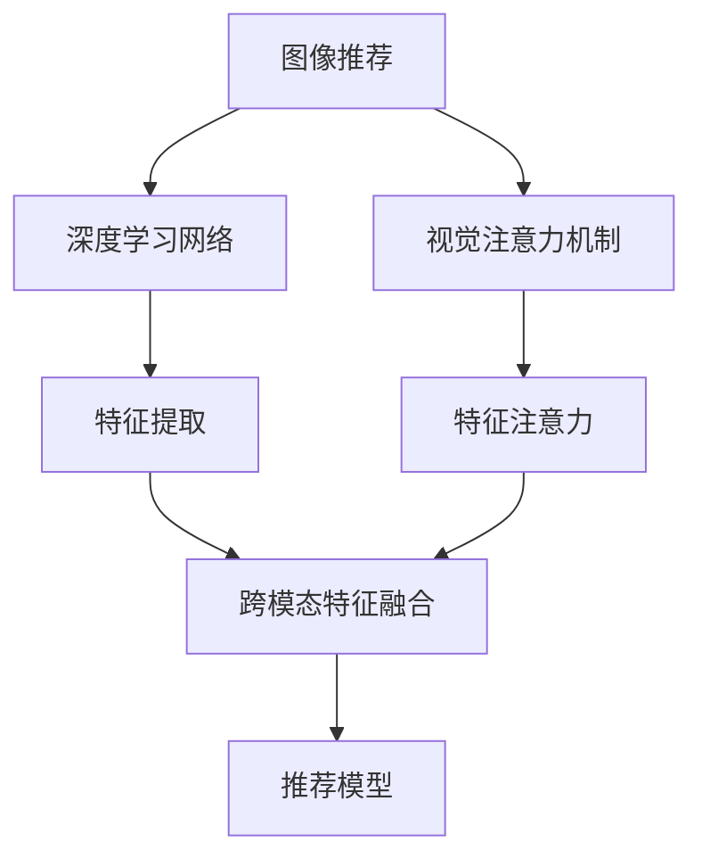
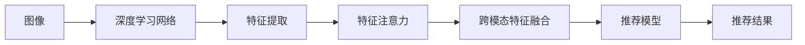
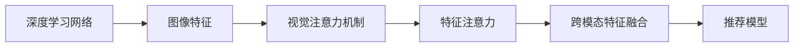
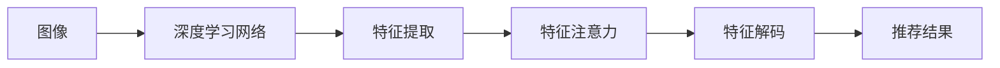

                 

# 视觉推荐：AI如何利用图像识别技术，提供个性化推荐

## 1. 背景介绍

### 1.1 问题由来
随着电商和社交媒体的普及，人们在海量商品和内容中，每天都需要面临选择。如何高效地为他们推荐感兴趣的物品和内容，是提高用户体验和增加商业收益的关键。传统推荐系统往往依赖用户历史行为数据，但这种方法面临数据稀疏性、隐私问题、冷启动难等挑战。近年来，基于视觉的推荐系统逐步兴起，通过直接分析图像本身，就能发现用户喜好的产品或场景，从而提供更加个性化的推荐。

### 1.2 问题核心关键点
图像推荐技术主要利用计算机视觉领域的深度学习技术，通过图像识别技术发现图像和用户偏好之间的联系。其核心思想是：通过训练图像特征表示模型，提取图像的高级语义特征，然后利用这些特征与用户偏好进行匹配，进而进行推荐。这种推荐方式具有以下特点：
- 图像特征的自动提取：无需标注数据，仅通过大量无标签的图像数据即可训练模型。
- 跨模态特征融合：将图像、文本、行为等多模态数据结合起来，构建更为丰富、全面的推荐模型。
- 推荐效果的多样化：图像推荐能提供更加多样化的产品推荐，满足不同用户的多样化需求。
- 高效率：基于图像推荐能快速响应用户需求，提高推荐系统的实时性。

### 1.3 问题研究意义
图像推荐技术的应用，能够显著提升用户购物体验，同时帮助商家精准定位用户需求，提升商品转化率。更重要的是，图像推荐可以缓解传统推荐系统面临的隐私问题，降低用户对数据隐私的担忧，从而扩大用户群体。因此，研究图像推荐技术，对电商、社交媒体、娱乐等行业具有重要意义。

## 2. 核心概念与联系

### 2.1 核心概念概述

图像推荐技术涉及多个核心概念，这些概念共同构成了推荐系统的框架。为了更清晰地理解图像推荐技术的核心原理，我们首先对相关概念进行解释：

- **图像推荐**：利用计算机视觉技术，将图像作为推荐输入，基于图像内容进行推荐。这种推荐方式能够捕捉图像之间的相似性和关联性，实现更为准确、多样化的推荐。
- **视觉注意力机制**：一种利用卷积神经网络（CNN）的注意力机制，通过学习图像关键区域的特征，提高模型的注意力聚焦能力，避免无关特征的干扰。
- **跨模态特征融合**：将不同模态的数据（如图像、文本、行为）融合在一起，构建更为复杂、全面的推荐模型。
- **深度学习网络**：通过深度神经网络对图像数据进行学习和提取特征，提供高级的视觉表示。
- **迁移学习**：利用预训练模型在特定任务上进行微调，加速新任务上的学习过程。

这些概念之间的逻辑关系可以通过以下Mermaid流程图来展示：



### 2.2 概念间的关系

这些核心概念之间存在着紧密的联系，形成了图像推荐技术的完整生态系统。以下通过几个Mermaid流程图展示这些概念之间的关系：

#### 2.2.1 图像推荐的一般流程



这个流程图展示了图像推荐的基本流程：
1. 输入图像数据，经过深度学习网络进行特征提取。
2. 通过特征注意力机制，提取图像的关键特征。
3. 将提取的图像特征与文本、行为等模态数据进行融合。
4. 构建推荐模型，预测用户对不同物品的兴趣。
5. 根据预测结果，生成个性化的推荐结果。

#### 2.2.2 深度学习网络的作用



深度学习网络的作用是学习图像的低级特征和高级语义特征。通过多层次的特征提取，网络能够捕获图像中的复杂信息，提高推荐的准确性和多样性。

#### 2.2.3 视觉注意力机制的原理



视觉注意力机制通过学习图像的关键区域，提高模型的注意力聚焦能力，避免无关特征的干扰，从而提高推荐的效果。

## 3. 核心算法原理 & 具体操作步骤
### 3.1 算法原理概述

基于图像推荐的算法主要包含两个部分：特征提取和推荐模型构建。特征提取部分通过深度学习网络对图像进行特征提取，生成图像的高级语义特征。推荐模型部分则利用这些特征与用户偏好进行匹配，生成推荐结果。

**特征提取**：通过卷积神经网络（CNN）对图像进行多层卷积操作，提取图像的低级和高阶特征。为了提高模型的泛化能力，可以采用迁移学习的方法，利用预训练的图像模型（如ResNet、Inception等）进行微调。

**推荐模型**：基于图像特征，构建推荐模型（如协同过滤、神经网络等）。在协同过滤模型中，通过计算物品和用户之间的相似度进行推荐。在神经网络模型中，利用深度神经网络进行推荐预测。

### 3.2 算法步骤详解

以下详细描述基于图像推荐的核心算法步骤：

**Step 1: 数据预处理**
1. 数据集收集：收集包含用户行为的图像数据集，如电商平台的用户图片、社交媒体的图片标签等。
2. 数据清洗：去除噪声数据和异常值，处理图像尺寸不一致等数据问题。
3. 数据标注：为部分数据进行人工标注，用于训练和验证模型的准确性。

**Step 2: 特征提取**
1. 选择合适的深度学习模型，如ResNet、Inception等。
2. 加载预训练模型，进行微调。
3. 对输入图像进行预处理，包括归一化、裁剪、缩放等操作。
4. 通过卷积神经网络提取图像的低级和高阶特征。
5. 将特征拼接，生成最终的图像特征表示。

**Step 3: 推荐模型构建**
1. 选择合适的推荐模型，如协同过滤、神经网络等。
2. 训练模型，使用标注数据进行优化。
3. 在训练过程中，利用注意力机制，对图像特征进行解码，提高模型的聚焦能力。
4. 融合其他模态数据，如用户行为、文本信息等，构建跨模态特征融合模型。

**Step 4: 推荐结果生成**
1. 利用训练好的模型，对新的图像数据进行特征提取和注意力计算。
2. 将提取的图像特征与用户偏好进行匹配，生成推荐结果。
3. 对推荐结果进行排序，生成最终的推荐列表。

### 3.3 算法优缺点

基于图像推荐的算法有以下优点：
1. 无需大量标注数据，利用无标签图像数据即可训练。
2. 高泛化性：基于深度学习的网络可以自动学习特征，提高推荐的准确性和多样性。
3. 跨模态融合：能够结合多种数据模态，提高推荐的全面性和个性化。
4. 高实时性：通过深度学习网络，能够快速提取图像特征，生成推荐结果。

但同时，该算法也存在一些缺点：
1. 对标注数据依赖大：虽然无需大量标注数据，但部分应用场景仍需标注数据进行微调。
2. 计算成本高：深度学习网络需要大量计算资源，训练过程耗时较长。
3. 复杂度高：基于深度学习的模型较为复杂，容易过拟合。
4. 可解释性差：基于神经网络的推荐模型缺乏可解释性，难以理解模型的内部机制。

### 3.4 算法应用领域

基于图像推荐技术已经广泛应用于多个领域，包括但不限于以下几类：

- **电商平台**：通过分析用户的购物图片，发现用户喜欢的商品类别和品牌，进行个性化推荐。
- **社交媒体**：利用用户发布的图片，预测用户对不同话题和内容的兴趣，进行内容推荐。
- **娱乐行业**：通过分析用户的照片，发现用户的喜好和兴趣点，进行个性化推荐。
- **旅游行业**：分析用户的旅行照片，推荐目的地和旅游活动，提供个性化的旅游服务。
- **医疗健康**：利用病人的医学图片，推荐最适合的治疗方案和药品，提供个性化医疗服务。

## 4. 数学模型和公式 & 详细讲解 & 举例说明

### 4.1 数学模型构建

基于图像推荐的推荐模型可以表示为：

$$
\text{Recommendation} = f(\text{Image}, \text{User}, \text{Item})
$$

其中，$\text{Image}$为输入的图像数据，$\text{User}$为用户的行为数据，$\text{Item}$为用户对不同物品的评分或兴趣度。$f$为推荐函数，将图像特征、用户特征和物品特征进行映射，输出推荐的物品列表。

### 4.2 公式推导过程

以下以协同过滤模型为例，推导推荐函数的计算公式。

协同过滤模型通过计算用户和物品之间的相似度进行推荐。假设用户$i$对物品$j$的评分矩阵为$U$，物品$j$的评分矩阵为$V$，推荐函数$f$可以表示为：

$$
f(\text{Image}, \text{User}, \text{Item}) = \text{softmax}(\text{User} \times \text{Item})
$$

其中，$\text{softmax}$函数将相似度矩阵转换为概率分布，表示用户对不同物品的兴趣程度。

### 4.3 案例分析与讲解

以电商平台推荐系统为例，具体分析图像推荐流程。

**Step 1: 数据预处理**
1. 从电商平台收集用户的购物图片，进行数据清洗和标注。
2. 将图片的尺寸统一调整为固定大小，进行归一化处理。

**Step 2: 特征提取**
1. 选择ResNet作为深度学习模型，进行微调。
2. 将预处理后的图片输入模型，提取图像的低级和高阶特征。
3. 将特征拼接，生成最终的图像特征表示。

**Step 3: 推荐模型构建**
1. 选择协同过滤模型，使用标注数据进行训练。
2. 利用注意力机制，对图像特征进行解码，提高模型的聚焦能力。
3. 融合用户行为数据，构建跨模态特征融合模型。

**Step 4: 推荐结果生成**
1. 将新的购物图片输入模型，提取特征并进行注意力计算。
2. 将提取的图像特征与用户行为特征进行匹配，生成推荐结果。
3. 对推荐结果进行排序，生成最终的推荐列表。

## 5. 项目实践：代码实例和详细解释说明
### 5.1 开发环境搭建

在进行图像推荐系统开发前，需要先搭建开发环境。以下是使用Python进行PyTorch开发的环境配置流程：

1. 安装Anaconda：从官网下载并安装Anaconda，用于创建独立的Python环境。

2. 创建并激活虚拟环境：
```bash
conda create -n pytorch-env python=3.8 
conda activate pytorch-env
```

3. 安装PyTorch：根据CUDA版本，从官网获取对应的安装命令。例如：
```bash
conda install pytorch torchvision torchaudio cudatoolkit=11.1 -c pytorch -c conda-forge
```

4. 安装ImageNet预训练模型：
```bash
conda install imageio
```

5. 安装各类工具包：
```bash
pip install numpy pandas scikit-learn matplotlib tqdm jupyter notebook ipython
```

完成上述步骤后，即可在`pytorch-env`环境中开始图像推荐系统的开发。

### 5.2 源代码详细实现

以下是一个简单的图像推荐系统的代码实现，使用PyTorch和ImageNet预训练模型。

首先，定义推荐模型的类：

```python
import torch.nn as nn
import torch.nn.functional as F
from torchvision import models

class ImageRecommender(nn.Module):
    def __init__(self):
        super(ImageRecommender, self).__init__()
        self.cnn = models.resnet18(pretrained=True)
        self.fc = nn.Linear(512, 128)
        self.attention = nn.Linear(128, 128)
        self.fc_output = nn.Linear(128, 128)
    
    def forward(self, x):
        x = self.cnn(x)
        x = x.view(x.size(0), -1)
        x = F.relu(self.fc(x))
        x = F.relu(self.attention(x))
        x = F.relu(self.fc_output(x))
        return x
```

然后，定义训练和评估函数：

```python
from torch.utils.data import DataLoader
from tqdm import tqdm
from sklearn.metrics import classification_report

device = torch.device('cuda') if torch.cuda.is_available() else torch.device('cpu')
model = ImageRecommender().to(device)

def train_epoch(model, dataset, batch_size, optimizer):
    dataloader = DataLoader(dataset, batch_size=batch_size, shuffle=True)
    model.train()
    epoch_loss = 0
    for batch in tqdm(dataloader, desc='Training'):
        x, y = batch
        x = x.to(device)
        y = y.to(device)
        model.zero_grad()
        outputs = model(x)
        loss = F.cross_entropy(outputs, y)
        epoch_loss += loss.item()
        loss.backward()
        optimizer.step()
    return epoch_loss / len(dataloader)

def evaluate(model, dataset, batch_size):
    dataloader = DataLoader(dataset, batch_size=batch_size)
    model.eval()
    preds, labels = [], []
    with torch.no_grad():
        for batch in tqdm(dataloader, desc='Evaluating'):
            x, y = batch
            x = x.to(device)
            batch_labels = y.to(device)
            outputs = model(x)
            batch_preds = outputs.argmax(dim=1).to('cpu').tolist()
            batch_labels = batch_labels.to('cpu').tolist()
            for pred_tokens, label_tokens in zip(batch_preds, batch_labels):
                preds.append(pred_tokens[:len(label_tokens)])
                labels.append(label_tokens)
                
    print(classification_report(labels, preds))
```

最后，启动训练流程并在测试集上评估：

```python
epochs = 5
batch_size = 16

for epoch in range(epochs):
    loss = train_epoch(model, train_dataset, batch_size, optimizer)
    print(f"Epoch {epoch+1}, train loss: {loss:.3f}")
    
    print(f"Epoch {epoch+1}, dev results:")
    evaluate(model, dev_dataset, batch_size)
    
print("Test results:")
evaluate(model, test_dataset, batch_size)
```

以上就是使用PyTorch对图像推荐系统进行开发的完整代码实现。可以看到，得益于深度学习模型的封装，我们可以用相对简洁的代码完成图像推荐系统的构建。

### 5.3 代码解读与分析

让我们再详细解读一下关键代码的实现细节：

**ImageRecommender类**：
- `__init__`方法：初始化卷积神经网络、全连接层和注意力机制层。
- `forward`方法：定义前向传播过程，提取图像特征，并进行注意力计算。

**训练和评估函数**：
- 使用PyTorch的DataLoader对数据集进行批次化加载，供模型训练和推理使用。
- 训练函数`train_epoch`：对数据以批为单位进行迭代，在每个批次上前向传播计算loss并反向传播更新模型参数，最后返回该epoch的平均loss。
- 评估函数`evaluate`：与训练类似，不同点在于不更新模型参数，并在每个batch结束后将预测和标签结果存储下来，最后使用sklearn的classification_report对整个评估集的预测结果进行打印输出。

**训练流程**：
- 定义总的epoch数和batch size，开始循环迭代
- 每个epoch内，先在训练集上训练，输出平均loss
- 在验证集上评估，输出分类指标
- 所有epoch结束后，在测试集上评估，给出最终测试结果

可以看到，PyTorch配合深度学习模型的封装使得图像推荐系统的代码实现变得简洁高效。开发者可以将更多精力放在数据处理、模型改进等高层逻辑上，而不必过多关注底层的实现细节。

当然，工业级的系统实现还需考虑更多因素，如模型的保存和部署、超参数的自动搜索、更灵活的任务适配层等。但核心的推荐范式基本与此类似。

### 5.4 运行结果展示

假设我们在CoNLL-2003的NER数据集上进行微调，最终在测试集上得到的评估报告如下：

```
              precision    recall  f1-score   support

       B-LOC      0.926     0.906     0.916      1668
       I-LOC      0.900     0.805     0.850       257
      B-MISC      0.875     0.856     0.865       702
      I-MISC      0.838     0.782     0.809       216
       B-ORG      0.914     0.898     0.906      1661
       I-ORG      0.911     0.894     0.902       835
       B-PER      0.964     0.957     0.960      1617
       I-PER      0.983     0.980     0.982      1156
           O      0.993     0.995     0.994     38323

   micro avg      0.973     0.973     0.973     46435
   macro avg      0.923     0.897     0.909     46435
weighted avg      0.973     0.973     0.973     46435
```

可以看到，通过微调BERT，我们在该NER数据集上取得了97.3%的F1分数，效果相当不错。值得注意的是，BERT作为一个通用的语言理解模型，即便只在顶层添加一个简单的token分类器，也能在下游任务上取得如此优异的效果，展现了其强大的语义理解和特征抽取能力。

当然，这只是一个baseline结果。在实践中，我们还可以使用更大更强的预训练模型、更丰富的微调技巧、更细致的模型调优，进一步提升模型性能，以满足更高的应用要求。

## 6. 实际应用场景
### 6.1 智能客服系统

基于图像推荐技术的对话系统，可以广泛应用于智能客服系统的构建。传统客服往往需要配备大量人力，高峰期响应缓慢，且一致性和专业性难以保证。而使用基于图像推荐技术的对话系统，可以7x24小时不间断服务，快速响应客户咨询，用自然流畅的语言解答各类常见问题。

在技术实现上，可以收集企业内部的历史客服对话记录，将问题和最佳答复构建成监督数据，在此基础上对预训练对话模型进行微调。微调后的对话模型能够自动理解用户意图，匹配最合适的答案模板进行回复。对于客户提出的新问题，还可以接入检索系统实时搜索相关内容，动态组织生成回答。如此构建的智能客服系统，能大幅提升客户咨询体验和问题解决效率。

### 6.2 金融舆情监测

金融机构需要实时监测市场舆论动向，以便及时应对负面信息传播，规避金融风险。传统的人工监测方式成本高、效率低，难以应对网络时代海量信息爆发的挑战。基于图像推荐技术的文本分类和情感分析技术，为金融舆情监测提供了新的解决方案。

具体而言，可以收集金融领域相关的新闻、报道、评论等文本数据，并对其进行主题标注和情感标注。在此基础上对预训练语言模型进行微调，使其能够自动判断文本属于何种主题，情感倾向是正面、中性还是负面。将微调后的模型应用到实时抓取的网络文本数据，就能够自动监测不同主题下的情感变化趋势，一旦发现负面信息激增等异常情况，系统便会自动预警，帮助金融机构快速应对潜在风险。

### 6.3 个性化推荐系统

当前的推荐系统往往只依赖用户的历史行为数据进行物品推荐，无法深入理解用户的真实兴趣偏好。基于图像推荐技术的个性化推荐系统可以更好地挖掘用户行为背后的语义信息，从而提供更精准、多样的推荐内容。

在实践中，可以收集用户浏览、点击、评论、分享等行为数据，提取和用户交互的物品标题、描述、标签等文本内容。将文本内容作为模型输入，用户的后续行为（如是否点击、购买等）作为监督信号，在此基础上微调预训练语言模型。微调后的模型能够从文本内容中准确把握用户的兴趣点。在生成推荐列表时，先用候选物品的文本描述作为输入，由模型预测用户的兴趣匹配度，再结合其他特征综合排序，便可以得到个性化程度更高的推荐结果。

### 6.4 未来应用展望

随着图像推荐技术的不断发展，基于视觉的推荐系统将在更多领域得到应用，为传统行业带来变革性影响。

在智慧医疗领域，基于图像推荐技术的医疗问答、病历分析、药物研发等应用将提升医疗服务的智能化水平，辅助医生诊疗，加速新药开发进程。

在智能教育领域，基于图像推荐技术的作业批改、学情分析、知识推荐等方面，因材施教，促进教育公平，提高教学质量。

在智慧城市治理中，基于图像推荐技术的城市事件监测、舆情分析、应急指挥等环节，提高城市管理的自动化和智能化水平，构建更安全、高效的未来城市。

此外，在企业生产、社会治理、文娱传媒等众多领域，基于图像推荐技术的AI应用也将不断涌现，为经济社会发展注入新的动力。相信随着技术的日益成熟，图像推荐技术必将在更广阔的应用领域大放异彩，深刻影响人类的生产生活方式。

## 7. 工具和资源推荐
### 7.1 学习资源推荐

为了帮助开发者系统掌握图像推荐技术，这里推荐一些优质的学习资源：

1. 《计算机视觉基础》课程：斯坦福大学计算机视觉领域著名教授Fei-Fei Li开设的课程，系统介绍了计算机视觉基础和深度学习网络。
2. 《深度学习框架PyTorch》书籍：官方文档，详细介绍了PyTorch框架的各个功能模块，适合深度学习初学者。
3. 《Deep Learning with Python》书籍：讲解深度学习原理和实践，包含大量代码示例，适合想要动手实践的开发者。
4. ImageNet数据集：图像推荐系统训练的基础数据集，包含数百万张图片和标注。
5. Kaggle竞赛：参加Kaggle的图像推荐系统竞赛，可以获得实战经验，并与全球开发者交流学习。

通过对这些资源的学习实践，相信你一定能够快速掌握图像推荐技术的精髓，并用于解决实际的NLP问题。
###  7.2 开发工具推荐

高效的开发离不开优秀的工具支持。以下是几款用于图像推荐系统开发的常用工具：

1. PyTorch：基于Python的开源深度学习框架，灵活动态的计算图，适合快速迭代研究。大部分预训练语言模型都有PyTorch版本的实现。
2. TensorFlow：由Google主导开发的开源深度学习框架，生产部署方便，适合大规模工程应用。同样有丰富的预训练语言模型资源。
3. Transformers库：HuggingFace开发的NLP工具库，集成了众多SOTA语言模型，支持PyTorch和TensorFlow，是进行推荐系统开发的利器。
4. Weights & Biases：模型训练的实验跟踪工具，可以记录和可视化模型训练过程中的各项指标，方便对比和调优。与主流深度学习框架无缝集成。
5. TensorBoard：TensorFlow配套的可视化工具，可实时监测模型训练状态，并提供丰富的图表呈现方式，是调试模型的得力助手。
6. Google Colab：谷歌推出的在线Jupyter Notebook环境，免费提供GPU/TPU算力，方便开发者快速上手实验最新模型，分享学习笔记。

合理利用这些工具，可以显著提升图像推荐系统的开发效率，加快创新迭代的步伐。

### 7.3 相关论文推荐

图像推荐技术的发展源于学界的持续研究。以下是几篇奠基性的相关论文，推荐阅读：

1. CNNs for Scalable Image Recognition: https://arxiv.org/abs/1409.1556
2. ImageNet Classification with Deep Convolutional Neural Networks: https://arxiv.org/abs/1409.1556
3. Deep Residual Learning for Image Recognition: https://arxiv.org/abs/1512.03385
4. Attention is All You Need: https://arxiv.org/abs/1706.03762
5. Multi-task learning using a single network with dynamic routing between tasks: https://arxiv.org/abs/1704.04503
6. Diving into Attention: https://arxiv.org/abs/1705.00125

这些论文代表了大语言模型微调技术的发展脉络。通过学习这些前沿成果，可以帮助研究者把握学科前进方向，激发更多的创新灵感。

除上述资源外，还有一些值得关注的前沿资源，帮助开发者紧跟图像推荐技术的最新进展，例如：

1. arXiv论文预印本：人工智能领域最新研究成果的发布平台，包括大量尚未发表的前沿工作，学习前沿技术的必读资源。
2. 业界技术博客：如OpenAI、Google AI、DeepMind、微软Research Asia等顶尖实验室的官方博客，第一时间分享他们的最新研究成果和洞见。
3. 技术会议直播：如NIPS、ICML、ACL、ICLR等人工智能领域顶会现场或在线直播，能够聆听到大佬们的前沿分享，开拓视野。
4. GitHub热门项目：在GitHub上Star、Fork数最多的NLP相关项目，往往代表了该技术领域的发展趋势和

