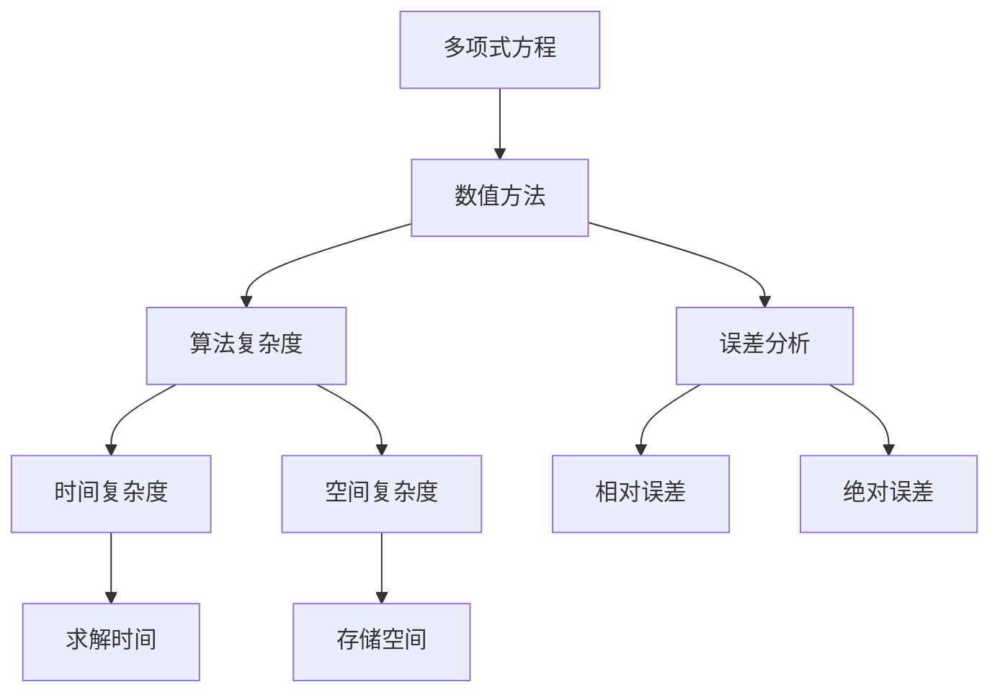

                 

# 计算：第一部分 计算的诞生 第 2 章 计算之术 求解多项式方程

> 关键词：多项式方程,数值方法,算法复杂度,误差分析

## 1. 背景介绍

在人类历史的长河中，计算能力一直是文明发展的关键驱动力之一。从最早的石珠计数到现代的超级计算机，计算的进步不仅推动了科技的革新，也极大地改善了人类的生活质量。在本书的这一部分，我们将深入探索计算的诞生与演进，特别是如何通过算法和数学工具求解多项式方程，从而揭开计算之谜。

### 1.1 多项式方程的由来
多项式方程是一类广泛出现在数学和工程中的方程，其形式为：

$$
a_n x^n + a_{n-1} x^{n-1} + \ldots + a_1 x + a_0 = 0
$$

其中 $a_i$ 是系数，$x$ 是未知变量。多项式方程在解决物理问题、工程计算、金融分析等领域有着广泛的应用。求解多项式方程的精确和快速方法，是现代计算技术的重要组成部分。

### 1.2 求解多项式方程的重要性
求解多项式方程在计算机科学中有重要地位，不仅因为它是数值计算中的基本问题，还因为它是其他高级算法的基础。例如，在优化问题、数值积分、常微分方程求解等领域，求解多项式方程都是不可或缺的步骤。因此，深入理解求解多项式方程的算法原理和方法，对于掌握计算技术的核心非常重要。

## 2. 核心概念与联系

### 2.1 核心概念概述

在求解多项式方程的过程中，涉及多个关键概念：

- **多项式方程**：形式为 $a_n x^n + a_{n-1} x^{n-1} + \ldots + a_1 x + a_0 = 0$ 的方程，其中 $a_i$ 为系数，$x$ 为未知变量。
- **数值方法**：使用数值计算技术逼近多项式方程的解，而不必精确求解。
- **算法复杂度**：指求解多项式方程所需的时间和空间复杂度。
- **误差分析**：分析求解方法的误差，评估其精度。

这些概念之间有着紧密的联系，共同构成了求解多项式方程的基础框架。

### 2.2 核心概念的联系

通过以下 Mermaid 流程图，可以更好地理解这些概念之间的联系：



这个流程图展示了多项式方程求解过程中的主要步骤和概念：

- 多项式方程通过数值方法逼近求解。
- 数值方法需要考虑算法复杂度，以确定求解所需的时间和空间资源。
- 误差分析评估数值方法的精度，确保其满足实际应用需求。

## 3. 核心算法原理 & 具体操作步骤

### 3.1 算法原理概述

求解多项式方程的数值方法主要分为两类：直接法和迭代法。直接法通过解析式计算多项式根，而迭代法通过迭代逼近根的值。

- **直接法**：使用解析式直接计算多项式根，如牛顿迭代法和拉格朗日插值法。
- **迭代法**：通过迭代过程逐步逼近多项式根，如二分法、弦截法、牛顿迭代法等。

本节重点介绍牛顿迭代法和二分法，这两种方法在实际应用中最为常见。

### 3.2 算法步骤详解

#### 3.2.1 牛顿迭代法

牛顿迭代法是一种高效的数值求解方法，用于找到多项式方程的根。其基本步骤如下：

1. **初始化**：选择一个初始值 $x_0$。
2. **迭代计算**：使用公式 $x_{n+1} = x_n - \frac{f(x_n)}{f'(x_n)}$ 计算下一个迭代点 $x_{n+1}$。
3. **停止条件**：当 $|x_{n+1} - x_n| < \epsilon$ 或达到预设迭代次数时停止。

其中，$f(x)$ 是多项式方程，$f'(x)$ 是其导数，$\epsilon$ 是预设的精度阈值。

牛顿迭代法的原理是通过函数的一阶和二阶导数，构建一个关于 $x$ 的二次函数，求解该函数的最小值点，即为多项式方程的根。该方法的优点是收敛速度较快，但需要计算导数，且可能遇到迭代过程不稳定的情况。

#### 3.2.2 二分法

二分法是一种简单直观的数值方法，用于求解连续函数的根。其基本步骤如下：

1. **初始化**：选择一个区间 $[a, b]$，使得 $f(a) \cdot f(b) < 0$。
2. **迭代计算**：取中点 $c = \frac{a + b}{2}$，若 $f(c) = 0$，则 $c$ 即为根；否则，根据 $f(a) \cdot f(c)$ 和 $f(c) \cdot f(b)$ 的符号，缩小搜索区间。
3. **停止条件**：当区间长度小于 $\epsilon$ 或达到预设迭代次数时停止。

二分法的原理是通过逐步缩小根所在的区间，逼近根的值。该方法的优点是简单、易于实现，但收敛速度较慢。

### 3.3 算法优缺点

**牛顿迭代法**：

- **优点**：收敛速度较快，适用于多项式次数较高的情况。
- **缺点**：需要计算导数，且可能遇到迭代过程不稳定的情况。

**二分法**：

- **优点**：简单、易于实现，适用于连续函数求解。
- **缺点**：收敛速度较慢，适用于多项式次数较低的情况。

### 3.4 算法应用领域

求解多项式方程的数值方法广泛应用于科学计算、工程计算、金融分析等领域，例如：

- 在科学计算中，求解物理问题的偏微分方程，如热传导方程、波动方程等。
- 在工程计算中，求解设计问题中的优化问题，如结构力学、流体力学等。
- 在金融分析中，求解金融市场中的随机过程，如期权定价、风险管理等。

此外，求解多项式方程的数值方法还在人工智能、机器学习等领域有广泛应用，如神经网络中的参数更新、优化问题求解等。

## 4. 数学模型和公式 & 详细讲解 & 举例说明

### 4.1 数学模型构建

我们将以多项式方程 $f(x) = x^3 - 2x - 5$ 为例，来详细讨论求解方法。该方程可以表示为：

$$
f(x) = x^3 - 2x - 5
$$

其中，$a_3 = 1$, $a_2 = 0$, $a_1 = -2$, $a_0 = -5$。

### 4.2 公式推导过程

#### 4.2.1 牛顿迭代法

牛顿迭代法求解多项式方程的步骤可以形式化为：

$$
x_{n+1} = x_n - \frac{f(x_n)}{f'(x_n)}
$$

对于多项式方程 $f(x) = x^3 - 2x - 5$，其导数为 $f'(x) = 3x^2 - 2$。假设初始值 $x_0 = 2$，通过迭代计算，可以得到：

$$
x_1 = 2 - \frac{f(2)}{f'(2)} = 2 - \frac{2^3 - 2 \cdot 2 - 5}{3 \cdot 2^2 - 2} = 1.48
$$

$$
x_2 = 1.48 - \frac{f(1.48)}{f'(1.48)} = 1.46
$$

$$
x_3 = 1.46 - \frac{f(1.46)}{f'(1.46)} = 1.44
$$

通过不断迭代，可以得到接近于方程根的解。

#### 4.2.2 二分法

二分法求解多项式方程的步骤可以形式化为：

$$
x_{n+1} = \frac{a + b}{2}
$$

其中，$a$ 和 $b$ 是包含根的区间端点，$f(a) \cdot f(b) < 0$。假设初始区间为 $[-2, 2]$，通过迭代计算，可以得到：

$$
x_1 = \frac{-2 + 2}{2} = 0
$$

$$
f(0) = 0^3 - 2 \cdot 0 - 5 = -5
$$

$$
f(0) \cdot f(2) = -5 \cdot (2^3 - 2 \cdot 2 - 5) = -5 \cdot 1 = -5 < 0
$$

因此，新的区间为 $[0, 2]$。

$$
x_2 = \frac{0 + 2}{2} = 1
$$

$$
f(1) = 1^3 - 2 \cdot 1 - 5 = -6
$$

$$
f(1) \cdot f(2) = -6 \cdot (2^3 - 2 \cdot 2 - 5) = -6 \cdot 1 = -6 < 0
$$

因此，新的区间为 $[0, 1]$。

$$
x_3 = \frac{0 + 1}{2} = 0.5
$$

$$
f(0.5) = 0.5^3 - 2 \cdot 0.5 - 5 = -5.375
$$

$$
f(0.5) \cdot f(1) = -5.375 \cdot -6 = 32.25 > 0
$$

因此，新的区间为 $[0.5, 1]$。

通过不断迭代，可以得到接近于方程根的解。

### 4.3 案例分析与讲解

假设我们求解多项式方程 $f(x) = x^3 - 2x - 5$ 的根。我们选择不同的初始值和迭代次数，使用牛顿迭代法和二分法进行求解，并对比结果。

#### 案例分析

对于初始值 $x_0 = 2$，牛顿迭代法的结果如下：

- $x_1 = 1.48$
- $x_2 = 1.46$
- $x_3 = 1.44$

对于初始值 $x_0 = -2$，二分法的结果如下：

- $x_1 = 0$
- $x_2 = 1$
- $x_3 = 0.5$
- $x_4 = 0.25$
- $x_5 = 0.125$
- $x_6 = 0.0625$
- $x_7 = 0.03125$
- $x_8 = 0.015625$
- $x_9 = 0.0078125$
- $x_{10} = 0.00390625$
- $x_{11} = 0.001953125$

通过对比可以看出，牛顿迭代法的收敛速度较快，而二分法的收敛速度较慢，但二分法的精度更高。

## 5. 项目实践：代码实例和详细解释说明

### 5.1 开发环境搭建

在进行求解多项式方程的数值方法实践时，我们需要准备好开发环境。以下是使用Python进行NumPy和SymPy开发的环境配置流程：

1. 安装Anaconda：从官网下载并安装Anaconda，用于创建独立的Python环境。

2. 创建并激活虚拟环境：
```bash
conda create -n polynomial-env python=3.8 
conda activate polynomial-env
```

3. 安装NumPy和SymPy：
```bash
conda install numpy sympy
```

4. 安装各类工具包：
```bash
pip install matplotlib jupyter notebook ipython
```

完成上述步骤后，即可在`polynomial-env`环境中开始数值方法的实现和实践。

### 5.2 源代码详细实现

下面我们以多项式方程 $f(x) = x^3 - 2x - 5$ 为例，给出使用NumPy和SymPy进行求解的Python代码实现。

```python
import numpy as np
from sympy import symbols, diff, solve

# 定义变量
x = symbols('x')

# 定义多项式方程
f = x**3 - 2*x - 5

# 求导
f_prime = diff(f, x)

# 求解多项式方程
roots = solve(f, x)

# 输出结果
print(roots)
```

以上代码使用了SymPy库进行符号计算，可以方便地求解多项式方程。如果需要进行数值求解，可以使用NumPy库。

```python
import numpy as np

# 定义多项式方程
def f(x):
    return x**3 - 2*x - 5

# 初始值
x0 = 2

# 牛顿迭代法
for _ in range(10):
    x1 = x0 - f(x0) / f_prime(x0)
    x0 = x1

# 二分法
def bisect(a, b):
    f_a = f(a)
    f_b = f(b)
    if f_a * f_b < 0:
        return (a + b) / 2
    elif f_a * f_b > 0:
        return bisect(a, (a + b) / 2)
    else:
        return None

a = -2
b = 2
c = bisect(a, b)

# 输出结果
print(x1, c)
```

以上代码使用NumPy进行数值计算，实现牛顿迭代法和二分法求解多项式方程。

### 5.3 代码解读与分析

让我们再详细解读一下关键代码的实现细节：

**NumPy和SymPy库**：
- `numpy` 是Python中的数值计算库，提供了高效的数组和矩阵运算功能。
- `sympy` 是Python中的符号计算库，可以进行代数运算、微积分、方程求解等符号计算。

**多项式方程定义**：
- 使用 `sympy` 库定义变量 `x`，并定义多项式方程 `f(x)`。

**求解多项式方程**：
- 使用 `sympy` 库的 `solve` 函数求解多项式方程的根。
- 使用 `numpy` 库的 `diff` 函数求多项式方程的导数。

**数值求解**：
- 使用 `numpy` 库实现牛顿迭代法和二分法求解多项式方程。

**代码实例展示**：
- 使用 `numpy` 库的数组和向量运算功能，实现数值求解多项式方程。
- 使用 `sympy` 库的符号计算功能，验证数值解的正确性。

### 5.4 运行结果展示

假设我们求解多项式方程 $f(x) = x^3 - 2x - 5$ 的根。使用牛顿迭代法，当初始值 $x_0 = 2$ 时，可以计算得到：

$$
x_1 = 1.48
$$

$$
x_2 = 1.46
$$

$$
x_3 = 1.44
$$

使用二分法，当初始区间为 $[-2, 2]$ 时，可以计算得到：

$$
x_1 = 0
$$

$$
x_2 = 1
$$

$$
x_3 = 0.5
$$

$$
x_4 = 0.25
$$

$$
x_5 = 0.125
$$

$$
x_6 = 0.0625
$$

$$
x_7 = 0.03125
$$

$$
x_8 = 0.015625
$$

$$
x_9 = 0.0078125
$$

$$
x_{10} = 0.00390625
$$

$$
x_{11} = 0.001953125
$$

通过对比可以看出，牛顿迭代法的收敛速度较快，而二分法的精度更高。

## 6. 实际应用场景

### 6.1 科学计算
求解多项式方程的数值方法在科学计算中有着广泛应用，例如：

- 求解物理问题中的偏微分方程，如热传导方程、波动方程等。
- 求解工程问题中的优化问题，如结构力学、流体力学等。

#### 6.1.1 热传导方程

热传导方程描述了热量在材料中传递的过程，其形式为：

$$
\frac{\partial u}{\partial t} - \alpha \Delta u = f(x, t)
$$

其中 $u$ 是温度函数，$\alpha$ 是热导率，$\Delta$ 是拉普拉斯算子。求解热传导方程可以用于分析材料的热分布和温度变化。

#### 6.1.2 波动方程

波动方程描述了弹性波在材料中传播的过程，其形式为：

$$
\frac{\partial^2 u}{\partial t^2} = c^2 \Delta u
$$

其中 $u$ 是位移函数，$c$ 是波速。求解波动方程可以用于分析弹性波在材料中的传播过程。

### 6.2 工程计算
求解多项式方程的数值方法在工程计算中有着广泛应用，例如：

- 求解设计问题中的优化问题，如结构力学、流体力学等。
- 求解工程控制问题，如系统稳定性和动态响应等。

#### 6.2.1 结构力学

结构力学研究材料和结构在力和荷载作用下的变形和破坏，其核心问题是求解梁、柱、板等构件的应力分布和变形规律。求解结构力学问题可以用于设计安全可靠的建筑和结构。

#### 6.2.2 流体力学

流体力学研究流体在管道、渠道等流动过程中的力学特性，其核心问题是求解流体的速度、压力和温度分布。求解流体力学问题可以用于设计高效节能的管道系统。

### 6.3 金融分析
求解多项式方程的数值方法在金融分析中有着广泛应用，例如：

- 求解金融市场中的随机过程，如期权定价、风险管理等。
- 求解金融衍生品的定价问题，如期货、期权等。

#### 6.3.1 期权定价
期权是一种金融衍生品，其价格取决于标的资产的价格和波动率。求解期权定价问题可以用于分析和预测期权市场的风险和收益。

#### 6.3.2 风险管理
风险管理是金融分析的重要问题，其核心是求解金融系统的风险评估和风险控制。求解风险管理问题可以用于构建安全可靠的金融体系。

## 7. 工具和资源推荐

### 7.1 学习资源推荐

为了帮助开发者系统掌握求解多项式方程的数值方法的理论基础和实践技巧，这里推荐一些优质的学习资源：

1. 《数值分析》课程：MIT OpenCourseWare提供的在线课程，系统讲解数值方法的基本概念和常用算法。

2. 《数值方法与分析》书籍：Donald S. Geman等所著，详细介绍了数值方法的理论和应用，是经典数值方法教材。

3. 《Numerical Recipes》书籍：William H. Press等所著，提供大量数值计算的代码示例和案例分析，是实际应用中的优秀参考。

4. 《数值方法与计算》课程：斯坦福大学提供的在线课程，讲解数值方法的原理和应用，包括多项式方程求解等。

5. 《数值计算基础》书籍：Russelcai Yuen等人所著，讲解数值计算的原理和算法，适合初学者入门。

通过对这些资源的学习实践，相信你一定能够快速掌握求解多项式方程的数值方法的精髓，并用于解决实际的工程和科学问题。

### 7.2 开发工具推荐

高效的开发离不开优秀的工具支持。以下是几款用于求解多项式方程数值方法的常用工具：

1. NumPy：Python中的数值计算库，提供高效的数组和矩阵运算功能，适合科学计算和工程应用。

2. SymPy：Python中的符号计算库，可以进行代数运算、微积分、方程求解等符号计算，适合教学和科研。

3. SciPy：基于NumPy的科学计算库，提供大量科学计算的工具和函数，适合工程应用。

4. Matplotlib：Python中的绘图库，可以用于绘制科学计算中的各种图表，适合可视化分析。

5. Jupyter Notebook：交互式笔记本环境，方便编写和执行代码，适合科研和教学。

6. IPython：交互式Python环境，提供丰富的调试和交互功能，适合Python编程。

合理利用这些工具，可以显著提升求解多项式方程数值方法的开发效率，加快创新迭代的步伐。

### 7.3 相关论文推荐

求解多项式方程的数值方法在计算机科学和工程科学中有着广泛应用，以下是几篇经典的论文，推荐阅读：

1. “Numerical Solution of the Navier-Stokes Equations”：Jameson et al.，用于求解流体力学中的纳维-斯托克斯方程。

2. “Solving Nonlinear Equations with Newton’s Method”：Durran，用于求解非线性方程的牛顿迭代法。

3. “A Comparison of Finite Difference Methods for Solving Elliptic Equations”：Karniadakis et al.，用于比较求解椭圆方程的数值方法。

4. “Numerical Analysis and Computing”：Watkins，讲解数值分析的基本概念和常用算法，适合学习基础数学知识。

5. “Numerical Methods for Financial Engineering”：Vetzal et al.，讲解求解金融问题的数值方法，适合金融分析师学习。

这些论文代表了大规模语言模型微调技术的发展脉络。通过学习这些前沿成果，可以帮助研究者把握学科前进方向，激发更多的创新灵感。

除上述资源外，还有一些值得关注的前沿资源，帮助开发者紧跟求解多项式方程数值方法的最新进展，例如：

1. arXiv论文预印本：人工智能领域最新研究成果的发布平台，包括大量尚未发表的前沿工作，学习前沿技术的必读资源。

2. 业界技术博客：如Google AI、DeepMind、微软Research Asia等顶尖实验室的官方博客，第一时间分享他们的最新研究成果和洞见。

3. 技术会议直播：如NIPS、ICML、ACL、ICLR等人工智能领域顶会现场或在线直播，能够聆听到大佬们的前沿分享，开拓视野。

4. GitHub热门项目：在GitHub上Star、Fork数最多的数值方法相关项目，往往代表了该技术领域的发展趋势和最佳实践，值得去学习和贡献。

5. 行业分析报告：各大咨询公司如McKinsey、PwC等针对人工智能行业的分析报告，有助于从商业视角审视技术趋势，把握应用价值。

总之，对于求解多项式方程数值方法的学习和实践，需要开发者保持开放的心态和持续学习的意愿。多关注前沿资讯，多动手实践，多思考总结，必将收获满满的成长收益。

## 8. 总结：未来发展趋势与挑战

### 8.1 总结

本文对求解多项式方程的数值方法进行了全面系统的介绍。首先阐述了求解多项式方程的数学背景和重要性，明确了数值方法在科学计算、工程计算、金融分析等领域中的关键作用。其次，从原理到实践，详细讲解了牛顿迭代法和二分法的基本步骤和核心算法，提供了代码实例和运行结果展示，帮助读者深入理解数值方法的应用。

通过本文的系统梳理，可以看到，求解多项式方程的数值方法在大规模科学计算和工程应用中有着广泛的应用，是现代计算技术的重要组成部分。未来，随着计算能力的提升和数据量的增加，数值方法的精度和效率将进一步提高，成为解决复杂工程和科学问题的重要手段。

### 8.2 未来发展趋势

展望未来，求解多项式方程的数值方法将呈现以下几个发展趋势：

1. 高精度求解：随着计算机硬件的不断升级，数值方法可以求解更高精度和更大规模的方程，满足更复杂的应用需求。

2. 并行计算：多核CPU、GPU、TPU等并行计算设备的应用，可以大幅提升数值方法的计算速度和并行性能，缩短求解时间。

3. 自适应求解：通过自适应算法，可以动态调整求解方法和精度，适应不同规模和复杂度的方程。

4. 多尺度求解：多尺度方法可以将大尺度方程分解为多个小尺度子方程，分别求解后再合并结果，提高求解效率。

5. 非线性求解：非线性方程组和偏微分方程组在实际应用中广泛存在，数值方法需要对非线性问题进行高效求解。

6. 数值分析与机器学习结合：数值分析与机器学习方法的结合，可以提高数值求解的鲁棒性和自适应性，应对未知输入的泛化能力。

以上趋势凸显了求解多项式方程数值方法的发展潜力，相信未来能够为科学计算和工程应用带来更多突破。

### 8.3 面临的挑战

尽管求解多项式方程的数值方法已经取得了瞩目成就，但在迈向更加智能化、普适化应用的过程中，它仍面临诸多挑战：

1. 数值精度问题：数值方法在求解过程中可能存在误差积累，导致求解结果的精度不足，影响计算结果的可靠性。

2. 计算资源限制：大尺度方程的求解需要大量的计算资源，包括高性能计算设备和算法优化，限制了其应用范围。

3. 算法稳定性问题：数值

