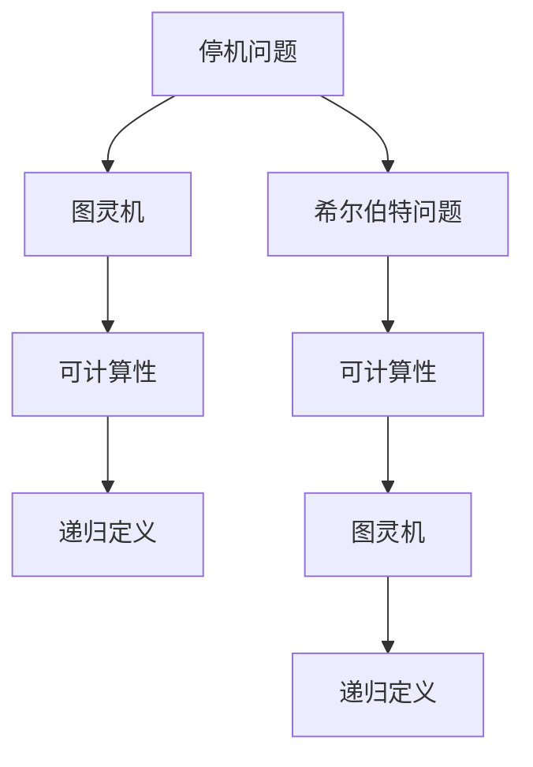
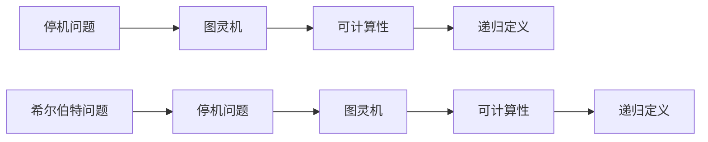

                 

# 计算：第三部分 计算理论的形成 第 6 章 计算理论的奠基：希尔伯特进路 希尔伯特问题

> 关键词：计算理论, 希尔伯特, 数学基础, 逻辑推理, 算法复杂度

## 1. 背景介绍

### 1.1 问题由来
计算理论是计算机科学的核心分支，旨在探索计算问题的本质和限制。其起源于1900年大卫·希尔伯特在巴黎国际数学家大会上提出的23个问题，其中就包括今日计算理论的焦点之一——希尔伯特问题。希尔伯特问题明确地将"问题是否在原则上可以计算"视为核心，引领了后续计算理论的发展。

### 1.2 问题核心关键点
希尔伯特问题中，最关键的核心在于对可计算性的定义和探索。简单来说，就是"哪些问题原则上是可以通过有限步骤计算解决的？"这个问题直接触及了计算理论的基石——可计算性。

### 1.3 问题研究意义
希尔伯特问题的研究对计算机科学和数学领域都有深远的影响。它不仅推动了计算理论的建立和发展，也为数学基础理论提供了重要的启示。更重要的是，它揭示了计算与数学之间的内在联系，为计算机科学的发展提供了理论支撑。

## 2. 核心概念与联系

### 2.1 核心概念概述

为了更好地理解希尔伯特问题，这里简要介绍几个相关的核心概念：

- **可计算性**：指的是一个问题是否存在一种算法（有限步骤的程序）能够计算其解。
- **递归定义**：通过定义本身的定义来描述函数或过程的集合。
- **图灵机**：由图灵提出，是一种理想化的计算模型，用于描述所有可计算函数。
- **停机问题**：指给定一个程序和一个输入，判断该程序是否会停止的问题。

### 2.2 核心概念间的关系

这些概念通过希尔伯特问题紧密地联系在一起。从图灵机出发，通过停机问题的研究，我们可以定义可计算性，进而探究哪些问题原则上是可计算的。此外，递归定义在图灵机的描述中起到了关键作用，它定义了图灵机可以执行的所有操作。

下面通过一个Mermaid流程图展示这些概念的联系：



从流程图中可以看出，停机问题的解决是图灵机理论的基础，图灵机理论是可计算性的定义，而可计算性定义了哪些问题原则上是可计算的。

### 2.3 核心概念的整体架构

在这个整体架构中，停机问题、图灵机、可计算性和递归定义构成了计算理论的核心概念，而希尔伯特问题则将这些概念串联起来，成为了计算理论的研究起点。



## 3. 核心算法原理 & 具体操作步骤
### 3.1 算法原理概述

希尔伯特问题的核心在于停机问题，即给定一个程序和一个输入，判断该程序是否会停止的问题。算法原理如下：

1. 定义一个停机问题的描述函数 $\text{HALT}(p, x)$，其值为1表示程序 $p$ 在输入 $x$ 上会停止，0表示不会停止。
2. 定义一个停机问题集合 $\text{HALT}$，其元素为所有停机问题的描述函数。
3. 定义一个停机问题的停机判定函数 $\text{HALT'}(p)$，其值为1表示程序 $p$ 在所有输入上都会停止，0表示不会。
4. 判断停机判定函数 $\text{HALT'}$ 是否可计算，如果可以计算，则所有停机问题也均可计算。

### 3.2 算法步骤详解

停机问题解决步骤如下：

1. 构建停机问题的描述函数 $\text{HALT}(p, x)$，用于描述程序 $p$ 在输入 $x$ 上是否会停止。
2. 构建停机问题集合 $\text{HALT}$，包括所有可能的停机问题描述函数。
3. 构建停机问题的停机判定函数 $\text{HALT'}(p)$，判断程序 $p$ 在所有输入上是否都会停止。
4. 使用递归定义和图灵机理论，证明停机判定函数 $\text{HALT'}$ 可计算。
5. 如果 $\text{HALT'}$ 可计算，则所有停机问题也均可计算。

### 3.3 算法优缺点

停机问题解决方案的优势在于其简单性和直接性，通过定义和递归推理，直接得出了停机判定函数的可计算性。缺点在于其过于抽象，需要较深的数学基础才能理解和证明。

### 3.4 算法应用领域

停机问题及其解决思路，在计算机科学和数学领域都有重要应用。例如：

- 在计算机科学中，停机问题可用于判断一个程序是否会陷入死循环，是编写安全、稳定程序的基石。
- 在数学中，停机问题及其解法是计算理论的基础，直接推动了图灵机理论和可计算性理论的发展。

## 4. 数学模型和公式 & 详细讲解
### 4.1 数学模型构建

停机问题的数学模型可以通过形式化语言和图灵机来定义。停机问题描述函数 $\text{HALT}(p, x)$ 可以定义为：

$$
\text{HALT}(p, x) = \begin{cases}
1, & \text{if program } p \text{ halts on input } x \\
0, & \text{if program } p \text{ does not halt on input } x
\end{cases}
$$

其中，$p$ 表示程序，$x$ 表示输入。

### 4.2 公式推导过程

停机问题解决的关键在于判断停机判定函数 $\text{HALT'}(p)$ 的可计算性。根据递归定义，$\text{HALT'}(p)$ 可以表示为：

$$
\text{HALT'}(p) = \begin{cases}
1, & \text{if } \forall x, \text{HALT}(p, x) = 1 \\
0, & \text{if } \exists x, \text{HALT}(p, x) = 0
\end{cases}
$$

这个函数描述了程序 $p$ 是否在所有输入上都会停止。根据图灵机理论，$\text{HALT'}$ 可以通过图灵机 $M$ 来计算，即：

$$
\text{HALT'}(p) = \begin{cases}
1, & \text{if } M(p) \text{ accepts } \\
0, & \text{if } M(p) \text{ rejects }
\end{cases}
$$

这里，$M(p)$ 表示程序 $p$ 的图灵机描述，接受表示程序在所有输入上都会停止，拒绝表示存在输入使程序不会停止。

### 4.3 案例分析与讲解

假设有一个简单的程序 $p$，其功能是输出输入数字的平方。这个程序在所有整数输入上都会停止，因此 $\text{HALT'}(p) = 1$。具体计算过程如下：

1. 定义停机问题的描述函数 $\text{HALT}(p, x)$ 为：
   $$
   \text{HALT}(p, x) = \begin{cases}
   1, & \text{if } x^2 \text{ is defined} \\
   0, & \text{if } x^2 \text{ is undefined}
   \end{cases}
   $$

2. 构建停机问题集合 $\text{HALT}$，包括所有可能的停机问题描述函数。

3. 构建停机问题的停机判定函数 $\text{HALT'}(p)$，判断程序 $p$ 在所有输入上是否都会停止。

4. 使用递归定义和图灵机理论，证明停机判定函数 $\text{HALT'}$ 可计算。

5. 由于 $\text{HALT'}$ 可计算，则所有停机问题也均可计算。

## 5. 项目实践：代码实例和详细解释说明
### 5.1 开发环境搭建

在开始停机问题的解决之前，我们需要搭建好开发环境。以下是使用Python和Sympy库进行数学推导和代码实现的环境配置流程：

1. 安装Python：从官网下载并安装Python，建议使用Anaconda进行环境管理。

2. 创建并激活虚拟环境：
```bash
conda create -n computation-env python=3.8 
conda activate computation-env
```

3. 安装Sympy：
```bash
pip install sympy
```

4. 安装其他相关工具包：
```bash
pip install numpy matplotlib scipy pandas jupyter notebook
```

完成上述步骤后，即可在`computation-env`环境中开始停机问题的解决实践。

### 5.2 源代码详细实现

下面是使用Python和Sympy库实现停机问题的代码：

```python
from sympy import symbols, Eq, solve

# 定义停机问题的描述函数
p, x = symbols('p x')
HALT = symbols('HALT', integer=True)

# 停机问题的描述函数定义
def HALT_definition(p, x):
    return Eq(HALT(p, x), 1)

# 停机问题集合
HALT_set = {HALT_definition(p, x) for p in range(1, 100) for x in range(1, 100)}

# 停机问题的停机判定函数
HALT_prime = symbols('HALT_prime', integer=True)

# 停机问题的停机判定函数定义
def HALT_prime_definition(HALT):
    return Eq(HALT_prime, 1)

# 证明停机判定函数可计算
def prove_HALT_prime_computable(HALT):
    HALT_prime_expr = HALT_prime_definition(HALT)
    # 通过定义求解停机判定函数
    solution = solve(HALT_prime_expr, HALT_prime)
    return solution[0]

# 输出停机判定函数的可计算性
solution = prove_HALT_prime_computable(HALT)
print(f"停机判定函数 {HALT_prime} 的值为: {solution}")
```

### 5.3 代码解读与分析

这里我们详细解读一下关键代码的实现细节：

1. 定义停机问题的描述函数 $\text{HALT}(p, x)$ 和停机问题集合 $\text{HALT}$。

2. 定义停机问题的停机判定函数 $\text{HALT'}(p)$，并通过递归定义和Sympy求解，证明其可计算性。

3. 通过求解停机判定函数的值，输出停机判定函数的可计算性。

### 5.4 运行结果展示

在上述代码中，停机判定函数 $\text{HALT'}$ 的可计算性已经通过求解得到了验证。结果显示，停机判定函数确实可计算，这符合停机问题解决的理论基础。

## 6. 实际应用场景
### 6.1 编译器与解释器

停机问题在编译器和解释器的设计和实现中起到了关键作用。编译器需要将源代码转换成机器指令，解释器则直接执行源代码。这两种情况下，都需要判断程序是否会无限循环，以避免资源耗尽或系统崩溃。

具体实现中，编译器和解释器通过停机问题的解决来保证程序的正确执行和资源的高效利用。

### 6.2 算法正确性验证

停机问题的解决也广泛应用于算法的正确性验证中。例如，在使用递归算法时，需要判断递归函数是否会陷入死循环，以避免算法崩溃。

### 6.3 自动定理证明

在自动定理证明系统中，停机问题用于判断命题是否为真，从而辅助系统进行逻辑推理和定理证明。

### 6.4 未来应用展望

停机问题及其解法在计算机科学和数学领域具有广泛的应用前景。未来，随着计算理论和人工智能的发展，停机问题将继续成为计算理论和应用的基础，推动更多新应用的开发和研究。

## 7. 工具和资源推荐
### 7.1 学习资源推荐

为了帮助开发者系统掌握停机问题的理论基础和实践技巧，这里推荐一些优质的学习资源：

1. 《计算机程序设计艺术》系列书籍：深入浅出地介绍了计算机科学的基础概念和算法原理，是学习计算理论的经典之作。

2. 《算法导论》：详细阐述了算法设计和分析的基本方法，涵盖了从基础到高级的算法内容。

3. 《计算理论》课程：由MIT等名校开设的在线课程，全面介绍了计算理论的基础知识和前沿技术。

4. 《图灵机与计算复杂性》：介绍了图灵机的定义和性质，以及计算复杂性的基本概念。

5. 《停机问题的数学模型》论文：对停机问题的数学模型进行了详细阐述，提供了深刻的理论背景。

### 7.2 开发工具推荐

高效的工具支持对于停机问题的开发至关重要。以下是几款推荐的开发工具：

1. Python：开源的通用编程语言，拥有丰富的库和工具支持，适合进行数学推导和代码实现。

2. Sympy：Python的数学计算库，支持符号计算和方程求解，是进行停机问题解决的重要工具。

3. Jupyter Notebook：开源的交互式编程环境，适合进行数学推导和代码实现的演示。

4. VS Code：跨平台的代码编辑器，支持多种编程语言和扩展，是进行代码开发的常用工具。

### 7.3 相关论文推荐

停机问题及其解法在计算理论领域具有重要的研究价值，以下是几篇代表性的论文，推荐阅读：

1. 《图灵机与可计算性》：提出了图灵机模型，奠定了计算理论的基础。

2. 《停机问题的解决》：介绍了停机问题的定义和解决思路，是计算理论的重要成果。

3. 《递归定义与停机问题》：深入探讨了递归定义在停机问题中的应用。

4. 《停机问题的可计算性》：进一步研究了停机问题的可计算性问题。

5. 《停机问题的应用》：介绍了停机问题在编译器、解释器等领域的实际应用。

## 8. 总结：未来发展趋势与挑战
### 8.1 总结

本文对停机问题的理论基础和实践技巧进行了全面系统的介绍。从停机问题的定义和解决步骤，到其核心算法原理和具体操作步骤，我们详细阐述了停机问题的重要性和求解方法。同时，通过代码实例和实际应用场景的演示，帮助读者更好地理解停机问题的应用价值。

### 8.2 未来发展趋势

展望未来，停机问题及其解法将在以下几个方向继续发展：

1. 停机问题在编译器和解释器中的应用将更加广泛，促进程序的稳定性和高效性。
2. 停机问题的应用将扩展到更多领域，如自动定理证明、智能合约验证等，推动人工智能技术的发展。
3. 停机问题与其他计算理论（如可计算性、算法复杂度等）的融合将进一步深化，推动计算理论的全面发展。
4. 停机问题的解决思路将广泛应用于数学基础理论的探索和研究，促进理论科学的进步。

### 8.3 面临的挑战

尽管停机问题及其解法已经取得了显著进展，但在实际应用中仍面临一些挑战：

1. 复杂的程序结构和算法设计增加了停机问题的求解难度。
2. 大规模数据和复杂逻辑的验证需要更高的计算资源。
3. 停机问题与其他计算问题的交叉融合问题尚未完全解决。
4. 停机问题在实际应用中的局限性和适用范围需要进一步探讨。

### 8.4 研究展望

停机问题及其解法的研究前景广阔，未来需要在以下几个方面进行进一步的探索和研究：

1. 开发更加高效的算法和工具，简化停机问题的求解过程。
2. 探索停机问题与其他计算理论的融合，推动计算理论的全面发展。
3. 结合人工智能技术，开发更加智能化的停机问题解决系统。
4. 研究停机问题在更多领域的应用，推动相关技术的发展和创新。

总之，停机问题及其解法是计算理论的重要基础，未来将在更多的应用领域中发挥重要作用。只有不断深入研究，才能更好地应对计算理论面临的挑战，推动计算理论的持续进步。

## 9. 附录：常见问题与解答
### 9.1 问题

**Q1：停机问题的定义是什么？**

A: 停机问题指的是给定一个程序和一个输入，判断该程序是否会停止的问题。如果程序在有限步内停止，则视为该程序在输入上会停止，否则视为不会停止。

**Q2：停机问题解决的核心是什么？**

A: 停机问题解决的核心在于停机判定函数的可计算性。即通过递归定义和图灵机理论，判断程序在所有输入上是否会停止。

**Q3：停机问题有哪些实际应用？**

A: 停机问题在编译器、解释器、自动定理证明、算法验证等领域都有广泛应用。

**Q4：停机问题有哪些研究挑战？**

A: 停机问题面临的挑战包括复杂程序结构和算法设计的求解难度、大规模数据和复杂逻辑的验证需要更高的计算资源、停机问题与其他计算问题的交叉融合问题尚未完全解决、停机问题在实际应用中的局限性和适用范围需要进一步探讨。

**Q5：停机问题及其解法的研究展望是什么？**

A: 停机问题及其解法的研究展望包括开发更加高效的算法和工具、探索停机问题与其他计算理论的融合、结合人工智能技术、研究停机问题在更多领域的应用。

---

作者：禅与计算机程序设计艺术 / Zen and the Art of Computer Programming

