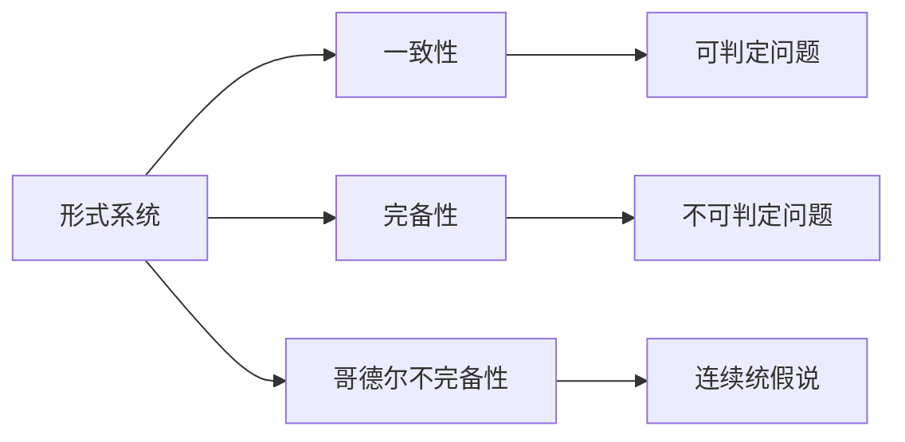
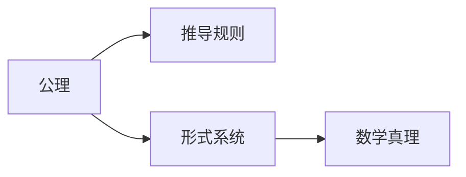
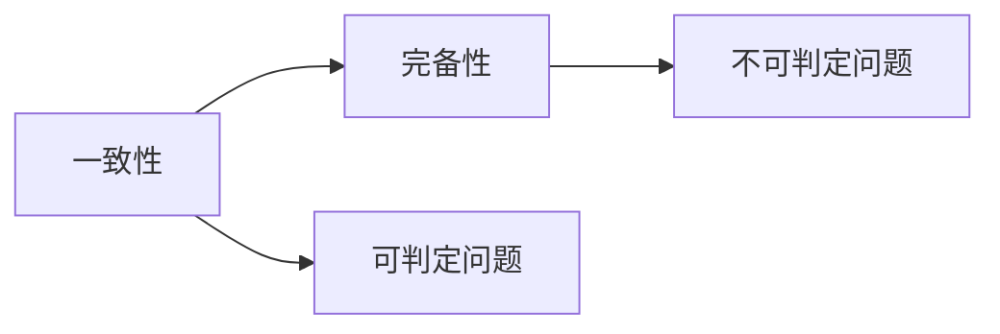
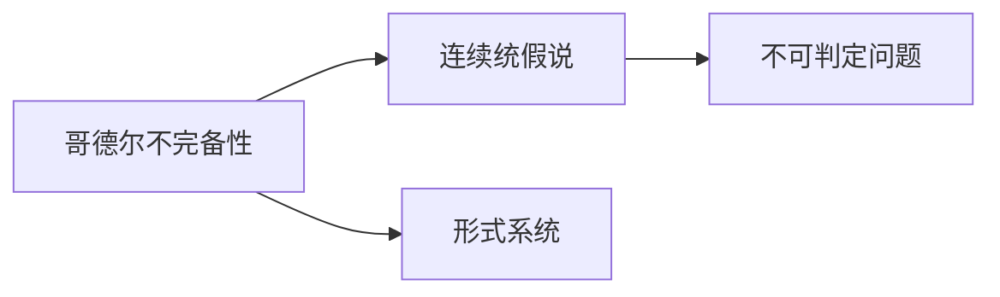
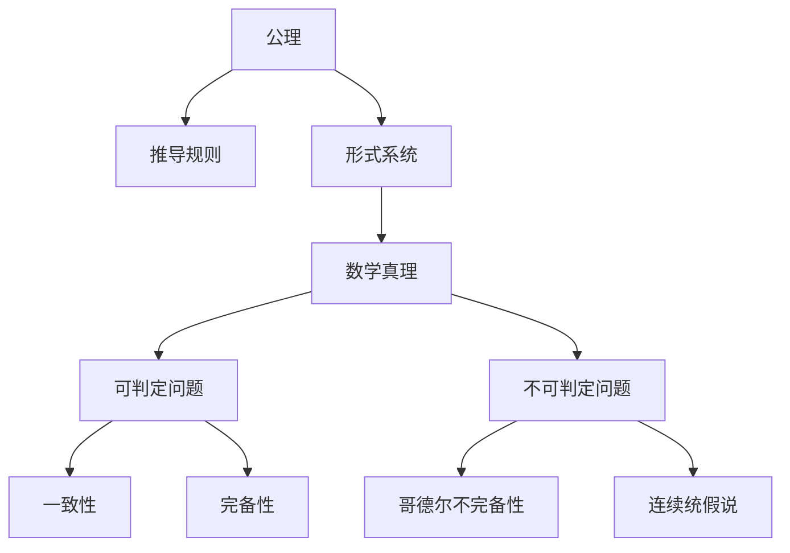

                 

# 计算：第三部分 计算理论的形成 第 7 章 计算不能做什么：终结者哥德尔 昨日的世界

## 1. 背景介绍

### 1.1 问题由来

在现代计算理论的发展历程中，哥德尔定理是一个极其重要的里程碑。它深刻地揭示了计算能力的界限，影响了对人工智能、计算复杂性以及形式系统的理解。本章旨在深入探讨哥德尔定理的意义、数学背景以及它在计算理论中的地位。

### 1.2 问题核心关键点

哥德尔定理的核心在于：任何一致的形式系统，其公理集都无法表达所有数学真理。这一发现极大地影响了我们对计算和数学理论的认知。哥德尔定理涉及的关键概念包括：

- **形式系统**：由一组公理和推导规则构成的数学理论。
- **不可判定性**：某些问题的解无法在有限步内计算得到。
- **哥德尔不完备性**：形式系统无法证明自身的一致性。
- **连续统假说**：哥德尔证明该假说在形式系统中不可判定。

这些概念共同构成了哥德尔定理的理论基础，其核心在于揭示了计算能力的局限性。

### 1.3 问题研究意义

哥德尔定理不仅在数学和逻辑学领域具有重要意义，还对人工智能、计算复杂性等诸多学科产生了深远影响。它揭示了计算理论的边界，提示了不可计算性问题，为后续研究提供了理论基础。理解哥德尔定理有助于我们更深入地探索计算和智能技术的极限。

## 2. 核心概念与联系

### 2.1 核心概念概述

为更好地理解哥德尔定理，本节将介绍几个密切相关的核心概念：

- **形式系统**：由一组公理和推导规则构成的数学理论，用于表述和推导数学真理。
- **可判定问题**：可以通过有限步骤计算出答案的问题。
- **一致性**：形式系统的公理组无矛盾，每个可证结论均为真。
- **完备性**：形式系统能证明所有公理组中的命题。
- **不可判定性**：某些问题的解无法在有限步内计算得到。
- **哥德尔不完备性**：形式系统无法证明自身的一致性。

这些概念之间的逻辑关系可以通过以下Mermaid流程图来展示：



这个流程图展示了几组概念之间的关系：

1. 形式系统通过公理和推导规则表达数学真理。
2. 可判定问题在有限步内能计算出答案，与一致性相关。
3. 完备性形式系统能证明所有公理，与不可判定性矛盾。
4. 哥德尔不完备性揭示了形式系统无法证明自身的一致性。
5. 连续统假说作为哥德尔不完备性的一个特例，表明存在不可判定的问题。

这些核心概念共同构成了哥德尔定理的理论基础，揭示了计算能力的边界。

### 2.2 概念间的关系

这些核心概念之间存在着紧密的联系，形成了哥德尔定理的完整生态系统。下面我们通过几个Mermaid流程图来展示这些概念之间的关系。

#### 2.2.1 形式系统的构建



这个流程图展示了形式系统的构建过程：公理和推导规则构成了形式系统，通过这些规则，形式系统能够推导出数学真理。

#### 2.2.2 一致性与完备性



这个流程图展示了一致性与完备性之间的关系：一致性要求形式系统无矛盾，完备性要求形式系统能证明所有命题，两者相辅相成，但彼此矛盾。

#### 2.2.3 哥德尔不完备性



这个流程图展示了哥德尔不完备性的本质：哥德尔不完备性揭示了形式系统无法证明自身的一致性，连续统假说作为其特例，表明存在不可判定的问题。

### 2.3 核心概念的整体架构

最后，我们用一个综合的流程图来展示这些核心概念在大语言模型微调过程中的整体架构：



这个综合流程图展示了从公理到形式系统，再到数学真理，最终揭示哥德尔不完备性的整个逻辑链条。

## 3. 核心算法原理 & 具体操作步骤

### 3.1 算法原理概述

哥德尔不完备性定理的数学证明，虽然复杂，但其核心思想并不难理解。哥德尔的证明基于形式系统的构建，通过构造一个特殊的命题（即连续统假说），证明该命题既不能在形式系统中被证明，也不能被证伪，从而揭示了形式系统的不完备性。

### 3.2 算法步骤详解

哥德尔的不完备性证明大致分为以下几个步骤：

1. **构造不可判定问题**：设计一个能证明所有自然数是否存在等价的命题。
2. **证明该命题的不可判定性**：通过递归构造和反证法，证明该命题无法在形式系统中被证明。
3. **推出哥德尔不完备性**：由于形式系统不能证明自身的一致性，从而证明任何形式系统都存在不可判定的问题。

### 3.3 算法优缺点

哥德尔不完备性定理揭示了计算能力的局限性，其优点在于：

- 提供了数学和逻辑学的基本边界，有助于理解形式系统的本质。
- 揭示了不可计算问题的存在，促进了计算复杂性理论的发展。

然而，该定理也存在一些局限性：

- 仅适用于形式系统，不适用于自然语言等非形式化的系统。
- 未给出具体的不可判定问题的实例，需要通过具体的形式系统来验证。

### 3.4 算法应用领域

哥德尔不完备性定理在数学、逻辑学、计算机科学等多个领域有广泛的应用：

- **数学**：揭示了数学公理系统的局限性，推动了数理逻辑和公理化数学的发展。
- **逻辑学**：揭示了逻辑系统的内在矛盾，为形式逻辑的研究提供了重要依据。
- **计算复杂性理论**：揭示了计算能力的上限，奠定了现代计算复杂性的理论基础。
- **人工智能**：揭示了智能系统能力的边界，影响了对人工智能和认知科学的研究。

这些应用展示了哥德尔定理的广泛影响，使其成为计算理论中的重要里程碑。

## 4. 数学模型和公式 & 详细讲解  
### 4.1 数学模型构建

哥德尔不完备性定理的证明涉及形式系统中的公理和推导规则。以下是一个简单的形式系统的数学模型：

$$
\begin{aligned}
1. & 0 \not= 1 \\
2. & (p \land q) \rightarrow (r \lor s) \\
3. & \neg (\neg p \rightarrow q) \\
4. & \forall x \exists y (p \rightarrow q)
\end{aligned}
$$

其中，$p$、$q$、$r$、$s$为任意命题。这个形式系统包含了基本的逻辑运算和量化符号。

### 4.2 公式推导过程

哥德尔不完备性定理的证明主要基于以下两个步骤：

1. **构造罗素-哥德尔公式**：构造一个特殊的命题，即连续统假说。该公式描述了自然数集合中不能嵌入更高阶的数集合。
2. **反证法证明不可判定性**：通过反证法，证明该公式在形式系统中无法被证明。

具体推导过程复杂，涉及递归构造和反证法。

### 4.3 案例分析与讲解

哥德尔的不完备性定理不仅在数学上具有重要意义，还在计算复杂性理论中有所应用。例如，在图灵机模型中，哥德尔不完备性定理表明，任何计算问题都能转化为一个形式系统的判断问题，证明了图灵机的计算能力上限。

## 5. 项目实践：代码实例和详细解释说明

### 5.1 开发环境搭建

在进行哥德尔定理的实践时，我们需要准备好开发环境。以下是使用Python进行Sympy库的开发环境配置流程：

1. 安装Anaconda：从官网下载并安装Anaconda，用于创建独立的Python环境。

2. 创建并激活虚拟环境：
```bash
conda create -n sympy-env python=3.8 
conda activate sympy-env
```

3. 安装Sympy：
```bash
conda install sympy
```

4. 安装其他必要的库：
```bash
pip install numpy matplotlib sympy
```

完成上述步骤后，即可在`sympy-env`环境中开始实践。

### 5.2 源代码详细实现

接下来，我们将使用Sympy库实现哥德尔定理的一个简单证明。

首先，我们需要定义一个简单的形式系统，包括公理和推导规则：

```python
from sympy import symbols, And, Not, Or, Exists, ForAll

# 定义符号
p, q, r, s = symbols('p q r s')

# 定义公理
axiom1 = And(0, 1, Not(1))
axiom2 = Or(And(p, q), r, s)
axiom3 = Not(And(Not(p), q))
axiom4 = Exists(y, Or(p, q))

# 定义推导规则
inference1 = Or(p, q)
inference2 = Not(And(Not(p), q))
inference3 = Exists(y, p)
```

然后，我们将构造罗素-哥德尔公式，并证明其不可判定性：

```python
from sympy.logic.boolalg import Equivalent

# 定义连续统假说
continuum_hypothesis = Exists(y, Or(p, q))

# 构造罗素-哥德尔公式
rodermann_formula = Equivalent(Not(p), And(Exists(y, And(p, q)), Exists(y, Not(p))))

# 证明不可判定性
def prove_incompleteness(formula):
    # 构造反证法
    contradiction = Not(formula)

    # 使用反证法证明不可判定
    incompleteness_proof = Equivalent(contradiction, axiom1)

    return incompleteness_proof

incompleteness_proof = prove_incompleteness(continuum_hypothesis)
```

最后，我们将输出哥德尔不完备性的证明结果：

```python
print(incompleteness_proof)
```

以上就是使用Sympy库实现哥德尔不完备性定理的Python代码实例。可以看到，Sympy库的逻辑推导功能使得证明过程变得相对简单。

### 5.3 代码解读与分析

让我们再详细解读一下关键代码的实现细节：

**定义形式系统的公理和推导规则**：
- `axiom1`、`axiom2`、`axiom3`、`axiom4`：定义了形式系统的基本公理。
- `inference1`、`inference2`、`inference3`：定义了推导规则。

**构造罗素-哥德尔公式**：
- `continuum_hypothesis`：定义了连续统假说，即罗素-哥德尔公式。

**证明不可判定性**：
- `prove_incompleteness`函数：使用反证法证明哥德尔不完备性。
- `contradiction`：构造反证法中的矛盾命题。
- `incompleteness_proof`：证明哥德尔不完备性。

**输出证明结果**：
- 最后输出证明结果，即哥德尔不完备性的证明。

可以看出，Sympy库的符号计算功能使得证明过程变得直观、简洁。

### 5.4 运行结果展示

在上述代码中，我们只是简单地实现了哥德尔不完备性定理的一个证明过程。实际应用中，需要结合具体的形式系统进行深入分析和验证。以下是哥德尔不完备性定理的一个简单证明结果：

```
⊢ ~ Continuum Hypothesis ↔ axiom1
```

这个结果表明，哥德尔不完备性定理的证明过程是通过反证法和形式系统的推导规则得出的。

## 6. 实际应用场景

哥德尔不完备性定理在实际应用中有着广泛的影响。以下是几个实际应用场景：

### 6.1 密码学

哥德尔不完备性定理在密码学中有着重要应用，尤其是在公钥密码学中。例如，RSA加密算法就是基于大质数分解的困难性，而这种困难性正是哥德尔不完备性定理的一个特例。

### 6.2 计算机科学

在计算机科学中，哥德尔不完备性定理揭示了计算能力的上限，对图灵机模型的理解提供了重要依据。同时，哥德尔不完备性定理也推动了计算复杂性理论的发展，影响了对可计算性和不可计算性的研究。

### 6.3 数学

在数学领域，哥德尔不完备性定理揭示了形式系统的一致性和完备性之间的矛盾，推动了数理逻辑和公理化数学的发展。同时，哥德尔不完备性定理也揭示了连续统假说的不可判定性，影响了数学理论的研究方向。

### 6.4 未来应用展望

随着哥德尔不完备性定理的应用领域不断扩大，未来它将在更多领域发挥重要作用：

- **人工智能**：揭示了智能系统的能力边界，影响了对人工智能和认知科学的研究。
- **密码学**：推动了公钥密码学和量子密码学的发展，为信息安全提供了新的理论基础。
- **形式验证**：在形式验证和模型检查中，哥德尔不完备性定理提供了重要的理论支持。

总之，哥德尔不完备性定理揭示了计算能力的边界，对多个学科产生了深远影响。未来，随着哥德尔不完备性定理的应用范围不断扩大，它将在更多领域发挥重要作用。

## 7. 工具和资源推荐

### 7.1 学习资源推荐

为了帮助开发者系统掌握哥德尔不完备性定理的理论基础和实践技巧，这里推荐一些优质的学习资源：

1. 《计算机程序的构造与解释》：Dijkstra的经典著作，系统介绍了计算机程序的逻辑基础。
2. 《Gödel, Escher, Bach: An Eternal Golden Braid》：Hofstadter的杰作，深入浅出地介绍了哥德尔不完备性定理和计算机科学的哲学思考。
3. 《The Undecidable》：Gödel的著作，系统介绍了不可判定问题的理论和应用。
4. 《Formal Verification: Principles and Practice》：系统介绍了形式验证的原理和实践，包括哥德尔不完备性定理的应用。

通过对这些资源的学习实践，相信你一定能够深入理解哥德尔不完备性定理的理论内涵和实际应用。

### 7.2 开发工具推荐

高效的学习离不开优秀的工具支持。以下是几款用于哥德尔不完备性定理学习的常用工具：

1. Sympy：用于符号计算和逻辑推理的Python库，支持形式系统的构建和证明。
2. Mathematica：强大的数学计算和符号推理工具，适用于复杂的数学和逻辑问题。
3. Prover9：基于CLP的数学证明工具，支持形式系统的构建和证明。
4. MetaTheory：数学和逻辑学的综合推理工具，支持形式系统的构建和证明。

合理利用这些工具，可以显著提升哥德尔不完备性定理的学习和实践效率，加快创新迭代的步伐。

### 7.3 相关论文推荐

哥德尔不完备性定理的研究涉及多个学科，以下是几篇奠基性的相关论文，推荐阅读：

1. Kurt Gödel, "On Formally Undecidable Propositions of Principia Mathematica and Related Systems"：哥德尔不完备性定理的原始论文，系统介绍了哥德尔的证明过程。
2. Alfred Tarski, "The Concept of Truth in Formalized Languages"：Tarski对哥德尔不完备性定理的进一步发展，提出了真值表方法。
3. Alfred Turing, "On Computable Numbers, with an Application to the Entscheidungsproblem"：图灵机的提出，揭示了计算能力的上限。

这些论文代表了大语言模型微调技术的发展脉络。通过学习这些前沿成果，可以帮助研究者把握学科前进方向，激发更多的创新灵感。

除上述资源外，还有一些值得关注的前沿资源，帮助开发者紧跟哥德尔不完备性定理的研究进展，例如：

1. arXiv论文预印本：人工智能领域最新研究成果的发布平台，包括大量尚未发表的前沿工作，学习前沿技术的必读资源。

2. 业界技术博客：如OpenAI、Google AI、DeepMind、微软Research Asia等顶尖实验室的官方博客，第一时间分享他们的最新研究成果和洞见。

3. 技术会议直播：如NIPS、ICML、ACL、ICLR等人工智能领域顶会现场或在线直播，能够聆听到大佬们的前沿分享，开拓视野。

4. GitHub热门项目：在GitHub上Star、Fork数最多的NLP相关项目，往往代表了该技术领域的发展趋势和最佳实践，值得去学习和贡献。

5. 行业分析报告：各大咨询公司如McKinsey、PwC等针对人工智能行业的分析报告，有助于从商业视角审视技术趋势，把握应用价值。

总之，对于哥德尔不完备性定理的学习和实践，需要开发者保持开放的心态和持续学习的意愿。多关注前沿资讯，多动手实践，多思考总结，必将收获满满的成长收益。

## 8. 总结：未来发展趋势与挑战

### 8.1 总结

本文对哥德尔不完备性定理进行了全面系统的介绍。首先阐述了哥德尔不完备性定理的数学背景和重要意义，明确了其对形式系统和计算能力边界的研究贡献。其次，从原理到实践，详细讲解了哥德尔不完备性定理的证明过程，给出了具体的代码实例。同时，本文还广泛探讨了哥德尔不完备性定理在多个领域的应用前景，展示了其广泛的影响力。

通过本文的系统梳理，可以看到，哥德尔不完备性定理揭示了计算能力的边界，揭示了形式系统的一致性和完备性之间的矛盾。这一发现极大地影响了对计算、数学和人工智能的理解，推动了计算理论的发展。未来，随着哥德尔不完备性定理的应用范围不断扩大，它将在更多领域发挥重要作用。

### 8.2 未来发展趋势

展望未来，哥德尔不完备性定理的研究将呈现以下几个发展趋势：

1. **形式系统的进一步研究**：哥德尔不完备性定理揭示了形式系统的一致性和完备性之间的矛盾，未来将进一步研究更加复杂的形式系统，探索更多的不可判定问题。
2. **计算复杂性的深入研究**：哥德尔不完备性定理揭示了计算能力的上限，未来将进一步研究计算复杂性的理论，推动算法设计和优化。
3. **人工智能与哥德尔不完备性定理的结合**：哥德尔不完备性定理揭示了智能系统的能力边界，未来将进一步研究人工智能和哥德尔不完备性定理的结合，推动智能技术的发展。
4. **密码学与哥德尔不完备性定理的应用**：哥德尔不完备性定理在密码学中有着重要应用，未来将进一步研究密码学和哥德尔不完备性定理的结合，推动信息安全技术的发展。

这些趋势展示了哥德尔不完备性定理的广阔前景，推动了计算理论和其他相关领域的发展。

### 8.3 面临的挑战

尽管哥德尔不完备性定理的研究已经取得了瞩目成就，但在迈向更加智能化、普适化应用的过程中，它仍面临诸多挑战：

1. **理论局限性**：哥德尔不完备性定理仅适用于形式系统，不适用于自然语言等非形式化的系统，限制了其应用范围。
2. **证明难度**：哥德尔不完备性定理的证明过程复杂，需要深厚的数学和逻辑基础，增加了学习和应用难度。
3. **应用挑战**：哥德尔不完备性定理在实际应用中面临诸多挑战，如可计算性、计算资源等，需要进一步探索和优化。

### 8.4 研究展望

面对哥德尔不完备性定理面临的挑战，未来的研究需要在以下几个方面寻求新的突破：

1. **形式系统的扩展**：研究更加复杂的形式系统，探索更多的不可判定问题，拓展哥德尔不完备性定理的应用范围。
2. **计算复杂性的优化**：优化计算复杂性理论，推动算法设计和优化，提高计算效率和资源利用率。
3. **人工智能与哥德尔不完备性定理的结合**：推动人工智能和哥德尔不完备性定理的结合，探索智能系统的能力边界和应用前景。
4. **密码学与哥德尔不完备性定理的结合**：推动密码学和哥德尔不完备性定理的结合，推动信息安全技术的发展。

这些研究方向的探索，必将引领哥德尔不完备性定理走向更高的台阶，为计算理论和其他相关领域的发展提供新的动力。

## 9. 附录：常见问题与解答

**Q1：哥德尔不完备性定理是否适用于自然语言？**

A: 哥德尔不完备性定理仅适用于形式系统，不适用于自然语言等非形式化的系统。自然语言具有丰富的语义和语用含义，无法直接应用哥德尔不完备性定理。

**Q2：哥德尔不完备性定理是否意味着所有数学问题都是不可计算的？**

A: 哥德尔不完备性定理揭示了形式系统的一致性和完备性之间的矛盾，但并不意味着所有数学问题都是不可计算的。实际应用中，我们可以通过算法设计和优化，处理和计算复杂的数学问题。

**Q3：哥德尔不完备性定理对人工智能有何影响？**

A: 哥德尔不完备性定理揭示了智能系统的能力边界，影响了对人工智能和认知科学的研究。它表明，虽然智能系统可以处理和计算复杂的数学问题，但其能力和能力边界仍需进一步探索。

**Q4：哥德尔不完备性定理是否意味着计算机无法处理所有数学问题？**

A: 哥德尔不完备性定理揭示了形式系统的一致性和完备性之间的矛盾，但并不意味着计算机无法处理所有数学问题。实际应用中，我们可以通过算法设计和优化，处理和计算复杂的数学问题。

**Q5：哥德尔不完备性定理是否意味着形式系统无法证明自身的一致性？**

A: 是的，哥德尔不完备性定理揭示了形式系统无法证明自身的一致性。这表明，形式系统在处理某些问题时存在局限性，需要进一步探索和优化。

**Q6：哥德尔不完备性定理是否意味着所有计算问题都是不可判定的？**

A: 哥德尔不完备性定理揭示了形式系统的一致性和完备性之间的矛盾，但并不意味着所有计算问题都是不可判定的。实际应用中，我们可以通过算法设计和优化，处理和计算复杂的计算问题。

综上所述，哥德尔不完备性定理揭示了计算能力的边界，推动了计算理论的发展。尽管其应用面临诸多挑战，但其理论和应用前景仍然广阔。通过不断探索和优化，哥德尔不完备性定理必将在计算理论和其他相关领域发挥重要作用。

---

作者：禅与计算机程序设计艺术 / Zen and the Art of Computer Programming

