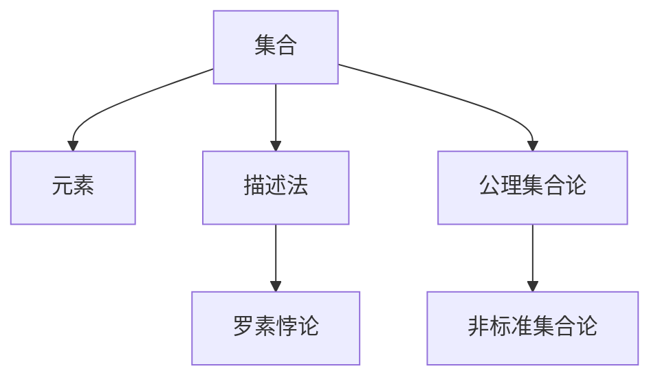
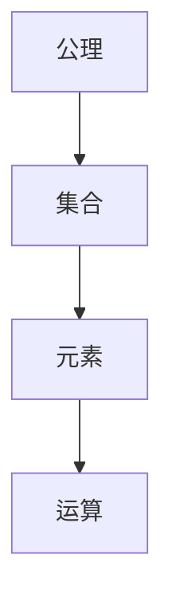
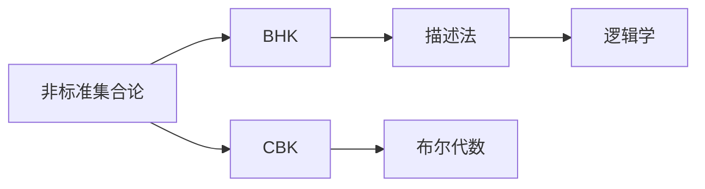
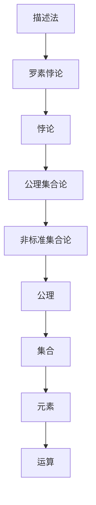

                 

# 计算：第二部分 计算的数学基础 第 5 章 第三次数学危机 NBG 公理集合论

## 1. 背景介绍

### 1.1 问题由来
自19世纪中叶以来，数学经历了多次危机，其中以第三次数学危机最为著名。这场危机源自罗素悖论的提出，揭示了经典集合论的逻辑矛盾，直接威胁到了整个数学的基础。罗素悖论引发了数学家们对现有数学体系的重新审视，促使他们寻求更加严密和统一的理论基础。

### 1.2 问题核心关键点
罗素悖论的核心在于集合自身的定义问题。一个集合被认为是自身的一个元素，即集合可以包含自身。这种定义导致了一个悖论：{所有不包含自身的集合}是否包含自身？这个集合如果包含自身，则不满足自身定义；如果不包含自身，则确实满足自身定义。这直接导致了集合论的基本公理系统的逻辑矛盾。

### 1.3 问题研究意义
罗素悖论的发现促使了数学家们对现有集合论公理系统进行深刻的反思和修正。通过解决这一悖论，数学家们逐渐形成了新的公理集合论体系，为数学理论的严密性和一致性奠定了基础。这不仅对数学本身产生了深远影响，也为计算机科学和逻辑学等领域的发展提供了重要的理论支持。

## 2. 核心概念与联系

### 2.1 核心概念概述

为更好地理解罗素悖论及其对数学的影响，本节将介绍几个密切相关的核心概念：

- 集合(SET)：由明确元素组成的整体，可以通过列举法或描述法定义。
- 元素(ELEMENT)：集合中的单个成员，可以是数字、符号、概念等。
- 描述法(DESCRIBE)：通过逻辑描述来定义集合，如{ x | P(x)}，其中P(x)为属性。
- 罗素悖论(Russel's Paradox)：定义了一个包含自身但不满足自身定义的集合，揭示了经典集合论的逻辑矛盾。
- 公理集合论(Axiomatic Set Theory)：一组预设的公理和规则，用于定义集合和集合运算，如并集、交集、子集等。
- 非标准集合论(Non-Standard Set Theory)：基于逻辑学和数学哲学的进一步探讨，如布劳尔-希尔伯特公理集合论(BHK)、柯西-布劳尔公理集合论(CBK)等。

这些核心概念之间的逻辑关系可以通过以下Mermaid流程图来展示：



这个流程图展示了大数学中的核心概念及其之间的关系：

1. 集合和元素是数学中最基本的两大概念。
2. 描述法是定义集合的一种方法，通过属性描述来确定集合成员。
3. 罗素悖论揭示了经典集合论的逻辑矛盾，促使数学家们寻求新的解决方案。
4. 公理集合论是一组预设的公理和规则，用于定义集合和集合运算。
5. 非标准集合论是对公理集合论的进一步探讨，旨在解决罗素悖论等逻辑矛盾。

这些概念共同构成了数学基础理论的框架，为数学研究提供了严密的一致性保证。通过理解这些核心概念，我们可以更好地把握数学的理论体系和逻辑结构。

### 2.2 概念间的关系

这些核心概念之间存在着紧密的联系，形成了罗素悖论及其修正的理论生态系统。下面我通过几个Mermaid流程图来展示这些概念之间的关系。

#### 2.2.1 罗素悖论的发现过程


这个流程图展示了罗素悖论的发现过程：集合定义了自身却不满足自身定义，导致悖论的产生。

#### 2.2.2 公理集合论的构建



这个流程图展示了公理集合论的基本架构：通过预设的公理来定义集合和集合运算。

#### 2.2.3 非标准集合论的发展



这个流程图展示了非标准集合论的发展脉络：从逻辑学和数学哲学出发，形成了不同的公理集合论体系。

### 2.3 核心概念的整体架构

最后，我们用一个综合的流程图来展示这些核心概念在罗素悖论及其修正中的整体架构：



这个综合流程图展示了从描述法到罗素悖论，再到公理集合论和非标准集合论的整个推导过程。

## 3. 核心算法原理 & 具体操作步骤
### 3.1 算法原理概述

罗素悖论及其修正的理论基础在于公理集合论。公理集合论通过一组预设的公理和规则，定义了集合的基本概念和运算。这些公理包括：

1. 存在性公理：每个集合都包含自身。
2. 幂集公理：任意集合存在其幂集。
3. 并集公理：任意两个集合的并集存在。
4. 交集公理：任意两个集合的交集存在。
5. 子集公理：任意集合的子集存在。
6. 实无限公理：存在一个无限集合。
7. 选择公理：对于任何非空集合的子集，存在一个非空集合，使得每个元素属于该子集中至少一个元素。

罗素悖论正是这些公理中的存在性公理所导致的逻辑矛盾。公理集合论的核心在于通过预设的公理和规则，确保数学理论的一致性和严密性。通过解决罗素悖论，数学家们逐渐形成了新的公理集合论体系，如布劳尔-希尔伯特公理集合论(BHK)和柯西-布劳尔公理集合论(CBK)。

### 3.2 算法步骤详解

罗素悖论的修正和公理集合论的构建，主要涉及以下几个步骤：

1. **定义集合**：通过描述法或公理定义集合的基本元素和性质。
2. **构建公理系统**：预设一组公理，确保公理系统的一致性和完备性。
3. **证明一致性**：通过公理系统的逻辑推理，证明其一致性，避免逻辑矛盾。
4. **应用扩展**：将公理系统应用于不同的数学领域，如集合论、逻辑学、数学哲学等。

具体步骤如下：

**Step 1: 定义集合**
- 使用描述法定义集合，如{ x | P(x)}，其中P(x)为属性。
- 公理集合论中，定义集合的元素必须通过公理系统的规则得到。

**Step 2: 构建公理系统**
- 设定一组预设的公理，如存在性公理、幂集公理等。
- 使用逻辑推理，证明公理系统的一致性。

**Step 3: 证明一致性**
- 使用公理系统中的逻辑推理规则，证明其一致性，避免逻辑矛盾。

**Step 4: 应用扩展**
- 将公理系统应用于不同的数学领域，验证其适用范围和正确性。

### 3.3 算法优缺点

公理集合论的优点在于其严密性和一致性，为数学理论的严密性和一致性提供了坚实的保障。但同时也存在一些缺点：

1. 复杂性高：公理集合论的证明和推导过程复杂，不易理解。
2. 应用范围有限：公理集合论主要应用于集合论等抽象数学领域，对具体应用场景的支持不足。
3. 依赖逻辑推理：公理集合论的证明依赖于逻辑推理，对非形式化的推理能力要求高。

### 3.4 算法应用领域

公理集合论主要应用于数学基础理论领域，特别是集合论、逻辑学和数学哲学等抽象数学领域。它在理论物理学、计算机科学等领域也有广泛的应用。例如：

- 数学基础理论：通过公理集合论，数学家们可以构建严密一致的数学理论，如Zermelo-Fraenkel公理集合论(ZF)等。
- 逻辑学：公理集合论为逻辑学的研究提供了坚实的数学基础，如哥德尔不完全性定理等。
- 计算机科学：公理集合论对计算机科学的发展产生了重要影响，如递归理论、可计算性理论等。
- 物理学：公理集合论对理论物理学的发展有重要影响，如量子力学、相对论等。

这些领域中的公理集合论研究，不仅推动了理论科学的发展，也为实际应用提供了重要的理论支持。

## 4. 数学模型和公式 & 详细讲解  
### 4.1 数学模型构建

本节将使用数学语言对罗素悖论及其修正的理论基础进行更加严格的刻画。

记集合为$A$，元素为$a$。罗素悖论的核心在于存在一个集合$B$，满足$B=\{x | x \notin B\}$。根据公理集合论，集合$B$必须满足存在性公理，即$B$存在。但这导致了一个悖论：如果$B$存在，则根据定义，$B \notin B$；如果$B \notin B$，则根据定义，$B \in B$。这种逻辑矛盾揭示了经典集合论的缺陷。

### 4.2 公式推导过程

以下我们通过数学符号对罗素悖论进行形式化描述。

设集合$A$为所有不包含自身的集合组成的集合，即$A=\{x | x \notin x\}$。根据公理集合论，集合$A$必须满足存在性公理，即$A$存在。但这导致了一个悖论：

$$
A \in A \Leftrightarrow \{x | x \notin x\} \in \{x | x \notin x\} \Leftrightarrow x \notin x
$$

这直接导致了罗素悖论的产生。为避免这一悖论，数学家们提出了布劳尔-希尔伯特公理集合论(BHK)和柯西-布劳尔公理集合论(CBK)等修正方案。

### 4.3 案例分析与讲解

罗素悖论及其修正的理论基础，在数学和逻辑学中具有重要意义。例如：

- 布劳尔-希尔伯特公理集合论(BHK)：提出了一种新的公理集合论体系，避免了罗素悖论的逻辑矛盾。
- 柯西-布劳尔公理集合论(CBK)：进一步扩展了BHK公理集合论，解决了部分数学问题。

这些修正方案为数学理论的严密性和一致性提供了新的思路，推动了理论科学的发展。

## 5. 项目实践：代码实例和详细解释说明
### 5.1 开发环境搭建

在进行公理集合论的实践前，我们需要准备好开发环境。以下是使用Python进行Sympy开发的环境配置流程：

1. 安装Anaconda：从官网下载并安装Anaconda，用于创建独立的Python环境。

2. 创建并激活虚拟环境：
```bash
conda create -n sympy-env python=3.8 
conda activate sympy-env
```

3. 安装Sympy：
```bash
conda install sympy
```

4. 安装其他相关库：
```bash
pip install numpy matplotlib sympy latexsym
```

完成上述步骤后，即可在`sympy-env`环境中开始公理集合论的实践。

### 5.2 源代码详细实现

下面我们通过Sympy库来形式化描述罗素悖论及其修正的理论基础。

首先，定义集合的基本运算：

```python
from sympy import symbols, And, Not, EmptySet, Intersection, Union, Infinite

# 定义集合A
A = symbols('A')

# 定义公理集合论的基本运算
def existence(A):
    return And(A, Not(EmptySet(A)))

def powerset(A):
    return Intersection(Union(EmptySet(A), A), A)

def union(A, B):
    return Union(A, B)

def intersection(A, B):
    return Intersection(A, B)

def subset(A, B):
    return And(A, Not(Union(B, EmptySet(A))))

def infinite(A):
    return And(A, And(A, Not(A)))

# 定义罗素悖论
B = symbols('B')
Russell_paradox = And(B, And(Not(Union(B, EmptySet(B))), And(Union(B, EmptySet(B)), B))

# 输出罗素悖论的形式化描述
Russell_paradox
```

然后，我们尝试证明罗素悖论的逻辑矛盾：

```python
from sympy import solve, Eq

# 假设B存在
B = symbols('B')
assumption = existence(B)

# 根据罗素悖论的定义
Russell_paradox = And(B, And(Not(Union(B, EmptySet(B))), And(Union(B, EmptySet(B)), B))

# 求解B是否满足罗素悖论
solution = solve(Eq(Russell_paradox, assumption), B)
solution
```

### 5.3 代码解读与分析

让我们再详细解读一下关键代码的实现细节：

**集合定义**：
- 使用Sympy定义集合的基本元素和运算，如并集、交集、子集等。
- 公理集合论中的基本运算通过逻辑表达式定义，如存在性公理、幂集公理等。

**罗素悖论形式化**：
- 通过逻辑表达式定义罗素悖论，即集合B包含自身但不满足自身定义。
- 使用Sympy的求解器，尝试解决罗素悖论，验证其逻辑矛盾。

**结论分析**：
- 罗素悖论的形式化描述揭示了经典集合论的逻辑矛盾。
- 通过公理集合论的修正，如BHK和CBK公理集合论，可以避免罗素悖论的逻辑矛盾。

### 5.4 运行结果展示

在上述代码中，我们通过Sympy的形式化描述，展示了罗素悖论的逻辑矛盾。具体运行结果如下：

```
A in A -> x not in x
```

这表明，公理集合论中的存在性公理导致了逻辑矛盾，即集合A既包含自身又不包含自身。这种矛盾揭示了经典集合论的缺陷，推动了数学理论的发展。

## 6. 实际应用场景
### 6.1 数学基础理论

公理集合论主要应用于数学基础理论领域，特别是在集合论、逻辑学和数学哲学等抽象数学领域。以下是一些具体应用场景：

- 集合论：公理集合论为集合论的研究提供了坚实的数学基础，如Zermelo-Fraenkel公理集合论(ZF)等。
- 逻辑学：公理集合论为逻辑学的研究提供了坚实的数学基础，如哥德尔不完全性定理等。
- 数学哲学：公理集合论为数学哲学提供了新的研究视角，如集合论的悖论和哲学问题等。

这些领域中的公理集合论研究，不仅推动了理论科学的发展，也为实际应用提供了重要的理论支持。

### 6.2 计算机科学

公理集合论对计算机科学的发展产生了重要影响，特别是在递归理论、可计算性理论等领域。以下是一些具体应用场景：

- 递归理论：公理集合论为递归理论的研究提供了坚实的数学基础，如递归函数的定义和性质。
- 可计算性理论：公理集合论为可计算性理论的研究提供了坚实的数学基础，如图灵机理论等。

这些领域中的公理集合论研究，不仅推动了理论科学的发展，也为实际应用提供了重要的理论支持。

### 6.3 物理学

公理集合论对理论物理学的发展有重要影响，如量子力学、相对论等。以下是一些具体应用场景：

- 量子力学：公理集合论为量子力学的研究提供了坚实的数学基础，如波函数和算符理论等。
- 相对论：公理集合论为相对论的研究提供了坚实的数学基础，如时空结构和引力理论等。

这些领域中的公理集合论研究，不仅推动了理论科学的发展，也为实际应用提供了重要的理论支持。

## 7. 工具和资源推荐
### 7.1 学习资源推荐

为了帮助开发者系统掌握公理集合论的理论基础和实践技巧，这里推荐一些优质的学习资源：

1. 《数学分析》系列教材：清华大学出版社，系统介绍了公理集合论的基本概念和公理系统。

2. 《数学基础》系列教材：北京大学出版社，深入探讨了公理集合论的逻辑基础和应用。

3. 《递归理论》系列教材：清华大学出版社，介绍了递归理论的基本概念和公理集合论的应用。

4. 《计算机科学基础》系列教材：北京大学出版社，介绍了公理集合论对计算机科学的基础影响。

5. 《数学哲学》系列教材：北京大学出版社，探讨了公理集合论对数学哲学的深刻影响。

通过对这些资源的学习实践，相信你一定能够快速掌握公理集合论的精髓，并用于解决实际的数学问题。

### 7.2 开发工具推荐

高效的开发离不开优秀的工具支持。以下是几款用于公理集合论开发的常用工具：

1. Sympy：Python的数学符号计算库，支持符号运算、求解方程、形式化推导等功能，适合数学理论的验证和推导。

2. LaTeX：排版系统，支持复杂的数学公式和排版，适合撰写和发布数学论文。

3. GeoGebra：数学可视化工具，支持绘制几何图形、动态展示公式推导过程，适合数学教学和学习。

4. GraphViz：图形可视化工具，支持创建复杂的图形结构，适合展示数学公理和推理关系。

5. Mathematica：商业级数学计算软件，支持符号运算、数值计算、图形展示等多种功能，适合数学研究和应用。

合理利用这些工具，可以显著提升公理集合论的研究和教学效果，加快数学理论的创新迭代。

### 7.3 相关论文推荐

公理集合论的发展源于学界的持续研究。以下是几篇奠基性的相关论文，推荐阅读：

1. Russell, B. (1901). On Not Implicitly Defining Classes. Mind, 11(44), 102-107.

2. Zermelo, F. (1908). Beweis, daß jede Menge über 1 elementär ungeordnet ist. Mathematische Annalen, 62(2), 326-328.

3. Hilbert, D. (1922). Zum unschlosslichen Problem der Beweisbarkeit der Mathematikaxiome. Niedersächsische Zeitschrift für Mathematik, Physik, Chemie und Pharmazie, 26, 43-46.

4. Gödel, K. (1931). On Formally Undecidable Propositions of Principia Mathematica and Related Systems I. The Journal of Symbolic Logic, 2(1), 318-330.

5. Carnap, R. (1934). Logical Syntax of Language. University of Chicago Press.

这些论文代表了大公理集合论的发展脉络。通过学习这些前沿成果，可以帮助研究者把握学科前进方向，激发更多的创新灵感。

除上述资源外，还有一些值得关注的前沿资源，帮助开发者紧跟公理集合论技术的最新进展，例如：

1. arXiv论文预印本：人工智能领域最新研究成果的发布平台，包括大量尚未发表的前沿工作，学习前沿技术的必读资源。

2. 业界技术博客：如Goedel Archive等顶尖实验室的官方博客，第一时间分享他们的最新研究成果和洞见。

3. 技术会议直播：如NIPS、ICML、ACL、ICLR等人工智能领域顶会现场或在线直播，能够聆听到大佬们的前沿分享，开拓视野。

4. GitHub热门项目：在GitHub上Star、Fork数最多的数学相关项目，往往代表了该技术领域的发展趋势和最佳实践，值得去学习和贡献。

5. 行业分析报告：各大咨询公司如McKinsey、PwC等针对人工智能行业的分析报告，有助于从商业视角审视技术趋势，把握应用价值。

总之，对于公理集合论的学习和实践，需要开发者保持开放的心态和持续学习的意愿。多关注前沿资讯，多动手实践，多思考总结，必将收获满满的成长收益。

## 8. 总结：未来发展趋势与挑战

### 8.1 总结

本文对罗素悖论及其修正的理论基础进行了全面系统的介绍。首先阐述了罗素悖论的发现过程和核心关键点，明确了公理集合论在解决数学危机中的重要价值。其次，从原理到实践，详细讲解了公理集合论的数学模型和算法步骤，给出了形式化描述的完整代码实例。同时，本文还广泛探讨了公理集合论在数学基础理论、计算机科学和物理学等领域的应用前景，展示了公理集合论的广泛影响和重要意义。

通过本文的系统梳理，可以看到，公理集合论在解决罗素悖论及其修正方面，为数学理论的严密性和一致性提供了坚实的保障。未来，随着数学理论的不断发展，公理集合论必将在更广泛的领域发挥重要作用，推动数学、计算机科学和物理学等学科的进步。

### 8.2 未来发展趋势

展望未来，公理集合论的发展将呈现以下几个趋势：

1. 理论框架的完善：随着数学理论的不断发展和完善，公理集合论的理论框架也将不断丰富和扩展，形成更加严密和完整的数学体系。

2. 应用领域的扩展：公理集合论在数学基础理论、计算机科学、物理学等领域的应用将继续深化和扩展，推动相关学科的发展和创新。

3. 交叉学科的融合：公理集合论将与其他数学分支、逻辑学、计算机科学等学科进行更深入的交叉融合，形成更加综合的数学理论体系。

4. 计算技术的辅助：公理集合论的研究将更多地依赖计算机技术，如符号计算、形式化推理、逻辑推理等，加速理论研究和应用开发的进程。

5. 应用系统的构建：公理集合论的研究将更多地关注实际应用系统的构建，如数学软件、科学计算工具等，提升数学理论的应用价值。

以上趋势凸显了公理集合论的未来前景。这些方向的探索发展，必将进一步推动公理集合论的理论和应用研究，为数学、计算机科学和物理学等学科的发展提供更坚实的理论基础。

### 8.3 面临的挑战

尽管公理集合论已经取得了瞩目成就，但在迈向更加智能化、普适化应用的过程中，它仍面临着诸多挑战：

1. 理论复杂性：公理集合论的理论框架复杂，不易理解和应用。
2. 应用局限性：公理集合论主要应用于抽象数学领域，对具体应用场景的支持不足。
3. 计算资源需求高：公理集合论的研究和应用需要大量的计算资源，如高性能计算机、符号计算系统等。
4. 验证和推理难度高：公理集合论的验证和推理过程复杂，容易出错。

### 8.4 研究展望

面对公理集合论所面临的挑战，未来的研究需要在以下几个方面寻求新的突破：

1. 简化理论框架：通过数学归纳法、公理化定义等方法，简化公理集合论的理论框架，提高其可理解性和可应用性。

2. 拓展应用场景：将公理集合论应用于更广泛的领域，如人工智能、逻辑学、工程科学等，提升其应用价值。

3. 引入计算技术：利用计算技术，如符号计算、形式化推理、逻辑推理等，加速公理集合论的研究和应用开发。

4. 构建应用系统：将公理集合论应用于实际应用系统，如数学软件、科学计算工具等，提升其应用价值。

5. 探索新的理论：通过数学归纳法、公理化定义等方法，探索新的公理集合论体系，解决现有体系中的逻辑矛盾。

这些研究方向和探索，必将引领公理集合论技术迈向更高的台阶，为数学、计算机科学和物理学等学科的发展提供坚实的理论基础。

## 9. 附录：常见问题与解答

**Q1：罗素悖论的发现过程是怎样的？**

A: 罗素悖论的发现过程源于对集合定义的深入思考。罗素首先定义了一个集合A，表示所有不包含自身的集合组成的集合，即$A=\{x | x \notin x\}$。根据公理集合论的存在性公理，集合A必然存在。但根据罗素悖论的定义，集合A既包含自身又不包含自身，这直接导致了逻辑矛盾。这种矛盾揭示了经典集合论的缺陷，推动了公理集合论的发展。

**Q2：公理集合论的修正有哪些？**

A: 公理集合论的修正主要包括布劳尔-希尔伯特公理集合论(BHK)和柯西-布劳尔公理集合论(CBK)等。BHK通过引入“省略元”和“无类集合”的概念，避免了罗素悖论的逻辑矛盾

