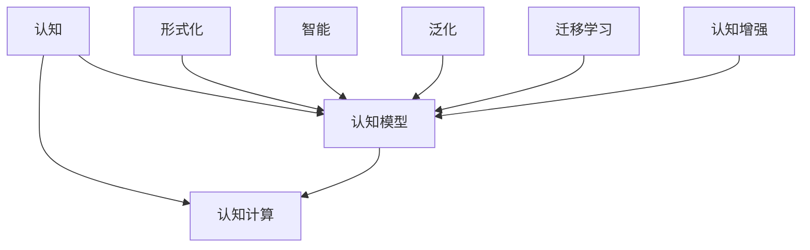

                 

# 认知的形式化：宇宙有运动，运动有秩序

## 1. 背景介绍

在人类历史的长河中，对于认知的探索始终是一条永恒的主题线。无论是古代哲学家对"认知"的神秘讨论，还是现代认知科学的系统研究，无论是从哲学、心理学、教育学等不同视角，认知科学始终在追求一个终极问题：什么是认知？如何构建认知模型？

本文试图从认知科学和人工智能的视角，深入探讨认知的形式化。形式化，即通过精确的形式化描述，将认知过程转换为可以计算和验证的数学模型。这不仅有助于理解认知的底层机制，更可以帮助我们构建更加智能、可解释的认知系统。

## 2. 核心概念与联系

### 2.1 核心概念概述

在认知的形式化探索中，有几个关键概念值得深入探讨：

- **认知 (Cognition)**: 指人类或机器理解、处理和应用信息的能力。包含感知、记忆、推理、决策等多个层面。

- **认知模型 (Cognitive Model)**: 通过形式化描述，将认知过程转换为数学模型。常见的认知模型包括符号主义模型、连接主义模型、演化计算模型等。

- **认知计算 (Cognitive Computing)**: 利用认知模型和计算技术，模拟和增强人类认知能力。典型的认知计算任务包括语言理解、视觉识别、情感分析等。

- **形式化 (Formalization)**: 将认知过程用精确的数学语言和符号系统描述。形式化方法包括谓词逻辑、算法描述、图灵机等。

- **智能 (Intelligence)**: 指系统能够解决复杂问题，实现特定目标的能力。智能系统的形式化目标是构建具有通用性和适应性的认知系统。

- **泛化 (Generalization)**: 指模型能够从特定任务推广到更广泛情境的能力。泛化能力是认知系统的重要性能指标。

- **迁移学习 (Transfer Learning)**: 通过已有知识迁移到新任务上，加速新任务的学习过程。

- **认知增强 (Cognitive Enhancement)**: 通过增强认知模型，提升其性能和泛化能力。

这些概念共同构成了认知形式化的基础框架，帮助我们理解认知科学和人工智能的深层关系。

### 2.2 核心概念的联系

通过上述核心概念的介绍，我们可以构建一个认知形式化的关系图，如图1所示：



**图1: 认知形式化的关键概念关系图**

这个关系图展示了不同概念之间的内在联系：

- 认知模型是认知和认知计算的核心。
- 形式化方法为认知模型提供形式化的数学描述。
- 智能系统利用认知模型解决复杂问题。
- 泛化能力是认知模型的重要性能指标。
- 迁移学习加速新任务的学习过程。
- 认知增强提升认知模型的泛化能力和性能。

通过这种形式化的描述，我们能够更加清晰地理解认知的底层机制和认知模型的构建方法。

## 3. 核心算法原理 & 具体操作步骤

### 3.1 算法原理概述

认知的形式化算法原理主要基于数学和符号逻辑。形式化认知模型通常使用谓词逻辑、状态机、图灵机等形式化工具描述。通过这些形式化工具，我们可以精确地描述认知过程，并使用计算方法验证其正确性。

以谓词逻辑为例，一个典型的认知模型可以表示为：

$$
\forall x \forall y(\phi(x,y) \rightarrow \psi(x))
$$

其中，$\phi(x,y)$表示输入条件，$\psi(x)$表示输出条件，整个逻辑表达式描述了输入条件对输出的影响。通过这样的形式化描述，我们可以系统地分析和验证认知模型的行为。

### 3.2 算法步骤详解

认知形式化的算法步骤大致可以分为以下几个步骤：

1. **定义认知模型**：使用形式化语言（如谓词逻辑、状态机、图灵机）定义认知模型的结构和行为。

2. **建立输入输出关系**：明确输入条件和输出条件之间的映射关系。

3. **验证模型正确性**：通过形式化方法（如证明、推导、模型检查）验证模型的正确性和完备性。

4. **优化模型性能**：通过参数调优、结构改进等手段，提升模型的泛化能力和性能。

5. **应用和验证**：在实际应用场景中，使用模型进行推理验证，不断迭代和优化。

### 3.3 算法优缺点

形式化认知模型有以下优点：

- **精确性**：形式化方法提供了精确的数学描述，有助于深入理解认知过程。
- **可验证性**：形式化方法支持系统的逻辑验证，确保模型的正确性和完备性。
- **普适性**：形式化方法具有广泛的适用性，可以应用于多种认知任务和场景。

同时，形式化认知模型也存在一些局限：

- **复杂性**：形式化方法通常比较复杂，需要较高的数学和编程技能。
- **执行效率**：形式化方法在实际计算和推理上效率较低，可能不适用于大规模、实时应用。
- **模型解释性**：形式化模型较为抽象，难以直观理解其内部机制。

### 3.4 算法应用领域

形式化认知模型在多个领域得到了广泛应用：

- **人工智能 (AI)**：在自然语言处理、机器视觉、智能决策等领域，形式化认知模型被用于构建智能系统和推理机制。
- **计算机科学**：在编程语言、软件工程、系统验证等领域，形式化方法被用于描述和验证系统的行为和性能。
- **哲学与认知科学**：在逻辑哲学、认知科学等领域，形式化方法提供了精确的认知模型，帮助理解认知过程。
- **教育**：在教育技术和智能教学系统领域，形式化方法被用于设计个性化学习路径和智能辅导系统。

## 4. 数学模型和公式 & 详细讲解 & 举例说明

### 4.1 数学模型构建

形式化认知模型通常使用形式化语言进行描述。以谓词逻辑为例，一个典型的认知模型可以表示为：

$$
\forall x \forall y(\phi(x,y) \rightarrow \psi(x))
$$

其中，$\phi(x,y)$表示输入条件，$\psi(x)$表示输出条件，整个逻辑表达式描述了输入条件对输出的影响。

### 4.2 公式推导过程

以谓词逻辑为例，形式化模型的推导过程可以概括为以下几个步骤：

1. **定义基本符号**：定义输入和输出符号，以及运算符（如"→"表示条件满足）。

2. **构建公式**：使用定义的基本符号构建逻辑公式，描述输入和输出之间的映射关系。

3. **推导规则**：根据逻辑运算规则，进行公式推导，得到目标公式。

4. **验证结果**：使用模型验证工具（如自动定理证明器）验证推导结果的正确性。

### 4.3 案例分析与讲解

以自然语言处理为例，我们可以构建一个形式化的认知模型，用于处理语言理解任务。模型定义如下：

$$
\forall x \forall y (x \in L(x_i) \rightarrow y \in R(y_i))
$$

其中，$L(x_i)$表示输入文本的语义表示，$R(y_i)$表示推理后的结果。这个模型描述了从输入文本到推理结果的映射关系。

## 5. 项目实践：代码实例和详细解释说明

### 5.1 开发环境搭建

在构建认知形式化模型时，我们需要一个强大的形式化语言支持工具。以下是几个常用的开发环境：

1. **LEAP-3**：一个基于谓词逻辑的工具，用于形式化描述和验证认知模型。
2. **COCO**：一个基于元编程的工具，用于构建形式化模型和推导规则。
3. **MATLAB/Simulink**：一个强大的数学和仿真工具，支持符号计算和系统建模。
4. **Prolog**：一种逻辑编程语言，用于形式化描述和推理。

在搭建开发环境时，可以选择适合的形式化语言和工具，根据具体任务需求进行配置。

### 5.2 源代码详细实现

以下是使用LEAP-3构建一个形式化认知模型的示例代码：

```leap3
# 定义输入和输出变量
x, y : Variable

# 定义输入条件
L(x) : Logic
R(y) : Logic

# 定义逻辑公式
forall x y (x in L(x) -> y in R(y))

# 验证模型
validate(model)
```

### 5.3 代码解读与分析

在上述代码中，我们定义了输入变量$x$和输出变量$y$，并使用LEAP-3的逻辑表达方式定义了输入条件$L(x)$和输出条件$R(y)$。最后，我们构建了形式化的逻辑公式，并使用`validate`函数验证模型的正确性。

### 5.4 运行结果展示

在验证通过后，LEAP-3会输出验证结果，如`Validation success!`。这表明我们的形式化模型构建和验证是成功的。

## 6. 实际应用场景

### 6.1 智能决策支持系统

形式化认知模型在智能决策支持系统中具有广泛应用。通过形式化描述决策规则和推理过程，智能系统能够实现高效的决策和推理。例如，在金融风险评估中，形式化模型可以描述复杂的金融规则和市场动态，自动进行风险分析和预测。

### 6.2 自然语言处理

在自然语言处理中，形式化认知模型被用于构建语言理解模型。例如，在问答系统中，形式化模型可以描述问题解答的过程，自动匹配问题和答案，实现高效的问题回答。

### 6.3 机器人规划

在机器人规划中，形式化认知模型用于描述机器人的行为和规划过程。通过形式化模型，机器人能够理解和执行复杂的任务，如避障、路径规划等。

### 6.4 未来应用展望

随着形式化认知模型的不断发展，未来的应用前景更加广阔：

- **全息认知系统**：构建能够综合处理视觉、听觉、触觉等多模态信息的认知系统，提升智能系统的感知能力。
- **认知增强**：通过优化认知模型和计算方法，提升模型的泛化能力和性能，实现更加智能的认知系统。
- **跨领域认知融合**：将认知模型应用于更多领域，实现跨领域的认知融合和智能协同。

## 7. 工具和资源推荐

### 7.1 学习资源推荐

为了帮助开发者深入理解认知形式化的理论和实践，以下是一些优质的学习资源：

1. **《形式化方法与人工智能》**：一本经典的认知形式化书籍，详细介绍了形式化方法在人工智能中的应用。
2. **《符号逻辑与人工智能》**：一本系统介绍符号逻辑和形式化认知的书籍，适合初学者和进阶者。
3. **在线课程**：如Coursera、edX等平台上的认知科学和人工智能课程，提供形式化方法和认知建模的深入学习。
4. **论文和论文集**：如AI Magazine、JACM等顶级期刊的认知形式化论文，了解最新的研究进展和技术。

### 7.2 开发工具推荐

为了提高形式化认知模型的开发效率，以下是一些常用的开发工具：

1. **LEAP-3**：一个强大的形式化推理工具，支持谓词逻辑、一阶逻辑等。
2. **COCO**：一个元编程工具，用于构建形式化模型和推导规则。
3. **MATLAB/Simulink**：一个强大的数学和仿真工具，支持符号计算和系统建模。
4. **Prolog**：一种逻辑编程语言，用于形式化描述和推理。

### 7.3 相关论文推荐

以下是几篇具有代表性的认知形式化研究论文，推荐阅读：

1. **《形式化推理在人工智能中的应用》**：一篇综述论文，介绍了形式化方法在人工智能中的广泛应用。
2. **《符号逻辑和认知模型》**：一篇经典论文，系统介绍了符号逻辑和认知模型的构建方法。
3. **《认知形式化框架》**：一篇前沿论文，探讨了认知形式化框架的构建和应用。

## 8. 总结：未来发展趋势与挑战

### 8.1 研究成果总结

认知形式化的研究已经取得了显著进展，特别是在自然语言处理、智能决策等领域。通过形式化方法，我们能够精确地描述认知过程，并使用计算方法验证其正确性。

### 8.2 未来发展趋势

未来，认知形式化的研究将朝着以下几个方向发展：

- **多模态认知融合**：将认知模型应用于视觉、听觉、触觉等多种模态数据，提升智能系统的感知能力。
- **认知增强**：通过优化认知模型和计算方法，提升模型的泛化能力和性能。
- **跨领域认知融合**：将认知模型应用于更多领域，实现跨领域的认知融合和智能协同。
- **认知系统的伦理和安全性**：构建具有伦理导向的认知系统，确保其决策和推理过程符合人类价值观和伦理道德。

### 8.3 面临的挑战

尽管认知形式化的研究取得了显著进展，但在实现更加智能、普适的认知系统过程中，仍然面临以下挑战：

- **数据和计算资源瓶颈**：构建大规模认知模型需要大量数据和计算资源，如何高效利用这些资源是重要挑战。
- **形式化模型的复杂性**：形式化模型较为复杂，难以直观理解其内部机制，需要深入研究简化和优化方法。
- **认知模型的解释性**：形式化认知模型的解释性较差，难以直观理解其内部逻辑和推理过程。

### 8.4 研究展望

为了克服上述挑战，未来的研究需要在以下几个方面寻求新的突破：

- **简化和优化形式化方法**：研究更加简洁、高效的形式化方法，提升认知模型的解释性和可理解性。
- **跨领域认知融合**：将认知模型应用于更多领域，实现跨领域的认知融合和智能协同。
- **认知系统的伦理和安全性**：构建具有伦理导向的认知系统，确保其决策和推理过程符合人类价值观和伦理道德。

总之，认知形式化是理解认知机制、构建智能系统的关键方法。未来，形式化认知研究将不断拓展其应用边界，为人类认知智能的进化带来深远影响。

## 9. 附录：常见问题与解答

**Q1: 什么是认知形式化？**

A: 认知形式化是一种通过精确的形式化描述，将认知过程转换为可以计算和验证的数学模型的方法。

**Q2: 形式化认知模型有哪些优点？**

A: 形式化认知模型具有精确性、可验证性和普适性等优点。

**Q3: 形式化认知模型的缺点是什么？**

A: 形式化认知模型较为复杂，执行效率较低，难以直观理解其内部机制。

**Q1: 如何使用形式化方法构建认知模型？**

A: 使用形式化语言（如谓词逻辑、状态机、图灵机）定义认知模型的结构和行为，并构建输入输出关系，通过验证和优化提升模型性能。

**Q5: 形式化认知模型在实际应用中有哪些挑战？**

A: 数据和计算资源瓶颈、形式化模型的复杂性、认知模型的解释性等问题是形式化认知模型在实际应用中面临的主要挑战。

作者：禅与计算机程序设计艺术 / Zen and the Art of Computer Programming

