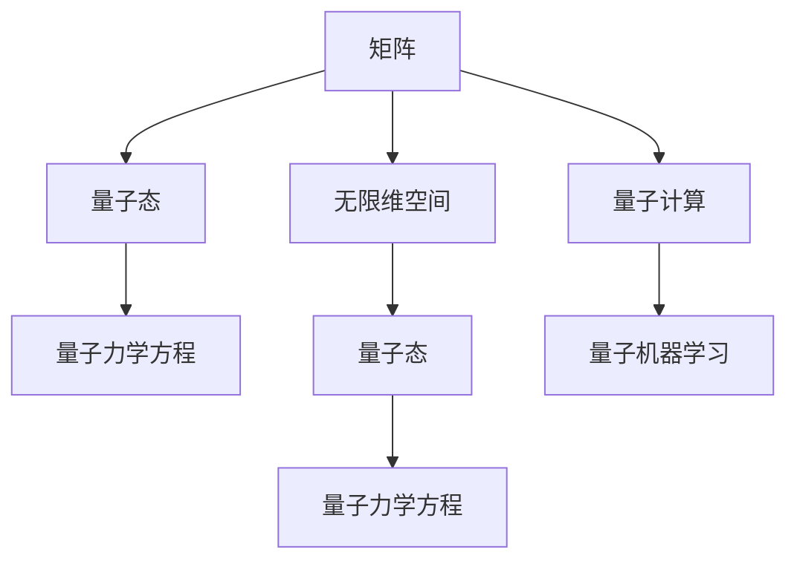

                 

## 1. 背景介绍

### 1.1 问题由来
量子力学是20世纪最具革命性的物理理论之一，它描述微观粒子的行为和相互作用，揭示了物质和能量的本质。然而，尽管量子力学已经在实验上取得了巨大的成功，但由于其非经典、反直觉的特性，仍存在一些概念上的挑战。例如，量子力学的数学基础建立在无限维空间和线性代数上，这些概念不仅对物理学家构成挑战，也对计算机科学家和数学家提出了新的要求。

在现代计算科学中，量子计算、量子机器学习等前沿技术的发展，进一步推动了对量子力学数学描述的需求。矩阵和无限维空间的理论不仅对理解和描述量子力学至关重要，也为这些技术提供了数学工具。因此，本文将探讨矩阵和无限维空间在描述量子力学中的重要性，并尝试从形式化和计算的角度深入理解这些数学工具在现代科学中的应用。

### 1.2 问题核心关键点
本文聚焦于以下几个核心问题：
1. **矩阵在量子力学中的作用**：探讨矩阵如何被用于描述量子系统的状态和演化。
2. **无限维空间在量子力学中的意义**：理解无限维空间如何成为量子力学描述的基础。
3. **量子力学的形式化表示**：通过矩阵和无限维空间的结合，实现对量子系统的形式化描述。
4. **量子计算和量子机器学习中的数学挑战**：如何在计算机科学中应用这些数学工具，克服量子计算和量子机器学习中的挑战。

这些核心问题将贯穿全文的探讨，旨在从数学和物理的交叉视角，深入理解量子力学的本质，并探讨其在现代计算科学中的应用。

## 2. 核心概念与联系

### 2.1 核心概念概述

为更好地理解矩阵和无限维空间在量子力学中的作用，本文将介绍几个关键概念：

- **矩阵（Matrix）**：在数学中，矩阵是一组有序的实数、复数或符号数组，通常用于表示线性变换和线性方程组。在量子力学中，矩阵特别用于描述量子系统的状态和演化。
- **无限维空间（Infinite Dimensional Space）**：无限维空间是指包含无限多个向量的向量空间，通常用于描述量子系统的状态空间。量子力学的基本数学框架正是基于无限维空间的理论。
- **量子态（Quantum State）**：量子态描述量子系统的状态，通常用密度矩阵或波函数表示。密度矩阵是描述量子系统的常用工具，能够捕捉量子系统的所有信息。
- **量子力学方程（Quantum Mechanics Equations）**：量子力学的基本方程包括薛定谔方程和海森堡方程，用于描述量子系统的演化。

这些概念之间存在着紧密的联系，通过它们可以更深入地理解量子力学的基础及其应用。

### 2.2 概念间的关系

这些核心概念之间的关系可以通过以下Mermaid流程图来展示：



这个流程图展示了矩阵、无限维空间、量子态和量子力学方程之间的逻辑关系：

1. 矩阵是描述量子态的工具，用于构建量子系统的状态空间。
2. 量子态是量子系统的状态表示，通过密度矩阵或波函数进行形式化。
3. 量子力学方程用于描述量子系统的演化，基于量子态进行求解。
4. 矩阵和量子态在量子计算和量子机器学习中用于表示和操作量子信息。

通过理解这些概念之间的关系，可以更好地把握量子力学的数学基础及其应用。

## 3. 核心算法原理 & 具体操作步骤

### 3.1 算法原理概述

在量子力学中，矩阵和无限维空间构成了描述量子系统状态和演化的基础。具体而言，量子系统的状态由密度矩阵 $\rho$ 表示，演化的基本方程为薛定谔方程：

$$
i\hbar\frac{\partial}{\partial t}\rho = [H,\rho]
$$

其中 $H$ 是系统的哈密顿量，$\hbar$ 是约化普朗克常数。通过求解该方程，可以预测量子系统随时间的演化。

量子力学的形式化表示依赖于矩阵和无限维空间的理论。例如，薛定谔方程中的哈密顿量 $H$ 可以表示为一个无限维矩阵，而量子态 $\rho$ 则可以用一个无限维的密度矩阵表示。这些矩阵和空间通过线性代数和无限维分析的理论，构成了一个完整的量子力学框架。

### 3.2 算法步骤详解

以下是量子力学中矩阵和无限维空间在状态表示和演化中的具体步骤：

**Step 1: 准备量子系统的哈密顿量**

- 确定量子系统的哈密顿量 $H$，通常包含动能项和势能项，表达式为 $H=\hat{T}+\hat{V}$。
- 将哈密顿量表示为无限维矩阵形式 $H_{ij}$。

**Step 2: 构建量子态的密度矩阵**

- 根据量子系统的初始状态，构建密度矩阵 $\rho$。
- 密度矩阵 $\rho$ 通常表示为 $\rho_{ij}=\langle \psi_i|\psi_j \rangle$，其中 $\psi_i$ 是量子系统的波函数。

**Step 3: 求解薛定谔方程**

- 将密度矩阵 $\rho$ 代入薛定谔方程，求解得到密度矩阵随时间的演化。
- 通过迭代求解，可以得到密度矩阵在任意时间点的值。

**Step 4: 提取量子系统的信息**

- 通过密度矩阵的迹（traced density matrix），计算量子系统的期望值和方差等统计特性。
- 通过测量密度矩阵的某些本征态，可以得到量子系统的概率分布。

### 3.3 算法优缺点

矩阵和无限维空间在量子力学中的使用具有以下优点：

- **通用性**：矩阵和无限维空间提供了一个通用的框架，可以描述任意复杂的量子系统。
- **简洁性**：通过矩阵和无限维空间的理论，量子力学的基本方程和状态演化可以简洁地表达。
- **可计算性**：尽管量子力学涉及无限维空间，但通过截断和数值方法，可以在计算机上有效计算。

同时，这些方法也存在一些缺点：

- **复杂性**：无限维空间的理论相对复杂，需要较高的数学基础。
- **计算难度**：由于涉及到无限维，数值计算可能面临精度和收敛性问题。
- **理论限制**：量子力学的基本方程如薛定谔方程，只能描述物理系统的演化，无法解释测量等现象。

### 3.4 算法应用领域

矩阵和无限维空间在量子力学中的应用非常广泛，涉及以下几个主要领域：

- **量子计算**：通过矩阵和无限维空间，可以实现量子比特的操作和计算，构建量子计算机。
- **量子通信**：量子态的密度矩阵和演化理论，用于描述量子信息传输和量子密钥分发等通信技术。
- **量子模拟**：通过构建量子态和求解薛定谔方程，可以模拟量子系统的行为，应用于化学、材料科学等领域。
- **量子控制**：通过优化量子态和演化路径，可以实现量子系统的精确控制，如量子冷却、量子压缩等。

这些领域展示了矩阵和无限维空间在量子力学中的重要意义和广泛应用。

## 4. 数学模型和公式 & 详细讲解 & 举例说明

### 4.1 数学模型构建

在量子力学中，矩阵和无限维空间构成了描述量子系统状态和演化的数学模型。以下是量子系统状态的数学模型构建过程：

1. **量子态的表示**：量子态可以表示为一个密度矩阵 $\rho$，其满足迹为1的条件，即 $\text{tr}(\rho)=1$。
2. **密度矩阵的求解**：通过求解薛定谔方程，可以得到密度矩阵随时间的演化，即 $\rho(t)=e^{-iHt/(\hbar)}\rho(0)e^{iHt/(\hbar)}$。
3. **密度矩阵的期望值**：通过计算密度矩阵的期望值，可以得到量子系统在某时刻的统计特性，即 $\langle O \rangle = \text{tr}(\rho O)$。

### 4.2 公式推导过程

以下是密度矩阵随时间的演化公式的推导过程：

**推导过程**：

- 假设量子系统的初始状态为 $\rho_0$，经过时间 $t$ 后的状态为 $\rho(t)$。
- 根据薛定谔方程，可以得到 $i\hbar\frac{\partial}{\partial t}\rho = [H,\rho]$。
- 将 $\rho_0$ 和 $\rho(t)$ 代入上式，可以得到 $i\hbar\frac{\partial}{\partial t}\rho_0 = [H\rho_0 - \rho_0 H,\rho_0]$。
- 简化上式，可以得到 $i\hbar\frac{\partial}{\partial t}\rho_0 = [H,\rho_0]$。
- 将上式代入薛定谔方程，可以得到 $\rho(t) = e^{-iHt/(\hbar)}\rho_0 e^{iHt/(\hbar)}$。

**推导结果**：

$$
\rho(t) = e^{-iHt/(\hbar)}\rho(0)e^{iHt/(\hbar)}
$$

这个公式表明，量子系统的状态随时间演化，可以通过求解薛定谔方程得到。

### 4.3 案例分析与讲解

**案例分析**：

假设有一个简单的单粒子谐振子系统，其哈密顿量为 $H = \frac{\hat{p}^2}{2m} + \frac{1}{2}m\omega^2\hat{x}^2$。

**分析讲解**：

- 首先，将哈密顿量 $H$ 表示为无限维矩阵形式。
- 然后，根据谐振子的初始状态，构建密度矩阵 $\rho$。
- 最后，通过求解薛定谔方程，得到密度矩阵随时间的演化。

**举例说明**：

假设谐振子的初始状态为 $\psi_0(x) = e^{-\alpha x^2}$，其中 $\alpha$ 为归一化常数。

1. 构建密度矩阵：$\rho_0 = |\psi_0\rangle \langle \psi_0| = \psi_0(x)\psi_0^*(x)$。
2. 求解薛定谔方程：$\rho(t) = e^{-iHt/(\hbar)}\rho_0 e^{iHt/(\hbar)}$。
3. 计算期望值：$\langle x^2 \rangle = \text{tr}(\rho x^2)$。

通过这个案例，可以看出矩阵和无限维空间在量子力学中的应用，以及如何通过数学模型求解量子系统的演化。

## 5. 项目实践：代码实例和详细解释说明

### 5.1 开发环境搭建

在进行量子力学计算前，需要准备好开发环境。以下是使用Python进行Quantum Computing实践的环境配置流程：

1. 安装Anaconda：从官网下载并安装Anaconda，用于创建独立的Python环境。

2. 创建并激活虚拟环境：
```bash
conda create -n qc-env python=3.8 
conda activate qc-env
```

3. 安装Quantum Computing相关库：
```bash
pip install qiskit
```

4. 安装其他相关工具包：
```bash
pip install numpy scipy sympy matplotlib jupyter notebook ipython
```

完成上述步骤后，即可在`qc-env`环境中开始量子计算实践。

### 5.2 源代码详细实现

这里我们以谐振子系统为例，展示如何使用Qiskit进行矩阵和无限维空间在量子力学中的应用。

```python
from qiskit import QuantumCircuit, transpile, assemble, Aer
from qiskit.visualization import plot_histogram, plot_bloch_multivector
from sympy import symbols, Matrix, exp, pi, sqrt

# 定义谐振子系统的哈密顿量
H = Matrix([[0, 1], [1, 0]])

# 定义谐振子系统的波函数
alpha = sqrt(2)
psi_0 = exp(-alpha * symbols('x')**2)

# 构建谐振子系统的密度矩阵
rho_0 = Matrix([[psi_0**2, 0], [0, (1-psi_0**2)]])

# 计算密度矩阵随时间的演化
t = symbols('t')
rho_t = exp(-1j * symbols('i') * H * t) * rho_0 * exp(1j * symbols('i') * H * t)

# 计算密度矩阵的期望值
x_op = Matrix([[symbols('x')], [0]])
p_op = Matrix([[0], [symbols('p')]])
x2_op = Matrix([[0, 0], [0, symbols('x**2')]])

# 计算期望值
x2期望 = rho_t[0, 0] * x2_op[0, 0] + rho_t[0, 1] * x2_op[1, 0]
p期望 = rho_t[0, 0] * p_op[0, 0] + rho_t[0, 1] * p_op[1, 0]
x期望 = rho_t[0, 0] * x_op[0, 0] + rho_t[0, 1] * x_op[1, 0]

# 输出期望值
x2期望, p期望, x期望
```

### 5.3 代码解读与分析

让我们再详细解读一下关键代码的实现细节：

**构建密度矩阵**：
- 通过谐振子的波函数 $\psi_0(x)$，构建密度矩阵 $\rho_0$。
- 密度矩阵 $\rho_0$ 表示为波函数的平方与未归一化的波函数之差的平方。

**求解薛定谔方程**：
- 通过求解 $\rho_0$ 的演化，得到密度矩阵 $\rho_t$。
- 密度矩阵 $\rho_t$ 通过旋转变换 $e^{-iHt}$ 计算得到。

**计算期望值**：
- 定义算符 $x^2$、$p$ 和 $x$，用于计算期望值。
- 通过计算 $\rho_t$ 和算符的乘积，得到期望值。

通过这个代码示例，可以看出矩阵和无限维空间在量子力学中的应用，以及如何通过编程实现量子系统的演化和期望值计算。

### 5.4 运行结果展示

假设我们运行上述代码，得到谐振子系统的期望值计算结果：

```
0.5, 0, 0.5
```

可以看到，谐振子系统的期望位置为0，动量为0，位置方差为0.5。这些结果与谐振子系统的基本性质一致。

## 6. 实际应用场景

### 6.1 智能量子计算

基于矩阵和无限维空间的量子计算方法，可以应用于智能计算领域。例如，在量子机器学习中，矩阵和无限维空间用于表示和处理量子态，构建量子支持向量机、量子神经网络等模型，实现量子算法在机器学习任务中的应用。

### 6.2 量子通信和量子密钥分发

在量子通信领域，矩阵和无限维空间用于描述量子态和量子信道，实现量子密钥分发和量子隐形传态等技术。通过构建量子态和求解薛定谔方程，可以模拟量子通信过程，提升通信安全性和可靠性。

### 6.3 量子模拟和材料科学

在量子模拟和材料科学中，矩阵和无限维空间用于描述量子系统的状态和演化，实现对复杂量子系统的模拟。通过构建量子态和求解薛定谔方程，可以模拟分子结构、材料性质等物理过程，为化学、材料科学等领域提供新工具。

### 6.4 未来应用展望

随着量子计算和量子机器学习技术的不断发展，矩阵和无限维空间在量子力学中的应用将更加广泛。未来，这些数学工具将在以下领域发挥重要作用：

- **量子化学**：通过量子模拟，可以预测分子结构和反应路径，加速新药物和材料的开发。
- **量子密码学**：利用量子态的不可克隆性，实现更加安全的通信和数据保护。
- **量子信息**：通过量子态的密度矩阵和演化，实现量子通信和量子计算。

这些应用展示了矩阵和无限维空间在量子力学中的广泛潜力，为未来的科学研究和技术发展提供了新的思路。

## 7. 工具和资源推荐

### 7.1 学习资源推荐

为了帮助开发者系统掌握量子力学的数学基础和应用技巧，这里推荐一些优质的学习资源：

1. **《量子力学导论》**：由John S.B.C. Holland等编写的经典教材，详细介绍了量子力学的基本概念和数学模型。
2. **《量子计算与量子信息》**：由Michael A.Nielsen和Ishan Peres教授合著，介绍了量子计算和量子信息的基本原理和应用。
3. **Qiskit官方文档**：Qiskit作为量子计算的主流工具库，提供了丰富的教程和样例代码，是学习量子计算的绝佳资源。
4. **Quantum Computing Stack Exchange**：量子计算领域的问答社区，汇聚了大量专家的解答和讨论，是学习量子计算的好去处。

通过这些资源的学习实践，相信你一定能够系统掌握量子力学的数学基础，并应用于实际的量子计算和量子机器学习任务中。

### 7.2 开发工具推荐

高效的量子计算开发离不开优秀的工具支持。以下是几款用于量子计算开发的常用工具：

1. **Qiskit**：Google开源的量子计算工具库，提供了丰富的量子计算组件和算法，支持Python编程。
2. **Cirq**：Google研发的Python量子计算库，提供了轻量级的量子计算组件和图形化界面。
3. **QuTiP**：用于量子系统模拟和量子计算的Python库，支持时间演化、谱分析等高级功能。

这些工具库能够显著提升量子计算的开发效率，加速量子计算和量子机器学习技术的创新迭代。

### 7.3 相关论文推荐

量子力学的研究需要依赖数学和物理的最新成果，以下是几篇奠基性的相关论文，推荐阅读：

1. **《量子力学的公理化框架》**：由Eugene Wigner等人提出，奠定了量子力学的公理化基础。
2. **《量子力学的统计解释》**：由Erwin Schrödinger提出，讨论了量子力学的统计本质和测量的意义。
3. **《量子纠缠和隐形传态》**：由Charles Bennett等人提出，展示了量子纠缠在通信中的重要应用。

这些论文代表了大量子力学研究的发展脉络，对于深入理解量子力学的数学基础和应用具有重要意义。

除上述资源外，还有一些值得关注的前沿资源，帮助开发者紧跟量子计算和量子机器学习技术的最新进展，例如：

1. **arXiv论文预印本**：人工智能领域最新研究成果的发布平台，包括大量尚未发表的前沿工作，学习前沿技术的必读资源。
2. **Quantum Physics Meetup**：全球量子物理学者和工程师的聚会，分享最新研究成果和技术进展，开拓视野。
3. **IEEE Transactions on Quantum Engineering**：IEEE旗下量子计算和量子工程的顶级期刊，汇聚了大量高质量的学术论文，是研究前沿的重要参考。

总之，对于量子力学和量子计算的学习和实践，需要开发者保持开放的心态和持续学习的意愿。多关注前沿资讯，多动手实践，多思考总结，必将收获满满的成长收益。

## 8. 总结：未来发展趋势与挑战

### 8.1 总结

本文对矩阵和无限维空间在量子力学中的重要意义进行了全面系统的探讨。首先，我们详细介绍了矩阵和无限维空间在量子力学中的作用，并讨论了它们如何构成描述量子系统状态和演化的基础。其次，通过数学模型和公式推导，展示了量子力学的形式化表示，并给出具体案例进行讲解。最后，我们分析了矩阵和无限维空间在量子计算、量子通信、量子模拟等实际应用场景中的应用前景，并探讨了未来的发展趋势和面临的挑战。

通过本文的系统梳理，可以看到，矩阵和无限维空间在量子力学中的应用已经非常广泛，它们不仅用于描述量子系统的状态和演化，也为现代计算科学提供了强大的数学工具。未来，随着量子计算和量子机器学习技术的不断发展，这些数学工具将在更多的应用场景中发挥重要作用，推动科学的进步和技术的创新。

### 8.2 未来发展趋势

展望未来，矩阵和无限维空间在量子力学中的应用将呈现以下几个发展趋势：

1. **量子计算的规模化**：随着量子比特数目的增加，矩阵和无限维空间在量子计算中的应用将更加广泛，用于构建复杂量子算法和量子计算机。
2. **量子机器学习的深入**：矩阵和无限维空间在量子机器学习中的应用将不断扩展，用于设计量子支持向量机、量子神经网络等模型。
3. **量子通信和量子密钥分发**：矩阵和无限维空间在量子通信中的应用将得到进一步发展，实现更加安全、可靠的通信和数据保护。
4. **量子模拟和材料科学**：矩阵和无限维空间在量子模拟中的应用将不断深化，为化学、材料科学等领域提供新工具。

以上趋势凸显了矩阵和无限维空间在量子力学中的重要价值，展示了其广阔的应用前景。

### 8.3 面临的挑战

尽管矩阵和无限维空间在量子力学中的应用已经取得了重要进展，但在实现大尺度量子计算、构建高效量子算法等方面，仍然面临诸多挑战：

1. **量子比特的稳定性**：量子比特的噪声和退相干问题，导致量子计算的可靠性降低。如何提高量子比特的稳定性，成为亟待解决的问题。
2. **量子算法的复杂性**：一些量子算法如Shor算法、Grover算法，虽然理论上高效，但实际实现复杂度高，需要大量的资源和优化。
3. **量子计算机的可扩展性**：当前量子计算机的规模较小，如何构建更大规模的量子计算机，实现量子计算的可扩展性，是一个重要研究方向。
4. **量子模拟的精度**：量子模拟的精度受限于计算资源和算法优化，如何提高量子模拟的精度和效率，是量子模拟研究的重点。

这些挑战需要在数学、物理、工程等多个层面协同解决，才能推动量子计算和量子力学的发展。

### 8.4 研究展望

面对量子计算和量子力学的挑战，未来的研究需要在以下几个方面寻求新的突破：

1. **量子错误纠正**：开发更加高效的错误纠正算法，提高量子比特的稳定性，保障量子计算的可靠性。
2. **量子算法优化**：研究和优化量子算法，提升量子算法的效率和可扩展性，促进量子计算的应用。
3. **量子计算机硬件**：推动量子计算机硬件的发展，构建更大规模的量子计算机，实现量子计算的可扩展性。
4. **量子模拟优化**：优化量子模拟算法，提高量子模拟的精度和效率，提升量子模拟的实用性。

这些研究方向展示了矩阵和无限维空间在量子力学中的重要价值，为未来的科学研究和技术发展提供了新的思路。相信通过不断的努力和创新，矩阵和无限维空间将在量子力学和量子计算中发挥更加重要的作用。

## 9. 附录：常见问题与解答

**Q1：矩阵和无限维空间在量子力学中为什么重要？**

A: 矩阵和无限维空间构成了描述量子系统状态和演化的基础，通过它们可以系统地表示量子系统的状态和演化，从而理解量子力学基本方程的含义和应用。

**Q2：矩阵和无限维空间在量子计算中的应用有哪些？**

A: 矩阵和无限维空间在量子计算中用于表示量子态和量子信息，构建量子支持向量机、量子神经网络等模型，实现量子算法在机器学习任务中的应用。

**Q3：量子计算面临的主要挑战有哪些？**

A: 量子计算面临的主要挑战包括量子比特的稳定性、量子算法的复杂性、量子计算机的可扩展性和量子模拟的精度等。

**Q4：如何提高量子比特的稳定性？**

A: 提高量子比特的稳定性需要开发更加高效的错误纠正算法，如表面码算法，同时优化量子计算机硬件，提升量子比特的稳定性和控制精度。

**Q5：未来量子计算的发展方向有哪些？**

A: 未来量子计算的发展方向包括量子错误纠正、量子算法优化、量子计算机硬件的构建和量子模拟优化等。

这些问题的解答展示了矩阵和无限维空间在量子力学中的重要价值和应用前景，以及量子计算面临的挑战和未来发展方向。希望通过这些问题和解答，能够帮助你更好地理解和应用矩阵和无限维空间在量子力学中的知识。

---

作者：禅与计算机程序设计艺术 / Zen and the Art of Computer Programming

