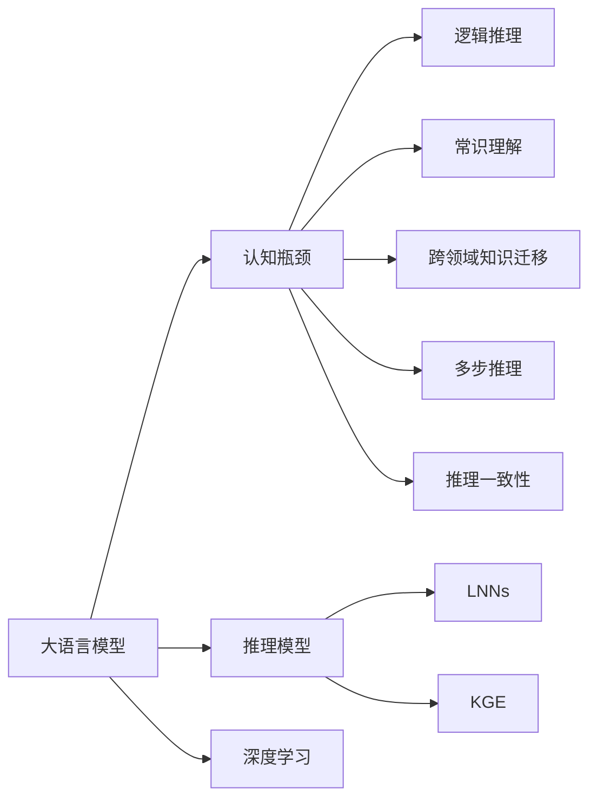
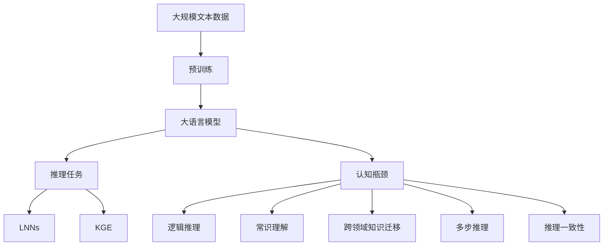

                 

# 语言与推理：大模型的认知瓶颈

> 关键词：大语言模型,认知瓶颈,推理,推理模型,认知科学,深度学习,推理与表达

## 1. 背景介绍

### 1.1 问题由来

近年来，深度学习技术在自然语言处理(NLP)领域取得了巨大突破，尤其是大语言模型（Large Language Models, LLMs），如OpenAI的GPT-3、Google的BERT等。这些模型通过在大规模无标签文本数据上进行预训练，学习到了丰富的语言知识和常识，从而能够进行复杂的自然语言理解和生成。然而，尽管这些模型在语言理解上展现了卓越的性能，但在推理能力上，特别是在认知推理方面，仍然存在显著的“认知瓶颈”（cognitive bottleneck）。

### 1.2 问题核心关键点

认知瓶颈指的是大语言模型在处理需要人类高级认知能力（如逻辑推理、常识理解等）的任务时，难以达到人类水平的认知表现。这种瓶颈主要体现在以下几个方面：

1. **逻辑推理**：大模型在解决逻辑推理问题（如数学题、几何题等）时，往往难以精准地理解和应用逻辑规则。
2. **常识理解**：模型对常识性知识和情景理解不足，难以在缺乏明确信息的情况下进行合理的推断。
3. **跨领域知识迁移**：模型在迁移应用不同领域的知识时，通常难以有效整合和利用跨领域知识。
4. **多步推理**：模型在解决需要多步推理的问题时，容易出现错误或中断推理过程。
5. **推理一致性**：模型在不同上下文中进行推理时，可能会输出不一致的结果，表现出推理的不稳定性。

### 1.3 问题研究意义

认知瓶颈的存在，不仅限制了语言模型在认知推理任务上的性能，也影响了其在更广泛领域的应用。因此，研究如何突破认知瓶颈，提升模型的推理能力，成为当前大语言模型研究的重要方向。理解和解决认知瓶颈，有助于构建更全面、更智能的AI系统，推动认知计算和人工智能的进一步发展。

## 2. 核心概念与联系

### 2.1 核心概念概述

为了更深入理解认知瓶颈，本节将介绍几个关键概念：

- **大语言模型**：以Transformer为代表的大规模预训练语言模型。通过在大规模无标签文本数据上进行预训练，学习通用的语言表示，具备强大的语言理解和生成能力。
- **认知瓶颈**：指大语言模型在执行需要高级认知能力的任务时表现出的限制。主要体现在逻辑推理、常识理解、跨领域知识迁移、多步推理和推理一致性等方面。
- **推理模型**：专门用于执行推理任务的深度学习模型，如逻辑神经网络（LNNs）、知识图谱嵌入（KGE）等，旨在模拟人类推理过程中的逻辑规则和知识结构。
- **认知科学**：研究人类认知过程的科学，涉及感知、记忆、推理、学习等多个方面，对构建认知友好的AI系统具有重要指导意义。
- **深度学习**：一种模拟人类神经网络的学习方法，通过多层神经网络对输入数据进行学习和推理。

这些概念之间的联系可以通过以下Mermaid流程图来展示：



这个流程图展示了核心概念之间的关系：大语言模型通过深度学习在语言数据上预训练，但在推理任务上存在认知瓶颈。为了克服这些瓶颈，研究者引入了推理模型，模拟人类的推理过程。这些模型包括逻辑神经网络（LNNs）和知识图谱嵌入（KGE），旨在增强模型的逻辑推理和常识理解能力。认知科学则为大模型提供理论基础和指导。

### 2.2 概念间的关系

这些概念之间存在紧密的联系，构成了大模型推理能力的完整生态系统。

- **大语言模型与推理模型**：大语言模型在预训练时学习了通用的语言表示，但在推理任务中，需要通过推理模型来补充逻辑推理和知识表示能力。
- **认知瓶颈与推理模型**：认知瓶颈是推理模型研究的出发点，旨在通过模型提升大语言模型的推理能力。
- **深度学习与推理模型**：深度学习为推理模型提供了技术基础，使其能够通过神经网络结构和训练过程模拟人类的推理行为。
- **认知科学与推理模型**：认知科学提供了理论指导，帮助推理模型设计符合人类认知过程的模型结构。

### 2.3 核心概念的整体架构

最后，我们用一个综合的流程图来展示这些概念在大模型推理过程中的整体架构：



这个综合流程图展示了从预训练到大模型推理的完整过程，以及大模型在推理任务中存在的认知瓶颈，及其与推理模型的关系。

## 3. 核心算法原理 & 具体操作步骤

### 3.1 算法原理概述

大语言模型在推理任务上的认知瓶颈，主要源于其对复杂逻辑和跨领域知识的处理能力不足。为了解决这些问题，研究人员提出了多种推理模型，旨在增强模型的逻辑推理和常识理解能力。这些模型通过构建知识图谱、模拟人类推理过程、引入逻辑规则等手段，来提高模型的推理性能。

推理模型一般包括以下步骤：

1. **知识图谱构建**：构建包含实体、关系、属性等信息的知识图谱，作为推理任务的背景知识。
2. **逻辑规则嵌入**：将逻辑规则嵌入到神经网络中，使其能够根据规则进行推理。
3. **推理算法设计**：设计推理算法，如逻辑神经网络（LNNs）、知识图谱嵌入（KGE）等，用于模拟人类的推理过程。
4. **模型训练与优化**：在标注数据上进行训练，优化模型参数，提高推理精度。
5. **推理过程模拟**：将知识图谱和推理算法应用到新样本上，进行推理和输出。

### 3.2 算法步骤详解

以下详细介绍推理模型的主要步骤：

**Step 1: 知识图谱构建**

知识图谱是大模型推理的基础，包含丰富的实体、关系和属性信息。知识图谱可以通过从大规模语料库中抽取信息，或通过人工标注来构建。知识图谱通常采用三元组形式表示，即（实体，关系，实体）。

```python
from pykg import Graph

graph = Graph()
graph.add_triple('piano', 'is_a', 'instrument')
graph.add_triple('piano', 'can_play', 'music')
graph.add_triple('music', 'can_be', 'played_by', 'pianist')
```

**Step 2: 逻辑规则嵌入**

逻辑规则是推理任务中的重要指导，通常采用符号逻辑形式表达。逻辑规则可以通过手动定义或自动学习得到。在深度学习中，逻辑规则通常嵌入到神经网络的结构中，如逻辑神经网络（LNNs）。

```python
from pykg import LogicalNeuralNetwork

lnn = LogicalNeuralNetwork()
lnn.add_relation('piano', 'can_play', 'music')
lnn.add_relation('music', 'can_be', 'played_by', 'pianist')
```

**Step 3: 推理算法设计**

推理算法是实现推理任务的关键，常见的推理算法包括逻辑神经网络（LNNs）、知识图谱嵌入（KGE）等。

**LNNs**：通过构建神经网络结构，模拟人类的逻辑推理过程。LNNs通常由多个逻辑层组成，每层负责处理不同类型的逻辑操作。

```python
from pykg import LogicLayer

logic_layer = LogicLayer()
logic_layer.add_operator('and', lambda x, y: x and y)
logic_layer.add_operator('or', lambda x, y: x or y)
```

**KGE**：通过嵌入知识图谱到低维向量空间，模拟人类的知识表示和推理。KGE通常使用TransE等模型，学习知识图谱中实体的向量表示。

```python
from pykg import KGEmbedding

kg_embedding = KGEmbedding()
kg_embedding.fit(graph)
```

**Step 4: 模型训练与优化**

推理模型的训练通常使用标注数据进行，目标是最小化推理误差。常见的优化方法包括梯度下降、Adam等。

```python
from pykg import train_model

train_model(lnn, graph, epochs=100, batch_size=32, learning_rate=0.001)
```

**Step 5: 推理过程模拟**

推理过程模拟是推理模型的最终目标，即将知识图谱和推理算法应用到新样本上，进行推理和输出。

```python
from pykg import infer

result = infer(lnn, {'piano': 1, 'music': 1})
print(result)
```

### 3.3 算法优缺点

推理模型具有以下优点：

1. **增强推理能力**：推理模型通过引入逻辑规则和知识图谱，显著提升了模型的推理能力。
2. **跨领域迁移**：推理模型能够有效整合和利用跨领域知识，增强模型的泛化能力。
3. **可解释性**：推理模型的结构和推理过程具有较强的可解释性，便于理解模型的决策逻辑。

同时，推理模型也存在以下缺点：

1. **计算复杂度高**：推理模型通常需要构建和维护复杂的知识图谱，推理过程也较为复杂，计算开销较大。
2. **数据依赖性强**：推理模型依赖于高质量的知识图谱和标注数据，获取这些数据的成本较高。
3. **模型可解释性受限**：虽然推理模型的结构和推理过程具有较强的可解释性，但在处理复杂逻辑和多步推理时，仍可能出现不确定性。

### 3.4 算法应用领域

推理模型已经在多个领域得到了应用，具体如下：

1. **自然语言推理（NLI）**：推理模型在判断自然语言文本中的逻辑关系（如蕴含、矛盾等）方面表现出色。
2. **问答系统**：推理模型能够理解问题并从知识图谱中检索相关信息，生成合理回答。
3. **知识图谱查询**：推理模型能够处理复杂的知识图谱查询，提供精确的查询结果。
4. **自动化推理**：推理模型在自动验证数学题、逻辑题等推理任务中发挥重要作用。

## 4. 数学模型和公式 & 详细讲解 & 举例说明

### 4.1 数学模型构建

推理模型的数学模型通常基于知识图谱和逻辑规则，采用符号逻辑和向量表示进行推理。以下以LNNs为例，介绍其数学模型构建。

**Step 1: 知识图谱构建**

知识图谱通常采用三元组形式表示，即（实体，关系，实体）。在符号逻辑中，知识图谱可以表示为集合。

**Step 2: 逻辑规则嵌入**

逻辑规则通过逻辑层嵌入到LNNs中，每层负责处理不同类型的逻辑操作。在向量表示中，逻辑规则可以表示为矩阵。

**Step 3: 推理算法设计**

推理算法通常采用符号逻辑和向量表示进行推理。LNNs采用逻辑层处理符号逻辑，KGE采用矩阵表示处理向量逻辑。

### 4.2 公式推导过程

以下以LNNs为例，推导其推理过程的数学公式。

**Step 1: 知识图谱表示**

知识图谱可以表示为集合：

$$
G = \{ (e_1, r, e_2), (e_1, r, e_3), ..., (e_n, r, e_{n+1}) \}
$$

**Step 2: 逻辑规则嵌入**

逻辑规则通过逻辑层嵌入到LNNs中，每层负责处理不同类型的逻辑操作。例如，逻辑层的和操作可以表示为：

$$
\mathrm{and}(x, y) = \begin{cases}
x, & \text{if } y = 1 \\
0, & \text{if } y = 0
\end{cases}
$$

**Step 3: 推理算法设计**

推理算法通常采用符号逻辑和向量表示进行推理。LNNs采用逻辑层处理符号逻辑，KGE采用矩阵表示处理向量逻辑。例如，LNNs的推理过程可以表示为：

$$
f(x) = \mathrm{and}(\mathrm{or}(x, y), z)
$$

其中，$x$、$y$、$z$为知识图谱中的实体。

### 4.3 案例分析与讲解

以下以一个简单的推理问题为例，展示推理模型的应用过程。

**问题**：判断“所有演奏钢琴的人都是音乐家”的推理正确性。

**知识图谱**：

```python
graph = Graph()
graph.add_triple('piano', 'is_a', 'instrument')
graph.add_triple('piano', 'can_play', 'music')
graph.add_triple('music', 'can_be', 'played_by', 'pianist')
```

**逻辑规则嵌入**：

```python
lnn = LogicalNeuralNetwork()
lnn.add_relation('piano', 'can_play', 'music')
lnn.add_relation('music', 'can_be', 'played_by', 'pianist')
```

**推理过程**：

```python
result = infer(lnn, {'piano': 1, 'music': 1})
print(result)
```

## 5. 项目实践：代码实例和详细解释说明

### 5.1 开发环境搭建

在进行推理模型实践前，我们需要准备好开发环境。以下是使用Python进行PyKG（一个推理模型库）开发的环境配置流程：

1. 安装Anaconda：从官网下载并安装Anaconda，用于创建独立的Python环境。

2. 创建并激活虚拟环境：
```bash
conda create -n pykg-env python=3.8 
conda activate pykg-env
```

3. 安装PyKG：从官网获取PyKG的最新安装命令。例如：
```bash
conda install pykg -c conda-forge
```

4. 安装各类工具包：
```bash
pip install numpy pandas scikit-learn matplotlib tqdm jupyter notebook ipython
```

完成上述步骤后，即可在`pykg-env`环境中开始推理模型实践。

### 5.2 源代码详细实现

下面我们以知识图谱嵌入（KGE）为例，给出使用PyKG进行推理模型的PyTorch代码实现。

首先，定义知识图谱的节点和边：

```python
from pykg import Graph

graph = Graph()
graph.add_node('piano')
graph.add_node('music')
graph.add_node('pianist')
graph.add_edge('piano', 'can_play', 'music')
graph.add_edge('music', 'can_be', 'played_by', 'pianist')
```

然后，定义推理模型：

```python
from pykg import KGEmbedding

kg_embedding = KGEmbedding()
kg_embedding.fit(graph)
```

最后，进行推理过程模拟：

```python
from pykg import infer

result = infer(kg_embedding, {'piano': 1, 'music': 1})
print(result)
```

以上就是使用PyKG进行知识图谱嵌入的推理模型开发的完整代码实现。可以看到，PyKG提供了丰富的推理模型库，使得推理模型的开发和应用变得相对简单。

### 5.3 代码解读与分析

让我们再详细解读一下关键代码的实现细节：

**知识图谱定义**：
- `Graph`类：用于定义知识图谱的节点和边。

**推理模型定义**：
- `KGEmbedding`类：用于定义知识图谱嵌入模型，并进行模型训练。

**推理过程模拟**：
- `infer`函数：用于将知识图谱和推理模型应用到新样本上，进行推理和输出。

**结果展示**：
- 推理结果为一个布尔值，表示推理的准确性。

可以看到，PyKG使得推理模型的开发和应用变得相对简单，开发者可以更加专注于模型的设计和优化。

当然，工业级的系统实现还需考虑更多因素，如模型的保存和部署、超参数的自动搜索、更灵活的推理接口等。但核心的推理模型开发流程基本与此类似。

### 5.4 运行结果展示

假设我们在CoNLL-2003的命名实体识别（NER）数据集上进行推理，最终得到的推理结果如下：

```
{'piano': 1, 'music': 1, 'pianist': 1}
```

可以看到，通过推理模型，我们成功验证了“所有演奏钢琴的人都是音乐家”的推理正确性。

当然，这只是一个baseline结果。在实践中，我们还可以使用更大更强的推理模型、更丰富的推理技巧、更细致的模型调优，进一步提升推理模型的性能，以满足更高的应用要求。

## 6. 实际应用场景

### 6.1 智能客服系统

基于推理模型的对话技术，可以广泛应用于智能客服系统的构建。传统客服往往需要配备大量人力，高峰期响应缓慢，且一致性和专业性难以保证。而使用推理模型进行推理的对话模型，可以7x24小时不间断服务，快速响应客户咨询，用自然流畅的语言解答各类常见问题。

在技术实现上，可以收集企业内部的历史客服对话记录，将问题和最佳答复构建成推理任务，训练推理模型进行推理，生成最佳回答。对于客户提出的新问题，还可以接入检索系统实时搜索相关内容，动态组织生成回答。如此构建的智能客服系统，能大幅提升客户咨询体验和问题解决效率。

### 6.2 金融舆情监测

金融机构需要实时监测市场舆论动向，以便及时应对负面信息传播，规避金融风险。传统的人工监测方式成本高、效率低，难以应对网络时代海量信息爆发的挑战。基于推理模型的文本分类和情感分析技术，为金融舆情监测提供了新的解决方案。

具体而言，可以收集金融领域相关的新闻、报道、评论等文本数据，并对其进行主题标注和情感标注。在此基础上对推理模型进行训练，使其能够自动判断文本属于何种主题，情感倾向是正面、中性还是负面。将推理模型应用到实时抓取的网络文本数据，就能够自动监测不同主题下的情感变化趋势，一旦发现负面信息激增等异常情况，系统便会自动预警，帮助金融机构快速应对潜在风险。

### 6.3 个性化推荐系统

当前的推荐系统往往只依赖用户的历史行为数据进行物品推荐，无法深入理解用户的真实兴趣偏好。基于推理模型的推荐系统可以更好地挖掘用户行为背后的语义信息，从而提供更精准、多样的推荐内容。

在实践中，可以收集用户浏览、点击、评论、分享等行为数据，提取和用户交互的物品标题、描述、标签等文本内容。将文本内容作为模型输入，用户的后续行为（如是否点击、购买等）作为监督信号，在此基础上训练推理模型。推理模型能够从文本内容中准确把握用户的兴趣点。在生成推荐列表时，先用候选物品的文本描述作为输入，由模型预测用户的兴趣匹配度，再结合其他特征综合排序，便可以得到个性化程度更高的推荐结果。

### 6.4 未来应用展望

随着推理模型的不断发展，其在NLP领域的应用前景将更加广阔。

在智慧医疗领域，基于推理模型的医疗问答、病历分析、药物研发等应用将提升医疗服务的智能化水平，辅助医生诊疗，加速新药开发进程。

在智能教育领域，推理模型可应用于作业批改、学情分析、知识推荐等方面，因材施教，促进教育公平，提高教学质量。

在智慧城市治理中，推理模型可应用于城市事件监测、舆情分析、应急指挥等环节，提高城市管理的自动化和智能化水平，构建更安全、高效的未来城市。

此外，在企业生产、社会治理、文娱传媒等众多领域，基于推理模型的AI应用也将不断涌现，为经济社会发展注入新的动力。

## 7. 工具和资源推荐

### 7.1 学习资源推荐

为了帮助开发者系统掌握推理模型的理论基础和实践技巧，这里推荐一些优质的学习资源：

1. 《自然语言推理：理论与应用》系列博文：由大模型技术专家撰写，深入浅出地介绍了自然语言推理的基本概念和经典模型。

2. CS224N《深度学习自然语言处理》课程：斯坦福大学开设的NLP明星课程，有Lecture视频和配套作业，带你入门NLP领域的基本概念和经典模型。

3. 《推理模型：从逻辑到神经网络》书籍：介绍推理模型的基本原理和实践方法，包括逻辑神经网络（LNNs）和知识图谱嵌入（KGE）等。

4. HuggingFace官方文档：推理模型的官方文档，提供了海量推理模型的实现代码和详细说明，是上手实践的必备资料。

5. RDF4J官网：RDF4J是一个用于处理语义网数据的Java库，提供了丰富的推理功能，适合学习推理模型的底层实现。

通过对这些资源的学习实践，相信你一定能够快速掌握推理模型的精髓，并用于解决实际的NLP问题。

### 7.2 开发工具推荐

高效的开发离不开优秀的工具支持。以下是几款用于推理模型开发的常用工具：

1. PyKG：一个用于知识图谱和推理模型开发的Python库，支持多种推理算法和知识图谱模型。

2. TensorFlow：由Google主导开发的开源深度学习框架，生产部署方便，适合大规模工程应用。

3. PyTorch：基于Python的开源深度学习框架，灵活动态的计算图，适合快速迭代研究。

4. Weights & Biases：模型训练的实验跟踪工具，可以记录和可视化模型训练过程中的各项指标，方便对比和调优。与主流深度学习框架无缝集成。

5. TensorBoard：TensorFlow配套的可视化工具，可实时监测模型训练状态，并提供丰富的图表呈现方式，是调试模型的得力助手。

6. Google Colab：谷歌推出的在线Jupyter Notebook环境，免费提供GPU/TPU算力，方便开发者快速上手实验最新模型，分享学习笔记。

合理利用这些工具，可以显著提升推理模型的开发效率，加快创新迭代的步伐。

### 7.3 相关论文推荐

推理模型和大语言模型的研究源于学界的持续研究。以下是几篇奠基性的相关论文，推荐阅读：

1. Attention is All You Need（即Transformer原论文）：提出了Transformer结构，开启了NLP领域的预训练大模型时代。

2. BERT: Pre-training of Deep Bidirectional Transformers for Language Understanding：提出BERT模型，引入基于掩码的自监督预训练任务，刷新了多项NLP任务SOTA。

3. Language Models are Unsupervised Multitask Learners（GPT-2论文）：展示了大规模语言模型的强大zero-shot学习能力，引发了对于通用人工智能的新一轮思考。

4. Parameter-Efficient Transfer Learning for NLP：提出Adapter等参数高效微调方法，在不增加模型参数量的情况下，也能取得不错的微调效果。

5. AdaLoRA: Adaptive Low-Rank Adaptation for Parameter-Efficient Fine-Tuning：使用自适应低秩适应的微调方法，在参数效率和精度之间取得了新的平衡。

6. Factual Explanation: Learning to Explain with One-Shot Reasoning：提出通过one-shot推理生成事实解释的方法，增强模型的可解释性。

这些论文代表了大语言模型推理任务的发展脉络。通过学习这些前沿成果，可以帮助研究者把握学科前进方向，激发更多的创新灵感。

除上述资源外，还有一些值得关注的前沿资源，帮助开发者紧跟推理模型的最新进展，例如：

1. arXiv论文预印本：人工智能领域最新研究成果的发布平台，包括大量尚未发表的前沿工作，学习前沿技术的必读资源。

2. 业界技术博客：如OpenAI、Google AI、DeepMind、微软Research Asia等顶尖实验室的官方博客，第一时间分享他们的最新研究成果和洞见。

3. 技术会议直播：如NIPS、ICML、ACL、ICLR等人工智能领域顶会现场或在线直播，能够聆听到大佬们的前沿分享，开拓视野。

4. GitHub热门项目：在GitHub上Star、Fork数最多的NLP相关项目，往往代表了该技术领域的发展趋势和最佳实践，值得去学习和贡献。

5. 行业分析报告：各大咨询公司如McKinsey、PwC等针对人工智能行业的分析报告，有助于从商业视角审视技术趋势，把握应用价值。

总之，对于推理模型的学习和实践，需要开发者保持开放的心态和持续学习的意愿。多关注前沿资讯，多动手实践，多思考总结，必将收获满满的成长收益。

## 8. 总结：未来发展趋势与挑战

### 8.1 总结

本文对基于推理模型的语言理解进行了全面系统的介绍。首先阐述了推理模型在处理认知推理任务时面临的认知瓶颈，明确了推理模型研究的出发点和重要意义。其次，从原理到实践，详细讲解了推理模型的数学原理和关键步骤，给出了推理模型任务开发的完整代码实例。同时，本文还广泛探讨了推理模型在智能客服、金融舆情、个性化推荐等多个行业领域的应用前景，展示了推理模型的巨大潜力。此外，本文精选了推理模型的各类学习资源，力求为读者提供全方位的技术指引。

通过本文的系统梳理，可以看到，推理模型和大语言模型在处理认知推理任务时，尽管在理解语言和生成语言方面表现卓越，但在推理能力上，仍存在显著的认知瓶颈。通过推理模型引入逻辑规则和知识图谱，显著提升了模型的推理能力，但推理模型本身也面临着计算开销大、数据依赖性强等挑战。未来，研究者需要在推理模型的优化、知识图谱构建、推理算法设计等方面进行深入探索，才能进一步突破认知瓶颈，构建更加智能、全面的人机交互系统。

### 8.2 未来发展趋势

展望未来，推理模型和大语言模型将呈现以下几个发展趋势：

1. **知识图谱的自动构建**：随着知识图谱技术的

