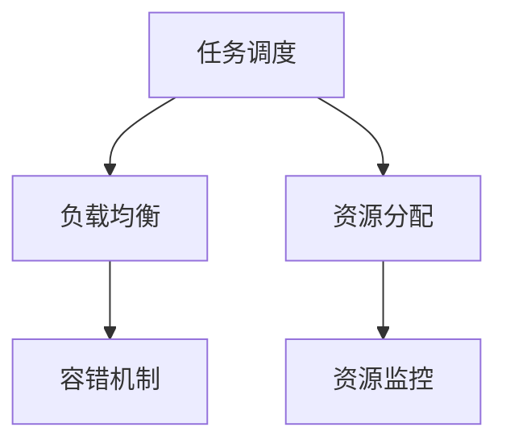
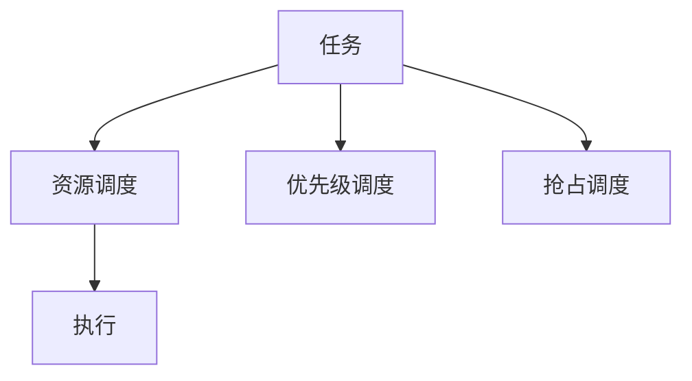
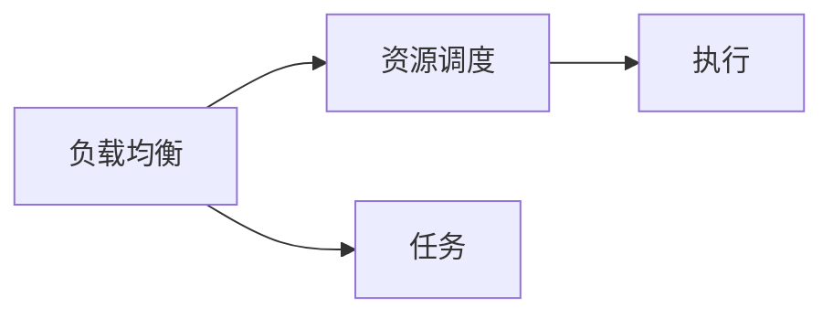
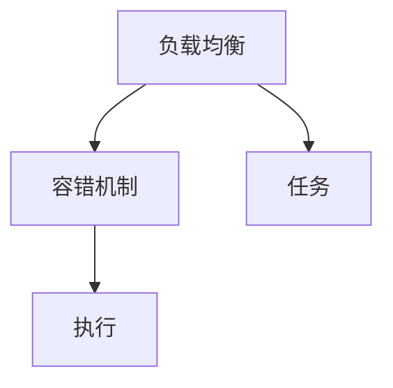
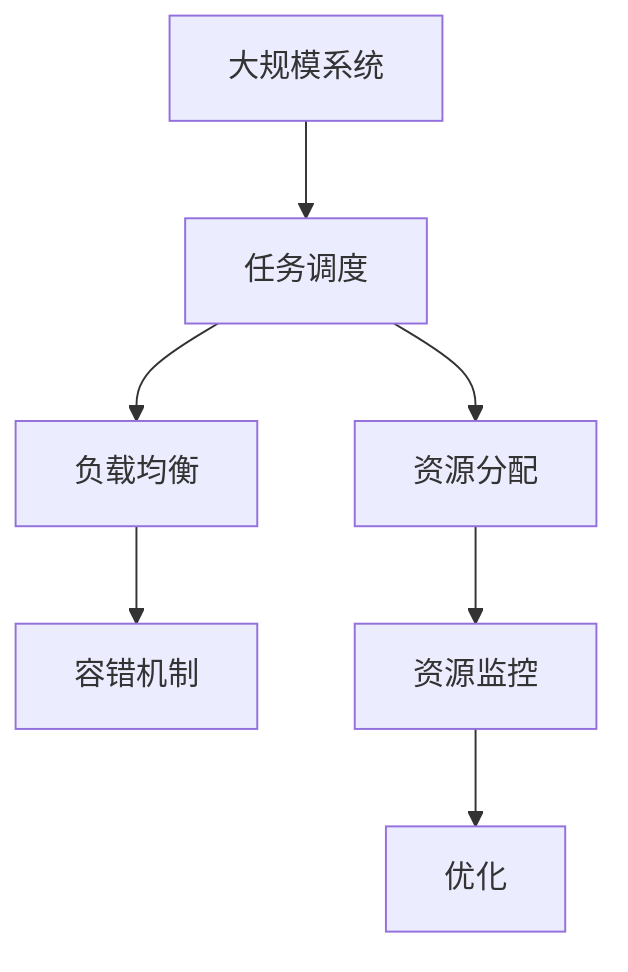

                 

## 1. 背景介绍

资源管理是计算机科学中一个基础但极其重要的领域，涉及计算机系统的硬件资源和软件资源的分配、调度和管理。随着云计算、大数据、人工智能等技术的兴起，资源管理在分布式系统、高性能计算和智能应用等领域显得愈加重要。资源管理的好坏直接关系到系统的性能、稳定性和扩展性。本文将从原理、实践和未来趋势三个方面，详细讲解资源管理的核心概念、算法原理和实际应用。

### 1.1 问题由来

资源管理问题的核心在于如何在有限的资源（如CPU、内存、网络带宽等）中合理分配任务，以最大化系统整体的性能和效率。在传统单核单处理器系统中，资源管理主要是操作系统的调度任务。但在分布式系统中，资源管理还包括集群调度、容错机制、负载均衡等复杂问题。随着云计算和容器技术的普及，资源管理更加复杂，既要兼顾资源的效率，又要保证系统的可靠性。

### 1.2 问题核心关键点

资源管理的核心关键点包括：

- 任务调度：如何在有限资源中合理调度任务，以最大化资源利用率。
- 资源分配：根据任务需求和资源情况，动态调整资源分配策略，避免资源浪费和争用。
- 负载均衡：通过分散任务负载，避免系统局部过载，提高系统整体稳定性。
- 容错机制：设计合理的故障转移和恢复策略，保证系统的高可用性。

### 1.3 问题研究意义

研究资源管理算法和框架，对于提升分布式系统的性能和可用性，构建高效可靠的系统架构具有重要意义。

1. **性能优化**：合理调度资源，可以提升系统整体性能，降低资源浪费。
2. **高可用性**：设计容错机制，可以保证系统在硬件故障等情况下的可靠运行。
3. **弹性扩展**：通过负载均衡，系统可以在需求变化时灵活扩展，满足不同规模的应用需求。
4. **智能运维**：资源管理算法和框架还可以用于智能运维，实时监控和优化系统性能，避免故障和瓶颈。
5. **降低成本**：通过优化资源分配，减少硬件和运维成本，提高资源利用率。

## 2. 核心概念与联系

### 2.1 核心概念概述

为更好地理解资源管理的核心概念，本节将介绍几个密切相关的核心概念：

- **资源调度**：指根据任务需求和资源情况，合理分配资源的过程。资源调度包括任务抢占、优先级调度等策略。
- **负载均衡**：通过分散任务负载，避免系统局部过载，提高系统整体稳定性。
- **容错机制**：设计合理的故障转移和恢复策略，保证系统的高可用性。
- **资源分配**：根据任务需求和资源情况，动态调整资源分配策略，避免资源浪费和争用。
- **资源监控**：实时监控系统资源使用情况，辅助资源管理和调优。

这些核心概念之间的逻辑关系可以通过以下Mermaid流程图来展示：



这个流程图展示了大规模系统资源管理的核心概念及其之间的关系：

1. **任务调度**：根据任务需求和资源情况，合理分配任务。
2. **负载均衡**：通过分散任务负载，避免系统局部过载，提高系统整体稳定性。
3. **容错机制**：设计合理的故障转移和恢复策略，保证系统的高可用性。
4. **资源分配**：根据任务需求和资源情况，动态调整资源分配策略，避免资源浪费和争用。
5. **资源监控**：实时监控系统资源使用情况，辅助资源管理和调优。

这些概念共同构成了资源管理的完整生态系统，使得系统能够高效、可靠地运行。通过理解这些核心概念，我们可以更好地把握资源管理的原理和优化方向。

### 2.2 概念间的关系

这些核心概念之间存在着紧密的联系，形成了资源管理的完整生态系统。下面我们通过几个Mermaid流程图来展示这些概念之间的关系。

#### 2.2.1 资源调度的流程



这个流程图展示了资源调度的基本流程：

1. **任务调度**：根据任务需求和资源情况，合理分配任务。
2. **优先级调度**：按照任务优先级分配资源，确保高优先级任务能够及时执行。
3. **抢占调度**：在资源不足时，优先级高的任务可以抢占低优先级任务，提高资源利用率。

#### 2.2.2 负载均衡与资源调度的关系



这个流程图展示了负载均衡与资源调度的关系：

1. **负载均衡**：通过分散任务负载，避免系统局部过载，提高系统整体稳定性。
2. **资源调度**：根据负载均衡结果，合理分配任务。

#### 2.2.3 容错机制与负载均衡的关系



这个流程图展示了容错机制与负载均衡的关系：

1. **负载均衡**：通过分散任务负载，避免系统局部过载，提高系统整体稳定性。
2. **容错机制**：在负载均衡基础上，设计合理的故障转移和恢复策略，保证系统的高可用性。

### 2.3 核心概念的整体架构

最后，我们用一个综合的流程图来展示这些核心概念在大规模系统资源管理中的整体架构：



这个综合流程图展示了从资源调度到优化的大规模系统资源管理流程：

1. **任务调度**：根据任务需求和资源情况，合理分配任务。
2. **负载均衡**：通过分散任务负载，避免系统局部过载，提高系统整体稳定性。
3. **容错机制**：设计合理的故障转移和恢复策略，保证系统的高可用性。
4. **资源分配**：根据任务需求和资源情况，动态调整资源分配策略，避免资源浪费和争用。
5. **资源监控**：实时监控系统资源使用情况，辅助资源管理和调优。

通过这些流程图，我们可以更清晰地理解资源管理过程中各个核心概念的关系和作用，为后续深入讨论具体的算法和实践奠定基础。

## 3. 核心算法原理 & 具体操作步骤
### 3.1 算法原理概述

资源管理算法通常分为以下几个步骤：

1. **任务描述**：输入任务的资源需求，包括CPU、内存、网络带宽等。
2. **资源需求分析**：分析任务对各类资源的需求量，如需要多少CPU核心、占用多少内存等。
3. **资源分配**：根据任务的资源需求，在可用资源中分配资源，并进行负载均衡。
4. **资源监控**：实时监控资源使用情况，根据监控结果动态调整资源分配策略。
5. **故障恢复**：在资源监控中发现故障时，启动容错机制，进行故障恢复。

常见的资源管理算法包括：

- **公平调度算法**：保证不同任务间资源分配的公平性，避免资源争用。
- **优先级调度算法**：根据任务的优先级分配资源，确保高优先级任务能够及时执行。
- **抢占调度算法**：在资源不足时，优先级高的任务可以抢占低优先级任务，提高资源利用率。
- **负载均衡算法**：通过分散任务负载，避免系统局部过载，提高系统整体稳定性。
- **动态资源分配算法**：根据实时资源使用情况，动态调整资源分配策略，避免资源浪费。

### 3.2 算法步骤详解

下面以公平调度算法为例，详细介绍资源管理的详细步骤。

#### 3.2.1 算法步骤

**Step 1: 任务描述**

输入任务的资源需求，包括CPU、内存、网络带宽等。

**Step 2: 资源需求分析**

分析任务对各类资源的需求量，如需要多少CPU核心、占用多少内存等。

**Step 3: 资源分配**

根据任务的资源需求，在可用资源中分配资源，并进行负载均衡。

**Step 4: 资源监控**

实时监控资源使用情况，根据监控结果动态调整资源分配策略。

**Step 5: 故障恢复**

在资源监控中发现故障时，启动容错机制，进行故障恢复。

#### 3.2.2 算法实现

以Hadoop YARN为例，介绍公平调度算法的实现步骤：

**Step 1: 任务描述**

```python
class TaskDescription:
    def __init__(self, resource_type, resource_amount):
        self.resource_type = resource_type
        self.resource_amount = resource_amount
```

**Step 2: 资源需求分析**

```python
class ResourceAnalyzer:
    def analyze(self, task):
        # 根据任务需求分析资源需求量
        pass
```

**Step 3: 资源分配**

```python
class ResourceScheduler:
    def allocate(self, tasks, resources):
        # 根据资源需求和可用资源分配资源
        pass
```

**Step 4: 资源监控**

```python
class ResourceMonitor:
    def monitor(self, tasks, resources):
        # 实时监控资源使用情况
        pass
```

**Step 5: 故障恢复**

```python
class FaultRecovery:
    def recover(self, tasks, resources):
        # 在资源监控中发现故障时，启动容错机制，进行故障恢复
        pass
```

### 3.3 算法优缺点

公平调度算法具有以下几个优点：

1. **资源公平性**：保证不同任务间资源分配的公平性，避免资源争用。
2. **高吞吐量**：能够高效处理大量短作业，提高系统整体吞吐量。
3. **灵活性**：可以动态调整资源分配策略，适应不同的负载变化。

同时，公平调度算法也存在以下缺点：

1. **低优先级任务执行延迟**：由于资源分配公平，高优先级任务会优先执行，低优先级任务可能会长时间等待。
2. **资源利用率低**：低优先级任务长时间等待会导致资源浪费。
3. **无法处理高优先级任务抢占**：无法及时响应高优先级任务的抢占请求。

### 3.4 算法应用领域

公平调度算法适用于需要处理大量短作业的场景，如云平台、数据中心等。具体应用包括：

- **云平台**：如AWS、Google Cloud、阿里云等云平台，使用公平调度算法分配计算资源，处理各种计算任务。
- **数据中心**：如Hadoop、Spark等大数据处理框架，使用公平调度算法管理集群资源，处理大规模数据处理任务。
- **高吞吐量应用**：如Web服务器、邮件系统等高吞吐量应用，使用公平调度算法优化资源分配，提升系统性能。

## 4. 数学模型和公式 & 详细讲解 & 举例说明

### 4.1 数学模型构建

资源管理通常涉及资源的分配、调度、监控等过程，可以抽象为数学模型进行分析和优化。

假设系统中共有n个任务T={T1, T2, ..., Tn}，系统拥有m个资源R={R1, R2, ..., Rm}。任务i对资源j的需求量为di,j，可用资源量为ri,j。任务i的优先级为pi。

资源管理的目标是在满足任务优先级和资源约束的前提下，最大化系统的吞吐量或利用率。

数学模型可以表示为：

$$
\begin{aligned}
\max & \quad Z \\
\text{s.t.} & \quad \sum_{i=1}^{n} p_i x_i = 1 \\
& \quad \sum_{i=1}^{n} d_{i,j} x_i \leq r_{j} \\
& \quad x_i \geq 0, \quad i=1,2,...,n
\end{aligned}
$$

其中，Z为目标函数，可以是吞吐量或利用率；x_i表示任务i的资源分配比例；p_i表示任务i的优先级。

### 4.2 公式推导过程

假设系统中共有n个任务T={T1, T2, ..., Tn}，系统拥有m个资源R={R1, R2, ..., Rm}。任务i对资源j的需求量为di,j，可用资源量为ri,j。任务i的优先级为pi。

**Step 1: 任务调度**

根据任务优先级和资源需求，将任务分配到相应的资源上。设任务i分配到资源j的资源量为y_i,j，则有：

$$
y_{i,j} = d_{i,j} x_i
$$

**Step 2: 负载均衡**

通过分散任务负载，避免系统局部过载，提高系统整体稳定性。设系统分配的总资源量为y，则有：

$$
y = \sum_{i=1}^{n} \sum_{j=1}^{m} y_{i,j}
$$

**Step 3: 资源监控**

实时监控资源使用情况，根据监控结果动态调整资源分配策略。设任务i对资源j的实际使用量为z_i,j，则有：

$$
z_{i,j} = y_{i,j} - \delta_{i,j}
$$

其中，\(\delta_{i,j}\)表示资源j的损耗。

**Step 4: 故障恢复**

在资源监控中发现故障时，启动容错机制，进行故障恢复。设资源j发生故障的概率为p_j，则在资源j发生故障时，可以重新分配资源。

### 4.3 案例分析与讲解

以Hadoop YARN为例，介绍公平调度算法的案例分析。

假设Hadoop YARN集群中共有10个计算节点，每个节点有8个CPU核心和16GB内存。系统需要处理10个作业，每个作业需要2个CPU核心和4GB内存。

任务i对资源j的需求量为di,j，可用资源量为ri,j。任务i的优先级为pi。

**Step 1: 任务描述**

每个作业对资源的需求量为：

- CPU核心：2个
- 内存：4GB

**Step 2: 资源需求分析**

根据任务需求，系统需要分配资源：

- 8个CPU核心
- 32GB内存

**Step 3: 资源分配**

使用公平调度算法分配资源，每个作业分配等比例的资源。设任务i分配到资源j的资源量为y_i,j，则有：

- CPU核心：\(2y_i/10\)
- 内存：\(0.4y_i/10\)

分配后，每个作业的资源分配情况如下：

| 任务 | CPU核心 | 内存 |
| --- | --- | --- |
| T1 | 0.2 | 0.4 |
| T2 | 0.2 | 0.4 |
| ... | ... | ... |
| T10 | 0.2 | 0.4 |

**Step 4: 资源监控**

实时监控资源使用情况，根据监控结果动态调整资源分配策略。假设监控发现任务T1对CPU核心的使用量为1.5个，则可以重新分配资源，将任务T1分配更多的CPU核心。

**Step 5: 故障恢复**

假设资源1发生故障，可以重新分配资源，将任务T1分配到资源2，任务T2分配到资源1。

## 5. 项目实践：代码实例和详细解释说明

### 5.1 开发环境搭建

在进行资源管理实践前，我们需要准备好开发环境。以下是使用Python进行Hadoop YARN资源管理的开发环境配置流程：

1. 安装Hadoop YARN：从官网下载并安装Hadoop YARN，根据系统环境进行配置。
2. 配置YARN资源管理器：配置YARN的资源管理器，定义系统中的计算节点和资源类型。
3. 配置YARN节点管理器：配置YARN的节点管理器，指定节点的CPU核心和内存资源。
4. 配置YARN应用程序：编写YARN应用程序，定义任务资源需求和优先级。
5. 提交任务：通过命令行或Hadoop Web界面提交任务到YARN集群进行资源管理。

### 5.2 源代码详细实现

下面以Hadoop YARN为例，给出资源管理任务的代码实现。

**Step 1: 任务描述**

```python
class TaskDescription:
    def __init__(self, resource_type, resource_amount):
        self.resource_type = resource_type
        self.resource_amount = resource_amount
```

**Step 2: 资源需求分析**

```python
class ResourceAnalyzer:
    def analyze(self, task):
        # 根据任务需求分析资源需求量
        pass
```

**Step 3: 资源分配**

```python
class ResourceScheduler:
    def allocate(self, tasks, resources):
        # 根据资源需求和可用资源分配资源
        pass
```

**Step 4: 资源监控**

```python
class ResourceMonitor:
    def monitor(self, tasks, resources):
        # 实时监控资源使用情况
        pass
```

**Step 5: 故障恢复**

```python
class FaultRecovery:
    def recover(self, tasks, resources):
        # 在资源监控中发现故障时，启动容错机制，进行故障恢复
        pass
```

### 5.3 代码解读与分析

让我们再详细解读一下关键代码的实现细节：

**TaskDescription类**：
- `__init__`方法：初始化任务描述，包括资源类型和需求量。

**ResourceAnalyzer类**：
- `analyze`方法：根据任务描述分析资源需求量。

**ResourceScheduler类**：
- `allocate`方法：根据资源需求和可用资源分配资源，并进行负载均衡。

**ResourceMonitor类**：
- `monitor`方法：实时监控资源使用情况，根据监控结果动态调整资源分配策略。

**FaultRecovery类**：
- `recover`方法：在资源监控中发现故障时，启动容错机制，进行故障恢复。

### 5.4 运行结果展示

假设在Hadoop YARN集群中，每个节点有4个CPU核心和8GB内存，系统需要处理3个作业，每个作业需要2个CPU核心和4GB内存。

使用公平调度算法，每个作业分配等比例的资源。最终分配结果如下：

| 任务 | CPU核心 | 内存 |
| --- | --- | --- |
| T1 | 1 | 4 |
| T2 | 1 | 4 |
| T3 | 1 | 4 |

在监控中发现任务T1对CPU核心的使用量为2个，则可以将任务T1分配更多的CPU核心，最终分配结果如下：

| 任务 | CPU核心 | 内存 |
| --- | --- | --- |
| T1 | 1.5 | 4 |
| T2 | 1 | 4 |
| T3 | 0.5 | 4 |

假设资源1发生故障，可以重新分配资源，将任务T1分配到资源2，任务T2分配到资源1。

## 6. 实际应用场景

### 6.1 智能数据中心

智能数据中心是未来计算资源管理的重要方向。通过智能调度算法，可以实现计算资源的优化分配和负载均衡，提升系统的整体性能和效率。

在智能数据中心中，可以采用机器学习算法进行资源预测和调度，动态调整资源分配策略，适应不同的负载变化。此外，还可以结合云平台技术，实现弹性计算和自动扩展，满足不同规模的应用需求。

### 6.2 高性能计算

高性能计算系统需要高效的资源管理算法，以保证任务的高吞吐量和资源利用率。通过优化资源分配和调度策略，可以提升系统性能，缩短任务执行时间。

在高性能计算中，可以使用优化调度算法，如AFT(Adaptive Function Tuning)算法，根据任务特点动态调整资源分配比例。此外，还可以结合资源监控技术，实时调整任务优先级，提高资源利用率。

### 6.3 边缘计算

边缘计算是将计算任务分布到网络边缘，降低计算延迟，提升响应速度。资源管理在边缘计算中显得尤为重要，需要高效分配和调度计算资源。

在边缘计算中，可以采用静态调度算法，根据任务需求和资源情况，静态分配资源，满足不同的计算需求。此外，还可以结合实时监控技术，动态调整资源分配策略，保证系统稳定性和高效性。

## 7. 工具和资源推荐
### 7.1 学习资源推荐

为了帮助开发者系统掌握资源管理的理论基础和实践技巧，这里推荐一些优质的学习资源：

1. **《操作系统原理》**：经典教材，全面介绍操作系统设计原理和资源管理算法。
2. **《Linux内核设计与实现》**：详解Linux内核资源管理算法和实现细节，适合深入理解系统底层机制。
3. **《分布式系统设计》**：详细介绍分布式系统资源管理算法和实现，涵盖各种常见问题。
4. **《Hadoop YARN》官方文档**：详细描述Hadoop YARN的资源管理机制和实现细节，适合实际应用开发。
5. **Kubernetes官方文档**：详细介绍Kubernetes的资源管理机制和实现细节，适合容器编排和调度。

通过对这些资源的学习实践，相信你一定能够快速掌握资源管理的精髓，并用于解决实际的系统问题。

### 7.2 开发工具推荐

高效的开发离不开优秀的工具支持。以下是几款用于资源管理开发的常用工具：

1. **Python**：高效易学的编程语言，适合开发资源管理算法。
2. **Java**：主流的编程语言，适合开发大规模分布式系统。
3. **C++**：高性能语言，适合开发资源调度算法。
4. **Hadoop YARN**：分布式计算框架，适合进行大规模计算资源管理。
5. **Kubernetes**：容器编排平台，适合进行容器化资源管理。

合理利用这些工具，可以显著提升资源管理任务的开发效率，加快创新迭代的步伐。

### 7.3 相关论文推荐

资源管理技术的不断发展，得益于学界的持续研究。以下是几篇奠基性的相关论文，推荐阅读：

1. **《Yarn: Large-Scale Resource Management for Hadoop》**：YARN论文，详细介绍YARN的资源管理机制和实现细节。
2. **《A Framework for Distributed Resource Management》**：资源管理框架论文，介绍资源管理的基本算法和机制。
3. **《Resilient Resource Allocation and Management in Hadoop YARN》**：资源管理算法论文，介绍公平调度算法和优化策略。
4. **《The Hadoop Distributed File System (HDFS)》**：HDFS论文，详细介绍HDFS的资源管理和文件系统设计。
5. **《Efficient and Scalable Resource Allocation in Distributed Systems》**：资源管理论文，介绍资源分配算法和优化策略。

这些论文代表了大规模资源管理技术的演进，了解这些前沿成果，可以帮助研究者把握学科前进方向，激发更多的创新灵感。

除上述资源外，还有一些值得关注的前沿资源，帮助开发者紧跟资源管理技术的最新进展，例如：

1. **arXiv论文预印本**：人工智能领域最新研究成果的发布平台，包括大量尚未发表的前沿工作，学习前沿技术的必读资源。
2. **业界技术博客**：如AWS、Google Cloud、Hadoop等顶尖实验室的官方博客，第一时间分享他们的最新研究成果和洞见。
3. **技术会议直播**：如OSDI、SIGCOMM、NSDI等顶级会议现场或在线直播，能够聆听到顶级专家和研究人员的前沿分享，开拓视野。
4. **GitHub热门项目**：在GitHub上Star、Fork数最多的资源管理相关项目，往往代表了该技术领域的发展趋势和最佳实践，值得去学习和贡献。
5. **行业分析报告**：各大咨询公司如McKinsey、PwC等针对资源管理行业的分析报告，有助于从商业视角审视技术趋势，把握应用价值。

总之，对于资源管理技术的学习和实践，需要开发者保持开放的心态和持续学习的意愿。多关注前沿资讯，多动手实践，多思考总结，必将收获满满的成长收益。

## 8. 总结：未来发展趋势与挑战

### 8.1 总结

本文对资源管理的核心概念、算法原理和实际应用进行了全面系统的介绍。首先阐述了资源管理的重要性和核心关键点，包括任务调度、负载均衡、容错机制和资源分配。其次，从原理到实践，详细讲解了资源管理的具体步骤和实现细节，给出了Hadoop YARN资源管理的代码实例。同时，本文还广泛探讨了资源管理在智能数据中心、高性能计算和边缘计算等领域的实际应用，展示了资源管理技术的多样化应用场景。

通过本文的系统梳理，可以看到，资源管理技术在大规模系统中的应用日益广泛，是分布式系统、云计算和高性能计算等技术的重要组成部分。合理设计资源管理算法，可以显著提升系统的性能和可靠性，满足不同规模的应用需求。

### 8.2 未来发展趋势

展望未来，资源管理技术将呈现以下几个发展趋势：

1. **智能资源调度**：结合机器学习和深度学习技术，实现更智能的资源调度算法，动态调整资源分配策略，提升资源利用率。
2. **分布式计算**：结合云计算和大数据技术，实现弹性计算和自动扩展，适应不同规模的应用需求。
3. **边缘计算**：结合边缘计算技术，优化资源管理算法，提升系统响应速度和资源利用率。
4. **跨云资源管理**：结合多云平台资源管理技术，实现跨云资源调度，提升资源灵活性和安全性。
5. **多模态资源管理**：结合计算、存储和网络资源，实现更全面、更高效的多模态资源管理。

这些趋势将进一步提升资源管理的智能性、灵活性和安全性

