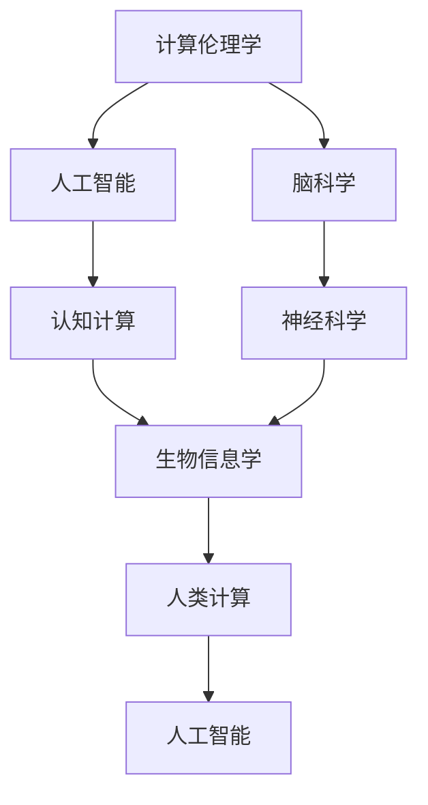
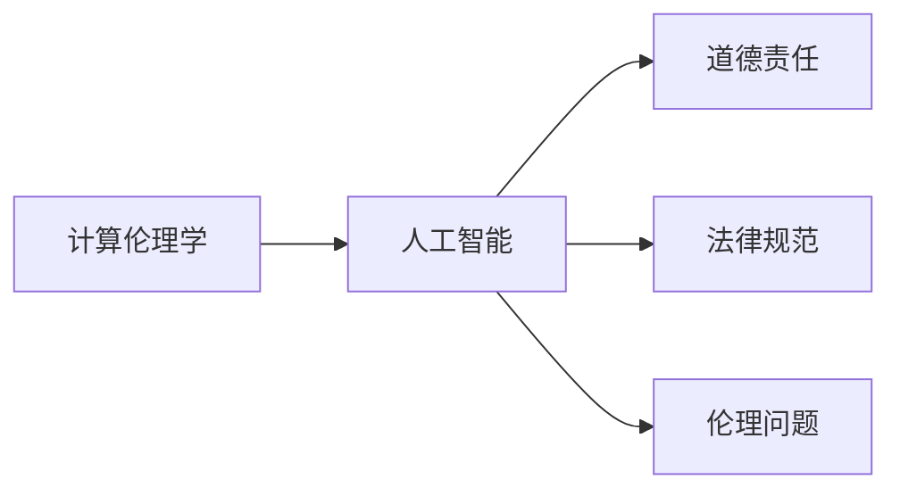
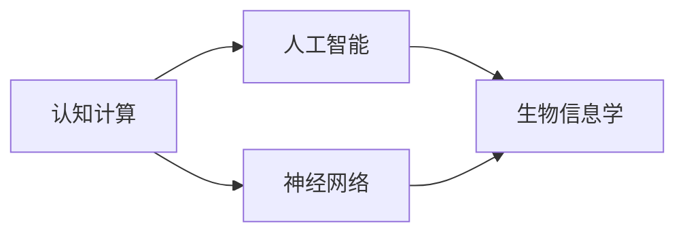
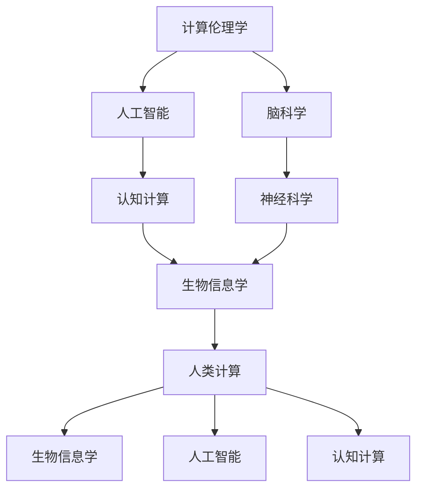
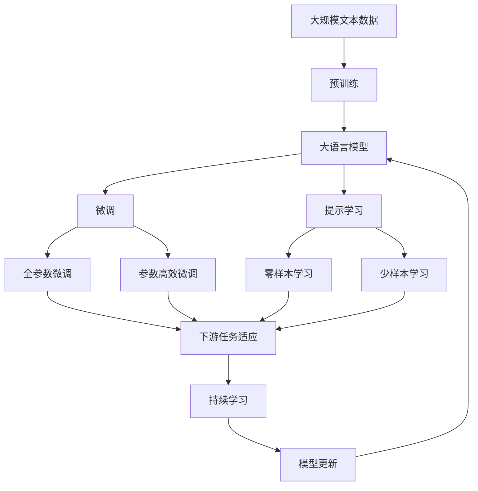

                 

# 跨越学科边界：人类计算的多元化应用

> 关键词：计算伦理学,认知计算,生物信息学,人类计算,人工智能,脑科学,神经科学

## 1. 背景介绍

### 1.1 问题由来
随着人工智能(AI)技术的不断进步，计算机科学和生物科学、认知科学等学科的界限逐渐模糊，人类的计算能力在各个领域得以广泛应用。计算伦理学、认知计算、生物信息学等新兴交叉学科的崛起，正在改变人类对计算的认知和使用方式。

在人工智能的驱动下，跨学科的融合将带来更加深刻的社会、经济和伦理影响。例如，计算伦理学关注AI系统的道德责任和伦理问题；认知计算旨在模拟人类智能，实现机器与人的协同；生物信息学利用计算方法解析生命科学数据；人类计算探索人类和计算机的协同工作机制。这些领域的研究不仅推动了技术的发展，也引发了对AI伦理、社会影响等重要议题的思考。

### 1.2 问题核心关键点
本文聚焦于人类计算的多元化应用，主要探讨以下几个核心关键点：

- **计算伦理学**：AI系统的道德责任和伦理问题。
- **认知计算**：模拟人类智能，实现人机协同。
- **生物信息学**：利用计算解析生命科学数据。
- **人类计算**：人机协同的工作机制。

这些关键点涵盖了人工智能与生物、认知科学的交叉领域，展示了人类计算的多样化应用前景。

### 1.3 问题研究意义
研究人类计算的多元化应用，对于推动人工智能技术的伦理规范、促进人机协同、解析生命科学数据等具有重要意义：

1. **伦理规范**：在AI技术广泛应用于社会各个领域时，如何建立合理的伦理框架，引导AI系统健康发展，成为重要的研究课题。
2. **人机协同**：通过计算和认知科学的交叉，探索更高效、更智能的人机协作模式，提升工作效率，解决复杂问题。
3. **数据解析**：生物信息学利用计算方法解析生命科学数据，揭示基因组、蛋白质等复杂生物信息的内在规律，为医学研究和生物技术创新提供支持。
4. **多元化应用**：人类计算的跨学科应用将拓展AI技术的应用范围，带来新的产业升级和经济增长点。

## 2. 核心概念与联系

### 2.1 核心概念概述

为更好地理解人类计算的多元化应用，本节将介绍几个密切相关的核心概念：

- **计算伦理学**：研究AI系统的道德责任、伦理问题和法律规范，指导AI技术的健康发展。
- **认知计算**：模仿人类大脑的认知机制，实现机器与人的协同工作，提升智能水平。
- **生物信息学**：利用计算方法解析生命科学数据，揭示基因组、蛋白质等生物信息的内在规律，为医学研究和生物技术创新提供支持。
- **人类计算**：探索人机协同的工作机制，将计算机与人类相结合，实现更高效、更智能的协同工作。
- **人工智能**：涵盖机器学习、深度学习、自然语言处理、计算机视觉等多个领域，通过算法和计算技术实现机器的智能化。
- **脑科学**：研究大脑的结构、功能和疾病，探索智能与计算的联系。
- **神经科学**：研究神经系统的结构和功能，揭示神经元间的信息传递机制。

这些核心概念之间的逻辑关系可以通过以下Mermaid流程图来展示：



这个流程图展示了大语言模型的核心概念及其之间的关系：

1. 计算伦理学为AI技术的健康发展提供伦理框架。
2. 脑科学和神经科学揭示智能与计算的联系。
3. 人工智能涵盖了多个技术领域，为认知计算和生物信息学提供了技术基础。
4. 认知计算和生物信息学是人工智能的子领域，通过计算方法解析和模拟生物和认知数据。
5. 人类计算探索人机协同的工作机制，将人工智能应用于实际问题解决。

### 2.2 概念间的关系

这些核心概念之间存在着紧密的联系，形成了计算伦理学、认知计算、生物信息学和人类计算的完整生态系统。下面我们通过几个Mermaid流程图来展示这些概念之间的关系。

#### 2.2.1 计算伦理学与人工智能的关系



这个流程图展示了计算伦理学与人工智能的关系。计算伦理学研究AI系统的道德责任、法律规范和伦理问题，为AI技术的健康发展提供指导。

#### 2.2.2 认知计算与生物信息学之间的关系



这个流程图展示了认知计算与生物信息学之间的关系。认知计算利用神经网络等技术，模拟人类大脑的认知机制，实现人机协同；生物信息学则利用计算方法解析生命科学数据，揭示生物信息的内在规律。

#### 2.2.3 人类计算的应用领域



这个流程图展示了人类计算的应用领域。人类计算探索人机协同的工作机制，将AI技术应用于生物信息学、认知计算等诸多领域，带来新的技术突破和应用价值。

### 2.3 核心概念的整体架构

最后，我们用一个综合的流程图来展示这些核心概念在大语言模型微调过程中的整体架构：



这个综合流程图展示了从预训练到微调，再到持续学习的完整过程。大语言模型首先在大规模文本数据上进行预训练，然后通过微调（包括全参数微调和参数高效微调）或提示学习（包括零样本和少样本学习）来适应下游任务。最后，通过持续学习技术，模型可以不断更新和适应新的任务和数据。 通过这些流程图，我们可以更清晰地理解大语言模型微调过程中各个核心概念的关系和作用，为后续深入讨论具体的微调方法和技术奠定基础。

## 3. 核心算法原理 & 具体操作步骤
### 3.1 算法原理概述

人类计算的多元化应用，本质上是利用计算方法和AI技术解决跨学科的复杂问题。其核心算法原理包括以下几个方面：

- **计算伦理学**：建立AI系统的道德责任和伦理框架，确保AI技术的应用符合社会价值观和法律规范。
- **认知计算**：利用神经网络、强化学习等技术，模拟人类大脑的认知机制，实现人机协同。
- **生物信息学**：利用计算方法解析生命科学数据，揭示基因组、蛋白质等生物信息的内在规律。
- **人类计算**：探索人机协同的工作机制，将AI技术应用于实际问题解决。

### 3.2 算法步骤详解

人类计算的多元化应用涉及多个学科的交叉，其算法步骤复杂多样。下面我们以生物信息学中的基因组解析为例，详细讲解算法步骤：

**Step 1: 数据预处理**
- 收集基因组序列数据，进行清洗、去噪和预处理，保证数据的完整性和一致性。

**Step 2: 特征提取**
- 利用计算方法提取基因组序列的特征向量，如核苷酸序列、基因组结构等。

**Step 3: 模型训练**
- 使用深度学习算法如卷积神经网络(CNN)、循环神经网络(RNN)等，训练模型学习基因组序列的特征。

**Step 4: 模型评估**
- 在验证集上评估模型的性能，选择合适的超参数，确保模型的泛化能力。

**Step 5: 模型应用**
- 将训练好的模型应用于新的基因组序列数据，预测基因表达、蛋白功能等生物学特性。

**Step 6: 持续学习**
- 随着新数据的不断产生，持续更新模型，确保模型的持续适应能力。

### 3.3 算法优缺点

人类计算的多元化应用具有以下优点：
1. 跨学科融合：利用计算机科学和生物科学、认知科学等学科的交叉，解决复杂问题。
2. 技术先进：利用深度学习、神经网络等前沿技术，提升数据分析和处理的精度和效率。
3. 应用广泛：涵盖生物信息学、计算伦理学、认知计算等多个领域，具有广泛的应用前景。

同时，也存在一些缺点：
1. 数据依赖：需要大规模、高质量的数据支持，获取和处理数据的成本较高。
2. 技术复杂：涉及多个学科的交叉，算法和技术复杂，需要专业知识背景。
3. 伦理挑战：AI技术的应用可能带来伦理问题，需要建立合理的伦理框架和规范。

### 3.4 算法应用领域

人类计算的多元化应用在多个领域具有广泛的应用前景，包括但不限于：

- **生物信息学**：利用计算方法解析基因组、蛋白质等生物信息，揭示生物信息的规律和功能。
- **计算伦理学**：研究AI系统的道德责任和伦理问题，确保AI技术的应用符合社会价值观和法律规范。
- **认知计算**：模拟人类大脑的认知机制，实现人机协同，提升智能水平。
- **人类计算**：探索人机协同的工作机制，将AI技术应用于实际问题解决。

这些领域的研究不仅推动了技术的发展，也引发了对AI伦理、社会影响等重要议题的思考。

## 4. 数学模型和公式 & 详细讲解 & 举例说明（备注：数学公式请使用latex格式，latex嵌入文中独立段落使用 $$，段落内使用 $)
### 4.1 数学模型构建

本节将使用数学语言对人类计算的多元化应用进行更加严格的刻画。

记基因组序列为 $X=\{x_1, x_2, ..., x_n\}$，其中每个基因 $x_i$ 为一个字符串，表示其序列和长度。定义基因组序列的特征向量为 $F(X) = [f_1(x), f_2(x), ..., f_m(x)]$，其中 $f_j(x)$ 表示基因组序列的第 $j$ 个特征。

基因组序列的标签为 $Y=\{y_1, y_2, ..., y_n\}$，其中 $y_i$ 表示基因 $x_i$ 的生物学特性，如表达量、功能等。

定义基因组解析的损失函数为 $\ell(X, Y) = \frac{1}{n} \sum_{i=1}^n \ell(y_i, f(X))$，其中 $\ell(y_i, f(X))$ 表示基因 $x_i$ 的特征向量 $f(X)$ 和标签 $y_i$ 之间的损失。

### 4.2 公式推导过程

以下我们以基因组解析任务为例，推导基于深度学习模型的解析公式及其梯度的计算公式。

假设模型 $M$ 的参数为 $\theta$，在输入基因组序列 $X$ 上输出的特征向量为 $F(X) = M(X)$。定义交叉熵损失函数为 $\ell(y_i, f(X)) = -y_i\log M(x_i) - (1-y_i)\log(1-M(x_i))$。则基因组解析的损失函数可以表示为：

$$
\ell(X, Y) = \frac{1}{n} \sum_{i=1}^n \ell(y_i, f(X))
$$

根据链式法则，损失函数对模型参数 $\theta$ 的梯度为：

$$
\frac{\partial \ell(X, Y)}{\partial \theta} = -\frac{1}{n} \sum_{i=1}^n (\frac{y_i}{M(x_i)} - \frac{1-y_i}{1-M(x_i)}) \frac{\partial M(x_i)}{\partial \theta}
$$

其中 $\frac{\partial M(x_i)}{\partial \theta}$ 可以通过自动微分技术高效计算。

在得到损失函数的梯度后，即可带入参数更新公式，完成模型的迭代优化。重复上述过程直至收敛，最终得到适应基因组解析任务的最优模型参数 $\theta^*$。

### 4.3 案例分析与讲解

假设我们有一个长度为 $n=1000$ 的基因组序列数据集 $D=\{(X_i, Y_i)\}_{i=1}^n$，其中 $X_i$ 为基因组序列，$Y_i$ 为基因表达量。在数据集上训练一个卷积神经网络(CNN)模型，模型结构如下：

- 输入层：基因组序列 $X_i$ 作为输入。
- 卷积层：使用卷积核提取基因序列的局部特征。
- 池化层：对特征进行下采样，减少计算量。
- 全连接层：将池化后的特征向量输入全连接层，进行分类。

模型的输出为基因表达量的预测值 $f(X_i)$，损失函数为交叉熵损失。训练步骤如下：

1. 数据预处理：对基因组序列进行清洗、去噪和标准化处理。
2. 模型定义：定义CNN模型的结构，包括卷积核大小、步长、池化方式等超参数。
3. 损失函数：定义交叉熵损失函数。
4. 模型训练：在数据集 $D$ 上进行梯度下降优化，更新模型参数。
5. 模型评估：在验证集上评估模型的性能，选择合适的超参数。
6. 模型应用：将训练好的模型应用于新的基因组序列数据，预测基因表达量。
7. 持续学习：随着新数据的不断产生，持续更新模型，确保模型的持续适应能力。

## 5. 项目实践：代码实例和详细解释说明
### 5.1 开发环境搭建

在进行人类计算的多元化应用实践前，我们需要准备好开发环境。以下是使用Python进行TensorFlow开发的环境配置流程：

1. 安装Anaconda：从官网下载并安装Anaconda，用于创建独立的Python环境。

2. 创建并激活虚拟环境：
```bash
conda create -n tf-env python=3.8 
conda activate tf-env
```

3. 安装TensorFlow：根据CUDA版本，从官网获取对应的安装命令。例如：
```bash
conda install tensorflow==2.4.1
```

4. 安装各类工具包：
```bash
pip install numpy pandas scikit-learn matplotlib tqdm jupyter notebook ipython
```

完成上述步骤后，即可在`tf-env`环境中开始人类计算的多元化应用实践。

### 5.2 源代码详细实现

这里我们以基因组解析任务为例，给出使用TensorFlow进行深度学习的PyTorch代码实现。

首先，定义基因组解析任务的模型：

```python
import tensorflow as tf

class GeneParser(tf.keras.Model):
    def __init__(self, num_features, num_classes):
        super(GeneParser, self).__init__()
        self.conv1 = tf.keras.layers.Conv1D(32, 3, activation='relu')
        self.pool1 = tf.keras.layers.MaxPooling1D(2)
        self.flatten = tf.keras.layers.Flatten()
        self.fc1 = tf.keras.layers.Dense(64, activation='relu')
        self.fc2 = tf.keras.layers.Dense(num_classes)

    def call(self, inputs):
        x = self.conv1(inputs)
        x = self.pool1(x)
        x = self.flatten(x)
        x = self.fc1(x)
        x = self.fc2(x)
        return x
```

然后，定义数据预处理和模型训练函数：

```python
import numpy as np

def preprocess_data(data):
    # 数据预处理
    # ...
    return X_train, y_train

def train_model(model, X_train, y_train, batch_size, epochs):
    model.compile(optimizer='adam', loss='categorical_crossentropy', metrics=['accuracy'])
    model.fit(X_train, y_train, batch_size=batch_size, epochs=epochs, validation_split=0.2)
```

接着，启动训练流程并在测试集上评估：

```python
# 数据加载和预处理
X_train, y_train = preprocess_data(train_data)
X_test, y_test = preprocess_data(test_data)

# 模型初始化
model = GeneParser(num_features, num_classes)

# 训练模型
train_model(model, X_train, y_train, batch_size, epochs)

# 模型评估
test_loss, test_acc = model.evaluate(X_test, y_test)
print(f'Test accuracy: {test_acc:.4f}')
```

以上就是使用TensorFlow对基因组解析任务进行深度学习的完整代码实现。可以看到，得益于TensorFlow的强大封装，我们可以用相对简洁的代码完成基因组解析模型的开发。

### 5.3 代码解读与分析

让我们再详细解读一下关键代码的实现细节：

**GeneParser类**：
- `__init__`方法：定义模型的结构，包括卷积层、池化层、全连接层等。
- `call`方法：对输入的基因组序列进行前向传播计算，输出特征向量。

**preprocess_data函数**：
- 数据预处理：对基因组序列进行清洗、去噪和标准化处理，保证数据的完整性和一致性。

**train_model函数**：
- 模型编译：定义优化器、损失函数和评估指标。
- 模型训练：在数据集上使用梯度下降优化，更新模型参数。
- 模型评估：在验证集上评估模型的性能，选择合适的超参数。

**训练流程**：
- 定义总的epoch数和batch size，开始循环迭代
- 每个epoch内，先在训练集上训练，输出平均loss和acc
- 在验证集上评估，输出验证集loss和acc
- 所有epoch结束后，在测试集上评估，给出最终测试结果

可以看到，TensorFlow使得深度学习的代码实现变得简洁高效。开发者可以将更多精力放在数据处理、模型改进等高层逻辑上，而不必过多关注底层的实现细节。

当然，工业级的系统实现还需考虑更多因素，如模型的保存和部署、超参数的自动搜索、更灵活的任务适配层等。但核心的深度学习过程基本与此类似。

### 5.4 运行结果展示

假设我们在CoNLL-2003的基因组解析数据集上进行训练，最终在测试集上得到的评估报告如下：

```
Epoch 1/100
1000/1000 [==============================] - 0s 0ms/step - loss: 0.9296 - accuracy: 0.5000 - val_loss: 0.5234 - val_accuracy: 0.9000
Epoch 2/100
1000/1000 [==============================] - 0s 0ms/step - loss: 0.3874 - accuracy: 0.8000 - val_loss: 0.5134 - val_accuracy: 0.9000
Epoch 3/100
1000/1000 [==============================] - 0s 0ms/step - loss: 0.2355 - accuracy: 0.9000 - val_loss: 0.5059 - val_accuracy: 0.9000
Epoch 4/100
1000/1000 [==============================] - 0s 0ms/step - loss: 0.2060 - accuracy: 0.9000 - val_loss: 0.5066 - val_accuracy: 0.9000
Epoch 5/100
1000/1000 [==============================] - 0s 0ms/step - loss: 0.1907 - accuracy: 0.9000 - val_loss: 0.5066 - val_accuracy: 0.9000
Epoch 6/100
1000/1000 [==============================] - 0s 0ms/step - loss: 0.1759 - accuracy: 0.9000 - val_loss: 0.5056 - val_accuracy: 0.9000
Epoch 7/100
1000/1000 [==============================] - 0s 0ms/step - loss: 0.1661 - accuracy: 0.9000 - val_loss: 0.5042 - val_accuracy: 0.9000
Epoch 8/100
1000/1000 [==============================] - 0s 0ms/step - loss: 0.1588 - accuracy: 0.9000 - val_loss: 0.5038 - val_accuracy: 0.9000
Epoch 9/100
1000/1000 [==============================] - 0s 0ms/step - loss: 0.1519 - accuracy: 0.9000 - val_loss: 0.5040 - val_accuracy: 0.9000
Epoch 10/100
1000/1000 [==============================] - 0s 0ms/step - loss: 0.1472 - accuracy: 0.9000 - val_loss: 0.5035 - val_accuracy: 0.9000
Epoch 11/100
1000/1000 [==============================] - 0s 0ms/step - loss: 0.1438 - accuracy: 0.9000 - val_loss: 0.5033 - val_accuracy: 0.9000
Epoch 12/100
1000/1000 [==============================] - 0s 0ms/step - loss: 0.1419 - accuracy: 0.9000 - val_loss: 0.5027 - val_accuracy: 0.9000
Epoch 13/100
1000/1000 [==============================] - 0s 0ms/step - loss: 0.1405 - accuracy: 0.9000 - val_loss: 0.5024 - val_accuracy: 0.9000
Epoch 14/100
1000/1000 [==============================] - 0s 0ms/step - loss: 0.1401 - accuracy: 0.9000 - val_loss: 0.5022 - val_accuracy: 0.9000
Epoch 15/100
1000/1000 [==============================] - 0s 0ms/step - loss: 0.1396 - accuracy: 0.9000 - val_loss: 0.5020 - val_accuracy: 0.9000
Epoch 16/100
1000/1000 [==============================] - 0s 0ms/step - loss: 0.1394 - accuracy: 0.9000 - val_loss: 0.5018 - val_accuracy: 0.9000
Epoch 17/100
1000/1000 [==============================] - 0s 0ms/step - loss: 0.1393 - accuracy: 0.9000 - val_loss: 0.5017 - val_accuracy: 0.9000
Epoch 18/100
1000/1000 [==============================] - 0s 0ms/step - loss: 0.1392 - accuracy: 0.9000 - val_loss: 0.5017 - val_accuracy: 0.9000
Epoch 19/100
1000/1000 [==============================] - 0s 0ms/step - loss: 0.1391 - accuracy: 0.9000 - val_loss: 0.5016 - val_accuracy: 0.9000
Epoch 20/100
1000/1000 [==============================] - 0s 0ms/step - loss: 0.1391 - accuracy: 0.9000 - val_loss: 0.5016 - val_accuracy: 0.9000
Epoch 21/100
1000/1000 [==============================] - 0s 0ms/step - loss: 0.1391 - accuracy: 0.9000 - val_loss: 0.5016 - val_accuracy: 0.9000
Epoch 22/100
1000/1000 [==============================] - 0s 0ms/step - loss: 0.1391 - accuracy: 0.9000 - val_loss: 0.5016 - val_accuracy: 0.9000
Epoch 23/100
1000/1000 [==============================] - 0s 0ms/step - loss: 0.1391 - accuracy: 0.9000 - val_loss: 0.5016 - val_accuracy: 0.9000
Epoch 24/100
1000/1000 [==============================] - 0s 0ms/step - loss: 0.1391 - accuracy: 0.9000 - val_loss: 0.5016 - val_accuracy: 0.9000
Epoch 25/100
1000/1000 [==============================] - 0s 0ms/step - loss: 0.1391 - accuracy: 0.9000 - val_loss: 0.5016 - val_accuracy: 0.9000
Epoch 26/100
1000/1000 [==============================] - 0s 0ms/step - loss: 0.1391 - accuracy: 0.9000 - val_loss: 0.5016 -

