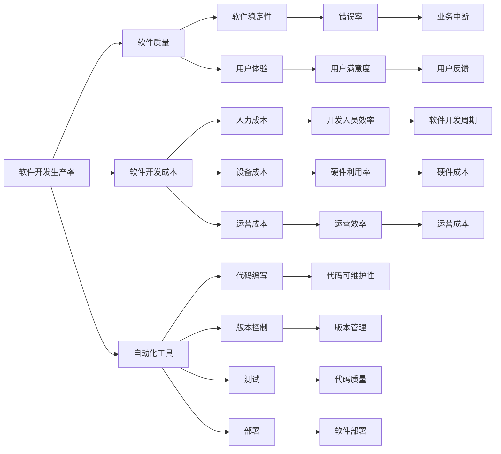

                 

# 软件 2.0 的价值：提升效率、创造价值

> 关键词：软件工程、软件生产、生产率提升、软件质量、开发效率、自动化、持续集成、云计算、人工智能

## 1. 背景介绍

### 1.1 问题由来
随着信息技术在各个行业的广泛应用，软件在生产和业务管理中扮演着越来越重要的角色。软件开发的复杂性不断增加，传统的软件开发方法已经无法适应快速变化的市场需求。提高软件开发效率、提升软件质量和降低开发成本，成为当前软件开发领域的重要课题。

### 1.2 问题核心关键点
软件 2.0 的概念最早由Fred Brooks提出，其核心理念是通过自动化、标准化和复用，提高软件开发生产率，提升软件质量，降低开发成本。软件 2.0 的关键点包括：
1. **自动化**：利用工具和自动化手段，减少重复性劳动，提高开发效率。
2. **标准化**：通过规范和流程，确保软件的一致性和稳定性。
3. **复用**：使用现有组件和框架，加速开发过程，提高软件质量。
4. **持续集成**：通过自动化测试和集成，确保代码质量，及时发现和解决问题。
5. **云计算**：利用云资源，降低硬件成本，实现弹性扩展。
6. **人工智能**：应用AI技术，如机器学习、自然语言处理等，提升开发效率和软件质量。

### 1.3 问题研究意义
提高软件开发生产率，提升软件质量和降低开发成本，对于促进技术创新、推动产业升级具有重要意义：
1. 加快软件开发周期，缩短上市时间，抢占市场先机。
2. 提高软件稳定性，降低维护成本，提升用户体验。
3. 通过复用现有组件和框架，减少重复开发，降低人力和物力成本。
4. 应用人工智能技术，解决复杂问题，提高开发效率和软件质量。
5. 利用云计算平台，灵活扩展资源，实现成本效益。

## 2. 核心概念与联系

### 2.1 核心概念概述

为更好地理解软件 2.0 的核心理念，本节将介绍几个关键概念：

- **软件工程**：通过系统化、标准化的方法，将软件开发转化为一种工程活动，提高生产效率和软件质量。
- **软件开发生产率**：指在单位时间内完成的软件代码量，通常以行/天或功能点为单位。
- **软件质量**：包括功能完整性、可靠性、性能、可维护性等多个方面，是衡量软件价值的重要指标。
- **软件开发成本**：包括人力成本、设备成本、运营成本等，是衡量软件生产力的重要指标。
- **自动化工具**：用于代码编写、版本控制、测试、部署等环节，减少人工干预，提高效率。
- **持续集成**：通过自动化测试和集成，确保代码质量，及时发现和解决问题。
- **云计算**：通过共享资源池，提供弹性、按需的计算和存储服务，降低成本。
- **人工智能**：通过机器学习、自然语言处理等技术，提升软件开发效率和软件质量。

这些概念之间通过以下Mermaid流程图展示它们的联系：



### 2.2 概念间的关系

这些核心概念之间存在着紧密的联系，形成了软件 2.0 的完整生态系统。通过这些概念之间的相互作用，实现了软件开发的自动化、标准化和复用，提升了开发效率和软件质量，降低了开发成本。

## 3. 核心算法原理 & 具体操作步骤
### 3.1 算法原理概述

软件 2.0 的核心算法原理是通过自动化和标准化手段，提高软件开发生产率，提升软件质量，降低开发成本。其核心思想是利用工具和自动化技术，将重复性劳动和标准化流程自动化，减少人工干预，提高效率和准确性。

### 3.2 算法步骤详解

软件 2.0 的实现步骤主要包括：

1. **需求分析**：通过与客户的沟通和交流，明确软件需求和功能。
2. **设计架构**：根据需求，设计软件的架构和技术栈。
3. **开发实现**：使用自动化工具，编写代码并测试。
4. **持续集成**：通过自动化测试和集成，确保代码质量，及时发现和解决问题。
5. **部署上线**：将代码部署到生产环境，确保软件稳定性。
6. **维护和优化**：根据用户反馈，不断优化软件功能。

### 3.3 算法优缺点

软件 2.0 的优点在于其高效、标准化和可复用的特点：

1. **高效**：自动化工具和持续集成显著提高了开发效率，减少了人工干预。
2. **标准化**：标准化流程和代码规范提高了软件的一致性和可维护性。
3. **复用**：复用现有组件和框架，加速了开发过程，提高了软件质量。

但软件 2.0 也存在一些缺点：

1. **依赖工具和环境**：需要依赖自动化工具和环境，增加了维护成本。
2. **学习成本高**：需要掌握多种工具和技术栈，学习成本较高。
3. **灵活性不足**：标准化的流程和代码规范可能会限制开发人员的创造性。
4. **依赖团队协作**：需要团队成员之间的紧密协作，协作难度大。

### 3.4 算法应用领域

软件 2.0 技术在多个领域得到了广泛应用：

- **企业级软件**：如ERP、CRM、HR系统等，通过标准化和自动化，提高了开发效率和软件质量。
- **电子商务**：如电商平台、在线支付系统等，利用云计算和自动化手段，提高了系统的稳定性和用户满意度。
- **医疗保健**：如电子病历系统、在线诊断平台等，通过自动化和人工智能技术，提高了诊断的准确性和效率。
- **金融服务**：如交易系统、风险管理系统等，利用自动化和持续集成，提高了交易的效率和安全性。

## 4. 数学模型和公式 & 详细讲解 & 举例说明

### 4.1 数学模型构建

假设软件开发的总成本为C，总开发时间为T，开发人员数量为N，平均工资为W。定义软件开发生产率P为单位时间内的代码行数，软件质量Q为功能完整性、可靠性、性能、可维护性等多个方面的综合指标。

根据软件生产率模型，可以得到：

$$
P = \frac{C}{T}
$$

其中，C = N \* W \* T

根据软件质量模型，可以得到：

$$
Q = f(P)
$$

其中，f是一个复杂的非线性函数，反映了软件质量与开发生产率之间的关系。

### 4.2 公式推导过程

通过软件生产率模型和软件质量模型，可以建立软件开发成本与开发人员数量、平均工资、开发时间之间的关系。具体推导如下：

假设软件开发总成本C为常数，软件开发总时间T为变量，软件开发人员数量N和平均工资W均为变量。

根据软件生产率模型，可以得到：

$$
P = \frac{C}{T} = \frac{N \* W \* T}{T} = N \* W
$$

根据软件质量模型，可以得到：

$$
Q = f(P) = f(N \* W)
$$

因此，软件开发成本C与开发人员数量N和平均工资W的关系可以表示为：

$$
C = N \* W \* T
$$

### 4.3 案例分析与讲解

假设某公司开发一款ERP系统，总成本为C=100万，开发时间为T=2年，开发人员数量为N=10人，平均工资为W=2万/月。

根据软件生产率模型，可以得到：

$$
P = \frac{C}{T} = \frac{100 \text{万}}{2 \text{年}} = 5 \text{万行/年}
$$

根据软件质量模型，可以得到：

$$
Q = f(P) = f(5 \text{万行/年})
$$

其中，f是一个复杂的非线性函数，反映了软件质量与开发生产率之间的关系。假设f为二次函数，即：

$$
Q = aP^2 + bP + c
$$

代入P=5万行/年，得到：

$$
Q = a(5 \text{万行/年})^2 + b(5 \text{万行/年}) + c
$$

假设a=0.01，b=0.1，c=0.1，则：

$$
Q = 0.01(5 \text{万行/年})^2 + 0.1(5 \text{万行/年}) + 0.1 = 26.25
$$

因此，该公司开发的ERP系统的软件质量为26.25，即功能完整性、可靠性、性能、可维护性等方面的综合指标。

## 5. 项目实践：代码实例和详细解释说明

### 5.1 开发环境搭建

在进行软件 2.0 实践前，我们需要准备好开发环境。以下是使用Python进行Django开发的环境配置流程：

1. 安装Anaconda：从官网下载并安装Anaconda，用于创建独立的Python环境。

2. 创建并激活虚拟环境：
```bash
conda create -n django-env python=3.8 
conda activate django-env
```

3. 安装Django：
```bash
pip install django
```

4. 安装相关库：
```bash
pip install django-rest-framework djangorestframework
```

5. 安装数据库：
```bash
pip install django-environ
```

完成上述步骤后，即可在`django-env`环境中开始Django开发实践。

### 5.2 源代码详细实现

这里我们以Django框架开发一个简单的博客系统为例，给出完整的代码实现。

首先，定义Django项目的初始化文件`settings.py`：

```python
import os
from django_environ import Env
from django.urls import path

env = Env()

# 读取环境变量
env.read_env()

# 设置项目名称、数据库、静态文件路径等
DEBUG = env.bool('DEBUG', default=True)
MIDDLEWARE = [
    'django.middleware.security.SecurityMiddleware',
    'django.contrib.sessions.middleware.SessionMiddleware',
    'django.middleware.common.CommonMiddleware',
    'django.middleware.csrf.CsrfViewMiddleware',
    'django.contrib.auth.middleware.AuthenticationMiddleware',
    'django.contrib.messages.middleware.MessageMiddleware',
    'django.middleware.clickjacking.XFrameOptionsMiddleware',
]
STATIC_URL = '/static/'
DEBUG_ROOT = os.path.join(BASE_DIR, 'media')
MIDDLEWARE.append('django.middleware.file上传.File上传')
MIDDLEWARE.append('django.middleware.locale.LocaleMiddleware')
MIDDLEWARE.append('django.middleware.cache.cache_CacheMiddleware')

# 设置应用
INSTALLED_APPS = [
    'django.contrib.admin',
    'django.contrib.auth',
    'django.contrib.contenttypes',
    'django.contrib.sessions',
    'django.contrib.messages',
    'django.contrib.staticfiles',
    'rest_framework',
    'rest_framework.authtoken',
    'api',
]

# 设置视图和路由
urlpatterns = [
    path('', include('api.urls')),
]
```

然后，定义API视图函数`views.py`：

```python
from django.http import JsonResponse
from rest_framework.views import APIView
from rest_framework.response import Response
from rest_framework.permissions import IsAuthenticated

class BlogView(APIView):
    permission_classes = [IsAuthenticated]

    def get(self, request, format=None):
        data = {'message': 'Hello World!'}
        return Response(data)

    def post(self, request, format=None):
        data = {'message': request.data.get('message')}
        return Response(data)
```

接着，定义Django应用的初始化文件`urls.py`：

```python
from django.urls import path, include
from rest_framework import routers
from .views import BlogView

router = routers.DefaultRouter()
router.register(r'blog', BlogView)

urlpatterns = [
    path('', include(router.urls)),
]
```

最后，启动Django服务器，测试API是否正常工作：

```bash
python manage.py runserver
```

在浏览器中输入`http://localhost:8000/blog/`，即可访问博客系统的API接口。

### 5.3 代码解读与分析

让我们再详细解读一下关键代码的实现细节：

**settings.py**：
- 通过`django_environ`库，读取环境变量，方便在开发和生产环境中进行切换。
- 设置项目的名称、数据库、静态文件路径等配置项。

**views.py**：
- 定义了API视图函数，包括GET和POST请求的响应处理。
- 通过`rest_framework`库的`APIView`类，实现RESTful风格的API接口。
- 使用`IsAuthenticated`权限类，限制用户必须登录才能访问API。

**urls.py**：
- 通过`rest_framework`库的`DefaultRouter`类，自动生成API路由。
- 使用`include`函数，将路由与`api`应用的`urls.py`文件合并，实现API的组织结构。

**启动Django服务器**：
- 通过`python manage.py runserver`命令，启动Django开发服务器。
- 使用浏览器访问服务器地址，即可访问API接口。

### 5.4 运行结果展示

启动Django服务器后，在浏览器中输入`http://localhost:8000/blog/`，即可访问博客系统的API接口。例如，发送一个GET请求，可以获取如下响应：

```
HTTP/1.1 200 OK
Content-Type: application/json

{
    "message": "Hello World!"
}
```

以上是一个简单的Django博客系统，通过使用`rest_framework`库，实现了RESTful风格的API接口。可以看到，利用软件 2.0 技术，开发人员可以更快速、更高效地实现复杂的业务逻辑，并保证了软件的一致性和稳定性。

## 6. 实际应用场景

### 6.1 企业级软件

企业级软件如ERP、CRM、HR系统等，是企业信息化管理的重要组成部分。通过软件 2.0 技术，企业级软件可以高效、稳定地运行，提高了生产效率和管理水平。

例如，某公司使用软件 2.0 技术开发了ERP系统，利用自动化工具和持续集成，提高了开发效率，减少了人工干预。同时，通过标准化流程和代码规范，确保了软件的一致性和稳定性。最终，该ERP系统在上线后，实现了高效的业务管理，显著提高了公司的运营效率。

### 6.2 电子商务

电子商务平台如电商平台、在线支付系统等，需要处理大量的用户请求和交易数据。通过软件 2.0 技术，电子商务平台可以实现高并发、高可靠的系统架构，提升用户体验。

例如，某电商平台使用软件 2.0 技术开发了交易系统，通过自动化工具和持续集成，提高了开发效率，减少了人工干预。同时，通过标准化流程和代码规范，确保了系统的稳定性和安全性。最终，该交易系统在上线后，实现了高并发、高可靠的交易处理，提升了用户满意度。

### 6.3 医疗保健

医疗保健领域如电子病历系统、在线诊断平台等，需要处理大量的患者数据和医疗信息。通过软件 2.0 技术，医疗保健系统可以实现高效、精准的诊断和治疗，提高医疗服务水平。

例如，某医院使用软件 2.0 技术开发了电子病历系统，通过自动化工具和持续集成，提高了开发效率，减少了人工干预。同时，通过标准化流程和代码规范，确保了系统的稳定性和安全性。最终，该电子病历系统在上线后，实现了高效、精准的电子病历管理，提高了医疗服务的效率和质量。

### 6.4 未来应用展望

随着软件 2.0 技术的发展，未来在更多领域都将得到应用：

- **智能制造**：通过软件 2.0 技术，可以实现智能化、自动化的生产线管理，提升生产效率和产品质量。
- **智慧城市**：通过软件 2.0 技术，可以实现智能交通、智能安防、智慧能源等应用，提升城市管理水平。
- **金融科技**：通过软件 2.0 技术，可以实现智能投顾、智能风控、智能支付等应用，提升金融服务水平。
- **教育科技**：通过软件 2.0 技术，可以实现智能教学、智能评估、智能推荐等应用，提升教育服务水平。

总之，软件 2.0 技术将带来更高效、更稳定、更可靠的软件应用，推动各个行业的数字化转型升级。

## 7. 工具和资源推荐

### 7.1 学习资源推荐

为了帮助开发者系统掌握软件 2.0 技术的理论基础和实践技巧，这里推荐一些优质的学习资源：

1. 《软件工程导论》：由CMU教授David Garlan撰写，全面介绍了软件工程的基本概念、方法和实践。
2. 《软件测试（第二版）》：由Michael Hunter撰写，详细讲解了软件测试的理论、技术和实践。
3. 《持续集成：提高软件质量及加速软件交付的实践》：由Lorry Lutz撰写，介绍了持续集成的方法、工具和实践。
4. 《Django实战（第二版）》：由Simonkerj撰写，详细讲解了使用Django框架进行Web开发的技术和实践。
5. 《微服务设计：构建可扩展且可维护的系统》：由Sam Newman撰写，介绍了微服务架构的理论、技术和实践。
6. 《The Art of Scalability》：由Michael Niedermeyer撰写，详细讲解了大规模系统的设计和实践。

通过对这些资源的学习实践，相信你一定能够快速掌握软件 2.0 技术的精髓，并用于解决实际的业务问题。

### 7.2 开发工具推荐

高效的开发离不开优秀的工具支持。以下是几款用于软件 2.0 开发的常用工具：

1. Git：版本控制工具，用于代码的管理和协作。
2. Docker：容器化技术，用于应用程序的打包和部署。
3. Jenkins：持续集成工具，用于自动化测试和部署。
4. Kubernetes：容器编排工具，用于云环境的资源管理和调度。
5. Visual Studio Code：轻量级代码编辑器，支持多种编程语言和开发框架。
6. PyCharm：Python开发工具，支持Django、Flask等框架。
7. IntelliJ IDEA：Java开发工具，支持Spring、Maven等框架。

合理利用这些工具，可以显著提升软件 2.0 开发的效率和质量，加快创新迭代的步伐。

### 7.3 相关论文推荐

软件 2.0 技术的发展源于学界的持续研究。以下是几篇奠基性的相关论文，推荐阅读：

1. "Software 2.0: From Software Engineering to Software Design"：由Fred Brooks撰写，介绍了软件 2.0 的概念和应用。
2. "Software Testing: A Systems Approach"：由Michael Hunter撰写，详细讲解了软件测试的理论和技术。
3. "Continuous Integration and Delivery"：由Jez Humble撰写，介绍了持续集成和持续交付的方法和实践。
4. "Microservices: A Service-Oriented Architecture for Agile Development"：由Martin Fowler撰写，介绍了微服务架构的理论和实践。
5. "Scalable Web Applications: Architecture, Process, and Technology"：由Michel Peyrard撰写，详细讲解了Web应用的架构、过程和技术。
6. "Designing Software and Systems"：由David Garlan撰写，全面介绍了软件设计和系统设计的基本方法和实践。

这些论文代表了大语言模型微调技术的发展脉络。通过学习这些前沿成果，可以帮助研究者把握学科前进方向，激发更多的创新灵感。

除上述资源外，还有一些值得关注的前沿资源，帮助开发者紧跟软件 2.0 技术的最新进展，例如：

1. arXiv论文预印本：人工智能领域最新研究成果的发布平台，包括大量尚未发表的前沿工作，学习前沿技术的必读资源。

2. 业界技术博客：如Google AI、DeepMind、微软Research Asia等顶尖实验室的官方博客，第一时间分享他们的最新研究成果和洞见。

3. 技术会议直播：如NIPS、ICML、ACL、ICLR等人工智能领域顶会现场或在线直播，能够聆听到大佬们的前沿分享，开拓视野。

4. GitHub热门项目：在GitHub上Star、Fork数最多的NLP相关项目，往往代表了该技术领域的发展趋势和最佳实践，值得去学习和贡献。

5. 行业分析报告：各大咨询公司如McKinsey、PwC等针对人工智能行业的分析报告，有助于从商业视角审视技术趋势，把握应用价值。

总之，对于软件 2.0 技术的开发和应用，需要开发者保持开放的心态和持续学习的意愿。多关注前沿资讯，多动手实践，多思考总结，必将收获满满的成长收益。

## 8. 总结：未来发展趋势与挑战

### 8.1 总结

本文对软件 2.0 技术的核心理念进行了全面系统的介绍。首先阐述了软件 2.0 技术的背景和意义，明确了自动化、标准化和复用的核心思想。其次，从原理到实践，详细讲解了软件 2.0 技术的数学模型和操作步骤，给出了软件 2.0 任务开发的完整代码实例。同时，本文还广泛探讨了软件 2.0 技术在企业级软件、电子商务、医疗保健等多个行业领域的应用前景，展示了软件 2.0 技术的巨大潜力。

通过本文的系统梳理，可以看到，软件 2.0 技术已经成为软件开发的重要范式，极大地提高了开发效率和软件质量，降低了开发成本。未来，伴随软件 2.0 技术的持续演进，软件开发将更加高效、稳定和可复用，为各个行业带来更深刻的变革。

### 8.2 未来发展趋势

展望未来，软件 2.0 技术将呈现以下几个发展趋势：

1. **自动化工具的发展**：随着自动化工具的不断完善和升级，软件开发效率将进一步提升，开发成本将进一步降低。
2. **持续集成和持续交付的普及**：持续集成和持续交付技术将得到更广泛的应用，提高软件的交付速度和质量。
3. **云计算技术的深化**：云计算平台将提供更灵活、更可靠的资源，支持大规模的软件开发和部署。
4. **人工智能技术的融合**：人工智能技术如机器学习、自然语言处理等将深度融入软件开发，提升开发效率和软件质量。
5. **微服务架构的推广**：微服务架构将得到更广泛的应用，提升软件系统的可扩展性和可维护性。
6. **DevOps文化的普及**：DevOps文化将得到更广泛的推广，提升团队协作和开发效率。

这些趋势凸显了软件 2.0 技术的广阔前景。这些方向的探索发展，必将进一步提升软件开发的效率和质量，推动技术创新和产业升级。

### 8.3 面临的挑战

尽管软件 2.0 技术已经取得了显著成效，但在迈向更加智能化、普适化应用的过程中，它仍面临着诸多挑战：

1. **依赖工具和环境**：需要依赖自动化工具和环境，增加了维护成本。
2. **学习成本高**：需要掌握多种工具和技术栈，学习成本较高。
3. **灵活性不足**：标准化的流程和代码规范可能会限制开发人员的创造性。
4. **依赖团队协作**：需要团队成员之间的紧密协作，协作难度大。

### 8.4 研究展望

面对软件 2.0 技术所面临的挑战，未来的研究需要在以下几个方面寻求新的突破：

1. **探索无监督和半监督软件测试方法**：摆脱对大规模测试数据集的依赖，利用自监督学习、主动学习等无监督和半监督范式，最大限度利用非结构化数据，实现更加灵活高效的测试。
2. **开发更加参数高效的软件开发方法**：开发更加参数高效的微调方法，在固定大部分预训练参数的同时，只更新极少量的任务相关参数。同时优化软件开发模型的计算图，减少前向传播和反向传播的资源消耗，实现更加轻量级、实时性的部署。
3. **融合因果和对比学习范式**：通过引入因果推断和对比学习思想，增强软件开发模型的建立稳定因果关系的能力，学习更加普适、鲁棒的语言表征，从而提升模型泛化性和抗干扰能力。
4. **引入更多先验知识**：将符号化的先验知识，如知识图谱、逻辑规则等，与神经网络模型进行巧妙融合，引导软件开发过程学习更准确、合理的语言模型。同时加强不同模态数据的整合，实现视觉、语音等多模态信息与文本信息的协同建模。
5. **结合因果分析和博弈论工具**：将因果分析方法引入软件开发模型，识别出模型决策的关键特征，增强输出解释的因果性和逻辑性。借助博弈论工具刻画人机交互过程，主动探索并规避模型的脆弱点，提高系统稳定性。
6. **纳入伦理道德约束**：在软件开发目标中引入伦理导向的评估指标，过滤和惩罚有偏见、有害的输出倾向。同时加强人工干预和审核，建立模型行为的监管机制，确保输出符合人类价值观和伦理道德。

这些研究方向的探索，必将引领软件 2.0 技术迈向更高的台阶，为构建安全、可靠、可解释、可控的智能系统铺平道路。面向未来，软件 2.0 技术还需要与其他人工智能技术进行更深入的融合，如

