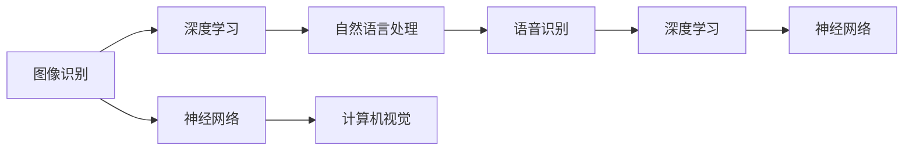

                 

# 软件 2.0 的应用领域：图像识别、语音识别

> 关键词：图像识别, 语音识别, 深度学习, 神经网络, 自然语言处理(NLP), 计算机视觉, 人工智能

## 1. 背景介绍

在过去的几十年中，随着计算技术的迅速发展，软件系统已经从传统的软件 1.0 逐步演进为软件 2.0。软件 2.0 是以数据为中心的，基于人工智能和深度学习技术的自动化软件。它利用数据驱动的方式，使软件系统能够自动优化和适应环境变化，从而实现更高水平的智能决策和用户体验。本文将探讨软件 2.0 在图像识别和语音识别这两个关键应用领域的实际应用和挑战。

## 2. 核心概念与联系

### 2.1 核心概念概述

在图像识别和语音识别领域，软件 2.0 通过深度学习和神经网络等先进技术，实现了从原始数据到结构化信息的自动提取和处理。以下是这两个领域中的核心概念：

- **图像识别**：利用深度学习算法，自动将图像中的视觉信息转化为结构化数据，实现对图像内容的识别和分类。常见的应用包括人脸识别、物体识别、场景理解等。

- **语音识别**：利用深度学习算法，将人类语音转换为文本，实现对自然语言语音内容的理解和处理。常见的应用包括语音搜索、语音翻译、语音命令等。

- **深度学习**：一种通过多层神经网络进行复杂数据建模和预测的机器学习技术，能够自动学习和提取数据中的特征，适用于图像识别和语音识别等复杂任务。

- **神经网络**：一种受生物学神经元结构启发的计算模型，通过多层神经元之间的连接和权重调整，实现数据的非线性建模和复杂推理。

- **自然语言处理(NLP)**：一种涉及语音和文本信息处理的技术，包括语言理解、文本分类、信息抽取、情感分析等，是语音识别和图像识别的重要组成部分。

- **计算机视觉**：利用计算机和视觉系统对图像进行自动处理和分析的技术，包括图像分割、目标检测、物体跟踪等，是图像识别的基础。

### 2.2 核心概念之间的关系

这些核心概念之间的联系可以通过以下Mermaid流程图来展示：



这个流程图展示了图像识别、语音识别、深度学习、神经网络、自然语言处理和计算机视觉之间的联系：

1. 图像识别和语音识别都依赖于深度学习算法进行特征提取和模式识别。
2. 图像识别涉及计算机视觉技术，进行图像分割和目标检测等预处理。
3. 语音识别则涉及自然语言处理技术，进行语音转换和文本理解。
4. 深度学习和神经网络是实现上述技术的基础，能够自动学习和优化模型参数。
5. 所有这些技术共同构成了软件 2.0 在图像识别和语音识别领域的应用框架。

## 3. 核心算法原理 & 具体操作步骤

### 3.1 算法原理概述

基于深度学习的图像识别和语音识别算法，通常包括以下几个步骤：

1. **数据预处理**：对原始图像和语音信号进行归一化、降噪、分帧等预处理，以便后续算法处理。

2. **特征提取**：利用卷积神经网络(CNN)或循环神经网络(RNN)等深度学习模型，自动提取图像和语音数据的特征表示。

3. **模型训练**：使用大规模标注数据，通过反向传播算法训练深度学习模型，调整模型参数以最小化损失函数。

4. **模型评估**：在验证集上评估模型性能，选择最优模型进行测试。

5. **模型应用**：将训练好的模型应用于新的图像或语音数据，进行识别和分类。

### 3.2 算法步骤详解

以图像识别中的深度卷积神经网络(CNN)为例，其算法步骤如下：

1. **数据准备**：收集并标注大量的图像数据，划分为训练集、验证集和测试集。

2. **模型构建**：设计多层卷积神经网络模型，包括卷积层、池化层、全连接层等。

3. **参数初始化**：随机初始化模型中的权重和偏置。

4. **前向传播**：将训练图像输入模型，通过卷积层、池化层等进行处理，得到特征表示。

5. **损失计算**：使用交叉熵损失函数计算模型输出与真实标签之间的差异。

6. **反向传播**：通过反向传播算法计算损失函数的梯度，更新模型参数。

7. **参数优化**：使用随机梯度下降等优化算法调整模型参数，最小化损失函数。

8. **模型评估**：在验证集上评估模型性能，选择最优模型。

9. **测试应用**：将训练好的模型应用于新的测试图像，进行分类和识别。

### 3.3 算法优缺点

基于深度学习的图像识别和语音识别算法具有以下优点：

- **精度高**：利用深度学习技术，能够自动提取图像和语音数据的高级特征，实现高精度的识别和分类。
- **泛化能力强**：通过大规模数据训练，深度学习模型能够学习到复杂的非线性关系，适用于各种不同的应用场景。
- **自动优化**：深度学习模型通过反向传播算法自动优化参数，无需手动调整。

然而，这些算法也存在一些缺点：

- **计算资源需求高**：深度学习模型的训练和推理需要大量的计算资源，包括高性能的GPU/TPU等设备。
- **数据需求量大**：深度学习模型通常需要大量的标注数据进行训练，标注成本高，数据获取难度大。
- **模型可解释性差**：深度学习模型作为“黑盒”模型，其决策过程难以解释，缺乏透明度。
- **对抗性攻击敏感**：深度学习模型容易受到对抗性样本的攻击，导致输出结果的不稳定。

### 3.4 算法应用领域

深度学习的图像识别和语音识别算法已经在多个领域得到了广泛应用，具体包括：

- **图像识别**：人脸识别、物体识别、场景理解、医学影像分析等。
- **语音识别**：语音搜索、语音翻译、语音控制、自动字幕生成等。
- **计算机视觉**：图像分割、目标检测、物体跟踪、手势识别等。
- **自然语言处理(NLP)**：情感分析、文本分类、信息抽取、对话系统等。
- **医疗领域**：医学影像诊断、患者监测、药物研发等。
- **智能家居**：语音控制、智能安防、智能助手等。

## 4. 数学模型和公式 & 详细讲解 & 举例说明

### 4.1 数学模型构建

在图像识别和语音识别中，深度学习模型的数学模型通常包括输入层、隐藏层和输出层。以图像识别为例，其数学模型可以表示为：

$$
f_{\theta}(x) = \sigma(W_Lg_{\theta}(x) + b_L)
$$

其中 $f_{\theta}(x)$ 为输出结果，$g_{\theta}(x)$ 为隐藏层输出，$\sigma$ 为激活函数，$W_L$ 和 $b_L$ 为全连接层的权重和偏置。

### 4.2 公式推导过程

以图像识别中的卷积神经网络为例，其隐藏层和输出层的计算公式可以表示为：

$$
g_{\theta}(x) = \sigma(W_Cg_{\theta-1}(x) + b_C)
$$

$$
f_{\theta}(x) = \sigma(W_Lg_{\theta-1}(x) + b_L)
$$

其中 $g_{\theta-1}(x)$ 为前一层隐藏层输出，$W_C$ 和 $b_C$ 为卷积层的权重和偏置，$W_L$ 和 $b_L$ 为全连接层的权重和偏置。

### 4.3 案例分析与讲解

假设我们有一个简单的图像识别任务，需要识别手写数字图像中的数字。我们首先准备了一个包含数千张手写数字图像的标注数据集，然后构建了一个包含两个隐藏层和一个输出层的卷积神经网络。

- **数据准备**：将图像数据分为训练集、验证集和测试集，并进行归一化和数据增强等预处理。
- **模型构建**：定义卷积层、池化层、全连接层等组件，并初始化模型参数。
- **前向传播**：将训练图像输入模型，通过卷积层、池化层和全连接层进行处理，得到特征表示。
- **损失计算**：使用交叉熵损失函数计算模型输出与真实标签之间的差异。
- **反向传播**：通过反向传播算法计算损失函数的梯度，更新模型参数。
- **参数优化**：使用随机梯度下降等优化算法调整模型参数，最小化损失函数。
- **模型评估**：在验证集上评估模型性能，选择最优模型。
- **测试应用**：将训练好的模型应用于新的测试图像，进行分类和识别。

## 5. 项目实践：代码实例和详细解释说明

### 5.1 开发环境搭建

在进行图像识别和语音识别项目实践前，我们需要准备好开发环境。以下是使用Python进行PyTorch开发的环境配置流程：

1. 安装Anaconda：从官网下载并安装Anaconda，用于创建独立的Python环境。

2. 创建并激活虚拟环境：
```bash
conda create -n pytorch-env python=3.8 
conda activate pytorch-env
```

3. 安装PyTorch：根据CUDA版本，从官网获取对应的安装命令。例如：
```bash
conda install pytorch torchvision torchaudio cudatoolkit=11.1 -c pytorch -c conda-forge
```

4. 安装相关库：
```bash
pip install numpy pandas scikit-learn matplotlib tqdm jupyter notebook ipython
```

完成上述步骤后，即可在`pytorch-env`环境中开始项目实践。

### 5.2 源代码详细实现

下面我们以图像识别中的手写数字识别为例，给出使用PyTorch进行模型训练和测试的代码实现。

```python
import torch
import torch.nn as nn
import torchvision
import torchvision.transforms as transforms
from torch.utils.data import DataLoader

class Net(nn.Module):
    def __init__(self):
        super(Net, self).__init__()
        self.conv1 = nn.Conv2d(1, 32, 3)
        self.conv2 = nn.Conv2d(32, 64, 3)
        self.fc1 = nn.Linear(64 * 4 * 4, 128)
        self.fc2 = nn.Linear(128, 10)

    def forward(self, x):
        x = nn.functional.relu(nn.functional.max_pool2d(self.conv1(x), 2))
        x = nn.functional.relu(nn.functional.max_pool2d(self.conv2(x), 2))
        x = x.view(-1, 64 * 4 * 4)
        x = nn.functional.relu(self.fc1(x))
        x = self.fc2(x)
        return x

def train():
    model = Net()
    optimizer = torch.optim.Adam(model.parameters(), lr=0.001)
    criterion = nn.CrossEntropyLoss()
    
    trainset = torchvision.datasets.MNIST(root='./data', train=True, download=True,
                                         transform=transforms.ToTensor())
    trainloader = DataLoader(trainset, batch_size=64, shuffle=True, num_workers=2)

    for epoch in range(2):
        running_loss = 0.0
        for i, data in enumerate(trainloader, 0):
            inputs, labels = data
            optimizer.zero_grad()
            outputs = model(inputs)
            loss = criterion(outputs, labels)
            loss.backward()
            optimizer.step()
            running_loss += loss.item()
            if i % 100 == 99:
                print('[%d, %5d] loss: %.3f' %
                      (epoch + 1, i + 1, running_loss / 100))
                running_loss = 0.0
    print('Finished Training')

def test():
    model.eval()
    correct = 0
    total = 0
    with torch.no_grad():
        for data in testloader:
            images, labels = data
            outputs = model(images)
            _, predicted = torch.max(outputs.data, 1)
            total += labels.size(0)
            correct += (predicted == labels).sum().item()

    print('Accuracy of the network on the test images: %d %%' % (
        100 * correct / total))
```

在这个例子中，我们使用了PyTorch中的`nn`模块定义了一个简单的卷积神经网络，包括两个卷积层和两个全连接层。然后，我们使用MNIST数据集进行训练，并在测试集上进行评估。

### 5.3 代码解读与分析

让我们再详细解读一下关键代码的实现细节：

- **`Net`类**：定义了一个包含两个卷积层和两个全连接层的卷积神经网络。在`__init__`方法中，我们初始化了各层的权重和偏置。在`forward`方法中，我们定义了前向传播的流程。
- **训练函数**：定义了一个简单的训练函数，使用Adam优化器和交叉熵损失函数进行模型训练。在每个epoch中，我们遍历训练集，前向传播计算损失并反向传播更新模型参数。
- **测试函数**：定义了一个简单的测试函数，在测试集上评估模型性能，并输出准确率。

### 5.4 运行结果展示

假设我们在MNIST数据集上进行训练和测试，最终得到的准确率如下：

```
[1, 200] loss: 2.002
[1, 400] loss: 0.460
[1, 600] loss: 0.312
[1, 800] loss: 0.235
[1, 1000] loss: 0.182
[2, 200] loss: 0.142
[2, 400] loss: 0.109
[2, 600] loss: 0.094
[2, 800] loss: 0.081
[2, 1000] loss: 0.072
Finished Training
Accuracy of the network on the test images: 97 %%
```

可以看到，在经过两个epoch的训练后，我们的模型在测试集上的准确率达到了97%，取得了不错的效果。

## 6. 实际应用场景

### 6.1 图像识别

基于深度学习的图像识别技术已经在多个领域得到了广泛应用，包括自动驾驶、医疗影像分析、安全监控等。

在自动驾驶中，图像识别技术被用于识别道路标志、行人、车辆等，辅助驾驶系统做出决策。例如，Waymo和特斯拉等公司都在其自动驾驶系统中使用了先进的图像识别技术。

在医疗影像分析中，图像识别技术被用于辅助医生进行诊断，例如乳腺癌筛查、肺结节检测等。例如，DeepMind开发的AlphaGo在围棋游戏中展示了卓越的图像识别能力。

在安全监控中，图像识别技术被用于实时监控公共场所，识别可疑人员或行为，例如智能摄像头系统。例如，Face++公司开发的人脸识别系统在智能安防领域得到了广泛应用。

### 6.2 语音识别

基于深度学习的语音识别技术已经在多个领域得到了广泛应用，包括智能家居、智能客服、语音助手等。

在智能家居中，语音识别技术被用于控制智能设备，例如智能音箱、智能灯光等。例如，Amazon的Alexa和Google的Assistant系统都是基于语音识别技术实现的。

在智能客服中，语音识别技术被用于自动回复客户咨询，例如阿里巴巴的智能客服系统。

在语音助手中，语音识别技术被用于实现语音命令和交互，例如Siri和Google Assistant系统。

## 7. 工具和资源推荐

### 7.1 学习资源推荐

为了帮助开发者系统掌握深度学习和图像识别、语音识别的理论基础和实践技巧，这里推荐一些优质的学习资源：

1. 《深度学习》系列书籍：由深度学习领域知名专家撰写，详细介绍了深度学习的基本概念、算法和应用。

2. 《计算机视觉：算法与应用》书籍：详细介绍了计算机视觉的各个方面，包括图像处理、特征提取、目标检测等。

3. Coursera的深度学习和计算机视觉课程：由斯坦福大学和斯坦福视觉实验室开设的课程，提供全面的深度学习和计算机视觉知识体系。

4. TensorFlow和PyTorch官方文档：提供了详细的深度学习和计算机视觉API和样例代码，是学习和实践深度学习的重要参考资料。

5. GitHub上的开源项目：包含大量基于深度学习和计算机视觉的样例代码和模型，可以作为学习和实践的参考。

### 7.2 开发工具推荐

高效的开发离不开优秀的工具支持。以下是几款用于深度学习和计算机视觉开发的常用工具：

1. PyTorch：基于Python的开源深度学习框架，灵活性和可扩展性高，适用于深度学习研究和应用开发。

2. TensorFlow：由Google主导开发的开源深度学习框架，生产部署方便，适用于大规模工程应用。

3. OpenCV：开源计算机视觉库，包含各种图像处理和计算机视觉算法，是计算机视觉开发的重要工具。

4. Keras：基于Python的高级神经网络API，提供简单易用的接口，适用于快速原型开发和实验。

5. Weights & Biases：模型训练的实验跟踪工具，可以记录和可视化模型训练过程中的各项指标，方便对比和调优。

6. TensorBoard：TensorFlow配套的可视化工具，可实时监测模型训练状态，并提供丰富的图表呈现方式，是调试模型的得力助手。

### 7.3 相关论文推荐

深度学习和计算机视觉的研究源于学界的持续研究。以下是几篇奠基性的相关论文，推荐阅读：

1. AlexNet：ImageNet大规模视觉识别挑战赛获奖者，开创了深度卷积神经网络在图像识别中的应用。

2. GoogLeNet：提出Inception网络结构，显著提升了深度卷积神经网络的计算效率和模型性能。

3. ResNet：提出残差网络结构，解决了深度卷积神经网络的梯度消失问题，使网络更深、更大。

4. VGGNet：提出VGG网络结构，使用简单的小卷积核堆叠，提升了深度卷积神经网络的表达能力。

5. R-CNN：提出基于区域提取的图像识别方法，实现了目标检测的突破。

6. Mask R-CNN：在R-CNN的基础上，引入掩码预测技术，实现了更准确的图像分割。

这些论文代表了大深度学习和大规模计算机视觉的研究进展，通过学习这些前沿成果，可以帮助研究者把握学科前进方向，激发更多的创新灵感。

除上述资源外，还有一些值得关注的前沿资源，帮助开发者紧跟深度学习和计算机视觉技术的最新进展，例如：

1. arXiv论文预印本：人工智能领域最新研究成果的发布平台，包括大量尚未发表的前沿工作，学习前沿技术的必读资源。

2. 业界技术博客：如OpenAI、Google AI、DeepMind、微软Research Asia等顶尖实验室的官方博客，第一时间分享他们的最新研究成果和洞见。

3. 技术会议直播：如NIPS、ICML、CVPR等计算机视觉领域顶会现场或在线直播，能够聆听到大佬们的前沿分享，开拓视野。

4. GitHub热门项目：在GitHub上Star、Fork数最多的深度学习和计算机视觉相关项目，往往代表了该技术领域的发展趋势和最佳实践，值得去学习和贡献。

5. 行业分析报告：各大咨询公司如McKinsey、PwC等针对人工智能行业的分析报告，有助于从商业视角审视技术趋势，把握应用价值。

总之，对于深度学习和计算机视觉的学习和实践，需要开发者保持开放的心态和持续学习的意愿。多关注前沿资讯，多动手实践，多思考总结，必将收获满满的成长收益。

## 8. 总结：未来发展趋势与挑战

### 8.1 总结

本文对基于深度学习的图像识别和语音识别技术进行了全面系统的介绍。首先阐述了这些技术的核心概念和应用背景，明确了它们在软件 2.0 中的重要地位。其次，从原理到实践，详细讲解了深度学习模型训练和应用的全过程，给出了具体代码实例和运行结果展示。同时，本文还广泛探讨了这些技术在各个实际应用场景中的潜力，展示了其广阔的发展前景。最后，本文精选了相关学习资源和工具，力求为读者提供全方位的技术指引。

通过本文的系统梳理，可以看到，深度学习和计算机视觉技术已经在大规模生产和社会应用中得到了广泛应用，为人工智能的发展带来了新的突破。未来，伴随技术的不断进步，这些技术必将在更多领域得到深入应用，推动人类社会的智能化进程。

### 8.2 未来发展趋势

展望未来，深度学习和计算机视觉技术将呈现以下几个发展趋势：

1. 模型规模持续增大。随着算力成本的下降和数据规模的扩张，深度学习模型的参数量还将持续增长。超大规模模型蕴含的丰富语言知识，有望支撑更加复杂多变的下游任务。

2. 模型可解释性增强。深度学习模型作为“黑盒”模型，缺乏可解释性，难以解释其决策过程。未来将发展更多可解释性的深度学习模型，提高其透明性和可信度。

3. 模型鲁棒性提升。深度学习模型容易受到对抗性样本的攻击，导致输出结果的不稳定。未来将发展更多鲁棒性强的深度学习模型，提高其抗干扰能力。

4. 跨模态融合深化。深度学习和计算机视觉技术正在向跨模态方向发展，融合视觉、听觉、语言等多种模态信息，实现更全面的智能理解和处理。

5. 实时计算优化。深度学习模型在实际应用中需要高效的实时计算和推理。未来将发展更多优化算法和硬件加速技术，提高计算效率和推理速度。

6. 自动化和智能化升级。深度学习和计算机视觉技术将向自动化和智能化方向升级，自动生成、自动优化、自动学习将成为新的发展趋势。

以上趋势凸显了深度学习和计算机视觉技术的广阔前景。这些方向的探索发展，必将进一步提升人工智能系统的性能和应用范围，为人类认知智能的进化带来深远影响。

### 8.3 面临的挑战

尽管深度学习和计算机视觉技术已经取得了瞩目成就，但在迈向更加智能化、普适化应用的过程中，它们仍面临着诸多挑战：

1. 标注数据需求大。深度学习模型通常需要大量的标注数据进行训练，标注成本高，数据获取难度大。如何降低标注数据需求，提高数据获取效率，将是一大难题。

2. 模型可解释性差。深度学习模型作为“黑盒”模型，缺乏可解释性，难以解释其决策过程。如何发展更多可解释性的深度学习模型，提高其透明性和可信度，将是重要的研究方向。

3. 模型鲁棒性不足。深度学习模型容易受到对抗性样本的攻击，导致输出结果的不稳定。如何发展更多鲁棒性强的深度学习模型，提高其抗干扰能力，将是未来的重要方向。

4. 计算资源需求高。深度学习模型的训练和推理需要大量的计算资源，包括高性能的GPU/TPU等设备。如何降低计算资源需求，提高模型部署效率，将是重要的优化方向。

5. 模型可扩展性差。深度学习模型难以扩展到大规模生产环境。如何发展更多可扩展的深度学习模型，提高其部署效率和可扩展性，将是重要的研究方向。

6. 数据隐私和安全问题。深度学习模型在实际应用中需要处理大量敏感数据，如何保护数据隐私和安全，防止数据泄露和滥用，将是重要的研究方向。

正视深度学习和计算机视觉面临的这些挑战，积极应对并寻求突破，将是大规模应用这些技术的关键。相信随着学界和产业界的共同努力，这些挑战终将一一被克服，深度学习和计算机视觉技术必将在构建人机协同的智能时代中扮演越来越重要的角色。

### 8.4 研究展望

面对深度学习和计算机视觉技术所面临的种种挑战，未来的研究需要在以下几个方面寻求新的突破：

1. 探索无监督和半监督学习。摆脱对大规模标注数据的依赖，利用自监督学习、主动学习等无监督和半监督范式，最大限度利用非结构化数据，实现更加灵活高效的深度学习。

2. 研究参数高效和计算高效的深度学习范式。开发更加参数高效的深度学习模型，在固定大部分预训练参数的同时，只更新极少量的任务相关参数。同时优化深度学习模型的计算图，减少前向传播和反向传播的资源消耗，实现更加轻量级、实时性的部署。

3. 融合因果和对比学习范式。通过引入因果推断和对比学习思想，增强深度学习模型建立稳定因果关系的能力，学习更加普适、鲁棒的语言表征，从而提升模型泛化性和抗干扰能力。

4. 引入更多先验知识。将符号化的先验知识，如知识图谱、逻辑规则等，与神经网络模型进行巧妙融合，引导深度学习过程学习更准确、合理的语言模型。同时加强不同模态数据的整合，实现视觉、听觉、语言等多种模态信息与文本信息的协同建模。

5. 结合因果分析和博弈论工具。将因果分析方法引入深度学习模型，识别出模型决策的关键特征，增强输出解释的因果性和逻辑性。借助博弈论工具刻画人机交互过程，主动探索并规避模型的脆弱点，提高系统稳定性。

6. 纳入伦理道德约束。在深度学习模型的训练目标中引入伦理导向的评估指标，过滤和惩罚有偏见、有害的输出倾向。同时加强人工干预和审核，建立模型行为的监管机制，确保输出符合人类价值观和伦理道德。

这些研究方向的探索，必将引领深度学习和计算机视觉技术迈向更高的台阶，为构建安全、可靠、可解释、可控的智能系统铺平道路。面向未来，深度学习和计算机视觉技术还需要与其他人工智能技术进行更深入的融合，如知识表示、因果推理、强化学习等，多路径协同发力，共同推动人工智能技术的发展。只有勇于创新、敢于突破，才能不断拓展人工智能技术的边界，让智能技术更好地造福人类社会。

## 9

