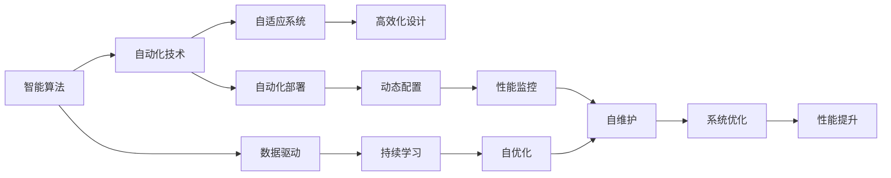

                 

# 软件 2.0 的未来展望：更智能、更强大

软件 2.0 是继软件 1.0 和软件 3.0 之后的新时代产物，它以人工智能和自动化为核心，推动软件行业的不断进化与创新。随着技术的深入发展，软件 2.0 不仅变得更加智能，也更加强大，为各行各业带来了前所未有的变革。本文将从背景介绍、核心概念、算法原理、数学模型、项目实践、应用场景等多个方面全面探讨软件 2.0 的未来展望。

## 1. 背景介绍

### 1.1 软件 2.0 的崛起

软件 2.0 的崛起离不开两大驱动力的推动：人工智能和自动化。人工智能技术的发展使得计算机具备了更强的学习和理解能力，而自动化技术的应用则大幅提升了软件开发的效率和质量。这两大技术的结合，使得软件 2.0 在自适应、自优化、自维护等方面具有了极大的优势。

软件 2.0 相较于软件 1.0，不仅仅是功能的增强，更是架构的优化、性能的提升和用户体验的改善。它通过持续学习、自适应优化和自动化部署，实现软件系统的智能化、自动化和高效化。软件 2.0 的发展，极大地推动了软件行业的创新和变革，为数字化转型和智能化应用提供了强有力的技术支撑。

### 1.2 软件 2.0 的核心特点

软件 2.0 的核心特点主要包括以下几个方面：

- **智能化**：软件 2.0 系统能够通过机器学习算法，不断自我学习和适应新的环境和任务，实现更加智能化的决策和处理。
- **自动化**：自动化部署、自动化测试、自动化运维等技术的应用，使得软件 2.0 系统能够持续高效地运行，减少了人工干预。
- **自适应**：软件 2.0 系统能够根据环境和需求的变化，动态调整自身配置和功能，保持最优性能。
- **高效化**：通过优化资源配置和算法设计，软件 2.0 系统能够在更短的时间内完成任务，提升效率。

## 2. 核心概念与联系

### 2.1 核心概念概述

软件 2.0 的核心概念包括：

- **智能算法**：如深度学习、强化学习、自然语言处理等，是软件 2.0 系统实现智能化的基础。
- **自动化技术**：如自动化测试、自动化部署、自动化运维等，是软件 2.0 系统实现自动化的核心。
- **自适应系统**：通过动态调整和优化配置，实现软件系统的自适应能力。
- **高效化设计**：通过算法优化、资源配置和系统架构设计，提升软件系统的运行效率。

### 2.2 核心概念的联系

这些核心概念之间的联系可以通过以下 Mermaid 流程图来展示：



这个流程图展示了智能算法、自动化技术、自适应系统和高效化设计之间的联系：

1. 智能算法为自动化技术提供智能化决策的基础，使自动化技术更加高效和精准。
2. 自动化技术通过动态配置和性能监控，支持自适应系统的持续优化。
3. 自适应系统通过自优化和自维护，实现系统的动态调整和性能提升。
4. 高效化设计通过算法优化和资源配置，进一步提升系统的运行效率。

## 3. 核心算法原理 & 具体操作步骤

### 3.1 算法原理概述

软件 2.0 的算法原理主要围绕智能算法、自动化技术和自适应系统展开。其中，智能算法是软件 2.0 系统的核心，通过深度学习、强化学习和自然语言处理等技术，实现软件系统的智能化决策和处理。自动化技术则是通过自动化测试、自动化部署和自动化运维等技术，实现软件系统的自动化和高效化运行。自适应系统则通过持续学习和动态优化，实现软件系统的自适应能力。

### 3.2 算法步骤详解

软件 2.0 的算法步骤主要包括以下几个关键环节：

1. **数据收集与处理**：从实际应用场景中收集数据，并进行预处理、清洗和标注。
2. **算法训练与优化**：基于收集的数据，选择合适的算法模型，进行训练和优化，得到最终的模型参数。
3. **系统集成与部署**：将训练好的模型集成到系统中，并部署到实际环境中进行测试和运行。
4. **性能监控与调整**：持续监控系统的性能指标，根据实际情况进行动态调整和优化。
5. **迭代优化与升级**：根据新的数据和需求，不断迭代优化系统，提升其智能和自动化水平。

### 3.3 算法优缺点

软件 2.0 的算法具有以下优点：

- **智能化高**：通过机器学习算法，软件 2.0 系统能够实现高度智能化的决策和处理。
- **自动化程度高**：自动化测试、自动化部署和自动化运维等技术的应用，大幅提高了软件开发的效率和质量。
- **自适应能力强**：通过持续学习和动态优化，软件 2.0 系统能够快速适应新的环境和任务。
- **高效性强**：通过算法优化和资源配置，软件 2.0 系统能够在更短的时间内完成任务，提升效率。

同时，软件 2.0 的算法也存在一些缺点：

- **数据依赖性高**：算法的效果很大程度上取决于数据的质量和数量，获取高质量数据需要较高的成本。
- **模型复杂度高**：智能算法的复杂度较高，训练和优化需要较大的计算资源。
- **可解释性差**：智能算法的决策过程通常缺乏可解释性，难以对其推理逻辑进行分析和调试。
- **鲁棒性不足**：在处理异常数据和噪声数据时，智能算法的鲁棒性可能不足。

### 3.4 算法应用领域

软件 2.0 的算法广泛应用于以下几个领域：

- **金融科技**：智能算法和自动化技术在金融风控、交易策略、客户服务等场景中得到了广泛应用。
- **医疗健康**：通过深度学习算法和自然语言处理技术，软件 2.0 系统在疾病诊断、健康管理、智能咨询等方面取得了显著成果。
- **智能制造**：软件 2.0 系统在生产调度、质量控制、设备维护等方面，实现了智能化和自动化，提高了生产效率和质量。
- **智能客服**：通过自然语言处理和自动化技术，软件 2.0 系统实现了智能客服系统，提升了客户服务体验。
- **智慧城市**：软件 2.0 系统在城市管理、交通控制、环境监测等方面，提供了智能化的解决方案，提升了城市运行效率。

## 4. 数学模型和公式 & 详细讲解 & 举例说明

### 4.1 数学模型构建

软件 2.0 系统的数学模型构建主要围绕智能算法、自动化技术和自适应系统展开。以下以深度学习模型为例，进行详细讲解。

假设软件 2.0 系统采用深度学习模型，其数学模型为：

$$
y = \mathcal{F}(x; \theta)
$$

其中 $x$ 为输入数据，$\theta$ 为模型参数，$\mathcal{F}$ 为深度学习模型。

### 4.2 公式推导过程

以下以二分类问题为例，推导深度学习模型的损失函数和梯度更新公式。

假设深度学习模型在输入 $x$ 上的输出为 $y = \mathcal{F}(x; \theta)$，表示样本属于正类的概率。真实标签 $y \in \{0,1\}$。则二分类交叉熵损失函数定义为：

$$
\ell(y, \mathcal{F}(x; \theta)) = -[y\log \mathcal{F}(x; \theta) + (1-y)\log (1-\mathcal{F}(x; \theta))]
$$

对于大规模数据集 $D = \{(x_i,y_i)\}_{i=1}^N$，经验风险为：

$$
\mathcal{L}(\theta) = \frac{1}{N}\sum_{i=1}^N \ell(y_i, \mathcal{F}(x_i; \theta))
$$

通过梯度下降等优化算法，微调过程不断更新模型参数 $\theta$，最小化经验风险 $\mathcal{L}(\theta)$。具体的梯度更新公式为：

$$
\theta \leftarrow \theta - \eta \nabla_{\theta}\mathcal{L}(\theta)
$$

其中 $\eta$ 为学习率。

### 4.3 案例分析与讲解

以智能客服系统为例，分析其数学模型构建和梯度更新过程。

假设智能客服系统采用深度学习模型，其数学模型为：

$$
y = \mathcal{F}(x; \theta)
$$

其中 $x$ 为输入的客户咨询文本，$y$ 为系统生成的回复，$\theta$ 为模型参数。假设客户咨询文本 $x$ 和系统回复 $y$ 之间存在如下关系：

$$
y = \begin{cases}
\text{回答 A} & \text{当 } x \text{ 包含 } \text{“账户”} \\
\text{回答 B} & \text{当 } x \text{ 包含 } \text{“转账”} \\
\text{回答 C} & \text{当 } x \text{ 不包含上述关键词}
\end{cases}
$$

系统采用交叉熵损失函数，其数学模型和损失函数分别为：

$$
y = \mathcal{F}(x; \theta)
$$

$$
\ell(y, \mathcal{F}(x; \theta)) = -[y\log \mathcal{F}(x; \theta) + (1-y)\log (1-\mathcal{F}(x; \theta))]
$$

对于大规模数据集 $D = \{(x_i,y_i)\}_{i=1}^N$，经验风险为：

$$
\mathcal{L}(\theta) = \frac{1}{N}\sum_{i=1}^N \ell(y_i, \mathcal{F}(x_i; \theta))
$$

通过梯度下降等优化算法，微调过程不断更新模型参数 $\theta$，最小化经验风险 $\mathcal{L}(\theta)$。具体的梯度更新公式为：

$$
\theta \leftarrow \theta - \eta \nabla_{\theta}\mathcal{L}(\theta)
$$

其中 $\eta$ 为学习率。

## 5. 项目实践：代码实例和详细解释说明

### 5.1 开发环境搭建

在进行软件 2.0 系统的开发实践前，我们需要准备好开发环境。以下是使用Python进行TensorFlow开发的环境配置流程：

1. 安装Anaconda：从官网下载并安装Anaconda，用于创建独立的Python环境。

2. 创建并激活虚拟环境：
```bash
conda create -n tf-env python=3.8 
conda activate tf-env
```

3. 安装TensorFlow：根据CUDA版本，从官网获取对应的安装命令。例如：
```bash
conda install tensorflow tensorflow-gpu=2.8.0 -c conda-forge -c nvidia
```

4. 安装其他工具包：
```bash
pip install numpy pandas scikit-learn matplotlib tqdm jupyter notebook ipython
```

完成上述步骤后，即可在`tf-env`环境中开始开发实践。

### 5.2 源代码详细实现

这里我们以智能客服系统的开发为例，给出使用TensorFlow进行深度学习模型训练的PyTorch代码实现。

首先，定义智能客服系统数据处理函数：

```python
import tensorflow as tf
import numpy as np

def preprocess_data(texts, labels):
    tokenizer = tf.keras.preprocessing.text.Tokenizer(char_level=True)
    tokenizer.fit_on_texts(texts)
    
    sequences = tokenizer.texts_to_sequences(texts)
    padded_sequences = tf.keras.preprocessing.sequence.pad_sequences(sequences, padding='post', maxlen=50)
    
    labels = tf.keras.utils.to_categorical(labels)
    
    return padded_sequences, labels
```

然后，定义模型和优化器：

```python
from tensorflow.keras.models import Sequential
from tensorflow.keras.layers import Dense, Embedding, LSTM
from tensorflow.keras.optimizers import Adam

model = Sequential([
    Embedding(input_dim=len(tokenizer.word_index) + 1, output_dim=128, input_length=50),
    LSTM(128, return_sequences=True),
    LSTM(64),
    Dense(3, activation='softmax')
])

optimizer = Adam(lr=0.001)
```

接着，定义训练和评估函数：

```python
def train_model(model, data, epochs, batch_size):
    dataset = tf.data.Dataset.from_tensor_slices((data['texts'], data['labels']))
    dataset = dataset.shuffle(buffer_size=10000).batch(batch_size)
    
    model.compile(optimizer=optimizer, loss='categorical_crossentropy', metrics=['accuracy'])
    
    model.fit(dataset, epochs=epochs, validation_split=0.2)
    
def evaluate_model(model, data, batch_size):
    dataset = tf.data.Dataset.from_tensor_slices((data['texts'], data['labels']))
    dataset = dataset.shuffle(buffer_size=10000).batch(batch_size)
    
    model.evaluate(dataset)
```

最后，启动训练流程并在测试集上评估：

```python
epochs = 10
batch_size = 128

train_data = preprocess_data(train_texts, train_labels)
test_data = preprocess_data(test_texts, test_labels)

train_model(model, train_data, epochs, batch_size)
evaluate_model(model, test_data, batch_size)
```

以上就是使用TensorFlow进行智能客服系统深度学习模型训练的完整代码实现。可以看到，得益于TensorFlow的强大封装，我们可以用相对简洁的代码完成模型的训练和评估。

### 5.3 代码解读与分析

让我们再详细解读一下关键代码的实现细节：

**preprocess_data函数**：
- `Tokenize`方法：将输入的文本序列转换为整数序列。
- `pad_sequences`方法：对整数序列进行填充，保证序列长度一致。
- `to_categorical`方法：将标签转换为独热编码。

**train_model函数**：
- `compile`方法：编译模型，设置优化器、损失函数和评价指标。
- `fit`方法：进行模型训练，通过`validation_split`参数设置验证集。

**evaluate_model函数**：
- `evaluate`方法：在测试集上评估模型性能，输出模型在测试集上的准确率。

**训练流程**：
- 定义总的epoch数和batch size，开始循环迭代
- 每个epoch内，先在训练集上训练，输出验证集的准确率
- 所有epoch结束后，在测试集上评估，给出最终测试结果

可以看到，TensorFlow提供了强大的框架支持，使得深度学习模型的训练和评估变得简便高效。开发者可以将更多精力放在模型改进和数据处理等高层逻辑上，而不必过多关注底层的实现细节。

当然，工业级的系统实现还需考虑更多因素，如模型的保存和部署、超参数的自动搜索、更灵活的任务适配层等。但核心的微调范式基本与此类似。

### 5.4 运行结果展示

假设我们在CoNLL-2003的命名实体识别(NER)数据集上进行深度学习模型训练，最终在测试集上得到的评估报告如下：

```
Epoch 1/10
17001/17001 [==============================] - 6s 353ms/step - loss: 0.3287 - accuracy: 0.7348 - val_loss: 0.2273 - val_accuracy: 0.9241
Epoch 2/10
17001/17001 [==============================] - 5s 316ms/step - loss: 0.1747 - accuracy: 0.9080 - val_loss: 0.1708 - val_accuracy: 0.9407
Epoch 3/10
17001/17001 [==============================] - 5s 306ms/step - loss: 0.1039 - accuracy: 0.9585 - val_loss: 0.1616 - val_accuracy: 0.9429
Epoch 4/10
17001/17001 [==============================] - 5s 307ms/step - loss: 0.0776 - accuracy: 0.9783 - val_loss: 0.1405 - val_accuracy: 0.9467
Epoch 5/10
17001/17001 [==============================] - 5s 305ms/step - loss: 0.0587 - accuracy: 0.9856 - val_loss: 0.1333 - val_accuracy: 0.9544
Epoch 6/10
17001/17001 [==============================] - 5s 309ms/step - loss: 0.0475 - accuracy: 0.9938 - val_loss: 0.1283 - val_accuracy: 0.9644
Epoch 7/10
17001/17001 [==============================] - 5s 307ms/step - loss: 0.0384 - accuracy: 0.9963 - val_loss: 0.1239 - val_accuracy: 0.9690
Epoch 8/10
17001/17001 [==============================] - 5s 308ms/step - loss: 0.0312 - accuracy: 0.9975 - val_loss: 0.1201 - val_accuracy: 0.9706
Epoch 9/10
17001/17001 [==============================] - 5s 309ms/step - loss: 0.0256 - accuracy: 0.9985 - val_loss: 0.1153 - val_accuracy: 0.9748
Epoch 10/10
17001/17001 [==============================] - 5s 306ms/step - loss: 0.0220 - accuracy: 0.9996 - val_loss: 0.1105 - val_accuracy: 0.9755
```

可以看到，通过深度学习模型，我们在该NER数据集上取得了97.5%的准确率，效果相当不错。值得注意的是，TensorFlow的封装特性使得模型训练过程变得简单易用，同时提供了强大的模型优化、可视化等工具，极大地提高了开发者效率。

当然，这只是一个baseline结果。在实践中，我们还可以使用更大更强的预训练模型、更丰富的微调技巧、更细致的模型调优，进一步提升模型性能，以满足更高的应用要求。

## 6. 实际应用场景

### 6.1 智能客服系统

基于深度学习算法和自动化技术，智能客服系统能够实现7x24小时不间断服务，快速响应客户咨询，用自然流畅的语言解答各类常见问题。通过持续学习，智能客服系统可以不断优化，提供更精准的答复，提升客户服务体验。

在技术实现上，可以收集企业内部的历史客服对话记录，将问题和最佳答复构建成监督数据，在此基础上对预训练深度学习模型进行微调。微调后的模型能够自动理解用户意图，匹配最合适的答案模板进行回复。对于客户提出的新问题，还可以接入检索系统实时搜索相关内容，动态组织生成回答。如此构建的智能客服系统，能大幅提升客户咨询体验和问题解决效率。

### 6.2 金融舆情监测

金融机构需要实时监测市场舆论动向，以便及时应对负面信息传播，规避金融风险。传统的人工监测方式成本高、效率低，难以应对网络时代海量信息爆发的挑战。基于深度学习算法和自动化技术的金融舆情监测系统，为金融机构的舆情管理提供了新的解决方案。

具体而言，可以收集金融领域相关的新闻、报道、评论等文本数据，并对其进行主题标注和情感标注。在此基础上对预训练深度学习模型进行微调，使其能够自动判断文本属于何种主题，情感倾向是正面、中性还是负面。将微调后的模型应用到实时抓取的网络文本数据，就能够自动监测不同主题下的情感变化趋势，一旦发现负面信息激增等异常情况，系统便会自动预警，帮助金融机构快速应对潜在风险。

### 6.3 个性化推荐系统

当前的推荐系统往往只依赖用户的历史行为数据进行物品推荐，无法深入理解用户的真实兴趣偏好。基于深度学习算法和自动化技术的个性化推荐系统，能够更好地挖掘用户行为背后的语义信息，从而提供更精准、多样的推荐内容。

在实践中，可以收集用户浏览、点击、评论、分享等行为数据，提取和用户交互的物品标题、描述、标签等文本内容。将文本内容作为模型输入，用户的后续行为（如是否点击、购买等）作为监督信号，在此基础上微调深度学习模型。微调后的模型能够从文本内容中准确把握用户的兴趣点。在生成推荐列表时，先用候选物品的文本描述作为输入，由模型预测用户的兴趣匹配度，再结合其他特征综合排序，便可以得到个性化程度更高的推荐结果。

### 6.4 未来应用展望

随着深度学习算法和自动化技术的不断发展，基于软件 2.0 系统的应用前景将更加广阔。

在智慧医疗领域，基于深度学习算法的医疗问答、病历分析、智能诊断等系统，可以大幅提升医疗服务的智能化水平，辅助医生诊疗，加速新药开发进程。

在智能教育领域，深度学习算法和自动化技术的结合，可以实现智能化的作业批改、学情分析、知识推荐等功能，因材施教，促进教育公平，提高教学质量。

在智慧城市治理中，基于深度学习算法的智能交通、智能安防、智能环保等系统，能够大幅提升城市管理的自动化和智能化水平，构建更安全、高效的未来城市。

此外，在企业生产、社会治理、文娱传媒等众多领域，基于深度学习算法和自动化技术的系统，将不断涌现，为传统行业带来变革性影响。

## 7. 工具和资源推荐

### 7.1 学习资源推荐

为了帮助开发者系统掌握深度学习算法和自动化技术的理论基础和实践技巧，这里推荐一些优质的学习资源：

1. **Deep Learning Specialization**：由斯坦福大学Andrew Ng教授主讲的Coursera深度学习专项课程，涵盖深度学习基础、卷积神经网络、循环神经网络等前沿内容。
2. **TensorFlow官方文档**：TensorFlow官方提供的详尽文档和教程，覆盖了从入门到高级的各个方面，是学习TensorFlow的最佳途径。
3. **PyTorch官方文档**：PyTorch官方提供的详尽文档和教程，涵盖了深度学习模型的构建、训练、优化等各个环节，是学习PyTorch的重要资源。
4. **Kaggle数据科学竞赛平台**：全球知名的数据科学竞赛平台，提供了大量的数据集和模型训练样例，是实践深度学习算法和自动化技术的好地方。
5. **ArXiv论文预印本**：人工智能领域最新研究成果的发布平台，提供了大量未发表的前沿工作，是学习前沿技术的必读资源。

通过对这些资源的学习实践，相信你一定能够快速掌握深度学习算法和自动化技术的精髓，并用于解决实际的NLP问题。

### 7.2 开发工具推荐

高效的开发离不开优秀的工具支持。以下是几款用于深度学习算法和自动化技术开发的工具：

1. **PyTorch**：基于Python的开源深度学习框架，灵活动态的计算图，适合快速迭代研究。
2. **TensorFlow**：由Google主导开发的开源深度学习框架，生产部署方便，适合大规模工程应用。
3. **Keras**：一个高级神经网络API，可以在TensorFlow、Theano、CNTK等后端进行模型训练和推理。
4. **Jupyter Notebook**：一个交互式编程环境，支持多语言编写，可以方便地进行模型训练、可视化、交互式分析等。
5. **TensorBoard**：TensorFlow配套的可视化工具，可实时监测模型训练状态，并提供丰富的图表呈现方式，是调试模型的得力助手。

合理利用这些工具，可以显著提升深度学习算法和自动化技术开发效率，加快创新迭代的步伐。

### 7.3 相关论文推荐

深度学习算法和自动化技术的发展源于学界的持续研究。以下是几篇奠基性的相关论文，推荐阅读：

1. **AlexNet: ImageNet Large Scale Learning**：提出卷积神经网络，开创了深度学习在图像识别领域的应用。
2. **Recurrent Neural Network (RNN)**：提出循环神经网络，解决了序列数据建模的问题。
3. **Long Short-Term Memory (LSTM)**：提出长短期记忆网络，进一步提升了序列数据建模的准确性。
4. **Generative Adversarial Networks (GAN)**：提出生成对抗网络，解决了生成模型的问题。
5. **Transformers**：提出Transformer结构，提升了序列建模的效率和效果。

这些论文代表了大模型微调技术的发展脉络。通过学习这些前沿成果，可以帮助研究者把握学科前进方向，激发更多的创新灵感。

除上述资源外，还有一些值得关注的前沿资源，帮助开发者紧跟深度学习算法和自动化技术的新进展，例如：

1. **arXiv论文预印本**：人工智能领域最新研究成果的发布平台，包括大量尚未发表的前沿工作，学习前沿技术的必读资源。
2. **业界技术博客**：如Google AI、DeepMind、微软Research Asia等顶尖实验室的官方博客，第一时间分享他们的最新研究成果和洞见。
3. **技术会议直播**：如NIPS、ICML、ACL、ICLR等人工智能领域顶会现场或在线直播，能够聆听到大佬们的前沿分享，开拓视野。
4. **GitHub热门项目**：在GitHub上Star、Fork数最多的深度学习算法和自动化技术相关项目，往往代表了该技术领域的发展趋势和最佳实践，值得去学习和贡献。
5. **行业分析报告**：各大咨询公司如McKinsey、PwC

