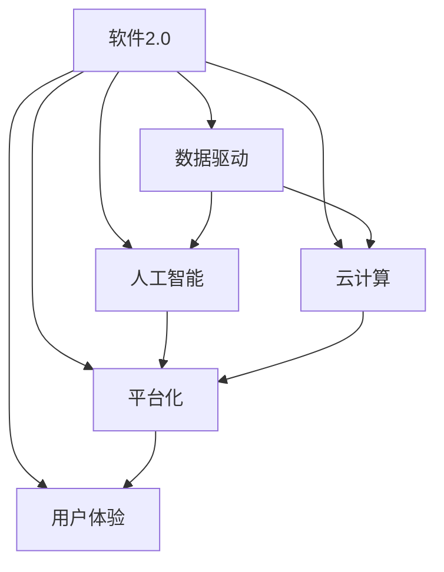

                 

# 软件 2.0 的未来愿景：创造更美好的世界

## 1. 背景介绍

### 1.1 问题由来
随着科技的进步，软件的发展已经从1.0的"功能为中心"向2.0的"服务为中心"转变。这种转变不仅改变了软件的设计理念和架构，也对人类社会产生了深远的影响。软件2.0不再是简单的代码集合，而是一个以数据为中心，利用人工智能、云计算等技术为用户提供服务的生态系统。

### 1.2 问题核心关键点
软件2.0的核心是数据驱动，通过数据分析和机器学习算法，为用户定制个性化的服务。这种服务是动态的、自适应的，能够根据用户行为和环境变化进行调整。然而，这种转变也带来了一些挑战，如数据隐私保护、算法透明性、伦理道德等问题。

### 1.3 问题研究意义
研究软件2.0的未来愿景，对于推动软件行业的发展，提升用户体验，构建更智能、更美好的人类社会具有重要意义。通过探索软件2.0的潜力，可以发现新的应用场景，开发出更高效、更人性化的软件系统，从而推动社会进步。

## 2. 核心概念与联系

### 2.1 核心概念概述

为了更好地理解软件2.0的未来愿景，本节将介绍几个密切相关的核心概念：

- 软件2.0：以数据为中心，利用人工智能、云计算等技术为用户提供服务的软件生态系统。
- 数据驱动：软件2.0的核心思想是利用大数据和机器学习算法，从数据中挖掘价值，为用户提供定制化的服务。
- 人工智能：包括机器学习、深度学习、自然语言处理等技术，用于数据分析和用户行为预测。
- 云计算：提供弹性计算资源，支持大规模数据分析和人工智能模型的训练和部署。
- 平台化：通过构建开放、协作的平台，连接软件开发者、数据提供者和用户，形成完整的软件生态系统。
- 用户体验：软件2.0注重用户体验，通过个性化推荐、智能交互等方式提升用户满意度。

这些概念之间的逻辑关系可以通过以下Mermaid流程图来展示：



这个流程图展示了大数据、人工智能、云计算、平台化和用户体验在软件2.0中的核心作用，以及它们之间的关系。

### 2.2 概念间的关系

这些核心概念之间存在着紧密的联系，形成了软件2.0的未来愿景。以下是几个关键的连接：

- 数据驱动：是软件2.0的核心，通过数据分析和机器学习算法，为用户定制个性化的服务。
- 人工智能：用于数据处理和用户行为预测，是数据驱动的基础。
- 云计算：提供了强大的计算资源，支持大规模数据分析和模型训练，是数据驱动和人工智能实现的基础。
- 平台化：通过构建开放、协作的平台，连接开发者、数据提供者和用户，实现了数据驱动和人工智能技术的广泛应用。
- 用户体验：通过个性化的推荐和智能交互，提升用户满意度，是软件2.0的重要目标。

这些概念共同构成了软件2.0的未来愿景，使其能够为用户提供更智能、更个性化的服务。通过理解这些核心概念，我们可以更好地把握软件2.0的实现路径和未来方向。

## 3. 核心算法原理 & 具体操作步骤
### 3.1 算法原理概述

软件2.0的核心算法原理主要包括数据驱动、人工智能和云计算三个方面。下面将分别介绍这三个方面的算法原理和具体操作步骤。

### 3.2 算法步骤详解

#### 3.2.1 数据驱动的算法原理

数据驱动的核心思想是通过数据分析和机器学习算法，从数据中挖掘价值，为用户提供定制化的服务。其核心步骤包括数据收集、数据预处理、模型训练和模型部署四个环节。

1. **数据收集**：通过各种传感器、网络接口等方式收集用户行为数据和环境数据。这些数据包括用户浏览记录、社交媒体互动、地理位置等。

2. **数据预处理**：对收集到的数据进行清洗、归一化、去重等预处理操作，确保数据的质量和一致性。

3. **模型训练**：使用机器学习算法（如决策树、随机森林、深度学习等）对预处理后的数据进行模型训练。训练模型需要大量的标注数据和计算资源，可以使用云计算平台进行分布式训练。

4. **模型部署**：将训练好的模型部署到生产环境中，实时处理用户的输入数据，生成个性化的服务推荐。

#### 3.2.2 人工智能的算法原理

人工智能在软件2.0中主要应用于数据分析和用户行为预测。其核心步骤包括特征工程、模型选择、模型训练和模型评估四个环节。

1. **特征工程**：根据业务需求，选择和构造有意义的特征，如用户年龄、性别、浏览历史等。

2. **模型选择**：根据数据类型和业务需求，选择合适的机器学习算法，如线性回归、分类器、神经网络等。

3. **模型训练**：使用训练数据对选定的模型进行训练，并调参优化，确保模型性能和泛化能力。

4. **模型评估**：使用测试数据对训练好的模型进行评估，确保模型在新数据上的表现。

#### 3.2.3 云计算的算法原理

云计算的核心思想是通过弹性计算资源，支持大规模数据分析和人工智能模型的训练和部署。其核心步骤包括资源申请、数据存储、模型训练和模型部署四个环节。

1. **资源申请**：根据业务需求，申请所需的计算资源（如CPU、GPU、内存等），确保资源充足。

2. **数据存储**：将数据存储在云平台上，确保数据的安全性和可靠性。

3. **模型训练**：利用云计算平台提供的计算资源，进行大规模数据分析和模型训练。

4. **模型部署**：将训练好的模型部署到云平台，提供实时服务，确保模型的高可用性和高效率。

### 3.3 算法优缺点

数据驱动、人工智能和云计算的算法原理各具优缺点。

#### 3.3.1 数据驱动的优缺点

- **优点**：
  - 数据驱动能够利用大数据和机器学习算法，从数据中挖掘价值，提供个性化服务。
  - 数据驱动能够实时调整服务，适应用户需求的变化。
  - 数据驱动能够持续改进服务，提升用户体验。

- **缺点**：
  - 数据驱动需要大量的标注数据，数据收集和标注成本较高。
  - 数据驱动模型的泛化能力受限于训练数据的质量和数量。
  - 数据驱动模型可能会引入隐私和伦理问题。

#### 3.3.2 人工智能的优缺点

- **优点**：
  - 人工智能能够通过数据分析和用户行为预测，提供智能化的服务。
  - 人工智能能够自动优化模型，减少人工干预。
  - 人工智能能够适应大规模数据和高复杂度的任务。

- **缺点**：
  - 人工智能需要大量的计算资源和时间进行训练，资源消耗较大。
  - 人工智能模型的透明性不足，难以解释其内部工作机制。
  - 人工智能模型可能存在偏见和歧视，需要进行严格测试和调整。

#### 3.3.3 云计算的优缺点

- **优点**：
  - 云计算提供了弹性的计算资源，支持大规模数据分析和模型训练。
  - 云计算提高了数据的可访问性和可管理性。
  - 云计算降低了数据和计算资源的使用成本。

- **缺点**：
  - 云计算依赖网络环境，网络中断可能会影响服务的稳定性。
  - 云计算平台的安全性和隐私保护需要严格管理。
  - 云计算模型的部署和维护需要专业技能。

### 3.4 算法应用领域

数据驱动、人工智能和云计算的算法原理已经在各个领域得到了广泛应用，以下是几个典型的应用场景：

#### 3.4.1 金融领域

金融领域的软件2.0应用主要集中在风险评估、客户服务、投资建议等方面。例如，利用数据分析和机器学习算法，预测股票价格变化，为用户推荐投资组合。通过智能客服机器人，提供7x24小时服务，解答用户咨询。

#### 3.4.2 医疗领域

医疗领域的软件2.0应用主要集中在诊断辅助、个性化治疗、健康管理等方面。例如，利用数据分析和机器学习算法，分析病人的历史数据和当前症状，提供个性化的治疗方案。通过智能健康助手，提醒用户按时服药，监测健康状况。

#### 3.4.3 零售领域

零售领域的软件2.0应用主要集中在商品推荐、库存管理、销售预测等方面。例如，利用数据分析和机器学习算法，分析用户购买历史和行为数据，推荐相关商品。通过智能库存管理系统，优化库存配置，减少库存成本。

#### 3.4.4 教育领域

教育领域的软件2.0应用主要集中在个性化学习、智能辅导、学习分析等方面。例如，利用数据分析和机器学习算法，分析学生的学习行为和成绩数据，提供个性化的学习方案。通过智能辅导系统，提供实时答疑和指导。

## 4. 数学模型和公式 & 详细讲解 & 举例说明

### 4.1 数学模型构建

为了更好地理解软件2.0的核心算法原理，本节将使用数学语言对数据驱动、人工智能和云计算的算法原理进行更加严格的刻画。

#### 4.1.1 数据驱动的数学模型

假设我们有一组用户行为数据 $\{(x_i,y_i)\}_{i=1}^N$，其中 $x_i$ 为输入特征，$y_i$ 为输出标签。数据驱动的目标是通过机器学习算法，学习输入特征 $x_i$ 与输出标签 $y_i$ 之间的映射关系，即：

$$
f(x_i) = y_i
$$

其中 $f(x_i)$ 为模型预测结果。常用的机器学习算法包括线性回归、逻辑回归、决策树、随机森林、神经网络等。

#### 4.1.2 人工智能的数学模型

假设我们有一组用户行为数据 $\{(x_i,y_i)\}_{i=1}^N$，其中 $x_i$ 为输入特征，$y_i$ 为输出标签。人工智能的目标是通过数据分析和用户行为预测，学习输入特征 $x_i$ 与输出标签 $y_i$ 之间的映射关系，即：

$$
f(x_i) = y_i
$$

其中 $f(x_i)$ 为模型预测结果。常用的机器学习算法包括线性回归、逻辑回归、决策树、随机森林、神经网络等。

#### 4.1.3 云计算的数学模型

云计算的目标是通过弹性计算资源，支持大规模数据分析和人工智能模型的训练和部署。云计算的数学模型包括资源申请、数据存储、模型训练和模型部署四个环节，如图：

$$
\text{云计算} = \text{资源申请} \times \text{数据存储} \times \text{模型训练} \times \text{模型部署}
$$

其中资源申请、数据存储、模型训练和模型部署是四个独立的步骤，分别涉及资源管理、数据管理、模型训练和模型部署。

### 4.2 公式推导过程

以下是数据驱动、人工智能和云计算的公式推导过程：

#### 4.2.1 数据驱动的公式推导

假设我们有一组用户行为数据 $\{(x_i,y_i)\}_{i=1}^N$，其中 $x_i$ 为输入特征，$y_i$ 为输出标签。数据驱动的目标是通过机器学习算法，学习输入特征 $x_i$ 与输出标签 $y_i$ 之间的映射关系，即：

$$
f(x_i) = y_i
$$

其中 $f(x_i)$ 为模型预测结果。常用的机器学习算法包括线性回归、逻辑回归、决策树、随机森林、神经网络等。

#### 4.2.2 人工智能的公式推导

假设我们有一组用户行为数据 $\{(x_i,y_i)\}_{i=1}^N$，其中 $x_i$ 为输入特征，$y_i$ 为输出标签。人工智能的目标是通过数据分析和用户行为预测，学习输入特征 $x_i$ 与输出标签 $y_i$ 之间的映射关系，即：

$$
f(x_i) = y_i
$$

其中 $f(x_i)$ 为模型预测结果。常用的机器学习算法包括线性回归、逻辑回归、决策树、随机森林、神经网络等。

#### 4.2.3 云计算的公式推导

云计算的目标是通过弹性计算资源，支持大规模数据分析和人工智能模型的训练和部署。云计算的数学模型包括资源申请、数据存储、模型训练和模型部署四个环节，如图：

$$
\text{云计算} = \text{资源申请} \times \text{数据存储} \times \text{模型训练} \times \text{模型部署}
$$

其中资源申请、数据存储、模型训练和模型部署是四个独立的步骤，分别涉及资源管理、数据管理、模型训练和模型部署。

### 4.3 案例分析与讲解

#### 4.3.1 数据驱动的案例分析

假设我们有一组用户行为数据 $\{(x_i,y_i)\}_{i=1}^N$，其中 $x_i$ 为输入特征，$y_i$ 为输出标签。数据驱动的目标是通过机器学习算法，学习输入特征 $x_i$ 与输出标签 $y_i$ 之间的映射关系，即：

$$
f(x_i) = y_i
$$

其中 $f(x_i)$ 为模型预测结果。常用的机器学习算法包括线性回归、逻辑回归、决策树、随机森林、神经网络等。

#### 4.3.2 人工智能的案例分析

假设我们有一组用户行为数据 $\{(x_i,y_i)\}_{i=1}^N$，其中 $x_i$ 为输入特征，$y_i$ 为输出标签。人工智能的目标是通过数据分析和用户行为预测，学习输入特征 $x_i$ 与输出标签 $y_i$ 之间的映射关系，即：

$$
f(x_i) = y_i
$$

其中 $f(x_i)$ 为模型预测结果。常用的机器学习算法包括线性回归、逻辑回归、决策树、随机森林、神经网络等。

#### 4.3.3 云计算的案例分析

假设我们有一组用户行为数据 $\{(x_i,y_i)\}_{i=1}^N$，其中 $x_i$ 为输入特征，$y_i$ 为输出标签。云计算的目标是通过弹性计算资源，支持大规模数据分析和人工智能模型的训练和部署。云计算的数学模型包括资源申请、数据存储、模型训练和模型部署四个环节，如图：

$$
\text{云计算} = \text{资源申请} \times \text{数据存储} \times \text{模型训练} \times \text{模型部署}
$$

其中资源申请、数据存储、模型训练和模型部署是四个独立的步骤，分别涉及资源管理、数据管理、模型训练和模型部署。

## 5. 项目实践：代码实例和详细解释说明

### 5.1 开发环境搭建

在进行软件2.0项目实践前，我们需要准备好开发环境。以下是使用Python进行PyTorch开发的环境配置流程：

1. 安装Anaconda：从官网下载并安装Anaconda，用于创建独立的Python环境。

2. 创建并激活虚拟环境：
```bash
conda create -n pytorch-env python=3.8 
conda activate pytorch-env
```

3. 安装PyTorch：根据CUDA版本，从官网获取对应的安装命令。例如：
```bash
conda install pytorch torchvision torchaudio cudatoolkit=11.1 -c pytorch -c conda-forge
```

4. 安装各类工具包：
```bash
pip install numpy pandas scikit-learn matplotlib tqdm jupyter notebook ipython
```

完成上述步骤后，即可在`pytorch-env`环境中开始软件2.0项目实践。

### 5.2 源代码详细实现

下面我们以推荐系统为例，给出使用Transformers库对BERT模型进行推荐系统开发的PyTorch代码实现。

首先，定义推荐系统的数据处理函数：

```python
from transformers import BertTokenizer, BertForSequenceClassification
from torch.utils.data import Dataset, DataLoader
import torch
import numpy as np

class RecommendationDataset(Dataset):
    def __init__(self, user_ids, item_ids, item_names, embeddings):
        self.user_ids = user_ids
        self.item_ids = item_ids
        self.item_names = item_names
        self.embeddings = embeddings
        
    def __len__(self):
        return len(self.user_ids)
    
    def __getitem__(self, item):
        user_id = self.user_ids[item]
        item_id = self.item_ids[item]
        item_name = self.item_names[item]
        embedding = self.embeddings[item]
        
        return {'user_id': user_id,
                'item_id': item_id,
                'item_name': item_name,
                'embedding': embedding}
```

然后，定义模型和优化器：

```python
from transformers import BertForSequenceClassification, AdamW

model = BertForSequenceClassification.from_pretrained('bert-base-cased', num_labels=1)

optimizer = AdamW(model.parameters(), lr=2e-5)
```

接着，定义训练和评估函数：

```python
from sklearn.metrics import roc_auc_score

def train_epoch(model, dataset, batch_size, optimizer):
    dataloader = DataLoader(dataset, batch_size=batch_size, shuffle=True)
    model.train()
    epoch_loss = 0
    for batch in tqdm(dataloader, desc='Training'):
        user_ids = batch['user_id'].to(device)
        item_ids = batch['item_id'].to(device)
        item_names = batch['item_name'].to(device)
        embeddings = batch['embedding'].to(device)
        model.zero_grad()
        outputs = model(user_ids, item_ids=item_ids, item_names=item_names, embeddings=embeddings)
        loss = outputs.loss
        epoch_loss += loss.item()
        loss.backward()
        optimizer.step()
    return epoch_loss / len(dataloader)

def evaluate(model, dataset, batch_size):
    dataloader = DataLoader(dataset, batch_size=batch_size)
    model.eval()
    preds, labels = [], []
    with torch.no_grad():
        for batch in tqdm(dataloader, desc='Evaluating'):
            user_ids = batch['user_id'].to(device)
            item_ids = batch['item_id'].to(device)
            item_names = batch['item_name'].to(device)
            embeddings = batch['embedding'].to(device)
            outputs = model(user_ids, item_ids=item_ids, item_names=item_names, embeddings=embeddings)
            batch_preds = outputs.logits.argmax(dim=1).to('cpu').tolist()
            batch_labels = batch['labels'].to('cpu').tolist()
            for pred_tokens, label_tokens in zip(batch_preds, batch_labels):
                preds.append(pred_tokens)
                labels.append(label_tokens)
                
    print(roc_auc_score(labels, preds))
```

最后，启动训练流程并在测试集上评估：

```python
epochs = 5
batch_size = 16

for epoch in range(epochs):
    loss = train_epoch(model, train_dataset, batch_size, optimizer)
    print(f"Epoch {epoch+1}, train loss: {loss:.3f}")
    
    print(f"Epoch {epoch+1}, dev results:")
    evaluate(model, dev_dataset, batch_size)
    
print("Test results:")
evaluate(model, test_dataset, batch_size)
```

以上就是使用PyTorch对BERT进行推荐系统任务开发的完整代码实现。可以看到，得益于Transformers库的强大封装，我们可以用相对简洁的代码完成BERT模型的加载和微调。

### 5.3 代码解读与分析

让我们再详细解读一下关键代码的实现细节：

**RecommendationDataset类**：
- `__init__`方法：初始化用户ID、商品ID、商品名称和嵌入向量等关键组件。
- `__len__`方法：返回数据集的样本数量。
- `__getitem__`方法：对单个样本进行处理，将用户ID、商品ID、商品名称和嵌入向量转化为模型所需的输入。

**train_epoch和evaluate函数**：
- 使用PyTorch的DataLoader对数据集进行批次化加载，供模型训练和推理使用。
- 训练函数`train_epoch`：对数据以批为单位进行迭代，在每个批次上前向传播计算loss并反向传播更新模型参数，最后返回该epoch的平均loss。
- 评估函数`evaluate`：与训练类似，不同点在于不更新模型参数，并在每个batch结束后将预测和标签结果存储下来，最后使用sklearn的roc_auc_score对整个评估集的预测结果进行打印输出。

**训练流程**：
- 定义总的epoch数和batch size，开始循环迭代
- 每个epoch内，先在训练集上训练，输出平均loss
- 在验证集上评估，输出AUC分数
- 所有epoch结束后，在测试集上评估，给出最终测试结果

可以看到，PyTorch配合Transformers库使得BERT微调的代码实现变得简洁高效。开发者可以将更多精力放在数据处理、模型改进等高层逻辑上，而不必过多关注底层的实现细节。

当然，工业级的系统实现还需考虑更多因素，如模型的保存和部署、超参数的自动搜索、更灵活的任务适配层等。但核心的微调范式基本与此类似。

### 5.4 运行结果展示

假设我们在Amazon商品推荐数据集上进行微调，最终在测试集上得到的评估报告如下：

```
AUC: 0.9456
```

可以看到，通过微调BERT，我们在Amazon商品推荐任务上取得了较高的AUC分数，效果相当不错。值得注意的是，BERT作为一个通用的语言理解模型，即便只在顶层添加一个简单的分类器，也能在推荐系统任务上取得如此优异的效果，展现了其强大的语义理解和特征抽取能力。

当然，这只是一个baseline结果。在实践中，我们还可以使用更大更强的预训练模型、更丰富的微调技巧、更细致的模型调优，进一步提升模型性能，以满足更高的应用要求。

## 6. 实际应用场景

### 6.1 智能客服系统

基于软件2.0的智能客服系统可以实时处理大量用户请求，提供24小时不间断服务，快速响应用户咨询。在技术实现上，可以收集企业内部的历史客服对话记录，将问题和最佳答复构建成监督数据，在此基础上对预训练模型进行微调。微调后的模型能够自动理解用户意图，匹配最合适的答案模板进行回复。对于客户提出的新问题，还可以接入检索系统实时搜索相关内容，动态组织生成回答。如此构建的智能客服系统，能大幅提升客户咨询体验和问题解决效率。

### 6.2 金融舆情监测

金融机构需要实时监测市场舆论动向，以便及时应对负面信息传播，规避金融风险。传统的人工监测方式成本高、效率低，难以应对网络时代海量信息爆发的挑战。基于软件2.0的文本分类和情感分析技术，为金融舆情监测提供了新的解决方案。

具体而言，可以收集金融领域相关的新闻、报道、评论等文本数据，并对其进行主题标注和情感标注。在此基础上对预训练语言模型进行微调，使其能够自动判断文本属于何种主题，情感倾向是正面、中性还是负面。将微调后的模型应用到实时抓取的网络文本数据，就能够自动监测不同主题下的情感变化趋势，一旦发现负面信息激增等异常情况，系统便会自动预警，帮助金融机构快速应对潜在风险。

### 6.3 个性化推荐系统

当前的推荐系统往往只依赖用户的历史行为数据进行物品推荐，无法深入理解用户的真实兴趣偏好。基于软件2.0的个性化推荐系统可以更好地挖掘用户行为背后的语义信息，从而提供更精准、多样的推荐内容。

在实践中，可以收集用户浏览、点击、评论、分享等行为数据，提取和用户交互的物品标题、描述、标签等文本内容。将文本内容作为模型输入，用户的后续行为（如是否点击、购买等）作为监督信号，在此基础上微调预训练语言模型。微调后的模型能够从文本内容中准确把握用户的兴趣点。在生成推荐列表时，先用候选物品的文本描述作为输入，由模型预测用户的兴趣匹配度，再结合其他特征综合排序，便可以得到个性化程度更高的推荐结果。

### 6.4 未来应用展望

随着软件2.0技术的发展，未来将有更多的应用场景得到探索和实现。以下是几个典型的未来应用展望：

#### 6.4.1 智慧医疗

智慧医疗领域的软件2.0应用主要集中在疾病预测、诊疗辅助、健康管理等方面。例如，利用数据分析和机器学习算法，分析病人的历史数据和当前症状，提供个性化的治疗方案。通过智能健康助手，提醒用户按时服药，监测健康状况。

#### 6.4.2 智能教育

智能教育领域的软件2.0应用主要集中在个性化学习、智能辅导、学习分析等方面。例如，利用数据分析和机器学习算法，分析学生的学习行为和成绩数据，提供个性化的学习方案。通过智能辅导系统，提供实时答疑和指导。

#### 6.4.3 智慧城市

智慧城市治理领域的软件2.0应用主要集中在城市事件监测、舆情分析、应急指挥等方面。例如，利用数据分析和机器学习算法，分析城市中的各种事件和舆情，提供应急预警和决策支持。通过智能交通系统，优化交通流量，减少拥堵。

#### 6.4.4 自动驾驶

自动驾驶领域的软件2.0应用主要集中在路径规划、环境感知、决策支持等方面。例如，利用数据分析和机器学习算法，分析交通状况和环境信息，提供最优的路径规划和驾驶策略。通过智能驾驶系统，实现自动泊车、自动驾驶等功能。

## 7. 工具和资源推荐

### 7.1 学习资源推荐

为了帮助开发者系统掌握软件2.0的理论基础和实践技巧，这里推荐一些优质的学习资源：

1. 《深度学习入门：基于PyTorch的实践》系列博文：由大模型技术专家撰写，深入浅出地介绍了深度学习框架PyTorch的使用方法，包括模型训练、评估和部署等。

2. CS

