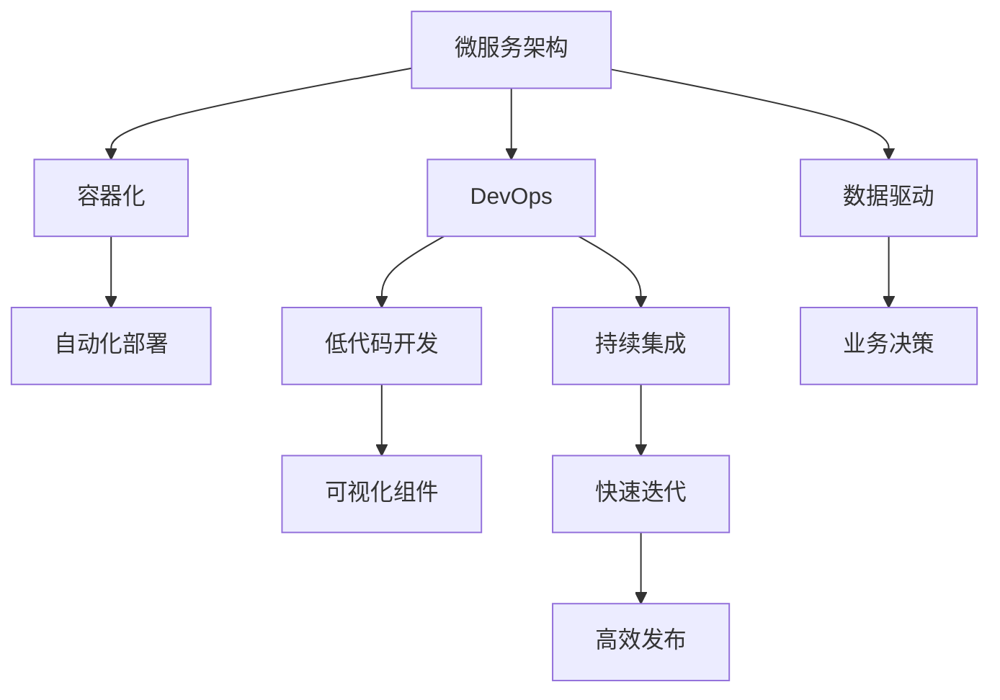

                 

# 软件2.0的技术栈选择策略

## 1. 背景介绍

随着软件工程的发展，“软件2.0”的概念逐渐被提上日程。软件2.0时代，开发者们不再拘泥于传统的前后端分离，而是更加关注代码和服务的复用，通过组件化的方式实现应用的快速迭代和高效部署。但随之而来的，是如何构建一个既满足业务需求，又能够灵活、高效、易于维护的技术栈。

本文将通过深入剖析软件2.0时代的技术栈选择策略，从基础概念入手，逐步介绍如何构建一个合适的技术栈，并探讨其实际应用场景，以及未来发展趋势和面临的挑战。

## 2. 核心概念与联系

### 2.1 核心概念概述

要理解软件2.0时代的技术栈选择策略，首先需要了解以下几个核心概念：

- **微服务架构(Microservices Architecture)**：将单体应用拆分为多个独立的服务模块，每个服务模块专注于某一特定功能，并通过轻量级的通信机制进行协同。

- **容器化(Containerization)**：通过Docker等容器技术，将应用及其依赖打包为独立的镜像，从而实现跨环境、跨平台的一致性部署。

- **DevOps(DevOps)**：通过自动化工具和持续集成持续部署(CI/CD)管道，实现软件的快速迭代和高效发布。

- **低代码开发(Low Code Development)**：利用可视化工具和组件化框架，降低软件开发难度，加快应用开发速度。

- **数据驱动(Data-Driven)**：基于数据和分析，指导业务决策和产品优化。

这些核心概念彼此之间存在紧密的联系，共同构成了软件2.0时代的技术生态。例如，微服务架构使得应用更加灵活，易于维护，而容器化则进一步提升了这种灵活性，确保应用的稳定性和一致性。DevOps和低代码开发则进一步加快了应用的开发和部署速度，而数据驱动则保证了应用决策的科学性和有效性。

### 2.2 概念间的关系

为了更好地理解这些核心概念之间的联系，我们可以通过以下Mermaid流程图来展示：



这个流程图展示了微服务架构与容器化、DevOps、低代码开发和数据驱动之间的联系。通过微服务拆分，容器化部署，DevOps管道和低代码开发，应用可以更快速、更灵活地构建和部署。而数据驱动则保证了应用的决策科学性和业务优化能力。

## 3. 核心算法原理 & 具体操作步骤

### 3.1 算法原理概述

软件2.0时代的技术栈选择策略，本质上是一个多目标优化问题。我们需要在保证应用性能和稳定性前提下，通过技术栈的选择，最大化应用的灵活性、可维护性和开发效率。

具体来说，我们需要考虑以下几个方面：

- **性能和稳定性**：确保应用能够高效运行，提供稳定的服务。
- **灵活性和可维护性**：应用能够快速适应业务变化，便于维护和扩展。
- **开发效率**：通过工具和框架的选择，降低开发难度，加快开发速度。

基于以上目标，我们可以通过以下步骤来构建一个合适的技术栈：

1. **分析业务需求**：了解业务需求和技术挑战，确定应用的核心功能和性能要求。
2. **选择技术栈组件**：根据业务需求，选择适合的技术栈组件，如语言、框架、中间件等。
3. **设计架构**：设计应用的微服务架构，确定各服务模块的功能和通信机制。
4. **实现和部署**：根据架构设计，实现应用的服务模块，并进行容器化部署。
5. **持续集成和部署**：建立CI/CD管道，实现应用的自动化测试和快速发布。
6. **监控和优化**：监控应用性能和资源使用情况，及时优化性能瓶颈。

### 3.2 算法步骤详解

#### 3.2.1 分析业务需求

在构建技术栈之前，首先需要对业务需求进行深入分析，确定应用的核心功能和性能要求。例如，对于电商应用，需要处理高并发请求、用户登录、订单管理等核心功能，性能上需要保证响应时间和系统稳定性。

#### 3.2.2 选择技术栈组件

根据业务需求，选择合适的技术栈组件。例如：

- **编程语言**：根据团队的技术栈偏好和性能需求，选择适合的编程语言。如Java、Python、Go等。
- **框架**：选择合适的Web框架和数据库框架，如Spring Boot、Django、MySQL等。
- **中间件**：选择合适的中间件，如负载均衡、消息队列、缓存等，如Nginx、RabbitMQ、Redis等。
- **容器化工具**：选择合适的容器化工具，如Docker、Kubernetes等。
- **DevOps工具**：选择合适的DevOps工具，如Jenkins、GitLab CI、Ansible等。
- **低代码开发工具**：选择合适的低代码开发工具，如ModelScope、ModelScope Studio等。
- **数据驱动工具**：选择合适的大数据和数据分析工具，如Hadoop、Spark、TensorFlow等。

#### 3.2.3 设计架构

根据业务需求和技术栈组件，设计应用的微服务架构。例如，对于电商应用，可以将用户管理、商品管理、订单管理等服务模块拆分为独立的微服务，并通过RESTful API进行通信。

#### 3.2.4 实现和部署

根据架构设计，实现应用的服务模块，并进行容器化部署。例如，使用Docker将服务模块打包为镜像，并通过Kubernetes进行容器化部署和管理。

#### 3.2.5 持续集成和部署

建立CI/CD管道，实现应用的自动化测试和快速发布。例如，使用Jenkins或GitLab CI构建CI/CD管道，实现代码自动构建、测试和部署。

#### 3.2.6 监控和优化

监控应用性能和资源使用情况，及时优化性能瓶颈。例如，使用Prometheus、Grafana等工具监控应用性能，使用Apmify等工具优化性能瓶颈。

### 3.3 算法优缺点

软件2.0时代的技术栈选择策略有以下优点：

- **灵活性和可维护性**：通过微服务架构和容器化部署，应用能够快速适应业务变化，便于维护和扩展。
- **开发效率**：通过选择合适的技术栈组件和低代码开发工具，降低开发难度，加快开发速度。
- **性能和稳定性**：通过持续集成和部署，确保应用的快速迭代和高效发布，同时通过监控和优化工具，保证应用的性能和稳定性。

同时，该策略也存在以下缺点：

- **复杂性增加**：微服务架构和容器化部署增加了系统的复杂性，需要更高的技术要求。
- **成本增加**：容器化部署和DevOps管道需要额外的硬件和软件投入，增加了成本。
- **开发难度增加**：选择合适的技术栈组件和低代码开发工具需要一定的技术储备和经验积累。

### 3.4 算法应用领域

软件2.0时代的技术栈选择策略，可以应用于以下领域：

- **电商应用**：处理高并发请求、用户登录、订单管理等核心功能，性能上需要保证响应时间和系统稳定性。
- **金融应用**：处理高交易量、高安全性的交易系统、风控系统等。
- **智能制造**：处理物联网设备的实时数据采集和处理，通过微服务架构实现应用的灵活性和可维护性。
- **医疗应用**：处理大量的患者数据和医疗影像，通过数据驱动实现医疗决策的科学性和有效性。
- **智能客服**：处理自然语言理解和生成，通过微服务架构和低代码开发实现系统的灵活性和快速迭代。

## 4. 数学模型和公式 & 详细讲解  
### 4.1 数学模型构建

软件2.0时代的技术栈选择策略，可以通过数学模型来描述。假设应用的功能为 $F$，性能为 $P$，开发成本为 $C$，维护成本为 $M$，则技术栈选择的目标函数为：

$$
\max_{\text{Stack}} F \times P \times (1 - C) \times (1 - M)
$$

其中，$F$ 和 $P$ 为应用的核心功能和性能要求，$C$ 和 $M$ 为开发和维护成本。

### 4.2 公式推导过程

通过以上目标函数，我们可以进一步推导出技术栈选择的具体公式。例如，对于电商应用，我们可以将其分解为以下步骤：

1. **分析业务需求**：确定核心功能和性能要求。例如，电商应用需要处理高并发请求，响应时间在100ms以内，系统可用性在99.99%以上。
2. **选择技术栈组件**：根据业务需求，选择合适的编程语言、框架、中间件等。例如，选择Java语言、Spring Boot框架、Django ORM、Nginx负载均衡、RabbitMQ消息队列、Redis缓存等。
3. **设计架构**：设计微服务架构，例如将用户管理、商品管理、订单管理等服务模块拆分为独立的微服务，并通过RESTful API进行通信。
4. **实现和部署**：实现服务模块，并进行容器化部署。例如，使用Docker将服务模块打包为镜像，并通过Kubernetes进行容器化部署和管理。
5. **持续集成和部署**：建立CI/CD管道，实现应用的自动化测试和快速发布。例如，使用Jenkins或GitLab CI构建CI/CD管道。
6. **监控和优化**：监控应用性能和资源使用情况，及时优化性能瓶颈。例如，使用Prometheus、Grafana等工具监控应用性能，使用Apmify等工具优化性能瓶颈。

### 4.3 案例分析与讲解

#### 4.3.1 电商应用

电商应用是软件2.0技术栈选择策略的一个重要应用场景。电商应用需要处理高并发请求、用户登录、订单管理等核心功能，性能上需要保证响应时间和系统稳定性。例如，对于电商应用，可以按照以下步骤进行技术栈选择：

1. **分析业务需求**：电商应用需要处理高并发请求，响应时间在100ms以内，系统可用性在99.99%以上。
2. **选择技术栈组件**：选择Java语言、Spring Boot框架、Django ORM、Nginx负载均衡、RabbitMQ消息队列、Redis缓存等。
3. **设计架构**：设计微服务架构，将用户管理、商品管理、订单管理等服务模块拆分为独立的微服务，并通过RESTful API进行通信。
4. **实现和部署**：实现服务模块，并进行容器化部署。使用Docker将服务模块打包为镜像，并通过Kubernetes进行容器化部署和管理。
5. **持续集成和部署**：建立CI/CD管道，实现应用的自动化测试和快速发布。使用Jenkins或GitLab CI构建CI/CD管道。
6. **监控和优化**：监控应用性能和资源使用情况，及时优化性能瓶颈。使用Prometheus、Grafana等工具监控应用性能，使用Apmify等工具优化性能瓶颈。

#### 4.3.2 智能客服

智能客服是软件2.0技术栈选择策略的另一个重要应用场景。智能客服需要处理自然语言理解和生成，通过微服务架构和低代码开发实现系统的灵活性和快速迭代。例如，对于智能客服，可以按照以下步骤进行技术栈选择：

1. **分析业务需求**：智能客服需要处理自然语言理解和生成，需要快速适应新的对话场景和用户意图。
2. **选择技术栈组件**：选择Python语言、Flask框架、ModelScope低代码开发工具、Nginx负载均衡、RabbitMQ消息队列、Redis缓存等。
3. **设计架构**：设计微服务架构，将对话理解、意图识别、知识库服务等功能模块拆分为独立的微服务，并通过RESTful API进行通信。
4. **实现和部署**：实现服务模块，并进行容器化部署。使用Docker将服务模块打包为镜像，并通过Kubernetes进行容器化部署和管理。
5. **持续集成和部署**：建立CI/CD管道，实现应用的自动化测试和快速发布。使用Jenkins或GitLab CI构建CI/CD管道。
6. **监控和优化**：监控应用性能和资源使用情况，及时优化性能瓶颈。使用Prometheus、Grafana等工具监控应用性能，使用Apmify等工具优化性能瓶颈。

## 5. 项目实践：代码实例和详细解释说明
### 5.1 开发环境搭建

在进行技术栈选择实践前，我们需要准备好开发环境。以下是使用Python进行Django开发的环境配置流程：

1. 安装Anaconda：从官网下载并安装Anaconda，用于创建独立的Python环境。

2. 创建并激活虚拟环境：
```bash
conda create -n django-env python=3.8 
conda activate django-env
```

3. 安装Django：
```bash
pip install django
```

4. 安装Django REST Framework：
```bash
pip install djangorestframework
```

5. 安装Django ORM：
```bash
pip install django-orm
```

6. 安装Django Admin：
```bash
pip install django-admin
```

完成上述步骤后，即可在`django-env`环境中开始技术栈选择实践。

### 5.2 源代码详细实现

下面我们以电商应用为例，给出使用Django进行技术栈选择的PyTorch代码实现。

首先，定义电商应用的数据处理函数：

```python
from django.db import models

class Product(models.Model):
    name = models.CharField(max_length=255)
    price = models.DecimalField(max_digits=10, decimal_places=2)
    category = models.CharField(max_length=255)
    
class Order(models.Model):
    product = models.ForeignKey(Product, on_delete=models.CASCADE)
    quantity = models.IntegerField()
    customer = models.ForeignKey(Customer, on_delete=models.CASCADE)
```

然后，定义模型和视图：

```python
from django.http import JsonResponse
from django.views.decorators.csrf import csrf_exempt

@csrf_exempt
def get_product(request):
    if request.method == 'GET':
        product_id = request.GET.get('id')
        product = Product.objects.get(id=product_id)
        return JsonResponse({'name': product.name, 'price': product.price, 'category': product.category})
```

最后，启动Django服务器：

```bash
python manage.py runserver
```

### 5.3 代码解读与分析

让我们再详细解读一下关键代码的实现细节：

**Product模型**：
- `__init__`方法：初始化商品名称、价格和类别等关键信息。

**Order模型**：
- `__init__`方法：初始化订单的产品、数量和客户等关键信息。

**get_product视图**：
- `@csrf_exempt`装饰器：忽略CSRF验证，方便进行API调用。
- `if request.method == 'GET'`：判断请求方法是否为GET。
- `product_id = request.GET.get('id')`：从请求参数中获取商品ID。
- `product = Product.objects.get(id=product_id)`：根据ID获取商品对象。
- `return JsonResponse({'name': product.name, 'price': product.price, 'category': product.category})`：将商品信息以JSON格式返回。

**启动Django服务器**：
- `python manage.py runserver`：启动Django服务器，访问`http://localhost:8000/get_product?id=1`，即可获取ID为1的商品信息。

可以看到，Django框架使得技术栈选择的代码实现变得简洁高效。开发者可以将更多精力放在业务逻辑的实现上，而不必过多关注底层的框架细节。

当然，实际应用中还需要考虑更多因素，如Django应用的生产部署、性能优化、安全性等。但核心的技术栈选择逻辑基本与此类似。

## 6. 实际应用场景

### 6.1 智能制造

在智能制造领域，软件2.0技术栈选择策略可以应用于工业物联网设备的实时数据采集和处理。通过微服务架构实现应用的灵活性和可维护性，通过数据驱动实现制造决策的科学性和有效性。

具体而言，可以设计如下架构：

- **数据采集层**：使用IoT设备采集工业设备的实时数据，通过消息队列传输到数据处理层。
- **数据处理层**：使用微服务架构，将数据处理任务拆分为独立的微服务，并通过RESTful API进行通信。
- **数据分析层**：使用大数据和数据分析工具，如Hadoop、Spark、TensorFlow等，对采集数据进行分析和挖掘。
- **应用层**：使用Django框架，将数据分析结果展示给用户，并通过低代码开发工具实现灵活的交互界面。

通过以上架构，可以实现工业物联网设备的实时数据采集、处理和分析，提升制造业的生产效率和决策能力。

### 6.2 医疗应用

在医疗应用领域，软件2.0技术栈选择策略可以应用于电子病历、医疗影像、药物研发等环节。通过微服务架构实现应用的灵活性和可维护性，通过数据驱动实现医疗决策的科学性和有效性。

具体而言，可以设计如下架构：

- **数据采集层**：使用电子病历系统采集患者的病历数据，使用医疗影像设备采集患者的影像数据，使用药物研发平台采集药物的研发数据。
- **数据处理层**：使用微服务架构，将数据处理任务拆分为独立的微服务，并通过RESTful API进行通信。
- **数据分析层**：使用大数据和数据分析工具，如Hadoop、Spark、TensorFlow等，对采集数据进行分析和挖掘。
- **应用层**：使用Django框架，将数据分析结果展示给医生，并通过低代码开发工具实现灵活的交互界面。

通过以上架构，可以实现电子病历、医疗影像、药物研发的数字化和智能化，提升医疗服务的质量和效率。

## 7. 工具和资源推荐
### 7.1 学习资源推荐

为了帮助开发者系统掌握软件2.0时代的技术栈选择策略，这里推荐一些优质的学习资源：

1. **Django官方文档**：Django官方文档，提供了详细的开发指南和最佳实践，是学习Django框架的重要参考资料。

2. **RESTful API设计指南**：了解RESTful API设计的最佳实践，可以帮助开发者设计出高效、可扩展的API接口。

3. **Django REST Framework官方文档**：Django REST Framework官方文档，提供了丰富的功能和使用指南，是开发RESTful API的重要工具。

4. **Kubernetes官方文档**：Kubernetes官方文档，提供了详细的集群部署和管理指南，是学习容器化部署的重要资料。

5. **Prometheus和Grafana官方文档**：Prometheus和Grafana官方文档，提供了详细的监控和可视化工具的使用指南，是监控应用性能的重要工具。

6. **Django Admin官方文档**：Django Admin官方文档，提供了详细的管理和展示界面的使用指南，是构建交互界面的重要工具。

通过对这些资源的学习实践，相信你一定能够快速掌握软件2.0时代的技术栈选择策略，并用于解决实际的业务问题。

### 7.2 开发工具推荐

高效的开发离不开优秀的工具支持。以下是几款用于软件2.0时代技术栈选择开发的常用工具：

1. **Django**：基于Python的开源Web框架，支持快速开发和高效的MVC架构，是构建Web应用的重要工具。

2. **Django REST Framework**：基于Django的RESTful API开发框架，支持自动序列化、认证、权限管理等功能。

3. **Kubernetes**：开源容器编排平台，支持大规模容器化部署和管理，是构建分布式系统的核心工具。

4. **Prometheus**：开源监控系统，支持实时数据采集和分析，是监控应用性能的重要工具。

5. **Grafana**：开源数据可视化平台，支持丰富的图表和仪表盘，是监控应用性能的重要工具。

6. **Django Admin**：基于Django的管理和展示界面，支持后台管理和数据展示，是构建交互界面的重要工具。

7. **Jenkins**：开源持续集成和持续部署工具，支持自动化测试和发布，是构建CI/CD管道的重要工具。

合理利用这些工具，可以显著提升软件2.0时代技术栈选择任务的开发效率，加快创新迭代的步伐。

### 7.3 相关论文推荐

软件2.0时代的技术栈选择策略，源于学界的持续研究。以下是几篇奠基性的相关论文，推荐阅读：

1. **Microservices: A Service-Oriented Architecture and Composition with Principles, Patterns, and Practices**：James Lewis的著作，详细介绍了微服务架构的设计原则和实践经验。

2. **Docker: The Definitive Guide**：Jeffrey F. Sizemore的著作，详细介绍了Docker容器化工具的使用和最佳实践。

3. **CI/CD: The Definitive Guide**：Ronald Wilkins的著作，详细介绍了持续集成和持续部署的最佳实践和工具选择。

4. **Prometheus: The Prometheus Monitoring System**：Prometheus团队开发的监控系统，详细介绍了实时数据采集和分析的实现原理和使用指南。

5. **Grafana: The Visualization and Analytics Platform for Metrics and Logs**：Grafana团队开发的可视化平台，详细介绍了数据可视化的实现原理和使用指南。

这些论文代表了大规模软件系统设计和技术栈选择的最新进展，通过学习这些前沿成果，可以帮助研究者把握学科前进方向，激发更多的创新灵感。

除上述资源外，还有一些值得关注的前沿资源，帮助开发者紧跟软件2.0时代的最新进展，例如：

1. **软件2.0与DevOps的未来**：探讨软件2.0与DevOps的未来发展趋势，以及如何应对软件工程的新挑战。

2. **低代码开发平台的兴起**：分析低代码开发平台的兴起原因，以及如何利用低代码开发平台提升开发效率。

3. **微服务架构的演进**：回顾微服务架构的演进历程，以及如何设计可扩展、可维护的微服务架构。

4. **容器化部署的实践**：分享容器化部署的实践经验，以及如何利用容器化工具实现高效的分布式系统部署。

5. **持续集成与持续部署的实践**：分享持续集成与持续部署的实践经验，以及如何构建高效的CI/CD管道。

6. **实时监控与可视化的实践**：分享实时监控与可视化的实践经验，以及如何利用监控工具提升系统性能。

7. **数据驱动与智能决策的实践**：分享数据驱动与智能决策的实践经验，以及如何利用大数据与人工智能技术提升决策科学性。

通过这些资源的深入学习，相信你一定能够快速掌握软件2.0时代的技术栈选择策略，并用于解决实际的业务问题。

## 8. 总结：未来发展趋势与挑战

### 8.1 总结

本文对软件2.0时代的技术栈选择策略进行了全面系统的介绍。首先阐述了微服务架构、容器化、DevOps、低代码开发、数据驱动等核心概念，明确了技术栈选择策略的核心目标和基本步骤。其次，通过具体案例，详细讲解了如何选择合适的技术栈组件和设计微服务架构，以实现应用的高效开发和部署。最后，探讨了软件2.0时代的应用场景和未来发展趋势，指出了技术栈选择面临的挑战和未来突破方向。

通过本文的系统梳理，可以看到，软件2.0时代的技术栈选择策略，是构建高效、灵活、可维护应用的基石。通过合理的技术栈选择，可以显著提升应用开发效率和系统性能，满足日益增长的业务需求。

### 8.2 未来发展趋势

展望未来，软件2.0时代的技术栈选择策略将呈现以下几个发展趋势：

1. **全栈自动化**：通过全栈自动化工具，实现代码编写、测试、部署、监控的全流程自动化，进一步提升开发效率。

2. **组件化开发**：采用组件化开发框架，如ModelScope、ModelScope Studio等，降低开发难度，加快开发速度。

3. **微服务容器化**：微服务架构与容器化技术深度融合，实现微服务的快速部署和弹性扩展。

4. **低代码与无代码开发**：低代码和无代码开发平台将更加普及，使得开发者能够快速构建和部署应用。

5. **数据驱动与AI融合**：数据驱动与人工智能技术的深度融合，将提升应用的智能决策能力。

6. **多云环境下的管理**：多云环境下的容器化部署和管理，实现应用的灵活和可扩展性。

这些趋势将推动软件2.0时代的技术栈选择策略不断演进，为软件应用带来更多的创新和优化。

### 8.3 面临的挑战

尽管软件2.0时代的技术栈选择策略已经取得了显著成果，但在迈向更加智能化、普适化应用的过程中，它仍面临着诸多挑战：

1. **技术栈复杂性**：微服务架构和容器化部署增加了系统的复杂性，需要更高的技术要求。

2. **开发和部署成本**：容器化部署和DevOps管道需要额外的硬件和软件投入，增加了成本。

3. **持续集成与部署**：持续集成和部署需要建立高效的CI/CD管道，对于复杂的业务场景，开发和部署周期较长。

4. **监控与优化**：实时监控与优化需要投入大量资源，对于大规模应用，监控和优化成本较高。

5. **数据安全与隐私**：数据驱动与人工智能技术的应用，需要解决数据安全和隐私保护问题。

6. **技术栈兼容性**：不同技术栈之间的兼容性和集成性，需要进一步提升。

这些挑战需要通过技术创新和管理优化来解决，才能使软件2.0时代的技术栈选择策略更好地服务于应用开发和系统管理。

### 8.4 研究展望

面对软件2.0时代技术栈选择策略面临的挑战，未来的研究需要在以下几个方面寻求新的突破：

1. **全栈自动化工具**：开发更加高效的全栈自动化工具，实现开发、测试、部署、监控的全流程自动化。

2. **组件化开发框架**：研究和开发更加灵活、易用的组件化开发框架，降低开发难度，加快开发速度。

3. **微服务容器化**：研究微服务架构与容器化技术的深度融合，实现微服务的快速部署和弹性扩展。

