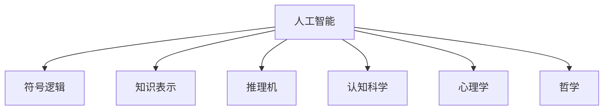
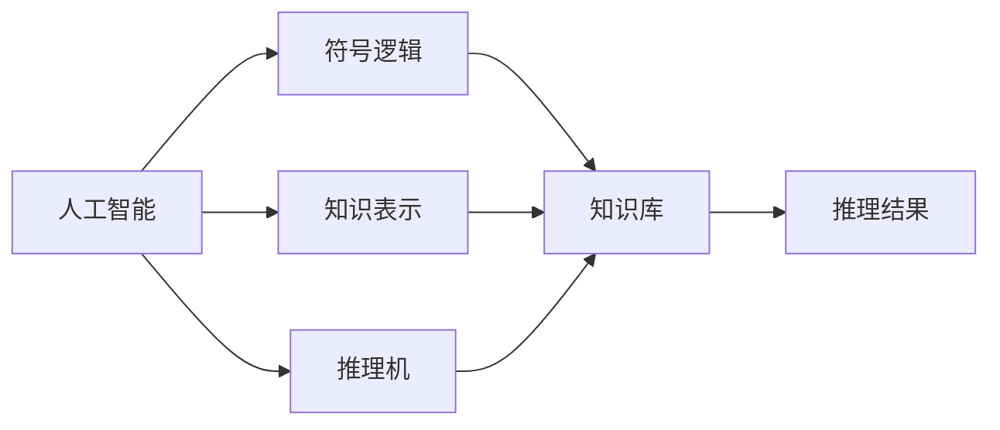
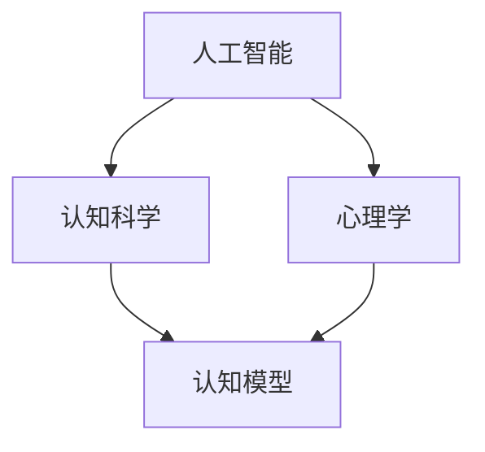
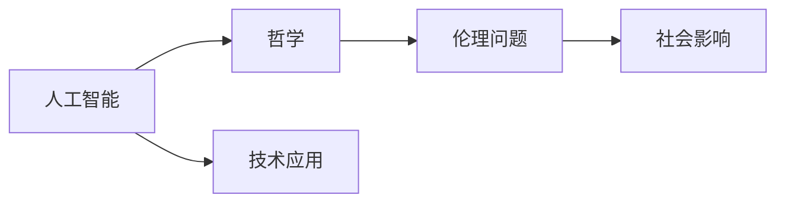
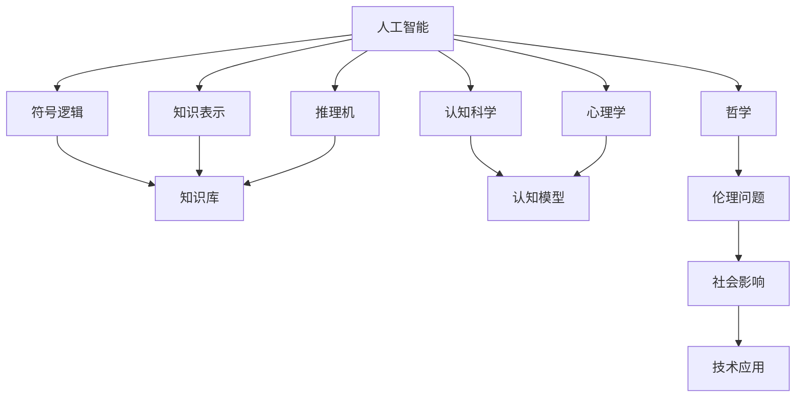

                 

# 达特茅斯会议的历史影响

## 1. 背景介绍

### 1.1 问题由来
1955年，美国新罕布什尔州达特茅斯学院召开了历史上首次人工智能研讨会，由约翰·麦卡锡、马文·明斯基、克劳德·香农等八位先驱科学家发起，这次会议的召开开启了人工智能（Artificial Intelligence, AI）的时代。会议期间，麦卡锡提出了“人工智能是让机器使用人类语言来解决问题”的宣言，使得AI研究从过去基于逻辑和符号推理的狭隘领域，拓展到了计算机科学和认知科学的广阔领域。

### 1.2 问题核心关键点
达特茅斯会议的召开具有划时代的意义，它标志着人工智能作为一个独立的学科领域的诞生。会议的核心议题包括：
- 人工智能的定义与目标：明确提出“人工智能应该实现让机器使用人类语言来解决问题”，确定了AI的研究方向。
- 人工智能的核心技术：引入符号逻辑、知识表示、推理机等基本概念，奠定了AI的技术基础。
- 人工智能的发展前景：讨论了AI在计算机科学、认知科学、心理学、哲学等领域的应用潜力。

## 2. 核心概念与联系

### 2.1 核心概念概述

为更好地理解达特茅斯会议的核心概念，本节将介绍几个密切相关的核心概念：

- 人工智能（AI）：计算机科学的一个分支，旨在使计算机能够执行人类通常需要智能才能完成的任务，如理解自然语言、自主决策、感知环境等。
- 符号逻辑：一种基于形式化规则的推理系统，通过符号表示命题和推理规则，用于知识表示和推理。
- 知识表示：将知识以结构化形式存入计算机中，以支持推理、决策等智能行为。
- 推理机：一种执行符号逻辑推理的算法，根据已知知识自动推导新知识。
- 认知科学：研究人类认知过程及其计算机模拟的科学，旨在揭示人类智能的机制。
- 心理学：研究人类思维和行为的科学，探索智能与心理过程的关系。
- 哲学：探讨智能的本质及其伦理和社会影响的学科。

这些核心概念之间的逻辑关系可以通过以下Mermaid流程图来展示：



这个流程图展示了大会议核心的概念之间的关系：

1. 人工智能涵盖了符号逻辑、知识表示、推理机等多种技术手段。
2. 认知科学、心理学和哲学分别从不同的角度研究智能的本质及其应用。
3. 符号逻辑、知识表示和推理机是AI技术的基础，构建了AI的推理和知识处理机制。
4. 认知科学和心理学帮助理解人类智能的机制，为AI提供了人类智能行为的参考。
5. 哲学对AI的伦理和社会影响进行探讨，指导AI技术的规范使用。

### 2.2 概念间的关系

这些核心概念之间存在着紧密的联系，形成了AI技术的基本框架。以下是几个Mermaid流程图来展示这些概念之间的关系：

#### 2.2.1 AI的技术架构



这个流程图展示了AI技术的核心架构：

1. 符号逻辑、知识表示和推理机是AI技术的主要组成部分。
2. 符号逻辑用于构建知识库，包含命题和推理规则。
3. 知识表示将知识库中的符号结构化，用于推理机的处理。
4. 推理机通过符号逻辑推理，生成新的推理结果，用于控制AI的行为。

#### 2.2.2 认知科学的AI研究



这个流程图展示了认知科学对AI研究的贡献：

1. 认知科学研究人类认知过程，揭示智能的机制。
2. 心理学研究人类思维和行为，为认知科学提供了数据和理论支持。
3. 认知科学和心理学共同构建了认知模型，为AI提供了人类认知的模拟框架。

#### 2.2.3 哲学对AI的伦理思考



这个流程图展示了哲学对AI的伦理思考：

1. 哲学探讨AI的伦理和社会影响。
2. 伦理问题涉及AI的使用规范、隐私保护、决策透明度等问题。
3. AI的技术应用需要遵守伦理规范，确保社会接受和认同。

### 2.3 核心概念的整体架构

最后，我们用一个综合的流程图来展示这些核心概念在大会议背景下的整体架构：



这个综合流程图展示了从符号逻辑到伦理问题，从认知科学到社会影响，AI技术的多层次架构。通过这些核心概念的相互关联，我们可以更清晰地理解达特茅斯会议对AI技术发展方向的奠定和影响。

## 3. 核心算法原理 & 具体操作步骤
### 3.1 算法原理概述

达特茅斯会议提出了基于符号逻辑和知识表示的AI研究框架，核心算法原理可以概括为以下几个方面：

1. **符号逻辑推理**：通过符号逻辑系统，将问题转化为逻辑表达式，并使用推理规则求解。
2. **知识表示**：将知识以命题的形式存储，形成知识库，支持推理机的处理。
3. **推理机**：根据知识库中的命题和推理规则，自动推导出新的命题，更新知识库。

这些算法原理构成了AI的核心逻辑框架，使得AI能够理解和解决问题。

### 3.2 算法步骤详解

以下是基于符号逻辑和知识表示的AI算法步骤：

1. **符号逻辑表示**：将问题转化为符号表达式，包含谓词、个体、运算符等。
2. **知识库构建**：根据领域知识，构建知识库，存储所有已知命题和推理规则。
3. **推理规则定义**：定义推理规则，用于自动推导新命题。
4. **推理机执行**：使用推理机执行符号逻辑推理，自动推导新命题。
5. **推理结果应用**：将推理结果用于控制AI的行为，如问题解答、决策等。

### 3.3 算法优缺点

基于符号逻辑和知识表示的AI算法具有以下优点：

1. **逻辑严谨**：符号逻辑和知识表示提供了形式化推理机制，确保推理过程的逻辑严谨性。
2. **知识复用**：知识库中的命题和规则可以重复使用，提高系统的泛化能力。
3. **可解释性强**：逻辑推理过程清晰可解释，便于理解模型的行为。

同时，这些算法也存在一些缺点：

1. **知识获取困难**：构建知识库需要大量领域知识和专家支持，知识获取成本高。
2. **推理效率低**：符号逻辑推理过程复杂，推理效率较低。
3. **难以处理模糊和不确定性**：符号逻辑难以处理模糊和不确定性的问题，需要引入不确定性推理技术。

### 3.4 算法应用领域

基于符号逻辑和知识表示的AI算法已经在许多领域得到应用：

1. **专家系统**：用于模拟专家知识，提供问题解答和决策支持。
2. **自然语言处理（NLP）**：用于语义分析、文本分类等任务，构建基于规则的NLP系统。
3. **决策支持系统**：用于企业决策支持，基于历史数据和规则进行决策推荐。
4. **智能控制**：用于自动控制和机器人系统，实现智能行为和任务规划。
5. **医疗诊断**：用于医疗诊断和治疗建议，提供基于规则的诊断和决策支持。

## 4. 数学模型和公式 & 详细讲解 & 举例说明（备注：数学公式请使用latex格式，latex嵌入文中独立段落使用 $$，段落内使用 $)
### 4.1 数学模型构建

基于符号逻辑和知识表示的AI算法可以用数学模型来表示。

设符号逻辑问题为 $P$，已知知识库为 $K$，推理规则为 $R$，推理机为 $M$。推理过程可以表示为：

$$ P \in M(K, R) $$

其中 $M$ 为推理机函数，将知识库 $K$ 和推理规则 $R$ 作为输入，输出问题的推理结果 $P$。

### 4.2 公式推导过程

以一个简单的推理问题为例，展示符号逻辑推理的过程：

1. **问题表示**：将问题 $P$ 表示为符号逻辑表达式，如 $P$ 为“If A and B, then C”。
2. **知识库构建**：构建知识库 $K$，包含已知命题，如 $A$、$B$。
3. **推理规则定义**：定义推理规则 $R$，如 $R$ 为“If A and B, then C”。
4. **推理机执行**：使用推理机 $M$ 执行推理，得出新命题 $C$。

### 4.3 案例分析与讲解

以下是一个基于符号逻辑和知识表示的AI推理案例：

假设一个智能推理系统，用于判断一个对象是否为“正方形”。已知知识库包含以下命题：
- $A$：“对象的形状是矩形”。
- $B$：“对象的四个角都相等”。

推理规则为：
- $R$：“If A and B, then C”，其中 $C$ 为“对象是正方形”。

推理过程如下：

1. **问题表示**：$P$ 为“对象是正方形”。
2. **知识库构建**：$K$ 包含 $A$ 和 $B$。
3. **推理规则定义**：$R$ 为“If A and B, then C”。
4. **推理机执行**：推理机 $M$ 根据 $K$ 和 $R$，得出 $C$ 为“对象是正方形”。

推理结果 $C$ 用于控制智能系统的操作，如输出“对象是正方形”的结论。

## 5. 项目实践：代码实例和详细解释说明
### 5.1 开发环境搭建

在进行AI项目实践前，我们需要准备好开发环境。以下是使用Python进行AI开发的环境配置流程：

1. 安装Anaconda：从官网下载并安装Anaconda，用于创建独立的Python环境。

2. 创建并激活虚拟环境：
```bash
conda create -n ai-env python=3.8 
conda activate ai-env
```

3. 安装相关库：
```bash
pip install sympy sympy-solvers
```

4. 准备数据集：
```python
import pandas as pd
from sympy import symbols, Eq, solve

# 读取数据集
data = pd.read_csv('problems.csv')

# 构建符号表达式
X = symbols('x y z')
problems = []
for row in data.itertuples():
    problem = Eq(row.expr, row.answer)
    problems.append(problem)

# 输出问题表示
for problem in problems:
    print(problem)
```

### 5.2 源代码详细实现

我们以符号逻辑推理问题为例，展示基于符号逻辑和知识表示的AI推理代码实现。

```python
from sympy import symbols, Eq, solve, And, Or

# 定义符号
A, B, C = symbols('A B C')

# 定义知识库
knowledge = {A: True, B: True}

# 定义推理规则
rules = {And(A, B): C}

# 定义推理机
def inference(knowledge, rules):
    for rule in rules:
        if rule in knowledge:
            knowledge[rule] = True
    return knowledge

# 推理问题
def solve_problem(knowledge, rules, problem):
    result = inference(knowledge, rules)
    if problem in result:
        return result[problem]
    else:
        return None

# 示例问题
problem = And(A, B)
solution = solve_problem(knowledge, rules, problem)
print(solution)
```

### 5.3 代码解读与分析

让我们再详细解读一下关键代码的实现细节：

**知识库定义**：
- `knowledge` 字典用于存储已知命题，每个命题对应一个布尔值，表示该命题是否为真。

**推理规则定义**：
- `rules` 字典用于存储推理规则，每个规则为一个符号表达式，对应一个结果。

**推理机实现**：
- `inference` 函数根据推理规则，自动推导新命题，更新知识库。
- `solve_problem` 函数用于求解具体问题，返回推理结果。

**示例问题解决**：
- `problem` 为符号表达式，表示待解决的问题。
- `solution` 为推理结果，表示问题是否在知识库中得到解决。

## 6. 实际应用场景

### 6.1 智能控制系统

基于符号逻辑和知识表示的AI算法可以应用于智能控制系统中，实现任务规划和决策支持。例如，在智能机器人系统中，可以使用符号逻辑和知识表示构建环境模型和行为规划，实现路径规划和避障决策。

### 6.2 医疗诊断系统

在医疗诊断系统中，基于符号逻辑和知识表示的AI算法可以用于病历分析和诊断建议。例如，使用符号逻辑表示疾病症状和治疗方法，构建知识库和推理规则，自动推导诊断结果和治疗方案。

### 6.3 金融风险控制系统

在金融风险控制系统中，基于符号逻辑和知识表示的AI算法可以用于风险评估和决策支持。例如，使用符号逻辑表示金融产品的特征和风险因素，构建知识库和推理规则，自动推导风险等级和控制策略。

### 6.4 未来应用展望

未来，基于符号逻辑和知识表示的AI算法将在更多领域得到应用：

1. 智能交通系统：用于交通信号控制和路径规划，提高交通效率和安全。
2. 智能家居系统：用于家庭自动化和智能控制，提升生活便捷性和舒适度。
3. 智能客服系统：用于自然语言处理和决策支持，提供客户咨询和问题解答。

## 7. 工具和资源推荐
### 7.1 学习资源推荐

为了帮助开发者系统掌握符号逻辑和知识表示的理论基础和实践技巧，这里推荐一些优质的学习资源：

1. 《人工智能基础》：介绍AI的基本概念和符号逻辑推理，适合初学者入门。
2. 《知识表示与推理》：深入讲解知识表示和推理机的设计原理，适合中级开发者学习。
3. 《认知科学基础》：介绍认知科学的基本概念和心理学研究，为AI研究提供理论支持。
4. 《哲学与人工智能》：探讨AI的伦理和社会影响，指导AI技术的规范使用。
5. 《Sympy教程》：Sympy库是Python中的符号计算库，适合用于符号逻辑和知识表示的编程实践。

通过这些资源的学习实践，相信你一定能够快速掌握符号逻辑和知识表示的精髓，并用于解决实际的AI问题。

### 7.2 开发工具推荐

高效的开发离不开优秀的工具支持。以下是几款用于AI开发的常用工具：

1. PyTorch：基于Python的开源深度学习框架，支持符号逻辑和知识表示的推理计算。
2. TensorFlow：由Google主导开发的开源深度学习框架，适合大规模工程应用。
3. Sympy：Python中的符号计算库，支持符号逻辑和知识表示的推理计算。
4. Weights & Biases：模型训练的实验跟踪工具，可以记录和可视化推理过程，方便调试和优化。
5. TensorBoard：TensorFlow配套的可视化工具，可实时监测推理状态，提供详细的推理结果。

合理利用这些工具，可以显著提升AI推理任务的开发效率，加快创新迭代的步伐。

### 7.3 相关论文推荐

符号逻辑和知识表示的研究源于学界的持续研究。以下是几篇奠基性的相关论文，推荐阅读：

1. A New Methodology for Automatic Programming（纽卡斯尔研究报告）：提出了基于符号逻辑和知识表示的编程方法，是AI编程语言研究的先驱。
2. Logic Programming（逻辑编程）：LISP语言中的逻辑编程范式，为AI提供了形式化推理机制。
3. KRVL：知识表示与推理语言的创新性研究，提供了多种知识表示和推理规则。
4. PROLOG语言：一种基于逻辑编程的AI编程语言，广泛应用于专家系统和智能推理。
5. OWL语言：Web本体语言，用于表示语义网中的知识，支持逻辑推理和知识共享。

这些论文代表了大会议的技术发展脉络。通过学习这些前沿成果，可以帮助研究者把握学科前进方向，激发更多的创新灵感。

除上述资源外，还有一些值得关注的前沿资源，帮助开发者紧跟符号逻辑和知识表示的最新进展，例如：

1. arXiv论文预印本：人工智能领域最新研究成果的发布平台，包括大量尚未发表的前沿工作，学习前沿技术的必读资源。
2. 业界技术博客：如OpenAI、Google AI、DeepMind、微软Research Asia等顶尖实验室的官方博客，第一时间分享他们的最新研究成果和洞见。
3. 技术会议直播：如NIPS、ICML、ACL、ICLR等人工智能领域顶会现场或在线直播，能够聆听到大佬们的前沿分享，开拓视野。
4. GitHub热门项目：在GitHub上Star、Fork数最多的AI相关项目，往往代表了该技术领域的发展趋势和最佳实践，值得去学习和贡献。
5. 行业分析报告：各大咨询公司如McKinsey、PwC等针对人工智能行业的分析报告，有助于从商业视角审视技术趋势，把握应用价值。

总之，对于符号逻辑和知识表示的研究学习，需要开发者保持开放的心态和持续学习的意愿。多关注前沿资讯，多动手实践，多思考总结，必将收获满满的成长收益。

## 8. 总结：未来发展趋势与挑战
### 8.1 总结

本文对达特茅斯会议的核心概念和算法原理进行了全面系统的介绍。首先阐述了符号逻辑和知识表示的研究背景和意义，明确了符号逻辑推理、知识表示、推理机等核心技术，奠定了AI技术的基础。其次，从原理到实践，详细讲解了符号逻辑和知识表示的数学模型和实现细节，给出了完整的代码实例。同时，本文还广泛探讨了符号逻辑和知识表示在智能控制、医疗诊断、金融风险控制等多个领域的应用前景，展示了符号逻辑和知识表示的广泛应用价值。

通过本文的系统梳理，可以看到，符号逻辑和知识表示技术在大会议的推动下，为AI技术的发展奠定了坚实的基础，极大地拓展了AI的研究方向和应用范围。符号逻辑和知识表示的核心算法原理、实现细节和应用场景，对后续AI技术的演进和发展具有深远的影响。

### 8.2 未来发展趋势

展望未来，符号逻辑和知识表示技术将呈现以下几个发展趋势：

1. **多模态知识表示**：未来的知识表示将不仅仅局限于文本，将扩展到图像、音频、视频等多模态数据，构建多模态知识库。
2. **可解释AI**：符号逻辑和知识表示的推理过程具有可解释性，未来的AI系统将更加注重可解释性和透明性，便于理解和调试。
3. **自动知识生成**：通过机器学习技术，自动生成知识库和推理规则，提高知识表示和推理的效率。
4. **实时推理**：使用流计算和分布式系统，实现实时推理和知识更新，支持动态环境和任务变化。
5. **人机协同**：结合认知科学和心理学研究，探索人机协同的智能系统，增强智能系统的适应性和智能性。

以上趋势凸显了符号逻辑和知识表示技术的广阔前景。这些方向的探索发展，必将进一步提升AI系统的性能和应用范围，为构建更加智能和可靠的AI系统铺平道路。

### 8.3 面临的挑战

尽管符号逻辑和知识表示技术已经取得了瞩目成就，但在迈向更加智能化、普适化应用的过程中，它仍面临着诸多挑战：

1. **知识获取成本高**：构建高质量的知识库需要大量专家知识和领域数据，知识获取成本高。
2. **推理效率低**：符号逻辑推理过程复杂，推理效率较低，难以应对大规模数据处理和实时推理。
3. **缺乏灵活性**：符号逻辑和知识表示的推理过程较为固定，难以灵活应对复杂多变的场景和任务。
4. **可解释性不足**：符号逻辑和知识表示的推理过程复杂，难以解释其内部工作机制和决策逻辑，导致系统难以理解。

### 8.4 研究展望

面对符号逻辑和知识表示面临的这些挑战，未来的研究需要在以下几个方面寻求新的突破：

1. **引入机器学习**：结合符号逻辑和知识表示，引入机器学习技术，自动生成知识库和推理规则，提高知识获取和推理效率。
2. **发展多模态推理**：开发多模态知识表示和推理技术，实现跨模态数据融合和知识整合。
3. **引入常识推理**：通过常识推理技术，增强智能系统对未知和模糊问题的处理能力，提高系统的泛化性和鲁棒性。
4. **开发可解释AI**：结合认知科学和心理学研究，探索可解释AI的实现方法，提高智能系统的透明性和可理解性。
5. **探索人机协同**：结合认知科学和心理学研究，探索人机协同的智能系统，增强智能系统的适应性和智能性。

这些研究方向的探索，必将引领符号逻辑和知识表示技术迈向更高的台阶，为构建安全、可靠、可解释、可控的智能系统铺平道路。面向未来，符号逻辑和知识表示技术还需要与其他人工智能技术进行更深入的融合，如知识表示与深度学习、因果推理与强化学习等，多路径协同发力，共同推动人工智能技术的发展。只有勇于创新、敢于突破，才能不断拓展智能系统的边界，让符号逻辑和知识表示技术在构建智能社会中扮演更加重要的角色。

## 9. 附录：常见问题与解答

**Q1：符号逻辑和知识表示技术适用于哪些场景？**

A: 符号逻辑和知识表示技术适用于需要形式化推理和知识表示的场景，如专家系统、自然语言处理、智能控制等。在需要建立稳定因果关系和逻辑推理的任务中，符号逻辑和知识表示技术具有显著优势。

**Q2：符号逻辑和知识表示的推理效率低，如何解决？**

A: 可以通过优化推理算法、引入分布式推理、使用缓存技术等方法提高推理效率。同时，结合机器学习和统计方法，自动生成知识库和推理规则，提高知识表示和推理的效率。

**Q3：符号逻辑和知识表示的推理过程复杂，如何提高可解释性？**

A: 可以通过引入可解释性技术，如知识图谱、规则库、因果推理等，增强智能系统的透明性和可理解性。同时，结合认知科学和心理学研究，探索人机协同的智能系统，增强智能系统的适应性和智能性。

**Q4：符号逻辑和知识表示的知识获取成本高，如何解决？**

A: 可以通过引入机器学习技术，自动生成知识库和推理规则，提高知识获取和推理效率。同时，引入多模态知识表示和推理技术，扩展知识库的覆盖范围，提高系统的泛化能力和适用性。

**Q5：符号逻辑和知识表示的灵活性不足，如何解决？**

A: 可以通过引入常识推理和语义网络技术，增强系统对未知和模糊问题的处理能力，提高系统的适应性和鲁棒性。同时，结合认知科学和心理学研究，探索人机协同的智能系统，增强系统的灵活性和智能性。

---

作者：禅与计算机程序设计艺术 / Zen and the Art of Computer Programming

