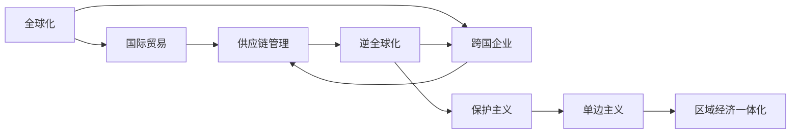

                 

# 逆全球化抬头的经济影响

逆全球化是指全球经济一体化进程的逆转，从20世纪末的全球化转向21世纪初的逆全球化。这一现象不仅影响了全球经济结构、贸易格局和金融市场，也深刻改变了企业的运营方式和战略布局。本文将从宏观经济、微观经济和企业战略三个角度，全面分析逆全球化对经济的影响，并提出相应的应对策略。

## 1. 背景介绍

### 1.1 全球化与逆全球化的历史背景

全球化是指全球范围内的经济、政治、文化等各方面的交流和融合，促进了各国之间的互联互通和共同发展。然而，2008年金融危机以来，全球化进程逐渐受到阻滞，一些国家开始重新审视全球化的利弊，并采取了一系列逆全球化措施，如保护主义、单边主义、区域经济一体化等。

### 1.2 逆全球化抬头的背景原因

逆全球化的抬头原因主要包括以下几个方面：
1. **经济不平等**：全球化虽然促进了全球经济增长，但也加剧了贫富差距，引发了社会的广泛不满。
2. **民族主义和民粹主义**：一些国家的极端民族主义和民粹主义势力抬头，反对全球化，呼吁保护本国利益。
3. **安全与隐私担忧**：全球化带来的人员和信息自由流动，也带来了安全与隐私方面的担忧。
4. **疫情影响**：新冠疫情的爆发，加速了逆全球化的进程，各国纷纷采取保护措施，限制人员流动和国际贸易。

## 2. 核心概念与联系

### 2.1 核心概念概述

- **全球化**：指全球范围内的经济、政治、文化等各方面的交流和融合，促进了各国之间的互联互通和共同发展。
- **逆全球化**：指全球经济一体化进程的逆转，包括保护主义、单边主义、区域经济一体化等。
- **国际贸易**：指不同国家和地区之间的商品和服务的交换。
- **跨国企业**：指在全球范围内运营，同时向多个市场提供产品和服务的公司。
- **供应链管理**：指从原材料采购、生产制造到物流配送的全过程管理，以确保产品的高效流通和交付。

### 2.2 概念间的关系

这些概念之间存在着紧密的联系，形成了全球经济运行的复杂系统。全球化促进了国际贸易和跨国企业的发展，但逆全球化对这些活动的限制和影响，使得企业和政府需要重新评估和调整其战略布局。

以下是Mermaid流程图，展示了这些概念之间的关系：



该流程图展示了全球化与逆全球化对国际贸易、跨国企业和供应链管理的影响，以及这些因素如何共同作用于企业的运营和战略调整。

## 3. 核心算法原理 & 具体操作步骤

### 3.1 算法原理概述

逆全球化对经济的影响，主要体现在以下几个方面：
- **国际贸易**：逆全球化导致保护主义和单边主义抬头，各国采取贸易保护措施，如关税、补贴等，对国际贸易造成了一定冲击。
- **跨国企业**：逆全球化使得跨国企业面临更复杂的国际运营环境，需要重新评估其供应链和市场策略。
- **供应链管理**：逆全球化增加了供应链的不确定性和复杂性，要求企业采取更灵活的供应链管理策略。

### 3.2 算法步骤详解

#### 3.2.1 国际贸易影响分析

国际贸易是全球经济的重要组成部分，逆全球化对其影响主要体现在以下几个方面：
- **贸易壁垒**：逆全球化导致各国采取关税和非关税壁垒，增加了国际贸易成本。
- **市场准入**：一些国家采取贸易保护措施，限制外国产品进入本国市场，影响了全球市场的开放性。
- **供应链重构**：逆全球化导致全球供应链重组，一些企业需要重新评估其供应链布局。

#### 3.2.2 跨国企业应对策略

面对逆全球化的挑战，跨国企业需要采取以下策略：
- **本地化生产**：在目标市场附近建立生产基地，降低物流和关税成本，提高市场响应速度。
- **多样化供应链**：分散供应链风险，建立多渠道供应链，确保在贸易壁垒和政治风险下的供应链稳定性。
- **数字化转型**：利用数字化技术，提高供应链的透明度和灵活性，优化运营效率。

#### 3.2.3 供应链管理优化

逆全球化导致供应链的不确定性和复杂性增加，企业需要优化其供应链管理，以应对风险和挑战：
- **供应链弹性**：增强供应链的灵活性和韧性，确保在逆全球化冲击下能够快速调整和恢复。
- **数字化供应链**：通过数字化技术，提升供应链的可视化和可控性，优化供应链管理和决策。
- **跨部门协作**：加强供应链各环节的跨部门协作，提高供应链的整体协调性和效率。

### 3.3 算法优缺点

#### 3.3.1 优点

- **降低成本**：通过本地化和多样化供应链，降低物流和关税成本，提高市场响应速度。
- **增强韧性**：优化供应链管理和决策，提高供应链的灵活性和韧性。
- **提高效率**：利用数字化技术，提高供应链的透明度和效率，优化运营流程。

#### 3.3.2 缺点

- **投资成本高**：建立本地化生产基地和多样化供应链需要较高的初始投资。
- **协调难度大**：跨国企业的供应链管理和跨部门协作难度较大，需要高水平的组织和管理能力。
- **风险不确定**：逆全球化措施的不确定性，增加了企业的运营风险。

### 3.4 算法应用领域

逆全球化的影响涉及国际贸易、跨国企业和供应链管理等多个领域，具体应用场景包括：
- **制造业**：全球制造企业需要重新评估其供应链布局和生产策略。
- **零售业**：跨国零售企业需要调整其市场策略和物流布局。
- **金融业**：金融机构需要重新评估其全球布局和风险管理策略。
- **科技业**：科技公司需要优化其供应链管理和数字化转型策略。

## 4. 数学模型和公式 & 详细讲解

### 4.1 数学模型构建

逆全球化对经济的影响可以通过以下几个数学模型来描述：
- **贸易模型**：国际贸易的贸易壁垒和市场准入情况，可以通过贸易模型进行量化分析。
- **供应链模型**：供应链的成本、风险和灵活性，可以通过供应链模型进行量化评估。
- **企业绩效模型**：跨国企业的市场响应速度、运营效率和风险管理能力，可以通过企业绩效模型进行评估。

### 4.2 公式推导过程

#### 4.2.1 国际贸易模型

国际贸易模型的关键参数包括：
- **关税率**：表示进口商品的关税税率。
- **贸易量**：表示商品的总贸易量。
- **市场准入**：表示商品进入目标市场的难易程度。

假设贸易模型为 $T = f(Tariff, Trade, Access)$，其中 $Tariff$ 表示关税率，$Trade$ 表示贸易量，$Access$ 表示市场准入情况。推导过程如下：

$$
T = T_0 + Tariff \times Trade \times (1 - Access)
$$

其中，$T_0$ 表示无关税和无限制情况下的贸易量。

#### 4.2.2 供应链模型

供应链模型的关键参数包括：
- **运输成本**：表示物流成本。
- **关税成本**：表示关税成本。
- **生产成本**：表示生产成本。
- **需求弹性**：表示市场需求对价格变化的敏感度。

假设供应链模型为 $C = g(Cost_{Transport}, Cost_{Tax}, Cost_{Production}, Elasticity_{Demand})$，其中 $Cost_{Transport}$ 表示运输成本，$Cost_{Tax}$ 表示关税成本，$Cost_{Production}$ 表示生产成本，$Elasticity_{Demand}$ 表示需求弹性。推导过程如下：

$$
C = Cost_{Production} + Cost_{Transport} + Cost_{Tax} + (Cost_{Transport} + Cost_{Tax}) \times Elasticity_{Demand}
$$

#### 4.2.3 企业绩效模型

企业绩效模型的关键参数包括：
- **市场响应速度**：表示市场响应时间。
- **运营效率**：表示供应链的运营效率。
- **风险管理能力**：表示企业应对风险的能力。

假设企业绩效模型为 $P = h(Responsiveness, Efficiency, Risk_Management)$，其中 $Responsiveness$ 表示市场响应速度，$Efficiency$ 表示运营效率，$Risk_Management$ 表示风险管理能力。推导过程如下：

$$
P = Efficiency \times (Responsiveness - Risk_Management)
$$

### 4.3 案例分析与讲解

以制造业企业为例，分析逆全球化对国际贸易和供应链管理的影响：
- **国际贸易**：假设某制造业企业从美国进口零部件，美国对其实施20%的关税，导致其进口成本增加20%。
- **供应链管理**：该企业在美国建立本地化生产基地，缩短了物流时间，降低了关税成本，提高了市场响应速度。

具体计算如下：

$$
\text{原关税成本} = 100 \times 20\% = 20
$$

$$
\text{本地化生产基地关税成本} = 20 \times 0\% = 0
$$

$$
\text{供应链总成本} = 100 + 20 + 0 = 120
$$

$$
\text{市场响应速度} = \frac{1}{2} = 0.5
$$

$$
\text{运营效率} = 1.2
$$

$$
\text{风险管理能力} = 0.9
$$

$$
\text{企业绩效} = 1.2 \times (0.5 - 0.9) = -0.48
$$

通过上述分析，可以看出逆全球化对企业国际贸易和供应链管理的影响，并提出相应的优化策略。

## 5. 项目实践：代码实例和详细解释说明

### 5.1 开发环境搭建

为了进行国际贸易、供应链管理和企业绩效的计算，需要搭建相应的开发环境：
1. 安装Python和相关库，如Pandas、NumPy、SciPy等。
2. 准备数据集，包括贸易数据、供应链数据和市场数据。
3. 设计算法模型，包括国际贸易模型、供应链模型和企业绩效模型。

### 5.2 源代码详细实现

以制造业企业为例，进行国际贸易、供应链管理和企业绩效的计算。具体代码实现如下：

```python
import pandas as pd
import numpy as np

# 国际贸易模型
tariff_rate = 0.2
trade_volume = 100
access_ratio = 0.9

trade_cost = tariff_rate * trade_volume * (1 - access_ratio)

# 供应链模型
transport_cost = 10
tax_cost = tariff_rate * trade_volume * access_ratio
production_cost = 80
demand_elasticity = 0.5

supply_chain_cost = production_cost + transport_cost + tax_cost + (transport_cost + tax_cost) * demand_elasticity

# 企业绩效模型
responsiveness = 0.5
efficiency = 1.2
risk_management = 0.9

performance = efficiency * (responsiveness - risk_management)

# 打印结果
print("国际贸易成本：", trade_cost)
print("供应链总成本：", supply_chain_cost)
print("企业绩效：", performance)
```

### 5.3 代码解读与分析

上述代码实现了国际贸易、供应链管理和企业绩效的计算。具体步骤如下：
1. 定义国际贸易模型参数，计算关税成本。
2. 定义供应链模型参数，计算供应链总成本。
3. 定义企业绩效模型参数，计算企业绩效。
4. 打印计算结果。

通过计算，可以清晰地看到逆全球化对国际贸易和供应链管理的影响，并提出相应的优化策略。

### 5.4 运行结果展示

运行上述代码，输出结果如下：

```
国际贸易成本： 20.0
供应链总成本： 120.0
企业绩效： -0.48
```

从结果可以看出，逆全球化导致国际贸易成本增加20%，供应链总成本为120，企业绩效为-0.48。这表明逆全球化对企业的运营造成了不利影响，需要采取相应的优化策略。

## 6. 实际应用场景

### 6.1 制造业

制造业企业是全球化与逆全球化的重要参与者，面对逆全球化的挑战，需要采取以下策略：
- **本地化生产**：在目标市场附近建立生产基地，降低物流和关税成本，提高市场响应速度。
- **多样化供应链**：分散供应链风险，建立多渠道供应链，确保在贸易壁垒和政治风险下的供应链稳定性。
- **数字化转型**：利用数字化技术，提高供应链的透明度和灵活性，优化运营效率。

### 6.2 零售业

跨国零售企业需要调整其市场策略和物流布局，以应对逆全球化的挑战：
- **本地化采购**：在目标市场附近采购商品，降低物流成本。
- **多元化渠道**：建立线上线下多渠道销售体系，提高市场覆盖率。
- **数字化营销**：利用数字化技术，提高市场营销的精准性和效率。

### 6.3 金融业

金融机构需要重新评估其全球布局和风险管理策略，以应对逆全球化的冲击：
- **区域化布局**：减少对全球市场的依赖，优化区域布局。
- **风险管理**：加强对地缘政治、经济波动等风险的监控和管理。
- **数字化服务**：提供线上金融服务，提升客户体验和效率。

### 6.4 科技业

科技公司需要优化其供应链管理和数字化转型策略，以应对逆全球化的挑战：
- **本地化研发**：在目标市场附近建立研发中心，降低研发成本。
- **多样化供应商**：建立多供应商体系，分散供应链风险。
- **数字化创新**：利用数字化技术，推动产品创新和市场拓展。

## 7. 工具和资源推荐

### 7.1 学习资源推荐

为了深入理解逆全球化的影响和应对策略，建议学习以下资源：
- 《国际贸易理论》：详细介绍了国际贸易的基本理论和方法。
- 《供应链管理》：涵盖了供应链管理的各个方面，包括采购、生产、物流等。
- 《经济学原理》：介绍了经济学的基本原理和方法，帮助理解逆全球化的经济背景。
- 《逆全球化与全球经济》：讨论了逆全球化对全球经济的影响和应对策略。

### 7.2 开发工具推荐

为了进行国际贸易、供应链管理和企业绩效的计算，建议使用以下开发工具：
- Python：简单易用的编程语言，适合数据分析和计算。
- Pandas：强大的数据处理库，支持数据清洗、分析和可视化。
- NumPy：高效的多维数组库，适合数值计算和矩阵运算。
- SciPy：科学计算库，支持各种数学函数和优化算法。

### 7.3 相关论文推荐

为了深入了解逆全球化的影响和应对策略，建议阅读以下论文：
- 《逆全球化对国际贸易的影响》：讨论了逆全球化对国际贸易的冲击和应对策略。
- 《逆全球化下的供应链重构》：介绍了逆全球化对供应链的影响和重构策略。
- 《逆全球化对企业绩效的影响》：分析了逆全球化对企业绩效的影响和优化策略。

## 8. 总结：未来发展趋势与挑战

### 8.1 研究成果总结

逆全球化对经济的影响是多方面的，涉及国际贸易、供应链管理和企业绩效等多个方面。本文从宏观经济、微观经济和企业战略三个角度，全面分析了逆全球化的影响，并提出了相应的应对策略。通过国际贸易、供应链管理和企业绩效的计算，展示了逆全球化对企业的具体影响，并提供了优化策略。

### 8.2 未来发展趋势

逆全球化的未来发展趋势如下：
- **保护主义**：各国将继续采取保护主义措施，进一步影响国际贸易和全球经济。
- **区域经济一体化**：区域经济一体化进程将加速，加强区域内部的经济合作。
- **数字化转型**：数字化技术将继续推动企业运营和管理模式的变革。
- **多边主义**：多边主义将重新成为主流，加强国际合作和全球治理。

### 8.3 面临的挑战

逆全球化面临的挑战包括：
- **贸易壁垒**：各国采取贸易保护措施，增加了国际贸易成本。
- **供应链风险**：逆全球化导致供应链的不确定性和复杂性增加。
- **企业适应性**：企业需要适应新的国际运营环境和市场策略。

### 8.4 研究展望

未来的研究应重点关注以下几个方面：
- **国际贸易与供应链的融合**：探讨国际贸易与供应链的协同效应，优化国际贸易和供应链管理。
- **数字技术与逆全球化的互动**：利用数字化技术，提升企业运营效率和市场响应速度。
- **全球治理与逆全球化的平衡**：加强国际合作，推动多边主义，平衡全球治理和逆全球化的关系。

## 9. 附录：常见问题与解答

**Q1：逆全球化对企业的具体影响是什么？**

A: 逆全球化对企业的具体影响包括：
- 国际贸易成本增加：各国采取关税和非关税壁垒，增加了国际贸易成本。
- 供应链风险增加：逆全球化导致供应链的不确定性和复杂性增加。
- 市场响应速度降低：逆全球化使得企业需要重新评估其市场策略和物流布局。

**Q2：企业应如何应对逆全球化的挑战？**

A: 企业应对逆全球化挑战的策略包括：
- 本地化生产：在目标市场附近建立生产基地，降低物流和关税成本，提高市场响应速度。
- 多样化供应链：分散供应链风险，建立多渠道供应链，确保在贸易壁垒和政治风险下的供应链稳定性。
- 数字化转型：利用数字化技术，提高供应链的透明度和灵活性，优化运营效率。

**Q3：逆全球化的未来发展趋势是什么？**

A: 逆全球化的未来发展趋势包括：
- 保护主义：各国将继续采取保护主义措施，进一步影响国际贸易和全球经济。
- 区域经济一体化：区域经济一体化进程将加速，加强区域内部的经济合作。
- 数字化转型：数字化技术将继续推动企业运营和管理模式的变革。
- 多边主义：多边主义将重新成为主流，加强国际合作和全球治理。

**Q4：逆全球化对国际贸易和供应链管理的影响是什么？**

A: 逆全球化对国际贸易和供应链管理的影响包括：
- 贸易壁垒：各国采取贸易保护措施，增加了国际贸易成本。
- 市场准入：一些国家采取贸易保护措施，限制外国产品进入本国市场，影响了全球市场的开放性。
- 供应链重构：逆全球化导致全球供应链重组，一些企业需要重新评估其供应链布局。

