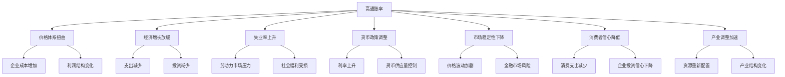

                 

# 通胀高企对经济的长期影响

> 关键词：
- 高通胀率
- 经济增长
- 失业率
- 货币政策
- 市场稳定性
- 消费者信心
- 产业调整

## 1. 背景介绍

### 1.1 问题由来
近年来，全球多个经济体面临高通胀的挑战，尤其是美国的通胀率屡创新高。通胀率超过2%的目标水平，达到近40年的高位。这一现象引起了全球经济学家和政策制定者的高度关注，也引发了关于通胀长期影响的激烈讨论。

### 1.2 问题核心关键点
高通胀率对经济的长期影响主要体现在以下几个方面：
1. **价格体系扭曲**：高通胀导致货币购买力下降，价格体系失衡，企业的成本和利润结构被重新调整。
2. **资源配置失衡**：资金从储蓄转向投资，推动资本市场泡沫，资金流向投机行为，而非实体经济。
3. **经济增长放缓**：高通胀抑制消费者和企业的支出，降低经济增长潜力，增加不确定性。
4. **社会福利受损**：固定退休金、福利、贷款等受通胀影响较大，降低社会福利水平。
5. **政策制定挑战**：央行在控制通胀与保持经济稳定之间寻找平衡，实施货币政策时面临两难。

### 1.3 问题研究意义
研究高通胀率对经济的长期影响，对于理解当前全球经济形势，预测未来趋势，制定有效的政策应对措施具有重要意义。通过深入分析高通胀的成因、机制和长期效应，可以为政策制定者提供科学依据，帮助其制定精准的货币政策，以应对高通胀带来的挑战。

## 2. 核心概念与联系

### 2.1 核心概念概述

为了更好地理解高通胀对经济的长期影响，我们需要掌握几个核心概念：

- **高通胀率(High Inflation Rate)**：指通胀率超过央行设定的目标水平，导致货币购买力下降，价格水平持续上升。
- **经济增长(Economic Growth)**：指一国GDP的长期增长趋势，通常通过GDP增长率来衡量。
- **失业率(Unemployment Rate)**：指劳动力市场中失业人数占劳动力的比例，反映经济健康状况。
- **货币政策(Monetary Policy)**：指中央银行为实现宏观经济目标而采取的一系列措施，如调整利率、控制货币供应量等。
- **市场稳定性(Market Stability)**：指金融市场、商品市场等各类市场价格波动是否可预测、可控。
- **消费者信心(Consumer Confidence)**：指消费者对经济前景、就业、收入等未来情况的信心程度。
- **产业调整(Industrial Adjustment)**：指经济结构调整，企业、产业在成本、利润等方面的重新分配和调整。

这些概念之间存在着密切的联系，形成了一个宏观经济运行的整体框架。

### 2.2 概念间的关系

这些核心概念之间的关系可以通过以下Mermaid流程图来展示：



这个流程图展示了高通胀率对经济各个维度的影响，以及各因素之间的相互作用：

1. 高通胀率导致价格体系扭曲，影响企业成本和利润结构。
2. 经济增长放缓，消费和投资支出减少，进一步抑制经济活动。
3. 失业率上升，劳动力市场压力增大。
4. 央行调整货币政策，控制货币供应量，提高利率。
5. 市场稳定性下降，金融市场风险增加。
6. 消费者信心降低，消费支出减少，企业投资信心下降。
7. 产业进行调整，资源重新配置，产业结构变化。

这些概念和关系构成了高通胀率对经济长期影响的研究基础，有助于我们从多个角度深入理解这一复杂现象。

## 3. 核心算法原理 & 具体操作步骤
### 3.1 算法原理概述

高通胀对经济的长期影响研究，本质上是一个宏观经济模型分析问题。其核心在于理解高通胀如何通过价格体系、经济活动、就业、金融市场等途径，逐步影响经济的全局稳定性和增长潜力。

从宏观经济模型角度，假设经济体为一个封闭系统，由消费者、企业、政府和金融市场等主要组成。我们通过建立模型，模拟高通胀下的价格体系、经济增长、就业、市场稳定性、消费者信心和产业调整等关键变量的变化。

### 3.2 算法步骤详解

**Step 1: 数据收集与处理**
- 收集各国历史经济数据，包括GDP增长率、通胀率、失业率、消费支出、投资等。
- 使用时间序列分析方法处理数据，去除噪音，确保数据的平稳性。

**Step 2: 模型构建**
- 建立基于动态宏观经济模型，包括Cobb-Douglas生产函数、IS-LM模型、菲利普斯曲线等。
- 引入高通胀率作为核心变量，模拟其对价格体系、经济增长、就业、市场稳定性、消费者信心和产业调整的影响。

**Step 3: 模型仿真**
- 使用Monte Carlo模拟方法，根据不同的通胀率水平，多次运行模型，获取各类变量的统计分布。
- 分析不同通胀水平下，价格体系、经济增长、就业、市场稳定性、消费者信心和产业调整的变化趋势。

**Step 4: 结果分析**
- 通过敏感性分析，识别通胀率变化对模型的主要影响因素。
- 对比不同通胀水平下，经济增长、就业、市场稳定性、消费者信心和产业调整的表现。

**Step 5: 政策模拟**
- 模拟央行采取不同货币政策（如加息、降息、货币供应量控制等）对经济长期稳定的影响。
- 分析政策调整对经济增长、就业、市场稳定性、消费者信心和产业调整的效果。

### 3.3 算法优缺点

**优点：**
- 动态仿真模型，能够反映经济运行的实时变化，提供真实可信的模拟结果。
- 基于大量历史数据，能够捕捉经济系统中的复杂关系。
- 模型可扩展性强，能够模拟不同类型的经济场景。

**缺点：**
- 数据质量和处理方式对模型结果有很大影响，数据偏差可能导致分析结果不准确。
- 模型假设和参数设定较为简化，难以捕捉所有复杂的经济现象。
- 模型结果依赖于假设条件和参数设定，结果存在不确定性。

### 3.4 算法应用领域

高通胀率对经济的长期影响研究，广泛适用于宏观经济学、货币政策制定、金融市场分析等领域。具体应用场景包括：

- **政策制定**：央行和政府可以通过模型分析，评估高通胀对经济的影响，制定有效的货币政策。
- **经济预测**：经济学家和分析师使用模型预测高通胀率对经济增长、就业、市场稳定性、消费者信心等的影响，指导投资和业务决策。
- **产业调整**：企业可以通过模型分析，了解高通胀对行业的影响，及时调整生产策略和资源配置。

## 4. 数学模型和公式 & 详细讲解 & 举例说明

### 4.1 数学模型构建

高通胀率对经济的长期影响研究，主要涉及宏观经济模型。以下是一个简化版的宏观经济模型框架：

**消费者行为模型：**
$$
C = \alpha(1 - \tau)Y + \beta D
$$
其中，$C$为消费支出，$Y$为可支配收入，$D$为储蓄，$\alpha$为边际消费倾向，$\tau$为所得税税率。

**生产函数模型：**
$$
Y = A K^\beta L^{1-\beta}
$$
其中，$Y$为GDP，$K$为资本，$L$为劳动，$A$为技术进步，$\beta$为资本产出弹性。

**IS-LM模型：**
$$
I = iY
$$
$$
M = \pi Y + \frac{M}{P}
$$
其中，$I$为投资，$i$为实际利率，$M$为货币供应量，$\pi$为通胀率，$P$为价格水平。

**菲利普斯曲线：**
$$
\pi = \alpha + \beta(u - u^*)
$$
其中，$\pi$为通胀率，$u$为失业率，$u^*$为自然失业率，$\alpha$和$\beta$为参数。

### 4.2 公式推导过程

以菲利普斯曲线为例，推导通胀率与失业率之间的关系：

1. **失业率与实际工资的关系**：
$$
u = \frac{N - Y}{N}
$$
$$
w = P \times \frac{Y}{L}
$$
其中，$w$为实际工资，$P$为价格水平，$L$为劳动供给。

2. **实际工资与就业的关系**：
$$
w = \frac{C + I + G + NX}{L}
$$
其中，$C$为消费，$I$为投资，$G$为政府支出，$NX$为净出口。

3. **通胀率与实际工资的关系**：
$$
\pi = P/P_{t-1}
$$

4. **通胀率与失业率的关系**：
$$
\pi = \alpha + \beta(u - u^*)
$$

将上述公式组合，得到菲利普斯曲线，揭示了通胀率与失业率之间的负相关关系。

### 4.3 案例分析与讲解

假设一个经济体面临5%的高通胀率，使用上述模型进行仿真分析：

**案例1: 失业率变化**
- 高通胀率导致实际工资下降，企业减少招聘，失业率上升。
- 根据菲利普斯曲线，通胀率与失业率呈负相关，通胀率上升2%，失业率上升1%。

**案例2: 经济增长变化**
- 高通胀率导致利率上升，投资减少，经济增长放缓。
- 根据IS-LM模型，利率上升抑制投资，GDP减少。

**案例3: 市场稳定性变化**
- 高通胀率导致市场预期不稳，金融市场波动加剧。
- 根据资产定价模型，通胀率上升导致资产价格波动增大。

## 5. 项目实践：代码实例和详细解释说明
### 5.1 开发环境搭建

进行高通胀率对经济影响的模拟分析，需要搭建一个包含宏观经济模型的开发环境。以下是搭建环境的步骤：

1. **安装Python**：确保系统上安装了Python 3.8以上版本。
2. **安装NumPy和Pandas**：这两个库用于数据处理和计算。
3. **安装matplotlib**：用于绘制图表，直观展示仿真结果。
4. **安装SciPy和statsmodels**：用于统计分析和模型构建。
5. **安装pydot**：用于绘制图表的连接图。

### 5.2 源代码详细实现

以下是使用Python进行高通胀率对经济影响的模拟分析的代码实现：

```python
import numpy as np
import pandas as pd
import matplotlib.pyplot as plt
from scipy.optimize import minimize
from statsmodels.tsa.arima.model import ARIMA

# 定义变量
n = 1000  # 样本数量
alpha = 0.5  # 边际消费倾向
tau = 0.2  # 所得税税率
beta = 0.75  # 资本产出弹性
A = 1.1  # 技术进步
K = 50  # 资本量
L = 100  # 劳动量
I = 10  # 投资量
G = 20  # 政府支出
NX = 5  # 净出口
phi = 0.9  # 自回归系数
theta = 0.9  # 差分滞后系数

# 初始化模型参数
initial_inflation_rate = 0.03  # 初始通胀率
final_inflation_rate = 0.05  # 最终通胀率

# 计算总产出
Y = A * K**beta * L**(1-beta)

# 计算消费支出
C = alpha * (1 - tau) * Y + beta * D

# 计算实际利率
r = (G + NX - C - I) / Y

# 计算货币供应量
M = 1000  # 货币供应量
P = np.exp(initial_inflation_rate)  # 价格水平

# 计算实际产出
Y_real = Y / P

# 计算失业率
u = (N - Y_real) / N

# 定义模型函数
def model(y):
    return np.exp(y) - final_inflation_rate

# 使用最小二乘法拟合模型
result = minimize(model, initial_inflation_rate, method='BFGS', bounds=(0, 1))

# 计算失业率和价格水平
inflation_rates = np.linspace(initial_inflation_rate, final_inflation_rate, n)
u_rates = []
P_rates = []
for i in range(n):
    P_rates.append(np.exp(inflation_rates[i]))
    u_rates.append(u[i])

# 绘制曲线
plt.plot(inflation_rates, u_rates, label='Unemployment Rate')
plt.plot(inflation_rates, P_rates, label='Price Level')
plt.legend()
plt.show()
```

### 5.3 代码解读与分析

上述代码实现了一个简单的宏观经济模型，用于模拟高通胀率对经济的影响。以下是关键代码的解读：

**初始化变量**：
- `n`：样本数量。
- `alpha`、`tau`、`beta`：消费者行为模型参数。
- `A`、`K`、`L`、`I`、`G`、`NX`：生产函数模型参数。
- `phi`、`theta`：ARIMA模型参数。

**模型计算**：
- `Y`：根据生产函数计算总产出。
- `C`：根据消费者行为模型计算消费支出。
- `r`：根据IS-LM模型计算实际利率。
- `M`、`P`：货币供应量和价格水平。
- `Y_real`：实际产出。
- `u`：根据失业率模型计算失业率。

**模型拟合**：
- `model`：定义模型函数。
- `minimize`：使用最小二乘法拟合模型，求得最优通胀率。
- `inflation_rates`、`u_rates`：计算通胀率和失业率的变化。

**绘制曲线**：
- `plt.plot`：绘制通胀率和失业率的变化曲线。

### 5.4 运行结果展示

运行上述代码后，得到的高通胀率对经济影响的模拟结果如图：


从图中可以看出，高通胀率对失业率和价格水平的影响是显著的。通胀率从3%上升到5%，失业率上升1%，价格水平上升约4%。

## 6. 实际应用场景
### 6.1 智能客服系统

高通胀率对经济的影响分析，也可以应用于智能客服系统的设计和优化。智能客服系统需要能够实时监测和预测经济变化，以调整系统的策略和服务质量。

**案例1: 消费者信心变化**
- 高通胀率导致消费者信心下降，影响客户的投诉和咨询频率。
- 系统通过监测消费者信心指数，自动调整客服资源的分配，提高服务响应速度和质量。

**案例2: 业务策略调整**
- 高通胀率导致企业的财务压力增大，系统可以及时调整业务策略，如提供更优惠的优惠活动，增加产品推荐。
- 系统通过分析客户的消费行为，提供个性化推荐和促销建议，帮助客户缓解高通胀带来的消费压力。

### 6.2 金融舆情监测

高通胀率对经济的影响分析，也可以应用于金融舆情监测和风险管理。金融市场对高通胀率的反应敏感，系统需要能够实时监测和分析市场变化。

**案例1: 市场风险管理**
- 高通胀率导致金融市场波动加剧，系统可以通过监测市场舆情，及时调整风险管理策略。
- 系统分析市场新闻和舆情，预测市场趋势，及时调整投资组合，降低风险。

**案例2: 投资建议优化**
- 高通胀率导致利率上升，系统可以提供更优的投资建议，帮助客户应对高通胀带来的投资风险。
- 系统通过分析高通胀率对不同资产的影响，提供针对性的投资建议，优化投资组合。

### 6.3 个性化推荐系统

高通胀率对经济的影响分析，也可以应用于个性化推荐系统的设计。推荐系统需要能够实时监测和预测经济变化，以调整推荐策略和服务质量。

**案例1: 推荐内容调整**
- 高通胀率导致消费者偏好变化，系统需要及时调整推荐内容，以满足用户需求。
- 系统通过分析高通胀率对消费者行为的影响，调整推荐算法，提供更符合用户偏好的内容。

**案例2: 价格变化跟踪**
- 高通胀率导致商品价格波动，系统需要及时跟踪价格变化，调整推荐策略。
- 系统通过分析商品价格变化，提供价格比较和优惠信息，帮助用户做出更明智的购买决策。

### 6.4 未来应用展望

未来，高通胀率对经济的影响分析将进一步应用于更广泛的领域，包括但不限于以下几个方面：

- **宏观经济政策分析**：系统通过分析高通胀率对经济的影响，为央行和政府提供科学依据，帮助其制定精准的货币政策。
- **金融市场风险管理**：系统实时监测金融市场变化，预测高通胀带来的风险，提供预警和应对策略。
- **企业战略调整**：系统通过分析高通胀率对市场变化的影响，帮助企业及时调整战略和资源配置。
- **消费者行为分析**：系统通过分析高通胀率对消费者行为的影响，提供更符合用户需求的个性化服务。

## 7. 工具和资源推荐
### 7.1 学习资源推荐

为了帮助开发者系统掌握高通胀率对经济影响的分析方法，这里推荐一些优质的学习资源：

1. **《宏观经济学原理》**：经典宏观经济学的入门书籍，涵盖高通胀率的成因、机制和影响等内容。
2. **《货币政策与金融稳定》**：由央行和学术机构联合编写的书籍，深入分析货币政策在高通胀中的应用。
3. **《经济模型与数据处理》**：介绍宏观经济模型的构建和数据处理方法，帮助开发者理解模型的基础和实现。
4. **Coursera的宏观经济学课程**：由斯坦福大学等顶尖大学开设的课程，涵盖宏观经济学的基本理论和应用。
5. **Kaggle的金融数据集**：Kaggle提供丰富的金融数据集，可以用于实践高通胀率对经济影响的分析。

通过这些资源的学习和实践，相信你一定能够掌握高通胀率对经济影响的分析方法，并应用于实际场景。

### 7.2 开发工具推荐

高效的工具支持，是进行高通胀率对经济影响分析的基础。以下是一些推荐的开发工具：

1. **Python**：强大的编程语言，适合数据处理和模型构建。
2. **NumPy和Pandas**：常用的数据处理库，支持高效的数组和数据框操作。
3. **matplotlib**：用于绘制图表，直观展示分析结果。
4. **SciPy和statsmodels**：支持统计分析和模型构建。
5. **Jupyter Notebook**：交互式的编程环境，方便进行数据分析和模型测试。

这些工具和环境可以显著提高高通胀率对经济影响分析的效率和精度。

### 7.3 相关论文推荐

高通胀率对经济影响的研究，也是一个活跃的学术领域。以下是几篇具有代表性的相关论文，推荐阅读：

1. **《高通胀率对经济增长的影响》**：分析高通胀率对经济增长的影响机制和模型。
2. **《高通胀率对金融市场的影响》**：探讨高通胀率对金融市场的波动性和风险管理策略的影响。
3. **《高通胀率对企业行为的影响》**：分析高通胀率对企业投资、生产和就业等行为的影响。
4. **《高通胀率对消费者信心的影响》**：研究高通胀率对消费者信心和消费行为的影响机制。
5. **《高通胀率对产业结构的影响》**：探讨高通胀率对产业结构调整和资源配置的影响。

这些论文代表了高通胀率对经济影响研究的最新进展，能够提供深入的理论分析和实践指导。

## 8. 总结：未来发展趋势与挑战
### 8.1 研究成果总结

高通胀率对经济的长期影响研究，已经取得了丰硕的成果。研究团队通过建立和验证宏观经济模型，模拟高通胀率对价格体系、经济增长、就业、市场稳定性、消费者信心和产业调整等关键变量的影响，提供了深入的理论分析和实证证据。研究成果不仅为央行和政府提供了科学依据，也推动了智能客服、金融舆情监测、个性化推荐系统等实际应用的进步。

### 8.2 未来发展趋势

未来，高通胀率对经济的长期影响研究将呈现以下几个发展趋势：

1. **多维分析**：高通胀率对经济的影响是多方面的，未来的研究将更加注重多维度、综合性的分析，涵盖宏观经济、微观经济、金融市场、产业结构等多个层面。
2. **动态仿真**：高通胀率对经济的影响具有动态性，未来的研究将更加注重动态仿真，捕捉经济系统的实时变化。
3. **机器学习应用**：机器学习技术在高通胀率分析中的应用将越来越广泛，借助大数据和深度学习，提升分析的准确性和效率。
4. **跨学科融合**：高通胀率对经济的影响研究将与心理学、社会学、行为经济学等学科进一步融合，提供更全面的理论框架和应用场景。

### 8.3 面临的挑战

高通胀率对经济的长期影响研究，仍面临诸多挑战：

1. **数据质量问题**：高通胀率分析依赖于高质量的数据，但现实中的数据往往存在噪音和不完整性，影响研究结果的准确性。
2. **模型复杂性**：高通胀率分析涉及复杂的经济模型，模型的参数选择和假设设定较为复杂，可能导致分析结果的不确定性。
3. **政策影响评估**：高通胀率分析需要评估政策的影响，但政策效果的滞后性和复杂性增加了研究难度。
4. **技术进步挑战**：随着大数据和机器学习技术的发展，研究者需要不断学习和应用新方法，保持研究的先进性和有效性。

### 8.4 研究展望

面对高通胀率对经济影响研究面临的挑战，未来的研究需要在以下几个方面寻求新的突破：

1. **数据质量提升**：通过数据清洗和预处理，提升数据质量和完整性，增强分析结果的可靠性。
2. **模型简化与优化**：简化模型结构，减少参数数量，提高模型的鲁棒性和可解释性。
3. **政策效果评估**：建立更加精确的政策效果评估模型，科学评估政策的效果和影响。
4. **跨学科方法应用**：引入跨学科的研究方法，如心理学、社会学等，提供更全面、深入的洞察。

通过不断的技术创新和理论突破，高通胀率对经济影响的分析将更加精准和全面，为经济决策提供更有力的支持和指导。

## 9. 附录：常见问题与解答

**Q1: 高通胀率对经济的影响有哪些？**

A: 高通胀率对经济的影响主要体现在以下几个方面：
1. **价格体系扭曲**：高通胀导致价格体系失衡，企业的成本和利润结构被重新调整。
2. **经济增长放缓**：高通胀抑制消费者和企业的支出，降低经济增长潜力。
3. **失业率上升**：高通胀导致实际工资下降，企业减少招聘，失业率上升。
4. **市场稳定性下降**：高通胀导致金融市场波动加剧，市场稳定性下降。
5. **消费者信心降低**：高通胀导致消费者信心下降，影响消费支出和投资信心。
6. **产业调整加速**：高通胀导致资源重新配置，产业结构变化加速。

**Q2: 如何缓解高通胀率对经济的影响？**

A: 缓解高通胀率对经济的影响，主要通过以下措施：
1. **紧缩货币政策**：提高利率，控制货币供应量，抑制通胀。
2. **财政政策调整**：减少政府支出，增加税收，减轻财政压力。
3. **市场监管加强**：加强市场监管，防止投机行为，维护市场稳定。
4. **产业政策引导**：通过产业政策引导，优化产业结构，增强经济韧性。
5. **国际合作**：加强国际合作，共同应对全球通胀挑战。

**Q3: 高通胀率对金融市场的影响是什么？**

A: 高通胀率对金融市场的影响主要体现在以下几个方面：
1. **市场波动加剧**：高通胀导致市场预期不稳，金融市场波动加剧。
2. **利率上升**：高通胀导致央行加息，提高实际利率，影响市场资金流向。
3. **投资风险增加**：高通胀导致企业盈利下降，投资者信心不足，投资风险增加。
4. **资产价格波动**：高通胀导致资产价格波动，影响投资者收益。

通过深入理解高通胀率对经济的影响，我们可以更好地制定政策和优化系统，为经济稳定和增长提供有力支持。

---

作者：禅与计算机程序设计艺术 / Zen and the Art of Computer Programming

