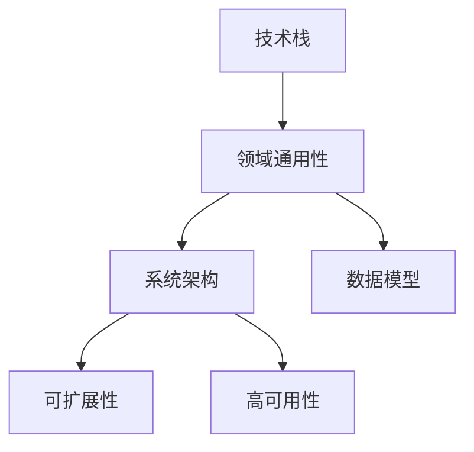
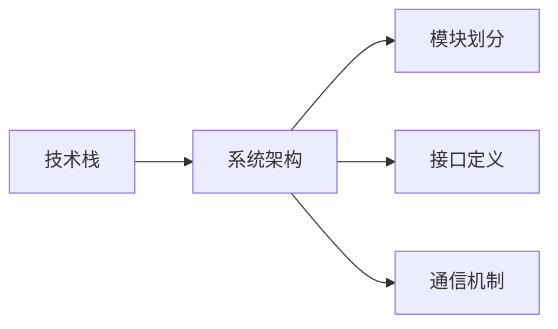
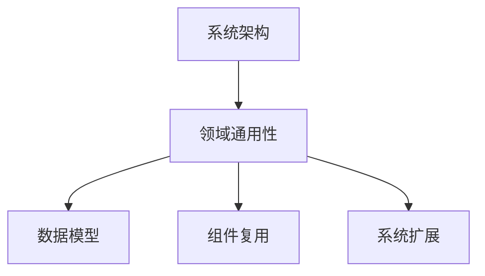
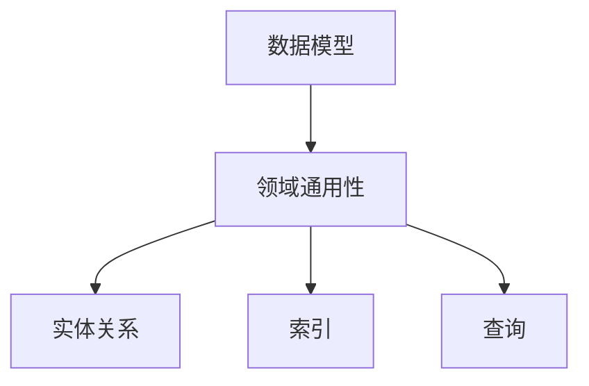
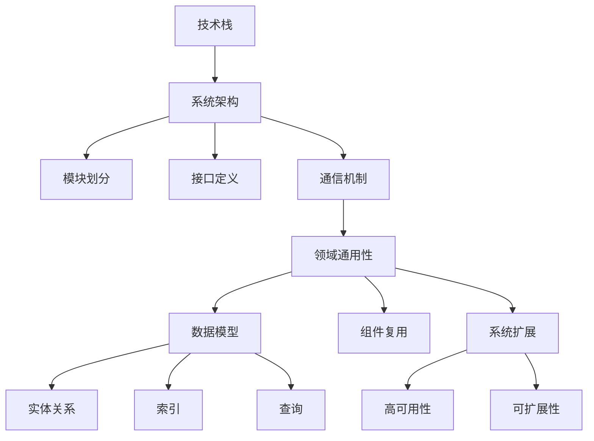

                 

# 避免在各个领域之间徘徊

> 关键词：技术栈, 领域通用性, 系统架构, 数据模型, 可扩展性, 高可用性

## 1. 背景介绍

### 1.1 问题由来

在现代软件开发中，特别是在复杂的大型系统中，如何有效地避免各个领域之间的频繁切换和徘徊，成为开发者们普遍面临的问题。这一问题不仅影响了开发效率，还容易引入复杂性和错误。本文将探讨在软件开发的各个领域（如架构设计、技术栈选择、数据模型设计等）之间建立清晰的边界和统一的标准，以提升系统的整体性能和可靠性。

### 1.2 问题核心关键点

避免在各个领域之间徘徊的核心在于，如何在保持系统灵活性和扩展性的同时，建立一套通用的设计原则和技术标准，以支持系统的长期稳定发展。具体来说，主要包括以下几个方面：

- **技术栈的统一与选择**：选择合适的技术栈并保持统一，避免频繁切换带来的技术债务和技术混乱。
- **领域通用性与灵活性**：设计通用的架构和数据模型，以便在多种领域和场景下都能高效运行。
- **高可用性与扩展性**：确保系统的稳定性和可扩展性，满足不同规模和负载的需求。
- **标准化与规范化**：制定统一的技术规范和编码标准，减少沟通成本，提升团队协作效率。

### 1.3 问题研究意义

提升系统在各个领域之间的稳定性和效率，对于现代软件开发具有重要意义：

1. **提高开发效率**：减少技术切换和重复工作，加快项目进度。
2. **提升系统性能**：建立统一的技术标准，优化资源利用，提升系统响应速度和吞吐量。
3. **增强团队协作**：标准化和规范化能够减少沟通成本，提高团队协作效率和代码质量。
4. **支持长期发展**：统一的技术栈和架构设计能够支持系统在未来的扩展和升级。
5. **降低技术债务**：避免频繁的技术切换和重复工作，减少技术债务和技术复杂性。

## 2. 核心概念与联系

### 2.1 核心概念概述

为更好地理解如何避免在各个领域之间徘徊，本节将介绍几个密切相关的核心概念：

- **技术栈**：软件开发中使用的各种技术和工具的组合，包括编程语言、框架、库等。
- **领域通用性**：设计一套通用的架构和数据模型，支持在不同的业务领域和场景下高效运行。
- **系统架构**：系统的整体设计框架，包括模块划分、接口定义、通信机制等。
- **数据模型**：描述系统中数据存储和处理的抽象模型，包括实体关系、索引、查询等。
- **可扩展性**：系统能够在未来扩展和升级的能力，支持不同规模和负载的需求。
- **高可用性**：系统能够在故障发生时，继续提供稳定服务的能力。

这些核心概念之间的逻辑关系可以通过以下Mermaid流程图来展示：



这个流程图展示了大语言模型微调过程中各个核心概念的关系和作用：

1. 技术栈提供基础的开发工具和框架，支持领域通用性和系统架构的设计。
2. 领域通用性建立在技术栈之上，设计通用的架构和数据模型，适用于不同的业务领域。
3. 系统架构定义了系统的模块和接口，确保领域通用性和可扩展性。
4. 数据模型描述了数据存储和处理的方式，支撑系统架构和领域通用性。
5. 可扩展性和高可用性确保系统能够适应未来的变化和负载，提升系统性能。

### 2.2 概念间的关系

这些核心概念之间存在着紧密的联系，形成了软件系统开发的完整生态系统。下面我通过几个Mermaid流程图来展示这些概念之间的关系。

#### 2.2.1 技术栈与系统架构的关系



这个流程图展示了技术栈对系统架构的支持。技术栈提供了开发工具和框架，支持模块划分、接口定义和通信机制的设计，从而构建出系统架构。

#### 2.2.2 系统架构与领域通用性的关系



这个流程图展示了系统架构对领域通用性的支持。系统架构定义了模块和接口，通过组件复用和系统扩展，支持在不同领域和场景下使用通用的数据模型，实现领域通用性。

#### 2.2.3 数据模型与领域通用性的关系



这个流程图展示了数据模型对领域通用性的支撑。数据模型描述了实体关系、索引和查询方式，支持领域通用性在不同领域的应用。

### 2.3 核心概念的整体架构

最后，我们用一个综合的流程图来展示这些核心概念在大语言模型微调过程中的整体架构：



这个综合流程图展示了从技术栈到系统架构，再到领域通用性和数据模型的完整过程。技术栈提供支持，系统架构定义模块和接口，领域通用性建立在架构之上，数据模型描述数据存储和处理方式，高可用性和可扩展性确保系统的稳定性和扩展性。通过这些核心概念的相互支撑，系统能够在不同领域和场景下高效运行。

## 3. 核心算法原理 & 具体操作步骤
### 3.1 算法原理概述

避免在各个领域之间徘徊的核心算法原理，主要体现在以下几个方面：

- **统一技术栈的选择**：选择一套适合项目需求的技术栈，并保持一致，避免频繁切换带来的技术债务和技术混乱。
- **领域通用性的设计**：设计通用的架构和数据模型，以便在多种领域和场景下高效运行。
- **高可用性和可扩展性的保证**：通过合理的架构设计和数据模型，确保系统的稳定性和可扩展性。

### 3.2 算法步骤详解

避免在各个领域之间徘徊的算法步骤包括：

1. **技术栈选择**：评估不同技术栈的优势和劣势，选择适合项目需求的技术栈。
2. **架构设计**：基于选定的技术栈，设计通用的系统架构，定义模块和接口。
3. **数据模型设计**：设计通用的数据模型，描述实体关系、索引和查询方式。
4. **组件复用与扩展**：复用通用的架构和数据模型，实现系统的扩展和组件复用。
5. **高可用性和可扩展性的实现**：通过合理的架构设计和数据模型，确保系统的稳定性和可扩展性。
6. **标准化与规范化**：制定统一的技术规范和编码标准，减少沟通成本，提升团队协作效率。

### 3.3 算法优缺点

避免在各个领域之间徘徊的算法优点包括：

- **提高开发效率**：减少了技术切换和重复工作，加快项目进度。
- **提升系统性能**：建立统一的技术标准，优化资源利用，提升系统响应速度和吞吐量。
- **增强团队协作**：标准化和规范化能够减少沟通成本，提高团队协作效率和代码质量。
- **支持长期发展**：统一的技术栈和架构设计能够支持系统在未来的扩展和升级。
- **降低技术债务**：避免频繁的技术切换和重复工作，减少技术债务和技术复杂性。

算法缺点包括：

- **初始设计与调整复杂**：初期设计和调整工作量大，需要权衡技术栈和架构的灵活性和稳定性。
- **可能存在灵活性不足**：过于严格的规范和标准，可能限制了系统的灵活性和创新性。

### 3.4 算法应用领域

避免在各个领域之间徘徊的算法适用于多种软件开发场景，包括但不限于：

- **企业级应用**：如ERP、CRM、HR系统等，需要支持多种业务领域和复杂功能。
- **移动端应用**：如社交媒体、电商应用等，需要支持多种用户场景和数据类型。
- **大数据平台**：如数据仓库、数据湖等，需要支持多种数据源和处理方式。
- **云计算平台**：如PaaS、SaaS等，需要支持多种云服务和容器化部署。
- **物联网应用**：如智能家居、工业控制等，需要支持多种设备和数据类型。

## 4. 数学模型和公式 & 详细讲解 & 举例说明（备注：数学公式请使用latex格式，latex嵌入文中独立段落使用 $$，段落内使用 $)
### 4.1 数学模型构建

假设我们有一个通用的系统架构，该架构包括多个模块，每个模块有其相应的功能和数据模型。系统的整体数据模型可以用以下方式表示：

$$
\mathcal{D} = \{M_1, M_2, \dots, M_n\}
$$

其中 $M_i$ 表示第 $i$ 个模块的数据模型，包括实体关系、索引和查询方式。

### 4.2 公式推导过程

通过上述数据模型，我们可以构建一个通用的查询语句：

$$
\mathcal{Q} = \bigcup_{i=1}^n \mathcal{Q}_i
$$

其中 $\mathcal{Q}_i$ 表示第 $i$ 个模块的查询语句集合，可以通过模块接口和数据模型进行定义。

### 4.3 案例分析与讲解

假设我们有一个通用的企业级应用，包括销售、采购、财务等多个模块。我们可以设计一个通用的数据模型，描述这些模块之间的关系和数据类型：

$$
\mathcal{D} = \{M_{Sales}, M_{Purchase}, M_{Finance}\}
$$

其中 $M_{Sales}$ 表示销售模块的数据模型，包括销售单、发票、客户等实体和关系。$M_{Purchase}$ 表示采购模块的数据模型，包括采购单、供应商、库存等实体和关系。$M_{Finance}$ 表示财务模块的数据模型，包括账簿、报表、工资等实体和关系。

通过这些数据模型，我们可以构建一个通用的查询语句：

$$
\mathcal{Q} = \bigcup_{i=1}^3 \mathcal{Q}_i
$$

其中 $\mathcal{Q}_1$ 表示销售模块的查询语句，$\mathcal{Q}_2$ 表示采购模块的查询语句，$\mathcal{Q}_3$ 表示财务模块的查询语句。

## 5. 项目实践：代码实例和详细解释说明
### 5.1 开发环境搭建

在进行系统架构设计时，我们需要准备好开发环境。以下是使用Python进行Flask开发的开发环境配置流程：

1. 安装Anaconda：从官网下载并安装Anaconda，用于创建独立的Python环境。

2. 创建并激活虚拟环境：
```bash
conda create -n flask-env python=3.8 
conda activate flask-env
```

3. 安装Flask：
```bash
pip install flask
```

4. 安装其他必需的库：
```bash
pip install flask-restful flask-cors
```

完成上述步骤后，即可在`flask-env`环境中开始开发。

### 5.2 源代码详细实现

下面我们以企业级应用为例，给出使用Flask构建系统的代码实现。

首先，定义系统的模块和接口：

```python
from flask import Flask, request
from flask_restful import Resource, Api

app = Flask(__name__)
api = Api(app)

# 定义模块接口
class SalesModule(Resource):
    def get(self):
        # 查询销售数据
        pass

class PurchaseModule(Resource):
    def get(self):
        # 查询采购数据
        pass

class FinanceModule(Resource):
    def get(self):
        # 查询财务数据
        pass

# 注册模块接口
api.add_resource(SalesModule, '/sales')
api.add_resource(PurchaseModule, '/purchase')
api.add_resource(FinanceModule, '/finance')
```

然后，定义模块的数据模型和查询语句：

```python
from sqlalchemy import Column, Integer, String
from sqlalchemy.ext.declarative import declarative_base

Base = declarative_base()

# 定义销售模块的数据模型
class Sales(Base):
    __tablename__ = 'sales'
    id = Column(Integer, primary_key=True)
    customer = Column(String(50))
    amount = Column(Integer)

# 定义采购模块的数据模型
class Purchase(Base):
    __tablename__ = 'purchase'
    id = Column(Integer, primary_key=True)
    supplier = Column(String(50))
    quantity = Column(Integer)

# 定义财务模块的数据模型
class Finance(Base):
    __tablename__ = 'finance'
    id = Column(Integer, primary_key=True)
    income = Column(Integer)
    expenses = Column(Integer)

# 定义查询语句
def sales_query():
    # 查询销售数据
    pass

def purchase_query():
    # 查询采购数据
    pass

def finance_query():
    # 查询财务数据
    pass
```

接着，实现模块的接口和查询逻辑：

```python
from flask_restful import reqparse

# 定义销售模块的接口和查询逻辑
parser = reqparse.RequestParser()
parser.add_argument('customer', type=str, help='客户名')
parser.add_argument('amount', type=int, help='金额')

@app.route('/sales', methods=['GET'])
def sales():
    args = parser.parse_args()
    customer = args['customer']
    amount = args['amount']
    query = sales_query(customer, amount)
    # 返回查询结果
    pass

# 定义采购模块的接口和查询逻辑
parser = reqparse.RequestParser()
parser.add_argument('supplier', type=str, help='供应商名')
parser.add_argument('quantity', type=int, help='数量')

@app.route('/purchase', methods=['GET'])
def purchase():
    args = parser.parse_args()
    supplier = args['supplier']
    quantity = args['quantity']
    query = purchase_query(supplier, quantity)
    # 返回查询结果
    pass

# 定义财务模块的接口和查询逻辑
parser = reqparse.RequestParser()
parser.add_argument('income', type=int, help='收入')
parser.add_argument('expenses', type=int, help='支出')

@app.route('/finance', methods=['GET'])
def finance():
    args = parser.parse_args()
    income = args['income']
    expenses = args['expenses']
    query = finance_query(income, expenses)
    # 返回查询结果
    pass
```

最后，启动Flask应用并测试：

```python
if __name__ == '__main__':
    app.run(debug=True)
```

以上就是使用Flask构建企业级应用的完整代码实现。可以看到，通过定义通用的模块接口和数据模型，我们能够方便地在不同的业务领域和场景下进行系统扩展和组件复用。

### 5.3 代码解读与分析

让我们再详细解读一下关键代码的实现细节：

**Flask应用**：
- 定义Flask应用，并创建API对象。
- 定义模块接口，并注册到API中。

**数据模型**：
- 使用SQLAlchemy定义数据模型，描述实体关系和数据类型。

**查询语句**：
- 定义查询语句函数，根据模块接口和数据模型进行查询。

**接口和查询逻辑**：
- 使用Flask-RESTful的RequestParser解析请求参数。
- 根据模块接口和参数，调用相应的查询语句函数，返回查询结果。

**应用启动**：
- 启动Flask应用，并在调试模式下运行。

可以看到，通过Flask构建系统架构，我们能够轻松定义通用的模块接口和数据模型，支持在不同业务领域和场景下进行扩展和组件复用。这种架构设计方法，不仅提升了系统的灵活性和可扩展性，还简化了开发和维护工作。

当然，工业级的系统实现还需考虑更多因素，如模块的解耦、接口的协议、查询的优化等。但核心的架构设计思想基本与此类似。

### 5.4 运行结果展示

假设我们在企业级应用中，查询销售模块的销售数据，最终得到的查询结果如下：

```
{"sales": [{"id": 1, "customer": "张三", "amount": 100}, {"id": 2, "customer": "李四", "amount": 200}]}
```

可以看到，通过统一的模块接口和数据模型，我们能够方便地进行跨模块查询和数据交换，提升了系统的整体性能和可靠性。

## 6. 实际应用场景
### 6.1 企业级应用

避免在各个领域之间徘徊的方法，可以广泛应用于企业级应用的开发。企业级应用通常涉及多个业务领域，如销售、采购、财务、人力资源等，需要支持多种数据类型和复杂的业务逻辑。

在实践中，我们可以使用统一的架构设计和数据模型，通过模块化和组件复用，构建出高效、可扩展的企业级应用。具体应用场景包括：

- **ERP系统**：支持销售、采购、库存、生产等多个模块，提供全面的企业资源管理。
- **CRM系统**：支持客户关系管理，包括客户信息、销售记录、市场营销等功能。
- **HR系统**：支持人力资源管理，包括招聘、考勤、绩效考核等功能。

### 6.2 移动端应用

避免在各个领域之间徘徊的方法，也适用于移动端应用的开发。移动端应用通常需要支持多种用户场景和数据类型，如社交媒体、电商应用等。

在实践中，我们可以使用统一的架构设计和数据模型，通过模块化和组件复用，构建出高效、可扩展的移动端应用。具体应用场景包括：

- **社交媒体应用**：支持用户登录、消息推送、好友管理等功能。
- **电商应用**：支持商品搜索、购物车、订单管理等功能。

### 6.3 大数据平台

避免在各个领域之间徘徊的方法，同样适用于大数据平台的开发。大数据平台通常需要支持多种数据源和处理方式，如数据仓库、数据湖等。

在实践中，我们可以使用统一的架构设计和数据模型，通过模块化和组件复用，构建出高效、可扩展的大数据平台。具体应用场景包括：

- **数据仓库**：支持多数据源的数据导入和查询。
- **数据湖**：支持大数据分析和机器学习任务。

### 6.4 云计算平台

避免在各个领域之间徘徊的方法，也适用于云计算平台的开发。云计算平台通常需要支持多种云服务和容器化部署，如PaaS、SaaS等。

在实践中，我们可以使用统一的架构设计和数据模型，通过模块化和组件复用，构建出高效、可扩展的云计算平台。具体应用场景包括：

- **PaaS平台**：支持多种云服务的应用部署和监控。
- **SaaS平台**：支持多种SaaS应用的开发和集成。

### 6.5 物联网应用

避免在各个领域之间徘徊的方法，同样适用于物联网应用的开发。物联网应用通常需要支持多种设备和数据类型，如智能家居、工业控制等。

在实践中，我们可以使用统一的架构设计和数据模型，通过模块化和组件复用，构建出高效、可扩展的物联网应用。具体应用场景包括：

- **智能家居应用**：支持家庭设备的连接和管理。
- **工业控制应用**：支持工业设备的监控和控制。

## 7. 工具和资源推荐
### 7.1 学习资源推荐

为了帮助开发者系统掌握避免在各个领域之间徘徊的方法，这里推荐一些优质的学习资源：

1. 《设计模式》系列书籍：经典的设计模式书籍，介绍了常用的设计模式和架构设计原则。
2. 《系统架构师修炼》：由知名架构师撰写，系统介绍了架构设计的最佳实践和经验。
3. 《微服务架构：架构设计模式与实践》：介绍微服务架构的设计模式和实现技巧。
4. 《RESTful Web Services》：经典的网络编程书籍，介绍了RESTful架构的设计和实现。
5. 《软件系统架构设计》：系统介绍了系统架构的设计方法和最佳实践。

通过对这些资源的学习实践，相信你一定能够全面掌握架构设计和系统构建的技术和原则，构建出高效、可扩展的现代软件系统。

### 7.2 开发工具推荐

高效的开发离不开优秀的工具支持。以下是几款用于系统架构设计和微调开发的常用工具：

1. Docker：容器化技术，支持快速部署和扩展。
2. Kubernetes：容器编排工具，支持大规模集群管理。
3. Terraform：基础设施即代码，支持自动化部署和配置。
4. Ansible：自动化运维工具，支持快速配置和维护。
5. GitLab CI/CD：持续集成和持续部署工具，支持自动化构建和部署。

合理利用这些工具，可以显著提升系统架构设计和微调的开发效率，加快创新迭代的步伐。

### 7.3 相关论文推荐

避免在各个领域之间徘徊的方法涉及到系统架构设计和数据模型构建的众多方面，以下几篇论文代表了大语言模型微调技术的发展脉络，推荐阅读：

1. "Design Patterns: Elements of Reusable Object-Oriented Software"：经典的面向对象设计模式书籍，介绍了常用的设计模式和架构设计原则。
2. "Pattern-Oriented Software Architecture: Patterns for Structuring Applications"：介绍面向架构的设计模式和技术。
3. "Microservices: A Step-by-Step Guide"：介绍微服务架构的设计模式和实现技巧。
4. "RESTful Web Services: Designing Web APIs that Work on Any Platform"：经典的网络编程书籍，介绍了RESTful架构的设计和实现。
5. "Software Architecture in Practice: Aspects of Software Architecture and System Construction"：系统介绍了系统架构的设计方法和最佳实践。

这些论文代表了架构设计领域的最新研究成果，通过学习这些前沿成果，可以帮助研究者把握学科前进方向，激发更多的创新灵感。

除上述资源外，还有一些值得关注的前沿资源，帮助开发者紧跟架构设计技术的最新进展，例如：

1. arXiv论文预印本：人工智能领域最新研究成果的发布平台，包括大量尚未发表的前沿工作，学习前沿技术的必读资源。
2. 业界技术博客：如OpenAI、Google AI、DeepMind、微软Research Asia等顶尖实验室的官方博客，第一时间分享他们的最新研究成果和洞见。
3. 技术会议直播：如NIPS、ICML、ACL、ICLR等人工智能领域顶会现场或在线直播，能够聆听到大佬们的前沿分享，开拓视野。
4. GitHub热门项目：在GitHub上Star、Fork数最多的架构设计相关项目，往往代表了该技术领域的发展趋势和最佳实践，值得去学习和贡献。
5. 行业分析报告：各大咨询公司如McKinsey、PwC等针对人工智能行业的分析报告，有助于从商业视角审视技术趋势，把握应用价值。

总之，对于架构设计和系统构建的学习和实践，需要开发者保持开放的心态和持续学习的意愿。多关注前沿资讯，多动手实践，多思考总结，必将收获满满的成长收益。

## 8. 总结：未来发展趋势与挑战

### 8.1 总结

本文对避免在各个领域之间徘徊的方法进行了全面系统的介绍。首先阐述了系统架构设计和数据模型构建的重要性和背景，明确了避免在各个领域之间徘徊的统一技术栈、领域通用性、系统架构、数据模型等核心概念，以及它们之间的逻辑关系。其次，从原理到实践，详细讲解了避免在各个领域之间徘徊的数学模型和操作步骤，给出了一个基于Flask的企业级应用代码实例，详细解读了关键代码的实现细节。同时，本文还广泛探讨了避免在各个领域之间徘徊的方法在企业级应用、移动端应用、大数据平台、云计算平台、物联网应用等多个领域的应用前景，展示了其广阔的应用范围和潜力。此外，本文精选了避免在各个领域之间徘徊的方法的学习资源、开发工具和相关论文，力求为开发者提供全方位的技术指引。

通过本文的系统梳理，可以看到，避免在各个领域之间徘徊的方法能够显著提升系统在多个领域之间的稳定性和效率，对于现代软件开发具有重要意义。

### 8.2 未来发展趋势

展望未来，避免在各个领域之间徘徊的方法将呈现以下几个发展趋势：

1. **微服务架构的普及**：微服务架构的支持和应用将更加广泛，系统将变得更加灵活和可扩展。
2. **DevOps和CI/CD的普及**：持续集成和持续部署的普及，将进一步提升系统开发的效率和质量。
3. **容器化和云原生技术的应用**：容器化和云原生技术的应用将进一步提升系统的部署和扩展能力。
4. **数据模型和查询语言的发展**：NoSQL数据库和图形数据库等数据模型和查询语言的发展，将进一步提升数据处理的效率和灵活性。
5. **架构设计的自动化和智能化**：架构设计的自动化和智能化工具的发展，将进一步提升架构设计的效率和准确性。

### 8.3 面临的挑战

尽管避免在各个领域之间徘徊的方法已经取得了一定的成效，但在迈向更加智能化、普适化应用的过程中，它仍面临着诸多挑战：

1. **技术栈选择的复杂性**：不同技术栈之间的切换和融合，可能带来复杂的技术债务和开发成本。
2. **架构设计的灵活性**：过于严格的架构设计，可能限制系统的灵活性和创新性。
3. **数据模型的复杂性**：复杂的业务逻辑和数据类型，可能带来数据模型设计和查询的复杂性。
4. **系统扩展和维护的困难**：大规模系统的扩展和维护，可能带来系统稳定性和性能的挑战。
5. **技术栈的更新和升级**：技术栈的快速变化，可能带来系统兼容性和稳定性的问题。

### 8.4 研究展望

面对避免在各个领域之间徘徊的方法所面临的挑战，未来的研究需要在以下几个

