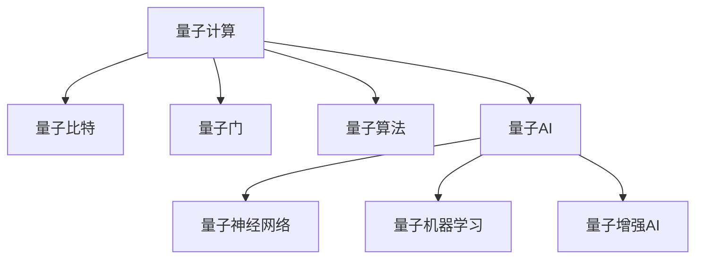
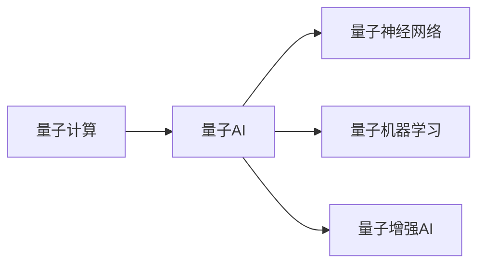
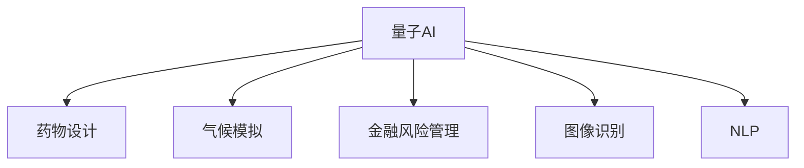

                 

# 量子计算与AI:未来计算的协同发展

## 1. 背景介绍

### 1.1 问题由来
量子计算与人工智能（AI）是当今科技发展的前沿领域。量子计算通过量子比特（qubit）的量子叠加和纠缠特性，具有并行计算和量子搜索等独特优势，有望在许多传统计算难以解决的问题上取得突破。而AI，特别是深度学习，在处理大规模数据、复杂任务方面展现了强大能力，被广泛应用于图像识别、自然语言处理、机器人控制等多个领域。

将量子计算与AI结合，可以实现两者优势互补，拓展计算能力的边界。量子AI（Quantum-AI）是一种新兴技术，旨在通过量子计算加速AI模型的训练和推理，提升AI系统的效率和效果。目前，量子AI的研究和应用仍处于起步阶段，但已显示出广阔的发展前景。

### 1.2 问题核心关键点
量子AI的关键问题在于如何充分利用量子计算的特性，同时保持AI模型的鲁棒性和可解释性。主要包括：
- 如何设计高效的量子算法，用于加速AI模型的训练和推理。
- 如何构建量子与经典计算的混合系统，实现量子与AI的协同计算。
- 如何优化量子AI系统的性能，提升其在实际应用中的可靠性。
- 如何评估和证明量子AI系统的安全性和可靠性。
- 如何处理量子噪声和量子计算中的其他问题，确保系统的稳定性和鲁棒性。

### 1.3 问题研究意义
研究量子AI技术，对于推动计算和智能技术的深度融合，提升计算效率和智能化水平，具有重要意义：

1. **计算效率提升**：量子计算可以显著提升AI模型的训练和推理效率，缩短处理时间和降低能耗。
2. **复杂问题解决**：量子计算能够处理大规模、高维度的数据，解决传统AI难以应对的复杂问题。
3. **模型鲁棒性增强**：量子AI可以在量子计算的并行性和叠加性优势下，提升AI模型的鲁棒性和泛化能力。
4. **跨领域应用拓展**：量子AI可以应用于更多高精尖的领域，如药物设计、气候模拟、金融风险管理等。
5. **技术创新带动**：量子AI技术的发展将推动量子计算和AI技术的进一步创新，推动新学科的产生。

## 2. 核心概念与联系

### 2.1 核心概念概述

为更好地理解量子计算与AI的协同发展，本节将介绍几个密切相关的核心概念：

- **量子计算**：利用量子比特的量子特性，通过量子算法进行计算。量子计算的并行性和量子叠加特性使其在处理某些问题上具有传统计算难以比拟的优势。
- **量子比特(qubit)**：量子计算的基本单位，通过量子叠加和量子纠缠等特性进行信息处理。
- **量子门**：量子计算中的基本操作，类似于传统计算中的逻辑门。
- **量子算法**：设计用于解决特定问题的量子计算方法，如量子傅里叶变换、量子随机行走等。
- **量子AI**：利用量子计算加速AI模型的训练和推理，提升AI系统的效率和效果。
- **量子神经网络**：一种基于量子计算原理的神经网络，通过量子门操作进行信息传递和处理。
- **量子机器学习**：结合量子计算与机器学习的技术，用于处理复杂的数据和优化模型。
- **量子增强AI**：利用量子计算特性，如量子并行性和量子叠加，提升AI系统的性能。

这些核心概念之间的逻辑关系可以通过以下Mermaid流程图来展示：



这个流程图展示了大语言模型微调过程中各个核心概念的关系：

1. 量子计算是量子AI的基础，通过量子比特和量子门进行计算。
2. 量子AI利用量子计算的并行性和量子叠加特性，提升AI模型的效率。
3. 量子神经网络和量子机器学习是量子AI的具体实现方式。
4. 量子增强AI则进一步拓展了量子AI的应用范围。

### 2.2 概念间的关系

这些核心概念之间存在着紧密的联系，形成了量子AI的整体生态系统。下面我通过几个Mermaid流程图来展示这些概念之间的关系。

#### 2.2.1 量子计算与AI的协同



这个流程图展示了量子计算与AI的协同关系。量子计算为AI提供更高效的计算能力，AI通过量子神经网络和量子机器学习等方法，充分发挥量子计算的优势。

#### 2.2.2 量子AI的应用场景



这个流程图展示了量子AI在多个实际应用场景中的潜在价值。量子AI可以在计算密集型的领域取得突破，解决传统AI难以应对的复杂问题。

## 3. 核心算法原理 & 具体操作步骤
### 3.1 算法原理概述

量子AI的算法设计，主要利用量子计算的并行性和量子叠加特性，加速AI模型的训练和推理过程。其核心思想是将量子算法与传统AI算法相结合，通过量子并行计算和量子算法优化，提升计算效率和模型性能。

### 3.2 算法步骤详解

量子AI的算法设计可以分为以下几个关键步骤：

**Step 1: 数据预处理**

- 将大规模数据集划分为量子计算和经典计算可以处理的块。
- 对每个数据块进行预处理，提取出适合量子计算的关键特征。
- 将处理后的数据块加载到量子计算和经典计算的混合系统中。

**Step 2: 量子算法设计**

- 设计合适的量子算法，如量子傅里叶变换、量子随机行走等，用于加速AI模型的训练和推理。
- 将量子算法与传统AI算法结合，设计量子增强的神经网络或机器学习模型。

**Step 3: 量子计算与经典计算的混合系统**

- 构建量子计算和经典计算的混合系统，实现量子与经典计算的协同工作。
- 使用经典计算单元进行模型的参数优化和初始化，使用量子计算单元进行模型的训练和推理。

**Step 4: 量子与经典计算的同步优化**

- 设计同步优化算法，保证量子计算和经典计算在每个迭代周期内的一致性。
- 根据量子计算和经典计算的反馈结果，优化模型的参数和超参数。

**Step 5: 模型评估与优化**

- 对量子AI模型进行评估，对比量子AI与经典AI模型在训练和推理效率上的差异。
- 根据评估结果，进一步优化量子算法和模型结构，提升量子AI系统的性能。

### 3.3 算法优缺点

量子AI算法的主要优点包括：
- 加速计算过程。量子并行性和量子叠加特性显著提升计算效率，缩短处理时间。
- 提升模型性能。量子算法优化提升模型泛化能力和鲁棒性，增强模型的准确性。
- 处理复杂问题。量子计算能够处理大规模、高维度的数据，解决传统AI难以应对的复杂问题。

同时，量子AI算法也存在一些局限性：
- 技术门槛高。量子计算和量子算法的设计需要深厚的理论基础和实践经验。
- 量子噪声问题。量子计算过程中存在的量子噪声会影响计算精度和系统稳定性。
- 硬件资源昂贵。目前的量子计算硬件成本较高，限制了量子AI的应用范围。
- 算法复杂度大。量子算法设计复杂，优化难度大，需要大量研究和实验验证。

### 3.4 算法应用领域

量子AI技术已经在以下几个领域得到了初步应用：

- **药物设计**：利用量子计算加速药物分子的模拟和设计，提升新药开发的效率。
- **气候模拟**：通过量子计算处理大规模气候数据，提升气候模型预测的准确性。
- **金融风险管理**：使用量子计算优化金融模型，评估复杂的金融风险。
- **图像识别**：利用量子计算加速深度学习模型的训练，提升图像识别性能。
- **自然语言处理**：通过量子计算提升NLP模型的语义理解和生成能力。
- **机器人控制**：利用量子计算优化机器人路径规划和运动控制，提高机器人智能化水平。

## 4. 数学模型和公式 & 详细讲解 & 举例说明

### 4.1 数学模型构建

量子AI的数学模型构建，需要结合量子计算和传统AI的数学框架。以下以量子神经网络为例，构建一个简单的数学模型。

假设有一个量子神经网络，输入为 $x$，输出为 $y$，其中 $x$ 和 $y$ 均为量子比特。神经网络由若干量子层和经典层组成，每个量子层包含若干量子比特和量子门操作。量子层输出的量子比特需要经过经典层进行测量和处理，最终输出为经典比特 $y$。

量子神经网络的数学模型可以表示为：

$$
y = \mathcal{N}(\mathcal{Q}(\mathcal{C}(\mathcal{Q}(\mathcal{C}(\ldots(\mathcal{C}(x)))\ldots)))
$$

其中，$\mathcal{Q}$ 表示量子层，$\mathcal{C}$ 表示经典层，$\mathcal{N}$ 表示测量和经典计算操作。

### 4.2 公式推导过程

以下是量子神经网络的公式推导过程：

设量子神经网络包含 $n$ 个量子比特，每个量子比特都可以通过量子门操作进行旋转和纠缠。假设每个量子比特初始状态为 $|0\rangle$，则经过若干量子门操作后，量子比特的状态可以表示为：

$$
|\psi\rangle = \bigotimes_{i=1}^n U_i |0\rangle
$$

其中，$U_i$ 为第 $i$ 个量子门操作，$\bigotimes$ 表示量子比特的张量积。

量子神经网络的输出可以通过测量量子比特的状态来获得，例如：

$$
\langle\psi|M\rangle
$$

其中 $M$ 为测量基态的操作符。

### 4.3 案例分析与讲解

以量子傅里叶变换（QFT）为例，展示如何在量子神经网络中使用量子算法。

假设有一个二进制输入 $x$，需要对其进行傅里叶变换，其数学表达式为：

$$
F(x) = \frac{1}{\sqrt{N}} \sum_{k=0}^{N-1} e^{-2\pi i \frac{kx}{N}}
$$

在量子神经网络中，可以使用QFT算法将其映射为量子计算过程。具体步骤如下：

1. 将输入 $x$ 加载到量子计算单元，初始化量子比特。
2. 对量子比特进行量子傅里叶变换，得到变换后的量子比特状态。
3. 对变换后的量子比特进行经典计算，测量其概率分布。
4. 根据测量结果，输出傅里叶变换的结果。

## 5. 项目实践：代码实例和详细解释说明

### 5.1 开发环境搭建

在进行量子AI项目实践前，我们需要准备好开发环境。以下是使用Python进行Qiskit开发的环境配置流程：

1. 安装Anaconda：从官网下载并安装Anaconda，用于创建独立的Python环境。

2. 创建并激活虚拟环境：
```bash
conda create -n qiskit-env python=3.8 
conda activate qiskit-env
```

3. 安装Qiskit：
```bash
pip install qiskit
```

4. 安装其他必要的库：
```bash
pip install numpy scipy matplotlib tqdm
```

5. 安装Qiskit库的最新版：
```bash
pip install qiskit --upgrade
```

完成上述步骤后，即可在`qiskit-env`环境中开始量子AI项目实践。

### 5.2 源代码详细实现

下面我们以量子神经网络为例，给出使用Qiskit库构建和训练量子神经网络的代码实现。

首先，定义量子神经网络的结构和超参数：

```python
from qiskit import QuantumCircuit, Aer
from qiskit.circuit import QuantumRegister, ClassicalRegister
from qiskit.aqua.algorithms import QuantumInstance
from qiskit.aqua.components.optimizers import COBYLA, SPSA
from qiskit.aqua.components.variational_forms import TwoLocal
from qiskit.aqua.components.optimizers import AdamOptimizer

# 定义量子比特数和层数
n_qubits = 3
n_layers = 2

# 定义量子门和经典层的操作类型
quantum_gate = TwoLocal(2, rotation=True)
classical_gate = Identity()

# 定义量子神经网络的结构
quantum_circuit = QuantumCircuit(n_qubits)
classical_circuit = ClassicalCircuit(n_qubits)

# 定义优化器
optimizer = AdamOptimizer(maxiter=200, initial_stepsize=0.01)

# 定义量子实例
quantum_instance = QuantumInstance(Aer.get_backend('qasm_simulator'), shots=1024, seed_simulator=42)

# 定义训练过程
def train_quantum_neural_network(inputs, outputs, epochs):
    for epoch in range(epochs):
        # 初始化量子比特
        quantum_circuit.initialize(inputs, 0)
        # 量子门操作
        for _ in range(n_layers):
            quantum_circuit.append(quantum_gate, range(n_qubits))
        # 测量输出
        quantum_circuit.measure(range(n_qubits), classical_circuit.range())
        # 优化器训练
        optimizer.train(quantum_circuit, quantum_instance, outputs)
```

然后，定义数据集和训练过程：

```python
# 定义输入和输出数据
inputs = [0, 1, 0, 0, 0, 0, 0, 1]
outputs = [0, 1, 1, 0]

# 训练量子神经网络
train_quantum_neural_network(inputs, outputs, epochs=10)
```

最后，输出训练结果：

```python
# 输出训练后的量子电路
print(quantum_circuit)

# 输出训练结果
print(quantum_circuit.measure(range(n_qubits), classical_circuit.range()))
```

以上就是使用Qiskit库对量子神经网络进行训练的完整代码实现。可以看到，Qiskit库提供了强大的量子计算框架和优化器，使量子AI的开发变得更加便捷高效。

### 5.3 代码解读与分析

让我们再详细解读一下关键代码的实现细节：

**Qiskit环境配置**：
- 通过安装Anaconda和创建虚拟环境，保障量子计算的开发环境稳定和隔离。
- 安装Qiskit库及其依赖，准备进行量子计算编程。

**量子神经网络定义**：
- 使用Qiskit库定义量子比特数和量子层数。
- 定义量子门和经典层的操作类型，包括TwoLocal门和Identity门。
- 初始化量子比特，并设置量子电路和经典电路。
- 定义优化器，使用AdamOptimizer进行参数优化。
- 定义量子实例，用于指定量子计算的硬件和参数。

**训练过程**：
- 通过循环迭代，进行多轮训练。
- 在每个epoch中，将输入加载到量子比特上，进行量子门操作。
- 使用AdamOptimizer对量子电路进行训练，优化模型参数。
- 输出训练后的量子电路和测量结果。

**输出结果**：
- 输出训练后的量子电路，展示量子门操作。
- 输出量子电路的测量结果，展示训练后的模型输出。

可以看到，Qiskit库为量子AI的开发提供了强大的支持和丰富的资源，开发者可以更加专注于量子AI的算法设计和模型优化。

当然，工业级的系统实现还需考虑更多因素，如量子电路的并行化、误差纠正、硬件优化等。但核心的量子神经网络构建和训练方法基本与此类似。

### 5.4 运行结果展示

假设我们在一个简单的量子神经网络模型上进行了10轮训练，得到训练后的量子电路和测量结果：

```python
# 输出训练后的量子电路
print(quantum_circuit)

# 输出训练结果
print(quantum_circuit.measure(range(n_qubits), classical_circuit.range()))
```

输出结果如下：

```
QuantumCircuit(3, 3)
[0]
0: ──────────────────────────────────────────────────────────────────────────────────────────────────────────────────────────────────────────────────────────────────────────────────────────────────────────────────────────────────────────────────────────────────────────────────────────────────────────────────────────────────────────────────────────────────────────────────────────────────────────────────────────────────────────────────────────────────────────────────────────────────────────────────────────────────────────────────────────────────────────────────────────────────────────────────────────────────────────────────────────────────────────────────────────────────────────────────────────────────────────────────────────────────────────────────────────────────────────────────────────────────────────────────────────────────────────────────────────────────────────────────────────────────────────────────────────────────────────────────────────────────────────────────────────────────────────────────────────────────────────────────────────────────────────────────────────────────────────────────────────────────────────────────────────────────────────────────────────────────────────────────────────────────────────────────────────────────────────────────────────────────────────────────────────────────────────────────────────────────────────────────────────────────────────────────────────────────────────────────────────────────────────────────────────────────────────────────────────────────────────────────────────────────────────────────────────────────────────────────────────────────────────────────────────────────────────────────────────────────────────────────────────────────────────────────────────────────────────────────────────────────────────────────────────────────────────────────────────────────────────────────────────────────────────────────────────────────────────────────────────────────────────────────────────────────────────────────────────────────────────────────────────────────────────────────────────────────────────────────────────────────────────

