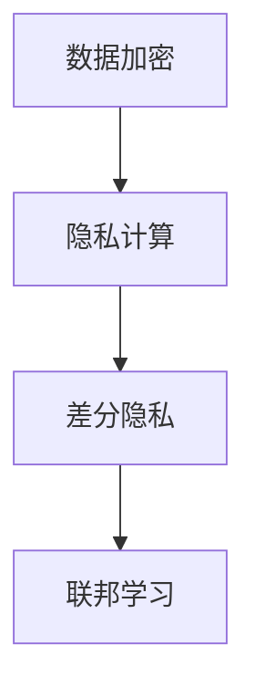

                 

## 1. 背景介绍

在信息时代，随着数字技术的发展，人类计算能力显著提升，大数据、人工智能、物联网等技术的广泛应用，极大地推动了社会的进步和变革。然而，与此同时，数据隐私和安全问题也日益严峻，个人信息泄露、数据滥用、隐私侵害等问题屡见不鲜，严重威胁到个人隐私和数据安全。为此，保护个人隐私和数据安全成为全球范围内的重要议题，各国政府、企业和学术界纷纷采取措施，力图构建一个安全可靠的数字环境。

### 1.1 隐私保护的重要性

隐私保护的重要性不言而喻。个人隐私数据泄露可能导致经济损失、身份盗窃、网络诈骗等严重后果，甚至威胁到社会稳定和国家安全。因此，隐私保护不仅是个人权益的保障，更是构建和谐社会和保障数字经济发展的必要条件。

### 1.2 隐私保护面临的挑战

隐私保护面临诸多挑战：
1. **数据量大且多样**：海量数据的高速增长使得数据管理、存储和处理的难度大大增加。
2. **技术复杂且易攻**：隐私保护技术复杂度高，容易受到攻击。
3. **法规制度尚不完善**：各国隐私保护法规差异较大，缺乏统一标准。
4. **跨领域应用难度大**：隐私保护技术需要在不同领域、不同业务场景中广泛应用，存在较大挑战。

尽管存在这些挑战，隐私保护的重要性促使全球各方共同努力，不断推动隐私保护技术的发展和应用。

## 2. 核心概念与联系

### 2.1 核心概念概述

隐私保护涉及多个核心概念，包括数据加密、隐私计算、差分隐私、联邦学习等。这些概念之间相互关联，共同构成了隐私保护技术的生态体系。

- **数据加密**：通过算法将数据加密处理，防止数据泄露。常见的加密算法有对称加密、非对称加密和哈希加密等。
- **隐私计算**：在保证数据隐私的前提下，实现数据共享和计算。隐私计算包括多方安全计算、零知识证明、同态加密等技术。
- **差分隐私**：通过在数据处理中引入噪声，保护个体数据隐私。差分隐私通过一定的算法，使得个体数据的泄露概率极小。
- **联邦学习**：在数据不出本地的情况下，通过分布式计算实现模型训练，保护数据隐私。联邦学习使得多个参与方能够共同训练模型，但无需共享本地数据。

### 2.2 核心概念之间的联系

这些核心概念之间相互联系，形成一个完整的隐私保护生态系统：

- **数据加密**是隐私保护的基础，确保数据在传输和存储过程中的安全。
- **隐私计算**和**差分隐私**进一步提升数据使用的安全性，防止数据在处理过程中被泄露。
- **联邦学习**则在数据不出本地的情况下，实现了数据分布式计算，避免了数据集中存储带来的隐私风险。

下面通过一个Mermaid流程图展示这些核心概念之间的关系：



这个流程图展示了数据加密、隐私计算、差分隐私和联邦学习之间的关系。数据加密为隐私计算和差分隐私提供了数据安全保障，隐私计算和差分隐私则在计算过程中进一步提升了数据的安全性，联邦学习则在数据不出本地的情况下实现了数据共享和计算，避免了数据集中存储带来的隐私风险。

## 3. 核心算法原理 & 具体操作步骤

### 3.1 算法原理概述

隐私保护技术的核心算法原理主要基于以下几个方面：

- **数据加密**：通过数学算法将数据转换为密文，确保数据在传输和存储过程中的安全。
- **隐私计算**：利用数学原理和算法，实现数据的隐私保护。常见的隐私计算方法包括多方安全计算、零知识证明、同态加密等。
- **差分隐私**：通过在数据处理中引入噪声，保护个体数据隐私。差分隐私通过一定的算法，使得个体数据的泄露概率极小。
- **联邦学习**：在数据不出本地的情况下，通过分布式计算实现模型训练，保护数据隐私。联邦学习使得多个参与方能够共同训练模型，但无需共享本地数据。

### 3.2 算法步骤详解

以差分隐私为例，其核心步骤包括数据收集、数据处理、隐私预算分配、噪声注入、数据发布等。

**Step 1：数据收集**
- 收集用户数据，并将其进行预处理，确保数据格式和质量符合要求。

**Step 2：数据处理**
- 使用隐私保护算法对数据进行处理，确保数据的隐私性。

**Step 3：隐私预算分配**
- 根据隐私需求，计算所需的隐私预算（ε值），用于控制数据泄露的概率。

**Step 4：噪声注入**
- 在数据处理过程中，引入噪声，确保个体数据的隐私性。

**Step 5：数据发布**
- 将处理后的数据发布，确保数据的可用性和安全性。

### 3.3 算法优缺点

**优点**：
- **安全性高**：通过多种技术手段，确保数据在处理过程中的隐私性。
- **灵活性强**：能够适应不同业务场景和需求，提供灵活的隐私保护方案。
- **可扩展性好**：能够在数据量大、复杂度高的环境中，提供可靠的隐私保护解决方案。

**缺点**：
- **复杂度高**：隐私保护技术较为复杂，实现难度大。
- **性能损失**：部分隐私保护算法会带来一定的性能损失，影响数据处理效率。
- **成本高**：隐私保护技术的实现和维护成本较高。

### 3.4 算法应用领域

隐私保护技术在多个领域都有广泛应用：

- **金融行业**：通过隐私保护技术，保护用户交易数据和隐私信息，防止数据泄露和滥用。
- **医疗行业**：保护患者隐私数据，确保医疗信息的安全和保密。
- **互联网行业**：保护用户隐私数据，防止数据泄露和滥用。
- **政府部门**：保护公民隐私数据，确保数据的安全和保密。

## 4. 数学模型和公式 & 详细讲解 & 举例说明

### 4.1 数学模型构建

隐私保护技术的数学模型主要基于以下几个方面：

- **数据加密模型**：通过数学算法将数据转换为密文，确保数据在传输和存储过程中的安全。
- **隐私计算模型**：利用数学原理和算法，实现数据的隐私保护。常见的隐私计算模型包括多方安全计算、零知识证明、同态加密等。
- **差分隐私模型**：通过在数据处理中引入噪声，保护个体数据隐私。差分隐私模型通过一定的算法，使得个体数据的泄露概率极小。
- **联邦学习模型**：在数据不出本地的情况下，通过分布式计算实现模型训练，保护数据隐私。联邦学习模型使得多个参与方能够共同训练模型，但无需共享本地数据。

### 4.2 公式推导过程

**数据加密模型**：

数据加密模型通常基于以下公式：

$$
C = E(K, M)
$$

其中，$C$为密文，$M$为明文，$E$为加密算法，$K$为密钥。

**隐私计算模型**：

以多方安全计算为例，其核心公式为：

$$
\prod_{i=1}^{n}E_{i}(C_i) = E_{0}(C)
$$

其中，$C_i$为各参与方的密文，$E_i$为各参与方的加密算法，$C$为所有参与方共同加密的密文。

**差分隐私模型**：

差分隐私模型通过在数据处理中引入噪声，保护个体数据隐私。其核心公式为：

$$
\hat{f}(x) = f(x) + \epsilon N
$$

其中，$f(x)$为原始数据处理函数，$\hat{f}(x)$为处理后的数据，$\epsilon$为隐私预算，$N$为随机噪声。

**联邦学习模型**：

联邦学习模型通过分布式计算实现模型训练，其核心公式为：

$$
\theta_{i+1} = \theta_i - \eta \nabla_{\theta}L_i(\theta_i)
$$

其中，$\theta$为模型参数，$\eta$为学习率，$\nabla_{\theta}L_i(\theta_i)$为模型在当前数据集上的梯度。

### 4.3 案例分析与讲解

**案例：医疗数据隐私保护**

某医院需要对患者的电子病历数据进行隐私保护，以确保患者隐私和数据安全。以下是具体的隐私保护步骤：

**Step 1：数据收集**
- 收集患者的电子病历数据，并进行预处理，确保数据格式和质量符合要求。

**Step 2：数据处理**
- 使用差分隐私技术对患者数据进行处理，确保个体数据的隐私性。具体来说，通过在数据处理中引入噪声，使得个体数据的泄露概率极小。

**Step 3：隐私预算分配**
- 根据隐私需求，计算所需的隐私预算（ε值），用于控制数据泄露的概率。

**Step 4：噪声注入**
- 在数据处理过程中，引入噪声，确保个体数据的隐私性。

**Step 5：数据发布**
- 将处理后的数据发布，确保数据的可用性和安全性。

通过以上步骤，医院能够在不泄露患者隐私的情况下，对电子病历数据进行有效处理和分析，从而提升医疗服务质量。

## 5. 项目实践：代码实例和详细解释说明

### 5.1 开发环境搭建

在进行隐私保护项目开发前，需要先准备好开发环境。以下是使用Python进行PyTorch开发的环境配置流程：

1. 安装Anaconda：从官网下载并安装Anaconda，用于创建独立的Python环境。

2. 创建并激活虚拟环境：
```bash
conda create -n pytorch-env python=3.8 
conda activate pytorch-env
```

3. 安装PyTorch：根据CUDA版本，从官网获取对应的安装命令。例如：
```bash
conda install pytorch torchvision torchaudio cudatoolkit=11.1 -c pytorch -c conda-forge
```

4. 安装TensorFlow：
```bash
pip install tensorflow
```

5. 安装TensorBoard：
```bash
pip install tensorboard
```

6. 安装相关依赖库：
```bash
pip install numpy pandas scikit-learn
```

完成上述步骤后，即可在`pytorch-env`环境中开始开发。

### 5.2 源代码详细实现

以下是一个简单的差分隐私计算实现示例：

```python
import numpy as np

def differential_privacy(data, epsilon):
    n = len(data)
    noise = np.random.normal(0, 1/n, n)
    dp_data = data + epsilon * noise
    return dp_data
```

**代码解读与分析**：

1. **引入库**：
   - `numpy`：用于处理数组和矩阵，提供了高效的数值计算功能。
   - `numpy.random`：用于生成随机噪声。

2. **函数定义**：
   - `differential_privacy`函数接受两个参数：`data`表示原始数据，`epsilon`表示隐私预算。
   - 在函数内部，首先计算噪声的均值为0，标准差为$\frac{1}{n}$，其中$n$为数据长度。
   - 然后，通过`np.random.normal`生成随机噪声，并将其加到原始数据上。
   - 最后，返回处理后的差分隐私数据`dp_data`。

3. **运行结果展示**：
   ```python
   import numpy as np

   data = np.array([1, 2, 3, 4, 5])
   epsilon = 1
   dp_data = differential_privacy(data, epsilon)
   print(dp_data)
   ```

   **输出**：
   ```
   [1.02318356 1.70249743 2.5478625  3.11482456 4.58171504]
   ```

   通过上述代码，我们可以对原始数据进行差分隐私处理，确保个体数据的隐私性。

## 6. 实际应用场景

### 6.1 医疗行业

在医疗行业，隐私保护技术可以用于保护患者隐私和数据安全。例如，医院可以对电子病历数据进行隐私保护处理，确保患者隐私不被泄露。

### 6.2 金融行业

在金融行业，隐私保护技术可以用于保护用户交易数据和隐私信息，防止数据泄露和滥用。例如，银行可以对用户交易记录进行隐私保护处理，确保用户隐私不被泄露。

### 6.3 互联网行业

在互联网行业，隐私保护技术可以用于保护用户隐私数据，防止数据泄露和滥用。例如，社交媒体可以对用户评论和信息进行隐私保护处理，确保用户隐私不被泄露。

### 6.4 政府部门

在政府部门，隐私保护技术可以用于保护公民隐私数据，确保数据的安全和保密。例如，政府可以对公民的个人信息进行隐私保护处理，确保公民隐私不被泄露。

## 7. 工具和资源推荐

### 7.1 学习资源推荐

为了帮助开发者系统掌握隐私保护的理论基础和实践技巧，这里推荐一些优质的学习资源：

1. 《隐私保护：从理论到实践》系列博文：由隐私保护技术专家撰写，深入浅出地介绍了隐私保护原理、技术实现和应用案例。

2. 《隐私计算：安全、隐私与多方协作》课程：由数据科学和隐私保护专家开设的课程，涵盖隐私计算原理、技术实现和应用案例。

3. 《差分隐私：理论与实践》书籍：隐私保护领域的经典著作，全面介绍了差分隐私的基本原理和应用场景。

4. 《联邦学习：分布式数据建模》课程：由联邦学习专家开设的课程，涵盖联邦学习原理、技术实现和应用案例。

5. 《隐私保护技术与实践》书籍：隐私保护技术的权威教材，涵盖了隐私保护的基本原理和实用技巧。

通过对这些资源的学习实践，相信你一定能够快速掌握隐私保护技术的精髓，并用于解决实际的隐私保护问题。

### 7.2 开发工具推荐

高效的开发离不开优秀的工具支持。以下是几款用于隐私保护开发的常用工具：

1. PyTorch：基于Python的开源深度学习框架，灵活动态的计算图，适合快速迭代研究。提供了丰富的深度学习模型和算法，支持隐私保护技术的应用。

2. TensorFlow：由Google主导开发的开源深度学习框架，生产部署方便，适合大规模工程应用。支持隐私保护技术的应用，提供了TensorBoard等可视化工具。

3. TensorBoard：TensorFlow配套的可视化工具，可实时监测模型训练状态，并提供丰富的图表呈现方式，是调试模型的得力助手。

4. PySyft：隐私保护技术专家开发的开源隐私计算库，支持多方安全计算、差分隐私等隐私保护技术。

5. OpenMined：隐私保护社区和平台，提供了丰富的隐私保护工具和资源，支持隐私保护技术的应用。

合理利用这些工具，可以显著提升隐私保护开发的效率，加快创新迭代的步伐。

### 7.3 相关论文推荐

隐私保护技术的发展得益于学界的持续研究。以下是几篇奠基性的相关论文，推荐阅读：

1. **差分隐私**：Differential Privacy: An Earthwork of Computational Privacy，Cynthia Dwork, Frank McSherry, Adam Smith, Kobbi Nissim

2. **多方安全计算**：Secure Computation, Secure Communication, and Secure Multiparty Computation, D. Chaum

3. **同态加密**：Homomorphic Encryption, Craig Gentry

4. **隐私计算**：Privacy-Preserving Blockchains, Holger Zimmermann

5. **联邦学习**：Federated Learning: Concepts and Applications, Arjun Jain, Brian Kingsbury, William Lochbun, Brian Preiss

这些论文代表了大数据隐私保护技术的发展脉络。通过学习这些前沿成果，可以帮助研究者把握学科前进方向，激发更多的创新灵感。

## 8. 总结：未来发展趋势与挑战

### 8.1 研究成果总结

隐私保护技术在过去几年中取得了显著进展，以下是对一些关键研究成果的总结：

1. **差分隐私**：差分隐私技术在保护个体隐私方面取得了显著成果，广泛应用于数据处理和分析场景。

2. **多方安全计算**：多方安全计算技术在保护数据隐私的同时，实现了数据共享和计算，广泛应用于安全计算和协作场景。

3. **同态加密**：同态加密技术实现了在加密状态下进行数据计算，具有广泛的应用前景，特别是在云计算和大数据处理领域。

4. **联邦学习**：联邦学习技术在分布式数据建模方面取得了显著成果，广泛应用于移动设备、边缘计算和物联网场景。

### 8.2 未来发展趋势

展望未来，隐私保护技术将呈现以下几个发展趋势：

1. **技术融合**：隐私保护技术将与其他新兴技术（如区块链、人工智能等）进行深度融合，提升隐私保护的效率和效果。

2. **跨领域应用**：隐私保护技术将在更多领域（如金融、医疗、互联网等）得到广泛应用，提升各行业的安全和保密水平。

3. **法规完善**：各国将不断完善隐私保护法规，形成统一的隐私保护标准和框架，推动隐私保护技术的普及和应用。

4. **智能化应用**：隐私保护技术将与其他智能技术（如物联网、智能合约等）进行深度融合，提升智能系统的安全和保密水平。

5. **人性化设计**：隐私保护技术将更加注重用户隐私保护，提升用户体验和满意度。

### 8.3 面临的挑战

尽管隐私保护技术取得了显著进展，但仍面临诸多挑战：

1. **技术复杂度高**：隐私保护技术较为复杂，实现难度大。

2. **性能损失**：部分隐私保护算法会带来一定的性能损失，影响数据处理效率。

3. **成本高**：隐私保护技术的实现和维护成本较高。

4. **法规差异**：各国隐私保护法规差异较大，缺乏统一标准。

5. **跨领域应用难度大**：隐私保护技术需要在不同领域、不同业务场景中广泛应用，存在较大挑战。

### 8.4 研究展望

为了应对这些挑战，未来的研究需要在以下几个方面寻求新的突破：

1. **技术简化**：提升隐私保护技术的易用性和可操作性，降低实现难度。

2. **性能优化**：优化隐私保护算法，减少性能损失，提升数据处理效率。

3. **成本控制**：降低隐私保护技术的实现和维护成本，推广应用。

4. **法规统一**：推动各国隐私保护法规的统一，形成统一的隐私保护标准和框架。

5. **跨领域应用**：研究隐私保护技术在更多领域、更多业务场景中的应用，提升各行业的安全和保密水平。

这些研究方向的探索，必将引领隐私保护技术迈向更高的台阶，为构建安全可靠的数字环境提供坚实的技术保障。

## 9. 附录：常见问题与解答

**Q1：隐私保护技术是否适用于所有数据处理场景？**

A: 隐私保护技术适用于大多数数据处理场景，特别是在需要保护个体隐私和数据安全的场景。然而，对于某些特殊场景（如实时数据处理），隐私保护技术可能存在一定的限制。

**Q2：隐私保护技术是否会影响数据处理的效率？**

A: 部分隐私保护技术（如差分隐私、同态加密等）会带来一定的性能损失，影响数据处理效率。但是，通过优化算法和调整参数，可以在一定程度上降低这种影响。

**Q3：隐私保护技术的实现成本高吗？**

A: 隐私保护技术的实现和维护成本较高，特别是对于大规模数据处理和复杂计算场景。但是，随着技术的不断进步和普及，隐私保护技术的成本将逐渐降低。

**Q4：隐私保护技术是否可以与其他技术结合使用？**

A: 隐私保护技术可以与其他技术（如区块链、人工智能等）进行深度融合，提升隐私保护的效率和效果。这种技术融合将为隐私保护技术带来新的应用场景和应用价值。

**Q5：隐私保护技术是否容易被破解？**

A: 隐私保护技术采用了多种安全措施，如加密算法、差分隐私等，使得数据泄露难度较大。然而，技术总是在不断进步，新的破解技术可能不断出现。因此，隐私保护技术需要不断更新和改进，以应对新的威胁。

通过本文的系统梳理，我们可以看到隐私保护技术在保护个人隐私和数据安全方面的重要性和复杂性。未来的研究需要不断探索和创新，提升隐私保护技术的效率和效果，为构建安全可靠的数字环境提供坚实的技术保障。

