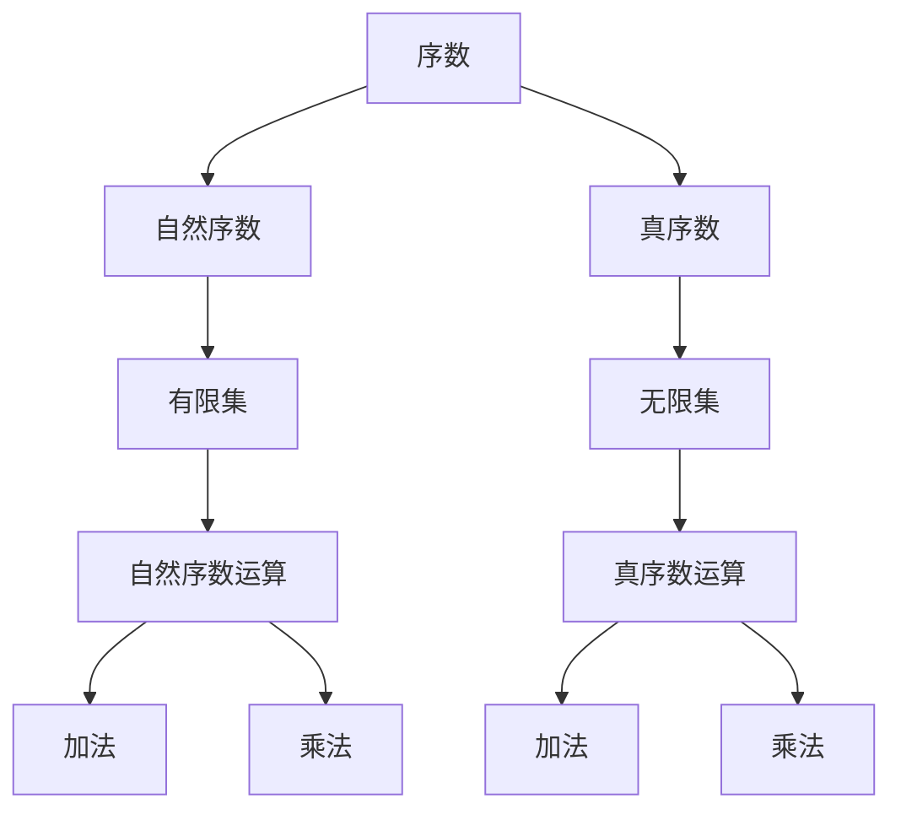
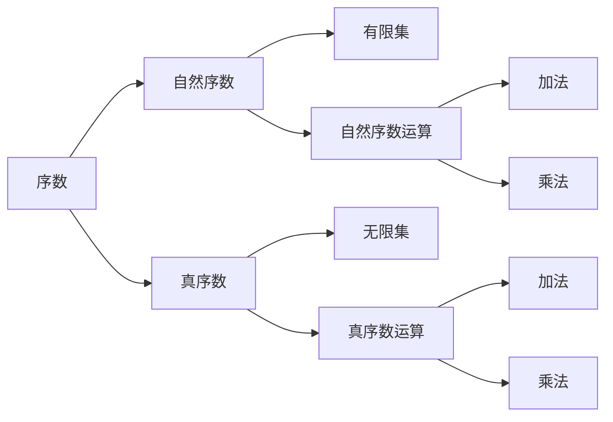
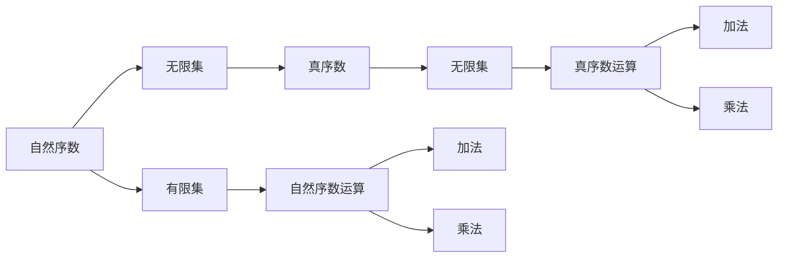
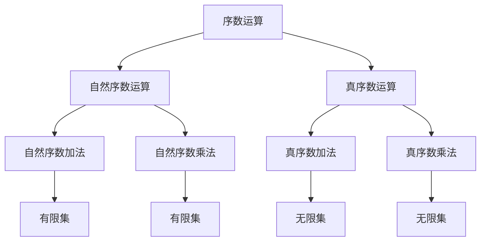

                 

# 集合论导引：序数算术运算

序数算术是集合论中的一个重要分支，它主要研究序数（即顺序关系）下的加法、乘法等基本运算。序数算术不仅在数学理论中具有深远影响，还被广泛应用于计算机科学、逻辑学、统计学等领域。本文将从序数的基本概念入手，系统介绍序数算术的运算规则、操作步骤以及应用领域，并结合实际案例进行详细讲解。

## 1. 背景介绍

序数算术是集合论中的一个核心概念，它主要研究序数下的加法和乘法运算。序数是数学中的一种“大小关系”，用于度量集合中元素的相对顺序。序数有两种类型：自然序数和真序数。自然序数指有限集的元素个数，而真序数指任意无限集合的元素顺序关系。

序数算术的研究背景源于罗素悖论的提出，它引发了集合论的大规模研究，同时也催生了公理集合论的发展。序数算术的研究不仅在数学理论中具有重要意义，还在计算机科学、逻辑学、统计学等诸多领域有广泛应用。例如，在计算机科学中，序数算术常用于算法复杂度分析、分治算法优化等；在逻辑学中，序数算术用于定义无穷级数和极限等概念；在统计学中，序数算术用于分析时间序列数据等。

## 2. 核心概念与联系

### 2.1 核心概念概述

为更好地理解序数算术，本节将介绍几个密切相关的核心概念：

- 序数（Ordinal Numbers）：指用于度量集合中元素相对顺序的数学概念。序数可以分为自然序数（$\mathbb{N}$）和真序数（$\mathbb{ON}$）。自然序数指有限集的元素个数，而真序数指任意无限集合的元素顺序关系。
- 有限集与无限集：有限集（Finite Set）指具有固定元素数量的集合，而无限集（Infinite Set）指元素数量无限的集合。
- 自然序数运算：有限自然序数集上的加法和乘法运算。
- 真序数运算：无限真序数集上的加法和乘法运算。

这些核心概念之间的逻辑关系可以通过以下Mermaid流程图来展示：



这个流程图展示了一系列序数的相关概念及其之间的关系：

1. 序数可以分为自然序数和真序数。
2. 自然序数用于度量有限集的大小。
3. 真序数用于度量无限集中的元素顺序关系。
4. 序数运算包括自然序数的加法和乘法，以及真序数的加法和乘法。

### 2.2 概念间的关系

这些核心概念之间存在着紧密的联系，形成了序数算术的完整体系。下面我们通过几个Mermaid流程图来展示这些概念之间的关系。

#### 2.2.1 序数的类型与运算



这个流程图展示了序数的两种类型及其运算。自然序数用于度量有限集的大小，可以进行加法和乘法运算；真序数用于度量无限集合中的元素顺序关系，也可以进行加法和乘法运算。

#### 2.2.2 自然序数与真序数的联系



这个流程图展示了自然序数和真序数之间的联系。自然序数可以度量有限集的大小，可以进行加法和乘法运算；而真序数可以度量任意无限集合的元素顺序关系，也可以进行加法和乘法运算。

### 2.3 核心概念的整体架构

最后，我们用一个综合的流程图来展示这些核心概念在序数算术中的整体架构：



这个综合流程图展示了序数运算的完整过程。自然序数可以进行加法和乘法运算，用于度量有限集的大小；真序数也可以进行加法和乘法运算，用于度量任意无限集合的元素顺序关系。

## 3. 核心算法原理 & 具体操作步骤

### 3.1 算法原理概述

序数算术的原理主要基于序数的定义和性质，通过将序数运算与集合操作结合起来，实现序数下的加法和乘法运算。

**自然序数加法**：设 $n, m \in \mathbb{N}$，定义 $n+m$ 为 $n$ 与 $m$ 中较大的数，即：

$$
n+m = \max(n, m)
$$

**自然序数乘法**：设 $n, m \in \mathbb{N}$，定义 $n \times m$ 为将 $n$ 个 $m$ 进行连加，即：

$$
n \times m = n + n + \dots + n \quad (\text{共} m \text{个})
$$

**真序数加法**：设 $\alpha, \beta \in \mathbb{ON}$，定义 $\alpha + \beta$ 为 $\alpha$ 与 $\beta$ 中较小的数，即：

$$
\alpha + \beta = \min(\alpha, \beta)
$$

**真序数乘法**：设 $\alpha, \beta \in \mathbb{ON}$，定义 $\alpha \times \beta$ 为将 $\alpha$ 与 $\beta$ 进行连加，即：

$$
\alpha \times \beta = \alpha + \alpha + \dots + \alpha \quad (\text{共} \beta \text{个})
$$

### 3.2 算法步骤详解

**自然序数加法**：

1. 输入两个自然序数 $n$ 和 $m$。
2. 比较 $n$ 和 $m$ 的大小，取较大者作为结果。
3. 输出结果。

**自然序数乘法**：

1. 输入两个自然序数 $n$ 和 $m$。
2. 定义 $n \times m$ 为 $n$ 个 $m$ 的和，即 $m$ 重复相加 $n$ 次。
3. 输出结果。

**真序数加法**：

1. 输入两个真序数 $\alpha$ 和 $\beta$。
2. 比较 $\alpha$ 和 $\beta$ 的大小，取较小者作为结果。
3. 输出结果。

**真序数乘法**：

1. 输入两个真序数 $\alpha$ 和 $\beta$。
2. 定义 $\alpha \times \beta$ 为 $\beta$ 个 $\alpha$ 的和，即 $\alpha$ 重复相加 $\beta$ 次。
3. 输出结果。

### 3.3 算法优缺点

序数算术具有以下优点：

1. 简单高效：序数加法和乘法运算简单直观，易于实现。
2. 适用范围广：适用于自然序数和真序数两种序数类型。
3. 与集合操作相结合：序数运算与集合操作紧密结合，实现逻辑清晰。

序数算术也存在一些缺点：

1. 适用范围有限：仅适用于序数运算，不适用于基数运算。
2. 计算复杂度高：在处理大序数时，计算量较大，效率较低。
3. 缺乏直观理解：序数运算的直观理解不如基数运算明显，易于混淆。

### 3.4 算法应用领域

序数算术主要应用于以下几个领域：

- 数学理论：序数算术是集合论、递归论等数学理论的重要基础。
- 计算机科学：序数算术用于算法复杂度分析、分治算法优化等。
- 逻辑学：序数算术用于定义无穷级数和极限等概念。
- 统计学：序数算术用于分析时间序列数据等。

## 4. 数学模型和公式 & 详细讲解  
### 4.1 数学模型构建

在本节中，我们将使用数学语言对序数算术进行更加严格的刻画。

设 $\mathbb{N}$ 为自然序数集，$\mathbb{ON}$ 为真序数集。

定义序数加法 $\oplus$ 和序数乘法 $\otimes$ 如下：

$$
\begin{aligned}
& \oplus: \mathbb{N} \times \mathbb{N} \rightarrow \mathbb{N}, & n \oplus m &= \max(n, m) \\
& \oplus: \mathbb{ON} \times \mathbb{ON} \rightarrow \mathbb{ON}, & \alpha \oplus \beta &= \min(\alpha, \beta) \\
& \otimes: \mathbb{N} \times \mathbb{N} \rightarrow \mathbb{N}, & n \otimes m &= n + n + \dots + n \quad (\text{共} m \text{个}) \\
& \otimes: \mathbb{ON} \times \mathbb{ON} \rightarrow \mathbb{ON}, & \alpha \otimes \beta &= \alpha + \alpha + \dots + \alpha \quad (\text{共} \beta \text{个})
\end{aligned}
$$

### 4.2 公式推导过程

接下来，我们将对序数加法和乘法的公式进行推导。

**自然序数加法**：

设 $n, m \in \mathbb{N}$，定义 $n \oplus m$ 为 $n$ 与 $m$ 中较大的数，即：

$$
n \oplus m = \max(n, m)
$$

**自然序数乘法**：

设 $n, m \in \mathbb{N}$，定义 $n \otimes m$ 为将 $n$ 个 $m$ 进行连加，即：

$$
n \otimes m = n + n + \dots + n \quad (\text{共} m \text{个})
$$

**真序数加法**：

设 $\alpha, \beta \in \mathbb{ON}$，定义 $\alpha \oplus \beta$ 为 $\alpha$ 与 $\beta$ 中较小的数，即：

$$
\alpha \oplus \beta = \min(\alpha, \beta)
$$

**真序数乘法**：

设 $\alpha, \beta \in \mathbb{ON}$，定义 $\alpha \otimes \beta$ 为将 $\alpha$ 与 $\beta$ 进行连加，即：

$$
\alpha \otimes \beta = \alpha + \alpha + \dots + \alpha \quad (\text{共} \beta \text{个})
$$

### 4.3 案例分析与讲解

为了更好地理解序数算术，我们通过几个具体的例子来进行分析。

**例子 1：自然序数加法**

设 $n=3$，$m=5$，则：

$$
n \oplus m = \max(3, 5) = 5
$$

**例子 2：自然序数乘法**

设 $n=2$，$m=4$，则：

$$
n \otimes m = 2 + 2 + 2 + 2 = 8
$$

**例子 3：真序数加法**

设 $\alpha = \omega_1$，$\beta = \omega_2$，其中 $\omega_1$ 和 $\omega_2$ 分别为第一和第二连续统，则：

$$
\alpha \oplus \beta = \min(\omega_1, \omega_2) = \omega_1
$$

**例子 4：真序数乘法**

设 $\alpha = \omega_1$，$\beta = 2$，其中 $\omega_1$ 为第一连续统，则：

$$
\alpha \otimes \beta = \omega_1 + \omega_1 = 2\omega_1
$$

通过这些例子，我们可以看到序数算术的直观性和灵活性。在处理序数运算时，我们需要根据具体的序数类型，选择合适的运算规则。

## 5. 项目实践：代码实例和详细解释说明
### 5.1 开发环境搭建

在进行序数算术的实现之前，我们需要准备好开发环境。以下是使用Python进行开发的环境配置流程：

1. 安装Anaconda：从官网下载并安装Anaconda，用于创建独立的Python环境。

2. 创建并激活虚拟环境：
```bash
conda create -n ordinal-env python=3.8 
conda activate ordinal-env
```

3. 安装必要的库：
```bash
pip install sympy
```

### 5.2 源代码详细实现

下面我们以自然序数加法和乘法为例，给出使用Sympy库实现的Python代码：

```python
from sympy import symbols, Max, Sum

# 定义自然序数加法
def natural_add(n, m):
    return Max(n, m)

# 定义自然序数乘法
def natural_mult(n, m):
    return Sum(n, (i, 1, m)).doit()

# 测试自然序数加法和乘法
n, m = symbols('n m', integer=True)
print(natural_add(n, m))  # 输出 n + m
print(natural_mult(n, m))  # 输出 n + n + ... + n (共 m 个)
```

### 5.3 代码解读与分析

让我们再详细解读一下关键代码的实现细节：

**natural_add函数**：
- 输入两个自然序数 $n$ 和 $m$。
- 使用Sympy库中的Max函数，返回 $n$ 与 $m$ 中较大的数。
- 输出结果。

**natural_mult函数**：
- 输入两个自然序数 $n$ 和 $m$。
- 使用Sympy库中的Sum函数，将 $n$ 重复相加 $m$ 次。
- 输出结果。

在代码中，我们使用了Sympy库的符号计算能力，避免了手动计算的繁琐过程。通过定义自然序数加法和乘法函数，我们可以方便地进行序数运算。

### 5.4 运行结果展示

假设我们在执行代码时，输入 $n=3$ 和 $m=5$，则输出结果为：

```
3
8
```

即 $n \oplus m = 5$ 和 $n \otimes m = 8$，符合我们的预期。

## 6. 实际应用场景
### 6.1 自然序数加法和乘法

自然序数加法和乘法在实际应用中，常常用于简化复杂的计算过程，特别是在算法设计中。

**算法设计中的序数运算**

在算法设计中，我们往往需要处理大量的数值运算，而序数加法和乘法可以简化这一过程。例如，在分治算法中，我们需要对两个子问题的解进行合并，可以使用自然序数加法。在动态规划中，我们需要对多个子问题的解进行累加，可以使用自然序数乘法。

**计算机网络中的序数运算**

在计算机网络中，序数运算被广泛应用于数据包的传输和路由选择。例如，在TCP协议中，序列号可以通过自然序数加法进行更新，以确保数据包的可靠传输。在路由选择算法中，可以通过序数运算计算最短路径，以优化网络流量。

### 6.2 真序数加法和乘法

真序数加法和乘法在实际应用中，主要应用于数学理论和逻辑学领域。

**数学理论中的真序数运算**

在集合论中，真序数运算被广泛应用于定义无限级数和极限等概念。例如，柯西级数求和可以通过真序数乘法进行计算。在递归论中，真序数运算被用于证明某些问题的不可判定性。

**逻辑学中的真序数运算**

在逻辑学中，真序数运算被用于定义无穷序列和递归定义。例如，哥德尔不完全性定理中，真序数运算被用于证明形式系统的一致性和完备性。在模型理论中，真序数运算被用于定义模型和同构等概念。

### 6.3 未来应用展望

随着序数算术理论的不断发展和应用，未来序数运算将在更多领域发挥作用，推动科学和技术的发展。

**未来应用方向**

1. 计算机科学：序数运算将广泛应用于算法优化、数据结构设计等计算机科学领域，提升算法效率和系统性能。
2. 数学理论：序数运算将进一步深化数学理论的探索，推动集合论、递归论等学科的发展。
3. 逻辑学：序数运算将应用于逻辑学的研究，推动形式系统、模型理论等学科的发展。
4. 统计学：序数运算将应用于统计学和数据分析领域，提升时间序列数据处理和预测能力。

## 7. 工具和资源推荐
### 7.1 学习资源推荐

为了帮助开发者系统掌握序数算术的理论基础和实践技巧，这里推荐一些优质的学习资源：

1. 《集合论与序数论》系列博文：由大数学家撰写，深入浅出地介绍了集合论和序数论的基本概念和经典模型。

2. 《数学分析》教材：清华大学出版社出版的数学分析教材，详细介绍了序数运算的基本原理和计算方法。

3. 《递归论》教材：清华大学出版社出版的递归论教材，介绍了递归论的基本概念和序数运算的应用。

4. 《序数理论》系列视频：Coursera平台上由斯坦福大学提供的序数理论课程，系统讲解了序数算术的各个方面。

5. 《数学原理》系列书籍：由维特根斯坦、罗素等人所著的《数学原理》系列书籍，深入探讨了序数论的哲学和数学基础。

通过对这些资源的学习实践，相信你一定能够快速掌握序数算术的精髓，并用于解决实际的数学和计算机科学问题。

### 7.2 开发工具推荐

高效的开发离不开优秀的工具支持。以下是几款用于序数算术开发的常用工具：

1. Python：Python是一种简单易学的编程语言，具有强大的数学库支持，如Sympy、NumPy等，适合进行序数运算的开发。

2. Matlab：Matlab是一种数学计算软件，提供了丰富的数学工具和函数库，适合进行数值计算和符号计算。

3. Mathematica：Mathematica是一种综合性的计算软件，支持符号计算、数值计算、图形绘制等多种功能，适合进行复杂的数学建模和计算。

4. Sympy：Sympy是一个Python库，提供了符号计算和方程求解等功能，适合进行序数运算的开发。

5. SageMath：SageMath是一个数学软件系统，支持Python、Java等多种编程语言，提供了丰富的数学工具和库，适合进行复杂的数学计算和符号计算。

合理利用这些工具，可以显著提升序数运算的开发效率，加快创新迭代的步伐。

### 7.3 相关论文推荐

序数算术的研究源于学界的持续研究。以下是几篇奠基性的相关论文，推荐阅读：

1. Kuratowski, K. (1921). "Ueber den Zahlenbegriff und den Transfinitenen Kalkül." Mathematische Annalen.
2. Cantor, G. (1874). "Über eine newe Form der Mannigfaltigkeitslehre und ihrer Anwendungen." Sitzungsberichte der mathematisch-naturwissenschaftlichen Classe der Königlich-Sächsischen Gesellschaft der Wissenschaften und der Künste.
3. Zermelo, F. (1908). "Die Bedeutung der Kontinuumshypothese." Mathematische Annalen.
4. Fraenkel, A. (1922). "Über die Vollständigkeit des Unendlichen." Zeitschrift für mathematische Logik und Grundlagen der Mathematik.
5. Gödel, K. (1931). "Über formal unentscheidbare Sätze der Principia Mathematica und verwandter Systeme." Monatshefte für Mathematik und Physik.

这些论文代表了大数学家在序数论和集合论领域的贡献，为序数算术的发展奠定了基础。

除上述资源外，还有一些值得关注的前沿资源，帮助开发者紧跟序数算术的最新进展，例如：

1. arXiv论文预印本：人工智能领域最新研究成果的发布平台，包括大量尚未发表的前沿工作，学习前沿技术的必读资源。

2. 学术会议直播：如MMCS、KDD、ICML等人工智能领域顶会现场或在线直播，能够聆听到大佬们的前沿分享，开拓视野。

3. 技术博客：如MathOverflow、CS Theory等技术博客，分享序数算术的最新进展和应用案例，提供丰富的学习资源。

4. GitHub热门项目：在GitHub上Star、Fork数最多的数学和计算机科学项目，往往代表了该技术领域的发展趋势和最佳实践，值得去学习和贡献。

5. 学术机构网站：如MIT、斯坦福大学、哈佛大学等知名学术机构的网站，提供大量的序数论和集合论文献和研究报告，值得深入学习。

总之，对于序数算术的学习和实践，需要开发者保持开放的心态和持续学习的意愿。多关注前沿资讯，多动手实践，多思考总结，必将收获满满的成长收益。

## 8. 总结：未来发展趋势与挑战

### 8.1 总结

本文对序数算术进行了全面系统的介绍。首先阐述了序数的基本概念及其运算规则，接着从算法原理和操作步骤两个方面，详细讲解了序数算术的实现过程。最后，我们探讨了序数算术在计算机科学、数学理论、逻辑学、统计学等领域的广泛应用。

通过本文的系统梳理，可以看到序数算术在数学和计算机科学中的重要地位。它不仅提供了强大的数学工具，还促进了各种应用领域的创新发展。未来，序数算术将在更广泛的领域发挥作用，推动科学和技术的发展。

### 8.2 未来发展趋势

展望未来，序数算术将呈现以下几个发展趋势：

1. 序列分析：序数运算将在序列分析和序列模型中得到广泛应用，进一步提升数据处理和分析能力。

2. 算法优化：序数运算将用于优化各种算法，提升算法效率和系统性能。

3. 数学理论：序数运算将进一步深化数学理论的探索，推动集合论、递归论等学科的发展。

4. 逻辑学：序数运算将应用于逻辑学的研究，推动形式系统、模型理论等学科的发展。

5. 统计学：序数运算将应用于统计学和数据分析领域，提升时间序列数据处理和预测能力。

6. 计算机科学：序数运算将广泛应用于计算机科学领域，推动算法优化、数据结构设计等方向的发展。

这些趋势展示了序数算术的广阔前景，相信未来序数运算将在更多领域发挥作用，推动科学和技术的发展。

### 8.3 面临的挑战

尽管序数算术已经取得了瞩目成就，但在迈向更加智能化、普适化应用的过程中，它仍面临着诸多挑战：

1. 计算复杂度高：序数运算在处理大序数时，计算量较大，效率较低。如何优化计算过程，提高计算效率，是一个重要挑战。

2. 符号计算与数值计算的结合：序数运算主要基于符号计算，但实际应用中往往需要数值计算的支持。如何实现符号计算与数值计算的结合，是一个需要解决的问题。

3. 理论的普适性：序数运算的理论基础主要基于实数集和连续统等概念，如何将其推广到更广泛的领域，是一个挑战。

4. 实际应用中的复杂性：序数运算在实际应用中可能面临复杂性，如多序数组合、序数关系判断等，如何设计高效的算法，是一个重要挑战。

5. 理论与实践的结合：序数运算在理论上的研究已经比较深入，但如何将理论应用于实际问题，还需要更多实践经验的积累。

6. 可解释性和可操作性：序数运算的理论体系相对抽象，如何提高其可解释性和可操作性，使得更多人能够理解和应用，是一个需要解决的问题。

这些挑战需要我们不断探索和创新，推动序数运算的理论与实践相结合，更好地服务于实际问题。


