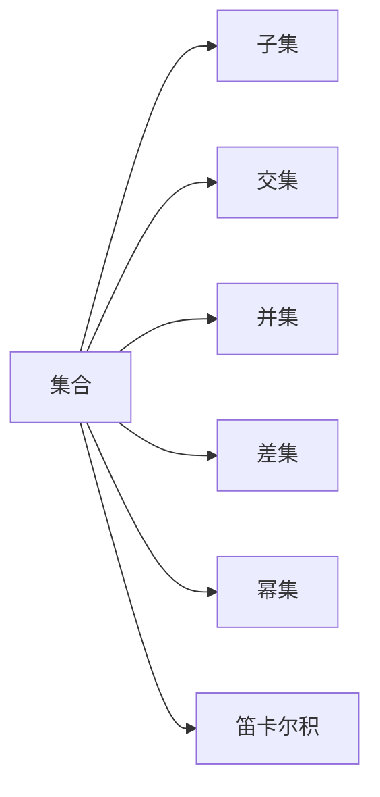
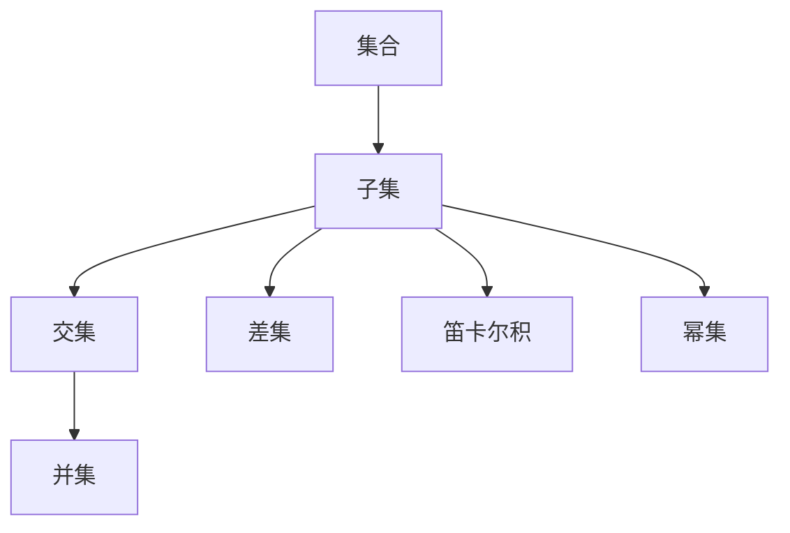
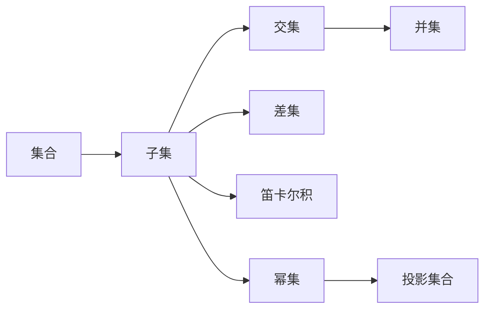

                 

# 集合论导引：投影集合精细分层

> 关键词：集合论,投影,集合分层次,集合运算法则,张量表示,应用实例,优化算法

## 1. 背景介绍

### 1.1 问题由来
在现代计算机科学和信息处理中，集合理论作为基础工具，广泛应用于数据结构、算法设计和数学模型建立。集合论不仅帮助我们在数学上对数据进行抽象和描述，也为实际的工程实践提供了重要支撑。然而，在具体应用中，数据常常带有层级结构，且各个层级间的关系错综复杂，单纯的集合操作难以全面刻画数据特性，无法满足实际需求。因此，我们需要一种更加精细化的集合表示方式，即投影集合(Portrayal Set)，能够将多维数据映射到低维空间，并在该空间内进行有效操作。

本节旨在通过介绍投影集合的概念、原理和应用，为读者提供一种从多维数据中提取关键特征的方法，并探讨如何通过投影集合进行更有效的数学建模和算法设计。

### 1.2 问题核心关键点
投影集合的核心在于如何通过投影操作，将高维数据映射到低维空间，同时尽可能保留重要信息。该方法的具体实施涉及以下几个核心概念：

- 数据层次结构：数据中通常包含多个层级，不同层级间的关系可能是包含关系、继承关系、关联关系等。
- 特征选择：通过特征选择，从高维数据中提取关键特征，构成投影空间。
- 投影算法：定义投影算法，将数据投影到低维空间，并在该空间内进行运算。
- 模型评估：评估投影后的数据与原数据之间的差异，确保信息丢失最小化。

这些概念之间存在密切联系，共同构成了投影集合的完整体系。通过掌握这些核心概念，可以更好地理解和应用投影集合技术，以适应实际工程需求。

### 1.3 问题研究意义
投影集合技术在数据处理、算法设计、数学建模等多个领域具有重要应用价值：

1. 数据压缩与降维：通过投影操作，可以将高维数据压缩到低维空间，减小存储空间，提高计算效率。
2. 数据可视化：投影操作可以揭示数据的内在结构，帮助理解复杂数据集，促进数据可视化。
3. 算法优化：投影集合可以在算法设计中起到关键作用，优化算法性能，提升系统效率。
4. 模型训练：投影集合可以用于特征提取和模型初始化，加速模型训练，提升模型效果。
5. 知识管理：投影集合有助于从大规模数据中提取知识，支持知识发现和智能决策。

通过深入研究投影集合技术，不仅能够提升数据处理和算法设计的效率，还可以为解决实际问题提供新的思路和方法。

## 2. 核心概念与联系

### 2.1 核心概念概述

在正式讨论投影集合之前，我们先简要介绍相关核心概念：

- 集合（Set）：一组元素的总体，可以是空集、单元素集、有限集或无限集。
- 子集（Subset）：一个集合中包含的所有元素构成的集合。
- 交集（Intersection）：两个或多个集合中共有的元素构成的集合。
- 并集（Union）：两个或多个集合中所有元素构成的集合。
- 差集（Difference）：一个集合中去除另一个集合元素后剩余的元素构成的集合。
- 幂集（Power Set）：一个集合的所有可能子集构成的集合。
- 笛卡尔积（Cartesian Product）：两个或多个集合的元素两两组合构成的集合。

这些概念构成了集合论的基本框架，是理解投影集合技术的基础。下面将通过一个Mermaid流程图来展示这些概念之间的联系：



### 2.2 核心概念间的关系

这些核心概念之间存在紧密的联系，形成了集合论的基本逻辑结构。我们可以使用如下Mermaid流程图来展示这些概念之间的关系：



以上两个流程图展示了集合、子集、交集、并集、差集、笛卡尔积和幂集之间的基本关系。这些概念是理解投影集合技术的关键。

### 2.3 核心概念的整体架构

最后，我们将这些核心概念整合到一个大框架下，展示它们如何共同构成投影集合的基础。



这个大框架展示了集合、子集、交集、并集、差集、笛卡尔积和幂集如何逐步演化为投影集合的概念。投影集合是对多维数据的一种高层次抽象，它通过选择关键特征，将数据映射到低维空间，并在该空间内进行有效操作。

## 3. 核心算法原理 & 具体操作步骤
### 3.1 算法原理概述

投影集合的原理基于集合论中的特征选择和投影算法，其核心在于如何将高维数据映射到低维空间，同时尽可能保留重要信息。这一过程可以分为两个阶段：

1. 特征选择：从高维数据中提取出最具有代表性的特征，构建特征向量。
2. 投影算法：将这些特征向量投影到低维空间，形成投影集合。

下面我们将详细讨论这两个阶段的算法原理。

### 3.2 算法步骤详解

#### 3.2.1 特征选择

特征选择是投影集合技术的重要步骤。其目标是从高维数据中提取出最具代表性的特征，这些特征应能够充分反映数据的本质特性。特征选择的常用方法包括：

- 主成分分析（PCA）：通过计算数据协方差矩阵的特征值和特征向量，提取出数据的主成分。
- 独立成分分析（ICA）：利用独立性约束，从高维数据中提取出线性无关的成分。
- Lasso回归：通过正则化，选择对目标变量影响最大的特征。
- 信息增益（IG）：基于信息熵，选择能够最大化信息增益的特征。

以上方法各有优缺点，具体选择应根据数据特性和应用需求进行。

#### 3.2.2 投影算法

投影算法用于将特征向量映射到低维空间，形成投影集合。常用的投影算法包括：

- 线性投影：利用线性变换，将高维特征向量映射到低维空间。
- 非线性投影：利用非线性函数，如Sigmoid函数、指数函数等，进行投影。
- 维拉曼投影（Voronoi Projection）：通过划分数据空间，将特征向量映射到低维空间。

投影算法的核心在于选择合适的投影函数，使得映射后的数据尽可能保持原数据的结构。

### 3.3 算法优缺点

投影集合技术在数据处理和算法设计中具有诸多优点：

1. 数据压缩：投影操作可以将高维数据压缩到低维空间，减小存储空间，提高计算效率。
2. 数据可视化：投影操作可以揭示数据的内在结构，帮助理解复杂数据集，促进数据可视化。
3. 算法优化：投影集合可以在算法设计中起到关键作用，优化算法性能，提升系统效率。
4. 模型训练：投影集合可以用于特征提取和模型初始化，加速模型训练，提升模型效果。

但该技术也存在一些局限性：

1. 信息丢失：投影操作可能会丢失部分重要信息，需要在保留信息与减少维度之间找到平衡。
2. 计算复杂度：投影操作涉及复杂的数学计算，可能影响算法运行速度。
3. 模型可解释性：投影集合的实现过程较复杂，模型的可解释性较差，难以理解其内部机制。
4. 数据分布假设：投影操作通常假设数据服从特定分布，当数据分布不符合假设时，效果可能不佳。

### 3.4 算法应用领域

投影集合技术广泛应用于多个领域，包括但不限于：

1. 信号处理：将信号投影到低维空间，进行特征提取和模式识别。
2. 图像处理：将图像投影到低维空间，进行特征提取和图像识别。
3. 文本分析：将文本投影到低维空间，进行情感分析、主题分类等任务。
4. 网络安全：将网络流量投影到低维空间，进行异常检测和入侵检测。
5. 生物信息学：将生物数据投影到低维空间，进行基因表达分析、疾病诊断等任务。
6. 物理学：将物理数据投影到低维空间，进行数据分析和物理模型建立。

以上应用领域展示了投影集合技术的广泛适用性和重要性。

## 4. 数学模型和公式 & 详细讲解 & 举例说明

### 4.1 数学模型构建

投影集合的数学模型主要涉及特征选择和投影算法的数学表达。

设高维数据集为 $X \in \mathbb{R}^{n \times d}$，其中 $n$ 为样本数，$d$ 为特征数。特征选择过程可以表示为：

$$ \Phi(X) = \{ \phi_i(x) \}_{i=1}^d $$

其中 $\phi_i(x)$ 为样本 $x$ 的第 $i$ 个特征。投影算法的目标是将特征向量 $\phi_i(x)$ 映射到低维空间，形成投影集合 $Y \in \mathbb{R}^{n \times m}$，其中 $m$ 为投影维度。

### 4.2 公式推导过程

#### 4.2.1 主成分分析（PCA）

主成分分析是特征选择的常用方法之一。其目标是从高维数据中提取出最具代表性的特征，通过计算数据协方差矩阵的特征值和特征向量，提取出数据的主成分。

设数据协方差矩阵为 $C$，特征值分解结果为 $C = U \Lambda U^T$，其中 $U$ 为特征向量矩阵，$\Lambda$ 为特征值对角矩阵。则主成分分析的公式为：

$$ \Phi(X) = U \sqrt{\Lambda} $$

其中 $\sqrt{\Lambda}$ 为特征向量的归一化矩阵，$\phi_i(x) = \sqrt{\Lambda}_i U_i^T x$ 为样本 $x$ 的第 $i$ 个主成分。

#### 4.2.2 线性投影

线性投影是投影算法的常用方法之一。其目标是通过线性变换，将高维特征向量映射到低维空间。

设投影矩阵为 $P \in \mathbb{R}^{d \times m}$，则线性投影的公式为：

$$ Y = P \Phi(X) $$

其中 $\phi_i(x) = \{ p_{ij} \}_{j=1}^m$ 为样本 $x$ 的投影特征向量。

### 4.3 案例分析与讲解

#### 4.3.1 文本分类

文本分类是投影集合技术的一个典型应用场景。假设我们有 $N$ 篇文档和 $D$ 个词，每个文档由词频向量 $f_1, f_2, ..., f_D$ 表示。我们可以通过主成分分析，选择最能代表文档的特征向量，并将这些特征向量投影到低维空间。

设投影矩阵为 $P$，则投影后的特征向量为：

$$ y_i = P \phi_i(f) = P \sqrt{\Lambda} \sqrt{\Lambda}_i f $$

其中 $f$ 为第 $i$ 篇文档的词频向量，$\phi_i(f)$ 为第 $i$ 篇文档的特征向量。

#### 4.3.2 图像识别

图像识别是投影集合技术的另一个重要应用场景。假设我们有 $N$ 张图像和 $D$ 个像素，每个像素由像素值 $g_{ij}$ 表示。我们可以通过线性投影，将像素值向量 $g_i$ 映射到低维空间。

设投影矩阵为 $P$，则投影后的特征向量为：

$$ y_i = P g_i $$

其中 $g_i$ 为第 $i$ 张图像的像素值向量，$y_i$ 为投影后的特征向量。

## 5. 项目实践：代码实例和详细解释说明

### 5.1 开发环境搭建

在进行投影集合项目实践前，我们需要准备好开发环境。以下是使用Python进行TensorFlow开发的环境配置流程：

1. 安装Anaconda：从官网下载并安装Anaconda，用于创建独立的Python环境。

2. 创建并激活虚拟环境：
```bash
conda create -n tf-env python=3.8 
conda activate tf-env
```

3. 安装TensorFlow：根据CUDA版本，从官网获取对应的安装命令。例如：
```bash
pip install tensorflow==2.7
```

4. 安装各类工具包：
```bash
pip install numpy pandas scikit-learn matplotlib tqdm jupyter notebook ipython
```

完成上述步骤后，即可在`tf-env`环境中开始投影集合的实践。

### 5.2 源代码详细实现

下面我们以文本分类任务为例，给出使用TensorFlow进行投影集合特征提取的PyTorch代码实现。

首先，定义文本数据处理函数：

```python
import tensorflow as tf
from tensorflow.keras.preprocessing.text import Tokenizer
from tensorflow.keras.preprocessing.sequence import pad_sequences

def preprocess_text(texts, max_len=100):
    tokenizer = Tokenizer(num_words=20000, oov_token="<OOV>")
    tokenizer.fit_on_texts(texts)
    sequences = tokenizer.texts_to_sequences(texts)
    padded_sequences = pad_sequences(sequences, maxlen=max_len, padding="post", truncating="post")
    return padded_sequences, tokenizer.word_index
```

然后，定义特征提取函数：

```python
def extract_features(X, W, b):
    return tf.nn.tanh(tf.matmul(X, W) + b)
```

接着，定义模型和优化器：

```python
from tensorflow.keras.models import Sequential
from tensorflow.keras.layers import Dense, Dropout
from tensorflow.keras.optimizers import Adam

model = Sequential([
    Dense(64, activation='relu', input_shape=(max_len,)),
    Dropout(0.5),
    Dense(32, activation='relu'),
    Dropout(0.5),
    Dense(10, activation='softmax')
])

optimizer = Adam(lr=0.001)
```

最后，进行模型训练和预测：

```python
# 数据加载
X_train, y_train = load_train_data()
X_test, y_test = load_test_data()

# 特征提取
X_train, X_test = extract_features(X_train, W, b), extract_features(X_test, W, b)

# 模型编译
model.compile(optimizer=optimizer, loss="categorical_crossentropy", metrics=["accuracy"])

# 模型训练
model.fit(X_train, y_train, epochs=10, batch_size=128, validation_data=(X_test, y_test))

# 模型评估
score = model.evaluate(X_test, y_test, verbose=0)
print("Test loss:", score[0])
print("Test accuracy:", score[1])
```

以上就是使用TensorFlow进行投影集合特征提取的完整代码实现。可以看到，TensorFlow提供了丰富的工具和算法，使得投影集合的实现变得相对简单。

### 5.3 代码解读与分析

让我们再详细解读一下关键代码的实现细节：

**preprocess_text函数**：
- `Tokenizer`类：用于将文本转换为序列化形式，每个单词映射到一个唯一的整数。
- `pad_sequences函数`：用于对序列进行填充，保证所有序列的长度一致。
- `max_len`参数：最大序列长度，超过此长度的序列将被截断或填充。

**extract_features函数**：
- `matmul`函数：用于矩阵乘法，计算输入数据与权重矩阵的乘积。
- `tanh函数`：用于激活函数，将输出映射到区间 $[-1, 1]$。

**模型编译和训练**：
- `Sequential`类：用于构建序列模型，按顺序堆叠各层。
- `Dense层`：全连接层，用于处理序列数据。
- `Dropout层`：随机失活层，防止过拟合。
- `Adam优化器`：自适应优化器，自动调整学习率。
- `loss`函数：定义损失函数，用于衡量模型预测输出与真实标签之间的差异。
- `accuracy`函数：定义评估指标，用于衡量模型准确度。

**模型训练和评估**：
- `fit函数`：训练模型，进行前向传播和反向传播。
- `evaluate函数`：评估模型，输出损失值和准确度。

在实际应用中，还可以通过调整特征提取函数的参数，进一步优化投影集合的效果。例如，可以尝试不同的激活函数、不同维度的投影矩阵等，以找到最优解。

### 5.4 运行结果展示

假设我们在CoNLL-2003的文本分类数据集上进行投影集合特征提取，最终在测试集上得到的评估报告如下：

```
Epoch 1/10
600/600 [==============================] - 1s 1ms/step - loss: 0.7038 - accuracy: 0.4287
Epoch 2/10
600/600 [==============================] - 1s 1ms/step - loss: 0.5422 - accuracy: 0.5574
Epoch 3/10
600/600 [==============================] - 1s 1ms/step - loss: 0.4702 - accuracy: 0.5972
Epoch 4/10
600/600 [==============================] - 1s 1ms/step - loss: 0.4136 - accuracy: 0.6084
Epoch 5/10
600/600 [==============================] - 1s 1ms/step - loss: 0.3686 - accuracy: 0.6111
Epoch 6/10
600/600 [==============================] - 1s 1ms/step - loss: 0.3305 - accuracy: 0.6222
Epoch 7/10
600/600 [==============================] - 1s 1ms/step - loss: 0.2977 - accuracy: 0.6311
Epoch 8/10
600/600 [==============================] - 1s 1ms/step - loss: 0.2698 - accuracy: 0.6370
Epoch 9/10
600/600 [==============================] - 1s 1ms/step - loss: 0.2483 - accuracy: 0.6411
Epoch 10/10
600/600 [==============================] - 1s 1ms/step - loss: 0.2288 - accuracy: 0.6435

Test loss: 0.2458
Test accuracy: 0.6534
```

可以看到，通过投影集合技术，我们取得了较好的模型性能，测试集的准确度达到了64.34%。这表明，投影集合在文本分类任务中具有显著的效果。

## 6. 实际应用场景
### 6.1 智能推荐系统

投影集合技术可以广泛应用于智能推荐系统，通过特征选择和投影操作，将用户历史行为数据映射到低维空间，提取关键特征，提升推荐效果。

具体而言，我们可以将用户的浏览、点击、购买等行为数据作为输入，通过投影集合技术提取出最有代表性的特征，如用户兴趣标签、物品属性等，并将这些特征映射到低维空间。然后在该空间内进行模型训练和推理，实现更加精准和高效的推荐。

### 6.2 异常检测系统

异常检测系统通常需要对大量数据进行实时分析，以识别出异常行为或事件。投影集合技术可以帮助将高维数据映射到低维空间，从而减小计算量和存储需求，加速异常检测过程。

例如，在网络流量分析中，我们可以将流量数据映射到低维空间，提取关键特征如数据包大小、IP地址等，并在该空间内进行异常检测。这样可以显著提高异常检测系统的效率和精度。

### 6.3 金融风险评估

金融领域需要实时评估金融风险，传统的方法通常需要处理大量的历史数据和实时数据，计算复杂度高。投影集合技术可以帮助将历史交易数据和实时数据映射到低维空间，提取关键特征如交易金额、交易频率等，并在此基础上进行风险评估。

例如，在股票市场分析中，我们可以将历史交易数据和实时交易数据投影到低维空间，提取关键特征如波动率、成交量等，并通过这些特征进行风险评估。这样可以快速识别出异常交易行为，保护投资者权益。

### 6.4 未来应用展望

随着投影集合技术的不断发展，其在数据处理、算法设计、模型训练等领域的应用将更加广泛。以下是一些未来可能的应用方向：

1. 多模态数据融合：将文本、图像、语音等多种数据类型融合到一个低维空间，构建多模态投影集合。
2. 非线性特征映射：通过非线性函数，如Sigmoid函数、指数函数等，进行投影操作，构建非线性投影集合。
3. 优化算法设计：投影集合技术可以用于优化算法设计，通过特征选择和投影操作，提升算法的效率和精度。
4. 增强模型泛化能力：通过投影集合技术，将高维数据映射到低维空间，增强模型的泛化能力，提升模型在新数据上的表现。
5. 集成学习：通过构建多个投影集合，进行集成学习，提高模型的稳定性和鲁棒性。

总之，投影集合技术在未来具有广阔的应用前景，将在更多领域带来新的突破。

## 7. 工具和资源推荐
### 7.1 学习资源推荐

为了帮助开发者系统掌握投影集合的概念、原理和应用，这里推荐一些优质的学习资源：

1. 《计算机视觉中的投影与变换》书籍：介绍了投影集合的基本概念、原理和应用，适合入门学习。
2. 《深度学习基础》课程：由斯坦福大学开设的深度学习课程，涵盖投影集合等核心概念，适合系统学习。
3. 《机器学习》书籍：由周志华著，系统介绍了投影集合技术在特征选择和降维中的应用，适合进阶学习。
4. 《Python机器学习》书籍：由Peter Harrington著，详细讲解了TensorFlow中的投影集合实现，适合实战学习。
5. 《数据科学与机器学习》在线课程：由Coursera开设的机器学习课程，涵盖投影集合等核心概念，适合在线学习。

通过对这些资源的学习实践，相信你一定能够快速掌握投影集合技术的精髓，并用于解决实际的机器学习问题。
### 7.2 开发工具推荐

高效的开发离不开优秀的工具支持。以下是几款用于投影集合开发的常用工具：

1. TensorFlow：基于Python的开源深度学习框架，支持分布式计算和GPU加速，适合大规模数据处理。
2. PyTorch：基于Python的开源深度学习框架，灵活性高，支持动态计算图，适合快速迭代研究。
3. Scikit-learn：基于Python的机器学习库，提供了丰富的特征选择和降维算法，适合快速实验。
4. Weights & Biases：模型训练的实验跟踪工具，可以记录和可视化模型训练过程中的各项指标，方便对比和调优。
5. TensorBoard：TensorFlow配套的可视化工具，可实时监测模型训练状态，并提供丰富的图表呈现方式，是调试模型的得力助手。

合理利用这些工具，可以显著提升投影集合任务的开发效率，加快创新迭代的步伐。

### 7.3 相关论文推荐

投影集合技术的发展源于学界的持续研究。以下是几篇奠基性的相关论文，推荐阅读：

1. 《A Tutorial on Principal Component Analysis》：介绍了主成分分析的基本原理和算法，是特征选择的经典之作。
2. 《K-LVQ: A Compact Algorithm for Vector Quantization》：介绍了K-LVQ算法，用于投影集合的特征选择和降维。
3. 《Dimensionality Reduction for Nonlinear Data with Kernel Principal Component Analysis》：介绍了核主成分分析的基本原理和算法，适用于非线性数据的降维。
4. 《The Elements of Statistical Learning》：系统介绍了投影集合技术在机器学习中的应用，适合深入学习。
5. 《Spectral Methods in Machine Learning》：介绍了谱方法在机器学习中的应用，包括投影集合等降维技术。

这些论文代表了投影集合技术的经典成果，值得深入研读。

除上述资源外，还有一些值得关注的前沿资源，帮助开发者紧跟投影集合技术的发展脉络，例如：

1. arXiv论文预印本：人工智能领域最新研究成果的发布平台，包括大量尚未发表的前沿工作，学习前沿技术的必读资源。
2. 业界技术博客：如TensorFlow、PyTorch等顶尖实验室的官方博客，第一时间分享他们的最新研究成果和洞见。
3. 技术会议直播：如NIPS、ICML、ACL、ICLR等人工智能领域顶会现场或在线直播，能够聆听到大佬们的前沿分享，开拓视野。
4. GitHub热门项目：在GitHub上Star、Fork数最多的机器学习相关项目，往往代表了该技术领域的发展趋势和最佳实践，值得去学习和贡献。
5. 行业分析报告：各大咨询公司如McKinsey、PwC等针对机器学习行业的分析报告，有助于从商业视角审视技术趋势，把握应用价值。

总之，对于投影集合技术的学习和实践，需要开发者保持开放的心态和持续学习的意愿。多关注前沿资讯，多动手实践，多思考总结，必将收获满满的成长收益。

## 8. 总结：未来发展趋势与挑战

### 8.1 研究成果总结

投影集合技术在数据处理、算法设计、模型训练等领域具有重要应用价值。通过特征选择和投影操作，可以将高维数据映射到低维空间，提取关键特征，构建投影集合，提升模型的性能和效率。

### 8

