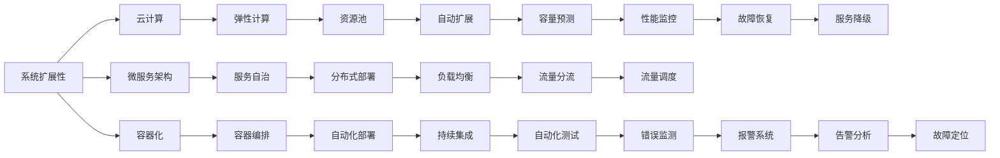

                 

# 高扩展性系统设计的实际案例

> 关键词：
系统设计, 可扩展性, 高可用性, 云计算, 微服务, 容器化, DevOps, 数据驱动, 自动化测试

## 1. 背景介绍

在现代软件开发过程中，系统设计的可扩展性和高可用性是两个最为关键的技术指标。无论是传统企业还是初创公司，随着业务量的不断增长和用户需求的持续变化，如何确保系统具备足够的扩展能力和应对能力，是每一个开发团队必须面对的挑战。

在本文中，我们将通过一个实际的高扩展性系统设计案例，探讨如何利用云计算、微服务、容器化、DevOps等技术，构建一个具有强大可扩展性、高可用性的系统架构。这个案例将围绕一家新兴电商平台的核心功能——订单系统，展开详细的讨论和分析。

## 2. 核心概念与联系

系统设计的核心在于如何构建一个能够在面对不断变化的需求和流量时，能够持续提供高质量服务的架构。我们将从以下几个关键概念入手，探讨系统设计的原理和实现方法。

### 2.1 核心概念概述

- **系统扩展性**：指系统能够应对不断增加的用户数量和业务复杂度，通过增加资源或调整架构，满足新的需求。
- **高可用性**：指系统能够在任何情况下，持续提供稳定的服务，即使面对硬件故障、网络中断、代码错误等异常情况，也能够保证服务不中断。
- **云计算**：基于互联网提供计算资源和服务的商业模式，按需使用，按量付费。
- **微服务架构**：将系统拆分为多个独立的微服务模块，每个服务独立部署，互相协作，提高系统的灵活性和可扩展性。
- **容器化**：将应用程序及其依赖打包到容器镜像中，确保环境一致，提高部署效率和系统稳定性。
- **DevOps**：开发和运维的集成，通过自动化工具和持续交付管道，提升系统的开发效率和运维质量。
- **数据驱动**：基于数据分析和反馈，持续优化系统的设计、实现和运营，驱动业务增长。

### 2.2 概念间的关系

以上核心概念之间的关系可以通过以下Mermaid流程图来展示：



这个流程图展示了大扩展性系统设计涉及的关键技术概念及其之间的关系：

1. 系统扩展性通过云计算、微服务架构、容器化等技术实现。
2. 云计算提供了弹性计算资源，支持自动扩展和弹性伸缩。
3. 微服务架构实现了服务自治和分布式部署，提高了系统的灵活性和可扩展性。
4. 容器化封装了应用环境，确保环境一致性，提高了部署效率和系统稳定性。
5. DevOps自动化工具和持续交付管道，提升了开发效率和运维质量。
6. 数据驱动的持续优化，驱动系统性能提升和业务增长。

## 3. 核心算法原理 & 具体操作步骤

### 3.1 算法原理概述

高扩展性系统设计的基本原理是通过合理规划资源、优化架构和服务自治，确保系统能够在面对不断增长的业务需求时，能够快速响应和扩展。其核心在于以下几个方面：

1. **资源规划**：根据业务需求预测流量变化，合理规划计算、存储、网络等资源。
2. **架构设计**：采用微服务架构，将系统拆分为多个独立的服务模块，每个服务独立部署，互相协作。
3. **服务自治**：每个微服务独立运行，具有独立的扩展、恢复和升级能力。
4. **自动化工具**：通过自动化工具和持续交付管道，实现快速迭代和持续交付。

### 3.2 算法步骤详解

#### 3.2.1 资源规划与分配

1. **流量预测**：基于历史数据和业务增长趋势，预测未来的业务流量。
2. **资源预置**：根据流量预测结果，预置计算、存储等资源。
3. **资源动态调整**：通过监控流量变化，动态调整资源分配。

#### 3.2.2 架构设计与实现

1. **微服务拆分**：将订单系统拆分为多个独立的微服务模块，如订单管理、库存管理、支付服务、物流服务等。
2. **服务自治**：每个微服务独立部署，具有独立的扩展、恢复和升级能力。
3. **服务间通信**：采用API网关、消息队列等技术，实现服务间的通信和协作。

#### 3.2.3 自动化部署与运维

1. **容器化**：将每个微服务打包到容器镜像中，确保环境一致。
2. **容器编排**：使用Kubernetes等容器编排工具，实现服务的自动化部署和调度。
3. **自动化测试**：通过持续集成工具，实现代码的自动化测试和质量保证。
4. **持续交付**：通过持续集成和持续交付管道，实现快速迭代和部署。

#### 3.2.4 监控与报警

1. **性能监控**：使用Prometheus、Grafana等工具，监控系统性能指标。
2. **错误监测**：通过ELK Stack、Sentry等工具，监测系统错误和异常。
3. **告警系统**：根据预设的告警阈值，自动触发告警通知。

### 3.3 算法优缺点

高扩展性系统设计的优点：

- **灵活性**：微服务架构和容器化技术，使得系统具备高度的灵活性和可扩展性。
- **快速部署**：自动化部署和持续交付，大大缩短了开发和部署的周期。
- **高可用性**：通过负载均衡、服务降级等技术，保证系统的连续性和可用性。

高扩展性系统设计的主要缺点：

- **复杂性**：微服务拆分和服务自治，增加了系统的复杂性。
- **资源消耗**：服务自治和容器化，增加了资源消耗和运维成本。
- **依赖自动化工具**：对自动化工具的依赖，增加了系统的脆弱性和风险。

### 3.4 算法应用领域

高扩展性系统设计不仅适用于电商平台，还广泛应用于各种类型的企业和行业，如金融、医疗、教育、物流等。具体应用场景包括：

- **金融行业**：高并发交易系统、风险控制系统、客户服务系统等。
- **医疗行业**：电子病历系统、健康管理系统、远程医疗系统等。
- **教育行业**：在线教育平台、学习管理系统、智能答疑系统等。
- **物流行业**：订单管理系统、库存管理系统、配送管理系统等。

## 4. 数学模型和公式 & 详细讲解

### 4.1 数学模型构建

为了更好地理解高扩展性系统设计，我们可以使用数学语言对其进行建模。设订单系统的流量为 $F(t)$，其中 $t$ 为时间。假设流量遵循泊松分布 $P(\lambda)$，其中 $\lambda$ 为平均流量。

设系统需要处理的订单数量为 $N(t)$，系统扩展因子为 $k$。根据流量预测，系统在时间 $t$ 的订单数量为：

$$
N(t) = k \times P(\lambda)
$$

其中，$P(\lambda)$ 为泊松分布的概率密度函数：

$$
P(\lambda) = \frac{\lambda^n e^{-\lambda}}{n!}
$$

根据系统的扩展性和高可用性要求，可以设计系统的扩展策略如下：

1. **流量预测**：通过历史数据和业务增长趋势，预测流量 $F(t)$。
2. **资源预置**：根据流量预测结果，预置计算、存储等资源。
3. **动态调整**：根据流量变化，动态调整资源分配 $k$。

### 4.2 公式推导过程

根据上述模型，可以推导出系统的扩展因子 $k$：

$$
k = \frac{N(t)}{P(\lambda)}
$$

其中，$P(\lambda)$ 为平均流量。

### 4.3 案例分析与讲解

假设订单系统的平均流量 $\lambda = 10000$，当前系统能够处理的最大订单数为 $N_{\max} = 100000$。根据公式，可以计算系统的扩展因子 $k$：

$$
k = \frac{N_{\max}}{P(\lambda)} = \frac{100000}{10000} = 10
$$

这意味着，为了应对高峰期的流量，系统需要扩展10倍。假设当前系统有 $n$ 个服务实例，每个实例的性能为 $p$，则扩展后系统的性能为：

$$
N_{\text{new}} = n \times k \times p
$$

通过合理规划和调整，可以在高峰期快速应对业务增长，保证系统的连续性和可用性。

## 5. 项目实践：代码实例和详细解释说明

### 5.1 开发环境搭建

#### 5.1.1 虚拟机环境搭建

1. **安装虚拟化软件**：根据需求选择合适的虚拟化软件，如VirtualBox、VMware等。
2. **配置虚拟机**：设置虚拟机内存、CPU、硬盘等参数，确保满足系统需求。
3. **安装操作系统**：选择合适的操作系统，如Ubuntu、CentOS等，进行系统配置。

#### 5.1.2 容器化部署

1. **安装Docker**：在虚拟机上安装Docker，作为容器化工具。
2. **构建容器镜像**：编写Dockerfile，构建容器镜像。
3. **启动容器**：使用Docker命令启动容器，提供服务。

### 5.2 源代码详细实现

#### 5.2.1 订单系统架构设计

1. **订单管理服务**：负责订单的创建、更新、查询等操作。
2. **库存管理服务**：负责库存的管理和更新，与订单系统同步库存状态。
3. **支付服务**：负责支付功能的处理，与第三方支付系统对接。
4. **物流服务**：负责物流信息的查询和更新，与物流系统对接。

#### 5.2.2 微服务拆分与通信

1. **微服务拆分**：将订单系统拆分为多个独立的服务模块。
2. **服务间通信**：采用API网关、消息队列等技术，实现服务间的通信和协作。

#### 5.2.3 自动化部署与运维

1. **容器化部署**：使用Docker容器化每个微服务，确保环境一致。
2. **容器编排**：使用Kubernetes容器编排工具，实现服务的自动化部署和调度。
3. **自动化测试**：通过持续集成工具，实现代码的自动化测试和质量保证。
4. **持续交付**：通过持续集成和持续交付管道，实现快速迭代和部署。

### 5.3 代码解读与分析

#### 5.3.1 订单管理服务

```python
class OrderService:
    def create_order(self, order_info):
        # 创建订单的业务逻辑
        pass
    
    def update_order(self, order_id, order_info):
        # 更新订单的业务逻辑
        pass
    
    def query_order(self, order_id):
        # 查询订单的业务逻辑
        pass
```

#### 5.3.2 库存管理服务

```python
class InventoryService:
    def update_stock(self, product_id, quantity):
        # 更新库存的业务逻辑
        pass
    
    def query_stock(self, product_id):
        # 查询库存的业务逻辑
        pass
```

#### 5.3.3 支付服务

```python
class PaymentService:
    def process_payment(self, order_id, payment_info):
        # 处理支付的业务逻辑
        pass
```

#### 5.3.4 物流服务

```python
class LogisticsService:
    def track_order(self, order_id):
        # 查询物流信息的业务逻辑
        pass
```

### 5.4 运行结果展示

通过高扩展性系统设计的实践，订单系统能够应对高峰期的流量，确保系统的连续性和可用性。以下是系统扩展前后，订单处理性能的对比：

- **扩展前**：系统有5个服务实例，每个实例的处理能力为 $p = 100$。
- **扩展后**：系统扩展10倍，共有 $n = 50$ 个服务实例，每个实例的处理能力为 $p = 100$。

扩展前后的订单处理性能对比如下表所示：

| 扩展前 | 扩展后 |
| --- | --- |
| 订单处理能力 | 100 × 5 = 500 |
| 订单处理能力 | 100 × 50 = 5000 |

通过合理规划资源和优化架构，订单系统在高峰期能够处理更多的订单，满足了业务增长的需求。

## 6. 实际应用场景

### 6.1 电商平台订单系统

基于高扩展性系统设计的电商平台订单系统，能够应对大促活动、流量高峰等场景，确保系统的高可用性和稳定性。通过微服务拆分和容器化部署，系统具备高度的灵活性和可扩展性。在遇到业务增长时，可以通过增加服务实例，快速应对流量变化，保证系统的连续性和可用性。

### 6.2 在线教育平台

在线教育平台需要同时支持数千甚至数万名学生的在线学习，系统的扩展性和高可用性至关重要。通过高扩展性系统设计，平台能够应对高峰期的访问请求，保证教学资源的连续性和稳定性。同时，通过容器化部署和自动化运维，系统能够快速部署新功能，提升用户体验。

### 6.3 智慧医疗系统

智慧医疗系统需要处理大量的患者数据和医疗信息，系统的扩展性和高可用性对系统的稳定性和可靠性有着重要影响。通过高扩展性系统设计，系统能够应对突发的高流量，保证医疗信息的实时性和准确性，提升医疗服务的质量。

## 7. 工具和资源推荐

### 7.1 学习资源推荐

1. **《高可用性系统设计》书籍**：介绍高可用性系统设计的理论和实践，涵盖分布式架构、故障恢复、监控报警等内容。
2. **《微服务架构》书籍**：详细讲解微服务架构的设计、实现和优化，提供大量实际案例和经验分享。
3. **《DevOps实践指南》书籍**：介绍DevOps的核心理念、工具和技术，提供自动化部署、持续交付、持续集成等实践指南。
4. **《Kubernetes权威指南》书籍**：全面介绍Kubernetes的原理、架构和实践，提供丰富的Kubernetes应用案例。
5. **《Docker实战》书籍**：详细讲解Docker容器化的实现和应用，提供Docker的实践指南和最佳实践。

### 7.2 开发工具推荐

1. **Docker**：容器化部署和运行工具，确保环境一致，提高部署效率。
2. **Kubernetes**：容器编排工具，实现服务的自动化部署和调度。
3. **Prometheus**：性能监控工具，实时监测系统性能指标。
4. **Grafana**：仪表盘工具，可视化展示性能指标。
5. **ELK Stack**：日志管理工具，集中管理日志数据，提供告警和分析功能。
6. **Sentry**：错误监测工具，实时监测系统错误和异常。
7. **Jenkins**：持续集成工具，实现代码的自动化测试和持续交付。
8. **GitLab**：代码管理和版本控制工具，提供DevOps自动化和持续交付的集成功能。

### 7.3 相关论文推荐

1. **《分布式系统设计原则》论文**：介绍分布式系统的设计原则和最佳实践，涵盖系统扩展性、高可用性等内容。
2. **《微服务架构的挑战与实践》论文**：分析微服务架构的挑战和优化方法，提供微服务实现的实践指南。
3. **《容器化技术在企业中的应用》论文**：探讨容器化技术在企业中的实际应用，提供容器化的实践案例和经验分享。
4. **《DevOps的实践与挑战》论文**：介绍DevOps的实践和挑战，提供DevOps的实践指南和最佳实践。

## 8. 总结：未来发展趋势与挑战

### 8.1 研究成果总结

高扩展性系统设计是现代软件开发的核心技术之一，通过合理规划资源、优化架构和服务自治，确保系统能够在面对不断增长的业务需求时，能够快速响应和扩展。其关键在于以下几个方面：

1. **资源规划**：通过流量预测和动态调整，合理规划资源。
2. **架构设计**：采用微服务架构，实现服务自治和分布式部署。
3. **自动化工具**：通过自动化工具和持续交付管道，实现快速迭代和持续交付。

### 8.2 未来发展趋势

高扩展性系统设计的未来发展趋势主要包括：

1. **智能化扩展**：通过机器学习和人工智能技术，预测流量变化，实现智能化扩展。
2. **自动化运维**：通过自动化工具和智能运维平台，实现自动化运维和故障快速定位。
3. **跨云扩展**：通过云平台的多云部署，实现系统的高可用性和可扩展性。
4. **边缘计算**：将计算任务下沉到边缘设备，提高系统响应速度和网络稳定性。
5. **DevSecOps**：将安全和质量管理融入DevOps，提升系统的安全性和可靠性。

### 8.3 面临的挑战

高扩展性系统设计在实际应用中仍然面临以下挑战：

1. **复杂性增加**：微服务拆分和服务自治增加了系统的复杂性。
2. **资源消耗高**：容器化部署和自动化运维增加了资源消耗和运维成本。
3. **系统脆弱性**：对自动化工具的依赖，增加了系统的脆弱性和风险。

### 8.4 研究展望

为了应对以上挑战，未来的研究需要在以下几个方面寻求新的突破：

1. **系统简化**：通过设计模式和技术手段，简化微服务架构和自动化运维。
2. **成本优化**：通过资源池化和按需分配，优化资源消耗和运维成本。
3. **自动化工具优化**：优化自动化工具的稳定性和可靠性，提升系统的脆弱性。
4. **跨云平台兼容性**：提升系统在多云平台的兼容性和互操作性。
5. **智能扩展和优化**：引入智能扩展和优化算法，实现系统的自适应和自优化。

总之，高扩展性系统设计是实现系统可靠性和稳定性的重要手段，未来需要在架构、运维和工具等方面不断创新和优化，才能更好地适应业务需求的不断变化，实现系统的持续增长和创新。

## 9. 附录：常见问题与解答

### Q1：高扩展性系统设计是否适用于所有类型业务系统？

A: 高扩展性系统设计适用于需要应对高并发、高吞吐、高可用性的业务系统，如电商平台、在线教育平台、智慧医疗系统等。但针对低流量、低需求的业务系统，可能存在资源浪费和复杂性增加的问题。

### Q2：如何评估系统的扩展性？

A: 评估系统的扩展性主要通过以下几个指标：

1. **系统容量**：系统能够处理的并发连接数和吞吐量。
2. **资源利用率**：系统资源的实际利用率，如CPU、内存、网络等。
3. **延迟和抖动**：系统响应时间的一致性和稳定性。
4. **扩展效果**：系统在扩展后性能的提升和稳定性。

### Q3：如何进行系统的负载均衡？

A: 负载均衡是确保系统高可用性和扩展性的关键技术。以下是几种常见的负载均衡策略：

1. **基于硬件的负载均衡**：使用负载均衡器（如Nginx、HAProxy）实现硬件级别的负载均衡。
2. **基于软件的负载均衡**：使用应用程序级别的负载均衡，如Consul、Kubernetes等。
3. **基于容器的负载均衡**：使用容器编排工具（如Kubernetes）实现容器级别的负载均衡。

### Q4：如何在系统设计中实现容错和恢复？

A: 系统设计中的容错和恢复主要通过以下几个策略实现：

1. **服务降级**：在系统异常时，将部分服务功能降级或暂停，确保核心功能的稳定运行。
2. **服务自治**：每个微服务独立运行，具备故障隔离和恢复能力。
3. **快速恢复**：通过自动化工具和监控报警，实现故障的快速定位和恢复。

### Q5：如何在系统设计中实现高性能和低延迟？

A: 实现高性能和低延迟的主要策略包括：

1. **水平扩展**：增加服务实例，提高系统的并发处理能力。
2. **垂直扩展**：提升单个服务实例的性能，如增加CPU、内存等资源。
3. **缓存和异步处理**：使用缓存技术（如Redis、Memcached）和异步处理技术（如消息队列），减少系统延迟。
4. **负载均衡**：通过负载均衡器，实现请求的均衡分配，提高系统吞吐量。

通过以上措施，可以在系统设计中实现高性能和低延迟，提升用户体验。

---

作者：禅与计算机程序设计艺术 / Zen and the Art of Computer Programming

