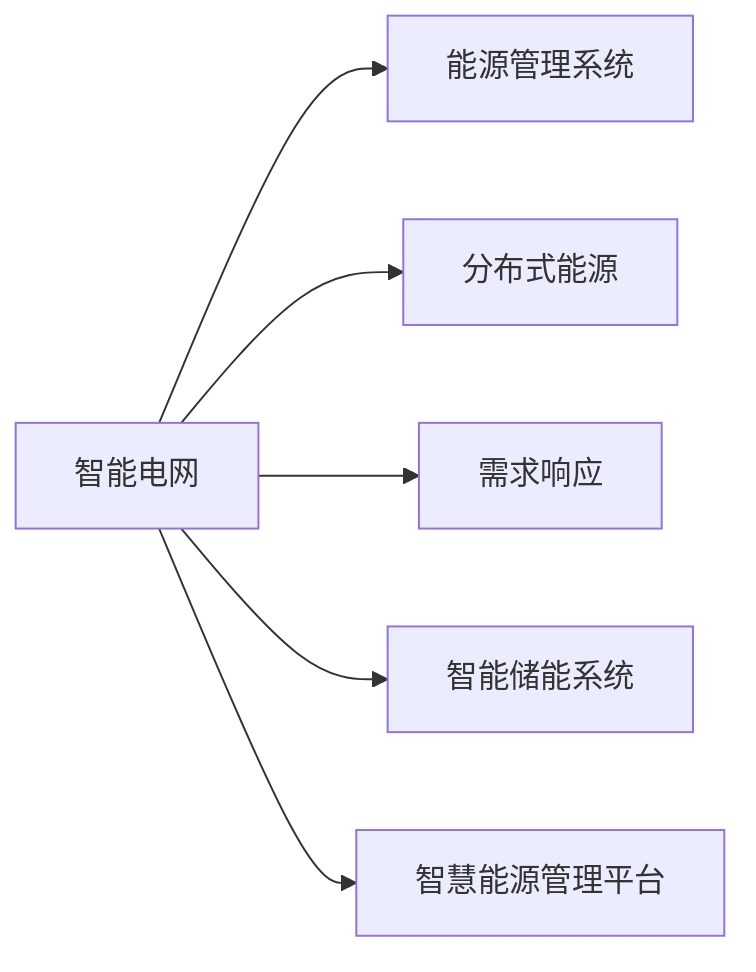
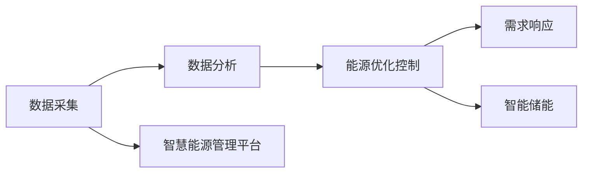

                 

# AI 2.0 时代的智能能源

在AI 2.0时代，人工智能技术已经从早期的语音识别、图像处理、自然语言处理等领域的简单应用，深入到了各个行业的核心业务流程中，为各行业带来了颠覆性的变革。能源行业也不例外，智能能源成为未来发展的重要方向。智能能源融合了信息通信技术、自动化技术、人工智能技术等前沿科技，通过实现能源全流程的智能感知、智能控制、智能优化和智能预测，提升能源系统的效率、安全性和可靠性，为绿色能源的可持续发展提供有力保障。本文将详细探讨AI 2.0时代智能能源的核心概念、技术实现、实际应用以及未来发展趋势。

## 1. 背景介绍

### 1.1 问题由来

随着经济全球化和工业化进程的加快，能源需求不断攀升，然而传统能源的供应方式、使用方式和管理方式已难以满足现代社会的能源需求。一方面，传统能源的开发、利用和传输过程中存在资源浪费、环境污染等问题；另一方面，能源供需不均衡、需求侧响应能力不足等问题也成为制约能源发展的瓶颈。因此，各国政府和企业都在积极探索智能能源解决方案，利用先进的技术手段实现能源供需两侧的高效协同、能源使用的智能化、能源利用效率的提升以及绿色能源的推广应用。

### 1.2 问题核心关键点

智能能源的核心在于实现能源全流程的智能化管理和优化，其关键点包括：

1. **数据采集与分析**：通过传感器、智能终端等设备采集能源的各类数据，并进行智能分析和预测。
2. **能源优化控制**：基于数据分析结果，进行能源调度和优化控制，实现能源的精准供需匹配和优化调度。
3. **需求侧响应**：通过需求响应技术，激励用户在能源需求高峰期减少能源使用，从而平衡供需。
4. **智慧运营管理**：利用物联网、大数据、人工智能等技术，实现能源的智慧化运营和管理。
5. **绿色能源推广**：通过智能化的方式，推动分布式能源、可再生能源等绿色能源的普及和应用。

## 2. 核心概念与联系

### 2.1 核心概念概述

智能能源是一个涵盖能源生产、传输、存储、使用及终端等多个环节的复杂系统，其中人工智能技术起到了关键作用。以下是智能能源相关的核心概念及其联系：

- **智能电网**：基于互联网、物联网、大数据、人工智能等技术，实现能源的智能传输和分配，提升电网的可靠性和效率。
- **能源管理系统**：通过智能算法和大数据分析，实现能源的智能调度、优化控制和管理。
- **分布式能源**：如太阳能、风能等可再生能源的分布式发电系统，通过智能控制和优化，实现能源的高效利用。
- **需求响应**：通过激励机制和智能算法，促使用户在能源需求高峰期减少能源使用，实现能源的智能调度。
- **智能储能系统**：利用智能算法和大数据，实现储能系统的智能管理，提高能源的储存和释放效率。
- **智慧能源管理平台**：整合上述各项技术，实现能源的智慧化管理和运营。

这些概念相互关联，共同构成了智能能源的完整体系，如图1所示。



### 2.2 核心概念原理和架构的 Mermaid 流程图



## 3. 核心算法原理 & 具体操作步骤

### 3.1 算法原理概述

智能能源的核心算法原理主要基于数据分析、优化控制和需求响应等技术。以下是智能能源的核心算法：

1. **数据分析**：利用传感器、智能终端等设备采集能源数据，并进行预处理、清洗和特征提取，然后通过大数据和人工智能技术进行智能分析和预测。
2. **能源优化控制**：基于数据分析结果，采用优化控制算法，实现能源的精准供需匹配和调度优化。
3. **需求响应**：通过激励机制和智能算法，促使用户在能源需求高峰期减少能源使用，实现能源的智能调度。
4. **智能储能控制**：利用智能算法和大数据，实现储能系统的智能管理，提高能源的储存和释放效率。

### 3.2 算法步骤详解

智能能源的算法步骤主要包括以下几个方面：

1. **数据采集**：通过传感器、智能终端等设备，实时采集能源的各类数据，包括能源生产、传输、存储、使用等方面的数据。
2. **数据清洗与特征提取**：对采集到的数据进行清洗、预处理和特征提取，去除噪声和异常值，提取有用的特征。
3. **数据分析与预测**：利用大数据和人工智能技术，对清洗后的数据进行智能分析和预测，包括能源需求预测、能源价格预测、能源负荷预测等。
4. **能源优化控制**：基于数据分析结果，采用优化控制算法，实现能源的精准供需匹配和调度优化，包括电网负荷优化、电力市场交易等。
5. **需求响应**：通过激励机制和智能算法，促使用户在能源需求高峰期减少能源使用，实现能源的智能调度，包括需求响应、负荷管理等。
6. **智能储能控制**：利用智能算法和大数据，实现储能系统的智能管理，提高能源的储存和释放效率，包括储能系统的充放电控制、储能系统的运行优化等。

### 3.3 算法优缺点

智能能源算法的主要优点包括：

1. **效率提升**：通过智能算法和大数据技术，实现能源的精准供需匹配和优化调度，提升能源系统的效率。
2. **可靠性增强**：通过实时监测和智能控制，提高能源系统的可靠性和安全性。
3. **成本降低**：通过智能优化和需求响应，降低能源的生产和传输成本，提高能源的利用效率。

智能能源算法的主要缺点包括：

1. **技术复杂**：智能能源系统涉及多种技术，如大数据、物联网、人工智能等，技术复杂度较高。
2. **数据安全**：智能能源系统需要处理大量敏感数据，数据安全问题亟待解决。
3. **初始投入高**：智能能源系统的建设需要高额的初始投资，对技术门槛要求较高。
4. **系统集成难度大**：智能能源系统的不同环节需要进行系统集成，系统集成难度较大。

### 3.4 算法应用领域

智能能源的算法在多个领域得到应用，包括：

1. **智能电网**：实现电网的智能化管理和优化控制，提升电网的可靠性和效率。
2. **能源管理系统**：通过智能算法和大数据分析，实现能源的智能调度、优化控制和管理。
3. **分布式能源**：利用智能算法和大数据，实现分布式能源的智能管理和优化。
4. **需求响应**：通过激励机制和智能算法，促使用户在能源需求高峰期减少能源使用，实现能源的智能调度。
5. **智能储能系统**：利用智能算法和大数据，实现储能系统的智能管理，提高能源的储存和释放效率。

## 4. 数学模型和公式 & 详细讲解 & 举例说明

### 4.1 数学模型构建

智能能源的数学模型主要包括以下几个部分：

1. **能源需求预测模型**：利用时间序列分析和大数据分析技术，建立能源需求的预测模型，包括：
   $$
   \hat{D}_t = f(D_{t-1}, D_{t-2}, ..., D_{t-k}; \theta)
   $$
   其中，$D_t$表示能源需求量，$\theta$表示模型参数，$k$表示历史数据长度。
2. **能源优化控制模型**：利用线性规划、非线性规划等优化控制算法，建立能源优化控制模型，包括：
   $$
   \min \sum_{t=1}^{T} \left(c_{t} + \lambda_{t} \right)
   $$
   其中，$c_t$表示控制变量，$\lambda_t$表示控制变量约束。
3. **需求响应模型**：利用激励机制和智能算法，建立需求响应模型，包括：
   $$
   R_t = g(P_t, \epsilon_t; \theta)
   $$
   其中，$R_t$表示需求响应量，$P_t$表示电价，$\epsilon_t$表示激励机制参数，$\theta$表示模型参数。
4. **智能储能控制模型**：利用智能算法和大数据，建立智能储能控制模型，包括：
   $$
   \min \sum_{t=1}^{T} \left(c_{t} + \lambda_{t} \right)
   $$
   其中，$c_t$表示控制变量，$\lambda_t$表示控制变量约束。

### 4.2 公式推导过程

以能源需求预测模型为例，推导其数学公式：

1. **时间序列分析**：利用时间序列分析技术，对历史能源需求数据进行分析和建模，包括：
   $$
   D_t = \sum_{i=1}^{k} \alpha_i D_{t-i} + \epsilon_t
   $$
   其中，$\alpha_i$表示历史数据系数，$\epsilon_t$表示随机误差。
2. **大数据分析**：利用大数据分析技术，对历史能源需求数据进行特征提取和分析，包括：
   $$
   D_t = \sum_{i=1}^{k} \alpha_i D_{t-i} + \epsilon_t
   $$
   其中，$\alpha_i$表示历史数据系数，$\epsilon_t$表示随机误差。

### 4.3 案例分析与讲解

以智能电网为例，分析其数据分析和优化控制算法：

1. **数据采集与处理**：通过智能电表、传感器等设备，实时采集电网的各类数据，包括电压、电流、功率等。
2. **数据分析与预测**：利用大数据和人工智能技术，对采集到的数据进行分析和预测，包括电网负荷预测、电力市场预测等。
3. **优化控制算法**：基于数据分析结果，采用优化控制算法，实现电网的精准供需匹配和调度优化，包括电网负荷优化、电力市场交易等。

## 5. 项目实践：代码实例和详细解释说明

### 5.1 开发环境搭建

智能能源的开发环境搭建主要包括以下几个方面：

1. **硬件环境**：选择高性能的计算设备和存储设备，包括高性能服务器、分布式计算集群等。
2. **软件环境**：选择主流的操作系统、编程语言和开发工具，包括Linux、Python、Jupyter Notebook等。
3. **数据环境**：选择合适的大数据存储和处理平台，包括Hadoop、Spark等。
4. **开发框架**：选择适合的开发框架和工具，包括TensorFlow、PyTorch、OpenCV等。

### 5.2 源代码详细实现

以智能电网为例，其源代码实现主要包括以下几个方面：

1. **数据采集模块**：利用智能电表、传感器等设备，实时采集电网的各类数据。
2. **数据清洗与预处理模块**：对采集到的数据进行清洗、预处理和特征提取，去除噪声和异常值，提取有用的特征。
3. **数据分析与预测模块**：利用大数据和人工智能技术，对清洗后的数据进行分析和预测，包括电网负荷预测、电力市场预测等。
4. **优化控制模块**：基于数据分析结果，采用优化控制算法，实现电网的精准供需匹配和调度优化，包括电网负荷优化、电力市场交易等。
5. **需求响应模块**：通过激励机制和智能算法，促使用户在能源需求高峰期减少能源使用，实现能源的智能调度。

### 5.3 代码解读与分析

以智能电网的需求响应模块为例，其代码实现主要包括以下几个方面：

1. **数据采集与处理**：通过智能电表、传感器等设备，实时采集电网的各类数据。
2. **需求响应模型**：利用激励机制和智能算法，建立需求响应模型，包括：
   ```python
   def response_model(price, incentive, parameters):
       response = parameters[0] * price + parameters[1] * incentive
       return response
   ```
   其中，`price`表示电价，`incentive`表示激励机制参数，`parameters`表示模型参数。

### 5.4 运行结果展示

以智能电网的需求响应模块为例，其运行结果主要包括以下几个方面：

1. **需求响应量计算**：利用需求响应模型，计算在不同电价和激励机制下的需求响应量。
2. **需求响应效果评估**：评估需求响应模型的效果，包括需求响应量的准确度和实时性。
3. **需求响应策略优化**：通过优化算法和实验验证，优化需求响应策略，提高需求响应的效果。

## 6. 实际应用场景

### 6.1 智能电网

智能电网是智能能源的核心应用场景之一，主要实现电网的智能化管理和优化控制。智能电网通过智能电表、传感器等设备，实时采集电网的各类数据，并利用大数据和人工智能技术，对数据进行分析和预测，从而实现电网的精准供需匹配和优化调度。

### 6.2 能源管理系统

能源管理系统主要实现能源的智能调度、优化控制和管理。通过利用大数据和人工智能技术，对能源数据进行分析和预测，实现能源的精准供需匹配和优化调度，提高能源的利用效率和可靠性。

### 6.3 分布式能源

分布式能源主要实现分布式能源的智能管理和优化控制。利用智能算法和大数据，实现分布式能源的智能管理和优化，提高分布式能源的利用效率和可靠性。

### 6.4 智能储能系统

智能储能系统主要实现储能系统的智能管理和优化控制。利用智能算法和大数据，实现储能系统的智能管理和优化，提高储能系统的储存和释放效率，降低储能系统的运行成本。

## 7. 工具和资源推荐

### 7.1 学习资源推荐

智能能源的学习资源推荐主要包括以下几个方面：

1. **在线课程**：如Coursera、edX等平台的能源管理、智能电网等课程。
2. **书籍**：如《智能电网技术及应用》、《智能能源系统》等书籍。
3. **论文**：如IEEE、IEEE Power & Energy Society等期刊上发表的智能能源相关论文。

### 7.2 开发工具推荐

智能能源的开发工具推荐主要包括以下几个方面：

1. **编程语言**：Python、Java、C++等主流编程语言。
2. **开发框架**：TensorFlow、PyTorch、OpenCV等主流开发框架。
3. **大数据平台**：Hadoop、Spark等主流大数据平台。
4. **物联网平台**：ThingWorx、IoT Central等主流物联网平台。

### 7.3 相关论文推荐

智能能源的相关论文推荐主要包括以下几个方面：

1. **智能电网**：如《An Overview of Smart Grids: Research Directions》、《Intelligent Grid: Architecture, Key Components and Applications》等。
2. **能源管理系统**：如《Energy Management System: Design, Implementation and Applications》、《Energy Management in Smart Grids》等。
3. **分布式能源**：如《Distributed Energy Resources: Management and Optimization》、《Distributed Generation in Smart Grids》等。

## 8. 总结：未来发展趋势与挑战

### 8.1 研究成果总结

智能能源作为AI 2.0时代的重要应用，已经取得了显著的进展。其主要研究成果包括：

1. **大数据分析技术**：利用大数据技术，实现能源数据的智能分析和预测。
2. **优化控制算法**：基于优化控制算法，实现能源系统的精准供需匹配和调度优化。
3. **需求响应技术**：利用需求响应技术，实现用户行为的管理和控制。
4. **智能储能技术**：利用智能储能技术，实现能源的智能管理和优化。

### 8.2 未来发展趋势

智能能源的未来发展趋势主要包括以下几个方面：

1. **智能化程度提升**：利用人工智能技术，实现能源系统的智能化管理和优化控制。
2. **数据融合与共享**：利用大数据技术，实现能源数据的融合与共享，提升能源系统的综合效率。
3. **绿色能源推广**：利用智能技术和数据分析，推动绿色能源的推广应用，实现绿色能源的可持续发展。
4. **智慧运营管理**：利用智慧运营管理技术，实现能源系统的智慧化运营和管理。

### 8.3 面临的挑战

智能能源面临的挑战主要包括以下几个方面：

1. **技术复杂**：智能能源系统涉及多种技术，技术复杂度较高。
2. **数据安全**：智能能源系统需要处理大量敏感数据，数据安全问题亟待解决。
3. **初始投入高**：智能能源系统的建设需要高额的初始投资，对技术门槛要求较高。
4. **系统集成难度大**：智能能源系统的不同环节需要进行系统集成，系统集成难度较大。

### 8.4 研究展望

智能能源的研究展望主要包括以下几个方面：

1. **多源数据融合**：利用多源数据融合技术，提升能源数据的准确性和全面性。
2. **智能化管理**：利用智能化管理技术，实现能源系统的智慧化运营和管理。
3. **绿色能源推广**：利用智能技术和数据分析，推动绿色能源的推广应用，实现绿色能源的可持续发展。

## 9. 附录：常见问题与解答

### 常见问题1：智能能源的实现需要哪些关键技术？

### 解答1：智能能源的实现需要以下关键技术：

1. **大数据技术**：利用大数据技术，实现能源数据的智能分析和预测。
2. **优化控制算法**：基于优化控制算法，实现能源系统的精准供需匹配和调度优化。
3. **需求响应技术**：利用需求响应技术，实现用户行为的管理和控制。
4. **智能储能技术**：利用智能储能技术，实现能源的智能管理和优化。

### 常见问题2：智能能源的应用场景有哪些？

### 解答2：智能能源的应用场景主要包括：

1. **智能电网**：实现电网的智能化管理和优化控制，提升电网的可靠性和效率。
2. **能源管理系统**：实现能源的智能调度、优化控制和管理。
3. **分布式能源**：实现分布式能源的智能管理和优化。
4. **智能储能系统**：实现储能系统的智能管理和优化。

### 常见问题3：智能能源面临的主要挑战有哪些？

### 解答3：智能能源面临的主要挑战包括：

1. **技术复杂**：智能能源系统涉及多种技术，技术复杂度较高。
2. **数据安全**：智能能源系统需要处理大量敏感数据，数据安全问题亟待解决。
3. **初始投入高**：智能能源系统的建设需要高额的初始投资，对技术门槛要求较高。
4. **系统集成难度大**：智能能源系统的不同环节需要进行系统集成，系统集成难度较大。

### 常见问题4：智能能源的未来发展趋势有哪些？

### 解答4：智能能源的未来发展趋势主要包括：

1. **智能化程度提升**：利用人工智能技术，实现能源系统的智能化管理和优化控制。
2. **数据融合与共享**：利用大数据技术，实现能源数据的融合与共享，提升能源系统的综合效率。
3. **绿色能源推广**：利用智能技术和数据分析，推动绿色能源的推广应用，实现绿色能源的可持续发展。
4. **智慧运营管理**：利用智慧运营管理技术，实现能源系统的智慧化运营和管理。

---

作者：禅与计算机程序设计艺术 / Zen and the Art of Computer Programming

