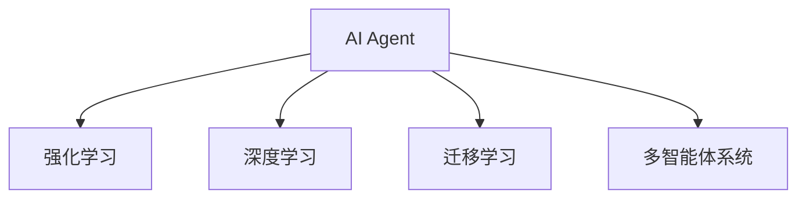

                 

# AI Agent: AI的下一个风口 从早期萌芽到深度学习

## 1. 背景介绍

### 1.1 问题由来
人工智能（AI）自诞生以来，经历了从早期萌芽到深度学习的漫长历程。人工智能技术的快速发展，为社会生产力和人类生活带来了深刻变革。在机器学习、自然语言处理、计算机视觉等领域，人工智能技术已经展现出强大的应用潜力。然而，目前人工智能技术尚未全面应用于现实生产生活。

人工智能技术面临的问题包括但不限于：如何高效地处理大规模数据，如何提升模型的泛化能力，如何构建稳定且高效的AI系统，如何确保AI系统的公平性、安全性和可解释性。这些问题都成为阻碍AI技术落地的主要障碍。

### 1.2 问题核心关键点
这些问题中，AI Agent 的开发与应用显得尤为重要。AI Agent，即人工智能代理，通常指能够自主学习、自主执行任务的系统。AI Agent 在智能搜索、自动规划、自主决策等领域具有广泛应用前景，是人工智能技术的重要发展方向。

开发高效、安全、可解释的AI Agent 需要解决以下核心问题：
- **高效性**：如何快速高效地处理大规模数据，提升AI Agent 的学习和执行效率。
- **泛化能力**：如何使AI Agent 能够处理多种场景和任务，提升其泛化能力。
- **安全性**：如何在保证AI Agent 高效性和泛化能力的前提下，确保其决策的公正性和安全性。
- **可解释性**：如何使AI Agent 的行为更加透明和可解释，增加用户对其决策的信任感。

## 2. 核心概念与联系

### 2.1 核心概念概述

为了更好地理解AI Agent的开发与应用，本节将介绍几个密切相关的核心概念：

- **AI Agent**：指能够自主学习、自主执行任务的系统。常见的AI Agent包括智能搜索、自动规划、自主决策等。

- **强化学习**：一种基于试错的学习方法，通过与环境的交互，通过奖励和惩罚机制，使AI Agent 学习最优策略。强化学习广泛应用于机器人控制、游戏AI等领域。

- **深度学习**：一种模拟人脑神经网络结构的机器学习方法，通过多层次的神经网络模型，对数据进行学习和提取特征。深度学习已成为当前AI领域的主流技术。

- **迁移学习**：指将一个领域学习到的知识迁移到另一个领域的应用。通过迁移学习，AI Agent 可以更好地适应新领域的应用。

- **多智能体系统**：指多个AI Agent 之间互相协作、竞争的系统。在多智能体系统中，AI Agent 可以通过学习合作和竞争策略，提高整体系统性能。

这些核心概念之间的逻辑关系可以通过以下Mermaid流程图来展示：



这个流程图展示了几大AI Agent的关键技术概念及其之间的关系：

1. AI Agent 是核心，通过强化学习、深度学习、迁移学习、多智能体系统等技术手段提升其性能。
2. 强化学习使AI Agent 能够通过与环境的交互学习最优策略。
3. 深度学习提供了强大的模型结构和优化算法，支持AI Agent 的高级学习。
4. 迁移学习使AI Agent 能够跨领域应用，提高泛化能力。
5. 多智能体系统使多个AI Agent 协同工作，提升整体系统性能。

## 3. 核心算法原理 & 具体操作步骤

### 3.1 算法原理概述

开发高效、安全的AI Agent 需要基于多种AI技术，但核心算法原理仍以强化学习为主。强化学习通过环境交互，使AI Agent 学习最优策略，从而实现自主执行任务。

具体而言，强化学习通常包括以下步骤：
1. **环境建模**：将现实世界的问题抽象为环境模型，通过状态、动作和奖励等变量进行描述。
2. **策略学习**：设计合适的策略，如Q-learning、SARSA等，通过与环境交互，学习最优策略。
3. **执行决策**：将学到的策略应用于实际问题，执行决策并获取反馈，继续优化策略。

### 3.2 算法步骤详解

以下是强化学习在AI Agent 开发中的应用步骤：

**Step 1: 环境建模**
- 将现实问题抽象为环境模型，定义状态、动作和奖励等变量。
- 设计合适的状态表示方法，如使用状态空间、特征向量等。
- 确定合适的动作空间，如离散动作、连续动作等。
- 设计合理的奖励函数，激励AI Agent 学习最优策略。

**Step 2: 策略学习**
- 选择合适的强化学习算法，如Q-learning、SARSA、Actor-Critic等。
- 设计合适的策略更新方式，如固定间隔更新、连续更新等。
- 选择合适的参数设置，如学习率、折扣因子等。
- 进行策略训练，不断更新策略，直至收敛。

**Step 3: 执行决策**
- 将学到的策略应用于实际问题，执行决策。
- 获取环境的反馈，更新状态和奖励。
- 根据新的状态和奖励，更新策略，继续执行决策。

### 3.3 算法优缺点

强化学习在AI Agent 开发中具有以下优点：
1. 适用于多种问题类型。强化学习适用于连续、离散、不确定性等多种类型的问题。
2. 动态适应环境。强化学习能够通过不断与环境交互，动态适应环境变化。
3. 可扩展性强。强化学习能够并行处理多智能体系统，提升整体系统性能。

同时，强化学习也存在以下缺点：
1. 学习过程较慢。强化学习通常需要大量时间与环境交互，学习过程较慢。
2. 策略不稳定。强化学习通常需要反复实验，才能找到最优策略，策略不稳定。
3. 易陷入局部最优。强化学习易陷入局部最优，需要设计合适的探索策略，防止过早收敛。
4. 需要大量标注数据。强化学习需要大量环境数据进行训练，数据标注成本较高。

尽管存在这些缺点，但就目前而言，强化学习仍是开发高效、安全、可解释AI Agent 的主流技术范式。未来相关研究的方向在于如何进一步提升强化学习算法的效率和稳定性，以及如何优化环境模型设计。

### 3.4 算法应用领域

强化学习在AI Agent 开发中具有广泛应用，涵盖以下领域：

- **智能搜索**：在推荐系统、信息检索、路径规划等场景中，通过强化学习优化搜索策略，提高搜索效率和精度。
- **自动规划**：在制造、物流、金融等领域，通过强化学习优化生产、配送、投资等规划方案，提升资源利用率和效率。
- **自主决策**：在自动驾驶、智能游戏、机器人控制等领域，通过强化学习使AI Agent 自主决策，提升系统智能化水平。
- **多智能体系统**：在智能电网、交通管理、集群协作等领域，通过多智能体系统，协同处理复杂任务，提升系统整体性能。

除了这些经典应用外，强化学习还被创新性地应用到更多场景中，如可控文本生成、机器人运动控制等，为AI Agent 开发提供了新的思路。

## 4. 数学模型和公式 & 详细讲解 & 举例说明

### 4.1 数学模型构建

强化学习的核心数学模型包括状态、动作、奖励、策略等变量。通过这些变量，可以描述环境模型和AI Agent 的行为。

设环境状态为 $s$，动作为 $a$，奖励为 $r$，策略为 $\pi$。则强化学习的目标是最优化策略 $\pi$，使得期望累积奖励最大化。

数学模型可表示为：
$$
\max_{\pi} \mathbb{E}\left[\sum_{t=0}^{\infty} \gamma^t r_t \right]
$$

其中，$\gamma$ 为折扣因子，表示未来奖励的重要性。

### 4.2 公式推导过程

以下是强化学习的常用算法Q-learning的推导过程：

设状态为 $s$，动作为 $a$，奖励为 $r$，下一个状态为 $s'$，策略为 $\pi$。则Q-learning的目标是最优化策略 $\pi$，使得状态-动作对的Q值最大化。

Q值定义为状态-动作对在未来各步的期望奖励之和。设 $\hat{r}_t = r_t + \gamma V_{\pi}(s_{t+1})$，则Q值可表示为：
$$
Q_{\pi}(s,a) = \mathbb{E}_{\pi}\left[\hat{r}_t + \gamma Q_{\pi}(s',\pi(a'|s')) \right]
$$

通过迭代更新Q值，可以使AI Agent 学习最优策略。设 $\theta_t$ 为第 $t$ 步的Q值，则更新公式为：
$$
\theta_{t+1} = \theta_t + \alpha(r + \gamma \max_{a} Q_{\theta}(s',a) - Q_{\theta}(s,a))
$$

其中，$\alpha$ 为学习率，控制更新速度。

### 4.3 案例分析与讲解

以机器人路径规划为例，说明Q-learning在实际应用中的具体实现：

设机器人的当前位置为 $s$，动作为向前后左右移动，奖励为到达目的地时的累积奖励，下一个位置为 $s'$。则Q-learning的目标是找到最优的移动策略，使得机器人到达目的地时，累积奖励最大化。

设 $Q(s,a)$ 为状态-动作对在当前步的Q值，通过迭代更新Q值，学习最优策略：
$$
Q(s,a) \leftarrow Q(s,a) + \alpha (r + \gamma \max Q(s',a') - Q(s,a))
$$

其中，$a'$ 为当前位置 $s'$ 的下一个动作，$r$ 为当前步的奖励。

通过不断与环境交互，Q-learning可以学习到最优的移动策略，使机器人路径规划更加高效。

## 5. 项目实践：代码实例和详细解释说明

### 5.1 开发环境搭建

在进行AI Agent 开发前，我们需要准备好开发环境。以下是使用Python进行强化学习开发的环境配置流程：

1. 安装Anaconda：从官网下载并安装Anaconda，用于创建独立的Python环境。

2. 创建并激活虚拟环境：
```bash
conda create -n reinforcement-env python=3.8 
conda activate reinforcement-env
```

3. 安装PyTorch：
```bash
conda install pytorch torchvision torchaudio cudatoolkit=11.1 -c pytorch -c conda-forge
```

4. 安装相关库：
```bash
pip install gym
pip install matplotlib numpy scikit-learn
```

完成上述步骤后，即可在`reinforcement-env`环境中开始强化学习实践。

### 5.2 源代码详细实现

这里以Q-learning算法实现一个简单的机器人生态系统（Mazebot）。

```python
import numpy as np
import matplotlib.pyplot as plt
import gym
from gym.spaces import Discrete

# 定义Mazebot环境
class MazebotEnv(gym.Env):
    def __init__(self):
        self.state = 0
        self.reward = 0
        self.goal = 5
        self.current_position = 0

    def step(self, action):
        self.current_position += action
        if self.current_position == self.goal:
            self.reward = 1
        else:
            self.reward = -1
        return self.state, self.reward, self.current_position == self.goal, {}

    def reset(self):
        self.state = 0
        self.reward = 0
        self.current_position = 0
        return self.state

    def render(self):
        print(f"state: {self.state}, position: {self.current_position}, reward: {self.reward}")

# 定义Q-learning算法
def q_learning(env, q_table, num_episodes, discount_factor=0.95, learning_rate=0.5):
    for episode in range(num_episodes):
        state = env.reset()
        done = False
        total_reward = 0
        while not done:
            action = np.random.choice(4) # 0,1,2,3对应上下左右
            next_state, reward, done, _ = env.step(action)
            q_table[state, action] += learning_rate * (reward + discount_factor * np.max(q_table[next_state, :]) - q_table[state, action])
            state = next_state
            total_reward += reward
        print(f"Episode {episode + 1}: Reward {total_reward}")
    print(f"Q Table:\n{q_table}")
    
# 初始化Q表
q_table = np.zeros((10, 4))

# 训练Q-learning算法
q_learning(MazebotEnv(), q_table, 100)

# 绘制Q表
plt.imshow(q_table, cmap='gray')
plt.colorbar()
plt.show()
```

### 5.3 代码解读与分析

让我们再详细解读一下关键代码的实现细节：

**MazebotEnv类**：
- `__init__`方法：初始化环境变量，如状态、奖励、目标位置等。
- `step`方法：根据当前位置和动作，更新状态和奖励，返回新的状态、奖励、是否到达目标、字典。
- `reset`方法：重置环境，返回初始状态。
- `render`方法：打印当前状态、位置和奖励。

**q_learning函数**：
- 定义Q-learning算法的训练过程。
- 通过随机选择动作，更新Q值。
- 在每轮训练结束后，打印出当前轮次的奖励，以及Q表。

**q_table变量**：
- 定义Q表的形状和初始值，Q表的形状为状态数乘以动作数，初始值为0。

以上代码实现了简单的强化学习算法Q-learning，使得机器人在Mazebot环境中学习最优路径规划策略。通过不断与环境交互，Q-learning算法可以学习到最优的移动策略，使机器人路径规划更加高效。

## 6. 实际应用场景

### 6.1 智能搜索

基于强化学习的AI Agent，在智能搜索中具有广泛应用。例如，在推荐系统中，通过强化学习优化搜索策略，可以提升推荐系统的精度和效率。

在推荐系统中，设用户当前状态为 $s$，推荐动作为 $a$，奖励为 $r$，下一状态为 $s'$。则强化学习的目标是找到最优的推荐策略，使得用户满意度最大化。

设 $Q(s,a)$ 为状态-动作对在当前步的Q值，通过迭代更新Q值，学习最优策略：
$$
Q(s,a) \leftarrow Q(s,a) + \alpha (r + \gamma Q_{\theta}(s',a') - Q(s,a))
$$

其中，$a'$ 为当前状态 $s'$ 的下一个动作，$r$ 为当前步的奖励。

通过不断与用户交互，强化学习可以学习到最优的推荐策略，提升推荐系统的性能。

### 6.2 自动规划

在自动规划中，AI Agent 能够通过强化学习优化生产、配送、投资等规划方案，提升资源利用率和效率。

以自动配送为例，设配送中心的位置为 $s$，动作为选择配送路线，奖励为配送效率，下一个位置为 $s'$。则强化学习的目标是找到最优的配送路线，使得配送效率最大化。

设 $Q(s,a)$ 为状态-动作对在当前步的Q值，通过迭代更新Q值，学习最优策略：
$$
Q(s,a) \leftarrow Q(s,a) + \alpha (r + \gamma Q_{\theta}(s',a') - Q(s,a))
$$

其中，$a'$ 为当前位置 $s'$ 的下一个动作，$r$ 为当前步的奖励。

通过不断与环境交互，强化学习可以学习到最优的配送路线，提升配送效率。

### 6.3 自主决策

在自主决策中，AI Agent 能够通过强化学习使决策更加智能和高效。

以自动驾驶为例，设车辆的位置为 $s$，动作为加速、减速、转向，奖励为行驶安全，下一个位置为 $s'$。则强化学习的目标是找到最优的驾驶策略，使得行驶安全最大化。

设 $Q(s,a)$ 为状态-动作对在当前步的Q值，通过迭代更新Q值，学习最优策略：
$$
Q(s,a) \leftarrow Q(s,a) + \alpha (r + \gamma Q_{\theta}(s',a') - Q(s,a))
$$

其中，$a'$ 为当前位置 $s'$ 的下一个动作，$r$ 为当前步的奖励。

通过不断与环境交互，强化学习可以学习到最优的驾驶策略，使自动驾驶更加安全、高效。

### 6.4 多智能体系统

在多智能体系统中，AI Agent 能够通过协同工作，提升整体系统性能。

以智能电网为例，设电力公司的控制策略为 $s$，动作为调节发电、传输，奖励为电网稳定，下一个策略为 $s'$。则强化学习的目标是找到最优的控制策略，使得电网稳定最大化。

设 $Q(s,a)$ 为策略-动作对在当前步的Q值，通过迭代更新Q值，学习最优策略：
$$
Q(s,a) \leftarrow Q(s,a) + \alpha (r + \gamma Q_{\theta}(s',a') - Q(s,a))
$$

其中，$a'$ 为当前策略 $s'$ 的下一个动作，$r$ 为当前步的奖励。

通过不断与环境交互，强化学习可以学习到最优的控制策略，提升智能电网的性能。

## 7. 工具和资源推荐

### 7.1 学习资源推荐

为了帮助开发者系统掌握强化学习技术，这里推荐一些优质的学习资源：

1. 《强化学习基础》系列课程：由斯坦福大学开设的强化学习课程，涵盖了强化学习的基础知识和经典算法。

2. 《强化学习：Reinforcement Learning: An Introduction》书籍：Reinforcement Learning领域的经典书籍，详细介绍了强化学习的原理和应用。

3. 《OpenAI Gym》文档：OpenAI Gym是一个强化学习框架，提供了丰富的环境库和算法库，适合学习和实践强化学习。

4. 《TensorFlow和PyTorch深度学习开发实战》书籍：深入介绍了深度学习的基本原理和实际应用，包含了强化学习等深度学习范式。

5. 《Deep Reinforcement Learning》论文：Deep Reinforcement Learning领域的经典论文，介绍了深度强化学习的最新进展和应用。

通过对这些资源的学习实践，相信你一定能够快速掌握强化学习的精髓，并用于解决实际的AI Agent 问题。

### 7.2 开发工具推荐

高效的开发离不开优秀的工具支持。以下是几款用于强化学习开发的常用工具：

1. TensorFlow：由Google主导开发的开源深度学习框架，生产部署方便，适合大规模工程应用。

2. PyTorch：基于Python的开源深度学习框架，灵活动态的计算图，适合快速迭代研究。

3. OpenAI Gym：强化学习框架，提供了丰富的环境库和算法库，适合学习和实践强化学习。

4. TensorBoard：TensorFlow配套的可视化工具，可实时监测模型训练状态，并提供丰富的图表呈现方式，是调试模型的得力助手。

5. Weights & Biases：模型训练的实验跟踪工具，可以记录和可视化模型训练过程中的各项指标，方便对比和调优。

合理利用这些工具，可以显著提升AI Agent 开发的效率，加快创新迭代的步伐。

### 7.3 相关论文推荐

强化学习在AI Agent 开发中具有广泛应用，以下是几篇奠基性的相关论文，推荐阅读：

1. Q-learning：提出Q-learning算法，通过与环境交互，学习最优策略。

2. Actor-Critic算法：提出Actor-Critic算法，通过同时优化策略和价值函数，提升强化学习效果。

3. Deep Q-Network（DQN）：提出DQN算法，通过深度神经网络优化Q值，提升强化学习效果。

4. AlphaGo：通过深度强化学习技术，实现了机器人在围棋游戏中的胜利，展示了深度强化学习在复杂决策问题中的强大能力。

这些论文代表了大规模学习范式的演进脉络，展示了强化学习技术在AI Agent 开发中的应用前景。

## 8. 总结：未来发展趋势与挑战

### 8.1 总结

本文对强化学习在AI Agent 开发中的应用进行了全面系统的介绍。首先阐述了AI Agent 在智能搜索、自动规划、自主决策、多智能体系统等领域的应用背景和意义，明确了强化学习在AI Agent 开发中的核心地位。其次，从原理到实践，详细讲解了强化学习的数学模型和核心算法，给出了强化学习任务开发的完整代码实例。同时，本文还广泛探讨了强化学习在多个领域的应用前景，展示了强化学习技术的巨大潜力。

通过本文的系统梳理，可以看到，强化学习技术正在成为AI Agent 开发的重要范式，极大地拓展了AI技术的应用边界，催生了更多的落地场景。得益于强大的模型结构和优化算法，强化学习技术在AI Agent 开发中的应用前景广阔，有望为社会生产力和人类生活带来深刻变革。

### 8.2 未来发展趋势

展望未来，强化学习技术在AI Agent 开发中将呈现以下几个发展趋势：

1. **强化学习与深度学习融合**：未来强化学习将更多地融合深度学习技术，提升模型的泛化能力和决策精度。

2. **多智能体协同学习**：未来强化学习将更多地关注多智能体系统的协同学习，提升整体系统性能。

3. **参数高效强化学习**：未来强化学习将更多地采用参数高效的算法，减少计算资源消耗，提升模型训练速度。

4. **鲁棒性和安全性**：未来强化学习将更多地关注模型的鲁棒性和安全性，防止模型过拟合和模型攻击。

5. **可解释性和透明度**：未来强化学习将更多地关注模型的可解释性和透明度，增加用户对其决策的信任感。

6. **跨领域迁移学习**：未来强化学习将更多地关注跨领域迁移学习，提升模型在多种场景中的应用能力。

以上趋势凸显了强化学习技术的广阔前景。这些方向的探索发展，必将进一步提升AI Agent 的性能和应用范围，为社会生产力和人类生活带来更大变革。

### 8.3 面临的挑战

尽管强化学习技术在AI Agent 开发中已经取得了瞩目成就，但在迈向更加智能化、普适化应用的过程中，它仍面临着诸多挑战：

1. **数据需求**：强化学习通常需要大量环境数据进行训练，数据获取成本较高。如何降低数据需求，提升数据利用效率，将是重要的研究方向。

2. **策略不稳定**：强化学习通常需要反复实验，才能找到最优策略，策略不稳定。如何设计合适的探索策略，防止过早收敛，将是重要的研究方向。

3. **计算效率**：强化学习算法通常计算复杂度较高，训练时间长。如何优化算法，提高计算效率，将是重要的研究方向。

4. **鲁棒性不足**：强化学习模型面对域外数据时，泛化性能往往大打折扣。如何提高模型鲁棒性，避免灾难性遗忘，将是重要的研究方向。

5. **安全性问题**：强化学习模型可能学习到有害行为，造成安全隐患。如何保证模型的安全性，将是重要的研究方向。

6. **可解释性不足**：强化学习模型通常缺乏可解释性，难以解释其内部工作机制和决策逻辑。如何增强模型的可解释性，将是重要的研究方向。

以上挑战凸显了强化学习技术在AI Agent 开发中的复杂性。只有不断解决这些挑战，才能使强化学习技术更好地应用于实际问题，提升AI Agent 的性能和应用范围。

### 8.4 研究展望

面对强化学习面临的这些挑战，未来的研究需要在以下几个方面寻求新的突破：

1. **强化学习与深度学习的融合**：通过深度学习技术提升强化学习模型的泛化能力和决策精度。

2. **多智能体协同学习**：通过多智能体协同学习，提升整体系统性能。

3. **参数高效强化学习**：通过参数高效算法，减少计算资源消耗，提升模型训练速度。

4. **鲁棒性提升**：通过鲁棒性优化算法，提升模型对域外数据的泛化能力。

5. **安全性保障**：通过安全性优化算法，防止模型过拟合和模型攻击。

6. **可解释性增强**：通过可解释性优化算法，增强模型的透明度和可解释性。

这些研究方向的探索，必将引领强化学习技术迈向更高的台阶，为AI Agent 开发提供更好的技术支持。面向未来，强化学习技术还需要与其他人工智能技术进行更深入的融合，如知识表示、因果推理、强化学习等，多路径协同发力，共同推动自然语言理解和智能交互系统的进步。只有勇于创新、敢于突破，才能不断拓展AI Agent 的边界，让智能技术更好地造福人类社会。

## 9. 附录：常见问题与解答

**Q1：如何高效训练强化学习模型？**

A: 高效训练强化学习模型可以从以下几个方面入手：
1. **参数共享**：通过共享模型参数，减少计算复杂度。
2. **数据增强**：通过数据增强技术，增加训练样本的多样性。
3. **异步更新**：通过异步更新模型参数，提升训练速度。
4. **优化算法**：通过优化算法，提升模型训练速度和效果。

**Q2：如何提高强化学习模型的鲁棒性？**

A: 提高强化学习模型的鲁棒性可以从以下几个方面入手：
1. **数据多样性**：通过增加数据多样性，提升模型的泛化能力。
2. **正则化**：通过正则化技术，防止模型过拟合。
3. **对抗训练**：通过对抗训练，提升模型的鲁棒性。
4. **模型集成**：通过模型集成技术，提升模型的鲁棒性。

**Q3：如何增强强化学习模型的可解释性？**

A: 增强强化学习模型的可解释性可以从以下几个方面入手：
1. **特征可视化**：通过特征可视化技术，增强模型的可解释性。
2. **规则学习**：通过规则学习技术，增强模型的可解释性。
3. **模型融合**：通过模型融合技术，增强模型的可解释性。

通过这些方法，可以使强化学习模型更加透明和可解释，增加用户对其决策的信任感。

---

作者：禅与计算机程序设计艺术 / Zen and the Art of Computer Programming

