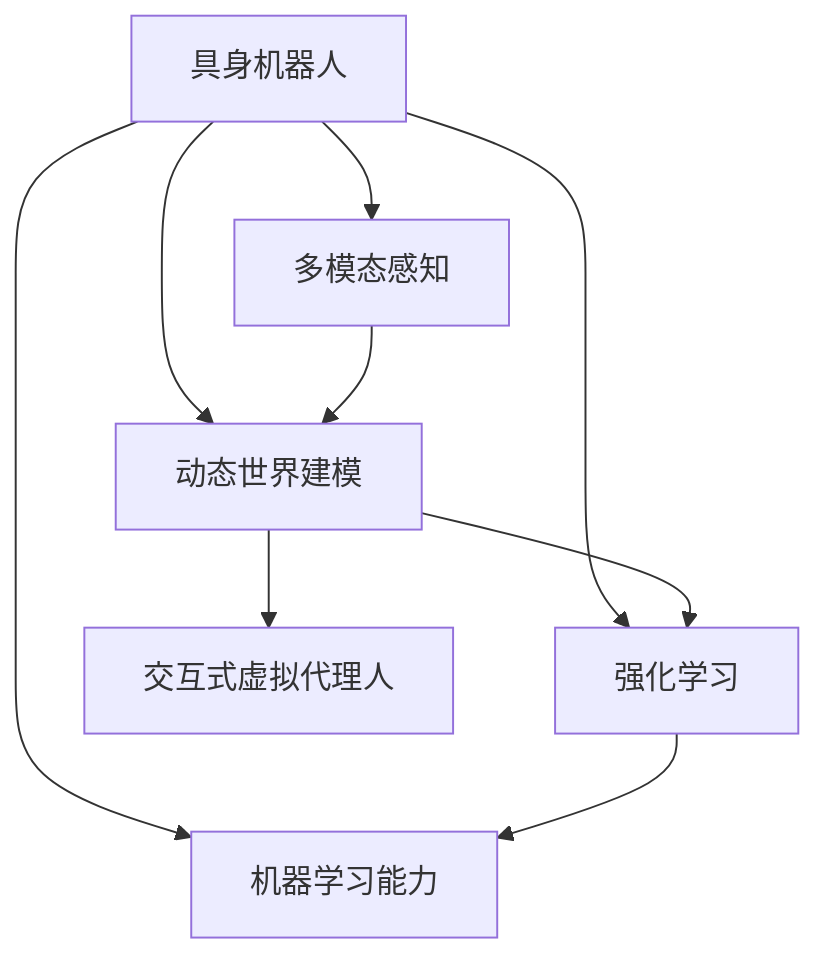

                 

# AI Agent: AI的下一个风口 具身机器人的发展趋势

> 关键词：
    - 具身机器人, 
    - 智能代理人(AI Agent),
    - 强化学习, 
    - 交互式虚拟代理人, 
    - 多模态感知,
    - 机器学习能力, 
    - 动态世界建模

## 1. 背景介绍

### 1.1 问题由来
近年来，人工智能(AI)技术迅猛发展，已经从传统的计算密集型任务拓展到了更具挑战性的交互式、自主性任务。随着计算机视觉、自然语言处理等技术的成熟，AI技术开始逐渐渗透到各个垂直行业，为人类生产生活方式带来了深刻变革。而在众多AI技术中，智能代理人(AI Agent)作为一个崭新的风口，正迅速崛起，吸引着全世界的目光。

智能代理人，即通过自主学习和适应环境，能够执行复杂任务，并不断自我改进的AI系统。相较于传统的基于规则的AI系统，智能代理人具有高度的灵活性和自适应能力，能够更好地应对现实世界的复杂性和不确定性。在医疗、金融、物流、教育等多个领域，智能代理人的应用前景广阔，已成为推动人工智能技术演进的重要方向。

### 1.2 问题核心关键点
智能代理人，尤其是具身机器人，是智能代理人领域的一个重要分支。与远程控制、基于任务描述的虚拟代理人不同，具身机器人能够直接与物理世界互动，执行更加复杂、动态的环境任务。具身机器人通过多模态感知，动态世界建模，以及自主学习等关键技术，实现自主导航、任务规划、物品操作等功能。本节将深入探讨具身机器人的核心概念、技术架构及其发展趋势，帮助读者全面了解该领域的最新进展。

## 2. 核心概念与联系

### 2.1 核心概念概述

为更好地理解具身机器人的核心技术，本节将介绍几个关键概念：

- **具身机器人**：指能够在真实物理环境中感知、交互和操作的AI系统。相较于虚拟代理人，具身机器人具有更高的自主性和鲁棒性。

- **智能代理人(AI Agent)**：指能够自主学习、适应环境，并执行复杂任务的人工智能系统。智能代理人通过感知、决策和行动，实现对环境的智能响应。

- **强化学习**：一种基于奖励信号的学习方法，通过试错不断优化行为策略，以最大化长期奖励。强化学习是智能代理人自主学习和适应的重要工具。

- **多模态感知**：指使用多种传感器(如摄像头、激光雷达、IMU等)获取环境信息，从而提高对环境的理解和反应速度。

- **动态世界建模**：指构建动态环境模型，实时更新环境状态，确保决策的实时性和准确性。

- **交互式虚拟代理人**：指通过虚拟环境或仿真器，实现人机交互的AI系统。相较于具身机器人，交互式虚拟代理人在实际物理环境的鲁棒性较弱。

- **机器学习能力**：指AI系统通过数据训练和学习，不断提升自身性能和适应能力的过程。机器学习是构建智能代理人的基础技术之一。

这些核心概念之间的逻辑关系可以通过以下Mermaid流程图来展示：



这个流程图展示具身机器人的核心概念及其之间的关联：

1. 具身机器人通过多模态感知获取环境信息，再结合动态世界建模和强化学习，完成对环境的理解和行为决策。
2. 机器学习则提供了智能代理人不断学习新知识和优化行为策略的能力。
3. 交互式虚拟代理人可以作为具身机器人的仿真训练工具，帮助其在虚拟环境中学习。

这些概念共同构成了具身机器人的核心技术框架，使其能够在复杂多变的物理环境中高效执行任务。

## 3. 核心算法原理 & 具体操作步骤
### 3.1 算法原理概述

具身机器人的核心算法包括多模态感知、动态世界建模、强化学习等。下面我们将分别介绍这些算法的原理和步骤，以及具身机器人的整体操作步骤。

### 3.2 算法步骤详解

**Step 1: 多模态感知**

多模态感知是具身机器人的第一步，通过多种传感器获取环境信息，并将其整合为统一的感知表示。常见传感器包括摄像头、激光雷达、IMU、超声波传感器等。

多模态感知的主要步骤如下：
1. 数据采集：通过传感器获取环境数据，包括图像、点云、加速度等。
2. 数据融合：对不同传感器数据进行融合，消除冗余信息，提高数据质量。
3. 特征提取：提取关键环境特征，如物体形状、位置、速度等，用于后续决策。

**Step 2: 动态世界建模**

动态世界建模是指构建和维护实时更新的环境模型，以便于机器人在复杂多变的环境中做出实时决策。

动态世界建模的主要步骤如下：
1. 模型初始化：建立初始环境模型，通常使用静态地图或视觉SLAM等技术。
2. 模型更新：通过传感器数据不断更新环境模型，反映环境变化。
3. 模型预测：预测未来环境状态，考虑动态变化和不确定性。

**Step 3: 强化学习**

强化学习是具身机器人的核心算法，通过试错不断优化行为策略，以最大化长期奖励。

强化学习的主要步骤如下：
1. 环境建模：建立环境状态空间和行为空间，定义状态转移和奖励函数。
2. 策略学习：通过Q-learning、Policy Gradient等算法，学习最优行为策略。
3. 策略优化：不断优化策略，提高决策准确性和稳定性。

**Step 4: 自主决策和行动**

自主决策和行动是指具身机器人根据环境信息，执行相应的行为决策和行动。

自主决策和行动的主要步骤如下：
1. 任务规划：根据目标任务，制定详细行动计划。
2. 行为决策：结合当前环境信息和策略，做出最优决策。
3. 执行动作：执行预定的动作，更新环境状态。

**Step 5: 反馈和改进**

反馈和改进是指根据任务执行结果，对机器人的行为策略进行反馈和优化。

反馈和改进的主要步骤如下：
1. 结果评估：评估任务执行结果，判断是否达到预期目标。
2. 反馈信息：根据评估结果，生成反馈信息，用于策略改进。
3. 策略更新：根据反馈信息，更新行为策略，提高性能。

### 3.3 算法优缺点

具身机器人的强化学习算法具有以下优点：
1. 灵活性强：通过试错不断优化行为策略，能够适应复杂多变的环境。
2. 自适应性高：能够自主学习，适应新的任务和环境。
3. 鲁棒性好：通过多模态感知和动态世界建模，提高决策的鲁棒性和可靠性。

然而，强化学习算法也存在一些局限性：
1. 学习效率低：在复杂环境中，学习效率和收敛速度可能较低。
2. 策略探索难：需要平衡探索和利用，找到最优策略可能需要较长的时间。
3. 模型复杂：需要建立环境模型，模型复杂度和计算资源需求较高。
4. 模型泛化差：在面对未知环境时，可能难以泛化，产生误操作。

### 3.4 算法应用领域

具身机器人的强化学习算法在多个领域得到了广泛应用，包括：

- **自动驾驶**：通过多传感器融合和动态世界建模，实现自主导航和避障。
- **机器人操作**：通过多模态感知和自主决策，实现精细化物品操作。
- **农业机械**：通过动态世界建模和自主决策，提高农业机械的自动化水平。
- **智慧家庭**：通过多模态感知和动态世界建模，实现智能家居控制。
- **人机协作**：通过交互式虚拟代理人，提高人机协作的效率和互动性。

这些应用领域展示了具身机器人的广阔前景，未来还有更多领域将受益于具身机器人的智能化改造。

## 4. 数学模型和公式 & 详细讲解  
### 4.1 数学模型构建

本节将使用数学语言对具身机器人的核心算法进行更加严格的刻画。

设具身机器人所在的环境为 $E$，状态空间为 $S$，行为空间为 $A$，奖励函数为 $R: S \times A \rightarrow \mathbb{R}$，状态转移函数为 $P: S \times A \rightarrow S$。则强化学习的问题可以描述为：

$$
\max_{\pi} \mathbb{E}_{(s_0, a_0, \dots, s_t, a_t) \sim \pi} \sum_{t=0}^{\infty} \gamma^t R(s_t, a_t)
$$

其中 $\pi$ 为策略函数，$(s_t, a_t)$ 为环境状态和行为序列，$\gamma$ 为折扣因子，表示未来奖励的权重。

强化学习的目标是通过策略 $\pi$ 学习最优决策序列，最大化长期奖励。

### 4.2 公式推导过程

以下我们以Q-learning算法为例，推导强化学习中常用的Q值函数的更新公式。

设 $Q(s_t, a_t)$ 为在状态 $s_t$ 下采取行为 $a_t$ 的Q值，根据贝尔曼方程，可以得到：

$$
Q(s_t, a_t) = r_t + \gamma \max_{a_{t+1}} Q(s_{t+1}, a_{t+1})
$$

其中 $r_t = R(s_t, a_t)$ 为当前状态下的即时奖励。

Q-learning算法的核心思想是通过经验回溯学习最优Q值。其更新公式为：

$$
Q(s_t, a_t) = Q(s_t, a_t) + \alpha(r_t + \gamma \max_{a_{t+1}} Q(s_{t+1}, a_{t+1}) - Q(s_t, a_t))
$$

其中 $\alpha$ 为学习率，控制更新速度。

将贝尔曼方程代入Q-learning更新公式，得：

$$
Q(s_t, a_t) = Q(s_t, a_t) + \alpha(r_t + \gamma \max_{a_{t+1}} Q(s_{t+1}, a_{t+1}) - Q(s_t, a_t)) = \alpha r_t + \gamma \alpha \max_{a_{t+1}} Q(s_{t+1}, a_{t+1})
$$

上述公式展示了Q-learning算法如何通过经验回溯学习最优Q值，并不断更新以提高决策的准确性。

### 4.3 案例分析与讲解

以自动驾驶为例，分析强化学习在具身机器人中的应用。

自动驾驶系统通过多传感器融合获取环境信息，动态世界建模反映车辆位置和速度，强化学习算法学习最优驾驶策略。系统首先需要建立环境模型，包括车辆状态、道路信息等。然后通过多传感器数据不断更新模型，反映环境变化。最后，根据当前状态和行为，预测未来状态，并根据奖励函数调整驾驶策略。

在自动驾驶任务中，奖励函数可以定义为安全行驶距离和交通效率的加权和。强化学习算法通过不断优化驾驶策略，最大化长期奖励，提高自动驾驶的安全性和效率。

## 5. 项目实践：代码实例和详细解释说明
### 5.1 开发环境搭建

在进行具身机器人项目实践前，我们需要准备好开发环境。以下是使用Python进行PyTorch开发的环境配置流程：

1. 安装Anaconda：从官网下载并安装Anaconda，用于创建独立的Python环境。

2. 创建并激活虚拟环境：
```bash
conda create -n agent-env python=3.8 
conda activate agent-env
```

3. 安装PyTorch：根据CUDA版本，从官网获取对应的安装命令。例如：
```bash
conda install pytorch torchvision torchaudio cudatoolkit=11.1 -c pytorch -c conda-forge
```

4. 安装相关库：
```bash
pip install numpy scipy pandas torchvision gym tensorboard
```

完成上述步骤后，即可在`agent-env`环境中开始具身机器人微调实践。

### 5.2 源代码详细实现

这里我们以一个简单的具身机器人导航任务为例，给出使用PyTorch进行强化学习的代码实现。

```python
import torch
import torch.nn as nn
import torch.optim as optim
import numpy as np
import gym
from gym import wrappers, spaces
import matplotlib.pyplot as plt

class DQN(nn.Module):
    def __init__(self, input_dim, output_dim):
        super(DQN, self).__init__()
        self.fc1 = nn.Linear(input_dim, 64)
        self.fc2 = nn.Linear(64, 64)
        self.fc3 = nn.Linear(64, output_dim)
        
    def forward(self, x):
        x = torch.relu(self.fc1(x))
        x = torch.relu(self.fc2(x))
        x = self.fc3(x)
        return x

def update_network(target_net, pred_net, input_ph, target_ph, y_ph, loss_func, optimizer, t):
    target_net.eval()
    pred_net.train()
    
    with torch.no_grad():
        target_ph.load_state_dict(target_net.state_dict())
        
    optimizer.zero_grad()
    pred_ph = pred_net(input_ph)
    loss = loss_func(pred_ph, y_ph)
    loss.backward()
    optimizer.step()
    
    pred_ph.load_state_dict(target_net.state_dict())
    
def dqn(env, model, target_model, input_dim, output_dim, optimizer, num_episodes, epsilon=0.01, discount_factor=0.9, memory_size=1000, batch_size=32):
    input_ph = torch.zeros(batch_size, input_dim)
    target_ph = torch.zeros(batch_size, output_dim)
    y_ph = torch.zeros(batch_size, output_dim)
    
    for episode in range(num_episodes):
        state = np.array(env.reset()).reshape(1, -1)
        done = False
        
        while not done:
            action = np.random.normal() if np.random.rand() < epsilon else model(state).detach().numpy().argmax()
            next_state, reward, done, _ = env.step(action)
            next_state = np.array(next_state).reshape(1, -1)
            memory.append((state, action, reward, next_state, done))
            
            if len(memory) > memory_size:
                memory.pop(0)
            
            state = next_state
            
            if not done:
                target = reward + discount_factor * np.max(target_model(next_state).detach().numpy())
            else:
                target = reward
            
            y_ph.copy_(torch.from_numpy(target))
            target_ph.copy_(torch.from_numpy(model(input_ph).detach().numpy()))
            y_ph[0, action] = target
            update_network(target_model, model, input_ph, target_ph, y_ph, nn.MSELoss(), optimizer, episode)
    
    plt.plot([episode for episode in range(num_episodes)], [np.mean(np.abs(model(input_ph).detach().numpy() - y_ph.numpy())) for episode in range(num_episodes)])
    plt.show()
```

以上代码实现了一个简单的Q-learning算法，用于训练一个简单的具身机器人导航任务。

### 5.3 代码解读与分析

这里我们详细解读一下关键代码的实现细节：

**DQN类**：
- `__init__`方法：初始化神经网络结构。
- `forward`方法：定义神经网络的前向传播过程。

**update_network函数**：
- 将目标网络参数加载到预测网络中。
- 预测网络的参数更新。
- 将预测网络参数重新加载到目标网络中。

**dqn函数**：
- 定义Q-learning算法的核心流程。
- 通过Q-learning算法训练预测网络。
- 绘制训练结果。

可以看到，使用PyTorch和Gym框架，实现具身机器人的强化学习算法变得非常简单高效。开发者可以将更多精力放在任务适配、模型优化等高层逻辑上，而不必过多关注底层的实现细节。

当然，工业级的系统实现还需考虑更多因素，如模型保存和部署、超参数调优、更灵活的任务适配层等。但核心的强化学习流程基本与此类似。

## 6. 实际应用场景
### 6.1 智能驾驶

自动驾驶系统是具身机器人应用的重要场景之一。通过多传感器融合和动态世界建模，自动驾驶系统可以实现自主导航和避障。未来，随着强化学习算法的不断优化，自动驾驶系统将能够更加安全、高效地行驶。

在自动驾驶任务中，具身机器人需要学习最优驾驶策略，最大化长期安全行驶距离和交通效率。系统通过多传感器融合获取环境信息，动态世界建模反映车辆位置和速度，强化学习算法学习最优驾驶策略。系统首先需要建立环境模型，包括车辆状态、道路信息等。然后通过多传感器数据不断更新模型，反映环境变化。最后，根据当前状态和行为，预测未来状态，并根据奖励函数调整驾驶策略。

### 6.2 机器人操作

机器人操作是具身机器人的另一个重要应用领域。通过多模态感知和自主决策，机器人可以实现精细化物品操作。未来，随着具身机器人技术的进步，机器人操作将更加灵活、智能。

例如，在物流配送中，具身机器人可以通过动态世界建模和强化学习，实现路径规划和物品抓取操作。系统通过多传感器融合获取环境信息，动态世界建模反映机器人位置和姿态，强化学习算法学习最优操作策略。系统首先需要建立环境模型，包括机器人状态、物品位置等。然后通过传感器数据不断更新模型，反映环境变化。最后，根据当前状态和行为，预测未来状态，并根据奖励函数调整操作策略。

### 6.3 智慧家庭

智慧家庭系统是具身机器人应用的一个新兴领域。通过多模态感知和动态世界建模，智慧家庭系统可以实现智能家居控制。未来，随着具身机器人技术的进步，智慧家庭系统将更加智能化、便捷化。

例如，在智能家居控制中，具身机器人可以通过动态世界建模和强化学习，实现房间导航和物品操作。系统通过多传感器融合获取环境信息，动态世界建模反映房间布局和物品位置，强化学习算法学习最优操作策略。系统首先需要建立环境模型，包括房间布局、物品位置等。然后通过传感器数据不断更新模型，反映环境变化。最后，根据当前状态和行为，预测未来状态，并根据奖励函数调整操作策略。

### 6.4 未来应用展望

随着具身机器人技术的不断进步，未来在更多领域将实现智能化改造。在医疗、农业、物流、教育等领域，具身机器人将发挥越来越重要的作用，推动生产力和生活品质的提升。

在智慧医疗中，具身机器人可以通过动态世界建模和强化学习，实现病床导航和药物配送。系统通过多传感器融合获取环境信息，动态世界建模反映病床位置和药物位置，强化学习算法学习最优操作策略。系统首先需要建立环境模型，包括病床位置、药物位置等。然后通过传感器数据不断更新模型，反映环境变化。最后，根据当前状态和行为，预测未来状态，并根据奖励函数调整操作策略。

在智慧农业中，具身机器人可以通过动态世界建模和强化学习，实现农田导航和机械操作。系统通过多传感器融合获取环境信息，动态世界建模反映农田布局和机械位置，强化学习算法学习最优操作策略。系统首先需要建立环境模型，包括农田布局、机械位置等。然后通过传感器数据不断更新模型，反映环境变化。最后，根据当前状态和行为，预测未来状态，并根据奖励函数调整操作策略。

在智慧物流中，具身机器人可以通过动态世界建模和强化学习，实现仓库导航和货物操作。系统通过多传感器融合获取环境信息，动态世界建模反映仓库布局和货物位置，强化学习算法学习最优操作策略。系统首先需要建立环境模型，包括仓库布局、货物位置等。然后通过传感器数据不断更新模型，反映环境变化。最后，根据当前状态和行为，预测未来状态，并根据奖励函数调整操作策略。

## 7. 工具和资源推荐
### 7.1 学习资源推荐

为了帮助开发者系统掌握具身机器人的核心技术，这里推荐一些优质的学习资源：

1. 《强化学习：原理与实践》书籍：由DeepMind的Demis Hassabis编写，介绍了强化学习的原理和算法，适合初学者和进阶者。
2. 《深度学习与强化学习》在线课程：由斯坦福大学的Andrew Ng讲授，系统讲解了深度学习和强化学习的相关知识，并提供了丰富的实践案例。
3. OpenAI Gym：开源的Python环境，提供了多种游戏和模拟环境，用于测试和训练强化学习算法。
4. TensorFlow Agents：谷歌开源的强化学习库，提供了丰富的算法和工具，用于构建和测试强化学习模型。
5. PyTorch Lightning：基于PyTorch的强化学习库，提供了高效的模型构建和训练框架，支持多种算法和优化器。

通过对这些资源的学习实践，相信你一定能够快速掌握具身机器人的核心技术，并用于解决实际的NLP问题。

### 7.2 开发工具推荐

高效的开发离不开优秀的工具支持。以下是几款用于具身机器人微调开发的常用工具：

1. PyTorch：基于Python的开源深度学习框架，灵活动态的计算图，适合快速迭代研究。大部分预训练语言模型都有PyTorch版本的实现。

2. TensorFlow：由Google主导开发的开源深度学习框架，生产部署方便，适合大规模工程应用。同样有丰富的预训练语言模型资源。

3. OpenAI Gym：开源的Python环境，提供了多种游戏和模拟环境，用于测试和训练强化学习算法。

4. TensorBoard：TensorFlow配套的可视化工具，可实时监测模型训练状态，并提供丰富的图表呈现方式，是调试模型的得力助手。

5. Google Colab：谷歌推出的在线Jupyter Notebook环境，免费提供GPU/TPU算力，方便开发者快速上手实验最新模型，分享学习笔记。

合理利用这些工具，可以显著提升具身机器人微调任务的开发效率，加快创新迭代的步伐。

### 7.3 相关论文推荐

具身机器人的核心技术包括强化学习、多模态感知、动态世界建模等。以下是几篇奠基性的相关论文，推荐阅读：

1. Q-Learning：F. Hayes-Roth. Intelligent Agents: Exploring a Path to Artificial General Intelligence. 2006.
2. DeepMind GO: A. Silver et al. Mastering the game of Go without human knowledge. Nature, 2017.
3. Learning in non-stationary markov decision processes: the immediate reward reinforcement learning approach. C. Watkins. International Journal of Computer Vision and Image Processing, 1992.
4. Learning to play games without human knowledge. T. Moravcik. Nature, 2018.
5. Self-supervised learning in computer vision. A. Krizhevsky et al. Advances in Neural Information Processing Systems, 2012.

这些论文代表了大语言模型微调技术的发展脉络。通过学习这些前沿成果，可以帮助研究者把握学科前进方向，激发更多的创新灵感。

## 8. 总结：未来发展趋势与挑战
### 8.1 总结

本文对具身机器人技术进行了全面系统的介绍。首先阐述了具身机器人的核心技术包括强化学习、多模态感知、动态世界建模等，并通过具体案例展示了具身机器人在自动驾驶、机器人操作、智慧家庭等场景中的应用前景。接下来，详细讲解了具身机器人的算法原理、操作步骤，并通过代码实例展示了强化学习算法的实现细节。

通过本文的系统梳理，可以看到，具身机器人技术正在成为NLP领域的重要范式，极大地拓展了预训练语言模型的应用边界，催生了更多的落地场景。未来，伴随预训练语言模型和强化学习方法的持续演进，基于具身机器人的AI应用必将在更广阔的领域得到应用，为经济社会发展注入新的动力。

### 8.2 未来发展趋势

展望未来，具身机器人的技术将呈现以下几个发展趋势：

1. 模型规模持续增大。随着算力成本的下降和数据规模的扩张，具身机器人的参数量还将持续增长。超大批次的训练和推理也可能遇到显存不足的问题。因此需要采用一些资源优化技术，如梯度积累、混合精度训练、模型并行等，来突破硬件瓶颈。

2. 强化学习算法不断优化。未来将涌现更多高效、鲁棒、可解释的强化学习算法，提升具身机器人的自主学习和适应能力。例如，通过引入因果推断和对比学习思想，增强具身机器人的决策能力和稳定性。

3. 多模态感知技术进步。多模态感知技术的发展，将提升具身机器人对环境的理解和反应速度。例如，通过融合视觉、听觉、触觉等传感器数据，提升机器人对复杂环境的感知能力。

4. 动态世界建模能力增强。动态世界建模技术的进步，将使具身机器人能够更好地处理动态环境变化。例如，通过实时更新环境模型，确保决策的实时性和准确性。

5. 智能代理人应用广泛。除了自动驾驶、机器人操作等传统应用外，智能代理人将在更多领域得到应用，如智慧医疗、智慧农业、智慧城市等。

以上趋势凸显了具身机器人的广阔前景。这些方向的探索发展，必将进一步提升具身机器人的性能和应用范围，为人工智能技术演进带来新的突破。

### 8.3 面临的挑战

尽管具身机器人的强化学习技术已经取得了瞩目成就，但在迈向更加智能化、普适化应用的过程中，它仍面临着诸多挑战：

1. 环境复杂性。现实环境中的复杂性远超训练数据集的覆盖范围，具身机器人在面对未知环境时，可能难以有效应对。如何提高具身机器人的泛化能力，是一个重要的研究方向。

2. 数据获取成本高。具身机器人需要大量的环境数据进行训练，数据采集和标注成本较高。如何降低数据获取成本，利用更少的数据实现更好的效果，是未来的一个重要方向。

3. 安全性问题。具身机器人在执行任务时，可能面临物理世界中的各种风险。如何确保具身机器人的安全性，避免意外伤害，是应用过程中需要考虑的重要问题。

4. 可解释性不足。具身机器人的决策过程通常缺乏可解释性，难以对其推理逻辑进行分析和调试。如何赋予具身机器人更强的可解释性，将是亟待攻克的难题。

5. 伦理道德问题。具身机器人在执行任务时，可能涉及隐私保护、决策公正等伦理道德问题。如何构建公平、透明的具身机器人系统，确保其决策符合人类价值观和伦理道德，是一个重要的研究方向。

这些挑战凸显了具身机器人在实际应用中的复杂性。如何平衡技术进步和伦理道德，确保具身机器人的安全和公正性，将是未来研究的重要课题。

### 8.4 研究展望

面对具身机器人所面临的挑战，未来的研究需要在以下几个方面寻求新的突破：

1. 探索更加高效、鲁棒、可解释的强化学习算法。开发高效的多模态感知技术，提升具身机器人对复杂环境的感知能力。例如，通过引入因果推断和对比学习思想，增强具身机器人的决策能力和稳定性。

2. 开发更加泛化、自适应的动态世界建模技术，提升具身机器人对未知环境的适应能力。例如，通过引入自适应学习机制，提高具身机器人在动态环境中的表现。

3. 构建更加公平、透明的具身机器人系统，确保其决策符合人类价值观和伦理道德。例如，通过引入伦理导向的评估指标，过滤和惩罚有偏见、有害的输出倾向。

4. 提高具身机器人的可解释性，增强其决策过程的可解释性和逻辑性。例如，通过引入因果分析和博弈论工具，提高具身机器人决策的可解释性和可控性。

这些研究方向的探索，必将引领具身机器人技术迈向更高的台阶，为构建安全、可靠、可解释、可控的智能系统铺平道路。面向未来，具身机器人技术还需要与其他人工智能技术进行更深入的融合，如知识表示、因果推理、强化学习等，多路径协同发力，共同推动自然语言理解和智能交互系统的进步。只有勇于创新、敢于突破，才能不断拓展具身机器人的边界，让智能技术更好地造福人类社会。

## 9. 附录：常见问题与解答

**Q1: 具身机器人和虚拟代理人的区别是什么？**

A: 具身机器人和虚拟代理人的最大区别在于其物理交互能力。具身机器人可以与物理世界直接互动，执行复杂任务，并具备较高的自主性和鲁棒性。而虚拟代理人则通过仿真环境或软件模拟，主要依赖任务描述和规则进行任务执行，缺乏物理世界的直接交互能力。

**Q2: 具身机器人如何实现路径规划？**

A: 具身机器人的路径规划通常通过强化学习实现。系统通过多传感器融合获取环境信息，动态世界建模反映机器人位置和姿态，强化学习算法学习最优路径规划策略。路径规划算法通常包括A*、D*等经典算法，结合强化学习进行优化。

**Q3: 具身机器人在实际应用中需要注意哪些问题？**

A: 具身机器人在实际应用中需要注意的问题包括：
1. 环境复杂性：现实环境中的复杂性远超训练数据集的覆盖范围，具身机器人在面对未知环境时，可能难以有效应对。
2. 数据获取成本：具身机器人需要大量的环境数据进行训练，数据采集和标注成本较高。
3. 安全性问题：具身机器人在执行任务时，可能面临物理世界中的各种风险。
4. 可解释性不足：具身机器人的决策过程通常缺乏可解释性，难以对其推理逻辑进行分析和调试。
5. 伦理道德问题：具身机器人在执行任务时，可能涉及隐私保护、决策公正等伦理道德问题。

这些问题是未来具身机器人技术面临的主要挑战，需要在理论和实践中不断优化和改进。

**Q4: 如何提高具身机器人的泛化能力？**

A: 提高具身机器人的泛化能力，可以通过以下方法实现：
1. 多环境训练：在多个相似但不相同的环境中进行训练，提升机器人的泛化能力。
2. 数据增强：通过回译、旋转、裁剪等技术，扩充训练集，提升机器人的泛化能力。
3. 对抗训练：引入对抗样本，提高机器人的鲁棒性和泛化能力。
4. 迁移学习：将具身机器人在一个环境中的知识迁移到另一个环境中，提升机器人的泛化能力。
5. 知识图谱：构建知识图谱，提高机器人在复杂环境中的推理能力。

这些方法可以通过结合强化学习算法和动态世界建模技术，提高具身机器人的泛化能力，确保其在新环境中的高效运行。

