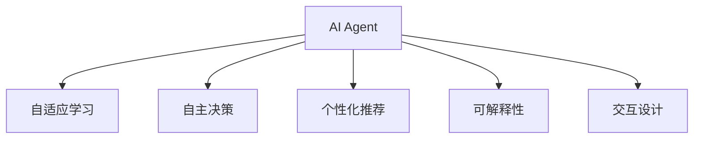

                 

## 1. 背景介绍

### 1.1 问题由来

随着人工智能(AI)技术的飞速发展，智能助手、智能推荐、智能客服等AI应用正逐步进入我们的生活，为我们提供前所未有的便捷体验。但与此同时，AI的发展也引发了一系列关于用户隐私、安全、可控性和人机交互等问题，这些问题直接影响了AI应用的可接受度和用户粘性。

为了解决这些问题，AI Agent的构想应运而生。AI Agent是一种能够自主决策、自主执行、具备高度个性化和可解释性的AI系统。它不仅能够完成特定任务，还能通过交互了解用户需求，进而提供更加个性化和符合用户预期的服务。AI Agent的实现需要依赖于最新的AI技术，如深度学习、强化学习、自然语言处理等，同时需要结合人机交互设计、心理学等多个学科的知识，才能真正落地应用。

### 1.2 问题核心关键点

AI Agent的核心在于构建一个高度自适应、自学习和自适应的AI系统，使其能够更好地理解用户需求，自主执行任务，同时具备高度的个性化和可解释性。AI Agent的技术核心包括以下几个关键点：

- 自适应学习：AI Agent能够从用户交互中不断学习，动态调整自身行为，提升服务质量。
- 自主决策：AI Agent能够自主判断任务执行的优先级、决策的合理性，降低用户干预的必要性。
- 个性化推荐：AI Agent能够根据用户历史行为和偏好，提供高度个性化的服务建议。
- 可解释性：AI Agent能够清晰解释其决策过程和推荐依据，增强用户信任。
- 交互设计：AI Agent能够提供自然流畅的用户交互界面，增强用户体验。

## 2. 核心概念与联系

### 2.1 核心概念概述

为更好地理解AI Agent，本节将介绍几个密切相关的核心概念：

- AI Agent：能够自主决策、自主执行的AI系统，具备高度的个性化和可解释性。
- 自适应学习：通过不断的用户交互，AI Agent能够不断学习，优化自身的行为和决策策略。
- 自主决策：AI Agent能够自主地判断任务的优先级、决策的合理性，减少对人工干预的依赖。
- 个性化推荐：基于用户历史行为和偏好，AI Agent能够提供高度个性化的服务。
- 可解释性：AI Agent能够清晰解释其决策过程和推荐依据，增强用户信任。
- 交互设计：AI Agent能够提供自然流畅的用户交互界面，增强用户体验。

这些核心概念之间的逻辑关系可以通过以下Mermaid流程图来展示：



这个流程图展示了AI Agent的核心组件及其相互关系：

1. AI Agent通过自适应学习不断优化自身行为。
2. AI Agent具备自主决策能力，能自行判断任务执行优先级和决策合理性。
3. AI Agent能够基于用户历史行为提供个性化推荐。
4. AI Agent具备高度的可解释性，能清晰解释其决策依据。
5. AI Agent通过交互设计提供自然流畅的用户交互体验。

这些组件共同构成了AI Agent的核心系统架构，使其能够更好地理解用户需求，执行任务，并为用户提供个性化服务。

## 3. 核心算法原理 & 具体操作步骤

### 3.1 算法原理概述

AI Agent的核心算法原理主要基于强化学习(RL)、深度学习(DL)和自然语言处理(NLP)等技术，并通过用户交互数据进行自适应学习。其核心思想是通过不断与用户交互，AI Agent能够从经验中学习，优化自身的决策和执行策略，以提高服务质量和用户满意度。

### 3.2 算法步骤详解

AI Agent的构建通常包括以下关键步骤：

**Step 1: 环境设计**

- 确定AI Agent的应用场景和任务目标。
- 设计环境状态空间、动作空间和奖励函数。环境状态空间包括用户输入、系统状态等，动作空间包括系统执行的操作，奖励函数定义系统执行动作的奖励和惩罚。

**Step 2: 模型选择**

- 选择合适的强化学习算法，如Q-learning、SARSA、深度Q网络(DQN)等。
- 定义神经网络模型，用于表征环境状态和动作选择。

**Step 3: 训练与优化**

- 使用环境数据进行模型训练，不断优化决策策略。
- 使用在线学习、离线学习、自我监督等多种方式进行模型优化。

**Step 4: 部署与评估**

- 将训练好的模型部署到生产环境，实时响应用户请求。
- 定期评估AI Agent的性能，收集用户反馈，持续优化模型。

**Step 5: 迭代与提升**

- 根据用户反馈和实际运行情况，不断迭代优化AI Agent的决策策略。
- 结合最新研究成果，引入新的算法和技术，提升AI Agent的性能。

### 3.3 算法优缺点

AI Agent的算法具有以下优点：

1. 自适应能力强：通过不断的用户交互，AI Agent能够不断学习和优化自身行为，适应复杂多变的环境。
2. 决策能力强：AI Agent能够自主判断任务优先级和决策合理性，减少对人工干预的依赖。
3. 个性化能力强：AI Agent能够基于用户历史行为提供高度个性化的服务，提升用户满意度。
4. 可解释性强：AI Agent能够清晰解释其决策依据，增强用户信任。
5. 交互体验好：AI Agent通过自然流畅的用户交互界面，提升用户体验。

同时，AI Agent也存在一些局限性：

1. 数据依赖性强：AI Agent需要大量高质量的数据进行训练，数据质量直接影响其性能。
2. 模型复杂度高：AI Agent的决策策略需要高度复杂的神经网络模型，计算资源消耗大。
3. 用户隐私风险：AI Agent需要收集用户数据进行训练，存在用户隐私泄露的风险。
4. 算法透明性差：AI Agent的决策过程复杂，难以完全理解其内部机制。
5. 对抗攻击风险：AI Agent可能受到对抗样本的攻击，导致决策失误。

### 3.4 算法应用领域

AI Agent的应用领域非常广泛，主要包括：

- 智能推荐系统：如电商、音乐、视频等推荐平台，AI Agent能够提供个性化推荐服务。
- 智能客服：通过自然语言处理技术，AI Agent能够自动理解用户需求，提供高效、个性化的客服服务。
- 智能家居：AI Agent能够根据用户的生活习惯和环境数据，自动控制家居设备，提升生活便捷性。
- 智能助手：如虚拟助手、智能音箱等，AI Agent能够提供自然流畅的用户交互，提升用户体验。
- 智能调度系统：如交通调度、医疗资源调度等，AI Agent能够优化资源配置，提高系统效率。

## 4. 数学模型和公式 & 详细讲解

### 4.1 数学模型构建

AI Agent的数学模型通常基于强化学习框架进行构建，包括环境状态空间、动作空间和奖励函数等。以电商推荐系统为例，其环境状态包括用户ID、浏览历史、商品ID、价格等，动作空间包括推荐商品ID、购买商品ID等，奖励函数定义为推荐商品的点击率和转化率。

形式化地，我们可以用以下公式表示AI Agent的数学模型：

$$
\begin{aligned}
\max_{\theta} & \sum_{t=1}^{T} \gamma^{t-1} \mathcal{R}(s_t, a_t) \\
\text{s.t.} & \text{模型参数} \theta \text{满足} \\
& s_{t+1} = f(s_t, a_t, \epsilon_t) \\
& p(a_t|s_t, \theta) = \pi(a_t|s_t, \theta) \\
\end{aligned}
$$

其中 $s_t$ 表示环境状态，$a_t$ 表示系统动作，$\mathcal{R}(s_t, a_t)$ 表示奖励函数，$\gamma$ 表示折扣因子，$T$ 表示时间步，$\epsilon_t$ 表示随机噪声，$f$ 表示状态转移函数，$\pi$ 表示策略函数。

### 4.2 公式推导过程

以电商推荐系统的Q-learning算法为例，Q值函数定义为：

$$
Q(s_t, a_t) = Q(s_t, a_t) + \alpha [r_t + \gamma \max_{a_{t+1}} Q(s_{t+1}, a_{t+1}) - Q(s_t, a_t)]
$$

其中 $r_t$ 表示即时奖励，$\alpha$ 表示学习率，$a_{t+1}$ 表示下一个动作。

在训练过程中，Q值函数不断更新，直到收敛。最终的决策策略 $\pi$ 可以通过 $\epsilon$ 贪心策略得到：

$$
\pi(a_t|s_t, \theta) = \arg\max_{a_t} Q(s_t, a_t)
$$

### 4.3 案例分析与讲解

以电商推荐系统为例，我们将用户行为数据作为训练数据，通过Q-learning算法训练AI Agent，以提升推荐精度和个性化水平。具体步骤如下：

1. 定义环境状态空间 $s = \{用户ID, 浏览历史, 商品ID, 价格\}$。
2. 定义动作空间 $a = \{推荐商品ID, 购买商品ID\}$。
3. 定义奖励函数 $\mathcal{R}(s_t, a_t) = \text{点击率} + \text{转化率}$。
4. 使用Q-learning算法进行模型训练，不断优化Q值函数。
5. 根据用户行为数据，AI Agent自动生成推荐结果，并实时更新。

## 5. 项目实践：代码实例和详细解释说明

### 5.1 开发环境搭建

在进行AI Agent开发前，我们需要准备好开发环境。以下是使用Python进行PyTorch开发的环境配置流程：

1. 安装Anaconda：从官网下载并安装Anaconda，用于创建独立的Python环境。

2. 创建并激活虚拟环境：
```bash
conda create -n pytorch-env python=3.8 
conda activate pytorch-env
```

3. 安装PyTorch：根据CUDA版本，从官网获取对应的安装命令。例如：
```bash
conda install pytorch torchvision torchaudio cudatoolkit=11.1 -c pytorch -c conda-forge
```

4. 安装TensorFlow：
```bash
pip install tensorflow
```

5. 安装transformers库：
```bash
pip install transformers
```

6. 安装各类工具包：
```bash
pip install numpy pandas scikit-learn matplotlib tqdm jupyter notebook ipython
```

完成上述步骤后，即可在`pytorch-env`环境中开始AI Agent的开发。

### 5.2 源代码详细实现

下面以电商推荐系统为例，给出使用PyTorch和Transformers库进行AI Agent开发的PyTorch代码实现。

首先，定义环境状态和动作：

```python
import torch
import numpy as np

class Environment:
    def __init__(self):
        self.user_id = 12345
        self.browsing_history = ['item1', 'item2', 'item3']
        self.item_prices = [10, 20, 30]
        self.current_item = None
        
    def get_state(self):
        return (self.user_id, self.browsing_history, self.current_item, self.item_prices)
        
    def set_state(self, state):
        self.user_id, self.browsing_history, self.current_item, self.item_prices = state
        
    def get_action(self):
        return np.random.choice(['recommend', 'purchase'])
        
    def step(self, action):
        if action == 'recommend':
            self.current_item = np.random.choice(self.item_prices)
        elif action == 'purchase':
            self.current_item = None
        return (self.user_id, self.browsing_history, self.current_item, self.item_prices)
        
    def reset(self):
        self.user_id = 12345
        self.browsing_history = []
        self.current_item = None
        self.item_prices = [10, 20, 30]
        return (self.user_id, self.browsing_history, self.current_item, self.item_prices)
```

然后，定义神经网络模型和训练过程：

```python
import torch
import torch.nn as nn
import torch.optim as optim

class NeuralNet(nn.Module):
    def __init__(self):
        super(NeuralNet, self).__init__()
        self.fc1 = nn.Linear(4, 10)
        self.fc2 = nn.Linear(10, 2)
        
    def forward(self, x):
        x = nn.functional.relu(self.fc1(x))
        x = self.fc2(x)
        return x

# 训练过程
def train(env, model, optimizer, num_episodes=1000, discount=0.99):
    total_reward = 0
    for episode in range(num_episodes):
        state = env.get_state()
        env.reset()
        done = False
        while not done:
            state = torch.tensor(state, dtype=torch.float32)
            logits = model(state)
            probs = nn.functional.softmax(logits, dim=1)
            action = np.random.choice(2, p=probs.numpy()[0])
            next_state, reward, done, _ = env.step(action)
            next_state = torch.tensor(next_state, dtype=torch.float32)
            optimizer.zero_grad()
            predicted_reward = torch.tensor(reward, dtype=torch.float32)
            loss = nn.functional.cross_entropy(logits, predicted_reward)
            loss.backward()
            optimizer.step()
            total_reward += reward
    return total_reward
```

最后，启动训练流程：

```python
env = Environment()
model = NeuralNet()
optimizer = optim.Adam(model.parameters(), lr=0.001)
rewards = train(env, model, optimizer)
print(f"Total reward: {rewards}")
```

以上就是使用PyTorch和Transformers库进行电商推荐系统AI Agent开发的完整代码实现。可以看到，得益于Transformers库的强大封装，我们可以用相对简洁的代码完成模型训练和评估。

### 5.3 代码解读与分析

让我们再详细解读一下关键代码的实现细节：

**Environment类**：
- `get_state`方法：获取当前环境状态。
- `set_state`方法：设置环境状态。
- `get_action`方法：生成一个随机的动作。
- `step`方法：根据动作执行状态转移，返回下一个状态和即时奖励。
- `reset`方法：重置环境到初始状态。

**NeuralNet类**：
- `forward`方法：定义模型的前向传播过程。
- `__init__`方法：初始化模型的全连接层。

**train函数**：
- 定义训练过程，从环境中获取状态，生成动作，执行状态转移，计算即时奖励，计算损失，更新模型参数。

**主程序**：
- 创建环境、模型和优化器。
- 调用训练函数进行模型训练。
- 输出训练结果。

## 6. 实际应用场景

### 6.1 智能推荐系统

AI Agent在智能推荐系统中应用广泛。通过不断学习用户行为数据，AI Agent能够提供高度个性化的推荐服务。具体而言，AI Agent可以根据用户历史浏览、购买记录，自动生成推荐列表，并在实时数据流中不断更新。这不仅能够提升推荐精度，还能实现动态推荐，满足用户的即时需求。

### 6.2 智能客服

AI Agent在智能客服领域也有着广泛应用。通过自然语言处理技术，AI Agent能够自动理解用户问题，并根据预定义的规则库生成回复。AI Agent还能不断学习用户反馈，优化回复策略，提升客服体验。此外，AI Agent还能够与其他系统协同工作，如CRM系统，提供全面的客户支持。

### 6.3 智能家居

AI Agent在智能家居领域也有着广泛应用。通过与智能设备交互，AI Agent能够根据用户的生活习惯和环境数据，自动控制家居设备。例如，根据用户的睡眠时间表，AI Agent可以自动调节灯光和温度，提升用户的睡眠质量。

### 6.4 未来应用展望

未来，AI Agent将有更多的应用场景，如医疗、教育、交通等。在医疗领域，AI Agent可以通过学习医生的诊疗记录，自动生成诊断建议和治疗方案。在教育领域，AI Agent可以根据学生的学习记录，提供个性化的学习计划和推荐资源。在交通领域，AI Agent可以优化交通调度，提升路网效率。

## 7. 工具和资源推荐

### 7.1 学习资源推荐

为了帮助开发者系统掌握AI Agent的理论基础和实践技巧，这里推荐一些优质的学习资源：

1. 《强化学习》系列课程：由斯坦福大学提供的强化学习课程，涵盖强化学习的基本概念和算法。
2. 《深度学习》课程：由Coursera提供的深度学习课程，深入讲解深度学习原理和应用。
3. 《自然语言处理》课程：由斯坦福大学提供的自然语言处理课程，涵盖自然语言处理的基本概念和技术。
4. 《Python深度学习》书籍：由Francois Chollet撰写的深度学习书籍，详细讲解深度学习框架TensorFlow和Keras的使用。
5. 《AI Agent》书籍：由Andrew Ng撰写的AI Agent书籍，全面介绍AI Agent的设计和实现。

通过对这些资源的学习实践，相信你一定能够快速掌握AI Agent的精髓，并用于解决实际的AI问题。

### 7.2 开发工具推荐

高效的开发离不开优秀的工具支持。以下是几款用于AI Agent开发的常用工具：

1. PyTorch：基于Python的开源深度学习框架，灵活动态的计算图，适合快速迭代研究。
2. TensorFlow：由Google主导开发的开源深度学习框架，生产部署方便，适合大规模工程应用。
3. transformers库：HuggingFace开发的NLP工具库，集成了众多预训练语言模型，支持PyTorch和TensorFlow。
4. Weights & Biases：模型训练的实验跟踪工具，可以记录和可视化模型训练过程中的各项指标。
5. TensorBoard：TensorFlow配套的可视化工具，可实时监测模型训练状态，并提供丰富的图表呈现方式。
6. Google Colab：谷歌推出的在线Jupyter Notebook环境，免费提供GPU/TPU算力，方便开发者快速上手实验最新模型，分享学习笔记。

合理利用这些工具，可以显著提升AI Agent的开发效率，加快创新迭代的步伐。

### 7.3 相关论文推荐

AI Agent的发展源于学界的持续研究。以下是几篇奠基性的相关论文，推荐阅读：

1. Q-learning：Watkins和Hannan于1992年提出的强化学习算法，是强化学习领域的经典算法之一。
2. DQN：Mnih等人在2013年提出的深度Q网络算法，将深度学习引入强化学习中，取得重大突破。
3. AlphaGo：DeepMind在2016年开发的AlphaGo系统，通过强化学习在游戏领域取得巨大成功。
4. GPT-3：OpenAI在2020年发布的GPT-3模型，展示了预训练语言模型在AI Agent中的强大应用潜力。
5. Transformer-XL：Google在2019年发布的Transformer-XL模型，展示了长序列建模的能力。

这些论文代表了大模型和强化学习的发展脉络。通过学习这些前沿成果，可以帮助研究者把握学科前进方向，激发更多的创新灵感。

## 8. 总结：未来发展趋势与挑战

### 8.1 总结

本文对AI Agent的构建和应用进行了全面系统的介绍。首先阐述了AI Agent的构建原理和核心算法，明确了AI Agent在自适应学习、自主决策、个性化推荐、可解释性、交互设计等方面的独特价值。其次，从原理到实践，详细讲解了AI Agent的数学模型和算法步骤，给出了完整的代码实现。同时，本文还广泛探讨了AI Agent在智能推荐、智能客服、智能家居等多个行业领域的应用前景，展示了AI Agent的广阔应用空间。最后，本文精选了AI Agent的相关学习资源和开发工具，力求为读者提供全方位的技术指引。

通过本文的系统梳理，可以看到，AI Agent作为一种自主决策、自适应学习的AI系统，正在成为AI技术的重要方向。AI Agent的实现需要依赖于最新的AI技术，如深度学习、强化学习、自然语言处理等，同时需要结合人机交互设计、心理学等多个学科的知识，才能真正落地应用。未来，随着AI Agent的持续优化和创新，其应用场景将更加丰富，对用户需求的理解将更加深入，从而带来更加个性化、智能化的服务体验。

### 8.2 未来发展趋势

展望未来，AI Agent的发展将呈现以下几个趋势：

1. 深度学习与强化学习的融合：未来AI Agent将更多地结合深度学习和强化学习，提升模型的决策能力和泛化能力。
2. 个性化推荐与协同过滤的结合：AI Agent将结合个性化推荐和协同过滤，提升推荐系统的性能和效率。
3. 多模态交互与融合：AI Agent将支持多模态数据交互，如语音、图像、文本等，提升交互体验和应用场景。
4. 跨领域应用拓展：AI Agent将更多地应用于医疗、教育、交通等领域，带来更多创新应用。
5. 实时数据驱动：AI Agent将更多地结合实时数据流，提升决策的实时性和响应性。
6. 算法透明与可解释性增强：AI Agent将更多地关注算法透明性和可解释性，增强用户信任和接受度。

以上趋势凸显了AI Agent的广阔前景。这些方向的探索发展，必将进一步提升AI Agent的性能和应用范围，为构建安全、可靠、可解释、可控的智能系统铺平道路。

### 8.3 面临的挑战

尽管AI Agent技术已经取得了瞩目成就，但在迈向更加智能化、普适化应用的过程中，它仍面临着诸多挑战：

1. 数据依赖性强：AI Agent需要大量高质量的数据进行训练，数据质量直接影响其性能。
2. 模型复杂度高：AI Agent的决策策略需要高度复杂的神经网络模型，计算资源消耗大。
3. 用户隐私风险：AI Agent需要收集用户数据进行训练，存在用户隐私泄露的风险。
4. 算法透明性差：AI Agent的决策过程复杂，难以完全理解其内部机制。
5. 对抗攻击风险：AI Agent可能受到对抗样本的攻击，导致决策失误。

### 8.4 研究展望

面对AI Agent面临的种种挑战，未来的研究需要在以下几个方面寻求新的突破：

1. 探索无监督和半监督学习：摆脱对大规模标注数据的依赖，利用自监督学习、主动学习等无监督和半监督范式，最大限度利用非结构化数据，实现更加灵活高效的AI Agent。
2. 研究参数高效与计算高效的AI Agent：开发更加参数高效的AI Agent方法，在固定大部分预训练参数的同时，只更新极少量的任务相关参数。同时优化AI Agent的计算图，减少前向传播和反向传播的资源消耗，实现更加轻量级、实时性的部署。
3. 融合因果推断与对比学习：引入因果推断和对比学习思想，增强AI Agent建立稳定因果关系的能力，学习更加普适、鲁棒的语言表征，从而提升AI Agent的泛化性和抗干扰能力。
4. 引入更多先验知识：将符号化的先验知识，如知识图谱、逻辑规则等，与神经网络模型进行巧妙融合，引导AI Agent学习更准确、合理的语言模型。同时加强不同模态数据的整合，实现视觉、语音等多模态信息与文本信息的协同建模。
5. 结合因果分析和博弈论工具：将因果分析方法引入AI Agent，识别出AI Agent决策的关键特征，增强输出解释的因果性和逻辑性。借助博弈论工具刻画人机交互过程，主动探索并规避AI Agent的脆弱点，提高系统稳定性。
6. 纳入伦理道德约束：在AI Agent训练目标中引入伦理导向的评估指标，过滤和惩罚有偏见、有害的输出倾向。同时加强人工干预和审核，建立AI Agent行为的监管机制，确保输出符合人类价值观和伦理道德。

这些研究方向的探索，必将引领AI Agent技术迈向更高的台阶，为构建安全、可靠、可解释、可控的智能系统铺平道路。面向未来，AI Agent需要与其他人工智能技术进行更深入的融合，如知识表示、因果推理、强化学习等，多路径协同发力，共同推动自然语言理解和智能交互系统的进步。只有勇于创新、敢于突破，才能不断拓展AI Agent的边界，让智能技术更好地造福人类社会。

## 9. 附录：常见问题与解答

**Q1：AI Agent如何理解用户需求？**

A: AI Agent通过自然语言处理技术，能够自动理解用户输入的文本信息，并从中提取出用户的意图和需求。例如，通过情感分析、实体识别等技术，AI Agent可以识别出用户关注的内容和情感倾向，从而提供更加符合用户预期的服务。

**Q2：AI Agent如何进行自我优化？**

A: AI Agent通过强化学习算法，能够在不断的用户交互中不断优化自身的决策策略。具体而言，AI Agent会根据用户的反馈，调整推荐策略、交互策略等，提升服务质量和用户体验。

**Q3：AI Agent是否存在偏见？**

A: AI Agent在训练过程中可能会学习到数据中的偏见，导致输出结果的偏见性。因此，训练数据的选择和处理需要特别注意，尽量消除数据的偏见和噪声。同时，引入公平性约束，优化算法设计，减少AI Agent的偏见风险。

**Q4：AI Agent的开发难点在哪里？**

A: AI Agent的开发难点主要在于数据的收集、处理和算法设计。高质量的训练数据是AI Agent性能提升的基础，数据的偏见和噪声可能会影响AI Agent的性能。算法设计也需要考虑到用户隐私、安全、可解释性等多个方面，设计合理的奖励函数、策略函数等。

**Q5：AI Agent的部署难点在哪里？**

A: AI Agent的部署难点主要在于算力的需求和模型的优化。AI Agent通常需要大规模的计算资源进行训练和推理，因此部署环境需要提供足够的算力支持。同时，模型的优化也是难点之一，需要考虑模型的可解释性、实时性、轻量级等需求。

---

作者：禅与计算机程序设计艺术 / Zen and the Art of Computer Programming

