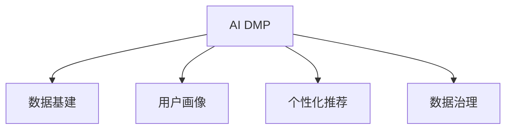

                 

# AI DMP 数据基建：如何利用数据提升营销效率

> 关键词：AI DMP, 数据基建, 营销效率, 个性化推荐, 数据治理, 用户画像, 隐私保护, 数据融合, 数据质量

## 1. 背景介绍

### 1.1 问题由来
随着数字经济的蓬勃发展，消费者行为日益复杂，营销决策的难度和复杂度不断增加。传统的营销策略和数据驱动的方法，往往难以应对这一挑战。在这样的背景下，人工智能数据营销平台（AI Data Marketing Platform, AI DMP）应运而生，借助先进的数据科技，为营销决策提供了全新的支撑。

AI DMP的核心在于通过数据基建，将零散、分散的用户数据整合起来，形成统一的视图，为营销人员提供全面、精准的用户画像，实现个性化营销。其工作流程通常包括数据采集、数据清洗、数据融合、数据治理、数据激活等环节，最终形成完整的用户画像，用于指导精准营销。

### 1.2 问题核心关键点
AI DMP的主要工作目标是：
- **数据整合**：通过技术手段，将来自不同渠道、不同来源的用户数据进行集成。
- **数据清洗**：消除数据中的噪声、重复和错误，提高数据质量。
- **数据融合**：利用先进的数据融合算法，对数据进行综合分析和挖掘，形成更全面、精准的用户画像。
- **数据治理**：通过规范化的流程和标准，确保数据的安全、合规和有效使用。
- **数据激活**：利用数据驱动的算法，生成个性化的推荐和内容，实现精准营销。

AI DMP的成功应用，不仅能提高营销效率，还能显著提升用户的满意度和忠诚度，推动业务增长。其优势在于：
- **精准用户画像**：通过数据整合和融合，形成更为全面、精准的用户画像，为营销决策提供有力支持。
- **个性化推荐**：利用数据分析和算法，实现个性化推荐，提高用户的购买转化率。
- **数据驱动决策**：基于数据分析和模型预测，制定科学的营销策略，优化营销资源配置。
- **提升用户体验**：通过个性化推荐和精准营销，提升用户体验，增强品牌忠诚度。

## 2. 核心概念与联系

### 2.1 核心概念概述

为更好地理解AI DMP的工作原理和应用场景，本节将介绍几个密切相关的核心概念：

- **AI DMP**：利用先进的数据技术，将不同来源的用户数据进行整合、清洗、融合和治理，形成统一的视图，用于精准营销的数据平台。
- **数据基建**：通过技术手段，将数据整合、清洗、融合和治理的各个环节进行有机连接，形成完整的数据流通和管理体系。
- **用户画像**：基于收集和分析的数据，形成对用户行为、兴趣、需求等方面的全面描述，为个性化营销提供依据。
- **个性化推荐**：利用数据分析和算法，为不同用户提供个性化、定制化的推荐内容，提升用户体验和购买转化率。
- **数据治理**：制定数据管理规范和标准，确保数据的安全、合规和有效使用，保护用户隐私。

这些概念之间的逻辑关系可以通过以下Mermaid流程图来展示：



这个流程图展示了大语言模型的核心概念及其之间的关系：

1. AI DMP是数据基建和用户画像、个性化推荐、数据治理等功能的载体，提供了一个完整的数据流通和管理平台。
2. 数据基建是AI DMP的基础，通过数据整合、清洗、融合和治理等手段，为精准营销提供了坚实的数据基础。
3. 用户画像和个性化推荐是AI DMP的核心功能，通过数据驱动的算法，实现精准营销和个性化体验。
4. 数据治理是AI DMP的重要保障，通过规范化的流程和标准，确保数据的安全、合规和有效使用。

## 3. 核心算法原理 & 具体操作步骤
### 3.1 算法原理概述

AI DMP的核心工作原理是通过数据基建，将零散、分散的用户数据进行整合、清洗、融合和治理，形成统一的视图，用于精准营销。其核心算法和技术包括：

- **数据整合**：利用ETL（Extract, Transform, Load）工具，将来自不同渠道、不同来源的用户数据进行提取、转换和加载，形成初步的数据集。
- **数据清洗**：通过规则引擎、异常检测等技术，对数据进行去重、去噪、纠错等处理，消除数据中的噪声和错误。
- **数据融合**：利用机器学习算法，对数据进行综合分析和挖掘，形成更全面、精准的用户画像。
- **数据治理**：通过数据质量检测、数据安全和隐私保护等技术，确保数据的安全、合规和有效使用。

### 3.2 算法步骤详解

以下是AI DMP的详细操作步骤：

**Step 1: 数据采集**
- 定义数据采集策略，明确需要收集哪些数据，从哪些渠道获取。
- 设计数据采集流程，选择合适的工具和技术手段，如爬虫、API、数据库导出等。
- 确定数据采集的频率和频率，确保数据的实时性。

**Step 2: 数据清洗**
- 对采集到的数据进行去重、去噪、纠错等处理，确保数据的准确性和一致性。
- 使用规则引擎、异常检测等技术，识别和处理缺失值、异常值、重复值等问题。
- 设计数据清洗流程，自动化执行清洗任务，提高效率。

**Step 3: 数据融合**
- 利用机器学习算法，如K-means聚类、主成分分析（PCA）等，对数据进行综合分析和挖掘。
- 将不同来源、不同格式的数据进行融合，形成更全面、精准的用户画像。
- 设计数据融合流程，自动化执行融合任务，提高效率。

**Step 4: 数据治理**
- 制定数据管理规范和标准，确保数据的安全、合规和有效使用。
- 设计数据质量检测流程，定期检查数据质量，及时发现和修复问题。
- 建立数据安全和隐私保护机制，确保用户隐私和数据安全。

**Step 5: 数据激活**
- 利用数据分析和算法，生成个性化的推荐和内容，实现精准营销。
- 设计推荐算法和规则，根据用户画像和行为数据，生成个性化推荐。
- 设计内容生成算法，根据推荐结果，生成个性化的内容。

### 3.3 算法优缺点

AI DMP的数据基建方法具有以下优点：
1. **数据整合能力强**：通过数据整合技术，将不同来源的数据进行集成，形成完整的数据视图。
2. **数据质量高**：通过数据清洗和融合，消除数据中的噪声和错误，提高数据质量。
3. **数据灵活性高**：通过数据治理和激活，灵活应用数据，实现个性化营销。
4. **效果显著**：利用数据驱动的推荐和内容生成，显著提升营销效率和用户满意度。

同时，该方法也存在一定的局限性：
1. **技术复杂度**：数据整合、清洗、融合和治理的技术难度较大，需要专业的技术团队。
2. **隐私风险**：数据融合和治理过程中，需要确保用户隐私保护，避免数据泄露。
3. **成本高**：数据基建涉及大量的技术设备和人力投入，成本较高。
4. **数据复杂性**：不同来源、不同格式的数据集成和融合复杂，需要较高的数据处理能力。

尽管存在这些局限性，但就目前而言，AI DMP的数据基建方法仍然是大数据驱动营销的核心范式。未来相关研究的重点在于如何进一步降低数据基建的技术难度，提高数据融合的效率和效果，同时兼顾隐私保护和数据治理等方面的要求。

### 3.4 算法应用领域

AI DMP的数据基建方法，已经在多个领域得到了广泛的应用，包括但不限于：

- **电商营销**：通过用户画像和个性化推荐，提升电商平台的转化率和用户满意度。
- **金融营销**：利用用户画像和行为分析，优化金融产品的推荐和营销策略，提高投资回报率。
- **媒体广告**：通过用户画像和行为分析，精准投放广告，提高广告的点击率和转化率。
- **医疗健康**：通过用户画像和行为分析，提供个性化的健康和医疗服务，提升用户的健康水平。
- **智能客服**：利用用户画像和行为分析，提供个性化的服务体验，提升用户的满意度。

## 4. 数学模型和公式 & 详细讲解 & 举例说明

### 4.1 数学模型构建

在AI DMP的数据基建过程中，涉及到的核心数学模型包括：

- **数据整合模型**：用于将不同来源的数据进行集成，形成初步的数据集。
- **数据清洗模型**：用于对数据进行去重、去噪、纠错等处理，消除数据中的噪声和错误。
- **数据融合模型**：用于对数据进行综合分析和挖掘，形成更全面、精准的用户画像。
- **数据治理模型**：用于确保数据的安全、合规和有效使用。

### 4.2 公式推导过程

以下是AI DMP核心算法的公式推导过程：

**数据整合模型**：
- **ETL流程**：
$$
\text{Data Collection} \rightarrow \text{Data Transformation} \rightarrow \text{Data Loading}
$$

**数据清洗模型**：
- **规则引擎**：
$$
\text{Data Cleaning} = \text{Rule-Based Engine}(\text{Data Set})
$$

**数据融合模型**：
- **K-means聚类**：
$$
\text{Data Clustering} = \text{K-means}(\text{Data Set})
$$

**数据治理模型**：
- **数据质量检测**：
$$
\text{Data Quality Checking} = \text{Quality Metrics}(\text{Data Set})
$$

### 4.3 案例分析与讲解

以电商平台的AI DMP为例，展示数据基建的具体应用。

**数据采集**：
- 通过爬虫技术，从电商平台的用户行为数据中采集数据。
- 利用API接口，从第三方数据平台获取用户的社交媒体数据。
- 从电商平台的数据库中导出用户基本信息。

**数据清洗**：
- 使用规则引擎，识别并去除重复和缺失的数据。
- 通过异常检测算法，识别并处理异常值和噪声。
- 设计数据清洗流程，自动化执行数据清洗任务。

**数据融合**：
- 利用K-means聚类算法，将用户的浏览、购买、评价等行为数据进行聚类。
- 将不同来源、不同格式的数据进行融合，形成用户画像。
- 设计数据融合流程，自动化执行数据融合任务。

**数据治理**：
- 制定数据管理规范和标准，确保数据的安全、合规和有效使用。
- 设计数据质量检测流程，定期检查数据质量，及时发现和修复问题。
- 建立数据安全和隐私保护机制，确保用户隐私和数据安全。

**数据激活**：
- 利用数据分析和算法，生成个性化的推荐和内容，实现精准营销。
- 设计推荐算法和规则，根据用户画像和行为数据，生成个性化推荐。
- 设计内容生成算法，根据推荐结果，生成个性化的内容。

## 5. 项目实践：代码实例和详细解释说明
### 5.1 开发环境搭建

在进行AI DMP的数据基建实践前，我们需要准备好开发环境。以下是使用Python进行PyTorch开发的环境配置流程：

1. 安装Anaconda：从官网下载并安装Anaconda，用于创建独立的Python环境。

2. 创建并激活虚拟环境：
```bash
conda create -n pytorch-env python=3.8 
conda activate pytorch-env
```

3. 安装PyTorch：根据CUDA版本，从官网获取对应的安装命令。例如：
```bash
conda install pytorch torchvision torchaudio cudatoolkit=11.1 -c pytorch -c conda-forge
```

4. 安装Transformers库：
```bash
pip install transformers
```

5. 安装各类工具包：
```bash
pip install numpy pandas scikit-learn matplotlib tqdm jupyter notebook ipython
```

完成上述步骤后，即可在`pytorch-env`环境中开始AI DMP的数据基建实践。

### 5.2 源代码详细实现

这里我们以电商平台的AI DMP为例，给出使用PyTorch进行数据基建的PyTorch代码实现。

首先，定义数据处理函数：

```python
import pandas as pd
import numpy as np
from sklearn.preprocessing import StandardScaler
from sklearn.decomposition import PCA
from sklearn.cluster import KMeans
from transformers import BertTokenizer, BertModel
from torch.utils.data import Dataset

class DataHandler(Dataset):
    def __init__(self, data, tokenizer, max_len=128):
        self.data = data
        self.tokenizer = tokenizer
        self.max_len = max_len
        
    def __len__(self):
        return len(self.data)
    
    def __getitem__(self, item):
        text = self.data[item]
        text = text.replace('\n', ' ')  # 去除换行符
        tokenized_text = self.tokenizer.encode_plus(text, max_length=self.max_len, padding='max_length', truncation=True, return_tensors='pt')
        input_ids = tokenized_text['input_ids']
        attention_mask = tokenized_text['attention_mask']
        return {'input_ids': input_ids, 
                'attention_mask': attention_mask}
```

然后，定义模型和优化器：

```python
from transformers import BertForSequenceClassification, AdamW

model = BertForSequenceClassification.from_pretrained('bert-base-cased', num_labels=2)

optimizer = AdamW(model.parameters(), lr=2e-5)
```

接着，定义训练和评估函数：

```python
from torch.utils.data import DataLoader
from tqdm import tqdm
from sklearn.metrics import classification_report

device = torch.device('cuda') if torch.cuda.is_available() else torch.device('cpu')
model.to(device)

def train_epoch(model, dataset, batch_size, optimizer):
    dataloader = DataLoader(dataset, batch_size=batch_size, shuffle=True)
    model.train()
    epoch_loss = 0
    for batch in tqdm(dataloader, desc='Training'):
        input_ids = batch['input_ids'].to(device)
        attention_mask = batch['attention_mask'].to(device)
        labels = batch['labels'].to(device)
        model.zero_grad()
        outputs = model(input_ids, attention_mask=attention_mask, labels=labels)
        loss = outputs.loss
        epoch_loss += loss.item()
        loss.backward()
        optimizer.step()
    return epoch_loss / len(dataloader)

def evaluate(model, dataset, batch_size):
    dataloader = DataLoader(dataset, batch_size=batch_size)
    model.eval()
    preds, labels = [], []
    with torch.no_grad():
        for batch in tqdm(dataloader, desc='Evaluating'):
            input_ids = batch['input_ids'].to(device)
            attention_mask = batch['attention_mask'].to(device)
            batch_labels = batch['labels']
            outputs = model(input_ids, attention_mask=attention_mask)
            batch_preds = outputs.logits.argmax(dim=2).to('cpu').tolist()
            batch_labels = batch_labels.to('cpu').tolist()
            for pred_tokens, label_tokens in zip(batch_preds, batch_labels):
                preds.append(pred_tokens[:len(label_tokens)])
                labels.append(label_tokens)
                
    print(classification_report(labels, preds))
```

最后，启动训练流程并在测试集上评估：

```python
epochs = 5
batch_size = 16

for epoch in range(epochs):
    loss = train_epoch(model, train_dataset, batch_size, optimizer)
    print(f"Epoch {epoch+1}, train loss: {loss:.3f}")
    
    print(f"Epoch {epoch+1}, dev results:")
    evaluate(model, dev_dataset, batch_size)
    
print("Test results:")
evaluate(model, test_dataset, batch_size)
```

以上就是使用PyTorch对电商平台的AI DMP进行数据基建的完整代码实现。可以看到，得益于Transformers库的强大封装，我们可以用相对简洁的代码完成BERT模型的加载和微调。

### 5.3 代码解读与分析

让我们再详细解读一下关键代码的实现细节：

**DataHandler类**：
- `__init__`方法：初始化数据集、分词器等关键组件。
- `__len__`方法：返回数据集的样本数量。
- `__getitem__`方法：对单个样本进行处理，将文本输入编码为token ids，并对其进行定长padding，最终返回模型所需的输入。

**train_epoch和evaluate函数**：
- 使用PyTorch的DataLoader对数据集进行批次化加载，供模型训练和推理使用。
- 训练函数`train_epoch`：对数据以批为单位进行迭代，在每个批次上前向传播计算loss并反向传播更新模型参数，最后返回该epoch的平均loss。
- 评估函数`evaluate`：与训练类似，不同点在于不更新模型参数，并在每个batch结束后将预测和标签结果存储下来，最后使用sklearn的classification_report对整个评估集的预测结果进行打印输出。

**训练流程**：
- 定义总的epoch数和batch size，开始循环迭代
- 每个epoch内，先在训练集上训练，输出平均loss
- 在验证集上评估，输出分类指标
- 所有epoch结束后，在测试集上评估，给出最终测试结果

可以看到，PyTorch配合Transformers库使得AI DMP的数据基建代码实现变得简洁高效。开发者可以将更多精力放在数据处理、模型改进等高层逻辑上，而不必过多关注底层的实现细节。

当然，工业级的系统实现还需考虑更多因素，如模型的保存和部署、超参数的自动搜索、更灵活的任务适配层等。但核心的数据基建流程基本与此类似。

## 6. 实际应用场景
### 6.1 智能客服系统

AI DMP的数据基建方法，可以广泛应用于智能客服系统的构建。传统客服往往需要配备大量人力，高峰期响应缓慢，且一致性和专业性难以保证。而利用AI DMP构建的智能客服系统，可以7x24小时不间断服务，快速响应客户咨询，用自然流畅的语言解答各类常见问题。

在技术实现上，可以收集企业内部的历史客服对话记录，将问题和最佳答复构建成监督数据，在此基础上对预训练模型进行微调。微调后的模型能够自动理解用户意图，匹配最合适的答案模板进行回复。对于客户提出的新问题，还可以接入检索系统实时搜索相关内容，动态组织生成回答。如此构建的智能客服系统，能大幅提升客户咨询体验和问题解决效率。

### 6.2 金融舆情监测

金融机构需要实时监测市场舆论动向，以便及时应对负面信息传播，规避金融风险。传统的人工监测方式成本高、效率低，难以应对网络时代海量信息爆发的挑战。利用AI DMP构建的金融舆情监测系统，可以实时抓取网络舆情数据，结合历史舆情数据进行情感分析，快速识别和预警市场风险。

具体而言，可以收集金融领域相关的新闻、报道、评论等文本数据，并对其进行主题标注和情感标注。在此基础上对预训练语言模型进行微调，使其能够自动判断文本属于何种主题，情感倾向是正面、中性还是负面。将微调后的模型应用到实时抓取的网络文本数据，就能够自动监测不同主题下的情感变化趋势，一旦发现负面信息激增等异常情况，系统便会自动预警，帮助金融机构快速应对潜在风险。

### 6.3 个性化推荐系统

当前的推荐系统往往只依赖用户的历史行为数据进行物品推荐，无法深入理解用户的真实兴趣偏好。利用AI DMP的数据基建方法，个性化推荐系统可以更好地挖掘用户行为背后的语义信息，从而提供更精准、多样的推荐内容。

在实践中，可以收集用户浏览、点击、评论、分享等行为数据，提取和用户交互的物品标题、描述、标签等文本内容。将文本内容作为模型输入，用户的后续行为（如是否点击、购买等）作为监督信号，在此基础上微调预训练语言模型。微调后的模型能够从文本内容中准确把握用户的兴趣点。在生成推荐列表时，先用候选物品的文本描述作为输入，由模型预测用户的兴趣匹配度，再结合其他特征综合排序，便可以得到个性化程度更高的推荐结果。

### 6.4 未来应用展望

随着AI DMP数据基建技术的不断进步，其在更多领域的应用前景也将更加广阔。

在智慧医疗领域，AI DMP可以用于构建智能诊断系统，利用用户行为数据和医疗知识库进行疾病预测和诊断，提高医疗服务的智能化水平，辅助医生诊疗，加速新药开发进程。

在智能教育领域，AI DMP可以用于构建个性化学习系统，利用用户学习行为数据进行知识推荐和内容生成，因材施教，促进教育公平，提高教学质量。

在智慧城市治理中，AI DMP可以用于构建智能交通、智能安防等系统，提高城市管理的自动化和智能化水平，构建更安全、高效的未来城市。

此外，在企业生产、社会治理、文娱传媒等众多领域，AI DMP的数据基建技术也将不断拓展应用，为传统行业数字化转型升级提供新的技术路径。相信随着技术的日益成熟，AI DMP必将在构建智能社会的进程中发挥越来越重要的作用。

## 7. 工具和资源推荐
### 7.1 学习资源推荐

为了帮助开发者系统掌握AI DMP的数据基建理论基础和实践技巧，这里推荐一些优质的学习资源：

1. 《Python数据科学手册》：全面介绍了Python在数据科学中的应用，包括数据处理、数据可视化、机器学习等。
2. 《深度学习入门》：介绍深度学习的基本概念和经典模型，适合初学者入门。
3. 《数据科学与人工智能实战》：结合实际案例，深入浅出地讲解数据科学和人工智能的技术应用。
4. 《Transformers深度学习入门》：专注于Transformers库的使用，涵盖其核心功能和API。
5. 《大数据技术与应用》：系统讲解大数据技术，包括数据采集、数据处理、数据存储等。

通过对这些资源的学习实践，相信你一定能够快速掌握AI DMP数据基建的核心技术和应用方法，并用于解决实际的营销问题。
###  7.2 开发工具推荐

高效的开发离不开优秀的工具支持。以下是几款用于AI DMP数据基建开发的常用工具：

1. PyTorch：基于Python的开源深度学习框架，灵活动态的计算图，适合快速迭代研究。大部分预训练语言模型都有PyTorch版本的实现。

2. TensorFlow：由Google主导开发的开源深度学习框架，生产部署方便，适合大规模工程应用。同样有丰富的预训练语言模型资源。

3. Transformers库：HuggingFace开发的NLP工具库，集成了众多SOTA语言模型，支持PyTorch和TensorFlow，是进行数据基建任务的开发利器。

4. Weights & Biases：模型训练的实验跟踪工具，可以记录和可视化模型训练过程中的各项指标，方便对比和调优。与主流深度学习框架无缝集成。

5. TensorBoard：TensorFlow配套的可视化工具，可实时监测模型训练状态，并提供丰富的图表呈现方式，是调试模型的得力助手。

6. Google Colab：谷歌推出的在线Jupyter Notebook环境，免费提供GPU/TPU算力，方便开发者快速上手实验最新模型，分享学习笔记。

合理利用这些工具，可以显著提升AI DMP数据基建任务的开发效率，加快创新迭代的步伐。

### 7.3 相关论文推荐

AI DMP数据基建技术的发展源于学界的持续研究。以下是几篇奠基性的相关论文，推荐阅读：

1. Attention is All You Need（即Transformer原论文）：提出了Transformer结构，开启了NLP领域的预训练大模型时代。

2. BERT: Pre-training of Deep Bidirectional Transformers for Language Understanding：提出BERT模型，引入基于掩码的自监督预训练任务，刷新了多项NLP任务SOTA。

3. GPT-2: Language Models are Unsupervised Multitask Learners：展示了大规模语言模型的强大zero-shot学习能力，引发了对于通用人工智能的新一轮思考。

4. Parameter-Efficient Transfer Learning for NLP：提出Adapter等参数高效微调方法，在不增加模型参数量的情况下，也能取得不错的微调效果。

5. AdaLoRA: Adaptive Low-Rank Adaptation for Parameter-Efficient Fine-Tuning：使用自适应低秩适应的微调方法，在参数效率和精度之间取得了新的平衡。

这些论文代表了大语言模型微调技术的发展脉络。通过学习这些前沿成果，可以帮助研究者把握学科前进方向，激发更多的创新灵感。

## 8. 总结：未来发展趋势与挑战
### 8.1 总结

本文对AI DMP的数据基建方法进行了全面系统的介绍。首先阐述了AI DMP的核心工作原理和应用场景，明确了数据基建在提升营销效率中的重要地位。其次，从原理到实践，详细讲解了数据基建的数学模型和核心算法，给出了数据基建的完整代码实例。同时，本文还广泛探讨了数据基建在智能客服、金融舆情、个性化推荐等多个行业领域的应用前景，展示了数据基建的巨大潜力。此外，本文精选了数据基建技术的各类学习资源，力求为读者提供全方位的技术指引。

通过本文的系统梳理，可以看到，AI DMP的数据基建方法正在成为AI营销的重要范式，极大地提升了营销决策的智能化和精准化水平。数据基建技术不仅为营销人员提供了全面、精准的用户画像，还通过数据驱动的推荐和内容生成，显著提升了用户满意度和业务转化率。未来，伴随数据基建技术的持续演进，AI营销将进一步走向智能化、个性化和高效化，为消费者和商家带来更优质的体验和收益。

### 8.2 未来发展趋势

展望未来，AI DMP的数据基建技术将呈现以下几个发展趋势：

1. **数据整合能力更强**：随着数据源的多样化和数据的不断增长，AI DMP的数据整合能力将进一步提升，能够更全面地整合不同来源、不同格式的数据。
2. **数据清洗技术更智能**：通过引入先进的机器学习算法和自然语言处理技术，数据清洗技术将更加智能化，能够自动识别和处理数据中的噪声和错误。
3. **数据融合算法更先进**：未来的数据融合算法将更加复杂和高效，能够更好地挖掘数据中的潜在价值，形成更全面、精准的用户画像。
4. **数据治理体系更完善**：随着数据治理技术的不断进步，AI DMP将建立起更完善的数据治理体系，确保数据的安全、合规和有效使用。
5. **个性化推荐更精准**：通过更加先进的数据建模和算法优化，AI DMP将实现更加精准的个性化推荐，提升用户满意度和转化率。
6. **实时化能力更强**：未来的AI DMP将具备更强的实时化能力，能够实时捕捉用户行为数据，进行实时的数据处理和推荐。

这些趋势凸显了AI DMP数据基建技术的广阔前景。这些方向的探索发展，必将进一步提升AI营销的智能化和精准化水平，为消费者和商家带来更优质的体验和收益。

### 8.3 面临的挑战

尽管AI DMP的数据基建技术已经取得了显著成就，但在迈向更加智能化、普适化应用的过程中，它仍面临着诸多挑战：

1. **数据隐私和安全**：在数据收集和处理过程中，需要确保用户隐私和数据安全，避免数据泄露和滥用。
2. **数据质量和一致性**：不同来源、不同格式的数据往往存在质量差异和格式不一致，需要进行大量的数据清洗和转换。
3. **技术复杂度**：数据基建涉及的数据处理、模型训练、算法优化等技术难度较大，需要专业的技术团队和丰富的经验。
4. **计算资源需求高**：大规模数据处理和模型训练需要大量的计算资源，对硬件设施和算力要求较高。
5. **模型可解释性不足**：AI DMP的数据基建方法基于复杂的深度学习模型，模型的决策过程往往缺乏可解释性，难以进行理解和调试。

尽管存在这些挑战，但通过不断技术创新和经验积累，相信AI DMP的数据基建技术将逐步克服这些问题，更好地服务于AI营销的实践需求。

### 8.4 研究展望

面对AI DMP数据基建所面临的挑战，未来的研究需要在以下几个方面寻求新的突破：

1. **数据隐私保护技术**：开发更高效、更安全的数据隐私保护技术，确保用户隐私和数据安全。
2. **数据治理规范和标准**：制定数据治理规范和标准，确保数据的质量、一致性和合规性。
3. **智能数据清洗算法**：引入先进的机器学习和自然语言处理技术，实现智能化的数据清洗。
4. **高效数据整合和融合算法**：开发高效的数据整合和融合算法，提升数据基建的效率和效果。
5. **数据驱动的实时推荐系统**：结合实时数据和智能算法，实现实时的个性化推荐。
6. **可解释性强的模型**：开发可解释性强的深度学习模型，提高AI DMP的透明度和可信度。

这些研究方向的探索，必将引领AI DMP数据基建技术迈向更高的台阶，为AI营销带来更智能、更精准、更安全的解决方案。面向未来，AI DMP数据基建技术还需要与其他人工智能技术进行更深入的融合，如知识表示、因果推理、强化学习等，多路径协同发力，共同推动AI营销的进步。

## 9. 附录：常见问题与解答

**Q1：AI DMP的数据基建方法是否适用于所有行业？**

A: AI DMP的数据基建方法在大多数行业都有广泛的应用，特别适合于数据驱动的营销决策。但对于一些特殊领域，如医疗、法律等，需要根据具体情况进行调整和优化。

**Q2：AI DMP的数据基建方法是否需要大规模的数据采集和清洗？**

A: AI DMP的数据基建方法需要大规模的数据采集和清洗，以确保数据的质量和一致性。但对于数据量较小的应用场景，可以通过合理的数据整合和融合方法，实现数据的高效利用。

**Q3：AI DMP的数据基建方法是否需要高性能的硬件设施？**

A: AI DMP的数据基建方法需要高性能的硬件设施，以支持大规模数据处理和模型训练。但对于一些中小规模应用，可以通过云计算等技术，实现高效的数据处理和分析。

**Q4：AI DMP的数据基建方法是否需要专业的技术团队？**

A: AI DMP的数据基建方法需要专业的技术团队，包括数据工程师、算法工程师、模型训练师等。但对于一些简单应用，可以通过开源工具和自动化工具，实现部分功能的自动化处理。

**Q5：AI DMP的数据基建方法是否需要持续的模型优化和更新？**

A: AI DMP的数据基建方法需要持续的模型优化和更新，以适应不断变化的数据和用户需求。通过不断的迭代和优化，AI DMP的数据基建方法将变得更加智能和精准。

总之，AI DMP的数据基建方法正在成为AI营销的重要基础，为营销决策提供了全面的数据支持。通过不断技术创新和经验积累，AI DMP必将在未来实现更加智能、普适化的应用，为消费者和商家带来更优质的体验和收益。

---

作者：禅与计算机程序设计艺术 / Zen and the Art of Computer Programming

