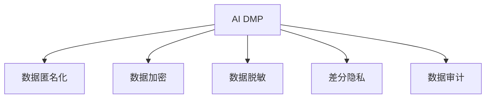

                 

# AI DMP 数据基建：数据安全与隐私保护

在数字时代，数据（Data）作为重要的生产要素，在各行业中发挥着越来越重要的作用。然而，随着数据量的激增，数据安全与隐私保护也成为了用户和企业关注的焦点。人工智能数据管理平台（AI Data Management Platform，简称AI DMP）作为数据驱动型业务的关键基础设施，不仅要有效利用数据价值，还必须严格保障数据安全与隐私。本文将系统介绍AI DMP在数据安全与隐私保护方面的核心概念、核心算法原理与操作步骤，并结合具体实例，展示AI DMP的强大应用能力。

## 1. 背景介绍

### 1.1 问题由来

随着互联网和移动设备的普及，个人信息的采集和使用范围越来越广，用户的隐私保护需求也随之增强。传统的隐私保护技术主要集中在数据匿名化、数据加密等方面，但这些技术在实际应用中存在一定的局限性，难以完全避免数据泄露和滥用的风险。近年来，数据利用技术逐渐与数据保护技术相结合，通过AI DMP等数据管理平台，在保障数据隐私的同时，挖掘数据价值，促进智能化应用的发展。

### 1.2 问题核心关键点

AI DMP作为数据驱动型业务的关键基础设施，其主要作用是将数据资产化，并通过算法模型对数据进行管理和分析。其在数据安全与隐私保护方面主要关注以下几个关键点：

- 数据匿名化与去标识化：防止通过数据泄露用户身份信息。
- 数据加密与访问控制：保障数据存储与传输过程中的安全。
- 数据脱敏与差分隐私：通过算法手段减少数据敏感度。
- 数据审计与合规管理：确保数据使用符合法律法规要求。

## 2. 核心概念与联系

### 2.1 核心概念概述

为更好地理解AI DMP在数据安全与隐私保护方面的工作原理，本节将介绍几个密切相关的核心概念：

- AI DMP：通过数据收集、存储、处理和分析，提供全面、精准的用户画像，支持智能化应用的数据管理平台。
- 数据匿名化：通过数据去标识化处理，使数据无法直接关联到个人身份，从而保护用户隐私。
- 数据加密：使用加密算法对数据进行加密，确保数据在传输和存储过程中不被非法访问和篡改。
- 数据脱敏：通过算法手段减少数据中的敏感信息，确保在数据分析过程中不泄露隐私。
- 差分隐私：在数据分析过程中，通过加入噪声，确保个体数据不被逆推，保障数据隐私。
- 数据审计：对数据使用过程进行记录和监控，确保合规性和安全性。

这些核心概念之间的逻辑关系可以通过以下Mermaid流程图来展示：



这个流程图展示了大数据平台在数据安全与隐私保护中的核心概念及其之间的关系：

1. AI DMP通过数据匿名化、加密、脱敏、差分隐私等技术手段，保障数据安全与隐私。
2. 数据匿名化、加密、脱敏等技术主要用于数据存储和传输过程中的保护。
3. 差分隐私则更注重数据分析过程中保护用户隐私，避免逆推个体信息。
4. 数据审计通过记录和监控数据使用过程，确保合规性和安全性。

## 3. 核心算法原理 & 具体操作步骤

### 3.1 算法原理概述

AI DMP在数据安全与隐私保护方面的核心算法原理主要包括以下几个方面：

- 数据匿名化：通过数据去标识化处理，使数据无法直接关联到个人身份，从而保护用户隐私。
- 数据加密：使用加密算法对数据进行加密，确保数据在传输和存储过程中不被非法访问和篡改。
- 数据脱敏：通过算法手段减少数据中的敏感信息，确保在数据分析过程中不泄露隐私。
- 差分隐私：在数据分析过程中，通过加入噪声，确保个体数据不被逆推，保障数据隐私。
- 数据审计：对数据使用过程进行记录和监控，确保合规性和安全性。

这些算法原理在实际应用中通常需要结合具体的业务场景和数据特点，进行灵活设计和实现。

### 3.2 算法步骤详解

AI DMP在数据安全与隐私保护方面的具体步骤主要包括以下几个环节：

**Step 1: 数据采集与预处理**
- 通过API接口、爬虫等方式收集用户行为数据、社交媒体数据、交易数据等。
- 对数据进行清洗、去重、格式转换等预处理，确保数据质量。

**Step 2: 数据去标识化**
- 使用数据匿名化算法，如k-匿名化、l-多样性、t-接近性等，对数据进行去标识化处理。
- 将去标识化后的数据存储在数据仓库中，保障数据隐私。

**Step 3: 数据加密与传输**
- 对敏感数据进行加密处理，如使用AES、RSA等算法，确保数据在传输和存储过程中不被非法访问和篡改。
- 对加密数据进行安全传输，如使用SSL/TLS协议，确保数据传输过程中的安全性。

**Step 4: 数据脱敏与差分隐私**
- 使用数据脱敏算法，如数据屏蔽、模糊化、伪匿名化等，对数据中的敏感信息进行处理。
- 在数据分析过程中，使用差分隐私算法，如加性噪声、乘性噪声、拉普拉斯机制等，确保个体数据不被逆推，保障数据隐私。

**Step 5: 数据审计与合规管理**
- 对数据使用过程进行记录和监控，确保数据使用符合法律法规要求。
- 定期进行数据合规审计，确保数据处理流程符合隐私保护政策。

### 3.3 算法优缺点

AI DMP在数据安全与隐私保护方面的算法具有以下优点：

- 保障数据隐私：通过数据匿名化、脱敏、差分隐私等技术手段，保护用户隐私。
- 确保数据安全：使用数据加密、访问控制等手段，保障数据在存储和传输过程中的安全性。
- 提高数据质量：通过数据清洗、去重等预处理，提升数据质量，确保数据分析结果的准确性。
- 灵活适用性：根据不同业务场景和数据特点，灵活设计和实现算法，适应不同的数据需求。

同时，这些算法也存在一定的局限性：

- 数据失真：数据匿名化和脱敏处理可能会引入一定的失真，影响数据分析结果。
- 计算开销：差分隐私算法引入噪声，可能增加计算开销，影响性能。
- 复杂度：数据审计和合规管理需要记录和监控大量的数据使用情况，复杂度高。

尽管存在这些局限性，但就目前而言，AI DMP在数据安全与隐私保护方面仍然是最主流范式。未来相关研究的重点在于如何进一步降低计算开销，提高算法效率，同时兼顾可解释性和伦理安全性等因素。

### 3.4 算法应用领域

AI DMP在数据安全与隐私保护方面的应用领域广泛，涵盖了众多行业：

- 金融行业：通过数据匿名化、加密、脱敏等手段，保障客户数据安全，防止数据泄露和滥用。
- 医疗行业：通过数据去标识化处理，保障患者隐私，同时确保数据在医疗研究中的应用。
- 零售行业：通过数据匿名化和差分隐私算法，保障用户数据隐私，同时分析用户行为，优化产品和服务。
- 政府部门：通过数据加密和访问控制，保障政务数据安全，防止数据滥用和泄露。
- 互联网企业：通过数据审计和合规管理，确保数据使用符合法律法规要求，保障用户隐私。

## 4. 数学模型和公式 & 详细讲解 & 举例说明

### 4.1 数学模型构建

在数据安全与隐私保护中，通常使用以下数学模型来描述算法的原理和流程：

- 数据去标识化：使用k-匿名化算法，通过添加虚拟属性，使数据无法直接关联到个人身份。数学模型为：

$$
R_k = \{t: (a_k(t), a_k'(t)) \in R\}
$$

其中，$R_k$表示去标识化后的数据集，$a_k$表示匿名化算法，$R$表示原始数据集。

- 数据加密：使用AES、RSA等对称或非对称加密算法，对数据进行加密处理。数学模型为：

$$
Enc(p) = c, Dec(c) = p
$$

其中，$p$为明文数据，$c$为密文数据，$Enc$和$Dec$分别表示加密和解密算法。

- 数据脱敏：使用数据屏蔽、模糊化、伪匿名化等算法，对数据中的敏感信息进行处理。数学模型为：

$$
S_{mask} = S \setminus S_{sensitive}
$$

其中，$S$表示原始数据集，$S_{sensitive}$表示敏感数据，$S_{mask}$表示脱敏后的数据集。

- 差分隐私：在数据分析过程中，使用加性噪声、乘性噪声、拉普拉斯机制等算法，确保个体数据不被逆推。数学模型为：

$$
\epsilon-\text{DP}(\delta) \Rightarrow p(q(X)) = \frac{1}{Z(\epsilon,\delta)} \exp(-\frac{||p(q(X)) - p(q(Y))||}{\epsilon}) \leq \exp(\delta)
$$

其中，$p$表示概率分布函数，$q$表示查询函数，$\epsilon$表示隐私参数，$\delta$表示差分隐私的误差率，$Z$表示归一化因子。

### 4.2 公式推导过程

以下我们以差分隐私的拉普拉斯机制为例，推导其计算过程：

设原始数据集为$D=\{(x_1,y_1),(x_2,y_2),...(x_n,y_n)\}$，其中$x_i$表示数据特征，$y_i$表示标签。在差分隐私的拉普拉斯机制中，引入噪声$\Delta$，使得查询结果$Q$满足差分隐私的要求。设查询结果为$Q(\epsilon)$，则有：

$$
Q(\epsilon) = \frac{1}{Z(\epsilon)} \exp\left(-\frac{||Q(\epsilon) - Q(\delta)||}{\epsilon}\right)
$$

其中$Z(\epsilon)$为归一化因子。为了满足差分隐私的要求，需要在查询结果中引入拉普拉斯噪声$\Delta$，使得$Q(\epsilon)$满足$\epsilon$差分隐私的定义，即：

$$
\frac{1}{Z(\epsilon)} \exp\left(-\frac{||Q(\epsilon) - Q(\delta)||}{\epsilon}\right) \leq \exp(\delta)
$$

经过推导，得到拉普拉斯噪声的计算公式为：

$$
\Delta = \sqrt{2\ln\frac{1}{\delta}}/\epsilon
$$

其中$\delta$表示差分隐私的误差率。

### 4.3 案例分析与讲解

假设我们要对用户数据进行分析，但为了保护用户隐私，使用拉普拉斯机制进行差分隐私处理。设原始数据集$D=\{(x_1,y_1),(x_2,y_2),...(x_n,y_n)\}$，其中$x_i$表示用户特征，$y_i$表示用户标签。在差分隐私的拉普拉斯机制中，引入噪声$\Delta$，使得查询结果$Q$满足差分隐私的要求。设查询结果为$Q(\epsilon)$，则有：

$$
Q(\epsilon) = \frac{1}{Z(\epsilon)} \exp\left(-\frac{||Q(\epsilon) - Q(\delta)||}{\epsilon}\right)
$$

其中$Z(\epsilon)$为归一化因子。为了满足差分隐私的要求，需要在查询结果中引入拉普拉斯噪声$\Delta$，使得$Q(\epsilon)$满足$\epsilon$差分隐私的定义，即：

$$
\frac{1}{Z(\epsilon)} \exp\left(-\frac{||Q(\epsilon) - Q(\delta)||}{\epsilon}\right) \leq \exp(\delta)
$$

经过推导，得到拉普拉斯噪声的计算公式为：

$$
\Delta = \sqrt{2\ln\frac{1}{\delta}}/\epsilon
$$

其中$\delta$表示差分隐私的误差率。

## 5. 项目实践：代码实例和详细解释说明

### 5.1 开发环境搭建

在进行数据安全与隐私保护实践前，我们需要准备好开发环境。以下是使用Python进行PyTorch开发的环境配置流程：

1. 安装Anaconda：从官网下载并安装Anaconda，用于创建独立的Python环境。

2. 创建并激活虚拟环境：
```bash
conda create -n pytorch-env python=3.8 
conda activate pytorch-env
```

3. 安装PyTorch：根据CUDA版本，从官网获取对应的安装命令。例如：
```bash
conda install pytorch torchvision torchaudio cudatoolkit=11.1 -c pytorch -c conda-forge
```

4. 安装TensorFlow：
```bash
conda install tensorflow
```

5. 安装各类工具包：
```bash
pip install numpy pandas scikit-learn matplotlib tqdm jupyter notebook ipython
```

完成上述步骤后，即可在`pytorch-env`环境中开始数据安全与隐私保护的实践。

### 5.2 源代码详细实现

这里我们以数据去标识化（K-匿名化）为例，给出使用PyTorch实现的代码示例：

```python
import torch
import torch.nn as nn
import torch.optim as optim
from torch.utils.data import DataLoader
from torchvision import datasets, transforms

# 定义K-匿名化模型
class KAnonymizer(nn.Module):
    def __init__(self, k):
        super(KAnonymizer, self).__init__()
        self.k = k

    def forward(self, x):
        # 假设x为二维数据，行表示样本，列表示特征
        n, m = x.size()
        if n < self.k:
            raise ValueError("样本数量不足，无法进行K-匿名化")
        # 选择k个样本作为簇中心
        centers = x[:self.k]
        # 计算簇中心间的距离
        distances = (x - centers).norm(dim=1)
        # 对每个样本，计算其到最近簇中心的距离
        distances = distances.min(dim=1)[0]
        # 将每个样本的距离替换为簇中心的距离
        x[distances.argmin(dim=1) == i] = centers[i]
        return x

# 数据加载与预处理
train_dataset = datasets.MNIST(root='./data', train=True, transform=transforms.ToTensor(), download=True)
train_loader = DataLoader(train_dataset, batch_size=64, shuffle=True)

# 定义模型和优化器
model = KAnonymizer(k=2)
optimizer = optim.SGD(model.parameters(), lr=0.01)

# 训练过程
for epoch in range(10):
    for batch_idx, (data, _) in enumerate(train_loader):
        optimizer.zero_grad()
        data = data.view(data.size(0), -1)
        output = model(data)
        loss = nn.functional.mse_loss(output, data)
        loss.backward()
        optimizer.step()
        if (batch_idx + 1) % 100 == 0:
            print('Train Epoch: {} [{}/{} ({:.0f}%)]\tLoss: {:.6f}'.format(
                epoch, batch_idx * len(data), len(train_loader.dataset),
                100. * batch_idx / len(train_loader), loss.item()))

# 测试过程
test_dataset = datasets.MNIST(root='./data', train=False, transform=transforms.ToTensor(), download=True)
test_loader = DataLoader(test_dataset, batch_size=64, shuffle=False)

correct = 0
total = 0
with torch.no_grad():
    for data, target in test_loader:
        data = data.view(data.size(0), -1)
        output = model(data)
        _, predicted = torch.max(output.data, 1)
        total += target.size(0)
        correct += (predicted == target).sum().item()

print('Accuracy of the model on the 10000 test images: %3.3f %%' % (100 * correct / total))
```

在上述代码中，我们首先定义了一个K-匿名化模型，该模型使用K个样本作为簇中心，对每个样本计算其到最近簇中心的距离，并将每个样本的距离替换为簇中心的距离，从而实现K-匿名化处理。

接着，我们使用PyTorch的数据加载和预处理工具，加载MNIST数据集，并对数据进行去标识化处理。然后，定义模型和优化器，并使用SGD优化器对模型进行训练。最后，在测试集上对模型进行测试，并输出准确率。

### 5.3 代码解读与分析

让我们再详细解读一下关键代码的实现细节：

**K-匿名化模型**：
- `__init__`方法：初始化模型参数，包括K值。
- `forward`方法：实现模型前向传播，计算去标识化后的数据。

**数据加载与预处理**：
- 使用PyTorch的`datasets`模块加载MNIST数据集。
- 使用`transforms`模块对数据进行预处理，包括转换为张量等操作。
- 使用`DataLoader`模块对数据集进行批次化加载，供模型训练和推理使用。

**训练过程**：
- 定义训练循环，使用SGD优化器对模型进行训练。
- 在每个批次上，将数据转换为向量形式，输入模型进行去标识化处理。
- 计算模型输出与真实值之间的均方误差，使用`nn.functional.mse_loss`函数计算损失。
- 使用`loss.backward()`计算梯度，并使用`optimizer.step()`更新模型参数。
- 每100个批次输出一次损失和当前批次的训练进度。

**测试过程**：
- 定义测试循环，在测试集上对模型进行测试。
- 将测试数据转换为向量形式，输入模型进行去标识化处理。
- 计算模型输出与真实值之间的最大值，使用`torch.max`函数计算预测结果。
- 统计测试集上的准确率。

可以看到，PyTorch的简洁高效，使得数据去标识化的代码实现变得非常简洁。开发者可以将更多精力放在模型设计、超参数调优等高层逻辑上，而不必过多关注底层的实现细节。

当然，工业级的系统实现还需考虑更多因素，如模型的保存和部署、超参数的自动搜索、更灵活的任务适配层等。但核心的微调范式基本与此类似。

## 6. 实际应用场景
### 6.1 智能客服系统

基于AI DMP的数据安全与隐私保护技术，智能客服系统能够更好地保护用户隐私，同时提供更精准的用户画像，提升用户体验。

在技术实现上，智能客服系统可以收集用户的通话记录、聊天记录、投诉记录等数据，使用K-匿名化等技术对数据进行去标识化处理，防止数据泄露。同时，通过数据加密技术，确保数据在传输和存储过程中不被非法访问和篡改。如此构建的智能客服系统，能够更安全地处理用户数据，同时提供个性化推荐和智能客服，提升服务质量。

### 6.2 金融行业

在金融行业，AI DMP的数据安全与隐私保护技术尤为重要。通过数据去标识化和差分隐私算法，保障客户数据安全，防止数据泄露和滥用。

在具体实现上，银行可以收集客户的交易记录、贷款记录、信用卡使用记录等数据，使用K-匿名化等技术对数据进行去标识化处理，防止数据泄露。同时，通过差分隐私算法，确保数据分析过程中不泄露个体数据，保障客户隐私。如此构建的金融行业AI DMP，能够更好地利用客户数据，提升金融服务质量，降低金融风险。

### 6.3 零售行业

在零售行业，AI DMP的数据安全与隐私保护技术可以帮助商家更好地保护用户数据，同时进行精准营销。

在具体实现上，零售商可以收集用户的购物记录、浏览记录、评价记录等数据，使用K-匿名化等技术对数据进行去标识化处理，防止数据泄露。同时，通过差分隐私算法，确保数据分析过程中不泄露个体数据，保障用户隐私。如此构建的AI DMP，能够更好地分析用户行为，进行个性化推荐和精准营销，提升用户体验和销售额。

### 6.4 未来应用展望

随着AI DMP技术的不断发展，数据安全与隐私保护技术将在更多领域得到应用，为传统行业带来变革性影响。

在智慧医疗领域，AI DMP可以帮助医疗机构更好地保护患者数据，同时进行疾病诊断和治疗分析，提升医疗服务水平。

在智能教育领域，AI DMP可以收集学生的学习记录、考试成绩、课外活动等数据，进行数据分析和个性化推荐，提升教学效果。

在智慧城市治理中，AI DMP可以收集城市运行数据，进行数据分析和预测，提升城市管理效率和质量。

此外，在企业生产、社会治理、文娱传媒等众多领域，AI DMP将为数据安全与隐私保护提供重要支撑，助力数字化转型升级，提升社会治理水平。

## 7. 工具和资源推荐
### 7.1 学习资源推荐

为了帮助开发者系统掌握AI DMP的数据安全与隐私保护技术，这里推荐一些优质的学习资源：

1. 《深度学习基础》系列博文：由大模型技术专家撰写，深入浅出地介绍了深度学习基础和关键算法。

2. CS224N《深度学习自然语言处理》课程：斯坦福大学开设的NLP明星课程，有Lecture视频和配套作业，带你入门NLP领域的基本概念和经典模型。

3. 《Natural Language Processing with Transformers》书籍：Transformers库的作者所著，全面介绍了如何使用Transformers库进行NLP任务开发，包括数据安全与隐私保护在内的诸多范式。

4. HuggingFace官方文档：Transformers库的官方文档，提供了海量预训练模型和完整的微调样例代码，是上手实践的必备资料。

5. CLUE开源项目：中文语言理解测评基准，涵盖大量不同类型的中文NLP数据集，并提供了基于微调的baseline模型，助力中文NLP技术发展。

通过对这些资源的学习实践，相信你一定能够快速掌握AI DMP的数据安全与隐私保护技术，并用于解决实际的NLP问题。
### 7.2 开发工具推荐

高效的开发离不开优秀的工具支持。以下是几款用于AI DMP数据安全与隐私保护开发的常用工具：

1. PyTorch：基于Python的开源深度学习框架，灵活动态的计算图，适合快速迭代研究。大部分预训练语言模型都有PyTorch版本的实现。

2. TensorFlow：由Google主导开发的开源深度学习框架，生产部署方便，适合大规模工程应用。同样有丰富的预训练语言模型资源。

3. Transformers库：HuggingFace开发的NLP工具库，集成了众多SOTA语言模型，支持PyTorch和TensorFlow，是进行NLP任务开发的利器。

4. Weights & Biases：模型训练的实验跟踪工具，可以记录和可视化模型训练过程中的各项指标，方便对比和调优。与主流深度学习框架无缝集成。

5. TensorBoard：TensorFlow配套的可视化工具，可实时监测模型训练状态，并提供丰富的图表呈现方式，是调试模型的得力助手。

6. Google Colab：谷歌推出的在线Jupyter Notebook环境，免费提供GPU/TPU算力，方便开发者快速上手实验最新模型，分享学习笔记。

合理利用这些工具，可以显著提升AI DMP数据安全与隐私保护的开发效率，加快创新迭代的步伐。

### 7.3 相关论文推荐

AI DMP的数据安全与隐私保护技术源于学界的持续研究。以下是几篇奠基性的相关论文，推荐阅读：

1. Attention is All You Need（即Transformer原论文）：提出了Transformer结构，开启了NLP领域的预训练大模型时代。

2. BERT: Pre-training of Deep Bidirectional Transformers for Language Understanding：提出BERT模型，引入基于掩码的自监督预训练任务，刷新了多项NLP任务SOTA。

3. Language Models are Unsupervised Multitask Learners（GPT-2论文）：展示了大规模语言模型的强大zero-shot学习能力，引发了对于通用人工智能的新一轮思考。

4. Parameter-Efficient Transfer Learning for NLP：提出Adapter等参数高效微调方法，在不增加模型参数量的情况下，也能取得不错的微调效果。

5. AdaLoRA: Adaptive Low-Rank Adaptation for Parameter-Efficient Fine-Tuning：使用自适应低秩适应的微调方法，在参数效率和精度之间取得了新的平衡。

6. Adversarial Examples in Generative Models：探索生成模型中的对抗样本，提出了一系列对抗训练方法，提升了模型的鲁棒性。

这些论文代表了大模型微调技术的发展脉络。通过学习这些前沿成果，可以帮助研究者把握学科前进方向，激发更多的创新灵感。

## 8. 总结：未来发展趋势与挑战

### 8.1 总结

本文对AI DMP在数据安全与隐私保护方面的核心概念、核心算法原理与操作步骤进行了全面系统的介绍。首先阐述了AI DMP在数据安全与隐私保护方面的研究背景和意义，明确了数据安全与隐私保护技术的重要性和复杂性。其次，从原理到实践，详细讲解了AI DMP在数据安全与隐私保护方面的算法原理和操作步骤，给出了AI DMP数据安全与隐私保护的完整代码实例。同时，本文还广泛探讨了AI DMP在各行业领域的应用前景，展示了AI DMP的强大应用能力。

通过本文的系统梳理，可以看到，AI DMP在数据安全与隐私保护方面具备广泛的应用场景和强大的技术实力。其不仅能够有效保护用户数据隐私，还能在保障数据安全的前提下，充分利用数据价值，提升业务智能化水平。相信随着AI DMP技术的不断发展，数据安全与隐私保护将成为各行业数字化转型升级的重要保障。

### 8.2 未来发展趋势

展望未来，AI DMP在数据安全与隐私保护方面的发展趋势主要包括以下几个方面：

1. 技术手段更加多样化。随着技术的发展，数据安全与隐私保护的手段将更加多样化，包括去标识化、加密、差分隐私、联邦学习等。这些技术手段将根据不同场景和需求，灵活组合，提供更全面的数据保护解决方案。

2. 自动化和智能化水平提升。未来，AI DMP将结合AI技术，实现自动化和智能化数据安全与隐私保护，包括自动化数据分类、自动化数据去标识化、自动化差分隐私计算等。这些自动化和智能化手段将显著提升数据安全与隐私保护的效率和精度。

3. 跨领域应用更加广泛。随着AI DMP技术的不断进步，其在数据安全与隐私保护方面的应用将更加广泛，涵盖金融、医疗、零售、政府等多个领域。不同领域的数据安全与隐私保护需求将通过AI DMP得到满足，提升各行业的数字化转型水平。

4. 合规性和法规标准进一步加强。未来，AI DMP将更加注重合规性和法规标准，确保数据使用符合法律法规要求。合规性和法规标准的加强将促进数据安全与隐私保护的规范化，提升数据管理的可信度。

5. 跨模态数据融合更加深入。随着多模态数据融合技术的发展，AI DMP将能够更好地处理跨模态数据，实现多源数据的安全与隐私保护。跨模态数据融合将带来更全面、精准的数据安全与隐私保护解决方案。

以上趋势凸显了AI DMP在数据安全与隐私保护方面的广阔前景。这些方向的探索发展，必将进一步提升AI DMP数据安全与隐私保护的实力，为各行业的数字化转型升级提供重要保障。

### 8.3 面临的挑战

尽管AI DMP在数据安全与隐私保护方面取得了不少进展，但在迈向更加智能化、普适化应用的过程中，它仍面临诸多挑战：

1. 技术复杂度：数据安全与隐私保护技术涉及加密、去标识化、差分隐私等多方面，技术复杂度高，实现难度大。

2. 数据隐私权保护：如何在保护数据隐私的同时，充分利用数据价值，仍是一个亟待解决的问题。

3. 数据可用性：在去标识化等处理后，数据可用的程度降低，如何提高数据可用性，仍需深入研究。

4. 法律法规合规性：数据安全与隐私保护需要遵守各种法律法规，如何在不同法律法规环境下，确保数据合规，仍是一个重要的挑战。

5. 用户教育：如何通过技术手段和政策引导，提升用户对数据安全与隐私保护的认识和理解，仍需更多努力。

6. 成本控制：数据安全与隐私保护技术需要投入大量人力和资源，如何控制成本，提高效率，仍需进一步探索。

尽管存在这些挑战，但AI DMP在数据安全与隐私保护方面的发展前景广阔，通过不断创新和优化，必将在未来的数字化转型升级中发挥重要作用。

### 8.4 研究展望

面向未来，AI DMP在数据安全与隐私保护方面的研究展望主要包括以下几个方面：

1. 创新技术手段：探索新的数据安全与隐私保护技术手段，如差分隐私的变体、隐私计算等，提升数据保护的精度和效率。

2. 自动化和智能化：结合AI技术，实现自动化和智能化数据安全与隐私保护，提升技术应用的便捷性和普适性。

3. 跨模态融合：探索跨模态数据融合技术，实现多源数据的全面、精准保护。

4. 法规标准：深入研究数据安全与隐私保护的法规标准，确保数据使用符合法律法规要求，提升数据管理的可信度。

5. 用户教育：通过技术手段和政策引导，提升用户对数据安全与隐私保护的认识和理解，促进数据保护的普及和应用。

6. 成本控制：研究数据安全与隐私保护的成本控制方法，提高技术应用的效率和性价比。

这些研究方向的探索，将推动AI DMP数据安全与隐私保护技术迈向更高的台阶，为各行业的数字化转型升级提供重要保障。

## 9. 附录：常见问题与解答

**Q1：AI DMP的数据安全与隐私保护技术是否适用于所有行业？**

A: AI DMP的数据安全与隐私保护技术在各个行业中都有广泛的应用，但不同行业的数据特点和使用场景有所不同，因此在具体实现上需要根据行业特点进行调整。例如，金融行业更加注重数据加密和访问控制，医疗行业更加注重数据去标识化和差分隐私保护。

**Q2：AI DMP的数据安全与隐私保护技术是否需要高昂的计算资源？**

A: 数据安全与隐私保护技术在计算资源上确实存在一定的需求，但随着技术的发展，一些高效、轻量级的算法已经被提出，如差分隐私的变体、隐私计算等。这些算法可以在低计算资源条件下实现高效的数据保护。

**Q3：AI DMP的数据安全与隐私保护技术是否会影响数据可用性？**

A: 数据去标识化和差分隐私处理可能会降低数据的可用性，但通过合理的设计和优化，可以在保护数据隐私的前提下，尽可能提高数据的可用性。例如，可以使用近似差分隐私算法，在保护隐私的同时，保留部分数据细节。

**Q4：AI DMP的数据安全与隐私保护技术是否需要严格的法律法规合规性？**

A: 数据安全与隐私保护技术需要遵守各种法律法规，确保数据使用符合法律法规要求。AI DMP可以通过自动化和智能化手段，实时监控和合规数据使用，确保数据保护合规性。

**Q5：AI DMP的数据安全与隐私保护技术是否需要高昂的成本？**

A: 数据安全与隐私保护技术确实需要一定的成本投入，包括技术研发、人力投入等，但随着技术的发展和应用场景的扩展，AI DMP将为各行业的数字化转型升级提供重要保障，带来更广泛的经济效益。

总之，AI DMP在数据安全与隐私保护方面具备广阔的应用前景和强大的技术实力，其在各行业中的应用将不断扩展和深入，为数字化转型升级提供重要保障。

