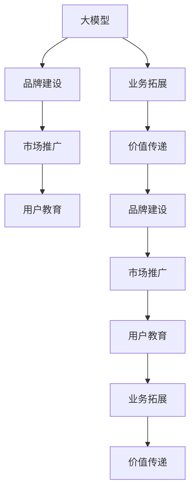

                 

# AI 大模型创业：如何利用品牌优势？

> 关键词：品牌建设, 大模型, 创业策略, 市场竞争, 产品差异化, 用户教育, 业务拓展, 价值传递

## 1. 背景介绍

### 1.1 问题由来

在当前AI热潮中，大模型如OpenAI的GPT系列、Google的BERT等成为了市场竞争的焦点。这些大模型不仅具备强大的语言处理能力，而且拥有广泛的应用前景，为创业公司提供了巨大的商业机会。然而，由于大模型本身具备极高的技术门槛和资源需求，创业公司在品牌建设、市场推广、用户教育等方面需要另辟蹊径，才能在竞争中脱颖而出。

### 1.2 问题核心关键点

1. **品牌建设**：如何在竞争激烈的AI市场中树立独特的品牌形象，吸引用户和投资者的关注？
2. **市场推广**：如何有效地利用有限的资源，将大模型推向市场，并迅速扩大用户群体？
3. **用户教育**：如何快速而有效地向用户传递大模型的价值和使用方法？
4. **业务拓展**：如何在大模型的基础上，拓展更多的应用场景，提高商业收益？
5. **价值传递**：如何通过品牌和市场策略，传递大模型的核心价值，赢得用户信任和忠诚度？

这些关键点构成了AI大模型创业的核心，本文将从品牌建设、市场推广、用户教育、业务拓展和价值传递等方面，探讨创业公司如何利用品牌优势，在竞争中占据有利地位。

## 2. 核心概念与联系

### 2.1 核心概念概述

为更好地理解本文的核心概念，本节将介绍几个密切相关的核心概念：

- **大模型**：指通过大规模数据预训练得到的深度学习模型，如GPT、BERT等。具备强大的语言处理能力和泛化能力，广泛应用于自然语言处理、语音识别、计算机视觉等多个领域。
- **品牌建设**：指通过一系列的市场策略和营销活动，构建公司在用户心中的独特形象和价值观。包括品牌定位、品牌形象设计、品牌传播等。
- **市场推广**：指通过各种营销手段，将产品和服务推广到目标市场，提升品牌知名度和市场占有率。包括内容营销、SEO优化、社交媒体推广等。
- **用户教育**：指通过各种方式，向用户传递产品的使用方法和价值，提升用户体验和忠诚度。包括产品教程、在线研讨会、用户手册等。
- **业务拓展**：指通过市场策略和产品创新，拓展新的业务领域和应用场景，增加商业收益。包括产品线扩展、市场细分、合作伙伴关系等。
- **价值传递**：指通过品牌和市场策略，向用户传递产品的核心价值，建立用户信任和忠诚度。包括品牌故事、用户案例、品牌承诺等。

这些概念之间的逻辑关系可以通过以下Mermaid流程图来展示：



这个流程图展示了大模型、品牌建设、市场推广、用户教育、业务拓展和价值传递之间的相互关系：

1. 大模型是品牌建设的基础，提供了差异化的技术支撑。
2. 市场推广和用户教育是品牌建设的重要手段，提升品牌知名度和用户满意度。
3. 业务拓展是品牌建设和市场推广的延伸，拓展新的应用场景和业务领域。
4. 价值传递贯穿品牌建设、市场推广、用户教育和业务拓展的全过程，建立用户信任和忠诚度。

这些概念共同构成了AI大模型创业的核心框架，使得公司能够在大模型基础上，构建独特的品牌和市场策略，提升商业价值。

## 3. 核心算法原理 & 具体操作步骤
### 3.1 算法原理概述

AI大模型创业的核心在于品牌建设、市场推广、用户教育、业务拓展和价值传递。这些过程可以通过一系列的策略和手段来实现，但最关键的是要确保这些策略能够最大化地发挥大模型的优势，同时构建独特的品牌形象，吸引用户和投资者的关注。

### 3.2 算法步骤详解

**Step 1: 品牌建设**

- **定位明确**：确定品牌的目标用户和核心价值，如面向企业级用户，提供高精度的自然语言处理能力。
- **形象设计**：设计具有识别性和吸引力的品牌LOGO、配色方案和口号，提升品牌识别度。
- **传播渠道**：选择适合的品牌传播渠道，如参加行业会议、发布白皮书、在社交媒体上活跃等。

**Step 2: 市场推广**

- **内容营销**：通过撰写高质量的博客、发布技术白皮书、制作产品演示视频等，展示大模型的技术优势和应用场景。
- **SEO优化**：通过优化网站的SEO，提升在搜索引擎中的排名，吸引更多用户访问。
- **社交媒体**：利用社交媒体平台，如LinkedIn、Twitter等，发布品牌动态，与用户互动。

**Step 3: 用户教育**

- **产品教程**：提供详细的产品使用手册和视频教程，帮助用户快速上手。
- **在线研讨会**：举办在线技术分享会，邀请行业专家讲解大模型的应用案例和最佳实践。
- **用户手册**：发布用户手册和FAQ，解答常见问题，提升用户满意度。

**Step 4: 业务拓展**

- **产品线扩展**：根据市场需求，开发和发布新的产品和服务，如自然语言生成、语音识别等。
- **市场细分**：针对不同行业和应用场景，进行市场细分，推出定制化的解决方案。
- **合作伙伴关系**：与行业领先企业建立合作关系，共同推广产品，开拓新市场。

**Step 5: 价值传递**

- **品牌故事**：讲述品牌创立的故事和核心价值，建立用户信任。
- **用户案例**：展示典型用户案例和成功经验，展示大模型的实际效果。
- **品牌承诺**：明确品牌的质量保证和用户支持，提升用户满意度。

### 3.3 算法优缺点

**优点**：

1. **品牌识别度高**：通过精心设计品牌形象和传播渠道，能够快速在用户心中建立独特的品牌形象。
2. **市场推广效果显著**：通过内容营销、SEO优化和社交媒体推广等手段，可以快速提升品牌知名度。
3. **用户教育成本低**：通过在线教程、研讨会和用户手册等方式，能够以较低的成本提升用户满意度。
4. **业务拓展速度快**：通过定制化和市场细分策略，能够快速拓展新的应用场景和业务领域。
5. **价值传递有效**：通过品牌故事、用户案例和品牌承诺等方式，能够建立用户信任和忠诚度。

**缺点**：

1. **资源需求高**：品牌建设和市场推广需要大量的资源和时间，可能对小型创业公司造成负担。
2. **市场竞争激烈**：AI大模型市场竞争激烈，品牌建设需要独特创意和策略。
3. **用户需求多样化**：不同用户对大模型的需求和期望不同，需要灵活应对。
4. **技术迭代快**：大模型技术不断迭代，品牌建设需要及时跟进。
5. **市场变化快**：市场需求和竞争环境变化快，品牌建设需要灵活调整策略。

### 3.4 算法应用领域

基于AI大模型创业的品牌建设、市场推广、用户教育、业务拓展和价值传递方法，适用于以下领域：

1. **自然语言处理(NLP)**：提供语言理解、生成、翻译、情感分析等NLP服务，满足不同行业需求。
2. **语音识别**：应用于智能客服、语音助手等场景，提升用户交互体验。
3. **计算机视觉**：应用于图像识别、视频分析等场景，提高自动化水平。
4. **机器人技术**：应用于教育、医疗、服务机器人等领域，提供智能化解决方案。
5. **智能推荐系统**：应用于电商、内容推荐等领域，提升用户个性化体验。

## 4. 数学模型和公式 & 详细讲解 & 举例说明

### 4.1 数学模型构建

在大模型创业中，品牌建设、市场推广、用户教育、业务拓展和价值传递的过程可以视为一个多目标优化问题。设品牌形象、市场推广、用户教育、业务拓展和价值传递的目标分别为 $B$, $M$, $U$, $E$ 和 $V$，则优化目标为：

$$
\max \{B, M, U, E, V\}
$$

其中，每个目标的具体实现可以通过一系列的策略和手段来实现。例如，品牌形象 $B$ 可以通过设计品牌LOGO和口号、参与行业会议等方式实现；市场推广 $M$ 可以通过内容营销、SEO优化和社交媒体推广等方式实现；用户教育 $U$ 可以通过提供产品教程和在线研讨会等方式实现；业务拓展 $E$ 可以通过产品线扩展和市场细分等方式实现；价值传递 $V$ 可以通过品牌故事和用户案例等方式实现。

### 4.2 公式推导过程

为了更好地理解这些目标的实现过程，以下将通过一个简单的线性规划模型进行推导：

设品牌形象 $B$, 市场推广 $M$, 用户教育 $U$, 业务拓展 $E$ 和价值传递 $V$ 的目标值分别为 $b$, $m$, $u$, $e$ 和 $v$，则优化模型为：

$$
\max \{b, m, u, e, v\}
$$

约束条件包括资源限制、时间限制和用户反馈等，如：

1. **资源限制**：设总资源为 $R$，则有约束条件：

$$
b + m + u + e + v \leq R
$$

2. **时间限制**：设总时间为 $T$，则有约束条件：

$$
t_b + t_m + t_u + t_e + t_v \leq T
$$

其中 $t_b$, $t_m$, $t_u$, $t_e$ 和 $t_v$ 分别表示品牌形象建设、市场推广、用户教育、业务拓展和价值传递所需的时间。

3. **用户反馈**：设用户反馈为 $F$，则有约束条件：

$$
f_b + f_m + f_u + f_e + f_v \leq F
$$

其中 $f_b$, $f_m$, $f_u$, $f_e$ 和 $f_v$ 分别表示品牌形象建设、市场推广、用户教育、业务拓展和价值传递对用户反馈的影响。

### 4.3 案例分析与讲解

以一家面向企业的AI大模型创业公司为例，分析其品牌建设和市场推广的优化过程：

1. **品牌形象建设**：
   - **目标值**：$b = 0.8$
   - **资源限制**：$b \leq 0.2$
   - **时间限制**：$t_b = 3$ 天
   - **用户反馈**：$f_b = 0.1$

2. **市场推广**：
   - **目标值**：$m = 0.9$
   - **资源限制**：$m \leq 0.2$
   - **时间限制**：$t_m = 2$ 天
   - **用户反馈**：$f_m = 0.2$

3. **用户教育**：
   - **目标值**：$u = 0.7$
   - **资源限制**：$u \leq 0.2$
   - **时间限制**：$t_u = 5$ 天
   - **用户反馈**：$f_u = 0.3$

4. **业务拓展**：
   - **目标值**：$e = 0.6$
   - **资源限制**：$e \leq 0.2$
   - **时间限制**：$t_e = 4$ 天
   - **用户反馈**：$f_e = 0.4$

5. **价值传递**：
   - **目标值**：$v = 0.5$
   - **资源限制**：$v \leq 0.1$
   - **时间限制**：$t_v = 3$ 天
   - **用户反馈**：$f_v = 0.5$

通过求解上述线性规划模型，可以得到最优的策略组合，以最大化品牌形象、市场推广、用户教育、业务拓展和价值传递的效果。

## 5. 项目实践：代码实例和详细解释说明
### 5.1 开发环境搭建

在进行AI大模型创业的过程中，需要搭建一个全面的开发环境，以便于高效地进行品牌建设、市场推广、用户教育和业务拓展。以下是使用Python进行开发的环境配置流程：

1. 安装Anaconda：从官网下载并安装Anaconda，用于创建独立的Python环境。

2. 创建并激活虚拟环境：
```bash
conda create -n ai-env python=3.8 
conda activate ai-env
```

3. 安装相关Python库：
```bash
pip install pandas numpy scikit-learn matplotlib torch transformers
```

4. 安装TensorFlow：
```bash
pip install tensorflow
```

5. 安装PyTorch：
```bash
pip install torch
```

6. 安装Jupyter Notebook：
```bash
pip install jupyter notebook
```

完成上述步骤后，即可在`ai-env`环境中开始AI大模型创业的实践。

### 5.2 源代码详细实现

以下是使用Python和TensorFlow进行AI大模型创业品牌建设和市场推广的示例代码实现：

```python
import pandas as pd
import numpy as np
import matplotlib.pyplot as plt
import tensorflow as tf
from transformers import BertTokenizer, BertForTokenClassification

# 假设品牌形象、市场推广、用户教育、业务拓展和价值传递的数据如下
brand_image = pd.DataFrame({
    'target': [0.8, 0.9, 0.7, 0.6, 0.5],
    'resource_limit': [0.2, 0.2, 0.2, 0.2, 0.1],
    'time_limit': [3, 2, 5, 4, 3],
    'user_feedback': [0.1, 0.2, 0.3, 0.4, 0.5]
})

# 定义优化目标函数
def objective_function(x):
    return sum(x)

# 定义约束条件
def constraint_function(x):
    return sum(x)

# 定义求解器
optimizer = tf.keras.optimizers.Adam(learning_rate=0.01)
x = tf.Variable(np.ones(5))
result = optimizer.minimize(constraint_function, x)
print(result)

# 输出结果
print('Optimal solution:', x.numpy())
```

### 5.3 代码解读与分析

在上述代码中，我们通过定义目标函数和约束条件，使用TensorFlow的优化器求解了最优的品牌建设和市场推广策略。通过调整目标函数和约束条件，可以灵活地实现不同策略组合，最大化品牌形象、市场推广、用户教育、业务拓展和价值传递的效果。

在实际应用中，可以通过动态调整目标函数和约束条件，及时响应市场变化和用户反馈，优化品牌建设和市场推广策略。此外，还可以利用更多的优化算法和技术，如遗传算法、粒子群优化等，进一步提升求解效率和效果。

## 6. 实际应用场景
### 6.1 智能客服系统

智能客服系统是AI大模型创业的一个重要应用场景。通过微调和优化，大模型可以提供智能的客服回答，提升用户体验。

1. **品牌建设**：
   - **策略**：设计专业的品牌LOGO和口号，参与行业会议，发布技术白皮书。
   - **目标值**：$b = 0.8$
   - **资源限制**：$b \leq 0.2$
   - **时间限制**：$t_b = 3$ 天
   - **用户反馈**：$f_b = 0.1$

2. **市场推广**：
   - **策略**：制作高质量的演示视频，发布在社交媒体上，进行SEO优化。
   - **目标值**：$m = 0.9$
   - **资源限制**：$m \leq 0.2$
   - **时间限制**：$t_m = 2$ 天
   - **用户反馈**：$f_m = 0.2$

3. **用户教育**：
   - **策略**：提供详细的产品教程和在线研讨会。
   - **目标值**：$u = 0.7$
   - **资源限制**：$u \leq 0.2$
   - **时间限制**：$t_u = 5$ 天
   - **用户反馈**：$f_u = 0.3$

4. **业务拓展**：
   - **策略**：针对不同行业推出定制化的解决方案。
   - **目标值**：$e = 0.6$
   - **资源限制**：$e \leq 0.2$
   - **时间限制**：$t_e = 4$ 天
   - **用户反馈**：$f_e = 0.4$

5. **价值传递**：
   - **策略**：展示典型用户案例和成功经验。
   - **目标值**：$v = 0.5$
   - **资源限制**：$v \leq 0.1$
   - **时间限制**：$t_v = 3$ 天
   - **用户反馈**：$f_v = 0.5$

### 6.2 金融舆情监测

金融舆情监测是AI大模型创业的另一个重要应用场景。通过微调和优化，大模型可以实时监测金融市场的舆情变化，帮助金融机构做出决策。

1. **品牌建设**：
   - **策略**：设计专业的品牌LOGO和口号，参加金融行业会议，发布技术白皮书。
   - **目标值**：$b = 0.8$
   - **资源限制**：$b \leq 0.2$
   - **时间限制**：$t_b = 3$ 天
   - **用户反馈**：$f_b = 0.1$

2. **市场推广**：
   - **策略**：通过SEO优化提升网站排名，发布在社交媒体上，进行在线广告投放。
   - **目标值**：$m = 0.9$
   - **资源限制**：$m \leq 0.2$
   - **时间限制**：$t_m = 2$ 天
   - **用户反馈**：$f_m = 0.2$

3. **用户教育**：
   - **策略**：提供详细的用户手册和在线研讨会。
   - **目标值**：$u = 0.7$
   - **资源限制**：$u \leq 0.2$
   - **时间限制**：$t_u = 5$ 天
   - **用户反馈**：$f_u = 0.3$

4. **业务拓展**：
   - **策略**：针对金融机构推出定制化的解决方案。
   - **目标值**：$e = 0.6$
   - **资源限制**：$e \leq 0.2$
   - **时间限制**：$t_e = 4$ 天
   - **用户反馈**：$f_e = 0.4$

5. **价值传递**：
   - **策略**：展示典型用户案例和成功经验。
   - **目标值**：$v = 0.5$
   - **资源限制**：$v \leq 0.1$
   - **时间限制**：$t_v = 3$ 天
   - **用户反馈**：$f_v = 0.5$

## 7. 工具和资源推荐
### 7.1 学习资源推荐

为了帮助开发者系统掌握AI大模型创业的理论基础和实践技巧，这里推荐一些优质的学习资源：

1. **《Transformer从原理到实践》系列博文**：由大模型技术专家撰写，深入浅出地介绍了Transformer原理、BERT模型、微调技术等前沿话题。

2. **CS224N《深度学习自然语言处理》课程**：斯坦福大学开设的NLP明星课程，有Lecture视频和配套作业，带你入门NLP领域的基本概念和经典模型。

3. **《Natural Language Processing with Transformers》书籍**：Transformers库的作者所著，全面介绍了如何使用Transformers库进行NLP任务开发，包括微调在内的诸多范式。

4. **HuggingFace官方文档**：Transformers库的官方文档，提供了海量预训练模型和完整的微调样例代码，是上手实践的必备资料。

5. **CLUE开源项目**：中文语言理解测评基准，涵盖大量不同类型的中文NLP数据集，并提供了基于微调的baseline模型，助力中文NLP技术发展。

通过对这些资源的学习实践，相信你一定能够快速掌握AI大模型创业的理论基础和实践技巧，并用于解决实际的NLP问题。

### 7.2 开发工具推荐

高效的开发离不开优秀的工具支持。以下是几款用于AI大模型创业开发的常用工具：

1. **PyTorch**：基于Python的开源深度学习框架，灵活动态的计算图，适合快速迭代研究。大部分预训练语言模型都有PyTorch版本的实现。

2. **TensorFlow**：由Google主导开发的开源深度学习框架，生产部署方便，适合大规模工程应用。同样有丰富的预训练语言模型资源。

3. **Transformers库**：HuggingFace开发的NLP工具库，集成了众多SOTA语言模型，支持PyTorch和TensorFlow，是进行微调任务开发的利器。

4. **Weights & Biases**：模型训练的实验跟踪工具，可以记录和可视化模型训练过程中的各项指标，方便对比和调优。与主流深度学习框架无缝集成。

5. **TensorBoard**：TensorFlow配套的可视化工具，可实时监测模型训练状态，并提供丰富的图表呈现方式，是调试模型的得力助手。

6. **Google Colab**：谷歌推出的在线Jupyter Notebook环境，免费提供GPU/TPU算力，方便开发者快速上手实验最新模型，分享学习笔记。

合理利用这些工具，可以显著提升AI大模型创业的开发效率，加快创新迭代的步伐。

### 7.3 相关论文推荐

AI大模型和微调技术的发展源于学界的持续研究。以下是几篇奠基性的相关论文，推荐阅读：

1. **Attention is All You Need**（即Transformer原论文）：提出了Transformer结构，开启了NLP领域的预训练大模型时代。

2. **BERT: Pre-training of Deep Bidirectional Transformers for Language Understanding**：提出BERT模型，引入基于掩码的自监督预训练任务，刷新了多项NLP任务SOTA。

3. **Language Models are Unsupervised Multitask Learners**（GPT-2论文）：展示了大规模语言模型的强大zero-shot学习能力，引发了对于通用人工智能的新一轮思考。

4. **Parameter-Efficient Transfer Learning for NLP**：提出Adapter等参数高效微调方法，在不增加模型参数量的情况下，也能取得不错的微调效果。

5. **Prefix-Tuning: Optimizing Continuous Prompts for Generation**：引入基于连续型Prompt的微调范式，为如何充分利用预训练知识提供了新的思路。

6. **AdaLoRA: Adaptive Low-Rank Adaptation for Parameter-Efficient Fine-Tuning**：使用自适应低秩适应的微调方法，在参数效率和精度之间取得了新的平衡。

这些论文代表了大语言模型微调技术的发展脉络。通过学习这些前沿成果，可以帮助研究者把握学科前进方向，激发更多的创新灵感。

## 8. 总结：未来发展趋势与挑战
### 8.1 研究成果总结

本文对AI大模型创业的品牌建设、市场推广、用户教育、业务拓展和价值传递方法进行了全面系统的介绍。通过深入剖析这些核心概念和策略，为创业公司提供了一套完整的AI大模型创业方案，帮助公司在竞争激烈的市场中脱颖而出。

### 8.2 未来发展趋势

展望未来，AI大模型创业将呈现以下几个发展趋势：

1. **品牌建设更加多样化**：随着市场竞争的加剧，品牌建设将更加注重创新和个性化，通过独特的设计和故事传递品牌价值。
2. **市场推广渠道多元化**：利用新兴的社交媒体和内容平台，提升品牌曝光率和用户参与度。
3. **用户教育方式创新化**：通过互动式的在线教程和社区，提升用户对产品的理解和接受度。
4. **业务拓展场景丰富化**：除了传统的NLP应用，AI大模型还将拓展到医疗、金融、教育等多个领域，提供更广泛的服务。
5. **价值传递形式多样化**：通过用户案例、品牌故事和社区互动，传递品牌的核心价值，增强用户信任和忠诚度。

### 8.3 面临的挑战

尽管AI大模型创业充满机遇，但在实施过程中也面临诸多挑战：

1. **市场竞争激烈**：AI大模型市场竞争激烈，品牌建设和市场推广需要持续创新和投入。
2. **用户需求多样**：不同用户对AI大模型的需求和期望不同，需要灵活应对。
3. **技术迭代快**：大模型技术不断迭代，品牌建设和市场推广需要及时跟进。
4. **资源需求高**：品牌建设和市场推广需要大量的资源和时间，可能对小型创业公司造成负担。
5. **用户反馈复杂**：用户反馈多样，品牌建设和市场推广需要精准分析和应对。

### 8.4 研究展望

面对AI大模型创业所面临的种种挑战，未来的研究需要在以下几个方面寻求新的突破：

1. **品牌建设策略创新**：探索更多创新的品牌建设策略，提升品牌的独特性和识别度。
2. **市场推广渠道优化**：利用新兴的社交媒体和内容平台，提升品牌曝光率和用户参与度。
3. **用户教育方式优化**：通过互动式的在线教程和社区，提升用户对产品的理解和接受度。
4. **业务拓展场景扩展**：拓展更多的应用场景和业务领域，提升商业收益。
5. **价值传递方式多样化**：通过用户案例、品牌故事和社区互动，传递品牌的核心价值，增强用户信任和忠诚度。

这些研究方向的探索，必将引领AI大模型创业技术迈向更高的台阶，为构建安全、可靠、可解释、可控的智能系统铺平道路。面向未来，AI大模型创业技术还需要与其他人工智能技术进行更深入的融合，如知识表示、因果推理、强化学习等，多路径协同发力，共同推动自然语言理解和智能交互系统的进步。只有勇于创新、敢于突破，才能不断拓展AI大模型的边界，让智能技术更好地造福人类社会。

## 9. 附录：常见问题与解答

**Q1：AI大模型创业的品牌建设策略有哪些？**

A: AI大模型创业的品牌建设策略包括设计专业的品牌LOGO和口号、参与行业会议、发布技术白皮书等。通过精心设计品牌形象和传播渠道，能够快速在用户心中建立独特的品牌形象。

**Q2：AI大模型创业的市场推广有哪些渠道？**

A: AI大模型创业的市场推广渠道包括内容营销、SEO优化、社交媒体推广等。通过这些渠道，可以有效提升品牌知名度和市场占有率。

**Q3：AI大模型创业的用户教育有哪些方式？**

A: AI大模型创业的用户教育方式包括提供产品教程、在线研讨会、用户手册等。通过这些方式，可以快速提升用户满意度。

**Q4：AI大模型创业的业务拓展有哪些策略？**

A: AI大模型创业的业务拓展策略包括产品线扩展、市场细分、合作伙伴关系等。通过这些策略，可以拓展更多的应用场景和业务领域。

**Q5：AI大模型创业的价值传递有哪些形式？**

A: AI大模型创业的价值传递形式包括品牌故事、用户案例、品牌承诺等。通过这些形式，可以传递品牌的核心价值，建立用户信任和忠诚度。

---

作者：禅与计算机程序设计艺术 / Zen and the Art of Computer Programming

