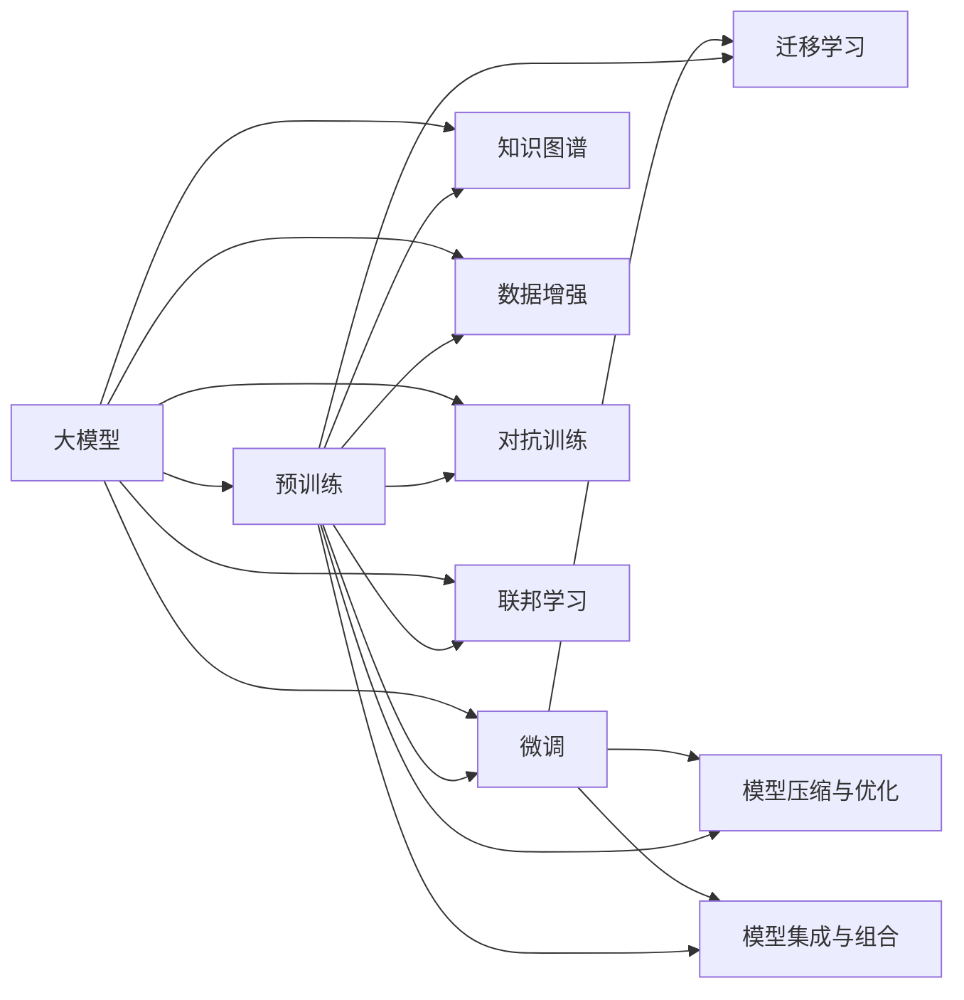

                 

## 1. 背景介绍

人工智能（AI）大模型正逐渐成为各行各业的基础设施，驱动创新的引擎。然而，大模型并非万能钥匙，其开发、部署和运营涉及众多挑战，需要具备丰富的技术积累和精细化管理能力。在AI大模型的创业旅程中，如何利用平台优势，将复杂的技术难题转化为生产力，是企业家和工程师面临的关键课题。本文旨在深入探讨这一话题，帮助读者理解大模型的本质，以及如何借助平台优势，实现商业价值最大化。

## 2. 核心概念与联系

### 2.1 核心概念概述

为了更好地理解如何利用平台优势，首先需要明确几个关键概念：

- **大模型（Large Models）**：指通过大规模数据预训练得到的深度神经网络模型，如GPT、BERT等。它们具备强大的表示学习能力，适用于多种自然语言处理（NLP）任务。

- **预训练（Pre-training）**：在大规模无标签数据上训练模型，提取通用的语言表示。预训练后的模型可以进行微调以适应特定任务。

- **微调（Fine-tuning）**：在预训练模型基础上，使用少量标注数据进行有监督训练，以适应特定应用场景。

- **迁移学习（Transfer Learning）**：利用预训练模型在新的任务上进行微调，通过知识迁移提升性能。

- **模型压缩与优化（Model Compression & Optimization）**：为了提高效率和减少资源消耗，对模型进行裁剪、量化、稀疏化等操作。

- **模型集成与组合（Model Ensembling & Composition）**：通过组合多个模型或进行集成学习，提升整体性能和鲁棒性。

- **知识图谱（Knowledge Graphs）**：将结构化知识嵌入模型，增强语言模型的常识推理能力。

- **数据增强（Data Augmentation）**：通过对训练数据进行扩充，提高模型的泛化能力。

- **对抗训练（Adversarial Training）**：通过对抗样本训练模型，提升其鲁棒性和抗干扰能力。

- **联邦学习（Federated Learning）**：在分布式环境中，多客户端合作训练模型，保护数据隐私。

这些概念构成了大模型创业的核心技术框架，通过理解这些概念，可以为利用平台优势打下坚实基础。

### 2.2 核心概念原理和架构的 Mermaid 流程图



此图展示了各个核心概念之间的相互关系和交互。大模型通过预训练学习通用语言表示，然后通过微调、迁移学习、模型压缩与优化、集成与组合、知识图谱、数据增强、对抗训练和联邦学习等技术手段，适应特定的应用场景。

## 3. 核心算法原理 & 具体操作步骤

### 3.1 算法原理概述

大模型创业的核心在于将大模型的强大能力转化为可商品化的产品或服务。这需要理解大模型的工作原理，并设计出合理的平台架构来支持这些技术的实现和应用。

大模型的预训练通常在大规模无标签数据上完成，目的是学习到广泛的语义表示。在预训练阶段，模型通过自监督任务（如掩码语言模型、下一个句子预测等）学习到语言中的规律和结构。随后，在微调阶段，模型会根据特定任务的目标函数进行有监督训练，以调整和优化其表示能力，适应特定的应用场景。

### 3.2 算法步骤详解

大模型创业的平台架构设计可以分为以下几个关键步骤：

1. **平台架构设计**：
   - 设计高效的数据流通和处理机制，支持大规模数据预训练和微调。
   - 选择适合的硬件和软件栈，如GPU、TPU、分布式计算框架等。
   - 构建灵活的微调和推理引擎，支持模型裁剪、量化、稀疏化等优化操作。
   - 设计易扩展的集成与组合机制，支持模型组合和模型堆叠。

2. **模型训练与微调**：
   - 选择适当的预训练模型和微调算法。
   - 准备训练数据集，进行数据增强和对抗训练。
   - 使用分布式训练框架，加快模型训练速度。
   - 应用迁移学习，提升模型在新任务上的性能。

3. **模型部署与优化**：
   - 将训练好的模型部署到生产环境，支持实时推理。
   - 使用模型压缩技术，减少推理资源消耗。
   - 进行模型集成，提高系统鲁棒性和性能。
   - 实现联邦学习，保护数据隐私，提升模型泛化能力。

4. **监控与维护**：
   - 实时监控模型性能，识别异常和故障。
   - 定期更新模型参数，保证模型始终处于最佳状态。
   - 备份模型，防止数据丢失和系统崩溃。
   - 维护平台稳定性和安全性，防止外部攻击和数据泄露。

### 3.3 算法优缺点

大模型创业的平台架构设计具有以下优点：

- **高效性**：通过分布式训练和模型优化，可以大幅提升模型训练和推理效率。
- **灵活性**：平台支持多种模型和任务，易于扩展和定制。
- **鲁棒性**：采用对抗训练和模型集成，提高系统的鲁棒性和泛化能力。
- **隐私保护**：通过联邦学习，确保数据隐私和安全。

但同时，也存在一些缺点：

- **复杂性**：平台架构设计复杂，需要多学科知识的综合应用。
- **资源消耗**：大规模模型的训练和推理需要大量计算资源。
- **技术门槛高**：需要具备深厚的AI技术背景，才能有效管理和优化平台。
- **维护成本高**：持续监控和维护平台，需要高水平的技术团队。

### 3.4 算法应用领域

大模型创业的平台架构设计广泛适用于多个领域，包括但不限于：

- **自然语言处理（NLP）**：文本分类、情感分析、机器翻译、问答系统等。
- **计算机视觉（CV）**：图像识别、视频分析、人脸识别等。
- **智能推荐系统**：商品推荐、内容推荐、广告推荐等。
- **医疗健康**：病历分析、药物研发、智能诊断等。
- **金融服务**：信用评分、风险评估、智能投顾等。
- **智能客服**：语音识别、自然语言理解、对话系统等。
- **智慧城市**：交通管理、环境监测、公共安全等。

## 4. 数学模型和公式 & 详细讲解 & 举例说明

### 4.1 数学模型构建

在大模型创业中，数学模型构建是基础。以NLP任务为例，常见的数学模型包括：

- **自监督预训练模型**：使用掩码语言模型（Masked Language Model, MLM）和下一句预测（Next Sentence Prediction, NSP）任务进行预训练。
- **有监督微调模型**：在特定任务（如分类、序列标注、生成等）上进行微调，目标函数通常是交叉熵损失或平均绝对误差损失。
- **集成学习模型**：结合多个模型的预测结果，通过投票或加权平均提升整体性能。

### 4.2 公式推导过程

以分类任务为例，自监督预训练的MLM任务和有监督微调的交叉熵损失函数如下：

**自监督预训练**：
\[ L_{MLM} = \frac{1}{N}\sum_{i=1}^N\sum_{j=1}^n -y_j\log p(y_j|x) \]
其中，$y_j$为掩码位置上的真实标签，$p(y_j|x)$为模型预测的概率分布。

**有监督微调**：
\[ L_{classification} = \frac{1}{N}\sum_{i=1}^N\sum_{j=1}^m -y_j\log p(y_j|x) \]
其中，$y_j$为分类任务的真实标签，$p(y_j|x)$为模型在$x$上的预测概率。

### 4.3 案例分析与讲解

假设我们有一家初创公司，希望利用大模型进行情感分析。我们首先在大规模无标签数据上预训练一个BERT模型，然后在特定领域的电影评论数据集上进行微调。具体步骤如下：

1. **数据准备**：收集电影评论数据集，进行数据增强，如近义词替换、随机删除等。
2. **模型选择**：选择预训练的BERT模型作为基础模型。
3. **微调**：在微调过程中，学习率设置为1e-5，批大小为16，迭代100个epoch。
4. **评估**：在验证集上评估模型性能，使用混淆矩阵和ROC曲线评估模型效果。
5. **优化**：根据评估结果调整超参数，如学习率、批大小等。

## 5. 项目实践：代码实例和详细解释说明

### 5.1 开发环境搭建

搭建大模型创业的开发环境需要考虑以下几个方面：

- **硬件**：选择高性能GPU/TPU，确保训练和推理速度。
- **软件**：安装深度学习框架，如PyTorch、TensorFlow等，以及模型库，如HuggingFace。
- **环境配置**：配置虚拟环境，确保各依赖包相互兼容。

### 5.2 源代码详细实现

以下是一个简单的NLP任务（情感分析）微调示例：

```python
from transformers import BertTokenizer, BertForSequenceClassification
from transformers import AdamW, get_linear_schedule_with_warmup
from transformers import Trainer, TrainingArguments
from datasets import load_dataset

# 加载数据集
train_dataset = load_dataset("movie_reviews/train", split="train")
test_dataset = load_dataset("movie_reviews/test", split="test")

# 定义tokenizer和模型
tokenizer = BertTokenizer.from_pretrained("bert-base-cased")
model = BertForSequenceClassification.from_pretrained("bert-base-cased", num_labels=2)

# 定义训练参数
training_args = TrainingArguments(
    output_dir="./results",
    per_device_train_batch_size=16,
    per_device_eval_batch_size=16,
    num_train_epochs=100,
    weight_decay=0.01,
    logging_dir="./logs",
    logging_steps=100,
)

# 定义训练器
trainer = Trainer(
    model=model,
    args=training_args,
    train_dataset=train_dataset,
    eval_dataset=test_dataset,
    compute_metrics=compute_metrics,
)

# 训练模型
trainer.train()
trainer.evaluate()
```

### 5.3 代码解读与分析

在上述代码中，我们首先加载了电影评论数据集，并定义了tokenizer和BERT模型。接着，配置了训练参数，包括批次大小、训练轮数、权重衰减等。最后，使用Trainer进行模型训练和评估。

**Trainer**：是一个集成训练器，支持分布式训练和多种优化器，如AdamW、SGD等。它内部实现了自动化的超参数调优、模型保存和日志记录等功能，简化了模型的训练过程。

**TrainingArguments**：是训练参数的配置，支持多种超参数，如学习率、批大小、优化器等。通过它可以轻松设置训练环境的参数。

### 5.4 运行结果展示

在训练结束后，可以在输出目录和日志目录下查看训练结果。例如，可以输出模型的精度、召回率等指标，以及训练过程中的loss和acc曲线。

## 6. 实际应用场景

### 6.4 未来应用展望

大模型创业的平台架构设计在未来将面临更多挑战和机遇。以下是一些可能的趋势：

1. **分布式训练**：随着模型规模的增大，分布式训练将成为必然选择。未来将会出现更加高效的分布式训练框架，支持大规模模型的训练和优化。
2. **跨模态学习**：融合多模态数据，如文本、图像、语音等，提升模型的综合能力和泛化能力。
3. **实时推理**：优化推理引擎，支持低延迟、高并发的实时推理，满足更多实时性要求的应用场景。
4. **边缘计算**：将大模型部署在边缘设备上，支持离线推理和低带宽环境下的应用。
5. **自动化调参**：通过自动化调参技术，优化超参数，提升模型性能。
6. **联邦学习**：在大规模分布式环境中，保护数据隐私，提升模型泛化能力。

## 7. 工具和资源推荐

### 7.1 学习资源推荐

1. **《深度学习》（Ian Goodfellow等）**：全面介绍了深度学习的基础理论和应用，是AI大模型创业的必备教材。
2. **《自然语言处理综述》（Jurafsky等）**：介绍了NLP领域的经典模型和技术，如RNN、CNN、LSTM等。
3. **《计算机视觉：模型、学习、推理》（Goodfellow等）**：介绍了CV领域的经典模型和技术，如卷积神经网络、生成对抗网络等。
4. **《分布式深度学习》（Dean等）**：介绍了分布式深度学习的基础理论和实践方法，是分布式训练的重要参考资料。
5. **《联邦学习》（Kairouz等）**：介绍了联邦学习的基础理论和应用，是联邦学习的重要参考资料。

### 7.2 开发工具推荐

1. **PyTorch**：高性能深度学习框架，支持动态计算图和分布式训练。
2. **TensorFlow**：开源深度学习框架，支持静态计算图和分布式训练。
3. **JAX**：高性能深度学习框架，支持自动微分和分布式训练。
4. **HuggingFace**：NLP领域的模型库，提供预训练模型和微调工具。
5. **Weights & Biases**：模型训练的实验跟踪工具，记录和可视化训练过程。
6. **TensorBoard**：可视化工具，支持实时监控和分析训练过程。
7. **NVIDIA DeepLearning SDK**：支持GPU/TPU训练的SDK，提供高性能计算能力。

### 7.3 相关论文推荐

1. **《Attention is All You Need》（Vaswani等）**：Transformer模型，引入了自注意力机制，开创了NLP领域的预训练大模型时代。
2. **《BERT: Pre-training of Deep Bidirectional Transformers for Language Understanding》（Devlin等）**：BERT模型，通过自监督预训练，取得了NLP任务的最先进性能。
3. **《AdaLoRA: Adaptive Low-Rank Adaptation for Parameter-Efficient Fine-Tuning》（Li等）**：AdaLoRA方法，通过自适应低秩适应，实现了参数高效微调。
4. **《BigQueryMind》（Xie等）**：介绍了一个大规模多模态深度学习系统，融合了文本、图像、语音等多种数据。
5. **《FedML: A Library and System for Distributed, Federated, Multi-Device Machine Learning》（Xiang等）**：FedML系统，支持联邦学习，保护数据隐私。

## 8. 总结：未来发展趋势与挑战

### 8.1 研究成果总结

本文通过深入分析大模型创业的核心概念和技术框架，探讨了如何利用平台优势，将大模型的强大能力转化为商业价值。核心结论如下：

1. 大模型创业的关键在于理解大模型的原理和架构，设计高效的平台架构。
2. 大模型创业涉及分布式训练、模型优化、模型集成等多种技术手段。
3. 大模型创业需要跨学科知识的综合应用，包括深度学习、分布式计算、系统架构等。

### 8.2 未来发展趋势

未来，大模型创业将面临更多挑战和机遇。以下是一些可能的趋势：

1. **多模态融合**：融合文本、图像、语音等多种模态，提升模型的综合能力和泛化能力。
2. **实时推理**：优化推理引擎，支持低延迟、高并发的实时推理。
3. **联邦学习**：在大规模分布式环境中，保护数据隐私，提升模型泛化能力。
4. **边缘计算**：将大模型部署在边缘设备上，支持离线推理和低带宽环境下的应用。
5. **自动化调参**：通过自动化调参技术，优化超参数，提升模型性能。
6. **知识图谱融合**：将结构化知识嵌入模型，增强语言模型的常识推理能力。

### 8.3 面临的挑战

尽管大模型创业具有广阔的前景，但也面临诸多挑战：

1. **资源消耗**：大规模模型的训练和推理需要大量计算资源。
2. **技术门槛高**：需要具备深厚的AI技术背景，才能有效管理和优化平台。
3. **模型可解释性**：大模型往往像"黑盒"，难以解释其内部工作机制和决策逻辑。
4. **数据隐私保护**：在分布式环境中，如何保护数据隐私，是联邦学习面临的重要挑战。

### 8.4 研究展望

未来，大模型创业需要在以下几个方面进行深入研究：

1. **多模态学习**：融合文本、图像、语音等多种数据，提升模型的综合能力。
2. **实时推理**：优化推理引擎，支持低延迟、高并发的实时推理。
3. **联邦学习**：在大规模分布式环境中，保护数据隐私，提升模型泛化能力。
4. **模型压缩**：通过模型裁剪、量化、稀疏化等技术，减少资源消耗。
5. **自动化调参**：通过自动化调参技术，优化超参数，提升模型性能。
6. **知识图谱融合**：将结构化知识嵌入模型，增强语言模型的常识推理能力。

## 9. 附录：常见问题与解答

### Q1: 大模型创业需要哪些核心技术？

A: 大模型创业需要以下核心技术：

1. **深度学习框架**：如PyTorch、TensorFlow等，支持模型的训练和推理。
2. **分布式训练**：如NVIDIA DeepLearning SDK，支持大规模模型的训练。
3. **模型优化**：如AdaLoRA、AdaScale等，优化模型的参数和计算效率。
4. **模型集成**：如模型堆叠、模型融合等，提升系统的鲁棒性和性能。
5. **知识图谱融合**：如NELL、KBQA等，增强模型的常识推理能力。

### Q2: 如何优化大模型的训练过程？

A: 大模型的训练过程优化包括以下几个方面：

1. **分布式训练**：使用GPU/TPU等高性能设备，加速模型训练。
2. **模型压缩**：通过裁剪、量化、稀疏化等技术，减少模型参数和计算资源消耗。
3. **自适应学习率**：如AdaGrad、Adam等，动态调整学习率，加速收敛。
4. **数据增强**：通过近义词替换、回译等技术，扩充训练数据，提高模型泛化能力。
5. **对抗训练**：引入对抗样本，提高模型的鲁棒性和抗干扰能力。

### Q3: 如何保护大模型的数据隐私？

A: 保护大模型的数据隐私，可以采用以下措施：

1. **数据脱敏**：对敏感数据进行匿名化处理，防止数据泄露。
2. **差分隐私**：在模型训练过程中，加入噪声，保护用户隐私。
3. **联邦学习**：在分布式环境中，各客户端只上传模型参数，不共享原始数据。
4. **加密通信**：使用加密技术，保护数据在网络传输过程中的安全性。

### Q4: 大模型创业如何降低成本？

A: 大模型创业可以通过以下方式降低成本：

1. **平台架构优化**：通过优化平台架构，提高计算资源利用率，降低硬件成本。
2. **模型裁剪**：通过裁剪模型，减少资源消耗，降低推理成本。
3. **模型量化**：将模型从浮点数转化为定点数，压缩存储空间，提高计算效率。
4. **分布式训练**：使用分布式训练框架，支持大规模模型的训练，降低人力和时间成本。
5. **资源共享**：通过云计算平台，共享计算资源，降低硬件投入。

---

作者：禅与计算机程序设计艺术 / Zen and the Art of Computer Programming

