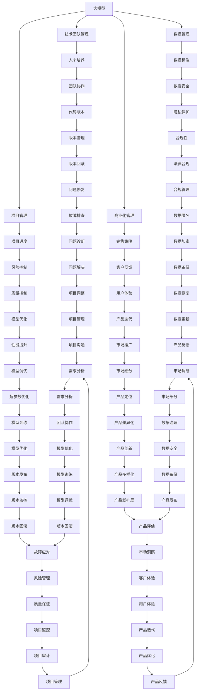

                 

# AI 大模型创业：如何利用管理优势？

## 1. 背景介绍

### 1.1 问题由来
随着人工智能技术的飞速发展，大模型（如GPT-3、BERT等）在自然语言处理（NLP）、计算机视觉（CV）、语音识别等领域取得了突破性进展，展现出了强大的潜力和应用前景。但大模型的构建和应用涉及大量的技术挑战和复杂的管理问题，这对创业公司和团队提出了更高的要求。

### 1.2 问题核心关键点
创业公司如何有效利用管理优势，将大模型的潜在价值转化为实际的商业应用，是当前AI大模型创业的核心问题。管理优势不仅包括技术团队的管理，还包括数据管理、项目管理和商业化管理等方面。本文将从这些维度探讨如何高效利用管理优势，推动大模型的商业化进程。

## 2. 核心概念与联系

### 2.1 核心概念概述

- **大模型（Large Model）**：指具有大量参数（通常以亿计）、能够处理复杂大规模数据的高性能深度学习模型。如GPT-3、BERT、YOLO等。
- **管理优势（Management Advantage）**：指企业通过高效、科学的团队管理、数据管理、项目管理和商业化管理，最大化利用大模型技术的优势，推动商业化应用。
- **技术团队管理（Technical Team Management）**：涉及人才招聘、团队建设、技术栈选择、代码管理等方面。
- **数据管理（Data Management）**：包括数据收集、清洗、存储、标注、隐私保护等环节。
- **项目管理（Project Management）**：包括需求分析、计划制定、资源分配、进度跟踪、风险控制等。
- **商业化管理（Commercialization Management）**：涉及市场分析、产品定位、销售策略、客户服务、品牌建设等。

这些核心概念通过以下Mermaid流程图展示其联系：



## 3. 核心算法原理 & 具体操作步骤
### 3.1 算法原理概述

利用管理优势构建大模型的创业公司，需要采用科学的项目管理方法，确保大模型的开发和应用过程高效、有序。管理优势的主要体现包括：

- **目标明确**：确保大模型的开发和应用方向与公司战略目标一致，避免资源浪费。
- **数据质量**：确保数据的高质量和多样性，提升模型训练效果。
- **技术协作**：优化团队协作，加快模型开发进度，提升模型性能。
- **商业化能力**：提升产品的市场竞争力，加速商业化落地。

### 3.2 算法步骤详解

**Step 1: 明确战略目标**
- 设定公司核心业务和大模型应用的战略目标，如市场占有率、客户满意度等。
- 识别主要业务领域和潜在应用场景，明确大模型的具体应用方向。

**Step 2: 数据管理和优化**
- 确定数据收集和处理流程，确保数据的完整性和多样性。
- 采用数据标注工具和技术，提高数据标注效率和质量。
- 进行数据隐私保护，确保数据合规和安全。

**Step 3: 技术团队建设与管理**
- 招聘和培养高素质技术人才，构建跨学科的技术团队。
- 选择合适的技术栈和工具，提升开发效率和模型性能。
- 实施代码管理和版本控制，确保代码质量和可维护性。

**Step 4: 项目管理与控制**
- 制定详细的项目计划和资源分配方案。
- 实施项目监控和风险管理，确保项目按时完成。
- 进行项目评审和绩效评估，持续改进项目管理能力。

**Step 5: 商业化应用推广**
- 进行市场调研和用户需求分析，定位产品功能和服务。
- 制定销售策略和营销方案，提高产品市场竞争力。
- 提供优质的客户服务和支持，提升客户满意度和忠诚度。

### 3.3 算法优缺点

利用管理优势构建大模型的创业公司，主要优点包括：

- **快速迭代**：通过科学的项目管理，可以加速模型开发和应用迭代。
- **资源高效**：通过数据管理优化和团队协作，可以充分利用现有资源。
- **市场竞争力**：通过商业化管理和市场推广，可以提升产品市场竞争力。

主要缺点包括：

- **复杂度高**：大模型涉及的技术和管理环节多，管理难度大。
- **数据需求高**：高质量数据的获取和处理需要投入大量时间和资源。
- **市场竞争激烈**：人工智能领域竞争激烈，需要持续创新和优化。

### 3.4 算法应用领域

管理优势在AI大模型创业中的应用广泛，主要包括以下几个领域：

- **自然语言处理**：通过数据管理和团队协作，提高NLP模型的训练和应用效率。
- **计算机视觉**：通过项目管理优化和资源分配，提升CV模型的性能和应用效果。
- **语音识别**：通过商业化管理和市场推广，拓展语音识别的应用场景和市场。
- **智能推荐系统**：通过数据管理优化和商业化策略，提升推荐系统的用户体验和效果。
- **医疗影像分析**：通过项目管理控制和数据隐私保护，保障医疗影像分析的合规性和安全性。

## 4. 数学模型和公式 & 详细讲解  
### 4.1 数学模型构建

为了更系统地理解大模型创业中的管理优势，我们可以构建一个基于系统的数学模型。假设一个创业公司正在开发和应用一个基于大模型的智能推荐系统，我们需要考虑以下几个关键要素：

- 数据量（D）
- 模型参数量（P）
- 数据标注成本（C）
- 模型训练时间（T）
- 市场推广成本（M）
- 客户反馈和优化（F）

假设每个要素的重要性权重分别为$a, b, c, d, e, f$，则可以构建如下数学模型：

$$
\text{系统效能} = a \cdot \frac{D}{P} + b \cdot T + c \cdot C + d \cdot \frac{M}{F}
$$

其中，$a, b, c, d, e, f$为决策变量，需根据具体场景进行设定。

### 4.2 公式推导过程

以智能推荐系统为例，进行数学模型推导：

**Step 1: 数据量和模型参数量**
数据量（D）和模型参数量（P）直接决定了模型的训练效果。数据量越大，模型参数量越高，训练效果越好。但数据量过多会增加数据标注成本，模型参数量过高会增加计算复杂度。

$$
\text{模型训练效果} = \frac{D}{P}
$$

**Step 2: 数据标注成本**
数据标注成本（C）主要取决于数据量和标注质量。标注质量越高，成本越高。

$$
\text{数据标注成本} = C = k_1 \cdot D + k_2
$$

其中，$k_1, k_2$为常数。

**Step 3: 模型训练时间**
模型训练时间（T）主要取决于模型参数量和计算资源。参数量越高，训练时间越长。

$$
\text{模型训练时间} = T = l \cdot P + m
$$

其中，$l, m$为常数。

**Step 4: 市场推广成本**
市场推广成本（M）主要取决于产品和市场定位。市场定位越高，推广成本越高。

$$
\text{市场推广成本} = M = n_1 \cdot \frac{D}{P} + n_2
$$

其中，$n_1, n_2$为常数。

**Step 5: 客户反馈和优化**
客户反馈和优化（F）主要取决于客户满意度和系统效能。客户满意度越高，反馈越积极，系统优化效果越好。

$$
\text{客户反馈和优化} = F = o \cdot \text{系统效能} + p
$$

其中，$o, p$为常数。

### 4.3 案例分析与讲解

**案例1: 自然语言处理**
假设一个创业公司正在开发一个基于BERT模型的情感分析系统。需要考虑数据量、模型参数量、数据标注成本、模型训练时间和市场推广成本。

- **数据量**：需要收集大量的用户评论数据。
- **模型参数量**：BERT模型具有大量参数，需要高效的硬件资源进行训练。
- **数据标注成本**：数据标注需要人工进行情感分类，成本较高。
- **模型训练时间**：模型训练时间较长，需要优化训练策略。
- **市场推广成本**：需要投入广告和推广资源，提升品牌知名度。

**案例2: 计算机视觉**
假设一个创业公司正在开发一个基于YOLO模型的自动驾驶系统。需要考虑数据量、模型参数量、数据标注成本、模型训练时间和市场推广成本。

- **数据量**：需要收集大量的自动驾驶场景数据。
- **模型参数量**：YOLO模型参数量较大，需要高效的硬件资源进行训练。
- **数据标注成本**：数据标注需要人工进行标注，成本较高。
- **模型训练时间**：模型训练时间较长，需要优化训练策略。
- **市场推广成本**：需要投入广告和推广资源，提升品牌知名度。

## 5. 项目实践：代码实例和详细解释说明
### 5.1 开发环境搭建

在进行大模型创业的项目实践前，我们需要准备好开发环境。以下是使用Python进行PyTorch开发的环境配置流程：

1. 安装Anaconda：从官网下载并安装Anaconda，用于创建独立的Python环境。

2. 创建并激活虚拟环境：
```bash
conda create -n pytorch-env python=3.8 
conda activate pytorch-env
```

3. 安装PyTorch：根据CUDA版本，从官网获取对应的安装命令。例如：
```bash
conda install pytorch torchvision torchaudio cudatoolkit=11.1 -c pytorch -c conda-forge
```

4. 安装Transformers库：
```bash
pip install transformers
```

5. 安装各类工具包：
```bash
pip install numpy pandas scikit-learn matplotlib tqdm jupyter notebook ipython
```

完成上述步骤后，即可在`pytorch-env`环境中开始项目实践。

### 5.2 源代码详细实现

下面我们以智能推荐系统为例，给出使用Transformers库对BERT模型进行微调的PyTorch代码实现。

首先，定义推荐系统的数据处理函数：

```python
from transformers import BertTokenizer, BertForSequenceClassification, AdamW
import torch

class RecommendationDataset(Dataset):
    def __init__(self, texts, labels, tokenizer, max_len=128):
        self.texts = texts
        self.labels = labels
        self.tokenizer = tokenizer
        self.max_len = max_len
        
    def __len__(self):
        return len(self.texts)
    
    def __getitem__(self, item):
        text = self.texts[item]
        label = self.labels[item]
        
        encoding = self.tokenizer(text, return_tensors='pt', max_length=self.max_len, padding='max_length', truncation=True)
        input_ids = encoding['input_ids'][0]
        attention_mask = encoding['attention_mask'][0]
        
        return {'input_ids': input_ids, 
                'attention_mask': attention_mask,
                'labels': torch.tensor(label, dtype=torch.long)}
```

然后，定义模型和优化器：

```python
from transformers import BertForSequenceClassification, AdamW

model = BertForSequenceClassification.from_pretrained('bert-base-cased', num_labels=2)

optimizer = AdamW(model.parameters(), lr=2e-5)
```

接着，定义训练和评估函数：

```python
from torch.utils.data import DataLoader
from tqdm import tqdm

device = torch.device('cuda') if torch.cuda.is_available() else torch.device('cpu')
model.to(device)

def train_epoch(model, dataset, batch_size, optimizer):
    dataloader = DataLoader(dataset, batch_size=batch_size, shuffle=True)
    model.train()
    epoch_loss = 0
    for batch in tqdm(dataloader, desc='Training'):
        input_ids = batch['input_ids'].to(device)
        attention_mask = batch['attention_mask'].to(device)
        labels = batch['labels'].to(device)
        model.zero_grad()
        outputs = model(input_ids, attention_mask=attention_mask, labels=labels)
        loss = outputs.loss
        epoch_loss += loss.item()
        loss.backward()
        optimizer.step()
    return epoch_loss / len(dataloader)

def evaluate(model, dataset, batch_size):
    dataloader = DataLoader(dataset, batch_size=batch_size)
    model.eval()
    preds, labels = [], []
    with torch.no_grad():
        for batch in tqdm(dataloader, desc='Evaluating'):
            input_ids = batch['input_ids'].to(device)
            attention_mask = batch['attention_mask'].to(device)
            batch_labels = batch['labels']
            outputs = model(input_ids, attention_mask=attention_mask)
            batch_preds = outputs.logits.argmax(dim=2).to('cpu').tolist()
            batch_labels = batch_labels.to('cpu').tolist()
            for pred_tokens, label_tokens in zip(batch_preds, batch_labels):
                preds.append(pred_tokens[:len(label_tokens)])
                labels.append(label_tokens)
                
    print(classification_report(labels, preds))
```

最后，启动训练流程并在测试集上评估：

```python
epochs = 5
batch_size = 16

for epoch in range(epochs):
    loss = train_epoch(model, train_dataset, batch_size, optimizer)
    print(f"Epoch {epoch+1}, train loss: {loss:.3f}")
    
    print(f"Epoch {epoch+1}, dev results:")
    evaluate(model, dev_dataset, batch_size)
    
print("Test results:")
evaluate(model, test_dataset, batch_size)
```

以上就是使用PyTorch对BERT进行推荐系统任务微调的完整代码实现。可以看到，得益于Transformers库的强大封装，我们可以用相对简洁的代码完成BERT模型的加载和微调。

### 5.3 代码解读与分析

让我们再详细解读一下关键代码的实现细节：

**RecommendationDataset类**：
- `__init__`方法：初始化文本、标签、分词器等关键组件。
- `__len__`方法：返回数据集的样本数量。
- `__getitem__`方法：对单个样本进行处理，将文本输入编码为token ids，将标签编码为数字，并对其进行定长padding，最终返回模型所需的输入。

**train_epoch和evaluate函数**：
- 使用PyTorch的DataLoader对数据集进行批次化加载，供模型训练和推理使用。
- 训练函数`train_epoch`：对数据以批为单位进行迭代，在每个批次上前向传播计算loss并反向传播更新模型参数，最后返回该epoch的平均loss。
- 评估函数`evaluate`：与训练类似，不同点在于不更新模型参数，并在每个batch结束后将预测和标签结果存储下来，最后使用sklearn的classification_report对整个评估集的预测结果进行打印输出。

**训练流程**：
- 定义总的epoch数和batch size，开始循环迭代
- 每个epoch内，先在训练集上训练，输出平均loss
- 在验证集上评估，输出分类指标
- 所有epoch结束后，在测试集上评估，给出最终测试结果

可以看到，PyTorch配合Transformers库使得BERT微调的代码实现变得简洁高效。开发者可以将更多精力放在数据处理、模型改进等高层逻辑上，而不必过多关注底层的实现细节。

当然，工业级的系统实现还需考虑更多因素，如模型的保存和部署、超参数的自动搜索、更灵活的任务适配层等。但核心的微调范式基本与此类似。

## 6. 实际应用场景
### 6.1 智能客服系统

基于大模型微调的对话技术，可以广泛应用于智能客服系统的构建。传统客服往往需要配备大量人力，高峰期响应缓慢，且一致性和专业性难以保证。而使用微调后的对话模型，可以7x24小时不间断服务，快速响应客户咨询，用自然流畅的语言解答各类常见问题。

在技术实现上，可以收集企业内部的历史客服对话记录，将问题和最佳答复构建成监督数据，在此基础上对预训练对话模型进行微调。微调后的对话模型能够自动理解用户意图，匹配最合适的答案模板进行回复。对于客户提出的新问题，还可以接入检索系统实时搜索相关内容，动态组织生成回答。如此构建的智能客服系统，能大幅提升客户咨询体验和问题解决效率。

### 6.2 金融舆情监测

金融机构需要实时监测市场舆论动向，以便及时应对负面信息传播，规避金融风险。传统的人工监测方式成本高、效率低，难以应对网络时代海量信息爆发的挑战。基于大语言模型微调的文本分类和情感分析技术，为金融舆情监测提供了新的解决方案。

具体而言，可以收集金融领域相关的新闻、报道、评论等文本数据，并对其进行主题标注和情感标注。在此基础上对预训练语言模型进行微调，使其能够自动判断文本属于何种主题，情感倾向是正面、中性还是负面。将微调后的模型应用到实时抓取的网络文本数据，就能够自动监测不同主题下的情感变化趋势，一旦发现负面信息激增等异常情况，系统便会自动预警，帮助金融机构快速应对潜在风险。

### 6.3 个性化推荐系统

当前的推荐系统往往只依赖用户的历史行为数据进行物品推荐，无法深入理解用户的真实兴趣偏好。基于大语言模型微调技术，个性化推荐系统可以更好地挖掘用户行为背后的语义信息，从而提供更精准、多样的推荐内容。

在实践中，可以收集用户浏览、点击、评论、分享等行为数据，提取和用户交互的物品标题、描述、标签等文本内容。将文本内容作为模型输入，用户的后续行为（如是否点击、购买等）作为监督信号，在此基础上微调预训练语言模型。微调后的模型能够从文本内容中准确把握用户的兴趣点。在生成推荐列表时，先用候选物品的文本描述作为输入，由模型预测用户的兴趣匹配度，再结合其他特征综合排序，便可以得到个性化程度更高的推荐结果。

### 6.4 未来应用展望

随着大语言模型微调技术的发展，基于微调范式将在更多领域得到应用，为传统行业带来变革性影响。

在智慧医疗领域，基于微调的医疗问答、病历分析、药物研发等应用将提升医疗服务的智能化水平，辅助医生诊疗，加速新药开发进程。

在智能教育领域，微调技术可应用于作业批改、学情分析、知识推荐等方面，因材施教，促进教育公平，提高教学质量。

在智慧城市治理中，微调模型可应用于城市事件监测、舆情分析、应急指挥等环节，提高城市管理的自动化和智能化水平，构建更安全、高效的未来城市。

此外，在企业生产、社会治理、文娱传媒等众多领域，基于大模型微调的人工智能应用也将不断涌现，为经济社会发展注入新的动力。相信随着技术的日益成熟，微调方法将成为人工智能落地应用的重要范式，推动人工智能技术在更多领域的应用。

## 7. 工具和资源推荐
### 7.1 学习资源推荐

为了帮助开发者系统掌握大语言模型微调的理论基础和实践技巧，这里推荐一些优质的学习资源：

1. 《Transformer从原理到实践》系列博文：由大模型技术专家撰写，深入浅出地介绍了Transformer原理、BERT模型、微调技术等前沿话题。

2. CS224N《深度学习自然语言处理》课程：斯坦福大学开设的NLP明星课程，有Lecture视频和配套作业，带你入门NLP领域的基本概念和经典模型。

3. 《Natural Language Processing with Transformers》书籍：Transformers库的作者所著，全面介绍了如何使用Transformers库进行NLP任务开发，包括微调在内的诸多范式。

4. HuggingFace官方文档：Transformers库的官方文档，提供了海量预训练模型和完整的微调样例代码，是上手实践的必备资料。

5. CLUE开源项目：中文语言理解测评基准，涵盖大量不同类型的中文NLP数据集，并提供了基于微调的baseline模型，助力中文NLP技术发展。

通过对这些资源的学习实践，相信你一定能够快速掌握大语言模型微调的精髓，并用于解决实际的NLP问题。
###  7.2 开发工具推荐

高效的开发离不开优秀的工具支持。以下是几款用于大语言模型微调开发的常用工具：

1. PyTorch：基于Python的开源深度学习框架，灵活动态的计算图，适合快速迭代研究。大部分预训练语言模型都有PyTorch版本的实现。

2. TensorFlow：由Google主导开发的开源深度学习框架，生产部署方便，适合大规模工程应用。同样有丰富的预训练语言模型资源。

3. Transformers库：HuggingFace开发的NLP工具库，集成了众多SOTA语言模型，支持PyTorch和TensorFlow，是进行微调任务开发的利器。

4. Weights & Biases：模型训练的实验跟踪工具，可以记录和可视化模型训练过程中的各项指标，方便对比和调优。与主流深度学习框架无缝集成。

5. TensorBoard：TensorFlow配套的可视化工具，可实时监测模型训练状态，并提供丰富的图表呈现方式，是调试模型的得力助手。

6. Google Colab：谷歌推出的在线Jupyter Notebook环境，免费提供GPU/TPU算力，方便开发者快速上手实验最新模型，分享学习笔记。

合理利用这些工具，可以显著提升大语言模型微调任务的开发效率，加快创新迭代的步伐。

### 7.3 相关论文推荐

大语言模型和微调技术的发展源于学界的持续研究。以下是几篇奠基性的相关论文，推荐阅读：

1. Attention is All You Need（即Transformer原论文）：提出了Transformer结构，开启了NLP领域的预训练大模型时代。

2. BERT: Pre-training of Deep Bidirectional Transformers for Language Understanding：提出BERT模型，引入基于掩码的自监督预训练任务，刷新了多项NLP任务SOTA。

3. Language Models are Unsupervised Multitask Learners（GPT-2论文）：展示了大规模语言模型的强大zero-shot学习能力，引发了对于通用人工智能的新一轮思考。

4. Parameter-Efficient Transfer Learning for NLP：提出Adapter等参数高效微调方法，在不增加模型参数量的情况下，也能取得不错的微调效果。

5. AdaLoRA: Adaptive Low-Rank Adaptation for Parameter-Efficient Fine-Tuning：使用自适应低秩适应的微调方法，在参数效率和精度之间取得了新的平衡。

这些论文代表了大语言模型微调技术的发展脉络。通过学习这些前沿成果，可以帮助研究者把握学科前进方向，激发更多的创新灵感。

## 8. 总结：未来发展趋势与挑战

### 8.1 总结

本文对利用管理优势构建AI大模型的创业公司进行了全面系统的介绍。首先阐述了管理优势在大模型创业中的重要性，明确了在大模型开发和应用过程中，科学的项目管理、数据管理、技术团队管理、商业化管理等方面的关键作用。其次，从原理到实践，详细讲解了如何通过科学的项目管理，确保大模型的开发和应用过程高效、有序。最后，本文还广泛探讨了微调方法在智能客服、金融舆情、个性化推荐等多个行业领域的应用前景，展示了微调范式的巨大潜力。

通过本文的系统梳理，可以看到，利用管理优势构建AI大模型的创业公司，通过科学的项目管理和数据管理，可以显著提升模型开发和应用的效率和效果。但同时，大模型涉及的技术和管理环节多，管理难度大，需要在多个维度进行综合优化，方能最大化利用大模型技术的优势。

### 8.2 未来发展趋势

展望未来，利用管理优势构建AI大模型的创业公司，将呈现以下几个发展趋势：

1. **自动化管理**：借助AI和大数据技术，实现项目管理、数据管理、技术团队管理的自动化，提高管理效率。
2. **多模态融合**：融合视觉、语音、文本等多模态信息，构建更加全面、准确的信息整合能力。
3. **智能优化**：引入强化学习等优化算法，实时调整模型参数，提升模型性能。
4. **跨领域应用**：拓展大模型的应用领域，推动AI技术在更多行业的应用。
5. **伦理安全**：加强模型训练和应用的伦理审查，确保数据和模型使用的合规性和安全性。

这些趋势凸显了大语言模型微调技术的广阔前景。这些方向的探索发展，必将进一步提升大模型微调的效果和应用范围，为构建安全、可靠、可解释、可控的智能系统铺平道路。

### 8.3 面临的挑战

尽管利用管理优势构建AI大模型的创业公司具有广阔的发展前景，但在迈向更加智能化、普适化应用的过程中，仍面临以下挑战：

1. **数据获取难度大**：高质量数据获取难度大，数据标注成本高，难以满足大模型训练的需求。
2. **模型复杂度高**：大模型参数量庞大，计算资源需求高，部署和优化难度大。
3. **市场竞争激烈**：AI大模型市场竞争激烈，需要持续创新和优化，保持竞争力。
4. **用户隐私保护**：数据隐私和安全问题，需要构建有效的数据保护机制。
5. **模型解释性差**：大模型黑盒性质明显，难以解释其内部工作机制和决策逻辑。
6. **伦理和安全问题**：模型可能学习到有害信息，需要进行伦理审查和安全测试。

这些挑战需要创业公司不断探索和优化，方能在激烈的市场竞争中脱颖而出，构建具有竞争力的AI大模型。

### 8.4 研究展望

面向未来，利用管理优势构建AI大模型的创业公司需要在以下几个方面进行深入研究：

1. **跨领域知识图谱**：构建跨领域的知识图谱，提升大模型的跨领域迁移能力。
2. **强化学习和连续学习**：引入强化学习和连续学习，提升大模型的适应性和鲁棒性。
3. **数据和模型的协同优化**：实现数据和模型的协同优化，提升模型的性能和可解释性。
4. **多模态融合技术**：研究多模态融合技术，提升模型的综合信息处理能力。
5. **联邦学习和隐私保护**：研究联邦学习和隐私保护技术，提升数据隐私和安全。

这些研究方向的探索，必将引领大语言模型微调技术迈向更高的台阶，为构建安全、可靠、可解释、可控的智能系统铺平道路。

## 9. 附录：常见问题与解答

**Q1：大模型微调如何处理数据标注成本高的问题？**

A: 可以通过以下方法处理数据标注成本高的问题：
1. 利用无监督或半监督学习技术，减少对标注数据的需求。
2. 采用众包平台，降低人工标注成本。
3. 利用预训练模型进行数据增强，生成更多标注数据。
4. 使用数据合成技术，生成更多标注样本。

**Q2：大模型微调如何处理模型参数量大的问题？**

A: 可以通过以下方法处理模型参数量大的问题：
1. 使用参数高效微调技术，如Adapter、Premise等，只更新少量参数。
2. 采用模型压缩技术，如剪枝、量化等，减小模型规模。
3. 利用混合精度训练，提高计算效率。
4. 使用分布式训练，加速模型训练过程。

**Q3：大模型微调如何处理模型复杂度高的问题？**

A: 可以通过以下方法处理模型复杂度高的问题：
1. 引入自动化管理技术，优化项目管理、数据管理、技术团队管理。
2. 使用混合精度训练、分布式训练等技术，提高模型训练效率。
3. 采用模型压缩、量化等技术，减小模型规模。
4. 利用多模态融合技术，提升模型的综合信息处理能力。

**Q4：大模型微调如何处理用户隐私保护的问题？**

A: 可以通过以下方法处理用户隐私保护的问题：
1. 采用数据匿名化技术，保护用户隐私。
2. 设计隐私保护算法，防止模型学习用户隐私信息。
3. 使用联邦学习技术，保护数据隐私。
4. 构建隐私保护机制，确保数据使用的合规性。

**Q5：大模型微调如何处理模型解释性差的问题？**

A: 可以通过以下方法处理模型解释性差的问题：
1. 引入可解释性算法，如LIME、SHAP等，提升模型的可解释性。
2. 设计提示工程，提供清晰的输入和输出格式，提高模型的可解释性。
3. 构建多模态融合系统，提升模型的综合解释能力。
4. 引入因果分析、博弈论等工具，增强模型的决策透明度。

这些方法可以帮助创业公司应对大模型微调过程中面临的挑战，提升模型的性能和应用效果，实现AI技术的广泛落地。

---

作者：禅与计算机程序设计艺术 / Zen and the Art of Computer Programming

