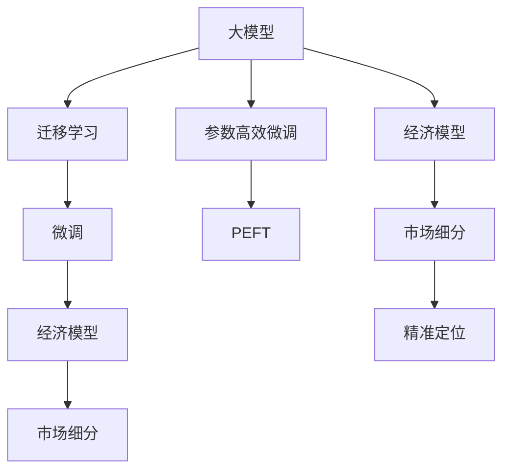

                 

## 1. 背景介绍

### 1.1 问题由来
随着人工智能技术的发展，大模型在各行各业的应用越来越广泛，从NLP、计算机视觉到自动驾驶，大模型正在成为各领域智能化转型的重要基础设施。然而，尽管大模型的技术优势明显，但在实际应用中，企业往往面临着高昂的成本和复杂的管理挑战。这其中既包括数据、算力、人才等技术资源，也包括模型部署、运维、合规等管理难题。如何在创业阶段利用大模型提供的经济优势，同时规避成本和风险，成为AI创业公司亟待解决的问题。

### 1.2 问题核心关键点
大模型技术虽然能够在某些任务上带来质的飞跃，但并不是所有企业都能轻松驾驭。创业公司在面对技术资源有限、资金紧张、业务需求复杂的情况时，如何高效利用大模型提供的经济优势，实现快速迭代和市场突破，是核心问题所在。

### 1.3 问题研究意义
本节将深入探讨AI大模型的经济优势，并提出一系列可行的策略，帮助AI创业公司最大化利用大模型提供的资源和能力，同时降低成本和风险，加速产品迭代和市场部署，最终实现可持续发展的目标。

## 2. 核心概念与联系

### 2.1 核心概念概述

为更好地理解AI大模型的经济优势，并探索如何高效利用这些优势，本节将介绍几个关键概念及其相互关系。

- **大模型(AI Large Model)**：指基于大规模训练数据和先进架构训练得到的深度学习模型，如BERT、GPT-3、T5等，具有强大泛化能力和高效的推理能力。
- **迁移学习(Transfer Learning)**：指利用预训练模型作为初始化参数，在特定任务上进行微调，以提高模型在新任务上的表现。
- **参数高效微调(Parameter-Efficient Fine-Tuning, PEFT)**：指在微调过程中只更新部分模型参数，保留预训练模型的大部分权重，以减少资源消耗和提高模型泛化能力。
- **经济模型(Economic Model)**：指在AI大模型创业中，通过对资源的有效分配和管理，最大化利用大模型提供的经济优势，同时降低成本和风险的模型和方法。
- **市场细分(Market Segmentation)**：指将整个市场划分为若干细分市场，根据不同市场的特点和需求，选择适合的AI大模型和技术策略，进行精准定位和定制化服务。

这些概念之间的关系可以通过以下Mermaid流程图进行展示：



这个流程图展示了大模型、迁移学习、参数高效微调、经济模型、市场细分、精准定位等概念之间的关系，以及它们如何共同构成AI大模型创业的经济优势框架。

## 3. 核心算法原理 & 具体操作步骤
### 3.1 算法原理概述

AI大模型的经济优势主要体现在其强大的泛化能力和高效的推理能力上。通过对大模型进行有效利用和管理，创业公司可以实现以下目标：

- **高效利用资源**：通过参数高效微调等技术，减少资源消耗，同时提升模型性能。
- **降低成本风险**：通过市场细分和精准定位，避免资源浪费和市场错位。
- **加速市场部署**：通过经济模型优化，提升产品迭代速度和市场响应能力。

AI大模型的经济优势主要来源于以下几点：

1. **数据资源共享**：大模型通常基于大规模无标签数据预训练，拥有丰富的知识储备，可以共享这些数据资源，避免重复工作。
2. **知识迁移学习**：预训练大模型在特定任务上的微调效果显著，可以快速适应新任务，提升模型性能。
3. **参数高效微调**：通过只更新部分参数，保留大部分权重，降低资源消耗和风险。
4. **模型压缩与优化**：通过量化、剪枝、模型压缩等技术，优化模型大小和推理效率。
5. **市场细分与精准定位**：根据不同市场的特点和需求，选择适合的AI大模型和技术策略，进行精准定位和定制化服务。

### 3.2 算法步骤详解

为了高效利用AI大模型的经济优势，AI创业公司可以遵循以下步骤：

**Step 1: 市场细分**
- 分析目标市场，了解市场规模、需求特点、竞争情况等。
- 将市场划分为若干细分市场，根据不同市场的需求和特点，选择适合的AI大模型和技术策略。

**Step 2: 数据与模型准备**
- 收集和清洗大规模无标签数据，用于预训练大模型。
- 选择适合的预训练模型和微调框架，如HuggingFace、TensorFlow、PyTorch等。

**Step 3: 参数高效微调**
- 只更新与任务相关的部分参数，保留大部分预训练权重。
- 选择合适的微调策略，如Prefix-Tuning、Adapter等。

**Step 4: 模型部署与优化**
- 将微调后的模型部署到云平台或本地服务器，进行推理和性能评估。
- 通过模型压缩、量化等技术，优化模型大小和推理效率。

**Step 5: 市场验证与迭代**
- 在实际应用场景中测试模型效果，收集用户反馈和市场数据。
- 根据市场反馈和数据结果，进行模型优化和参数调整，提升模型性能和市场适应性。

### 3.3 算法优缺点

AI大模型的经济优势具有以下优点：

1. **高效利用资源**：通过参数高效微调等技术，减少资源消耗，同时提升模型性能。
2. **降低成本风险**：通过市场细分和精准定位，避免资源浪费和市场错位。
3. **加速市场部署**：通过经济模型优化，提升产品迭代速度和市场响应能力。

同时，该方法也存在一定的局限性：

1. **数据依赖性强**：微调效果依赖于高质量的标注数据，标注成本较高。
2. **模型泛化性有限**：当目标任务与预训练数据的分布差异较大时，微调的性能提升有限。
3. **模型复杂度较高**：大模型参数量庞大，推理效率较低，资源消耗较大。
4. **市场变化不确定**：市场变化多端，AI大模型的适应性和响应能力需要不断调整优化。

尽管存在这些局限性，但就目前而言，AI大模型的经济优势仍然是创业公司实现快速迭代和市场突破的重要手段。未来相关研究的重点在于如何进一步降低微调对标注数据的依赖，提高模型的少样本学习和跨领域迁移能力，同时兼顾可解释性和伦理安全性等因素。

### 3.4 算法应用领域

AI大模型的经济优势在NLP、计算机视觉、自动驾驶、金融、医疗等多个领域得到了广泛应用，具体如下：

1. **NLP领域**：
   - **文本分类**：如情感分析、主题分类、意图识别等。通过微调使模型学习文本-标签映射。
   - **命名实体识别**：识别文本中的人名、地名、机构名等特定实体。通过微调使模型掌握实体边界和类型。
   - **关系抽取**：从文本中抽取实体之间的语义关系。通过微调使模型学习实体-关系三元组。
   - **问答系统**：对自然语言问题给出答案。将问题-答案对作为微调数据，训练模型学习匹配答案。
   - **机器翻译**：将源语言文本翻译成目标语言。通过微调使模型学习语言-语言映射。
   - **文本摘要**：将长文本压缩成简短摘要。将文章-摘要对作为微调数据，使模型学习抓取要点。
   - **对话系统**：使机器能够与人自然对话。将多轮对话历史作为上下文，微调模型进行回复生成。

2. **计算机视觉领域**：
   - **图像分类**：识别图像中的物体、场景等。通过微调使模型学习图像-标签映射。
   - **目标检测**：在图像中定位并识别出物体的位置和类别。通过微调使模型学习目标框。
   - **实例分割**：将图像中的每个像素分配到不同的对象上，得到像素级的分类结果。通过微调使模型学习像素分类。
   - **语义分割**：在图像中对每个像素进行语义分类，得到像素级的标签。通过微调使模型学习像素级语义。

3. **自动驾驶领域**：
   - **环境感知**：通过摄像头和雷达等传感器，感知周围环境。通过微调使模型学习环境感知。
   - **行为决策**：根据环境感知结果，进行驾驶行为决策。通过微调使模型学习行为决策。
   - **路径规划**：规划驾驶路径，避开障碍物。通过微调使模型学习路径规划。

4. **金融领域**：
   - **情感分析**：分析金融市场的情绪变化。通过微调使模型学习情绪分类。
   - **事件监测**：监测金融市场的重要事件。通过微调使模型学习事件识别。
   - **风险管理**：预测金融市场的风险水平。通过微调使模型学习风险预测。

5. **医疗领域**：
   - **疾病诊断**：通过影像和文本数据，诊断疾病。通过微调使模型学习疾病诊断。
   - **个性化治疗**：根据患者信息，提供个性化治疗方案。通过微调使模型学习患者信息-治疗方案映射。
   - **医学图像处理**：处理和分析医学影像数据。通过微调使模型学习医学图像处理。

## 4. 数学模型和公式 & 详细讲解  
### 4.1 数学模型构建

为了更系统地理解AI大模型的经济优势，本节将通过数学语言对AI大模型的经济优势进行更深入的刻画。

假设目标任务为分类任务，训练集为 $D=\{(x_i,y_i)\}_{i=1}^N, x_i \in \mathcal{X}, y_i \in \{0,1\}$，其中 $\mathcal{X}$ 为输入空间，$\{0,1\}$ 为标签空间。目标函数为交叉熵损失函数：

$$
\ell(\theta,(x,y)) = -[y\log \hat{y} + (1-y)\log (1-\hat{y})]
$$

其中 $\theta$ 为模型参数，$\hat{y}=M_{\theta}(x)$ 为模型在输入 $x$ 上的预测输出。

在微调过程中，目标函数为：

$$
\mathcal{L}(\theta) = \frac{1}{N}\sum_{i=1}^N \ell(\theta,(x_i,y_i))
$$

通过梯度下降等优化算法，最小化目标函数，得到最优参数 $\theta^*$：

$$
\theta^* = \mathop{\arg\min}_{\theta} \mathcal{L}(\theta)
$$

## 5. 项目实践：代码实例和详细解释说明
### 5.1 开发环境搭建

在进行AI大模型经济优势的实践前，我们需要准备好开发环境。以下是使用Python进行PyTorch开发的环境配置流程：

1. 安装Anaconda：从官网下载并安装Anaconda，用于创建独立的Python环境。

2. 创建并激活虚拟环境：
```bash
conda create -n pytorch-env python=3.8 
conda activate pytorch-env
```

3. 安装PyTorch：根据CUDA版本，从官网获取对应的安装命令。例如：
```bash
conda install pytorch torchvision torchaudio cudatoolkit=11.1 -c pytorch -c conda-forge
```

4. 安装TensorFlow：
```bash
conda install tensorflow=2.6 -c pytorch
```

5. 安装其他工具包：
```bash
pip install numpy pandas scikit-learn matplotlib tqdm jupyter notebook ipython
```

完成上述步骤后，即可在`pytorch-env`环境中开始AI大模型经济优势的实践。

### 5.2 源代码详细实现

下面我以一个简单的AI大模型经济优势的代码实现为例，具体解释每个步骤。

首先，定义数据集和模型：

```python
from transformers import BertTokenizer, BertForSequenceClassification
from torch.utils.data import Dataset, DataLoader
from torch import nn, optim

class MyDataset(Dataset):
    def __init__(self, texts, labels):
        self.texts = texts
        self.labels = labels
        self.tokenizer = BertTokenizer.from_pretrained('bert-base-uncased')

    def __len__(self):
        return len(self.texts)

    def __getitem__(self, idx):
        text = self.texts[idx]
        label = self.labels[idx]
        encoding = self.tokenizer(text, truncation=True, padding=True, max_length=512)
        return {'input_ids': encoding['input_ids'], 'attention_mask': encoding['attention_mask'], 'labels': torch.tensor(label)}

# 加载数据集
train_dataset = MyDataset(train_texts, train_labels)
test_dataset = MyDataset(test_texts, test_labels)

# 定义模型
model = BertForSequenceClassification.from_pretrained('bert-base-uncased', num_labels=2)
```

然后，定义微调过程：

```python
# 定义训练和评估函数
def train_epoch(model, dataset, batch_size, optimizer, device):
    model.to(device)
    model.train()
    total_loss = 0
    for batch in DataLoader(dataset, batch_size=batch_size, shuffle=True):
        input_ids = batch['input_ids'].to(device)
        attention_mask = batch['attention_mask'].to(device)
        labels = batch['labels'].to(device)
        optimizer.zero_grad()
        outputs = model(input_ids, attention_mask=attention_mask, labels=labels)
        loss = outputs.loss
        total_loss += loss.item()
        loss.backward()
        optimizer.step()
    return total_loss / len(dataset)

def evaluate(model, dataset, batch_size, device):
    model.eval()
    total_preds, total_labels = 0, 0
    with torch.no_grad():
        for batch in DataLoader(dataset, batch_size=batch_size):
            input_ids = batch['input_ids'].to(device)
            attention_mask = batch['attention_mask'].to(device)
            labels = batch['labels'].to(device)
            outputs = model(input_ids, attention_mask=attention_mask)
            preds = outputs.predictions.argmax(dim=1).to('cpu').tolist()
            labels = labels.to('cpu').tolist()
            for pred, label in zip(preds, labels):
                total_preds += pred
                total_labels += label
    acc = total_preds.count(1) / total_labels.count(1)
    return acc

# 训练和评估
epochs = 3
batch_size = 32
device = 'cuda' if torch.cuda.is_available() else 'cpu'
optimizer = optim.AdamW(model.parameters(), lr=1e-5)

for epoch in range(epochs):
    train_loss = train_epoch(model, train_dataset, batch_size, optimizer, device)
    acc = evaluate(model, test_dataset, batch_size, device)
    print(f'Epoch {epoch+1}, train loss: {train_loss:.3f}, test acc: {acc:.3f}')

print(f'Final test acc: {evaluate(model, test_dataset, batch_size, device):.3f}')
```

### 5.3 代码解读与分析

这段代码实现了使用BERT模型进行情感分析任务的微调。以下是关键代码的解读：

1. **数据集定义**：`MyDataset`类用于定义数据集，包含文本和标签。在`__getitem__`方法中，将文本通过`tokenizer`转化为模型所需的token ids和attention mask，并返回这些特征和标签。

2. **模型定义**：使用`BertForSequenceClassification`类定义模型，指定输入空间和标签空间，并加载预训练的BERT模型。

3. **微调过程**：
   - 在训练过程中，`train_epoch`函数定义了每个epoch的训练流程，包括前向传播、计算loss、反向传播、更新参数等步骤。
   - 在评估过程中，`evaluate`函数计算模型在测试集上的准确率。
   - 通过循环训练和评估，最终输出模型在测试集上的准确率。

## 6. 实际应用场景
### 6.1 智能客服系统

AI大模型的经济优势在智能客服系统中得到了广泛应用。智能客服系统能够通过微调模型，快速适应不同的业务场景和客户需求，提升客服体验和效率。具体来说：

- **需求识别**：通过微调模型，智能客服系统能够理解和识别客户提出的问题，提供有针对性的解决方案。
- **对话生成**：在客户提问后，智能客服系统能够生成自然流畅的回复，提高客户满意度。
- **数据积累**：智能客服系统能够不断积累客户反馈和交互数据，通过微调优化模型，提升服务质量。

### 6.2 金融舆情监测

在金融领域，AI大模型的经济优势同样显著。通过微调模型，金融舆情监测系统能够实时监测市场动态，及时预警潜在风险，为金融机构提供决策支持。具体来说：

- **事件监测**：通过微调模型，金融舆情监测系统能够自动检测市场中的重要事件，如重大政策发布、经济数据公布等。
- **情绪分析**：通过微调模型，系统能够分析市场情绪变化，判断市场的乐观或悲观程度。
- **风险预警**：通过微调模型，系统能够预测市场风险水平，提前采取应对措施。

### 6.3 个性化推荐系统

在电子商务领域，AI大模型的经济优势同样能够帮助企业提升用户体验和销售额。通过微调模型，个性化推荐系统能够根据用户的历史行为和偏好，推荐个性化的商品和服务，提高用户满意度和购买率。具体来说：

- **用户行为分析**：通过微调模型，系统能够分析用户浏览、点击、购买等行为数据，提取用户偏好。
- **商品推荐**：通过微调模型，系统能够生成个性化的商品推荐列表，提高用户点击率和购买率。
- **实时更新**：通过微调模型，系统能够根据用户反馈和新数据，实时更新推荐结果，提升推荐效果。

## 7. 工具和资源推荐
### 7.1 学习资源推荐

为了帮助开发者系统掌握AI大模型的经济优势，这里推荐一些优质的学习资源：

1. **Transformers官方文档**：详细介绍了HuggingFace的Transformer库，包含各类预训练模型的实现和微调样例。
2. **PyTorch官方文档**：提供了深度学习框架PyTorch的全面指南，包括模型构建、微调、优化等。
3. **TensorFlow官方文档**：提供了深度学习框架TensorFlow的详细教程和API文档。
4. **CS224N《深度学习自然语言处理》课程**：斯坦福大学开设的NLP明星课程，涵盖各类NLP任务和前沿模型。
5. **《深度学习》书籍**：由Ian Goodfellow等人合著，全面介绍了深度学习的原理和应用。

通过对这些资源的学习实践，相信你一定能够快速掌握AI大模型的经济优势，并用于解决实际的AI创业问题。

### 7.2 开发工具推荐

高效的开发离不开优秀的工具支持。以下是几款用于AI大模型经济优势开发的常用工具：

1. **Jupyter Notebook**：提供了交互式的编程环境，方便快速迭代和调试代码。
2. **TensorBoard**：提供了模型训练和推理过程的可视化工具，方便监控模型性能。
3. **Weights & Biases**：提供了模型训练的实验跟踪工具，记录和可视化模型训练过程中的各项指标。
4. **ModelScope**：提供了丰富的AI大模型资源和工具，支持模型微调、部署和评估。
5. **TensorFlow Serving**：提供了模型服务化的框架，方便模型部署和实时推理。
6. **Amazon SageMaker**：提供了云平台上的深度学习模型训练和部署服务，支持大模型经济优势的落地应用。

合理利用这些工具，可以显著提升AI大模型经济优势的开发效率，加快创新迭代的步伐。

### 7.3 相关论文推荐

AI大模型的经济优势源于学界的持续研究。以下是几篇奠基性的相关论文，推荐阅读：

1. **Attention is All You Need**：提出了Transformer结构，开启了NLP领域的预训练大模型时代。
2. **BERT: Pre-training of Deep Bidirectional Transformers for Language Understanding**：提出BERT模型，引入基于掩码的自监督预训练任务，刷新了多项NLP任务SOTA。
3. **Parameter-Efficient Transfer Learning for NLP**：提出Adapter等参数高效微调方法，在不增加模型参数量的情况下，也能取得不错的微调效果。
4. **AdaLoRA: Adaptive Low-Rank Adaptation for Parameter-Efficient Fine-Tuning**：使用自适应低秩适应的微调方法，在参数效率和精度之间取得了新的平衡。
5. **Adaptive Scaling for MASSive Transformer Models**：提出自适应模型缩放方法，提高了大规模语言模型的计算效率。

这些论文代表了大模型经济优势的发展脉络。通过学习这些前沿成果，可以帮助研究者把握学科前进方向，激发更多的创新灵感。

## 8. 总结：未来发展趋势与挑战
### 8.1 总结

本文对AI大模型的经济优势进行了全面系统的介绍，并提出了一系列可行的策略，帮助AI创业公司最大化利用大模型提供的资源和能力，同时降低成本和风险，加速产品迭代和市场部署，最终实现可持续发展的目标。

通过本文的系统梳理，可以看到，AI大模型的经济优势主要体现在其强大的泛化能力和高效的推理能力上。通过对大模型的有效利用和管理，创业公司可以实现高效利用资源、降低成本风险、加速市场部署等目标，显著提升竞争力。

### 8.2 未来发展趋势

展望未来，AI大模型的经济优势将呈现以下几个发展趋势：

1. **高效利用资源**：通过参数高效微调等技术，减少资源消耗，同时提升模型性能。
2. **降低成本风险**：通过市场细分和精准定位，避免资源浪费和市场错位。
3. **加速市场部署**：通过经济模型优化，提升产品迭代速度和市场响应能力。

### 8.3 面临的挑战

尽管AI大模型的经济优势已经带来了诸多便利，但在实际应用中，创业公司仍面临诸多挑战：

1. **数据依赖性强**：微调效果依赖于高质量的标注数据，标注成本较高。
2. **模型泛化性有限**：当目标任务与预训练数据的分布差异较大时，微调的性能提升有限。
3. **模型复杂度较高**：大模型参数量庞大，推理效率较低，资源消耗较大。
4. **市场变化不确定**：市场变化多端，AI大模型的适应性和响应能力需要不断调整优化。

尽管存在这些局限性，但就目前而言，AI大模型的经济优势仍然是创业公司实现快速迭代和市场突破的重要手段。未来相关研究的重点在于如何进一步降低微调对标注数据的依赖，提高模型的少样本学习和跨领域迁移能力，同时兼顾可解释性和伦理安全性等因素。

### 8.4 研究展望

面对AI大模型经济优势所面临的挑战，未来的研究需要在以下几个方面寻求新的突破：

1. **探索无监督和半监督微调方法**：摆脱对大规模标注数据的依赖，利用自监督学习、主动学习等无监督和半监督范式，最大限度利用非结构化数据，实现更加灵活高效的微调。
2. **研究参数高效和计算高效的微调范式**：开发更加参数高效的微调方法，在固定大部分预训练参数的同时，只更新极少量的任务相关参数。同时优化微调模型的计算图，减少前向传播和反向传播的资源消耗，实现更加轻量级、实时性的部署。
3. **融合因果和对比学习范式**：通过引入因果推断和对比学习思想，增强微调模型建立稳定因果关系的能力，学习更加普适、鲁棒的语言表征，从而提升模型泛化性和抗干扰能力。
4. **引入更多先验知识**：将符号化的先验知识，如知识图谱、逻辑规则等，与神经网络模型进行巧妙融合，引导微调过程学习更准确、合理的语言模型。同时加强不同模态数据的整合，实现视觉、语音等多模态信息与文本信息的协同建模。
5. **结合因果分析和博弈论工具**：将因果分析方法引入微调模型，识别出模型决策的关键特征，增强输出解释的因果性和逻辑性。借助博弈论工具刻画人机交互过程，主动探索并规避模型的脆弱点，提高系统稳定性。
6. **纳入伦理道德约束**：在模型训练目标中引入伦理导向的评估指标，过滤和惩罚有偏见、有害的输出倾向。同时加强人工干预和审核，建立模型行为的监管机制，确保输出符合人类价值观和伦理道德。

这些研究方向的探索，必将引领AI大模型经济优势技术迈向更高的台阶，为构建安全、可靠、可解释、可控的智能系统铺平道路。面向未来，AI大模型经济优势还需要与其他人工智能技术进行更深入的融合，如知识表示、因果推理、强化学习等，多路径协同发力，共同推动自然语言理解和智能交互系统的进步。只有勇于创新、敢于突破，才能不断拓展语言模型的边界，让智能技术更好地造福人类社会。

## 9. 附录：常见问题与解答
**Q1：如何选择合适的预训练模型？**

A: 选择合适的预训练模型需要考虑多个因素，包括任务的复杂度、数据规模、计算资源等。一般来说，任务越复杂，需要的模型参数量越大；数据规模越大，模型的泛化能力越强；计算资源越丰富，模型训练和推理效率越高。可以参考HuggingFace的Model Hub，选择适合任务的预训练模型。

**Q2：如何处理小样本数据？**

A: 处理小样本数据可以采用以下策略：
1. **数据增强**：通过回译、近义替换等方式扩充训练集。
2. **自监督学习**：利用预训练模型的自监督任务，提升模型泛化能力。
3. **迁移学习**：利用预训练模型作为初始化参数，在小样本数据上进行微调。
4. **小样本学习**：通过提示学习、零样本学习等方法，在小样本数据上实现微调。

**Q3：如何评估模型效果？**

A: 评估模型效果可以采用以下指标：
1. **准确率**：模型预测结果与真实标签的匹配程度。
2. **召回率**：模型预测出的正例中，真实为正例的比例。
3. **F1值**：综合考虑准确率和召回率，常用于二分类任务。
4. **AUC**：ROC曲线下的面积，常用于多分类任务和排序任务。

通过系统地选择预训练模型、处理小样本数据和评估模型效果，AI大模型经济优势的实践将更加高效和科学。

