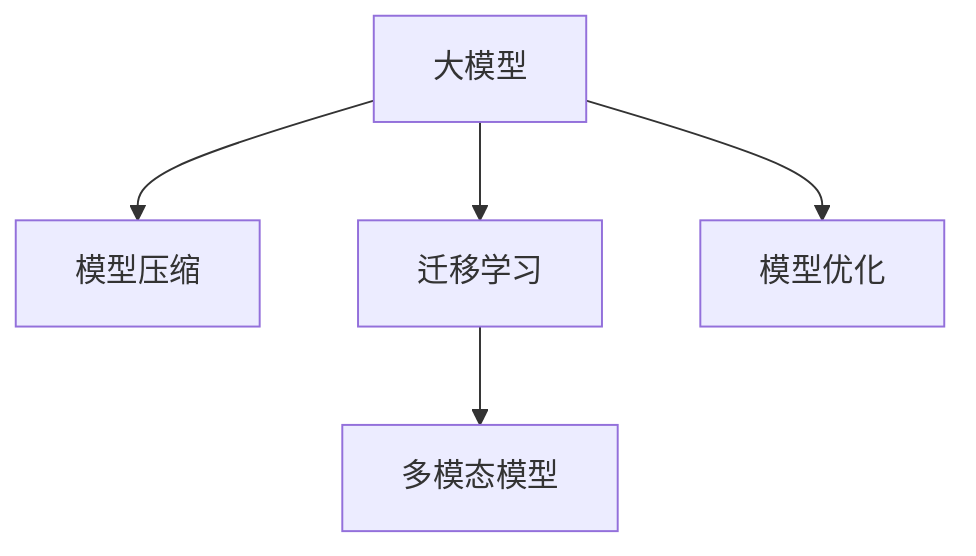

                 

# AI 大模型创业：如何利用经济优势？

## 1. 背景介绍

### 1.1 问题由来

近年来，随着人工智能技术的迅猛发展，大模型（Large Model）成为推动行业创新和变革的重要驱动力。以OpenAI的GPT系列、Google的BERT为代表的大模型，以其巨大的参数规模和强大的自然语言处理能力，逐步渗透到各行各业，带来了革命性的变化。然而，大模型的研发和部署需要高昂的算力和存储资源，导致创业门槛变得异常高。如何在创业阶段充分利用大模型的经济优势，降低成本，提升效率，成为许多AI创业者亟需解决的问题。

### 1.2 问题核心关键点

利用大模型的经济优势，可以从以下几个方面进行思考：

- **算力优化**：如何有效降低大模型训练和推理所需的算力成本。
- **存储优化**：如何优化模型的存储，减少存储空间需求。
- **模型压缩**：如何将大模型压缩至更小的尺寸，同时保持高性能。
- **迁移学习**：如何通过迁移学习，在已有预训练模型基础上，快速构建新的业务模型。
- **模型融合**：如何融合不同的大模型，构建更强的多模态模型。
- **模型优化**：如何优化模型参数，提高训练和推理的效率。

这些问题将通过文章逐步解答，帮助AI创业者更好地理解大模型的经济优势，并灵活应用于创业实践中。

## 2. 核心概念与联系

### 2.1 核心概念概述

在讨论如何利用大模型的经济优势之前，首先需要明确几个核心概念：

- **大模型（Large Model）**：指具有大规模参数量（通常超过10亿）的深度神经网络模型。这些模型通过大规模无监督学习训练，能够理解和处理复杂的自然语言。

- **模型压缩（Model Compression）**：通过量化、剪枝、蒸馏等技术手段，将大模型压缩至更小的尺寸，以减少存储空间需求和提升计算效率。

- **迁移学习（Transfer Learning）**：利用预训练模型在新任务上的表现，通过微调快速构建新模型，减少训练成本和时间。

- **多模态模型（Multimodal Model）**：结合文本、图像、语音等多模态数据的模型，可以处理更加复杂和真实世界的问题。

- **模型优化（Model Optimization）**：通过模型架构设计、算法优化等手段，提高模型的训练和推理效率。

这些概念通过以下Mermaid流程图展示其联系：



## 3. 核心算法原理 & 具体操作步骤
### 3.1 算法原理概述

利用大模型的经济优势，主要通过以下算法原理实现：

- **模型压缩**：通过量化、剪枝、蒸馏等技术手段，将大模型压缩至更小的尺寸，以减少存储空间需求和提升计算效率。
- **迁移学习**：利用预训练模型在新任务上的表现，通过微调快速构建新模型，减少训练成本和时间。
- **多模态模型**：结合文本、图像、语音等多模态数据，构建更强大的模型。
- **模型优化**：通过模型架构设计、算法优化等手段，提高模型的训练和推理效率。

### 3.2 算法步骤详解

以下是详细的操作步骤：

**步骤1：选择适合的预训练模型**

- **选择合适的预训练模型**：根据业务需求，选择合适的预训练模型。例如，对于自然语言处理任务，可以选择BERT、GPT等预训练模型。

**步骤2：进行模型压缩**

- **量化（Quantization）**：将浮点数参数转化为定点数参数，减少计算和存储开销。
- **剪枝（Pruning）**：移除模型中不重要的参数，减小模型尺寸。
- **蒸馏（Knowledge Distillation）**：通过小模型学习大模型的知识，构建高性能的小模型。

**步骤3：应用迁移学习**

- **微调（Fine-tuning）**：利用预训练模型在新任务上的表现，通过微调快速构建新模型。
- **零样本和少样本学习**：利用提示模板或知识库，实现零样本和少样本学习。

**步骤4：构建多模态模型**

- **结合多模态数据**：将文本、图像、语音等多模态数据融合到模型中，提升模型的泛化能力和鲁棒性。
- **多模态特征提取**：设计合适的特征提取器，提取不同模态数据的有用信息。

**步骤5：优化模型**

- **模型架构设计**：设计更加高效和合理的模型架构。
- **算法优化**：采用更加高效和快速的算法。

### 3.3 算法优缺点

利用大模型的经济优势，有以下优点：

- **节省时间和成本**：通过迁移学习和模型压缩，可以大幅度降低模型训练和推理的成本和时间。
- **提升性能**：通过模型融合和优化，可以显著提升模型的性能和泛化能力。
- **灵活性高**：可以通过模型压缩和优化，构建适用于不同场景和设备的模型。

但同时，也存在一些缺点：

- **技术门槛高**：模型压缩、多模态模型和模型优化等技术复杂度较高，需要专业的知识和经验。
- **数据依赖**：模型训练和优化需要大量的标注数据和计算资源。
- **模型复杂性**：大模型结构复杂，调试和维护难度较大。

### 3.4 算法应用领域

大模型的经济优势在多个领域都有广泛的应用，例如：

- **自然语言处理（NLP）**：包括文本分类、情感分析、问答系统等。
- **计算机视觉（CV）**：包括图像识别、目标检测、图像生成等。
- **语音识别（ASR）**：包括语音识别、语音合成、情感分析等。
- **推荐系统**：结合用户行为数据和商品信息，构建个性化推荐模型。
- **智能客服**：结合自然语言处理和计算机视觉技术，构建智能客服系统。

## 4. 数学模型和公式 & 详细讲解  
### 4.1 数学模型构建

利用大模型的经济优势，构建数学模型的基础是选择合适的预训练模型，并在其基础上进行模型压缩、迁移学习和多模态模型构建。

以BERT模型为例，其数学模型可以表示为：

$$
\begin{aligned}
M_\theta(x, y) &= [CLS](x) + [SEP](x) + [SEP](y) \\
&= [CLS](x) + [SEP](y) + \sum_i [SEP](x_i) + \sum_i [SEP](y_i) \\
&= [CLS](x) + [SEP](y) + \sum_i [SEP](x_i) + \sum_i [SEP](y_i) \\
&= [CLS](x) + [SEP](y) + \sum_i [SEP](x_i) + \sum_i [SEP](y_i)
\end{aligned}
$$

其中，$x$表示输入序列，$y$表示标签序列，$[CLS]$和$[SEP]$分别表示序列中的特殊标记，$\theta$表示模型参数。

### 4.2 公式推导过程

以BERT模型的量化为例，其量化过程如下：

1. **浮点数向定点数转化**：将浮点数参数转化为定点数参数，例如将32位浮点数转化为8位定点数。
2. **计算精度损失**：通过误差分析和模拟实验，评估量化后的精度损失。
3. **模型精度恢复**：通过微调或蒸馏等技术，恢复模型的精度。

### 4.3 案例分析与讲解

以BERT模型为例，其量化和微调过程如下：

1. **量化**：将BERT模型中的浮点数参数转化为8位定点数参数，减小存储空间需求。
2. **微调**：在新任务上微调BERT模型，提升模型在新任务上的性能。

## 5. 项目实践：代码实例和详细解释说明
### 5.1 开发环境搭建

以下是使用PyTorch搭建大模型开发环境的步骤：

1. **安装Anaconda**：从官网下载并安装Anaconda。
2. **创建虚拟环境**：
```bash
conda create -n pytorch-env python=3.8 
conda activate pytorch-env
```
3. **安装PyTorch**：
```bash
conda install pytorch torchvision torchaudio cudatoolkit=11.1 -c pytorch -c conda-forge
```
4. **安装Transformers库**：
```bash
pip install transformers
```
5. **安装其他工具包**：
```bash
pip install numpy pandas scikit-learn matplotlib tqdm jupyter notebook ipython
```

完成以上步骤后，即可在`pytorch-env`环境中开始大模型开发。

### 5.2 源代码详细实现

以下是使用BERT模型进行量化和微调的PyTorch代码实现：

```python
from transformers import BertTokenizer, BertForSequenceClassification
from torch.utils.data import DataLoader, random_split
import torch
import os

# 加载预训练模型和分词器
model = BertForSequenceClassification.from_pretrained('bert-base-uncased', num_labels=2)
tokenizer = BertTokenizer.from_pretrained('bert-base-uncased')

# 数据集划分
train_path = 'train.txt'
dev_path = 'dev.txt'
test_path = 'test.txt'

train_texts, dev_texts, test_texts = [], [], []
train_labels, dev_labels, test_labels = [], [], []

with open(train_path) as f:
    for line in f:
        text, label = line.strip().split('\t')
        train_texts.append(text)
        train_labels.append(int(label))

with open(dev_path) as f:
    for line in f:
        text, label = line.strip().split('\t')
        dev_texts.append(text)
        dev_labels.append(int(label))

with open(test_path) as f:
    for line in f:
        text, label = line.strip().split('\t')
        test_texts.append(text)
        test_labels.append(int(label))

# 数据集构建
train_dataset = torch.utils.data.Dataset(train_texts, train_labels)
dev_dataset = torch.utils.data.Dataset(dev_texts, dev_labels)
test_dataset = torch.utils.data.Dataset(test_texts, test_labels)

# 数据集划分
train_dataset, val_dataset = random_split(train_dataset, lengths=[6000, train_dataset.size(0)-6000])
train_loader = DataLoader(train_dataset, batch_size=32, shuffle=True)
val_loader = DataLoader(val_dataset, batch_size=32, shuffle=False)
test_loader = DataLoader(test_dataset, batch_size=32, shuffle=False)

# 量化
# 使用torchscript将模型导出为torchscript文件
torch.jit.script(model)

# 保存模型到磁盘
os.makedirs('output', exist_ok=True)
torch.jit.save(model, 'output/bert.pt')

# 加载模型
loaded_model = torch.jit.load('output/bert.pt')

# 微调
# 定义优化器和损失函数
optimizer = torch.optim.Adam(loaded_model.parameters(), lr=2e-5)
criterion = torch.nn.CrossEntropyLoss()

# 训练过程
for epoch in range(10):
    running_loss = 0.0
    for i, data in enumerate(train_loader, 0):
        inputs, labels = data
        optimizer.zero_grad()
        outputs = loaded_model(inputs)
        loss = criterion(outputs, labels)
        loss.backward()
        optimizer.step()

        running_loss += loss.item()
    print(f'Epoch {epoch+1}, train loss: {running_loss/len(train_loader):.4f}')

# 测试
# 定义模型评估函数
def evaluate(model, loader):
    correct = 0
    total = 0
    with torch.no_grad():
        for data in loader:
            inputs, labels = data
            outputs = model(inputs)
            _, predicted = torch.max(outputs.data, 1)
            total += labels.size(0)
            correct += (predicted == labels).sum().item()
    print(f'Accuracy: {100 * correct / total:.2f}%')

# 测试过程
evaluate(loaded_model, val_loader)
evaluate(loaded_model, test_loader)
```

### 5.3 代码解读与分析

代码中使用了BERT模型进行量化和微调。以下是关键代码的解读：

**1. 数据集划分**：
- 使用`random_split`函数将数据集划分为训练集和验证集。
- 创建DataLoader，用于迭代训练数据和验证数据。

**2. 量化**：
- 使用`torchscript`将模型导出为torchscript文件。
- 使用`torch.jit.save`将模型保存到磁盘。
- 使用`torch.jit.load`加载模型。

**3. 微调**：
- 定义优化器和损失函数。
- 通过循环迭代训练过程，更新模型参数。
- 定义评估函数，计算模型在验证集和测试集上的准确率。

## 6. 实际应用场景
### 6.1 智能客服系统

智能客服系统是大模型在NLP领域的重要应用之一。利用大模型的经济优势，可以构建高效、智能的客服系统，提供24小时不间断的服务，提升客户满意度。

在实际应用中，可以收集历史客服记录，构建监督数据集，对预训练模型进行微调。微调后的模型能够理解自然语言，快速响应客户问题，并提供最合适的解决方案。通过引入多模态模型，结合语音识别和图像识别技术，智能客服系统可以提供更加全面的服务。

### 6.2 金融舆情监测

金融舆情监测是大模型在金融领域的重要应用。利用大模型的经济优势，可以构建实时监测系统，分析市场舆论动态，预测金融风险。

在实际应用中，可以收集金融领域的新闻、报道、评论等文本数据，构建监督数据集，对预训练模型进行微调。微调后的模型能够理解金融领域的语言，快速分析舆情变化，及时预警潜在风险。通过引入多模态模型，结合图像识别技术，金融舆情监测系统可以更加全面地分析金融市场。

### 6.3 个性化推荐系统

个性化推荐系统是大模型在推荐领域的重要应用。利用大模型的经济优势，可以构建高效、个性化的推荐系统，提升用户体验。

在实际应用中，可以收集用户浏览、点击、评论等行为数据，构建监督数据集，对预训练模型进行微调。微调后的模型能够理解用户的兴趣偏好，提供个性化的推荐。通过引入多模态模型，结合图像识别技术，个性化推荐系统可以提供更加丰富的推荐内容。

## 7. 工具和资源推荐
### 7.1 学习资源推荐

以下是一些学习资源，帮助开发者系统掌握大模型的经济优势：

1. **《Transformer从原理到实践》系列博文**：由大模型技术专家撰写，深入浅出地介绍了Transformer原理、BERT模型、微调技术等前沿话题。
2. **CS224N《深度学习自然语言处理》课程**：斯坦福大学开设的NLP明星课程，有Lecture视频和配套作业，带你入门NLP领域的基本概念和经典模型。
3. **《Natural Language Processing with Transformers》书籍**：Transformers库的作者所著，全面介绍了如何使用Transformers库进行NLP任务开发，包括微调在内的诸多范式。
4. **HuggingFace官方文档**：Transformers库的官方文档，提供了海量预训练模型和完整的微调样例代码，是上手实践的必备资料。
5. **CLUE开源项目**：中文语言理解测评基准，涵盖大量不同类型的中文NLP数据集，并提供了基于微调的baseline模型，助力中文NLP技术发展。

### 7.2 开发工具推荐

以下是一些常用的开发工具，帮助开发者更好地利用大模型的经济优势：

1. **PyTorch**：基于Python的开源深度学习框架，灵活动态的计算图，适合快速迭代研究。大部分预训练语言模型都有PyTorch版本的实现。
2. **TensorFlow**：由Google主导开发的开源深度学习框架，生产部署方便，适合大规模工程应用。同样有丰富的预训练语言模型资源。
3. **Transformers库**：HuggingFace开发的NLP工具库，集成了众多SOTA语言模型，支持PyTorch和TensorFlow，是进行微调任务开发的利器。
4. **Weights & Biases**：模型训练的实验跟踪工具，可以记录和可视化模型训练过程中的各项指标，方便对比和调优。与主流深度学习框架无缝集成。
5. **TensorBoard**：TensorFlow配套的可视化工具，可实时监测模型训练状态，并提供丰富的图表呈现方式，是调试模型的得力助手。
6. **Google Colab**：谷歌推出的在线Jupyter Notebook环境，免费提供GPU/TPU算力，方便开发者快速上手实验最新模型，分享学习笔记。

### 7.3 相关论文推荐

以下是一些奠基性的相关论文，推荐阅读：

1. **Attention is All You Need**：提出了Transformer结构，开启了NLP领域的预训练大模型时代。
2. **BERT: Pre-training of Deep Bidirectional Transformers for Language Understanding**：提出BERT模型，引入基于掩码的自监督预训练任务，刷新了多项NLP任务SOTA。
3. **Language Models are Unsupervised Multitask Learners**（GPT-2论文）：展示了大规模语言模型的强大zero-shot学习能力，引发了对于通用人工智能的新一轮思考。
4. **Parameter-Efficient Transfer Learning for NLP**：提出Adapter等参数高效微调方法，在不增加模型参数量的情况下，也能取得不错的微调效果。
5. **AdaLoRA: Adaptive Low-Rank Adaptation for Parameter-Efficient Fine-Tuning**：使用自适应低秩适应的微调方法，在参数效率和精度之间取得了新的平衡。
6. **Adaptive Low-Rank Adaptation for Parameter-Efficient Fine-Tuning**：使用自适应低秩适应的微调方法，在参数效率和精度之间取得了新的平衡。

## 8. 总结：未来发展趋势与挑战
### 8.1 研究成果总结

大模型在经济优势方面，已经取得了显著的成果，其应用范围也在不断拓展。利用大模型的经济优势，不仅可以大幅度降低模型训练和推理成本，还能提升模型性能和泛化能力。然而，大模型的经济优势也面临着一些挑战，如技术门槛高、数据依赖、模型复杂性等问题。

### 8.2 未来发展趋势

未来，大模型在经济优势方面的发展趋势如下：

1. **算法优化**：模型压缩、多模态模型、模型优化等算法将不断优化，提高模型的经济优势。
2. **硬件优化**：GPU/TPU等高性能设备将不断优化，降低模型训练和推理成本。
3. **开源生态**：开源社区将不断壮大，提供更多的预训练模型和工具，降低创业门槛。
4. **应用拓展**：大模型将广泛应用于更多领域，如医疗、金融、智能制造等，推动各行各业的数字化转型。
5. **模型压缩**：模型压缩技术将不断进步，进一步降低模型的存储和计算成本。

### 8.3 面临的挑战

大模型在经济优势方面也面临着一些挑战，如下：

1. **技术门槛高**：模型压缩、多模态模型、模型优化等技术复杂度较高，需要专业的知识和经验。
2. **数据依赖**：模型训练和优化需要大量的标注数据和计算资源。
3. **模型复杂性**：大模型结构复杂，调试和维护难度较大。

### 8.4 研究展望

未来的研究需要在以下几个方面寻求新的突破：

1. **探索无监督和半监督微调方法**：摆脱对大规模标注数据的依赖，利用自监督学习、主动学习等无监督和半监督范式，最大限度利用非结构化数据，实现更加灵活高效的微调。
2. **研究参数高效和计算高效的微调范式**：开发更加参数高效的微调方法，在固定大部分预训练参数的同时，只更新极少量的任务相关参数。同时优化微调模型的计算图，减少前向传播和反向传播的资源消耗，实现更加轻量级、实时性的部署。
3. **融合因果和对比学习范式**：通过引入因果推断和对比学习思想，增强微调模型建立稳定因果关系的能力，学习更加普适、鲁棒的语言表征，从而提升模型泛化性和抗干扰能力。
4. **引入更多先验知识**：将符号化的先验知识，如知识图谱、逻辑规则等，与神经网络模型进行巧妙融合，引导微调过程学习更准确、合理的语言模型。同时加强不同模态数据的整合，实现视觉、语音等多模态信息与文本信息的协同建模。
5. **结合因果分析和博弈论工具**：将因果分析方法引入微调模型，识别出模型决策的关键特征，增强输出解释的因果性和逻辑性。借助博弈论工具刻画人机交互过程，主动探索并规避模型的脆弱点，提高系统稳定性。
6. **纳入伦理道德约束**：在模型训练目标中引入伦理导向的评估指标，过滤和惩罚有偏见、有害的输出倾向。同时加强人工干预和审核，建立模型行为的监管机制，确保输出符合人类价值观和伦理道德。

这些研究方向的探索，必将引领大模型经济优势的进一步拓展，为构建安全、可靠、可解释、可控的智能系统铺平道路。面向未来，大模型经济优势需要在技术、应用和伦理等方面进行全面优化，才能真正实现人工智能技术在垂直行业的规模化落地。

## 9. 附录：常见问题与解答

**Q1：大模型微调需要哪些数据和资源？**

A: 大模型微调需要大量标注数据和计算资源，具体要求如下：
- 标注数据：根据任务需求，收集足够多的标注数据。标注数据越多，模型性能越好。
- 计算资源：使用高性能设备（如GPU/TPU）进行模型训练和推理。

**Q2：大模型微调有哪些优点和缺点？**

A: 大模型微调的优点和缺点如下：
- 优点：
  - 提升性能：通过微调，大模型在特定任务上的性能优于从头训练的模型。
  - 节省时间和成本：通过迁移学习和模型压缩，可以大幅度降低模型训练和推理的成本和时间。
  - 灵活性高：可以通过模型压缩和优化，构建适用于不同场景和设备的模型。
- 缺点：
  - 技术门槛高：模型压缩、多模态模型和模型优化等技术复杂度较高，需要专业的知识和经验。
  - 数据依赖：模型训练和优化需要大量的标注数据和计算资源。
  - 模型复杂性：大模型结构复杂，调试和维护难度较大。

**Q3：如何评估大模型的经济优势？**

A: 评估大模型的经济优势可以从以下几个方面进行：
- 模型压缩效果：通过量化和剪枝等技术手段，评估模型压缩后的大小和精度损失。
- 模型优化效果：通过架构设计和算法优化，评估模型训练和推理的速度和效率。
- 应用效果：通过实际应用场景，评估模型在业务上的表现和效果。

**Q4：大模型在实际应用中如何降低成本？**

A: 大模型在实际应用中可以通过以下方式降低成本：
- 模型压缩：通过量化、剪枝、蒸馏等技术手段，将大模型压缩至更小的尺寸，减小存储空间需求和计算开销。
- 迁移学习：利用预训练模型在新任务上的表现，通过微调快速构建新模型，减少训练成本和时间。
- 多模态模型：结合文本、图像、语音等多模态数据，构建更加全面的模型，提升模型的泛化能力和鲁棒性。
- 模型优化：通过模型架构设计和算法优化，提高模型的训练和推理效率。

这些技术手段可以帮助大模型在实际应用中充分发挥其经济优势，降低成本，提高效率。

---

作者：禅与计算机程序设计艺术 / Zen and the Art of Computer Programming

