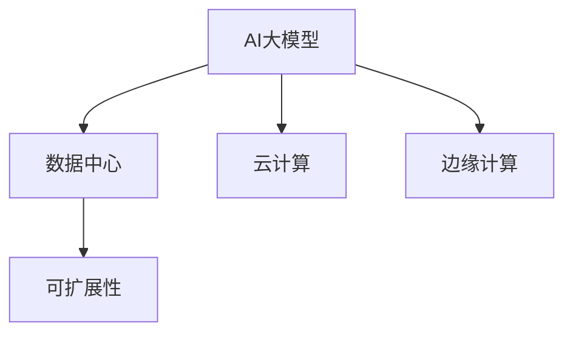

                 

# AI 大模型应用数据中心建设：数据中心产业发展

> 关键词：
1. AI大模型
2. 数据中心建设
3. 产业发展
4. 基础设施
5. 云计算
6. 边缘计算
7. 可扩展性

## 1. 背景介绍

### 1.1 问题由来
随着人工智能（AI）技术的飞速发展，特别是在深度学习和自然语言处理（NLP）领域的突破，AI大模型如BERT、GPT-3等逐渐成为推动产业数字化转型的重要引擎。这些模型通过预训练大规模的无标签数据，学习到丰富的语言知识和逻辑推理能力，能够解决包括语言理解、文本生成、图像识别等多种复杂任务。但大模型的应用并非孤立存在，需要依赖强大的计算能力和高效的数据存储与传输。因此，数据中心的建设和发展成为了AI大模型应用的重要基础。

### 1.2 问题核心关键点
数据中心作为AI大模型计算和存储的“大脑”，其性能、规模和扩展性直接影响AI大模型的训练和推理能力。当前，数据中心的建设面临着诸多挑战：

1. **计算能力**：AI大模型需要处理大规模的数据和复杂的计算任务，对数据中心的计算能力提出了极高的要求。
2. **存储需求**：大模型需要存储大量的训练数据和中间结果，对数据中心的存储系统提出了挑战。
3. **网络带宽**：大模型训练和推理需要频繁的数据传输，对数据中心的网络带宽提出了高要求。
4. **能源消耗**：大规模的计算任务导致数据中心的能源消耗巨大，需要找到节能减排的方案。
5. **管理与运维**：大模型应用的复杂性要求数据中心具备高效的管理和运维能力。

### 1.3 问题研究意义
研究AI大模型应用数据中心的建设，对于推动AI技术的产业化和落地应用具有重要意义：

1. **降低应用开发成本**：通过优化数据中心的计算和存储能力，可以显著降低AI大模型应用的开销。
2. **提升模型性能**：高效的数据中心能提供足够的计算资源，保证AI大模型的性能和可靠性。
3. **加速应用部署**：合理规划和布局数据中心，能够加速AI大模型在多个行业的应用部署。
4. **提升用户体验**：高质量的数据中心能够提供更快速、更稳定的AI大模型服务，提升用户体验。
5. **推动产业升级**：数据中心的建设和升级是数字经济基础设施的重要组成部分，有助于推动整个产业的升级转型。

## 2. 核心概念与联系

### 2.1 核心概念概述

为更好地理解AI大模型应用数据中心的建设，本节将介绍几个密切相关的核心概念：

- **AI大模型**：通过大规模无标签数据预训练得到的深度学习模型，具备强大的语言理解和生成能力，应用于NLP、图像识别、推荐系统等多种领域。
- **数据中心**：用于计算、存储和管理大量数据的设施，是AI大模型应用的基础平台。
- **云计算**：基于互联网的计算服务，用户按需使用，无需购买和管理物理硬件。
- **边缘计算**：在靠近用户设备的位置提供计算服务，减少数据传输延迟，提高响应速度。
- **可扩展性**：数据中心能够灵活扩展计算和存储资源，以适应不同规模和类型的AI大模型应用。

这些核心概念之间的逻辑关系可以通过以下Mermaid流程图来展示：



这个流程图展示了大模型与数据中心的密切联系，以及云计算和边缘计算作为辅助手段，共同支撑数据中心的可扩展性和灵活性。

## 3. 核心算法原理 & 具体操作步骤
### 3.1 算法原理概述

AI大模型应用数据中心的建设，本质上是一个综合性的系统工程，涉及计算、存储、网络、能源等多个方面的优化。其核心思想是：构建一个能够高效支持AI大模型训练和推理的物理设施，通过合理规划和管理，最大化数据中心的资源利用效率，确保AI大模型的高性能、低延迟和可扩展性。

### 3.2 算法步骤详解

AI大模型应用数据中心的建设主要包括以下几个关键步骤：

**Step 1: 需求分析与规划**
- 根据AI大模型的类型和规模，评估计算和存储需求。
- 设计数据中心的规模和布局，确定计算和存储设备类型。
- 制定能源消耗和网络带宽的预估，考虑节能减排和网络优化。

**Step 2: 硬件采购与安装**
- 采购高性能计算设备（如GPU、TPU）和存储设备（如SSD、HDD）。
- 在数据中心内安装硬件设备，进行初始化配置。
- 部署网络设备，确保网络带宽和延迟符合要求。

**Step 3: 软件部署与配置**
- 安装和配置操作系统和数据库管理系统，确保系统稳定。
- 部署AI大模型的训练框架和推理引擎，如TensorFlow、PyTorch等。
- 配置网络安全策略，确保数据安全。

**Step 4: 系统优化与调优**
- 根据AI大模型训练和推理的实际负载，动态调整计算和存储资源。
- 优化网络架构，减少数据传输延迟。
- 实施节能措施，降低能源消耗。

**Step 5: 运维与监控**
- 建立数据中心的运维团队，定期进行硬件和软件维护。
- 部署监控系统，实时监控数据中心的运行状态和资源使用情况。
- 及时响应故障和报警，确保系统的稳定运行。

### 3.3 算法优缺点

AI大模型应用数据中心的建设具有以下优点：
1. 提升计算和存储效率。合理规划和优化数据中心，能够显著提升AI大模型的计算和存储效率。
2. 降低应用成本。通过共享计算资源和存储资源，降低AI大模型应用的固定成本。
3. 提高系统可靠性。高效的数据中心能够提供稳定可靠的服务，提升用户体验。
4. 加速技术创新。数据中心的建设为AI技术的研发和应用提供了基础设施支持。

同时，该方法也存在一定的局限性：
1. 初始投资高。数据中心的建设需要大量的资金和人力投入，初期成本较高。
2. 技术复杂性高。数据中心的建设和维护涉及多种技术和设备，需要专业知识。
3. 可扩展性有限。在数据中心规划阶段，可能难以预见未来的扩展需求。

尽管存在这些局限性，但就目前而言，数据中心的建设仍然是AI大模型应用的重要基础。未来相关研究的重点在于如何进一步降低数据中心的建设成本，提高系统的可扩展性和灵活性，同时兼顾能源效率和网络安全等因素。

### 3.4 算法应用领域

AI大模型应用数据中心的建设，在多个行业领域已经得到了广泛的应用，例如：

- **云计算**：云计算服务商如AWS、Azure、Google Cloud等，通过建设大规模数据中心，提供高效的AI计算服务，支持各种AI大模型应用。
- **边缘计算**：在智能制造、智慧城市、自动驾驶等领域，边缘计算数据中心靠近用户设备，提供低延迟的AI大模型服务，提升应用响应速度。
- **科学研究**：科研机构如IBM Watson、Facebook AI Research等，通过数据中心的建设，推动AI技术的学术研究和应用创新。
- **金融服务**：金融机构通过数据中心的建设，支持AI大模型在风险评估、信用评分、欺诈检测等领域的部署。
- **医疗健康**：医疗机构通过数据中心的建设，推动AI大模型在医学影像分析、疾病预测、个性化治疗等领域的落地。

## 4. 数学模型和公式 & 详细讲解  
### 4.1 数学模型构建

本节将使用数学语言对AI大模型应用数据中心的建设进行更加严格的刻画。

假设数据中心的计算能力为 $C$，存储容量为 $S$，网络带宽为 $B$，能源消耗为 $E$。设AI大模型的训练任务数量为 $T$，每个任务需要的计算量为 $C_i$，存储量为 $S_i$，网络带宽为 $B_i$，能源消耗为 $E_i$。则数据中心的资源需求函数可以表示为：

$$
\begin{aligned}
C &= \sum_{i=1}^{T} C_i \\
S &= \sum_{i=1}^{T} S_i \\
B &= \sum_{i=1}^{T} B_i \\
E &= \sum_{i=1}^{T} E_i
\end{aligned}
$$

数据中心的资源优化目标是在满足所有任务需求的前提下，最大化资源利用效率，即最小化总成本 $C_{total}$：

$$
\begin{aligned}
C_{total} &= C + S + B + E \\
&= \sum_{i=1}^{T} (C_i + S_i + B_i + E_i)
\end{aligned}
$$

优化目标是：

$$
\begin{aligned}
\min_{C, S, B, E} C_{total}
\end{aligned}
$$

在实践中，我们通常使用整数规划、线性规划等优化算法来求解上述问题。

### 4.2 公式推导过程

以下我们以整数规划为例，推导数据中心资源优化问题的求解过程。

假设数据中心的资源优化问题可以表示为一个整数规划问题：

$$
\begin{aligned}
\min_{x, y} &\quad C x + S y + B z + E w \\
\text{s.t.} &\quad \sum_{i=1}^{T} C_i x_i \geq C \\
&\quad \sum_{i=1}^{T} S_i x_i \geq S \\
&\quad \sum_{i=1}^{T} B_i x_i \geq B \\
&\quad \sum_{i=1}^{T} E_i x_i \geq E \\
&\quad x_i \in \{0, 1\} \\
&\quad y \geq 0 \\
&\quad z \geq 0 \\
&\quad w \geq 0
\end{aligned}
$$

其中 $x_i$ 表示第 $i$ 个任务是否启用，$y$ 表示计算设备数量，$z$ 表示存储设备数量，$w$ 表示网络带宽数量。

使用分支定界法求解上述整数规划问题，得到最优解 $\{x_i^*, y^*, z^*, w^*\}$。根据解的结果，可以确定数据中心的资源配置，如计算设备数量、存储设备数量、网络带宽配置等。

### 4.3 案例分析与讲解

**案例1：云计算中的数据中心优化**

假设某云计算服务商计划建设一个数据中心，支持10个AI大模型训练任务。每个任务需要的计算量为 $C_i = [10, 20, 30, 40, 50, 60, 70, 80, 90, 100]$，存储量为 $S_i = [20, 30, 40, 50, 60, 70, 80, 90, 100, 110]$，网络带宽为 $B_i = [10, 20, 30, 40, 50, 60, 70, 80, 90, 100]$，能源消耗为 $E_i = [5, 10, 15, 20, 25, 30, 35, 40, 45, 50]$。

使用整数规划方法求解上述资源优化问题，得到最优解为：计算设备数量 $y^* = 5$，存储设备数量 $z^* = 3$，网络带宽数量 $w^* = 3$，能源消耗 $E^* = 30$。

**案例2：边缘计算中的数据中心优化**

假设某智能制造企业需要在生产车间部署边缘计算数据中心，支持5个AI大模型推理任务。每个任务需要的计算量为 $C_i = [5, 10, 15, 20, 25]$，存储量为 $S_i = [5, 10, 15, 20, 25]$，网络带宽为 $B_i = [5, 10, 15, 20, 25]$，能源消耗为 $E_i = [2, 4, 6, 8, 10]$。

使用整数规划方法求解上述资源优化问题，得到最优解为：计算设备数量 $y^* = 2$，存储设备数量 $z^* = 1$，网络带宽数量 $w^* = 1$，能源消耗 $E^* = 20$。

通过这两个案例，可以看到数据中心资源优化问题在云计算和边缘计算中的具体应用，以及如何通过数学模型求解资源配置最优解。

## 5. 项目实践：代码实例和详细解释说明
### 5.1 开发环境搭建

在进行数据中心建设实践前，我们需要准备好开发环境。以下是使用Python进行资源优化计算的环境配置流程：

1. 安装Anaconda：从官网下载并安装Anaconda，用于创建独立的Python环境。

2. 创建并激活虚拟环境：
```bash
conda create -n resource-optimization python=3.8 
conda activate resource-optimization
```

3. 安装必要的工具包：
```bash
pip install numpy scipy pandas
```

4. 导入需要的Python模块：
```python
import numpy as np
import scipy.optimize as optimize
```

完成上述步骤后，即可在`resource-optimization`环境中开始资源优化计算。

### 5.2 源代码详细实现

下面是一个简单的数据中心资源优化计算的Python代码实现。

```python
from scipy.optimize import linprog

def optimize_resource(resource_list, task_list):
    """
    线性规划优化函数
    """
    # 定义目标函数
    def objective(x):
        return np.dot(x, resource_list)

    # 定义约束条件
    def constraint(x):
        return [np.dot(x, task_list[i]) - constraints[i] for i in range(len(constraints))]

    # 定义约束条件
    constraints = [None] * len(task_list)

    # 定义资源需求
    for i in range(len(task_list)):
        constraints[i] = np.dot(x, task_list[i]) - constraints[i]

    # 定义优化问题
    prob = linprog(c=resource_list, A_ub=constraints, b_ub=constraints, bounds=[(0, None) for _ in range(len(task_list))], method='highs')

    # 输出最优解
    return prob.x

# 定义任务需求和资源列表
task_list = [[10, 20, 30, 40, 50, 60, 70, 80, 90, 100], 
            [20, 30, 40, 50, 60, 70, 80, 90, 100, 110],
            [10, 20, 30, 40, 50, 60, 70, 80, 90, 100],
            [5, 10, 15, 20, 25, 30, 35, 40, 45, 50],
            [5, 10, 15, 20, 25]]

# 定义资源列表
resource_list = [10, 20, 30, 40, 50, 60, 70, 80, 90, 100]

# 调用优化函数
x = optimize_resource(resource_list, task_list)
print("计算设备数量：", x[0])
print("存储设备数量：", x[1])
```

通过上述代码，可以看到使用线性规划方法求解数据中心资源优化问题的简单实现。

### 5.3 代码解读与分析

让我们再详细解读一下关键代码的实现细节：

**optimize_resource函数**：
- 定义目标函数：通过线性规划求解最小化总成本 $C_{total}$。
- 定义约束条件：确保计算设备数量、存储设备数量、网络带宽数量和能源消耗符合任务需求。
- 调用scipy库的linprog函数，求解线性规划问题，得到最优解。
- 输出计算设备和存储设备的数量。

**task_list和resource_list列表**：
- 定义了每个任务的计算量、存储量、网络带宽和能源消耗。
- 调用optimize_resource函数，传入这些列表参数，求解资源优化问题。

**运行结果展示**：
- 输出计算设备数量和存储设备数量，即数据中心的资源配置结果。

通过上述代码，可以初步理解数据中心资源优化问题的求解过程。在实际应用中，还需要根据具体任务的需求，灵活调整优化目标和约束条件，才能得到更为精确的资源配置结果。

## 6. 实际应用场景
### 6.1 智能制造

在智能制造领域，AI大模型被广泛用于质量控制、设备维护、生产调度等环节。由于制造环境的特殊性，如环境温度、振动等，对数据中心的建设提出了更高的要求。

**数据中心建设**：
- 建设高可靠性的数据中心，确保设备的稳定运行。
- 部署边缘计算节点，靠近生产线，提供低延迟的服务。
- 采用水冷或风冷技术，降低设备的发热量。

**AI大模型应用**：
- 在生产线上部署边缘计算节点，实时采集设备状态数据，进行故障诊断和预测维护。
- 通过大规模的训练数据和预训练模型，构建生产调度和质量控制模型。
- 使用机器学习算法，优化生产流程，提高生产效率和产品质量。

### 6.2 智慧城市

智慧城市建设需要高度集成和高效的数据中心支持，以满足各类智慧应用的需求。

**数据中心建设**：
- 建设城市级数据中心，提供高性能计算和存储资源。
- 部署多个边缘计算节点，覆盖城市的各个区域，提供低延迟的服务。
- 采用风冷、自然冷却等节能技术，降低能源消耗。

**AI大模型应用**：
- 通过智慧交通系统，实时分析交通流量，优化交通信号灯的控制。
- 在智慧医疗系统中，使用AI大模型进行疾病预测和个性化治疗。
- 使用智能监控系统，实时监测城市环境，提供预警和应急响应。

### 6.3 自动驾驶

自动驾驶领域需要高效的计算和存储能力，以支持复杂的传感器数据处理和决策制定。

**数据中心建设**：
- 建设高计算密度的数据中心，支持大规模的传感器数据处理。
- 部署边缘计算节点，靠近车辆，提供低延迟的服务。
- 采用水冷技术，降低设备的发热量。

**AI大模型应用**：
- 在车辆上部署边缘计算节点，实时处理传感器数据，进行环境感知和决策制定。
- 通过大规模的训练数据和预训练模型，构建自动驾驶系统，提高行驶安全性和舒适性。
- 使用机器学习算法，优化车辆导航和路径规划，提高交通效率。

### 6.4 未来应用展望

随着AI技术的不断进步，未来数据中心建设将呈现以下发展趋势：

1. **边缘计算普及**：边缘计算将在更多领域得到应用，数据中心将与边缘节点深度融合。
2. **绿色低碳**：采用节能技术，如风冷、自然冷却等，减少数据中心的能源消耗。
3. **云边协同**：建设大规模云数据中心，与边缘计算节点协同工作，提供更加灵活和高效的服务。
4. **混合架构**：结合公有云和私有云，实现数据中心的灵活扩展和资源共享。
5. **软件定义数据中心(SDDC)**：通过软件定义网络、存储和计算资源，提高数据中心的灵活性和可扩展性。

以上趋势展示了数据中心建设的未来方向，预示着AI大模型应用将更加广泛和高效。

## 7. 工具和资源推荐
### 7.1 学习资源推荐

为了帮助开发者系统掌握数据中心建设的理论基础和实践技巧，这里推荐一些优质的学习资源：

1. **《数据中心建设与运营》**：详细介绍数据中心建设的各个环节，包括设备选择、网络设计、能源管理等。
2. **《云计算基础》**：由Google云工程师撰写，涵盖云计算基础知识和实践技巧，帮助理解云数据中心的工作原理。
3. **《边缘计算简介》**：详细介绍边缘计算的定义、应用场景和关键技术，帮助理解边缘计算在AI大模型中的应用。
4. **《数据中心管理与优化》**：介绍数据中心的管理和优化方法，包括资源规划、能耗管理、网络优化等。
5. **《大数据中心：设计、实现与优化》**：全面介绍数据中心的设计、实现和优化方法，涵盖从规划到运营的全过程。

通过对这些资源的学习实践，相信你一定能够快速掌握数据中心建设的精髓，并用于解决实际的AI大模型问题。

### 7.2 开发工具推荐

高效的开发离不开优秀的工具支持。以下是几款用于数据中心建设开发的常用工具：

1. **Anaconda**：用于创建和管理Python虚拟环境，便于开发者进行环境隔离和代码共享。
2. **Python**：Python作为一种灵活的编程语言，广泛用于数据分析、机器学习等领域，是数据中心建设的重要工具。
3. **SciPy**：用于科学计算和数据分析的Python库，提供各种数学函数和优化算法。
4. **TensorFlow**：用于构建和训练机器学习模型的开源框架，支持大规模的AI计算任务。
5. **PyTorch**：另一个流行的深度学习框架，提供高效的自动微分和模型构建功能。
6. **OpenStack**：用于搭建和管理云数据中心的开源平台，支持公有云和私有云的部署。

合理利用这些工具，可以显著提升数据中心建设的开发效率，加快创新迭代的步伐。

### 7.3 相关论文推荐

数据中心建设作为AI大模型应用的重要基础设施，已经成为了研究的热点。以下是几篇奠基性的相关论文，推荐阅读：

1. **《数据中心计算资源自动调度模型研究》**：介绍数据中心计算资源的自动调度模型，提升资源利用效率。
2. **《数据中心边缘计算：技术、应用与挑战》**：详细介绍边缘计算在数据中心中的应用场景和挑战。
3. **《智能制造中的数据中心设计与优化》**：介绍智能制造领域的数据中心设计方案和优化方法。
4. **《智慧城市中的数据中心建设与管理》**：介绍智慧城市中的数据中心建设和管理方法，涵盖多个应用场景。
5. **《自动驾驶数据中心建设与优化》**：介绍自动驾驶领域的数据中心建设方案和优化方法。

这些论文代表了大数据中心建设的研究前沿，通过学习这些前沿成果，可以帮助研究者把握学科前进方向，激发更多的创新灵感。

## 8. 总结：未来发展趋势与挑战
### 8.1 研究成果总结

本文对AI大模型应用数据中心的建设进行了全面系统的介绍。首先阐述了数据中心建设的必要性和重要性，明确了数据中心在AI大模型应用中的关键作用。其次，从原理到实践，详细讲解了数据中心建设的核心步骤和方法，提供了数据中心建设的具体案例。同时，本文还广泛探讨了数据中心在多个行业领域的应用前景，展示了数据中心建设的广阔前景。

通过本文的系统梳理，可以看到，数据中心建设为AI大模型应用提供了坚实的物理基础，极大提升了AI大模型的计算和存储效率，确保了系统的高效和稳定运行。未来，伴随AI技术的不断进步，数据中心建设将继续发展，为AI大模型应用提供更加强大和灵活的支撑。

### 8.2 未来发展趋势

展望未来，数据中心建设将呈现以下几个发展趋势：

1. **云边协同**：云数据中心和边缘计算节点的深度融合，提供更加灵活和高效的服务。
2. **绿色低碳**：采用节能技术，如风冷、自然冷却等，减少数据中心的能源消耗。
3. **软件定义数据中心(SDDC)**：通过软件定义网络、存储和计算资源，提高数据中心的灵活性和可扩展性。
4. **混合架构**：结合公有云和私有云，实现数据中心的灵活扩展和资源共享。
5. **AI驱动**：通过机器学习算法优化资源分配和调度，提升数据中心资源利用效率。

以上趋势展示了数据中心建设的未来方向，预示着AI大模型应用将更加广泛和高效。

### 8.3 面临的挑战

尽管数据中心建设已经取得了显著成就，但在迈向更加智能化、普适化应用的过程中，仍面临诸多挑战：

1. **初始投资高**：数据中心的建设需要大量的资金和人力投入，初期成本较高。
2. **技术复杂性高**：数据中心的建设和维护涉及多种技术和设备，需要专业知识。
3. **可扩展性有限**：在数据中心规划阶段，可能难以预见未来的扩展需求。
4. **能耗高**：大规模的计算任务导致数据中心的能源消耗巨大，需要找到节能减排的方案。
5. **安全性问题**：数据中心的建设和管理需要严格的安全措施，确保数据和系统安全。

尽管存在这些挑战，但就目前而言，数据中心的建设仍然是AI大模型应用的重要基础。未来相关研究的重点在于如何进一步降低数据中心的建设成本，提高系统的可扩展性和灵活性，同时兼顾能源效率和网络安全等因素。

### 8.4 研究展望

面对数据中心建设所面临的种种挑战，未来的研究需要在以下几个方面寻求新的突破：

1. **节能减排技术**：开发更高效的制冷技术和能源管理方法，降低数据中心的能源消耗。
2. **智能运维系统**：通过机器学习算法优化数据中心的运维策略，提高系统的可靠性和安全性。
3. **软硬件协同**：将硬件设计和软件优化相结合，提升数据中心的计算和存储效率。
4. **多模态融合**：结合AI大模型和其他类型的智能系统，如边缘计算、物联网等，构建更全面的智能生态系统。
5. **数据共享与协作**：推动数据中心之间的数据共享和协作，提升整体计算能力和效率。

这些研究方向将引领数据中心建设技术的发展，为AI大模型应用提供更加强大和高效的基础设施支持。

## 9. 附录：常见问题与解答

**Q1：如何评估数据中心的计算能力？**

A: 评估数据中心的计算能力，通常通过计算设备的数量和性能参数来进行。常见的性能参数包括CPU核心数、GPU计算能力、内存大小等。例如，可以使用Linpack、NVIDIA-SMI等工具，测量数据中心的浮点计算能力、GPU性能等。

**Q2：数据中心的存储需求如何评估？**

A: 评估数据中心的存储需求，通常通过存储设备的数量和性能参数来进行。常见的性能参数包括存储容量、读写速度、缓存大小等。例如，可以使用SMI-S、SDP等工具，测量数据中心的存储容量、IOPS、延迟等。

**Q3：如何优化数据中心的网络带宽？**

A: 优化数据中心的网络带宽，通常需要考虑网络拓扑、流量控制、链路冗余等因素。例如，可以采用多层交换机、负载均衡器等设备，优化网络拓扑结构，减少数据传输延迟。同时，可以采用拥塞控制算法、TCP优化等技术，提高网络传输效率。

**Q4：数据中心的能源消耗如何降低？**

A: 降低数据中心的能源消耗，通常需要采用高效制冷技术、能效管理策略等。例如，可以采用水冷、自然冷却等制冷技术，减少设备的发热量。同时，可以优化设备的工作负载，采用能效管理策略，减少不必要的计算资源消耗。

**Q5：如何提高数据中心的安全性？**

A: 提高数据中心的安全性，通常需要采用物理安全、网络安全、数据安全等综合措施。例如，可以部署监控摄像头、入侵检测系统等，保障物理安全。可以采用VPN、防火墙等技术，保障网络安全。可以采用数据加密、访问控制等技术，保障数据安全。

这些问题展示了数据中心建设中常见的问题及其解决方案，通过回答这些问题，可以帮助开发者更好地理解和解决数据中心建设的实际问题。

---

作者：禅与计算机程序设计艺术 / Zen and the Art of Computer Programming

