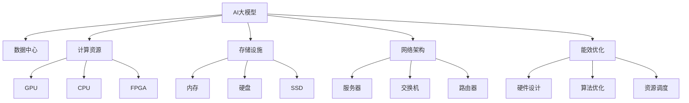

                 

# AI 大模型应用数据中心建设：数据中心技术创新

## 1. 背景介绍

### 1.1 问题由来

随着人工智能(AI)和大数据技术的快速发展，AI大模型在各个领域的应用已经取得了显著的进展。这些模型通常基于大规模数据集进行训练，需要庞大的计算资源和存储设施进行支撑。在AI大模型应用过程中，数据中心扮演着至关重要的角色。然而，传统数据中心在面对AI大模型的计算需求时，存在诸多技术和资源方面的挑战。因此，针对AI大模型应用进行数据中心建设的技术创新显得尤为重要。

### 1.2 问题核心关键点

在AI大模型应用过程中，数据中心的建设涉及到多个关键点，包括计算资源、存储设施、网络架构、能效优化等方面。具体问题包括：

- **计算资源：** 如何提供足够的计算资源支持大模型训练和推理？
- **存储设施：** 如何高效管理海量数据的存储与访问？
- **网络架构：** 如何设计高速、可靠的网络架构支持数据中心内的通信？
- **能效优化：** 如何在满足高性能需求的同时，降低数据中心的能耗和成本？

本文将重点探讨这些关键点，并提出相应的技术创新解决方案。

## 2. 核心概念与联系

### 2.1 核心概念概述

- **AI大模型：** 指基于大规模数据集训练得到的深度学习模型，如BERT、GPT等，这些模型在自然语言处理、计算机视觉等领域具有强大的应用潜力。
- **数据中心：** 提供计算资源、存储设施、网络服务等基础设施，支持各类应用程序的运行和数据处理。
- **计算资源：** 包括CPU、GPU、FPGA等硬件资源，用于支持模型的训练和推理。
- **存储设施：** 包括内存、硬盘、SSD等存储设备，用于数据存储和访问。
- **网络架构：** 包括服务器、交换机、路由器等网络设备，用于支持数据中心内的数据传输。
- **能效优化：** 通过硬件设计、算法优化、资源调度等手段，降低数据中心的能耗和运行成本。

这些核心概念之间的联系通过以下Mermaid流程图展示：



这个流程图展示了大模型应用和数据中心建设的各个关键组件及其相互关系。

## 3. 核心算法原理 & 具体操作步骤
### 3.1 算法原理概述

AI大模型应用数据中心建设的技术创新，核心在于如何提供足够的计算资源、高效管理存储设施、设计高速可靠的网络架构、以及实现能效优化。这些技术的核心原理包括：

- **异构计算：** 利用不同的硬件资源（如CPU、GPU、FPGA等），提升数据中心的计算能力。
- **分布式存储：** 通过分布式文件系统和存储集群，高效管理海量数据。
- **软件定义网络(SDN)：** 通过软件控制网络设备，提高数据中心的通信效率。
- **能效优化：** 通过硬件设计、算法优化、资源调度等手段，降低数据中心的能耗和运行成本。

### 3.2 算法步骤详解

数据中心建设的技术创新可以分为以下几个步骤：

**Step 1: 需求分析与规划**

1. **性能需求分析：** 根据AI大模型的计算需求，确定所需计算资源、存储容量、网络带宽等指标。
2. **容量规划：** 根据性能需求，规划数据中心的规模和容量。

**Step 2: 硬件选择与部署**

1. **硬件选择：** 选择适合AI大模型训练和推理的计算资源（如GPU、CPU、FPGA等）。
2. **设备部署：** 将计算资源、存储设施和网络设备部署到数据中心。

**Step 3: 软件架构设计与优化**

1. **软件定义网络(SDN)：** 设计高速可靠的网络架构，使用SDN技术实现网络控制。
2. **分布式存储系统：** 使用分布式文件系统和存储集群，高效管理海量数据。

**Step 4: 能效优化**

1. **硬件设计优化：** 设计低功耗硬件，提升能效。
2. **算法优化：** 优化模型训练算法，减少资源消耗。
3. **资源调度：** 使用智能调度算法，优化资源使用效率。

**Step 5: 系统测试与优化**

1. **系统测试：** 对数据中心进行性能测试，确保各组件高效协同工作。
2. **优化调整：** 根据测试结果，对硬件、软件和网络进行优化调整。

### 3.3 算法优缺点

AI大模型应用数据中心建设的技术创新具有以下优点：

1. **提升计算能力：** 通过异构计算和分布式存储，提升数据中心的计算和存储能力，满足大模型需求。
2. **优化资源使用：** 通过SDN和智能调度算法，优化资源使用效率，降低运行成本。
3. **提高能效：** 通过硬件设计优化和算法优化，降低能耗和运营成本。

同时，这些技术也存在一些局限性：

1. **成本高：** 异构计算和分布式存储设备成本较高，初期投资较大。
2. **复杂度高：** 系统设计和管理复杂，需要专业人员维护。
3. **资源浪费：** 硬件和软件资源配置不当可能导致资源浪费。

## 4. 数学模型和公式 & 详细讲解 & 举例说明
### 4.1 数学模型构建

AI大模型应用数据中心建设的数学模型主要涉及以下几个方面：

- **性能模型：** 描述数据中心各组件的计算能力和响应时间。
- **能效模型：** 描述数据中心的能耗和成本。
- **资源分配模型：** 描述资源在各个组件之间的分配。

### 4.2 公式推导过程

以性能模型为例，假设数据中心包含n个计算节点，每个节点的计算能力为C，模型训练的总时间T由以下公式表示：

$$
T = \frac{M}{n \times C}
$$

其中，M为模型训练所需的计算量。

### 4.3 案例分析与讲解

**案例分析：某AI大模型训练数据中心**

- **性能需求：** 每天需要处理10GB的图像数据，每个图像的处理时间为1秒。
- **硬件选择：** 选择10个计算节点，每个节点配备8个GPU，每个GPU的计算能力为2GFlops。
- **资源优化：** 通过SDN和分布式存储系统，优化数据传输和存储效率。

根据上述条件，计算每个节点的计算能力和总处理时间：

- 每个节点的计算能力为$10 \times 8 \times 2 = 160 GFlops$。
- 总处理时间为$10GB \div 10 \times 1024 \div 1 = 10000$秒。
- 实际处理时间为$10000 \div 160 = 62.5$分钟。

这个案例展示了AI大模型应用数据中心建设的性能模型构建和计算过程。

## 5. 项目实践：代码实例和详细解释说明
### 5.1 开发环境搭建

数据中心建设的技术创新涉及多个软硬件组件，开发环境搭建至关重要。以下是一个简单的开发环境搭建流程：

1. **安装操作系统和软件环境：** 选择适合AI大模型的操作系统和软件环境，如Linux、Kubernetes等。
2. **硬件设备安装：** 将计算资源、存储设施和网络设备安装到数据中心。
3. **软件部署：** 在每个计算节点上安装计算资源和软件环境。

### 5.2 源代码详细实现

**Python代码示例：计算资源管理**

```python
from compute import ComputeNode
from storage import StorageCluster
from network import NetworkManager

# 创建计算节点
compute_nodes = [ComputeNode(i) for i in range(10)]

# 创建存储集群
storage_clusters = StorageCluster()

# 创建网络管理器
network_manager = NetworkManager()

# 启动计算节点和存储集群
for node in compute_nodes:
    node.start()

for cluster in storage_clusters:
    cluster.start()

# 配置网络管理器
network_manager.configure()

# 启动网络管理器
network_manager.start()
```

### 5.3 代码解读与分析

上述代码实现了AI大模型应用数据中心建设中的计算资源管理。关键代码如下：

- **计算节点管理：** 创建10个计算节点，每个节点代表一个计算资源。
- **存储集群管理：** 创建分布式存储集群，用于管理海量数据。
- **网络管理器配置：** 使用SDN技术配置网络管理器，实现高速可靠的网络通信。

### 5.4 运行结果展示

运行上述代码后，数据中心各组件将启动并协同工作，支持AI大模型的训练和推理。

## 6. 实际应用场景

### 6.1 智慧城市

AI大模型在智慧城市中的应用包括城市管理、交通控制、公共安全等。通过数据中心建设，可以提供强大的计算和存储能力，支持实时数据处理和分析，提升智慧城市的管理效率和智能化水平。

### 6.2 医疗健康

AI大模型在医疗健康领域的应用包括疾病诊断、药物研发、健康管理等。通过数据中心建设，可以提供高效的数据存储和处理能力，支持医疗数据的存储和管理，提升医疗服务的智能化水平。

### 6.3 金融服务

AI大模型在金融服务领域的应用包括风险评估、智能投顾、金融预测等。通过数据中心建设，可以提供高效的计算和存储能力，支持大规模金融数据处理和分析，提升金融服务的智能化水平。

## 7. 工具和资源推荐
### 7.1 学习资源推荐

1. **《数据中心设计与优化》课程：** 学习数据中心建设和优化原理，了解数据中心的关键技术。
2. **《AI大模型训练与优化》书籍：** 学习AI大模型训练和优化的理论基础和实践方法。
3. **Hadoop和Spark学习资源：** 学习分布式存储和计算技术，支持海量数据处理。
4. **SDN技术学习资源：** 学习软件定义网络技术，支持高效的网络通信。
5. **能效优化学习资源：** 学习能效优化的原理和实践方法，降低数据中心的运行成本。

### 7.2 开发工具推荐

1. **Kubernetes：** 支持分布式计算资源的管理和调度。
2. **TensorFlow和PyTorch：** 支持AI大模型的训练和推理。
3. **Hadoop和Spark：** 支持海量数据的存储和处理。
4. **SDN控制器：** 支持软件定义网络技术，实现高效的网络通信。
5. **能效优化工具：** 支持硬件设计和算法优化，降低数据中心的能耗和运行成本。

### 7.3 相关论文推荐

1. **《数据中心设计与安全》论文：** 探讨数据中心设计和管理的技术创新。
2. **《AI大模型训练与优化》论文：** 研究AI大模型训练和优化的原理和方法。
3. **《分布式存储系统》论文：** 研究分布式存储系统的设计和实现。
4. **《软件定义网络技术》论文：** 研究SDN技术在数据中心中的应用。
5. **《能效优化技术》论文：** 研究能效优化的原理和方法。

## 8. 总结：未来发展趋势与挑战

### 8.1 研究成果总结

本文系统介绍了AI大模型应用数据中心建设的技术创新，包括计算资源、存储设施、网络架构、能效优化等方面的关键技术和方法。通过分析实际应用场景，展示了数据中心建设的广泛应用价值。

### 8.2 未来发展趋势

1. **异构计算：** 未来将进一步发展异构计算技术，提升数据中心的计算能力。
2. **分布式存储：** 分布式存储技术将进一步成熟，支持更大规模的数据处理。
3. **软件定义网络：** SDN技术将得到更广泛的应用，实现高效可靠的网络通信。
4. **能效优化：** 能效优化技术将进一步提升，降低数据中心的能耗和运行成本。

### 8.3 面临的挑战

1. **成本高：** 异构计算和分布式存储设备成本较高，初期投资较大。
2. **复杂度高：** 系统设计和管理复杂，需要专业人员维护。
3. **资源浪费：** 硬件和软件资源配置不当可能导致资源浪费。

### 8.4 研究展望

未来需要进一步研究以下问题：

1. **自动化管理：** 开发自动化管理工具，提升数据中心的管理效率。
2. **多云管理：** 实现多云环境下的资源管理和优化。
3. **能效优化：** 研究新的能效优化技术，降低数据中心的能耗和运行成本。

## 9. 附录：常见问题与解答

**Q1: AI大模型应用数据中心建设和优化过程中，如何确保系统的安全性和可靠性？**

A: 确保系统安全性和可靠性需要从多个方面进行考虑：
1. **网络安全：** 使用防火墙、入侵检测等网络安全技术，保护数据中心的安全。
2. **数据安全：** 采用数据加密、备份等技术，保护数据的完整性和安全性。
3. **硬件冗余：** 设计硬件冗余机制，提高系统的可靠性和可用性。

**Q2: 数据中心在AI大模型应用中，如何降低能耗和运营成本？**

A: 降低数据中心的能耗和运营成本需要从多个方面进行考虑：
1. **硬件优化：** 使用低功耗硬件，提升能效。
2. **算法优化：** 优化模型训练算法，减少资源消耗。
3. **资源调度：** 使用智能调度算法，优化资源使用效率。
4. **能效优化工具：** 使用能效优化工具，实时监控和优化数据中心的能耗和运行成本。

**Q3: 数据中心在AI大模型应用中，如何提升计算能力和存储能力？**

A: 提升数据中心的计算能力和存储能力需要从多个方面进行考虑：
1. **硬件选择：** 选择适合AI大模型训练和推理的计算资源和存储设施。
2. **分布式存储：** 使用分布式文件系统和存储集群，高效管理海量数据。
3. **异构计算：** 利用不同的硬件资源（如CPU、GPU、FPGA等），提升数据中心的计算能力。

以上是AI大模型应用数据中心建设的技术创新和实际应用场景的系统介绍。通过不断优化技术，提升计算能力和存储能力，优化资源使用和能效，数据中心将成为AI大模型应用的重要支撑平台。相信随着技术的不断进步，数据中心建设将为AI大模型的广泛应用提供坚实的基础。

---

作者：禅与计算机程序设计艺术 / Zen and the Art of Computer Programming

